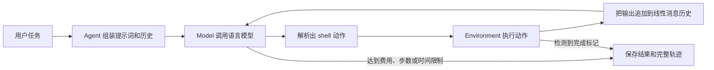

# mini-SWE-agent 项目快速理解与使用指南

## 1. 一句话认识这个项目

mini-SWE-agent 是一个极简的 AI 软件工程智能体：你给它一个开发任务，语言模型分析问题并生成 shell 命令，执行环境运行命令并返回结果，智能体不断重复这个过程，直到完成修改或触发限制。

它的重点不是提供大量专用工具，而是用很短、很容易阅读和替换的代码，把以下四部分组合起来：

- `Agent`：控制“询问模型 → 执行动作 → 记录结果”的循环。
- `Model`：调用语言模型，并把模型回复解析成动作。
- `Environment`：在本机、Docker、Singularity 等环境中执行动作。
- `Run script`：选择并组装前三部分，提供命令行或批量任务入口。

因此，这个项目既可以作为日常修复代码的 CLI，也适合作为智能体研究、模型评测和自定义工程智能体的基础框架。

## 2. 它能做什么

常见用途包括：

- 在当前代码库中定位问题、修改文件并运行测试。
- 根据自然语言要求实现小型功能或补充文档、类型标注和测试。
- 通过 Python API 更换模型、执行环境或控制流程。
- 在 SWE-bench、ProgramBench 等基准上批量运行任务。
- 保存完整运行轨迹，之后查看每次模型回复、命令及执行结果。

它刻意保持简单：默认智能体主要依靠 shell，不为读文件、编辑代码、运行测试等操作分别实现一套复杂工具系统。模型可以直接使用 `rg`、`sed`、`pytest`、`git` 等已有命令完成工作。

## 3. 最快开始使用

### 3.1 环境要求与安装

项目要求 Python 3.10 或更高版本。

如果你正在这个源码仓库中开发，推荐安装开发依赖：

```bash
python -m venv .venv
source .venv/bin/activate
pip install -e '.[dev]'
```

如果只想把它作为工具使用：

```bash
pip install mini-swe-agent
```

也可以不长期安装，在一次性 Python 虚拟环境中运行 CLI：

```bash
uvx mini-swe-agent
```

这里隔离的是 Python 包依赖，不是智能体执行的 shell 命令；`mini` 的默认执行环境仍然是本机。

### 3.2 配置模型

第一次执行 `mini` 时会启动配置向导，也可以主动运行：

```bash
mini-extra config setup
```

向导会让你设置默认模型和对应的 API Key。模型名应带提供商前缀，例如：

```text
anthropic/claude-...
openai/gpt-...
```

也可以直接通过环境变量临时配置：

```bash
export MSWEA_MODEL_NAME='你的提供商/模型名'
export ANTHROPIC_API_KEY='你的密钥'  # 使用 Anthropic 时
# export OPENAI_API_KEY='你的密钥'   # 使用 OpenAI 时
```

全局配置保存在用户配置目录的 `.env` 文件中；`mini` 启动时会打印它的实际路径。系统环境变量优先于该文件中的值。可以用下面的命令维护它：

```bash
mini-extra config set KEY VALUE
mini-extra config unset KEY
mini-extra config edit
```

### 3.3 执行第一个任务

在希望智能体操作的项目目录中运行：

```bash
mini
```

然后输入任务，例如：

```text
运行测试，定位失败原因并修复。完成后重新运行相关测试。
```

也可以直接从命令行传入任务和模型：

```bash
mini -t '为这个项目新增一个健康检查接口，并补充测试'
mini -m '你的提供商/模型名' -t '检查并修复当前失败的测试'
```

常用参数：

| 参数 | 作用 |
| --- | --- |
| `-t` / `--task` | 直接指定任务，不再交互询问 |
| `-m` / `--model` | 指定本次使用的模型 |
| `-c` / `--config` | 加载 YAML 配置文件或键值覆盖项 |
| `-l` / `--cost-limit` | 设置本次运行的费用上限，`0` 表示禁用 |
| `-o` / `--output` | 指定轨迹 JSON 的保存位置 |
| `-y` / `--yolo` | 不经确认直接执行模型提出的命令 |
| `--help` | 查看完整帮助 |

> 安全提示：`mini` 默认使用 `LocalEnvironment`，命令会直接在本机和当前工作目录执行，并不处于沙箱中。首次使用请保留默认的确认模式；只有在信任任务和执行内容时才使用 `--yolo`。处理不可信代码时应选择 Docker、Singularity、Bubblewrap 等隔离环境。

### 3.4 交互模式

`mini` 默认使用 `InteractiveAgent`，支持三种模式：

- `confirm`：默认模式，模型提出命令后由你确认。
- `yolo`：模型提出的命令立即执行。
- `human`：由你接管并输入要执行的命令。

在等待输入时可以使用：

| 命令 | 作用 |
| --- | --- |
| `/c` | 切换到确认模式 |
| `/y` | 切换到自动执行模式 |
| `/u` | 切换到人工命令模式 |
| `/m` | 输入多行反馈 |
| `/h` | 显示帮助 |

运行过程中按 `Ctrl+C` 可以打断当前流程，再补充要求或切换模式。

## 4. 一次任务在内部如何运行

主流程可以概括为：



关键细节：

1. `Agent.run(task)` 使用系统模板和任务模板初始化消息。
2. `Agent.step()` 调用模型，再执行模型回复中的动作。
3. 执行结果被格式化为观察消息，追加到同一个线性历史中。
4. 下一轮模型可以看到之前所有对话、命令和结果。
5. 模型执行 `echo COMPLETE_TASK_AND_SUBMIT_FINAL_OUTPUT` 时，环境把任务标记为完成。
6. 达到费用、步数、时间或连续格式错误限制时，任务也会停止。

每条 shell 动作都在新的子 shell 中运行，所以 `cd` 和 `export` 不会自动延续到下一步；文件修改会保留。需要保持目录或环境变量时，要在同一条命令中组合，例如：

```bash
cd /path/to/project && pytest
```

## 5. 代码结构怎么读

当前仓库使用 `src` 布局，最重要的目录如下：

```text
src/minisweagent/
├── __init__.py          # Agent、Model、Environment 协议和全局配置路径
├── agents/              # 智能体循环与交互控制
├── models/              # 模型后端、回复解析、费用与重试逻辑
├── environments/        # 本机、Docker、Singularity 等命令执行环境
├── run/                 # CLI、工具和基准测试入口
├── config/              # 内置 YAML 配置与提示词模板
└── utils/               # 序列化、日志等通用功能

tests/                   # 按上述模块组织的 pytest 测试
docs/                    # MkDocs 使用文档和 API 参考
```

建议按下面的顺序阅读，最快能建立整体认识：

1. [`src/minisweagent/run/hello_world.py`](src/minisweagent/run/hello_world.py)：最小的 Python 组装示例。
2. [`src/minisweagent/agents/default.py`](src/minisweagent/agents/default.py)：核心循环，项目最重要的文件。
3. [`src/minisweagent/environments/local.py`](src/minisweagent/environments/local.py)：shell 命令如何执行、如何判断任务结束。
4. [`src/minisweagent/models/litellm_model.py`](src/minisweagent/models/litellm_model.py)：默认模型后端如何查询模型。
5. [`src/minisweagent/agents/interactive.py`](src/minisweagent/agents/interactive.py)：确认、自动执行和人工接管如何实现。
6. [`src/minisweagent/run/mini.py`](src/minisweagent/run/mini.py)：CLI 如何读取配置并组装全部组件。
7. [`src/minisweagent/config/mini.yaml`](src/minisweagent/config/mini.yaml)：默认提示词和运行限制。

### 四个核心概念的对应关系

| 概念 | 默认 CLI 使用的实现 | 主要职责 |
| --- | --- | --- |
| Agent | `InteractiveAgent` | 维护历史、控制循环、请求人工确认 |
| Model | 通常自动选择 `LitellmModel` | 调用模型、解析动作、格式化观察 |
| Environment | `LocalEnvironment` | 在当前机器执行 shell 命令 |
| Run script | `run/mini.py` | 解析参数和配置，创建前三个对象 |

`src/minisweagent/__init__.py` 中的三个 `Protocol` 只规定了最小接口。自定义类只要实现相应方法，就可以通过鸭子类型接入，不必继承庞大的基类。这是项目“每个类保持简单，通过多种实现提供灵活性”的核心设计。

## 6. 配置系统

YAML 配置有四个顶层部分：

```yaml
agent:       # 提示词、模式、费用/步数/时间限制、输出路径
model:       # 模型名、模型类、模型参数、动作和观察格式
environment: # 环境类型、工作目录、超时、环境变量
run:         # 入口脚本所需的任务或批处理设置
```

默认 `mini` 使用 [`src/minisweagent/config/mini.yaml`](src/minisweagent/config/mini.yaml)。其中默认费用上限为 3 美元、步数上限为 0（不限制），本地环境单条命令默认超时为 30 秒。

可以叠加多个配置，后面的值递归覆盖前面的值：

```bash
mini \
  -c mini.yaml \
  -c agent.cost_limit=1.5 \
  -c environment.timeout=120 \
  -t '运行测试并修复失败项'
```

一个重要规则是：只要显式传入 `-c`，默认的 `mini.yaml` 就不会自动加入。因此，在只想覆盖少量字段时也要先写 `-c mini.yaml`。

如果常用一套配置，可以复制内置 YAML 后修改，并通过下面的方式运行：

```bash
mini -c /path/to/my-mini.yaml
```

提示词使用 Jinja 模板，例如 `{{task}}` 会被替换为任务描述。环境配置、模型配置和传给 `agent.run()` 的值也可以成为模板变量。

## 7. 通过 Python 使用和扩展

下面的 Python 示例加载与 CLI 相同的 `mini.yaml`，再通过工厂函数组装三个组件：

```python
from minisweagent.agents import get_agent
from minisweagent.config import get_config_from_spec
from minisweagent.environments import get_environment
from minisweagent.models import get_model

config = get_config_from_spec("mini.yaml")
config["model"]["model_name"] = "你的提供商/模型名"
agent = get_agent(
    get_model(config=config["model"]),
    get_environment(config["environment"], default_type="local"),
    config["agent"],
    default_type="interactive",
)
result = agent.run("检查项目中的失败测试并修复")
print(result)
```

扩展时通常有三条路径：

- 继承 `DefaultAgent`，重写 `query()`、`execute_actions()` 或 `step()`，改变控制流。
- 实现新的 `Environment`，把命令送往自有容器、远程机器或沙箱。
- 实现新的 `Model`，接入其他模型 API 或自定义动作格式。

工厂函数也接受完整 Python 导入路径，因此自定义实现不一定需要先合入项目源码。对应入口是：

- `minisweagent.agents.get_agent()`
- `minisweagent.models.get_model()`
- `minisweagent.environments.get_environment()`

## 8. 运行结果与调试

默认 CLI 会把最近一次运行保存为 `last_mini_run.traj.json`，位置在启动时打印的全局配置目录中。轨迹包含：

- 本次运行使用的 agent、model 和 environment 配置。
- 完整消息历史以及每一步动作和输出。
- 模型调用次数和估算费用。
- 最终状态与提交内容。

可以用内置检查器浏览轨迹：

```bash
mini-extra inspector
mini-extra inspector /path/to/file.traj.json
```

开发项目本身时，常用检查命令是：

```bash
pytest -n auto
ruff check .
ruff format --check .
```

## 9. 批量评测入口

项目自带多个批处理入口，它们也是编写自定义运行脚本的好参考：

```bash
mini-extra swebench --help
mini-extra swebench-single --help
mini-extra programbench --help
```

例如并行运行 SWE-bench Verified：

```bash
mini-extra swebench \
  --model '你的提供商/模型名' \
  --subset verified \
  --split test \
  --workers 4
```

基准任务通常应使用 Docker 或其他隔离环境，而不是直接在本机运行。批量结果会包含每个实例的轨迹；SWE-bench 运行还会生成可用于评测的 `preds.json`。

## 10. 常见问题

### 提示没有默认模型

运行：

```bash
mini-extra config setup
```

或者设置 `MSWEA_MODEL_NAME` 和相应提供商的 API Key。

### 模型的命令没有立即执行

这是默认的 `confirm` 模式。按 Enter 确认，或使用 `/y` 切换为自动执行。

### 为什么上一条命令中的 `cd` 或 `export` 失效了

每个动作都由独立的子 shell 执行。把相关操作放进同一条命令，或把环境变量写入配置/文件。

### 如何降低失控费用

使用 `--cost-limit` 或 `agent.cost_limit` 限制单次任务；批量运行还可以设置 `MSWEA_GLOBAL_COST_LIMIT` 和 `MSWEA_GLOBAL_CALL_LIMIT`。

### 如何安全运行陌生任务

不要使用本地 `--yolo`。保留人工确认，或通过 `--environment-class docker` 及相应配置使用隔离环境。容器能力、挂载目录和网络权限仍需要由你根据威胁模型进行限制。

## 11. 建议的学习路径

如果只是使用：完成模型配置，先在一个可丢弃的测试仓库中运行 `mini`，保持确认模式，并用 inspector 查看一次完整轨迹。

如果准备二次开发：先读 `hello_world.py` 和 `default.py`，再分别替换一个 Model、Environment 或 Agent。尽量把新用例做成独立 run script，让入口明确选择组件，这最符合项目的设计方式。

更完整的细节可以继续查看 [`docs/quickstart.md`](docs/quickstart.md)、[`docs/advanced/control_flow.md`](docs/advanced/control_flow.md) 和 [`docs/advanced/cookbook.md`](docs/advanced/cookbook.md)。
