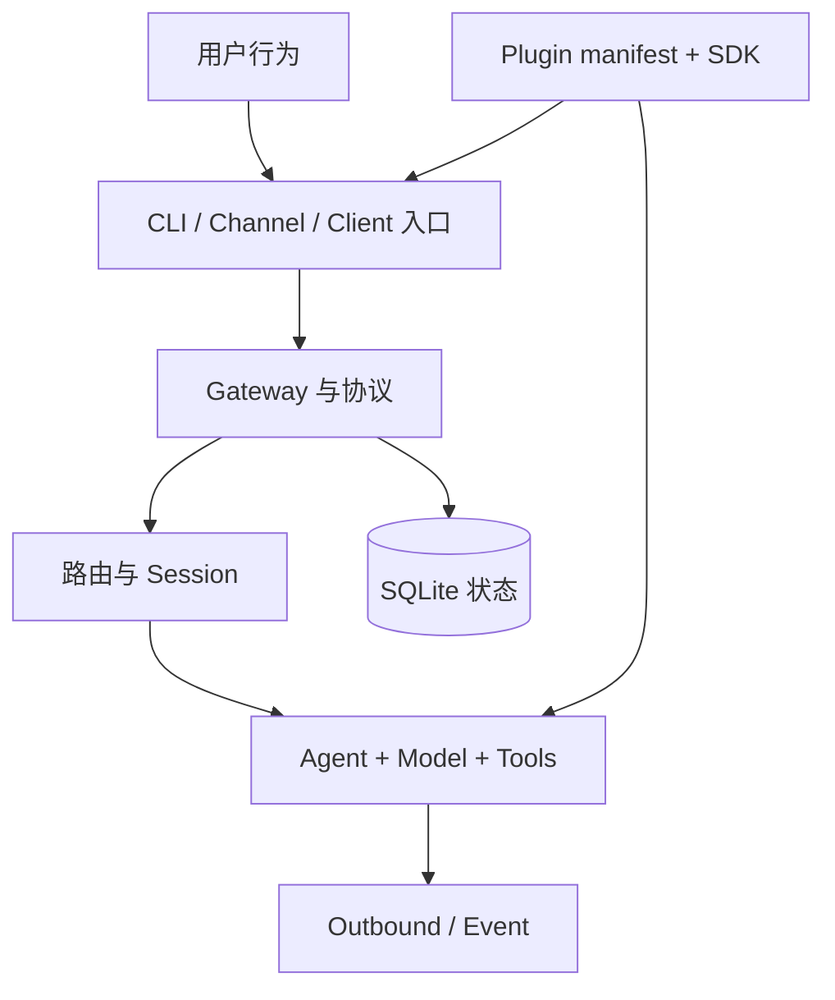

# 00：学习路线与检查点

## 1. 先建立正确预期

OpenClaw 不是一个“调用一次模型 API”的小程序。它同时包含：

- 短生命周期 CLI；
- 长生命周期 Gateway；
- 多频道消息接入和投递；
- Agent、模型、工具和流式事件编排；
- session、context、memory 与持久化；
- 内置和外部插件；
- Web、桌面、移动端与协议客户端；
- 安装、doctor、迁移、打包和发布工具链。

因此，按目录从头读到尾是低效的。更好的方法是选一条用户行为，跨目录追踪它，再回头学习各层抽象。

本教程用三条主线反复交叉：



主线一是控制面：启动、配置、清单、协议和生命周期。主线二是数据面：消息、Agent、工具和输出。主线三是状态面：session、memory、数据库和迁移。

## 2. 开始前的环境检查

先执行只读检查：

```bash
git status -sb
git rev-parse HEAD
node --version
corepack pnpm --version
```

本快照的启动器在 `openclaw.mjs` 明确检查 Node 版本。不要因为“Node 主版本看起来够新”就跳过小版本约束；`node:sqlite` 等运行时能力会随具体小版本变化。

安装依赖和列出官方文档的标准命令是：

```bash
pnpm install
pnpm docs:list
```

如果环境不满足 `package.json#engines`，先切换 Node，而不是修改仓库约束。源码阅读本身可以继续，但不能把失败的测试或构建归因于代码。

## 3. 六阶段路线

### 阶段 A：地图，不深入

目标：知道“问题大致属于哪里”。

阅读：

- `README.md`
- `package.json`
- `pnpm-workspace.yaml`
- `src/entry.ts`
- `docs/concepts/architecture.md`

产出一张自己的目录表，只写“职责”，不要抄文件列表：

| 区域          | 你应写出的职责                                    |
| ------------- | ------------------------------------------------- |
| `src/`        | 核心运行时、CLI、Gateway、Agent、通用频道基础设施 |
| `packages/`   | 独立协议和可复用包                                |
| `extensions/` | 插件实现及其本地依赖                              |
| `ui/`         | Control UI                                        |
| `apps/`       | 原生客户端                                        |
| `docs/`       | 官方用户文档源稿                                  |
| `scripts/`    | 构建、检查、测试和维护脚本                        |

检查点：随机给出一个文件，你能先判断它属于核心、公共包、插件还是产品客户端。

### 阶段 B：启动与控制面

目标：解释进程怎样启动、配置怎样变成运行时事实、Gateway 怎样接受请求。

阅读模块 2–4。至少手绘一次：

```text
openclaw.mjs
  -> dist/entry.js（发布包）或源码运行入口
  -> src/entry.ts
  -> runMainOrRootHelp
  -> runCli
  -> gateway run 快路径 / 常规命令注册
  -> Gateway server
```

检查点：你能解释以下三个问题。

1. 为什么启动器和 TypeScript 入口都做运行时守卫？
2. 为什么帮助、版本和 `gateway run` 有快路径？
3. 为什么配置验证不能只依赖 TypeScript 类型？

### 阶段 C：一条消息的旅程

目标：把“收到文本”拆成 transport、routing、session、queue、agent、delivery。

阅读模块 5–7。先使用官方概念图，再以源码改写为自己的时序图。

检查点：面对重复消息、群聊隔离、慢工具、超时、流式文本等问题时，能指出应查看哪一层，而不是只搜索报错字符串。

### 阶段 D：扩展边界

目标：理解为什么插件不是“随便 import 核心源码”。

阅读模块 8–9。比较：

- manifest 的静态发现；
- Plugin SDK 的稳定能力；
- 插件运行时注册；
- Telegram 的 transport-specific 行为。

检查点：给出一个新需求，例如“给 Telegram 增加按钮”，你能区分 portable action、频道编码和产品命令所有权。

### 阶段 E：状态和证明

目标：知道数据放哪里，并能证明修改没有破坏不变量。

阅读模块 10–11。重点不是背测试命令，而是学会按风险选择证明：

```text
纯函数 -> 单元测试
一个 owner 内的编排 -> 聚焦集成测试
协议/SDK 公开面 -> schema + 类型 + 客户端/兄弟实现
频道用户行为 -> 真实 transport 或可审计 E2E
构建/打包边界 -> build/package proof
```

检查点：你能为一个五行补丁写出“为什么这些测试足够”的说明。

### 阶段 F：实战闭环

目标：从问题陈述走到源码证据、方案、实现和验证。

完成模块 12 中至少三个实验：一个只读追踪、一个小测试、一个小型代码或文档改动。

检查点：另一个维护者只看你的说明，就能复现路径和判断结果。

## 4. 一个六周安排

如果每天投入 60–90 分钟，可以使用下面的节奏：

| 周  | 主题                             | 主要产出                       |
| --- | -------------------------------- | ------------------------------ |
| 1   | 背景、仓库地图、启动             | 启动调用图；20 个核心术语      |
| 2   | 配置、Gateway、协议              | 一个 RPC 的请求/响应/事件追踪  |
| 3   | 消息和 Agent                     | 一条消息的端到端时序图         |
| 4   | session、context、memory、状态库 | 状态所有权表                   |
| 5   | 插件与 Telegram                  | 插件边界图；一个入站与出站追踪 |
| 6   | 测试与实战                       | 三个可复现的实验报告           |

每周最后一天只做复盘：删除错误笔记、补源码链接、把“我猜”改成“由某个类型、测试或调用链证明”。

## 5. 源码阅读记录模板

每次追踪复制下面的模板：

```markdown
## 问题

一句话写出要解释的用户行为。

## 入口

- 文件 + 符号：
- 谁调用它：
- 输入从哪里来：

## 所有者边界

- 谁拥有策略：
- 谁只做适配：
- 哪个 public contract 约束它：

## 调用链

1.
2.
3.

## 状态与副作用

- 内存：
- SQLite：
- 网络：
- 文件：

## 不变量

-

## 证据

- 实现：
- 测试：
- 官方文档：
- 依赖契约（若有）：

## 尚未确认

-
```

“尚未确认”不是失败。它防止你把局部阅读误写成全局结论。

## 6. 常见低效方式

### 只读文件名相似的代码

同一个概念可能跨核心、SDK、插件和协议包。搜索符号的定义、调用者、测试和 sibling，而不是只打开第一个命中文件。

### 只看 diff 或某个函数片段

一个局部修改可能破坏配置升级、协议客户端或另一个频道。至少读完整函数、owner 模块、一个 caller、一个 callee、一个 sibling 和相邻测试。

### 用类型推断运行时安全

TypeScript 类型会在编译后消失。网络帧、配置文件、插件清单和模型工具参数都需要运行时 schema 或显式验证。

### 把所有“记住的信息”都叫 memory

session transcript、当前 context、compaction summary 和 memory search 不是同一个东西。模块 7 会逐一拆开。

### 遇到失败就扩大测试范围

先确认运行时、依赖和命令符合仓库约束。再跑最小复现。大套件只会让环境错误更嘈杂。

## 7. 自我评分

每个阶段按 0–3 分评分：

- 0：只听过术语；
- 1：能指出大致目录；
- 2：能用实现和测试解释一条路径；
- 3：能比较兄弟实现、指出不变量，并设计验证。

不要以“读完页数”计进度。总分达到 15 分以上，并且控制面、Agent、插件、状态四项都至少 2 分，才适合开始中等规模修改。
