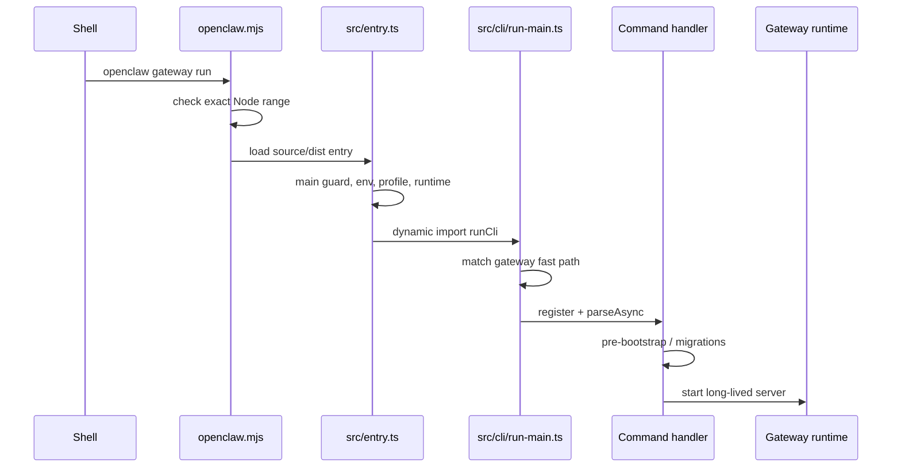

# 02：仓库地图与启动链

本章回答两个问题：代码放在哪里，以及执行 `openclaw ...` 后第一批真正发生的事情是什么。

## 1. 先用所有权读目录

不要把仓库看成一棵平铺文件树。更实用的地图是：

```text
openclaw.mjs             npm/源码 checkout 的 Node 启动 wrapper
src/entry.ts             TypeScript CLI 进程入口
src/cli/                 命令发现、注册、启动策略与交互
src/gateway/             长驻 Gateway 服务和 RPC 方法
src/agents/              Agent 编排、模型、工具、流与上下文
src/config/              配置 schema、加载、验证、写入和迁移入口
src/channels/            核心频道通用契约与基础设施
src/plugins/             插件发现、加载、注册和运行时桥接
src/plugin-sdk/          外部插件可使用的公开 SDK 表面
packages/                协议、规范化等独立工作区包
extensions/              具体插件；Telegram 等频道在这里
ui/                      Control UI
apps/                    原生客户端
scripts/                 仓库工具链
test/                    跨模块测试辅助设施
docs/                    官方用户文档
```

同一个概念跨目录出现很正常。例如 Telegram：

- 通用频道类型和路由 seam 在核心/SDK；
- Telegram 的 token、polling、webhook、按钮编码在插件；
- Gateway 暴露通用控制方法；
- 官方使用说明在 docs。

判断代码应该放哪时，问“谁拥有这个策略”，不要问“哪个目录名字最像”。

## 2. 工作区和 TypeScript 解析

[`pnpm-workspace.yaml`](../../../pnpm-workspace.yaml) 把以下路径纳入同一 workspace：

```yaml
packages:
  - .
  - ui
  - packages/*
  - extensions/*
  - examples/*
```

工作区的作用包括：

- 本地包可通过 workspace 依赖互相引用；
- 锁文件和安装策略集中；
- 每个插件仍能声明自己的依赖和 package metadata；
- 构建与测试可以按 owner 分 lane。

[`tsconfig.json`](../../../tsconfig.json) 使用严格检查、ES2023 target、NodeNext 模块解析，并为公开 SDK/package 定义路径别名。路径别名不是绕过所有权的许可证；允许解析不代表架构上允许 import。

## 3. 第一层入口：`openclaw.mjs`

[`openclaw.mjs`](../../../openclaw.mjs#L11-L72) 是普通 JavaScript wrapper，最早执行，因此不能依赖尚未确认可用的 TypeScript 构建或完整运行时。

它首先明确版本区间：

```js
const MIN_NODE_22 = { major: 22, minor: 22, patch: 3 };
const MIN_NODE_24 = { major: 24, minor: 15, patch: 0 };
const MIN_NODE_25 = { major: 25, minor: 9, patch: 0 };

ensureSupportedRuntimeVersion();
```

这里有两个值得学习的设计点。

第一，失败要尽早。若 Node 缺少所需运行时能力，等到深层模块报 `Cannot find ...` 或 API 不存在，用户会得到误导性错误。

第二，安装工具和执行 runtime 被区分。错误文案说明 Bun 仍可用于安装和 package scripts，但 OpenClaw runtime 需要 Node 的 `node:sqlite`。

启动器随后判断自己在源码 checkout 还是发布安装中，并处理 compile cache、入口产物和子进程。阅读完整文件时，给每个分支标记三类职责：

- 环境/版本防线；
- 源码与发布产物选择；
- 进程重启和 compile cache 生命周期。

不要把 wrapper 当业务入口；它的任务是安全地把进程交给业务入口。

## 4. 第二层入口：`src/entry.ts`

[`src/entry.ts`](../../../src/entry.ts#L49-L79) 先检查当前模块是否真的是主入口：

```ts
if (!isMainModule({ currentFile, wrapperEntryPairs })) {
  // 被其他 bundle 作为依赖导入时，不执行入口副作用
} else {
  normalizeEnv();
  const { assertSupportedRuntime } = await import("./infra/runtime-guard.js");
  assertSupportedRuntime();
  // ...
}
```

源码注释给出了不变量：bundler 可能把 `entry.js` 当共享依赖导入；如果无条件执行顶层逻辑，会启动第二个 Gateway，随后因锁或端口冲突而崩溃。

这是“注释解释 why”的好例子。它没有复述 `if`，而是记录跨构建路径的不明显后果。

然后入口按顺序处理：

1. compile cache / 必要的 respawn；
2. 进程标题、执行标记、warning filter、环境正规化；
3. runtime guard；
4. 特殊只读 auth store 和颜色环境；
5. Windows argv；
6. container 与 profile 参数；
7. version/help 快路径；
8. 完整 CLI 动态加载。

这个顺序本身就是契约。例如 profile 必须在读取 profile-sensitive 配置前应用，argv 规范化必须发生在命令匹配前。

## 5. profile 为什么在 Commander 之前解析

入口用 `parseCliProfileArgs` 和 `applyCliProfileEnv` 提前处理 profile：

```ts
const parsed = parseCliProfileArgs(parsedContainer.argv);
if (parsed.profile) {
  applyCliProfileEnv({ profile: parsed.profile });
  process.argv = parsed.argv;
}
```

profile 会影响状态目录和配置来源。如果等 Commander 完整初始化、插件发现或配置读取后才设置，前面产生的事实就来自错误环境。这个模式叫“bootstrap parsing”：先只解析会改变后续启动世界的少量参数，再交给完整命令框架。

## 6. help/version 快路径

根 `--version` 不需要载入 Gateway、插件或配置。根 help 有预计算输出，但配置敏感的插件可能改变帮助，因此仍保留 live config 分支。

[`src/entry.ts`](../../../src/entry.ts#L137-L217) 的结构可概括为：

```text
root version? -> 直接输出
root help?
  -> 能用 live plugin options? 动态生成
  -> 否则尝试预计算 help
specific command help? -> 尝试预计算
其余 -> 动态 import run-main -> runCli(argv)
```

快路径的判断必须保守。误把真实命令判成 help，比加载慢一点严重得多。

## 7. `runCli` 和 Gateway 快路径

[`src/cli/run-main.ts`](../../../src/cli/run-main.ts#L88-L128) 用 `isGatewayRunFastPathArgv` 识别纯 `gateway` / `gateway run` 调用。它不是简单搜索字符串，而是逐 token 消费允许的 root option 和 gateway option；遇到 `--`、额外命令或 help/version 就退出快路径。

识别成功后，[`tryRunGatewayRunFastPath`](../../../src/cli/run-main.ts#L138-L243) 并行加载真正需要的模块：

```ts
const [
  { Command },
  { addGatewayRunCommand },
  { VERSION },
  // ...
] = await startupTrace.measure("gateway-run-imports", () =>
  Promise.all([
    import("commander"),
    import("./gateway-cli/run-command.js"),
    // ...
  ]),
);
```

这里同时做了三种优化：

- 分支命中后才加载；
- 独立模块并行加载；
- 用 startup trace 测量真实阶段，而不是凭感觉优化。

`beforeRun` 还把 pre-bootstrap、状态迁移检查、CLI bootstrap 和可信环境 reload 排成显式阶段。注意 `loadPlugins: false`：Gateway 启动的这个早期阶段不应为了 CLI 注册而重复装载完整插件运行时。

## 8. 常规命令注册

没有命中快路径时，`runCli` 会进入完整命令图。阅读时搜索下列概念：

```bash
rg -n "export async function runCli|register.*Command|program\.command" src/cli
```

把 Commander 的几个角色分开：

- command catalog：有哪些命令和别名；
- registration：何时把命令挂到 program；
- startup policy：是否显示 banner、加载配置或插件；
- action handler：用户真正执行命令时的业务入口；
- finalization：资源关闭、输出 flush 和 exit code。

不要看到 `program.command(...)` 就认为业务逻辑在那里。它常常只是连接命令名和 lazy handler。

## 9. 启动链总图



对其他命令，最后两步会换成相应 lazy command handler，进程通常在完成后进入统一 finalization。

## 10. 源码追踪技巧

### 从导出符号反向找 caller

```bash
rg -n "tryRunGatewayRunFastPath\(" src
rg -n "runCli\(" src test
```

定义处也会命中。逐个判断是调用、测试还是重新导出。

### 同时找测试

```bash
rg -n "gateway run.*fast|isGatewayRunFastPathArgv|root help" src --glob '*.test.ts'
```

测试用例能告诉你哪些 argv 组合是刻意支持或拒绝的。

### 查看完整函数而非固定十行

找到符号后，从函数开始读到结束。再打开它使用的 parser、startup policy 和测试。入口代码的 bug 往往来自顺序或某条遗漏路径，局部片段看不出来。

## 11. 本章练习

### 练习 A：画两条启动链

分别追踪：

```bash
openclaw --help
openclaw gateway run
```

写出每条路径实际加载到的关键模块，以及在哪里分叉。

验收：说明为什么帮助路径不能无条件跳过 live config，以及 Gateway 快路径为什么不能接受任意 trailing token。

### 练习 B：找一个普通命令

选择 `doctor`、`status` 或 `config`，找到：

1. 命令 catalog/注册点；
2. lazy import；
3. action handler；
4. 它需要的 startup policy；
5. 一个相邻测试。

验收：用五行文本给出调用链，每行都是可点击或可搜索的真实符号。

### 练习 C：解释双重 runtime guard

比较 `openclaw.mjs` 的 `ensureSupportedRuntimeVersion` 与 `src/entry.ts` 动态加载的 `assertSupportedRuntime`。

验收：分别说明它们覆盖的入口环境和失败时机，不要简单回答“重复保险”。

## 12. 下一步

启动链目前把我们带到“配置和运行时 bootstrap”之前。下一章将拆开配置的原始输入、includes、环境替换、schema 验证、运行时快照和写回并发保护。
