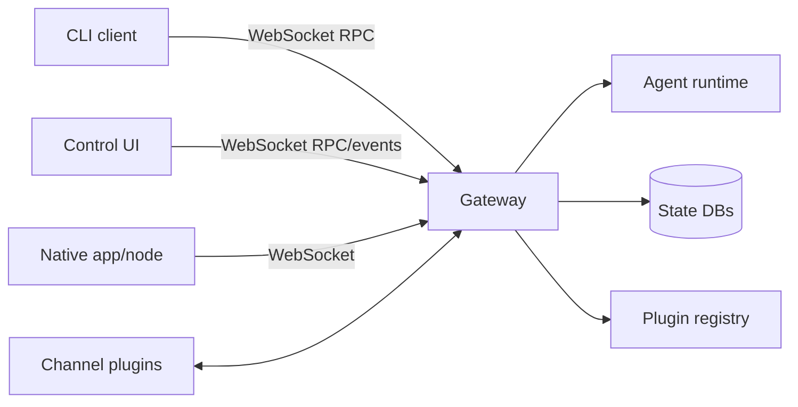
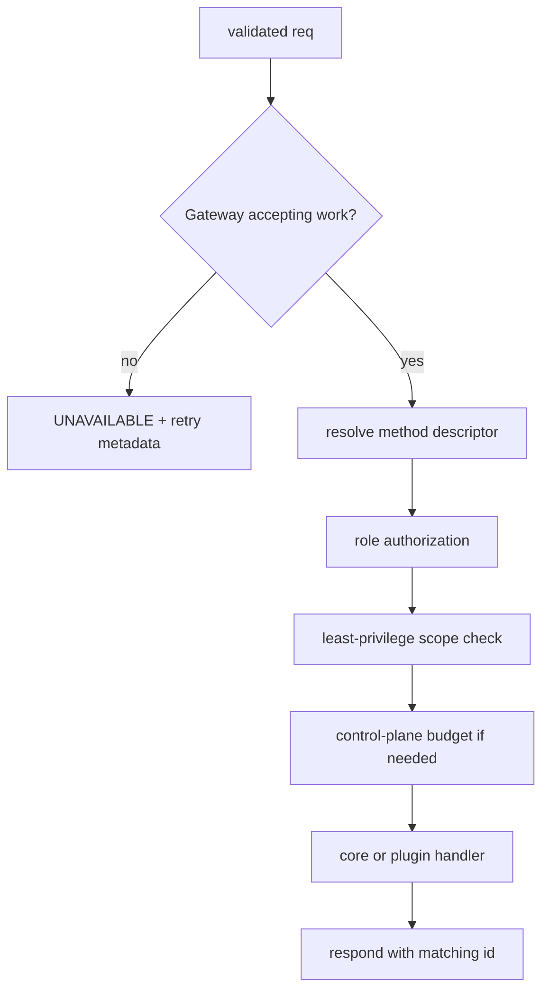

# 04：Gateway 与协议

Gateway 是 OpenClaw 的长驻控制平面和实时通信中心。频道、CLI、Control UI、原生客户端和节点能力通过它共享配置、状态、Agent 运行和事件。

## 1. 先建立服务模型



Gateway 不是单纯 HTTP router。它负责长连接身份、method scope、请求/响应配对、广播事件、插件方法、运行时服务、优雅关闭和重启 admission。

## 2. 公开协议包

协议定义位于 `packages/gateway-protocol/`，而不是埋在某个 WebSocket handler 中。这样服务端、客户端、SDK、代码生成和测试能共享同一个 contract。

顶层帧来自 [`packages/gateway-protocol/src/schema/frames.ts`](../../../packages/gateway-protocol/src/schema/frames.ts#L146-L197)：

```ts
type RequestFrame = {
  type: "req";
  id: string;
  method: string;
  params?: unknown;
};

type ResponseFrame = {
  type: "res";
  id: string;
  ok: boolean;
  payload?: unknown;
  error?: ErrorShape;
};

type EventFrame = {
  type: "event";
  event: string;
  payload?: unknown;
  seq?: number;
  stateVersion?: StateVersion;
};
```

`params` 和 `payload` 在 envelope 层是 unknown；具体 `method` 或 `event` 再选择自己的 schema。这样顶层 transport 保持稳定，方法可以独立演进。

`ErrorShape` 统一包含 `code`、`message`，并可提供 `details`、`retryable`、`retryAfterMs`。客户端不应从自然语言错误字符串猜是否重试。

## 3. `connect` 必须是第一帧

连接尚未认证时，服务端不知道对端角色、scope、设备身份、协议版本和能力。于是 [`src/gateway/server/ws-connection/message-handler.ts`](../../../src/gateway/server/ws-connection/message-handler.ts#L283-L392) 强制第一帧满足：

```text
validateRequestFrame(frame)
frame.method === "connect"
validateConnectParams(frame.params)
```

失败时，若 frame 本身仍是合法 request，服务端用相同 id 返回结构化错误，再以 policy close code 关闭；若连 request 都不是，只记录受控日志并关闭。

合法后依次执行：

```text
authenticateGatewayConnect
  -> authorizeGatewayConnectDevice
  -> attachAuthenticatedGatewayConnect
```

认证回答“凭据是否有效”，设备授权回答“这个设备是否允许”，attach 才把连接提升为已认证 client 并建立后续能力。把它们拆开有助于审计失败原因和测试安全边界。

连接建立后再发送 `connect` 会进入普通 method registry，并由 `src/gateway/server-methods/connect.ts` 拒绝。握手是连接状态转换，不是可重复业务 RPC。

## 4. 预认证资源防护

未认证连接本身也能消耗内存和 CPU。Gateway 在 runtime state 中创建 WebSocket server 时设置：

```ts
const wss = new WebSocketServer({
  noServer: true,
  maxPayload: MAX_PREAUTH_PAYLOAD_BYTES,
});
const preauthConnectionBudget = createPreauthConnectionBudget();
```

见 [`src/gateway/server-runtime-state.ts`](../../../src/gateway/server-runtime-state.ts#L281-L343)。`noServer: true` 让 Gateway 先把 upgrade handler 绑定到 HTTP server，再开始 listen，避免连接在 handler 就绪前到达导致静默 1006。

此外还有 pre-auth payload 上限、handshake timeout、连接预算和 auth rate limiter。安全审查不能从“认证函数本身正确”就结束，还要检查攻击者在认证前能触发多少解析、排队和日志。

## 5. handler 也按需加载

[`src/gateway/server/ws-connection.ts`](../../../src/gateway/server/ws-connection.ts#L192-L228) 在首条消息到来时才动态加载完整 message handler。加载期间先把帧放入有界队列：

```ts
if (queued.length >= MAX_QUEUED_MESSAGE_HANDLER_FRAMES) {
  close(1008, "gateway message handler loading");
  return;
}
queued.push(data);
```

模块加载完后移除临时 listener、安装真实 handler，再按原顺序 replay。这个小设计保护三个不变量：

- 不丢失加载窗口内的消息；
- 不让攻击者制造无界内存增长；
- 连接已关闭时不再附着 handler。

## 6. 已认证请求分发

握手完成后，所有输入仍要验证 request envelope。[`createGatewayAuthenticatedRequestDispatcher`](../../../src/gateway/server/ws-connection/authenticated-request-dispatch.ts#L20-L145) 的前半段处理：

1. frame validation；
2. 设备凭据 mutation barrier；
3. client invalidation；
4. shared gateway auth generation；
5. 创建与 request id 绑定的 `respond`；
6. unauthorized flood guard；
7. 动态加载 `handleGatewayRequest`。

mutation barrier 的意义是：token rotate/revoke 等操作期间，后续请求不能越过尚未生效的凭据变更。shared auth generation 则让配置改变后，使用旧代际认证的连接失效。

## 7. 方法注册表与权限

[`src/gateway/server-methods.ts`](../../../src/gateway/server-methods.ts) 组合：

- core handler descriptors；
- lazy core handlers；
- plugin gateway method descriptors；
- role policy；
- operator scopes；
- startup/restart admission；
- control-plane rate limit；
- session mutation authorization。

文件顶部能看到每组 handler 都用 `lazyHandlerModule` 包装，例如 `agent` 方法只有首次调用才 import `server-methods/agent.ts`。

分发不是简单的 `handlers[method](params)`。更准确的顺序是：



插件能扩展方法，但仍要通过统一 registry 和授权决策，不能在旁边开一个绕过 Gateway policy 的隐式通道。

## 8. 启动生命周期

公开入口 [`src/gateway/server.ts`](../../../src/gateway/server.ts#L1-L36) 本身是 lazy facade：轻量 caller 可以 import 类型/辅助函数，不必立刻加载完整 server graph。

真正的 [`startGatewayServer`](../../../src/gateway/server-start.ts#L100-L200) 分成清晰阶段：

```text
prepareGatewayServerBootstrap
  -> prepareGatewayRuntimeState
  -> prepareGatewayLifecycle
  -> startGatewayCoreRuntime
  -> finishGatewayStartup
```

如果启动后半段失败，`closeOnStartupFailure` 负责回收已创建资源。正常关闭时则依次：

- begin close prelude；
- 关闭 operator terminal sessions；
- 停止 sidecars；
- 运行 `gateway_stop` plugin hook；
- 执行 close prelude 和底层 close；
- 清除 fallback Gateway context。

资源创建与释放需要镜像思考。每看到一个 timer、listener、server、subscription 或 sidecar，都要寻找其 close owner。

## 9. 事件不是“额外的响应”

一个 `agent` request 可以很快返回接受结果，同时 Agent 的文本、工具与生命周期通过 event 广播。request id 负责 RPC 配对，run id/session key 负责把后续事件归属到具体执行。

客户端通常需要两个状态机：

```text
RPC state: pending -> response ok/error
Run state: started -> streaming/tool events -> terminal outcome
```

只收到 `res(ok=true)` 不表示 Agent 已完成；只看到最后一段文本也不一定表示 terminal outcome 已归一化。

## 10. 协议演进原则

Gateway 协议是多个客户端共享的公开面，修改时遵循：

- 优先新增 optional 字段或新方法；
- server 和所有相关客户端/SDK 同步跟进；
- runtime schema、静态类型、validator registry 和测试一致；
- incompatible change 需要版本策略和明确 owner；
- 协议版本不能由维护脚本或 Agent 擅自提升。

新增字段看似简单，也要检查序列化、旧客户端忽略行为、代码生成和 event snapshot。

## 11. 一个 RPC 的阅读模板

以 `agent` 为例，按以下顺序阅读：

1. 在协议包找 `AgentParamsSchema` / result 类型；
2. 在 `src/gateway/server-methods.ts` 找 handler group；
3. 打开 `src/gateway/server-methods/agent.ts`；
4. 找 preflight、dispatch 和 wait；
5. 找 caller 客户端或 CLI backend；
6. 找服务端聚焦测试和 e2e WebSocket harness；
7. 找与它共享授权或 session invariant 的 `chat` sibling。

这比从 handler 中间开始，更容易发现协议与权限前置条件。

## 12. 本章练习

### 练习 A：手写握手帧

根据 `ConnectParamsSchema` 写一个最小合法 connect request，再列出协议版本不重叠、缺少身份、scope 不足三种失败分别属于 schema、authentication 还是 authorization。

验收：每种失败都能指向对应处理阶段。

### 练习 B：追踪 `health`

找到 health 参数 schema、lazy handler、权限分类、response 和一个客户端调用。

验收：说明它为何是 request/response 而不是 event，以及 health 更新何时可能广播。

### 练习 C：资源释放审计

从 `startGatewayServer` 任选三个创建的长期资源，找到正常关闭和启动失败时的释放路径。

验收：若某个路径找不到，不要断言泄漏；记录证据缺口并继续查测试/owner。

## 13. 下一步

协议告诉我们消息怎样进入 Gateway，但还没有解释频道 inbound 如何生成路由上下文、怎样排队，以及回复如何回到 transport。下一章沿一条消息追踪整个数据面。
