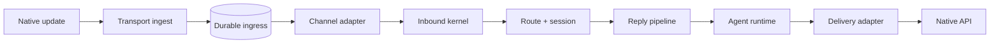
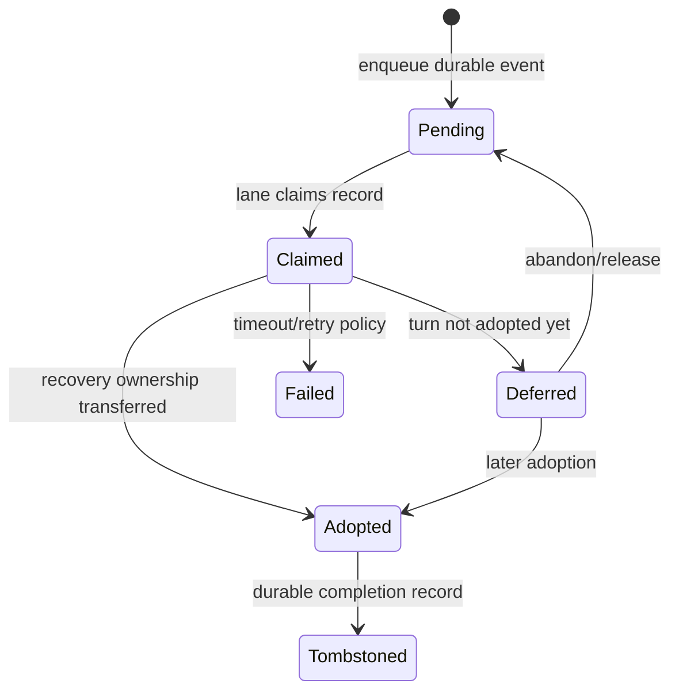

# 05：一条消息的生命周期

本章沿“频道收到用户消息”追踪到“回复被平台接受”。重点是区分每一层拥有的事实，以及多个容易混淆的完成时刻。

## 1. 总体管线



每层回答不同问题：

| 层               | 主要问题                                         |
| ---------------- | ------------------------------------------------ |
| native transport | 平台给了什么 update/callback/webhook？           |
| durable ingress  | 崩溃后是否重放，何时推进 offset/返回 200？       |
| channel adapter  | sender、conversation、thread、media 如何规范化？ |
| inbound kernel   | 是否 drop、route 到谁、怎样装配 turn？           |
| reply pipeline   | 命令还是 Agent，选什么模型和 session？           |
| Agent runtime    | 模型、工具、流式事件怎样执行？                   |
| delivery adapter | 文本/media/action 如何映射为平台调用？           |

## 2. 原生 update 不是 Agent prompt

Telegram、Discord、Slack 等平台的事件结构不同。直接把原生 JSON 传给模型会造成：

- 核心代码依赖平台字段；
- 路由与授权难以复用；
- callback、reaction、lifecycle event 被误当普通文本；
- 测试必须构造庞大原生 payload；
- 插件升级影响 prompt bytes。

所以频道先把 transport-specific 数据投影为 portable facts。类型定义集中在 [`src/channels/turn/types.ts`](../../../src/channels/turn/types.ts#L37-L155)：

```ts
type NormalizedTurnInput = {
  id: string;
  rawText: string;
  textForAgent?: string;
  textForCommands?: string;
  raw?: unknown;
};

type SenderFacts = { id?: string; name?: string; isBot?: boolean /* ... */ };

type ConversationFacts = {
  kind: "direct" | "group" | "channel";
  id: string;
  threadId?: string;
  /* ... */
};
```

注意 `rawText`、`textForAgent`、`textForCommands` 分开。用户可见原文、发给模型的文本和命令解析文本可能因 mention、envelope 或平台格式而不同，不能靠下游反复删字符串。

## 3. 分类发生在模型之前

`ChannelEventClass` 使用 `message`、`command`、`interaction`、`reaction`、`lifecycle`、`unknown`，并显式给出 `canStartAgentTurn` 和是否需要立即 ack。

这避免核心通过字符串猜测，例如“value 以 `/` 开头就是命令”。原生 callback data 是 transport-private envelope；portable command、approval、URL、web app、select 等动作应在编码前保持有类型的区别。

## 4. Inbound kernel 的阶段

[`runChannelInboundEvent`](../../../src/channels/turn/kernel.ts#L186-L381) 是现代频道 turn 的通用 kernel。它依次执行：

```text
ingest
  -> classify
  -> preflight
  -> resolveTurn
  -> assemble
  -> dispatch
  -> finalize
```

### 4.1 ingest

```ts
const input = await params.adapter.ingest(params.raw);
if (!input) {
  return { admission: { kind: "drop", reason: "ingest-null" }, dispatched: false };
}
```

无法形成有效输入时尽早停止。没有路由、session 或模型副作用。

### 4.2 classify

若 `canStartAgentTurn` 为 false，kernel 返回 `handled`。reaction 或某些 lifecycle event 可以被频道本地消费，而不制造空 Agent turn。

### 4.3 preflight

`ChannelTurnAdmission` 是判别联合：

```text
dispatch      正常执行
observeOnly   组装/观察但不产生普通回复
handled       已由前层处理
drop          丢弃，可选择记录 history
```

preflight 可以整合授权、命令、media、history 和 supplemental context。拒绝发生在解析昂贵媒体和启动模型之前。

### 4.4 resolve 与 assemble

adapter 把 sender/conversation/account 映射到 `RouteFacts` 和 `ReplyPlanFacts`。关键事实包括：

- `agentId`；
- account id；
- route/dispatch/persisted session key；
- DM scope；
- reply target/thread/reply-to；
- 是否允许创建 session。

路由必须在 Agent 前完成。模型不决定自己属于哪个 Agent，也不从文本猜回复到哪个频道。

### 4.5 dispatch

kernel 支持 prepared legacy-like dispatch、modern routed turn 和 assembled turn，但统一产生 `ChannelTurnResult`。现代 routed dispatcher 再进入 auto-reply：

```text
dispatchInboundMessageWithRoutedChannelDispatcher
  -> dispatchReplyFromConfig
  -> getReplyFromConfig
  -> runPreparedReply
  -> runAgentTurnWithFallback
  -> runEmbeddedAgent
```

实现入口可从 `src/channels/turn/lifecycle.ts`、`src/auto-reply/reply/dispatch-from-config.ts` 和 `src/auto-reply/reply/get-reply.ts` 继续追踪。

### 4.6 finalize

无论 dispatch 成功还是抛错，adapter 都有清理/记录机会。错误路径会尽力调用 `onFinalize`，但保留原始 dispatch error，不能让清理异常掩盖根因。

## 5. Session key 是路由结果

一个典型 key 类似：

```text
agent:<agentId>:<scope-specific suffix>
```

实际 suffix 取决于 DM scope、频道、群组、thread/topic、显式 session id 等。不要手工拼字符串；使用 `src/routing/session-key.ts` 及上层路由 helper。

重要区分：

- route session key：路由决策的身份；
- dispatch session key：本次执行可能使用的 key；
- persisted session key：存储使用的 canonical key；
- parent/model parent session：派生或嵌套运行关系。

它们常常相同，但类型故意允许不同。把任意一个都叫 `sessionKey` 会在 alias、ACP、subagent 或迁移场景中出错。

## 6. 队列、debounce 与同 lane 顺序

频道流量常需要三个不同机制：

- **dedupe**：相同事件不要处理两次；
- **debounce/coalesce**：短窗口内多条消息可以组合成一次 turn；
- **lane serialization**：同一会话或 ingress lane 避免相互覆盖，其他 lane 可并发。

三者不能互相替代。去重键通常来自原生 update id 或逻辑 message id；lane key 表达顺序所有权；debounce 是产品交互策略。

热路径应携带已经准备好的 channel/account/target/session 事实，不要在队列出队后重新做宽泛插件发现。

## 7. Durable ingress 的状态机

部分频道先把原生事件写入 SQLite-backed durable queue，然后独立 drain。通用实现位于 [`src/channels/message/ingress-drain.ts`](../../../src/channels/message/ingress-drain.ts#L430-L675)。

简化状态：



`onAdopted` 的源码注释直接说明：在 adoption 时 complete claim，以便后续事件释放 lane；不是等模型和回复全部 settle。

为什么？

- 太早完成：dispatch 尚未被 Agent/session 恢复状态接管时崩溃，会丢消息；
- 太晚完成：长模型/工具运行会阻塞同 lane 后续 ingress；
- adoption 正好表示可靠恢复责任已从 transport queue 转移到 turn/runtime owner。

若 tombstone 写失败，代码保持 heartbeat 和内存 claim——“卡住比重复副作用更安全”。

## 8. 三个 ack 时刻

以支持 durable ingress 的频道为例：

```text
transport ack
  update 已经耐久入队，平台可以停止重发

turn adoption
  Agent/session 恢复状态已接管，ingress claim 可 tombstone，lane 可释放

reply settlement
  模型/工具结束，原生平台接受最终回复或明确失败
```

它们相隔可能很久。日志和测试必须明确说的是哪一个 ack/complete，不能写含糊的“message done”。

## 9. 出站 delivery contract

[`src/channels/turn/types.ts`](../../../src/channels/turn/types.ts#L157-L258) 把结果表达为：

```ts
type ChannelDeliveryOutcome = {
  messageIds?: string[];
  receipt?: MessageReceipt;
  threadId?: string;
  replyToId?: string;
  visibleReplySent?: boolean;
  content?: string;
};
```

`receipt` 表示平台接受并给出 native id，不表示用户设备已经阅读。

delivery 有两种所有权模式：

- **core-managed**：adapter 声明 direct/durable 分支，core 负责统一发送观察；
- **provider-owned message sending**：平台必须先做 native payload preparation，插件拥有该 funnel。

用类型区分模式，防止一个 adapter 同时实现互相冲突的 `deliver` 和 `deliverWithProviderMessageSending`。

## 10. 流式输出不是不停发新消息

频道可能支持：

- draft preview；
- progress update；
- 发送一条消息后持续 edit；
- 只在 final 发一次；
- media 与 text 分开发送。

这些是 capability，不是所有频道的共同假设。核心产生 portable reply payload，频道根据原生限制做 chunking、formatting、thread/reply mapping 和 edit/finalize。

若平台 edit 失败，是否 fallback 为新消息必须由明确产品/频道策略决定，不能无条件吞错或重复发送。

## 11. 失败分类

追踪消息失败时，先按边界分类：

| 现象                 | 优先检查                                |
| -------------------- | --------------------------------------- |
| 平台重复投递         | transport ack、offset、webhook status   |
| 崩溃后消息消失       | durable enqueue 与 adoption 窗口        |
| 同一群消息串台       | route/session key、thread facts         |
| Agent 根本未启动     | classify/preflight/admission            |
| Agent 运行但无回复   | delivery adapter、suppression、receipt  |
| 回复重复             | ingress dedupe、fallback、finalizer     |
| 后一条消息被长期阻塞 | lane release/adoption，而非模型速度本身 |

这张表让诊断从“搜索最后一条报错”转向生命周期。

## 12. 本章练习

### 练习 A：kernel 短路

阅读 `src/channels/turn/kernel.test.ts` 中 ingest-null、non-turn event、preflight drop 测试，写出每种情况下哪些 adapter 方法绝不应被调用。

验收：用 spy 调用次数证明，而不是只看返回值。

### 练习 B：durable 状态机

根据 `src/channels/message/ingress-drain.test.ts` 画出 pending、claimed、deferred、adopted、released/tombstoned。

验收：分别说明 adoption 前和后崩溃是否重放，以及原因。

### 练习 C：路由事实

选一个 direct message 和一个 group thread，追踪 `ConversationFacts` 到最终 session key 和 reply target。

验收：证明 route 在模型调用前确定；列出 thread id 在入站和出站各使用一次的位置。

## 13. 下一步

现在我们停在 `runEmbeddedAgent` 入口。下一章把 reply pipeline 交给 Agent 运行时，分析模型选择、工具创建、订阅流和终态合并。
