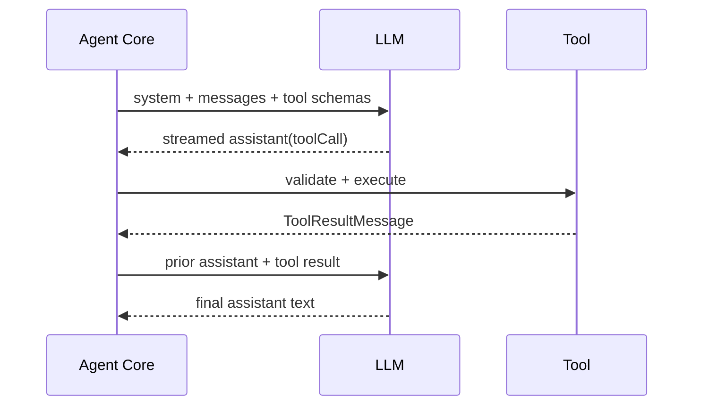

# 06：Agent 运行时与工具循环

本章最重要的目标是把两个循环分开：OpenClaw 的外层 run/attempt 循环，以及 agent-core 的内层模型—工具循环。很多误读都来自把二者画成一个 `while`。

## 1. 一条请求进入 Agent 的路径

频道 reply pipeline 的代表性链路：

```text
getReplyFromConfig
  -> runPreparedReply
  -> runAgentTurnWithFallback
  -> fallback cycle / candidate
  -> embedded candidate
  -> runEmbeddedAgent entry
  -> runEmbeddedAgent orchestrator
  -> prepared runtime + harness
  -> outer run loop
  -> one attempt
  -> AgentSession.prompt
  -> Agent.prompt
  -> agent-core inner loop
```

CLI、本地调用和 Gateway `agent` RPC 在更上游有不同 preflight/authorization，但最终也会进入相同或等价的 run owner。

重点：一个“用户请求”可以尝试多个 model candidate、auth profile 或 attempt，但仍属于同一个逻辑 run id。

## 2. 五个容易混淆的名词

| 名词                 | 含义                                                                |
| -------------------- | ------------------------------------------------------------------- |
| Model                | 被选中的模型描述，包含 provider、api、context window、output cap 等 |
| Provider             | 模型所有者/路由与鉴权命名空间                                       |
| API                  | 请求协议族和 payload 语义                                           |
| Transport / StreamFn | 实际怎样发起流式请求并产生事件                                      |
| Harness              | 谁拥有一次 attempt 的整体执行、会话与后端生命周期                   |

[`packages/llm-core/src/types.ts`](../../../packages/llm-core/src/types.ts) 的 `Model` 同时带 provider/api 等事实；它不是一个已经连接的客户端。

模型准备位于 `src/agents/embedded-agent-runner/run/model-setup.ts`，会执行 model resolve hook、选择 harness、查找运行模型和 prepared store fallback。真正发请求时，provider 插件 stream 可优先于通用 transport-aware stream，见 `src/agents/provider-stream.ts`。

## 3. Harness 是 attempt 执行边界

`runEmbeddedAgent` 不假设所有模型都由同一种后端运行。`src/agents/harness/selection.ts` 选择 harness，内置 OpenClaw harness 在 `src/agents/harness/builtin-openclaw.ts` 绑定 `runEmbeddedAttempt`。

概念上：

```ts
interface AgentHarness {
  id: string;
  runAttempt(prepared: PreparedAttempt): Promise<AttemptResult>;
  finalizeSettledTurn?(/* ... */): Promise</* ... */>;
}
```

因此，教程或修复不能把 embedded OpenClaw attempt 的内部假设套到所有 CLI/backend/plugin harness。共享 contract 放在 harness seam，具体 transport/recovery 由 owner 实现。

## 4. 外层循环：run、attempt、恢复和终态

外层位于 [`src/agents/embedded-agent-runner/run-loop.ts`](../../../src/agents/embedded-agent-runner/run-loop.ts#L251-L440)。它先只解析一次 context engine：

```ts
ensureContextEnginesInitialized();
const contextEngine = await resolveContextEngine(params.config, {
  agentDir,
  workspaceDir: resolvedWorkspace,
});
```

然后进入有上限的 retry loop：

```ts
while (true) {
  if (runLoopIterations >= MAX_RUN_LOOP_ITERATIONS) {
    return handleRetryLimitExhaustion(/* ... */);
  }
  runLoopIterations += 1;

  const dispatch = await prepareAndDispatchEmbeddedRunAttempt(/* ... */);
  const normalized = await normalizeEmbeddedRunAttempt(/* ... */);

  if (normalized.action === "complete") return normalized.result;
  if (normalized.action === "retry") continue;

  const recovery = await recoverEmbeddedRunAttempt(/* ... */);
  if (recovery.action === "complete") return recovery.result;
  if (recovery.action === "retry") continue;

  // assistant failure、settled-tool finalization、timeout、terminal resolution
}
```

这个循环拥有：

- attempt 上限；
- prepared runtime snapshot 刷新；
- auth retry 与 profile failure；
- replay state；
- context recovery / compaction；
- thinking/model fallback 决策；
- settled tool finalization；
- prompt/run timeout；
- run terminal result。

它不负责逐个执行模型 tool call；那是内层循环。

## 5. 为什么 Context Engine 跨 attempt 复用

同一 run 的重试需要保持一致的 context owner 和状态连接。如果每个 attempt 重新 discover/initialize：

- 插件 engine 可能重复建连接；
- retry 前后的投影策略不一致；
- cleanup owner 模糊；
- 热路径增加 registry/file I/O。

所以它在 loop 外解析，`finally` 中统一 `contextEngine.dispose?.()`。资源生命周期覆盖整次 run，而非单 attempt。

## 6. 外层 `action` 是显式状态机

normalize/recovery/terminal resolver 返回 `complete`、`retry` 或继续处理的具名分支，避免用异常字符串控制所有重试。

重试可能来自：

- auth/profile 可恢复错误；
- context overflow 与 compaction；
- thinking level 调整；
- model/provider candidate fallback；
- reasoning-only/empty response 的有界恢复；
- backend-specific recovery。

每种重试都应携带已使用预算和 replay safety。无限 `catch { continue }` 会重复工具副作用并隐藏永久失败。

> 外层包含 Codex app-server 专用恢复分支。本教程不对该协议行为作解释；按仓库硬规则，深入该分支前必须亲自检查 sibling `../codex` 的准确实现与协议。

## 7. 内层循环：模型 → 工具 → 模型

入口链：

```text
attempt stream runtime
  -> AgentSession.prompt
  -> Agent.prompt
  -> runAgentLoop
```

[`runAgentLoop`](../../../packages/agent-core/src/agent-loop.ts#L184-L208) 建立当前 context、发出 `agent_start` / `turn_start` 和 prompt message events，再进入内层 `runLoop`。

核心片段在 [`packages/agent-core/src/agent-loop.ts`](../../../packages/agent-core/src/agent-loop.ts#L312-L430)：

```ts
while (hasMoreToolCalls || pendingMessages.length > 0) {
  const message = await streamAssistantResponse(/* ... */);

  if (message.stopReason === "error" || message.stopReason === "aborted") {
    // emit terminal events for this agent-core loop
    return;
  }

  const toolCalls = message.content.filter((c) => c.type === "toolCall");
  const toolResults: ToolResultMessage[] = [];

  if (message.stopReason === "toolUse" && toolCalls.length > 0) {
    const batch = await executeToolCalls(/* ... */);
    toolResults.push(...batch.messages);
    hasMoreToolCalls = !batch.terminate;
    currentContext.messages.push(...toolResults);
  }

  await config.prepareNextTurn?.(/* model/context may change */);
}
```

简化时序：



内层一轮结束后 `prepareNextTurn` 可以重新装配 context、模型和 reasoning。这使 context engine 能在工具结果后控制下一次模型可见内容。

## 8. 真正的 LLM 边界

[`streamAssistantResponse`](../../../packages/agent-core/src/agent-loop.ts#L452-L557) 做四步转换：

```text
AgentMessage[]
  -> transformContext
  -> normalizeCoreContextMessages
  -> convertToLlm
  -> { systemPrompt, messages, tools }
  -> streamFunction(model, llmContext, options)
```

API key 在每次请求前通过 `getApiKey` 解析，支持会过期的 token，而不是在整个进程启动时永远缓存一个字符串。

随后 `for await` 消费 stream event：start、text/thinking/toolcall delta、done/error。partial assistant message 会随着 event 更新，最终 `response.result()` 形成完整 message 并触发 `message_end`。

所以：

- delta 是传输事件；
- partial message 是内存投影；
- final assistant message 是 session/Agent 语义；
- run terminal outcome 仍由外层决定。

## 9. 工具从“候选”到 `effectiveTools`

工具准备主要在 `src/agents/embedded-agent-runner/run/attempt.ts` 和 `attempt-tool-catalog.ts`：

```text
base tools
  + plugin/tool bundle
  + runtime-specific tools
  -> capability/policy allowlist
  -> schema compatibility filtering
  -> Tool Search / Code Mode catalog projection
  -> effectiveTools
```

“构造出一个工具对象”不等于模型能看到它。最终 system prompt 的工具说明和 `AgentSession` runtime 都应使用同一 `effectiveTools`，否则模型被告知不存在的工具，或运行时接受 prompt 未声明的工具。

Tool Search/Code Mode 可能把完整工具集目录化，只暴露搜索/执行 seam，减少 schema token。此时 catalog 中存在的工具也不一定直接出现在 LLM `tools` 数组。

## 10. `AgentTool` contract

核心类型在 [`packages/agent-core/src/types.ts`](../../../packages/agent-core/src/types.ts)：

```ts
interface AgentTool {
  name: string;
  description: string;
  parameters: /* JSON schema */;
  execute(/* validated args + context */): Promise<AgentToolResult>;
  executionMode?: "parallel" | "sequential";
}
```

provider 可见 tool schema 与 host 执行对象不是同一个类型：前者描述给模型，后者包含真正 callback、hook 和 context。

工具参数来自模型，必须 runtime 验证。`packages/llm-core/src/validation.ts` 把 TypeBox/JSON Schema 转为 validator；agent loop 的 `prepareArguments`、validation 和 `beforeToolCall` 在执行前完成。

## 11. 工具执行管线

单个 tool call 概念流程：

```text
resolve tool by name
  -> parse/prepare arguments
  -> validate schema
  -> beforeToolCall hook
  -> AsyncLocalStorage execution context
  -> emit start/progress
  -> tool.execute
  -> afterToolCall hook may patch result
  -> normalize ToolResultMessage
  -> emit end
```

`beforeToolCall` 可以拒绝或调整调用，`afterToolCall` 可修补呈现结果。hook 不能绕过参数 schema 和 owner policy。

工具执行 context 通过 AsyncLocalStorage 传递 run/session/进度事实，避免每个底层 helper 再从 global 或配置重新发现。

## 12. 并行与串行工具

[`executeToolCalls`](../../../packages/agent-core/src/agent-loop.ts#L560-L611) 先扫描 batch：只要全局 config 要求串行，或任何被解析工具声明 `executionMode: "sequential"`，整批走串行；否则可并行。

为什么不是只把那个工具单独串行，其余并行？一批 tool calls 来自同一 assistant turn，若其中一个有顺序/共享状态要求，任意并行混排可能破坏模型隐含顺序。保守提升整批为串行更可预测。

一批调用只有全部明确返回 terminate 语义，才终止后续模型轮。一个工具的局部终止不能静默丢掉同批其他结果。

## 13. Tool result 进入下一轮 context

执行结果被包装成 `ToolResultMessage`，加入 `currentContext.messages`。下一次模型看到：

```text
assistant: toolCall(id, name, args)
tool: toolResult(toolCallId=id, content/error)
```

tool call/result 必须配对。Context Engine 装配或 compaction 后，runtime 还会修复/验证配对，避免孤立 result 让 provider 拒绝 prompt。

工具错误通常也应变成 result 交给模型，使模型可以解释或换方案；只有安全/生命周期/不可恢复错误才直接终止 owner loop。

## 14. Event、持久化与 UI 投影

内层发出：

- `agent_start` / `agent_end`；
- `turn_start` / `turn_end`；
- `message_start` / `message_update` / `message_end`；
- tool execution 事件。

`src/agents/embedded-agent-subscribe.ts` 订阅 AgentSession，转换为 assistant/tool/lifecycle stream，供 Gateway/频道/UI 消费。`message_end` 还通过 SessionManager 持久化 transcript。

投影层可以选择显示 thinking、progress 或 tool summary，但不能重新定义 terminal precedence。

## 15. 模型 stop reason 不等于 run terminal

模型可能给出 `stop`、`length`、`toolUse`、`error`、`aborted` 等 stop reason。一次 run 还可能在队列、provider、工具、compaction、delivery 前后发生 timeout/cancel。

[`buildAgentRunTerminalOutcome`](../../../src/agents/agent-run-terminal-outcome.ts#L503-L570) 归一化为：

```text
completed
hard_timeout
blocked
aborted
cancelled
abandoned
timed_out
failed
```

`mergeAgentRunTerminalOutcome` 保护粘性优先级：

- 已确认 cancelled 不被迟到结果覆盖；
- hard timeout 保持所有权，除非证据证明 completion 在 timeout 前已经结束；
- 迟到 cleanup error 不应把超时降级或改写。

所有 projection 使用这个 owner，不应在 Gateway、频道或 UI 里各写一套 `if (timedOut) ...`。

## 16. Abort 与 timeout

`AbortSignal` 是取消传播通道，不保证底层库立即停止。完整取消需要：

- caller abort controller；
- model transport 接受 signal；
- tool 尊重 signal；
- compaction/hook 有上限；
- subscription/finalizer 处理迟到 event；
- terminal merge 保留真正所有者。

区分：queue wait timeout、provider hard timeout、idle timeout、run budget、tool execution timeout、compaction timeout。它们的 retryability 和用户文案不同。

## 17. 本章练习

### 练习 A：两层循环

画一条含两个 tool call、随后 context overflow、compaction 后重试的执行图。

验收：tool iteration 在内层，compaction/retry 在外层；run id 不变，attempt 计数变化。

### 练习 B：最终工具集

从 `createOpenClawTools` 开始，选择一个工具，追踪到 `effectiveTools`、system prompt 与 AgentSession。

验收：列出它可能在哪些 policy/capability/schema 阶段被过滤。

### 练习 C：终态竞争

构造三组时间线：completion 后 timeout observation、hard timeout 后迟到 error、cancel 后迟到 success。用 `mergeAgentRunTerminalOutcome` 推演结果。

验收：写明 `endedAt` 如何让“超时前已完成”成为可判定证据。

### 练习 D：工具 schema

选择一个真实工具，找 provider schema、host `execute`、before/after hook 和 result normalization。

验收：给出非法参数在哪一层拒绝；证明未经验证输入不会进入具体副作用。

## 18. 下一步

Agent loop 需要 transcript 作为历史、Context Engine 作为模型投影、memory tool 作为长期检索。下一章精确拆开这三类状态，以及 compaction/pruning 的差异。
