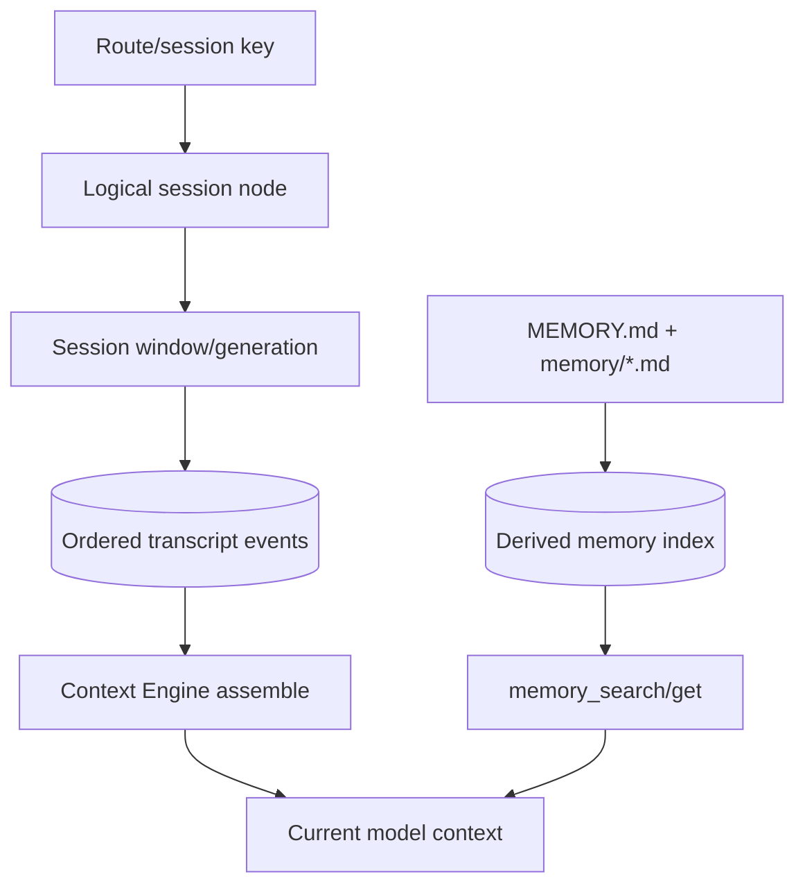

# 07：Session、Context、Compaction 与 Memory

“让 Agent 记住之前的内容”至少涉及四个不同系统：session identity、持久 transcript、当前模型 context、可检索 memory。把它们混在一起，会导致数据丢失、token 爆炸或错误权限。

## 1. 五层状态模型



| 层                  | 持久？                 | 主要 owner                       |
| ------------------- | ---------------------- | -------------------------------- |
| route/session key   | 逻辑身份，可持久投影   | routing/session config           |
| session node/window | 是                     | per-agent SQLite/session manager |
| transcript events   | 是                     | SessionManager/SQLite            |
| current context     | 请求期投影             | Context Engine/runner            |
| memory files/index  | 文件是权威；索引可重建 | memory plugin + per-agent SQLite |

## 2. Session key 与 session id

`sessionKey` 是稳定路由身份，例如某 Agent 的主会话、某个 DM、群组或 thread。`sessionId` 是一个具体 transcript window/generation 的身份。

一条逻辑会话可以经历 reset、rollover、fork、rewind、switch、recovery 或 compaction，产生新 window，同时 `sessionKey` 仍指向当前 `sessionId`。

因此：

```text
session key = “这是谁的对话”
session id  = “当前是哪一段 transcript generation”
```

不要把 UI 显示 key、store canonical key、run id、session id 当成可互换字符串。

## 3. SQLite 的 session schema

每 Agent 数据库 schema 在 [`src/state/openclaw-agent-schema.sql`](../../../src/state/openclaw-agent-schema.sql)。顶部注释定义 canonical ownership：

```sql
-- session_nodes.entry_json is the canonical logical-session record.
-- promoted columns are query indexes.
-- session_windows and children own transcript generations.
```

### `session_nodes`

主键是 `session_key`，保存 current session id、canonical entry JSON，以及 status、创建来源、父子关系、label、archive/read/activity 时间等可查询投影。

### `session_windows`

主键是 `session_id`，引用 session node，记录 previous id、reason、scope、channel/account/model/harness、父会话与时间。

### `transcript_events`

```sql
CREATE TABLE transcript_events (
  session_id TEXT NOT NULL,
  seq INTEGER NOT NULL,
  event_json TEXT NOT NULL,
  created_at INTEGER NOT NULL,
  PRIMARY KEY (session_id, seq)
);
```

`(session_id, seq)` 给出一个 window 内的稳定有序事件流。另有 identity/idempotency 表保护消息幂等和 parent 关系。

## 4. `sessionFile` 的 SQLite marker 不是文件

历史代码/API 仍有名为 `sessionFile` 的字段。当前 SQLite transcript 使用逻辑 marker：

```text
sqlite:<agentId>:<sessionId>:<storePath>
```

[`src/config/sessions/sqlite-marker.ts`](../../../src/config/sessions/sqlite-marker.ts#L10-L54) 提供 format/parse/match。它告诉通用 session runtime 如何找到 SQLite target，不会在磁盘创建名为 `sqlite:...` 的文件。

看到 `sessionFile` 时先调用/寻找 marker parser；不要直接 `path.resolve(sessionFile)` 或 `readFile`。

## 5. Transcript 怎样持久化

AgentSession 在 `message_end` 时把新 message 交给 SessionManager。SQLite 分支在 [`src/agents/sessions/session-manager-persistence.ts`](../../../src/agents/sessions/session-manager-persistence.ts#L212-L258)：

```ts
if (entry.type !== "message") {
  appendTranscriptEventSync(scope, entry);
  return;
}

const result = appendTranscriptMessageSync(scope, {
  eventId: entry.id,
  idempotencyLookup: options?.idempotencyLookup,
  message: entry.message,
  parentId: entry.parentId,
});
```

普通 message 和 control event 分流，但都进入有序 transcript。message append 还检查 idempotency 与 parent identity；如果 SessionManager 已采用某 event id 作为下一 parent，却没真正持久化 canonical node，后续整个分支会悬空，因此代码选择显式失败。

## 6. Transcript 是树/分支，不只是数组

fork、rewind、compaction 和 reset 使 session history 具有 parent/boundary。模型通常看到当前 active branch，不是数据库所有事件的简单 `ORDER BY seq` 拼接。

[`buildSessionContext`](../../../packages/agent-core/src/harness/session/session.ts#L50-L106) 遍历有序 branch，记住最新 thinking/model/boundary：

```text
无 boundary
  -> 把分支 message 全部投影

有 compaction boundary
  -> 先放 summary
  -> 放 keepFromId 开始的 kept tail
  -> 放 boundary 之后的新消息

有 reset boundary
  -> 按 reset 规则保留少量 prelude
  -> 放之后的新消息
```

旧事件没有因模型不可见而从数据库消失。

## 7. Context 是本次模型输入

Context 包含：

- system prompt；
- 当前 branch 选入的 messages；
- tool schemas；
- bootstrap/workspace facts；
- channel/sender supplemental facts；
- context engine 追加指导；
- memory tool 本轮取回的结果。

它受模型 context window 和 output reserve 限制。Transcript 可以很长，Context 必须是有限投影。

## 8. Context Engine contract

[`src/context-engine/types.ts`](../../../src/context-engine/types.ts#L338-L479) 定义生命周期：

```text
bootstrap?  初始化 session engine state
maintain?   做 transcript maintenance
ingest      接收单条 message
ingestBatch? 接收一整个 turn
afterTurn?  turn 后持久/后台决策
assemble    在 token budget 内组装 model context
compact     创建摘要/减少投影
dispose?    释放 run-scoped 资源
```

`AssembleResult` 至少返回 ordered messages 和 estimated tokens，还可返回：

- `promptAuthority`：overflow precheck 应相信 assembled 还是也考虑 pre-assembly；
- `systemPromptAddition`；
- persistent backend 的 context projection/epoch。

Context Engine 决定什么安全可见；runtime 拥有 SQLite transcript target 和安全 rewrite helper。插件 engine 不应 deep import session internals改写数据库。

## 9. Assemble 发生在哪些时刻

第一次模型调用前，runner 在 `attempt-history-prepare.ts`：

1. 根据 context window 扣除 reserve，计算 message budget；
2. 调 `contextEngine.assemble`；
3. 修复/验证 tool call 与 result 配对；
4. 追加 engine system prompt；
5. 交给 AgentSession。

每个工具轮结束后，`tool-result-context-guard.ts` 会 ingest/afterTurn，再为下一次模型调用 assemble。这样工具结果可以进入 transcript，但 engine 仍能根据 budget 决定下一轮实际投影。

## 10. Compaction：持久摘要边界

Compaction 的目标是把旧 branch 压缩成摘要，同时保留安全 tail。

```text
选择 tool-safe cut
  -> 选待总结消息
  -> 调总结模型
  -> 写 compaction entry(summary, keepFromId, token info)
  -> 重建当前 Agent context
```

具体选择与总结在 `packages/agent-core/src/harness/compaction/compaction.ts`，持久化在 `src/agents/sessions/agent-session-compaction.ts`。

tool-safe cut 很重要：不能把 assistant tool call 留下，却裁掉对应 tool result，或反过来。

Compaction 后：

- 原始旧 history 仍在存储；
- 后续模型主要看到 summary + kept tail + 新消息；
- boundary 成为 transcript 语义，跨进程重开仍有效。

## 11. Pruning：临时请求投影裁剪

Context pruning 位于 `src/agents/agent-hooks/context-pruning/`。它按 TTL/大小策略 soft trim 或 hard clear 较旧 tool results，同时保护：

- 最近 assistant 区域；
- bootstrap 区域；
- 必须配对/保留的上下文。

它只改变本次模型请求投影，不写 transcript summary，不删除持久 history。下一次 assemble 可以从原 transcript 重新决定。

对比：

|            | Compaction              | Pruning                     |
| ---------- | ----------------------- | --------------------------- |
| 是否持久   | 是，写 boundary/summary | 否，请求期投影              |
| 主要对象   | 较老对话历史            | 旧 tool result 等高占用内容 |
| 跨重启     | 有效                    | 不保留                      |
| 可恢复原文 | transcript 中仍保留     | transcript 从未改变         |
| 触发       | token/context policy    | TTL/size hook               |

## 12. Memory 的权威源与派生索引

默认长期记忆源是工作区中的：

```text
MEMORY.md
memory/*.md
配置允许的 extra paths
```

memory host 枚举文件时跳过 symlink，避免索引越过允许目录。文件内容是用户可编辑权威源；embedding/FTS/chunk tables 是可重建派生数据，存放在同一个 per-agent SQLite。

schema 包含：

- `memory_index_sources`：path/source/hash/mtime/size；
- `memory_index_chunks`：line range/text/embedding；
- `memory_embedding_cache`；
- `memory_index_state`；
- 可选 session transcript index state。

hash 不变时跳过重建，脏文件才更新 chunks。

## 13. Hybrid retrieval 背景

memory search 可结合：

- embedding/vector similarity：语义相近；
- keyword/FTS/BM25：词项精确匹配。

本快照默认 chunk size 400、overlap 80、top 6、min score 0.35、向量/关键词权重 0.7/0.3，定义在 `src/agents/memory-search.ts`。这些是当前默认，不是永恒公共契约；配置和插件 owner 可以演进。

默认 source 只有 `memory`。session transcript 检索是可选能力，必须由可信 runtime 或配置开放；不要假设每次 `memory_search` 都搜全部聊天。

## 14. `memory_search` 与 `memory_get`

Memory Core 插件在 [`extensions/memory-core/index.ts`](../../../extensions/memory-core/index.ts) 懒注册两个工具：

- `memory_search`：查询索引，返回候选片段和分数；
- `memory_get`：对已知文件做精确、有限行读取。

推荐模式：

```text
先 search 找相关 path/range
  -> 再 get 读取最少必要行
  -> 把 ToolResult 加入当前 context
```

[`extensions/memory-core/src/prompt-section.ts`](../../../extensions/memory-core/src/prompt-section.ts) 只给模型增加“何时调用工具”的指导，并不会在每一轮自动把所有 search hit 塞进 prompt。

Memory result 经 tool loop 进入当前 context；它不会神秘地改写旧 transcript。

## 15. Workspace bootstrap 与 memory search 是两条路径

某些 workspace bootstrap 文件可能直接进入 system/context，这是 Agent 启动规则；`memory_search` 则是按需检索工具。即便 `MEMORY.md` 名字相同，也要区分：

- bootstrap 是否直接选入；
- memory index 是否收录；
- 本轮是否调用 search/get；
- citation policy 是否允许显示 path/line。

避免写“Memory 总是在 prompt 里”或“Memory 只有工具才能读”这类绝对结论。

## 16. Pre-compaction memory flush

在 transcript 即将 compact 前，系统可以运行一个隐藏 memory turn，把真正长期有用的信息追加到当天文件。

[`extensions/memory-core/src/flush-plan.ts`](../../../extensions/memory-core/src/flush-plan.ts#L12-L135) 限制：

```text
target: memory/YYYY-MM-DD.md
mode: append-only
MEMORY.md / SOUL.md / AGENTS.md 等只读
无内容时返回 SILENT_REPLY_TOKEN
```

host 根据 token/transcript byte threshold 创建 plan，再用隐藏 `trigger: "memory"` 的 embedded run 执行。工具集收缩到 read 和受约束 append-only write，见 `src/agents/agent-tools.ts`。

安全目的：一次“整理记忆”不能借机覆盖人格、规则或任意 workspace 文件。

## 17. 四个常见场景

### 用户问刚才的内容

通常来自当前 session transcript/context，不需要 memory search。

### 用户问几周前记录的偏好

当前 context 未必包含，需要 `memory_search` → `memory_get`。

### Prompt 超过 context window

Context Engine/compaction/pruning 处理，不是扩大 session 数据库或把 memory 关掉。

### 用户 reset 会话

产生新的 boundary/window 语义；不等于删除所有历史 memory 文件。

## 18. 隐私与权限

- 每 Agent 数据库隔离默认 owner；
- session corpus search 需要明确开放；
- memory extra paths 必须在允许范围且跳过 symlink；
- citation mode 控制是否向用户显示 path/line；
- hidden flush 限定路径和 append-only；
- channel/group 路由必须在读取 session 前确定，避免跨会话泄露。

“检索方便”不能覆盖 session/Agent 权限边界。

## 19. 本章练习

### 练习 A：五层状态

选择一条真实测试 fixture，标出 session key、session id、window、transcript rows、assembled context 和 memory hits。

验收：每个对象写明是否持久、谁拥有、何时变化。

### 练习 B：SQLite marker

阅读 `session-manager.test.ts` 的 marker/reopen case，解释为什么 reopen 后 transcript 仍在，而磁盘没有 `sqlite:...` 文件。

### 练习 C：Compaction 与 pruning

构造包含旧工具大结果的 20-turn transcript。分别应用 compaction 和 pruning，画出 SQLite rows 与模型可见 messages 的变化。

验收：两者都不删除原始 transcript event；只有 compaction新增持久 boundary。

### 练习 D：Memory 检索

创建无敏感信息的临时 `MEMORY.md`/daily note fixture，追踪 source hash、chunks、search score、get range 和 ToolResult。

验收：修改一个文件后只重建脏 source；search 未命中时模型不会凭空得到文件内容。

### 练习 E：Flush 权限

阅读 flush plan 和受限工具集测试，尝试设计覆盖 `SOUL.md` 的恶意 prompt。

验收：说明 prompt 提示、工具 allowlist、path constraint 三层分别防什么，不能只依赖自然语言指令。

## 20. 下一步

现在可以回到模块 10，把 session/memory 表映射到 per-agent SQLite；也可以进入模块 8，理解 Context Engine 和 Memory Core 为什么通过插件/SDK seam 接入。
