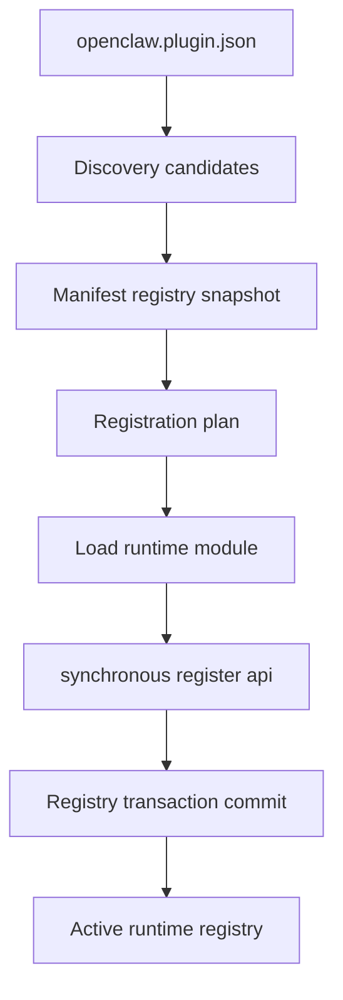

# 08：插件系统与 Plugin SDK

插件架构的核心不是“动态 import 一个文件”，而是把声明、发现、验证、注册和激活分成可审计阶段，并维持核心与具体插件的依赖方向。

## 1. 控制面与运行面



前半段不执行插件代码，可以回答：插件 id、版本要求、入口、配置 schema、channel/provider 能力、activation/setup metadata 和来源。后半段才导入模块、注册能力并激活。

这条边界让配置校验、帮助生成、安装检查和冲突诊断不必运行第三方副作用。

## 2. Manifest：静态声明

固定清单名和加载逻辑在 `src/plugins/manifest.ts`。`loadPluginManifest`：

1. 安全打开并限制大小；
2. 解析 JSON/JSON5；
3. 验证对象、id、保留 id 和 `configSchema`；
4. 规范化 `requires`、`defaults`、provider、channel、model、auth、activation、setup；
5. 返回 canonical manifest。

Telegram 的最小示例见 [`extensions/telegram/openclaw.plugin.json`](../../../extensions/telegram/openclaw.plugin.json)：

```json
{
  "id": "telegram",
  "channels": ["telegram"],
  "configSchema": { "type": "object", "additionalProperties": false },
  "activation": { "onStartup": false }
}
```

`activation.onStartup: false` 不是“禁用插件”，只表示启动时不需要立即完整激活；需要该能力时仍可按生命周期加载。

通常目录插件必须有 manifest。一个窄例外是配置显式指定的单脚本文件，registry 可为其生成严格空 manifest；不要把这个例外推广成普通插件结构。

## 3. Discovery：寻找候选，不执行代码

`discoverOpenClawPlugins` 位于 `src/plugins/discovery.ts`，可能发现：

- `plugins.load.paths` 显式路径；
- workspace `.openclaw/extensions`；
- 开发源码 overlay；
- bundled roots；
- 已记录安装目录；
- 自动全局目录。

discovery 还要检查目录安全、入口解析和缺依赖诊断。它产生的是候选集合。

候选发现顺序不等于同 id 冲突的最终优先级。manifest registry 会做物理路径去重、来源优先级和大小写折叠 id 冲突判断。

## 4. Manifest registry：稳定控制面快照

`loadPluginManifestRegistry` 位于 `src/plugins/manifest-registry.ts`。它把 discovery candidate 与 manifest 配对，并执行：

- 外部插件 host/plugin API 版本门；
- manifest record 生成；
- path dedupe；
- 来源优先级选择；
- id collision 诊断；
- bundled registry 合并。

产物是有序 records、诊断和来源信息，而不是“已经运行的插件对象”。Gateway/config/help 可以共享这份 process-stable metadata snapshot。

## 5. Registration plan：按任务只加载所需能力

[`resolvePluginRegistrationPlan`](../../../src/plugins/loader-registration-plan.ts#L19-L91) 把加载意图变成显式计划：

| mode             | 典型用途                                    | 是否 full-only 注册 |
| ---------------- | ------------------------------------------- | ------------------- |
| `setup-only`     | onboarding/config setup                     | 否                  |
| `tool-discovery` | 发现 Agent 工具                             | 否                  |
| `setup-runtime`  | setup 需要有限 channel runtime setter/shape | 否                  |
| `discovery`      | 载入 metadata/capability 但不完整激活       | 否                  |
| `full`           | 正式运行                                    | 是                  |

计划还决定使用 setup entry 还是正常 runtime entry、是否执行 runtime capability policy。

模式存在的理由：用户只是查看配置 schema 时，不应启动频道网络连接；工具发现不应加载无关 service；setup 需要的少量 runtime 能力也不应等同完整激活。

## 6. Loader 使用事务化 registry

`loadOpenClawPlugins` 在 `src/plugins/loader-runtime-load.ts` 中：

```text
解析 scope/cache
  -> begin activation transaction
  -> create lazy module loader/runtime/empty registry builder
  -> 获取 manifest registry candidates
  -> 逐个 loadRuntimePluginCandidate
  -> cache registry
  -> commit and activate
  -> 失败 rollback
```

候选加载会验证配置、决定 metadata-only 分支、安全 import、检查导出/id/kind/memory slot，并把每个 registrar 的副作用先记入事务。某个插件失败时，不能留下半个 hook 或半个 route。

## 7. `register(api)` 必须同步

[`runPluginRegisterSync`](../../../src/plugins/loader-module-runtime.ts#L82-L95) 明确拒绝 Promise：

```ts
const result = register(guarded.api);
if (isPromiseLike(result)) {
  void Promise.resolve(result).catch(() => {});
  throw new Error("plugin register must be synchronous");
}
```

注册阶段的任务是声明能力：添加 tool、hook、channel、gateway method、CLI、service 或 provider。若允许异步注册：

- registry 何时算完整会变得不确定；
- rollback 与并发 caller 可能观察半成品；
- plugin API 生命周期无法明确关闭；
- 启动阶段容易被未知网络 I/O 卡住。

异步连接、网络请求和长任务应放到 service/channel lifecycle 或注册后 runtime callback。

guarded API 在 register 返回后关闭普通 registrar，只保留明确允许 late-call 的 facade。这防止插件保留 `api` 后偷偷追加能力。

## 8. Plugin SDK 是依赖反转边界

SDK entrypoint 清单在 `src/plugin-sdk/entrypoints.ts`，package exports 暴露类似：

```text
openclaw/plugin-sdk/core
openclaw/plugin-sdk/channel-contract
openclaw/plugin-sdk/plugin-entry
```

插件生产代码从这些 package subpath 导入，而不是：

```text
../../../src/...
src/plugin-sdk-internal/...
另一个 extensions/<id>/src/...
```

核心可以在 SDK barrel 背后转发内部类型/helper；对插件作者来说，稳定契约是 package subpath，而不是内部源文件恰好可达。

SDK 表面包括：

- 通用 `definePluginEntry`；
- channel contract 与 `createChatChannelPlugin`；
- bundled channel lazy entry；
- Plugin API types；
- tool、hook、HTTP、gateway、CLI、service、provider 等 registrar；
- host 注入的 runtime/context/session/lifecycle 能力。

`api.runtime` 是受信任 host 注入的进程内能力，不应被理解成任意外部代码可以依赖的无版本全局服务。

## 9. Bundled channel 的 lazy sidecar

[`extensions/telegram/index.ts`](../../../extensions/telegram/index.ts) 的顶层没有启动 bot：

```ts
export default defineBundledChannelEntry({
  id: "telegram",
  plugin: { specifier: "./channel-plugin-api.js", exportName: "telegramPlugin" },
  secrets: { specifier: "./secret-contract-api.js", exportName: "channelSecrets" },
  runtime: { specifier: "./runtime-setter-api.js", exportName: "setTelegramRuntime" },
  accountInspect: {/* lazy specifier */},
  registerFull: registerTelegramMiniApp,
});
```

相同模式也用于 Discord 和 Slack。入口声明各 sidecar 的 specifier/exportName，SDK helper 按 registration mode 选择真正加载哪些部分。

这避免 manifest discovery、setup 或 account inspect 无意中触发完整频道依赖和网络副作用。

## 10. 核心与插件的所有权表

| 核心/host 拥有                                 | 具体插件/频道拥有                         |
| ---------------------------------------------- | ----------------------------------------- |
| discovery、manifest、版本门、启用状态          | 平台 token/auth/config                    |
| registry、注册事务、全局 hook runner           | 平台 allowlist/security policy            |
| Agent routing、session、通用 inbound kernel    | native target/thread/message id 解析      |
| durable ingress 通用语义                       | webhook/long polling transport            |
| portable actions、receipt、capability contract | native API、格式化、edit、reaction、media |
| 通用 reply pipeline                            | 平台限制和错误映射                        |

判断一个需求的 owner：若规则提到具体平台字段或 API，通常在插件；若所有消息 transport 都需要同一 invariant，通常在核心 contract/kernel；若只是增加插件能力，先看 SDK seam 是否足够。

## 11. 创建插件时的最小形状

概念结构：

```text
my-plugin/
  package.json
  openclaw.plugin.json
  index.ts
  src/**
  *.test.ts
```

`index.ts` 应保持声明性：

```ts
export default definePluginEntry({
  id: "my-plugin",
  register(api) {
    api.registerTool(/* descriptor */);
  },
});
```

设计步骤：

1. 先检查已有插件/开源库是否已满足需求；
2. 写清 capability 和 owner；
3. 定义 manifest/config schema；
4. 只从公开 SDK 导入；
5. register 同步声明；
6. 把异步工作放进调用/lifecycle；
7. 测 discovery、registration mode、能力行为和 cleanup；
8. 新公开插件/频道表面同步标签、文档和 catalog。

## 12. 常见误区

- manifest 不会运行插件，也不会注册能力；
- `package.json` metadata 不能普遍替代 manifest；
- discovery order 不等于 collision priority；
- `onStartup: false` 不等于 disabled；
- metadata cache 与 active runtime registry cache 生命周期不同；
- register 不是 async initialization hook；
- SDK 内部转发核心实现不意味着插件可以 deep import 核心；
- “只为一个插件增加 core 特判”通常说明 owner/seam 选错。

## 13. 本章练习

### 练习 A：只看 manifest 能知道什么

对照 Telegram 的 manifest 和 package metadata，列出不执行代码也能回答的十个问题，再列出必须加载 runtime 才能回答的五个问题。

### 练习 B：registration mode

阅读 `src/plugin-sdk/channel-entry-contract.test.ts`，为五种 mode 预测是否加载 channel sidecar、setup entry、runtime setter 和 full registration。

验收：先预测再看断言，记录错误心智模型。

### 练习 C：同步注册

写一个错误的 async `register`，把 I/O 移到注册的 service start callback 或 tool execution callback。

验收：registry 在 register 返回时已经完整，异步资源有对称 stop/cleanup。

## 14. 下一步

下一章把这些抽象放回 Telegram：manifest 如何选择 sidecar、polling/webhook 如何耐久接入、通用 kernel 如何接管、最终如何调用 Bot API。
