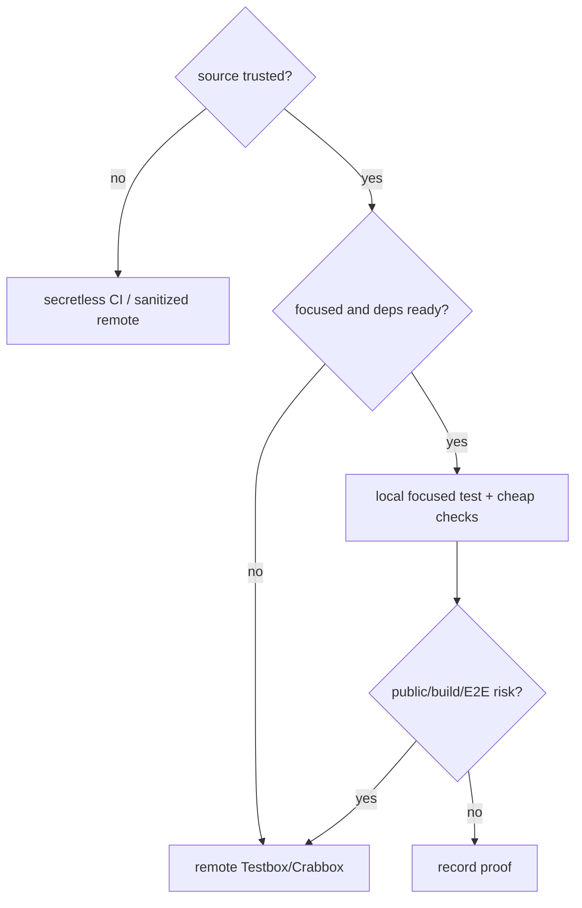

# 11：测试、调试与贡献流程

维护大型系统的核心能力不是“会跑全量测试”，而是能说明某个证据为什么覆盖了改动风险。本章使用当前仓库测试规则建立验证方法。

## 1. 先问三个问题

任何命令前先回答：

1. **源码可信么？** 自己/维护者 checkout 可在本地做小范围验证；外部 contributor/fork 代码属于不可信源码，不能在含凭据的本机或 hydrated runner 执行其脚本。
2. **改动触及什么 contract？** 纯函数、owner 编排、公开 SDK、协议、构建产物和真实频道需要不同证据。
3. **最小充分证明是什么？** 先跑直接测试，再按风险扩大；不是从全套开始。



源码信任优先于测试大小。一个只有十行的未知 PR 脚本，也不能因为“小”就在本机执行。

## 2. 当前运行时与依赖先决条件

先检查：

```bash
node --version
corepack pnpm --version
git status -sb
```

本快照 Node 约束来自 `openclaw.mjs` / `package.json`：

```text
>=22.22.3 <23
>=24.15.0 <25
>=25.9.0
```

若测试在 import 阶段报缺模块，而 checkout 刚更新，先按仓库方式 `pnpm install`，重试一次。不要把旧 `node_modules` 或不支持的 Node 误判为产品 bug。

## 3. 测试和检查是两条线

| 命令                                 | 回答的问题                                       |
| ------------------------------------ | ------------------------------------------------ |
| `pnpm test:changed`                  | 哪些 Vitest 目标值得为当前 diff 运行？           |
| `pnpm test <path-or-filter>`         | 指定行为测试是否通过？                           |
| `node scripts/run-vitest.mjs <path>` | Codex/linked worktree 中的聚焦 Vitest            |
| `pnpm changed:lanes --json`          | diff 触及哪些架构检查 lane？                     |
| `pnpm check:changed`                 | 选择并执行相关格式/type/lint/guard；不跑 Vitest  |
| `node scripts/check-changed.mjs`     | Codex/linked worktree 的 classify-first 检查     |
| `pnpm build`                         | 构建、动态 import、package/export 产物是否成立？ |
| `pnpm check:docs`                    | 官方 docs 格式、lint、链接                       |

最常见误解：`check:changed` 不运行测试，`test:changed` 也不替代类型/架构检查。

## 4. 聚焦测试的正确入口

可信普通 checkout：

```bash
pnpm test src/config/io.parse.test.ts
pnpm test extensions/telegram/src/telegram-ingress-worker.runtime.test.ts
```

Codex、linked 或 sparse worktree：

```bash
node scripts/run-vitest.mjs src/config/io.parse.test.ts
node scripts/run-vitest.mjs extensions/telegram/src/telegram-ingress-worker.runtime.test.ts
```

不要直接执行裸 `vitest`。仓库 wrapper 负责 project routing、setup、worker 约束和最终 `[test] passed|failed|skipped` 摘要。若不得不用 CLI，至少使用 `vitest run`；裸 `vitest` 会进入 watch mode。

## 5. 从 contract 选择测试

### 5.1 纯转换

示例：parse、normalize、session key helper。

证据：输入表格 + 边界/错误 case + sibling unit test。无需启动 Gateway。

### 5.2 owner 内编排

示例：channel kernel 在 preflight drop 后不调用 dispatch。

证据：带 fake adapter 的聚焦测试，同时断言结果和未发生的副作用。

### 5.3 Gateway RPC

证据组合：

- params/result schema；
- handler test；
- auth/scope case；
- 必要时 WebSocket harness。

可参考 `src/gateway/server.e2e-ws-harness.ts` 和 `src/gateway/test-helpers.e2e.ts`。

### 5.4 Plugin SDK / public contract

证据组合：SDK type/surface gate、contract test、一个代表性插件 consumer。不要仅因为 core 测试绿就断言外部插件可用。

### 5.5 频道用户行为

mock 测试证明内部编排；真实平台证明 API、网络、限速和客户端渲染。用户可见 Telegram 改动在可行时需要真实 Telegram E2E/录屏，不能把 mock Bot API 当最终证据。

### 5.6 构建与发布边界

动态 import、package exports、生成声明、bundled dist、安装/update 需要 build/package acceptance。源码 Vitest 无法证明 tarball 中真的包含文件。

## 6. 测试隔离

OpenClaw 测试涉及 config、state、agent、auth profile 和端口。共享 helper 位于：

- `src/test-utils/openclaw-test-state.ts`：Vitest 中建立隔离 `HOME`、state/config/workspace/agent dir；
- `test/helpers/openclaw-test-instance.ts`：进程级 Gateway/CLI E2E；
- `src/state/openclaw-state-db.paths.ts`：测试 worker 默认隔离 SQLite WAL。

测试不要直接污染开发者真实 state。环境变量修改应在 afterEach/fixture cleanup 恢复；数据库、timer、server、listener 和 mock 都有对称释放。

## 7. Fake timer 的陷阱

`test/AGENTS.md` 要求假计时器用例在清理阶段先恢复真实计时器。原因是异步 cleanup、poll loop 或未完成 Promise 可能依赖 timer；若仍是假时间，测试会挂住或把资源泄漏到下一用例。

推荐形状：

```ts
afterEach(async () => {
  vi.useRealTimers();
  await cleanupRuntime();
  vi.restoreAllMocks();
});
```

具体顺序以 scoped helper/test 为准。测试清理本身也是被测生命周期的一部分。

## 8. 测试什么，而不是只追求覆盖率

一个好测试至少保护一种不变量：

- 顺序：Upgrade handler 在 listen 前；
- 所有权：插件 register 返回后不能继续注册；
- 恢复：Telegram offset 等 durable spool ack；
- 隔离：不同 session/agent 不串状态；
- 终态：timeout/cancel/error 优先级唯一；
- 对称：start/claim/subscribe 都有 stop/release/unsubscribe；
- 协议：未知字段或非法 frame 被 runtime validator 拒绝。

只断言“返回不是 null”通常不能证明这些系统性质。

## 9. 调试顺序

### 9.1 固定事实

记录：

```text
HEAD SHA
Node/pnpm 版本
准确命令
测试文件/场景
首次错误
是否能重复
外部服务/secret 是否参与
```

### 9.2 找第一个 owner error

后续超时、close error 和 cleanup warning 可能只是连锁反应。先找最早改变状态的异常，而不是日志最后一行。

### 9.3 缩小边界

```text
全套失败
  -> 失败 shard
  -> 失败文件
  -> 单个 case
  -> owner helper
  -> 最小输入
```

### 9.4 比较 sibling

Telegram 失败时比较 Discord/Slack 的共享 contract；Agent timeout 失败时比较其他 runner/backend；配置问题比较 read snapshot 与 write snapshot。sibling 能揭示 invariant 属于通用层还是具体 owner。

### 9.5 区分环境失败

典型环境信号：

- Node 小版本不满足；
- `Cannot find module` 紧随 checkout 更新；
- 端口被已有 Gateway 占用；
- secret 缺失导致 live test skip/fail；
- CI SHA 与本地 SHA 不一致；
- Linux snapshot 与 macOS 字节差异。

先修环境，再讨论源码。

## 10. 日志与可观测性

好的调试日志包含 owner facts，而不是 secret 或完整 payload：

```text
run id / request id
session key（必要时脱敏）
channel/account id
stage / terminal outcome
elapsed / timeout
error code / retryable
```

Gateway frame 的 request id、Agent run id、durable ingress event id 各有不同 correlation 范围。不要只用一个自然语言 message 搜所有层。

如果需要性能判断，使用已有 startup trace/benchmark 和多次样本，不从一次 wall-clock 断言优化。`/healthz` 证明进程可回答，`/readyz` 才证明 ready-critical startup 已完成。

## 11. 何时扩大到远程验证

以下默认属于远程 Testbox/Crabbox 或 CI：

- changed gate 触发 typecheck/lint fan-out；
- 完整 suite；
- build；
- Docker/package/install/update；
- E2E/live provider/live channel；
- 跨平台；
- 发布验证。

可信维护者重型验证默认 Blacksmith Testbox。不可信 PR 必须使用 secretless fork CI 或严格净化的 AWS Crabbox，绝不能进入 hydrated Testbox。完整安全命令随基础设施变化，执行前阅读 `.agents/skills/openclaw-testing/SKILL.md` 和 `.agents/skills/crabbox/SKILL.md`，不要从教程复制过时云命令。

远端 backend 不可用时，可信源码可按任务风险回落本机并明确说明；不可信源码不能回落本机。

## 12. CI 心智模型

`.github/workflows/ci.yml` 的 preflight 先做 scope manifest，再开启相关 lane。关键分类：

- security-fast；
- build artifacts；
- fast core/contracts；
- changed-target 或 compact Node test shards；
- check/check-additional；
- docs；
- Windows/macOS/iOS/Android；
- 最终 `openclaw/ci-gate`。

PR 通常按 diff 精确选择；`main` 和手工发布验证更广。看到 skip 先查 preflight manifest，不要把 scope-disabled skip 当通过或失败。

CI 调试先查准确 SHA 和 job state：

```bash
gh run view <run-id> --json status,conclusion,headSha,url,jobs
gh run view <run-id> --job <job-id> --log
```

只取失败/相关 job 日志。被新 head supersede 的 cancelled run 通常不是产品失败。

## 13. 文档和教程的验证

官方 docs 修改：

```bash
pnpm docs:list
pnpm check:docs
git diff --check
```

本教程位于 ignored `docs/internal/**`，不会进入官方 docs lane，因此还要自行验证：

- Markdown fence 成对；
- 内部相对链接存在；
- 源码符号/路径仍存在；
- 索引列出的每个模块已落盘；
- 没有 secret、绝对本机路径或环境私有数据。

## 14. 提交前阅读范围

对代码改动，在说“最佳修复”前至少读：

```text
changed function/module
entry point
owner boundary
one caller
one callee
sibling implementations
adjacent tests
scoped docs/AGENTS.md
dependency source/types（若行为由依赖决定）
```

依赖行为不能靠记忆猜。涉及 Codex protocol/runtime 的改动还有硬门：亲自检查 sibling `../codex` 对应源码，并在评审证据中列出文件/行。

代码变化提交前需要 fresh autoreview，直到没有接受的 actionable finding；纯文档可按 docs-only 规则验证。

## 15. 一个验证报告模板

```markdown
## Scope

- touched owner:
- public/user-visible contract:
- sibling surfaces checked:

## Focused proof

- command:
- result:
- what invariant it proves:

## Broader proof

- command/run URL:
- exact SHA:
- result:

## Not run

- proof omitted:
- why it is unnecessary or blocked:

## Environment

- Node/pnpm/platform:
```

“未运行”比模糊声称通过更可靠。说明缺少什么、为什么不影响结论或为何形成 blocker。

## 16. 本章练习

### 练习 A：为三个改动选证明

分别为纯 session key helper、Gateway protocol optional 字段、Telegram 出站格式改动设计最小到完整的验证阶梯。

验收：每一级明确证明的 contract，不允许统一回答“跑全测”。

### 练习 B：制造并缩小失败

在临时分支或只读测试推演中选一个 focused test，先读整个 suite，再只运行单文件，记录 setup/cleanup 和第一个 owner error。

### 练习 C：读 CI manifest

对一个已有小 diff 运行 `changed:lanes`（环境满足时），预测 CI lane，再对照输出。

验收：解释 check lane 与 Vitest target 为什么可能不同。
