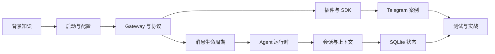

# OpenClaw 源码学习教程

这是一套面向源码阅读者的中文教程。目标不是把官方用户手册翻译一遍，而是带你回答四类工程问题：

1. 一条命令、消息或 Agent 请求从哪里进入系统？
2. 配置、协议、会话、工具、插件和持久化分别由谁负责？
3. OpenClaw 为什么采用这些边界和不变量？
4. 修改代码后，怎样选择足够而不过量的验证手段？

教程以仓库提交 `fc3476b116b982d96e94cc86e3daf0f080c84ada`、包版本 `2026.7.2` 为阅读快照。源码会继续变化，因此应优先按“符号名 + 文件路径”查找；行号只用来帮助定位这个快照。

> 本目录位于 `docs/internal/**`，是本地学习材料，不进入 OpenClaw 官方文档发布和导航。官方文档源稿要求使用英文，中文内容因此有意放在内部目录。

## 你将学会什么

完成全部模块后，你应该能够：

- 从启动器追踪到 Commander 命令和 Gateway 长驻进程；
- 解释配置加载、验证、运行时快照和 doctor 迁移的边界；
- 读懂 Gateway 的 `req`、`res`、`event` 三类帧及握手过程；
- 画出“一条频道消息 → 路由 → 会话 → Agent → 工具 → 回复”的端到端路径；
- 区分 session、context、transcript、compaction 与 memory；
- 解释核心、Plugin SDK、插件和频道适配器之间的依赖方向；
- 用 Telegram 插件做一次完整的真实代码案例分析；
- 理解共享状态库与每 Agent 状态库为什么分开；
- 为一个小改动选择源码搜索、聚焦测试、静态检查和远程验证。

## 模块地图

| 顺序 | 模块                                                             | 核心问题                                     | 建议时间 |
| ---- | ---------------------------------------------------------------- | -------------------------------------------- | -------- |
| 0    | [学习路线](00-learning-roadmap.md)                               | 怎样把大仓库拆成可验证的小阶段？             | 30 分钟  |
| 1    | [TypeScript、Node 与协议背景](01-background-typescript-node.md)  | 读这套代码前必须补哪些基础？                 | 2–4 小时 |
| 2    | [仓库地图与启动链](02-repository-map-and-bootstrap.md)           | `openclaw` 命令怎样进入真正的业务代码？      | 2–3 小时 |
| 3    | [CLI、配置与运行时快照](03-cli-config-and-runtime-snapshot.md)   | 配置如何加载、验证并成为稳定运行时事实？     | 3–4 小时 |
| 4    | [Gateway 与协议](04-gateway-and-protocol.md)                     | 客户端和长驻服务如何通信？                   | 3–4 小时 |
| 5    | [消息生命周期](05-message-lifecycle.md)                          | 一条消息怎样跨越频道、路由、队列和出站发送？ | 4–6 小时 |
| 6    | [Agent 运行时与工具循环](06-agent-runtime-and-tool-loop.md)      | 模型、提示词、工具、流式事件和终态如何协作？ | 5–7 小时 |
| 7    | [会话、上下文、压缩与记忆](07-session-context-memory.md)         | 看似相近的状态概念分别解决什么问题？         | 4–5 小时 |
| 8    | [插件系统与 SDK](08-plugin-system-and-sdk.md)                    | 扩展能力怎样接入而不污染核心？               | 4–5 小时 |
| 9    | [Telegram 频道案例](09-telegram-channel-case-study.md)           | 一个频道插件如何完成收、管、发全链路？       | 4–6 小时 |
| 10   | [SQLite 状态模型](10-state-and-sqlite.md)                        | 状态存在哪里，事务不变量是什么？             | 3–4 小时 |
| 11   | [测试、调试与贡献流程](11-testing-debugging-and-contribution.md) | 怎样证明自己的理解和改动是对的？             | 3–5 小时 |
| 12   | [递进式实战](12-hands-on-labs.md)                                | 如何把阅读变成可检查的工程成果？             | 1–2 周   |
| 13   | [术语表与源码索引](13-glossary-and-source-index.md)              | 遗忘概念时从哪里快速返回？                   | 按需     |

依赖关系可以简化为：



## 三种学习方式

### 完整路线

按 0 → 13 顺序阅读。每个模块都完成“源码追踪”和“练习验收”。适合希望参与核心、插件或频道开发的人。

### Agent 路线

按 0 → 1 → 2 → 4 → 6 → 7 → 10 → 11 → 12 阅读。重点理解请求、模型循环、工具、上下文和持久化。

### 插件与频道路线

按 0 → 1 → 2 → 3 → 4 → 5 → 8 → 9 → 11 → 12 阅读。重点理解清单、SDK 边界、频道生命周期和 Telegram 的真实实现。

## 推荐的阅读循环

不要连续“刷文件”。每次学习都运行下面这个六步循环：

1. **提出问题**：例如“`gateway run` 为什么有快路径？”
2. **定位入口**：先用 `rg` 找符号，再读完整函数和模块。
3. **沿边界追踪**：至少找一个调用者、一个被调用者和一个同类实现。
4. **写出不变量**：例如“同一 session 的 Agent 执行必须串行”。
5. **找测试反证**：测试名通常比实现更直接地说明边界条件。
6. **做最小实验**：运行聚焦测试或只读命令，确认你的心智模型。

常用命令：

```bash
# 文件与符号搜索
rg --files src extensions packages | rg 'gateway|agent|telegram'
rg -n "runEmbeddedAgent|GatewayFrameSchema|loadConfig" src packages extensions

# 读取当前版本和运行时要求
node -p "require('./package.json').version"
node --version

# 源码 checkout 中运行一个聚焦测试
node scripts/run-vitest.mjs path/to/example.test.ts

# 查看当前改动
git status -sb
git diff --check
```

运行项目脚本前，先满足 [安装文档](https://docs.openclaw.ai/install) 和 `package.json` 中的 Node 版本约束。本快照要求 Node `>=22.22.3 <23`、`>=24.15.0 <25` 或 `>=25.9.0`，推荐 Node 24。

## 如何读教程中的代码

代码块会省略与当前问题无关的细节：

```ts
// 教程中的省略写法，不代表源码原样
const prepared = await prepareRequest(/* ... */);
return execute(prepared);
```

每个重要片段旁边都会给出源码文件和符号。以源码为准，并按以下层次读：

```text
协议/类型：允许什么输入和输出？
入口：谁触发它？
编排：步骤按什么顺序发生？
所有者：哪个模块拥有状态和决策？
副作用：网络、数据库、文件、进程在哪里发生？
验证：哪个测试证明这个行为？
```

## 官方资料与本教程的关系

官方文档解释用户可见的产品模型，本教程解释这些模型如何落到代码。建议配合阅读：

- [Architecture](https://docs.openclaw.ai/concepts/architecture)
- [Agent Loop](https://docs.openclaw.ai/concepts/agent-loop)
- [Messages](https://docs.openclaw.ai/concepts/messages)
- [Session Management](https://docs.openclaw.ai/concepts/session)
- [Context](https://docs.openclaw.ai/concepts/context)
- [Memory](https://docs.openclaw.ai/concepts/memory)
- [Plugins](https://docs.openclaw.ai/plugins)
- [Testing](https://docs.openclaw.ai/help/testing)

## 完成标准

你不需要记住所有文件。真正的完成标准是能在不猜测的前提下完成以下任务：

- 给定一个 CLI 命令，找到注册点、处理函数和副作用边界；
- 给定一条 Gateway 方法，找到参数 schema、服务端处理器和事件输出；
- 给定一个频道问题，判断它属于核心消息管线还是插件所有者；
- 给定一个 Agent 异常，定位是模型、工具、会话、超时还是投递阶段；
- 给定一个状态需求，判断应放共享数据库、每 Agent 数据库还是不应持久化；
- 给定一处改动，列出直接测试、兄弟表面和用户可见证明。

如果这六项都能做到，你已经从“看懂局部代码”跨到了“能维护系统边界”。
