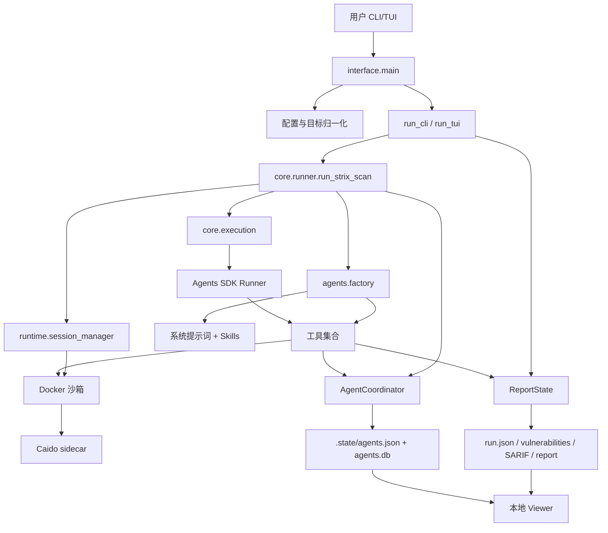
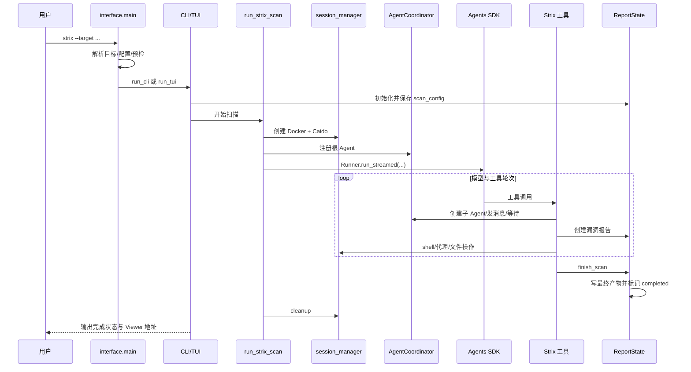

# 02. 总体架构与一次扫描的数据流

这一章建立全局地图。建议先读完，再深入后续模块。

## 1. 分层结构

Strix 可以按责任分成八层：

| 层 | 主要目录 | 责任 |
| --- | --- | --- |
| 接口层 | `strix/interface/` | 参数、CLI 实时输出、Textual TUI |
| 配置层 | `strix/config/` | 环境变量、JSON 配置、模型路由 |
| 编排核心 | `strix/core/` | 扫描 Runner、Agent 状态、执行循环、会话 |
| Agent 构建 | `strix/agents/` | 系统提示词、技能组合、工具注册 |
| 工具层 | `strix/tools/` | shell 之外的业务工具：报告、代理、协作等 |
| 运行时层 | `strix/runtime/` | Docker/可插拔后端、源码装载、Caido |
| 报告层 | `strix/report/` | 扫描产物、去重、SARIF、用量 |
| 展示层 | `strix/viewer/` | 本地 HTTP API、React SPA、PDF/邮件流程 |

依赖方向大体是接口层调用核心，核心组装 Agent/运行时，工具调用报告或协调器，Viewer 只读取落盘产物。少量全局状态和 callback 是为了把 SDK 工具事件投影到产品界面。

## 2. 最重要的五个对象

### 2.1 `scan_config`

扫描输入的普通字典。它回答：测试什么、什么模式、用户有什么附加要求、是否 diff scope、是否恢复。

### 2.2 `RunConfig`

OpenAI Agents SDK 的运行配置，在 [`strix/core/runner.py`](../../strix/core/runner.py) 创建：

```python
run_config = RunConfig(
    model=resolved_model,
    model_provider=StrixProvider(),
    model_settings=model_settings,
    sandbox=SandboxRunConfig(
        client=bundle["client"],
        session=bundle["session"],
    ),
    trace_include_sensitive_data=False,
)
```

它回答：用哪个模型、怎样路由、模型参数是什么、工具在哪个沙箱执行。

### 2.3 `AgentCoordinator`

多 Agent 图和运行时注册表。它拥有状态、父子关系、名称、元数据、消息计数，以及不落盘的 Task/Stream/Event 句柄。

### 2.4 SDK `SQLiteSession`

每个 Agent 以自己的 `agent_id` 作为 session ID，共享 `.state/agents.db` 文件。它保存完整模型与工具历史，是恢复对话的基础。

### 2.5 `ReportState`

产品产物的内存聚合器和落盘入口。它不负责模型会话，而负责漏洞列表、最终四段报告、运行记录、用量和 SARIF。

## 3. 组件关系图



图中的关键边界是：Agent 的“思考与工具循环”由 SDK 驱动，但多 Agent 地址、扫描业务生命周期、漏洞产物和沙箱策略由 Strix 自己实现。

## 4. `run_strix_scan()` 的装配过程

[`run_strix_scan()`](../../strix/core/runner.py) 是 composition root，也就是把各模块真正组装在一起的地方。按代码顺序：

1. 生成或接受 `scan_id`，创建 `run_dir/.state` 和扫描日志。
2. 根据 `agents.json` 是否存在判断 fresh run 或 resume。
3. 加载配置，解析模型，配置 provider compatibility。
4. 创建/恢复 `AgentCoordinator`。
5. 从磁盘恢复 todo 与 notes。
6. 恢复根 Agent ID 或生成新的 8 位 ID。
7. `session_manager.create_or_reuse()` 创建沙箱与 Caido client。
8. 从 `scan_config` 构造 root task、scope context 和模型设置。
9. 创建 `RunConfig`、成本 hook、根 Agent、子 Agent factory。
10. 创建根 SQLite session，把运行时能力装入 `context`。
11. 恢复时重新启动需要恢复的子 Agent。
12. 调用 `run_agent_loop()`。
13. 在 `finally` 中关闭 SQLite session、保存拓扑、按策略清理沙箱和日志。

这类函数较长并不一定意味着所有逻辑都应内联。当前代码把目标文本、模型设置、执行循环、会话、运行时分别下沉到了子模块，`run_strix_scan()` 主要保留装配顺序。

## 5. 三种“上下文”不要混淆

### 扫描配置 `scan_config`

来自用户/CLI，既用于 Runner，也写入 `run.json`。

### 系统提示词上下文 `system_prompt_context`

由 `build_scope_context()` 生成，包含平台验证过的授权目标：

```json
{
  "scope_source": "system_scan_config",
  "authorization_source": "strix_platform_verified_targets",
  "authorized_targets": [],
  "user_instructions_do_not_expand_scope": true
}
```

它进入系统提示词，用于确保普通用户 instruction 不能扩大授权范围。

### 工具运行上下文 `context`

包含 coordinator、sandbox session、Caido client、当前 agent_id、parent_id 和 spawn callback。它是可执行能力的容器，不直接写入报告。

## 6. 一次新扫描的时序



## 7. 运行目录是模块间的稳定协议

典型目录：

```text
strix_runs/<run-name>/
├── run.json
├── penetration_test_report.md
├── vulnerabilities.json
├── vulnerabilities.csv
├── findings.sarif
├── vulnerabilities/
│   ├── vuln-0001.md
│   └── ...
└── .state/
    ├── agents.json
    ├── agents.db
    ├── notes.json        # 使用后才出现
    └── todos.json        # 使用后才出现
```

可以把它分成两类：

- **公开运行产物**：`run.json`、报告、漏洞、SARIF；Viewer 和 CI 可以消费。
- **内部恢复状态**：`.state/`；用于继续 Agent 对话和拓扑，不是面向客户的报告。

Viewer 选择“每次请求直接读磁盘”，因此扫描进程与 Viewer 不需要共享复杂内存协议。TUI 内嵌 Viewer 时只额外提供 steering callback。

## 8. 状态所有权表

| 状态 | 所有者 | 持久化 | 主要消费者 |
| --- | --- | --- | --- |
| 模型/工具历史 | SDK `SQLiteSession` | `.state/agents.db` | 恢复、TUI/Viewer transcript |
| Agent 拓扑与状态 | `AgentCoordinator` | `.state/agents.json` | 调度、恢复、Agent 图 |
| Task/stream/wake | `AgentRuntime` | 不持久化 | 当前进程执行循环 |
| 漏洞与最终报告 | `ReportState` | run 目录多种文件 | CLI、Viewer、CI |
| todo/notes | 对应工具模块 | `.state/*.json` | Agent 跨轮次记忆 |
| TUI 展示事件 | `TuiLiveView` | 可从 SDK DB 重建 | Textual UI |

“谁拥有状态”是修改项目时最重要的判断。例如要改变 Agent 完成状态，应修改 Coordinator/生命周期工具；要改变 Viewer 漏洞展示字段，应先确认报告产物是否已有该字段。

## 9. 失败与清理策略

Runner 区分几种结束：

- `BudgetExceededError`：扫描范围内的干净停止，唤醒所有等待 Agent，状态变成 stopped。
- 持续 `RateLimitError`：保存可恢复状态，提示稍后 `--resume`。
- 其他异常：根 Agent 标记 failed，取消后代并重新抛出。
- 正常 lifecycle tool：根 Agent completed，报告标记 completed。

`finally` 始终尝试：关闭 SQLite Session、保存 Coordinator 快照、清理沙箱、关闭扫描日志。多处使用 `contextlib.suppress()` 是因为清理错误不应掩盖最初的扫描错误。

## 10. 本章源码阅读任务

按下面顺序读，每个函数只写一句职责：

1. [`strix/interface/main.py`](../../strix/interface/main.py)：`main()`。
2. [`strix/interface/cli.py`](../../strix/interface/cli.py)：`run_cli()`。
3. [`strix/core/runner.py`](../../strix/core/runner.py)：`run_strix_scan()`。
4. [`strix/core/execution.py`](../../strix/core/execution.py)：`run_agent_loop()` 与 `_run_cycle()`。
5. [`strix/report/state.py`](../../strix/report/state.py)：`ReportState._save_artifacts()`。

最后尝试不看教程画出自己的调用图，并标出四个落盘点：初始 `run.json`、Agent 快照、SDK Session、漏洞/最终报告。
