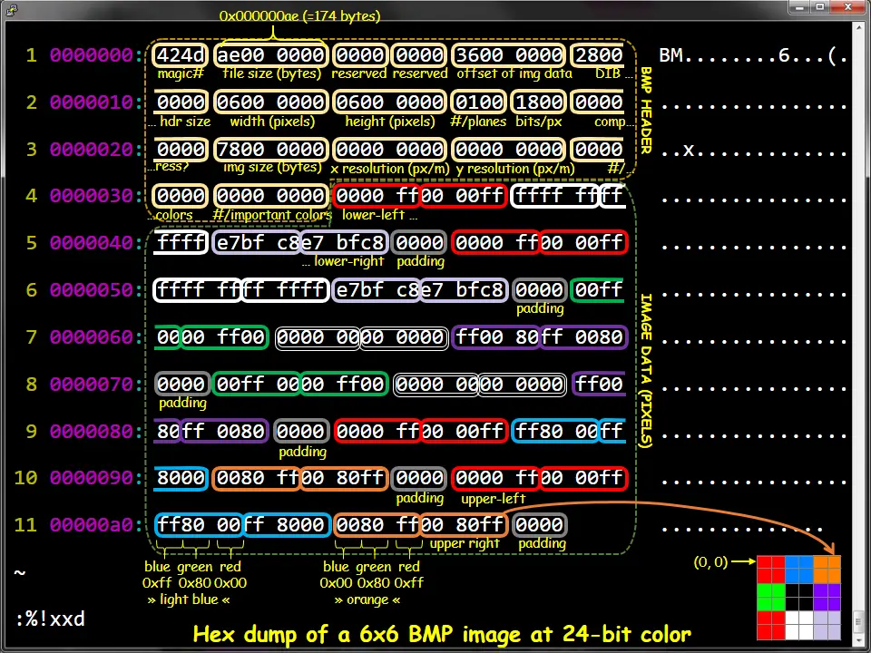
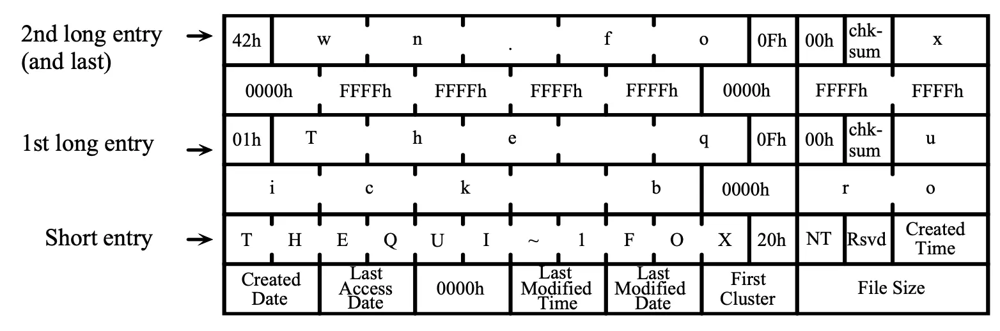
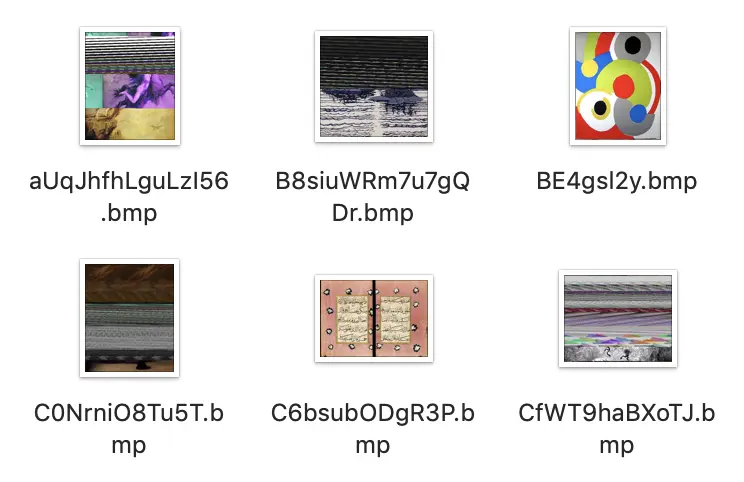

[Yanyan's wiki](/)

 for

  - [操作系统 (2026 春)](/OS/2026/)

# M8: 文件系统格式化恢复 (fsrecov)

⏰**Soft Deadline: 同 Hard Deadline (期末后；无奖励加分)**

请注意遵守[实验须知](README.md)中的 AIGC Policy；在命令行中 `git pull origin M8` 下载框架代码。

⚖️**M8 - fsrecov**

请输入 Token 登录。

## 1\. 背景

我们都知道移动存储是不太可靠的，也早就习惯把重要的数据保存在云端；例如，做一个 `~/iCloud` 的符号链接，随时可以在命令行里访问云盘。但这并不意味着 FAT 系列的文件系统就 “没有” 了。首先，在小设备上，FAT 的存储是相当紧凑的，加上实现简单，EFI 分区规定使用 FAT 文件系统就是个更通用和兼容的设计。此外，对于大部分文件都不小，而且是不太频繁写入的场景，FAT 的性能其实还不错——例如，数码相机。今天的相机，哪怕有数百 GB 的 SD 卡，依然保持了 exFAT (类似 “FAT64”) 文件系统。

对于 FAT 系列的文件系统，格式化只会重置文件系统里的 File Allocation Table，数据块仍然存在，因此原则上我们可以把数据抢救回来！注意到文件系统是磁盘上的数据结构，如果你希望 “消除” 一个数据结构，你就只需要：

    root->left = root->right = NULL;

数据结构的其他部分也就永久地丢失了，我们完成了一次完美的 “内存泄漏”。当然，因为整个数据结构都被摧毁，你也可以重置内存分配器的状态，这样所有磁盘上的空间就变得可以被分配，磁盘也就 “焕然一新” (被格式化) 了。这解释了为什么 1TB 磁盘的快速格式化瞬间就可以完成。操作系统也提供了多种格式化的选项，包括更安全、也更慢 (更伤存储设备) 覆盖数据的格式化。

## 2\. 实验描述

🗒️**实验要求：从快速格式化的 FAT32 文件系统中恢复图片数据**

实现命令行工具 `fsrecov`，给定一个经过快速格式化 (mkfs.vfat) 的 FAT32 文件系统镜像，镜像格式化前绝大部分文件都是以 BMP 格式存储的，你需要尽可能地从文件系统中恢复出完整的图片文件。

### 2.1 总览

fsrecov FILE

FILE 是一个 FAT-32 文件系统的镜像。每恢复一张图片文件 (完整的文件，包含 BMP 头和所有数据)，调用系统中的 `sha1sum` 命令获得它的校验和，在标准输出中逐行输出图片文件的校验和以及你恢复出的文件名。只有校验和与文件名**都恢复正确且一致**，才被认为正确恢复了一个文件。

### 2.2 文件系统

作为一个 “小实验”，我们对恢复文件的任务作出了一些简化。首先，我们保证我们的文件系统镜像是使用如下方法创建的 (主要使用 `mkfs.fat` 工具):

首先，创建一个空文件 (例如在下面的例子中，文件系统镜像的大小是 64 MiB)，例如：

    $ cat /dev/zero | head -c $(( 1024 * 1024 * 64 )) > fs.img

得到 fs.img，然后在这个文件上创建 FAT-32 文件系统：

    $ mkfs.fat -v -F 32 -S 512 -s 8 fs.img
    mkfs.fat 4.2 (2021-01-31)
    WARNING: Number of clusters for 32 bit FAT is less then suggested minimum.
    fs.img has 8 heads and 32 sectors per track,
    hidden sectors 0x0000;
    logical sector size is 512,
    using 0xf8 media descriptor, with 131072 sectors;
    drive number 0x80;
    filesystem has 2 32-bit FATs and 8 sectors per cluster.
    FAT size is 128 sectors, and provides 16348 clusters.
    There are 32 reserved sectors.
    Volume ID is 80121567, no volume label.

注意我们使用的选项：`-S 512` 表示 sector 大小是 512, `-s 8` 表示每个 cluster 有 8 个 sectors。这个信息对大家正确编程非常重要——如果你想偷懒，可以假设我们总是用这种方式创建文件系统镜像 (即硬编码这个信息)，但我们更推荐你阅读手册，写出兼容 FAT 标准的 fsrecov。如果你用 `file` 命令，可以查看到镜像已经被正确格式化：

    $ file fs.img
    fs.img: DOS/MBR boot sector, code offset 0x58+2, OEM-ID "mkfs.fat", sectors/cluster 8, Media descriptor 0xf8, sectors/track 32, heads 8, sectors 131072 (volumes > 32 MB), FAT (32 bit), sectors/FAT 128, serial number 0x80121567, unlabeled

我们会挂载这个镜像 (一个空的文件系统)，并在根目录下创建 `DCIM` 目录。现在仍然有很多相机延续了这个命名习惯。然后我们会在 DCIM 目录中进行很多次如下的文件操作。尽管图片文件分辨率、大小可能不同，但都**保证是真实世界中有意义的图片** (而不是随机数生成器生成的随机数据)：

  - 向 DCIM 中复制图片文件 (文件名为大/小写字母和数字、减号、下划线，以 “.bmp” 或 “.BMP” 结尾)
  - 删除 DCIM 中的图片文件
  - ……
  - (反复操作之后，文件系统中可能存在一些碎片化的情况)

操作完成后，我们会 unmount 文件系统镜像，然后再进行一次文件系统的快速格式化，通过使用同样的选项再次调用 `mkfs.fat`：

    $ mkfs.fat -v -F 32 -S 512 -s 8 fs.img

此时的 `fs.img` 就是你要恢复的文件系统镜像。此外，你可以假设所有的 BMP 文件都是使用 Python PIL 库创建的 24-bit 位图：

    $ file 0M15CwG1yP32UPCp.bmp
    0M15CwG1yP32UPCp.bmp: PC bitmap, Windows 3.x format, 364 x 448 x 24

### 2.3 输出格式

你的任务是尝试恢复出 DCIM 目录下尽可能多的图片文件。对于每个恢复出的文件，输出一行，第一个字符串是该文件的 SHA1 fingerprint (通过调用系统的 `sha1sum` 命令得到)，然后可以输出一个或多个空格，接下来输出图片的文件名，例如：

    d60e7d3d2b47d19418af5b0ba52406b86ec6ef83  0M15CwG1yP32UPCp.bmp
    1ab8c4f2e61903ae2a00d0820ea0111fac04d9d3  1yh0sw8n6.bmp
    1681e23d7b8bb0b36c399c065514bc04badfde79  2Kbg82NaSqPga.bmp
    ...

## 3\. 正确性标准

⚠️**严格按照要求输出**

只有一行同时包含 40 字符的 sha1sum 之后是文件名，这一行才会被 Online Judge 解析。你的输出中可能带有一些调试信息，我们会忽略它 (不要输出太多调试信息，否则会导致 output limit exceeded)。

### 3.1 评测说明

我们会使用不超过 128 MiB 的镜像文件来测试你的文件，时间限制为 10s。

  - 超过 10% 的文件名被恢复正确，可以通过所有 easy test cases；
  - 超过 50% 的文件名被恢复正确，可以通过一个 hard test case；
  - 超过 75% 的文件名和 50% 的图片被恢复正确，可以通过所有 hard test cases。

不必把图片恢复任务想象得太困难——大文件在文件系统中是倾向于连续存储的，就像在下面参考镜像的 FAT 表中看到的那样。此外，Online Judge 会把你的输出作为一个 utf-8 字符串进行读取。因此，如果你输出了非法的字符 (例如不经检查地输出恢复的文件名，但其实并不是合法的文件名)，将有可能导致解码失败。因此，你输出时请只保留文件名中的可打印 ASCII 字符。

☕️**Time Limit Exceeded?**

你的程序可能无法在时限内恢复出所有的图片；首先，你可以在每恢复出一个图片后打印，并 flush stdout (超时的程序会被终止，但只要恢复的文件名/图片正确即判定为正确)。此外，你还可以使用 fork 创建多个进程并行恢复。你可以利用 Online Judge 服务器上的所有处理器核心：评测是串行的。

### 3.2 参考镜像

我们为大家提供了一个参考文件系统镜像。实际测试的图像来自同一个数据集 (WikiArt)，但我们可能会挑选不同的图片、赋予文件其他的随机名称或改变图像的大小，但所有随机的参数都与我们给出的镜像相同 (例如随机的文件名长度的分布等)。镜像请[点这里下载](https://box.nju.edu.cn/f/66a41ec46a334e8d8203/)。

镜像下载完毕后可以直接在文件系统中挂载 (你可能需要 root 权限)，这个镜像文件就成为了文件系统的一部分：

    $ mount /tmp/fsrecov.img /mnt/
    $ tree /mnt/
    /mnt
    └── DCIM
        ├── 0M15CwG1yP32UPCp.bmp
        ├── 1yh0sw8n6.bmp
        ├── 2Kbg82NaSqPga.bmp
        ...

你可以查看其中的图片文件，例如 `3DhTVVP9avTrH.bmp` 是下面的图片：

如果你用二进制工具 (例如我们使用的是 xxd) 查看镜像文件，你能发现正确的 FAT 表，以链表的形式保存了每个图像文件的下一个数据块 (在 FAT 系统中，是 cluster 的编号)：

    00004000: f8ff ff0f ffff ff0f f8ff ff0f 1720 0000  ............. ..
    00004010: 0500 0000 0600 0000 0700 0000 0800 0000  ................
    00004020: 0900 0000 0a00 0000 0b00 0000 0c00 0000  ................
    00004030: 0d00 0000 0e00 0000 0f00 0000 1000 0000  ................
    00004040: 1100 0000 1200 0000 1300 0000 1400 0000  ................

接下来，你可以模拟 Online Judge 在测试你的代码前所做的操作：使用 `mkfs.fat` 快速格式化这个磁盘镜像：

    $ mkfs.fat -v -F 32 -S 512 -s 8 fsrecov.img
    mkfs.fat 4.1 (2017-01-24)
    WARNING: Not enough clusters for a 32 bit FAT!
    /tmp/fsrecov.img has 64 heads and 32 sectors per track,
    hidden sectors 0x0000;
    logical sector size is 512,
    using 0xf8 media descriptor, with 131072 sectors;
    drive number 0x80;
    filesystem has 2 32-bit FATs and 8 sectors per cluster.
    FAT size is 128 sectors, and provides 16348 clusters.
    There are 32 reserved sectors.
    Volume ID is a332d0ad, no volume label.

如果你接下来再次挂载这个镜像，将会看到完全空白的目录，仿佛磁盘镜像上的所有文件都被删除了：

    $ tree /mnt/
    /mnt/

    0 directories, 0 files

如果再次查看 `fsrecov.img` 二进制文件，你会发现分区表已经被 “抹除” 了：

    00004000: f8ff ff0f ffff ff0f f8ff ff0f 0000 0000  ................
    00004010: 0000 0000 0000 0000 0000 0000 0000 0000  ................
    00004020: 0000 0000 0000 0000 0000 0000 0000 0000  ................
    00004030: 0000 0000 0000 0000 0000 0000 0000 0000  ................
    00004040: 0000 0000 0000 0000 0000 0000 0000 0000  ................

虽然操作系统已经看不到磁盘上的文件了，但如果你仔细地搜索 (使用 “查找” 工具) 一下，还是可以发现一些蛛丝马迹：

    00025ae0: 4250 0043 0070 002e 0062 000f 0089 6d00  BP.C.p...b....m.
    00025af0: 7000 0000 ffff ffff ffff 0000 ffff ffff  p...............
    00025b00: 0130 004d 0031 0035 0043 000f 0089 7700  .0.M.1.5.C....w.
    00025b10: 4700 3100 7900 5000 3300 0000 3200 5500  G.1.y.P.3...2.U.
    00025b20: 304d 3135 4357 7e31 424d 5020 0064 2b5a  0M15CW~1BMP .d+Z
    00025b30: ac50 ac50 0000 2b5a ac50 6915 3677 0700  .P.P..+Z.Pi.6w..

这好像以某种格式 (FAT32 的 directory entry) 存储了 “`0M15CwG1yP32UPCp.bmp`” 相关的信息。此外，bitmap 图片文件的文件头也被完整地在数据区里保留下来：

    000fb000: 424d 2ecf 0f00 0000 0000 3600 0000 2800  BM........6...(.
    000fb010: 0000 0202 0000 9f02 0000 0100 1800 0000  ................
    000fb020: 0000 f8ce 0f00 c40e 0000 c40e 0000 0000  ................
    000fb030: 0000 0000 0000 7d74 9986 7ba3 6c61 8888  ......}t..{.la..
    000fb040: 7ea4 8076 9d84 7ca2 766d 9469 6187 6a64  ~..v..|.vm.ia.jd

你的 `fsrecov` 会被调用，运行在这个格式化后的镜像上，然后预期会得到一定的输出：

    d60e7d3d2b47d19418af5b0ba52406b86ec6ef83  0M15CwG1yP32UPCp.bmp
    ...

如果你挂载没有被格式化过的 `fsrecov.img`，你可以查看所有图片的 sha1sum，从而检查你正确恢复了哪些图片。

    $ cd /mnt/DCIM && sha1sum *.bmp
    d60e7d3d2b47d19418af5b0ba52406b86ec6ef83  0M15CwG1yP32UPCp.bmp
    1ab8c4f2e61903ae2a00d0820ea0111fac04d9d3  1yh0sw8n6.bmp
    1681e23d7b8bb0b36c399c065514bc04badfde79  2Kbg82NaSqPga.bmp
    aabd1ef8a2371dd64fb64fc7f10a0a31047d1023  2pxHTrpI.bmp
    ...

## 4\. 实验指南

⚠️**AIGC Policy**

与所有其他实验一样，本实验的 AIGC Policy 是只能询问实时性的问题和生成单个 API 的调用方法。我们希望你可以体会一下根据 specification (虽然可以在 AI 的帮助下) 解析数据结构的过程，获得第一手的系统掌控感。

### 4.1 格式化数据恢复

如果数据结构的格式化使用：

    root->left = root->right = NULL;

那么，undelete 就只要找回两个指针，整个二叉树就全都回来了 (假设其他部分的数据没有被覆盖掉)：

    root->left = find_left();
    root->right = find_right();

“删除” 总是相当危险的操作。在某个月黑风高的夜晚修改了代码，以为 `OBJ_DIR` 这个变量不再使用，遂删除。结果没有料到，Makefile 里还有这么一手：

    clean:
        rm -rf ... $(OBJ_DIR)/* ...

在另一个月黑风高的夜晚，`make clean` 之后，`rm -rf /*` 开始了……每个人 (包括 jyy) 都有过在脑抽的时候误删过文件的经历。那可真是相当惨痛的经历——类似的还有把重要数据保存在优盘上，然后文件系统发生了损坏……当然，数据其实并没有从存储器上消失，因此如果有数据恢复的软件，那真是救命了！

☕️**保护好你的数据**

自从用上了 git、养成按时 git push 的习惯之后，重要数据的损失就降低到最小了——至少可以保证在任何时候，如果瞬间某台电脑彻底损坏，损失的工作量不会超过几个小时。每当 git push 成功以后，心里都会觉得很踏实。你在 809 的门上看到：

此外，现在的网络云盘也会保留一定的编辑历史。“保存历史版本” 其实是一个相当自然、符合直觉的设计。当然，未来也许所有服务都在云端，我们也再也不用担心数据的丢失。

数据对每个人来说都是非常宝贵的。在数码相机等设备的存储卡中，FAT (exFAT) 这样的文件系统依然广泛使用。再加上 “追加写入” 的特点，大部分照片是直接连续存储在存储卡中，也意味着相片是相对更容易恢复的。如果你不小心删除了一整天拍摄的照片，当你恢复出它们的时候，一定感受到文件系统设计者的不杀之恩。但同时，这也意味着不法分子有了可乘之机。文件系统中总有一些你不想让别人看到的文件——你不仅想在文件系统中删除它，还希望别人即便拿到你的磁盘做数据恢复，也不能恢复出文件的内容：明文存放了各大网站密码的文件、不能见人的照片……别有用心的人用 “修电脑” 摧毁了冠希哥和一众演艺界明星的事业和生活。格式化过的 SD 卡、恢复出厂设置的手机，都可能是不法分子敲诈勒索的筹码。幸运的是，随着文件系统加密(在文件系统层写入数据前即执行数据的加密)的普及，大家越来越不用担心这些问题了。

💡**文件粉碎**

有些系统软件提供了 “文件粉碎” 的功能。文件粉碎的一个实现方法是用覆盖写的方式把文件的数据清除 (即找到磁盘上所有存储了该文件数据的块，并且向块内写入随机数据)，然后再删除。今天的 SSD FTL 可以在逻辑上把数据块标记为可用，实现快速的格式化和逻辑上的全盘擦除。

### 4.2 FAT32 文件系统

我们提供了一份 [Microsoft FAT Specification](../../manuals/MSFAT-spec.pdf) 的 local copy。此外，课堂上的[参考代码](https://jyywiki.cn/OS/demos/persistence/readfat/)也展示了如何遍历文件系统。你可以在 AI Agent 的帮助下，快速地了解相关的概念 (也许你需要一个 PDF 阅读的工具)，并在此基础上开始工作。

FAT 文件系统是由一些头部信息 (元数据)、FAT (文件分配表) 和数据 (cluster, 微软的官方翻译是 “簇”) 组成的。如果你做一些分析，你会知道：

1.  FAT 文件的头部是可用的——我们用同样的方式进行两次格式化；
2.  FAT 表将被清空，此部分的数据相当于全部丢失；
3.  数据区几乎没有变化——我们执行的是 “快速” 格式化。

接下来，你就可以开始照抄手册，进行 FAT 文件系统的解析了，例如手册已经详细地规定好了 FAT32 文件系统前 512 个字节的格式，我们也在框架代码中提供了 fat32.h:

    struct fat32hdr {
        u8  BS_jmpBoot[3];
        u8  BS_OEMName[8];
        u16 BPB_BytsPerSec;
        u8  BPB_SecPerClus;
        ...
        u8  __padding_1[420];
        u16 Signature_word;
    } __attribute__((packed));

你可以自己动手做一些实验 (用我们下发的镜像，或是自己动手创建镜像)，看看能不能在文件系统中找到一些有用的数据。虽然真实的文件系统存储在磁盘 (块设备) 上，但当我们完成 mmap 以后，它就真的是一个内存里的数据结构了，除了有些 “指针” 需要经过额外的计算才能得到它指向的地址。

### 4.3 BMP 文件格式

为了完成实验，你还需要了解 BMP 文件的格式，请大家独立完成 BMP 文件格式的理解。好消息是这部分你们需要查阅的资料很简单，由于我们的 BMP 都是以同样的方式创建的，你可以忽略其中大部分的 fields，只需关注：

1.  bitmap 存储区域开始的 offset；
2.  图片的宽度和高度。

互联网上也有充足的资料帮助我们理解：

(希望以后 AI 能够创造更多这样的内容)

### 4.4 扫描 Clusters

在你对 FAT32 文件系统有了足够的认识以后，你会发现在我们的问题中，数据区的 clusters 分成以下几种情况：

1.  目录文件，存储若干目录项 (directory entry)，对应手册 Sections 6 和 7 描述的内容。注意 Section 7 是非常重要的，因为你必须恢复出完整的文件名；
2.  BMP 文件的头部，以 “`424d` (`BM`)” 开头；
3.  BMP 文件的实际数据，按照 3 字节一组按顺序存储了图片中的所有像素；
4.  未使用的 cluster。

在 FAT 表被清除后，我们已经无法根据 FAT 恢复出目录的树状结构了。因此接下来我们要做的是一个分类问题：我们需要依次扫描磁盘中的所有 clusters，并将它们标记为以上 4 类。你不需要使用任何机器学习——你可以手工硬编码一些特征，就足够完成识别了，例如目录文件里总是包含大量的 “BMP” 字符，这是数据和 bitmap 文件头所没有的。你不需要做得 100% 准确，因为你只要恢复相当一部分文件即可；但你要小心地编写健壮的代码，使得分类错误发生时程序不会发生太大的问题——你的程序可能在分类错误时 (例如将位图数据解析为目录时) 因为非法的输入而 crash。

### 4.5 图片数据恢复

接下来，你需要的是恢复目录文件中的目录项，从而得到文件名。手册上对目录文件中的目录项给出了精确的定义。当你需要写代码解析文件时，手册就比 blog posts 靠谱得多了。在这里，你要小心目录项可能跨过 cluster 的情况——当然简单起见，你可以放弃这个文件的恢复，只要你的程序不会因此 crash 就行。

当你恢复出一个目录项以后，你不仅得到了正确的文件名，而且得到了一个非常有用的信息：这个文件名对应的 cluster ID，你根据这个块的编号就可以找到一个保证是 BMP header 的 cluster——你可以和你在扫描 clusters 时的分类结果进行匹配，如果这个 cluster 不是一个 bitmap header，你可能需要放弃这个文件的恢复。

接下来剩下的工作就是恢复图片的剩下部分了！最简单地，你可以假设图片剩下的部分 (clusters) 都连续地存储在文件中。因此你只要正确知道文件的大小 (这个信息在目录项中也有)，你就可以直接恢复出一张图片了。

如果想要更进一步，就需要做出一些数学上的分析。我们丢失的是 FAT 表，也就是所有的 “链接” 关系。例如，我们可以把文件恢复建模成一个图问题：

  - 建立有向图 \(G\)G，其中每一个 cluster 是一个顶点。
  - 对于两个顶点 \(u\)u, \(v\)v，建立一条边 \(\left. u\rightarrow v \right.\)u→v，权值是 \(u\)u、\(v\)v 作为同一个文件连续两块的概率。
  - 图中每一条 “概率足够大” 的路径就对应了一个文件。

那么，计算机世界如何处理图像呢？一个最基本的想法是**把图片的像素值 \(z\)z 看成是坐标的函数**，即 \(z = f(x,y)\)z=f(x,y)。在此基础上，我们不妨假设 \(z\)z 是连续的，从而求它的导数：

\(\frac{dz}{dt} = \frac{\partial z}{\partial x}\frac{dx}{dt} + \frac{\partial z}{\partial y}\frac{dy}{dt}\)dtdz​=∂x∂z​dtdx​+∂y∂z​dtdy​

当然，在计算机世界里，只要近似求解即可，实际求的可能是差分。这些想法启发我们设计许多有趣的技术，例如各类卷积核。卷积 (卷积神经网络) 也是掀起深度学习浪潮的幕后英雄。当然，我们不用做得那么复杂，你只要开动脑筋，用启发式的算法去考虑 “哪一块” 更像是 “这一块” 的后继即可，但你逐渐会在更深刻的意义上 (例如卷积神经网络) 解释你的直觉和算法。

### 4.6 计算校验和

终于，你得到了文件名、文件的大小和文件的所有数据——是时候把它的校验和输出了。在这个实验中，你需要调用外部工具 sha1sum 计算校验和。sha1sum 的命令行工具可以从 stdin (或者文件) 读取数据，然后把 hash digest 输出到标准输出：

    $ echo "Hello, World" | sha1sum
    4ab299c8ad6ed14f31923dd94f8b5f5cb89dfb54  -

sha1sum 是一种计算字节序列 “指纹” 的算法。指纹 (fingerprint) 也称为校验和 (checksum)，它是一个单向的 hash function \(H\)H，能把一个很大空间里的字符串映射到很小的空间中 (计算 \(H(x)\)H(x))，并且目前而言，给定一个 fingerprint 后的字符串 \(t\)t，人类很难计算出一个字符串 \(x\)x 满足 \(H(x) = t\)H(x)=t。指纹能在不传输整个文件的前提下，快速比较两个文件是否相等。除了校验文件的完整性之外，指纹还可以用来做数据的去重——例如大家在即时通信软件中传送文件 (例如 QQ) 时，服务器会用校验和检查是否已经存在文件的副本，如果是就可以立即结束传输 (所以你们在上传一些别人可能已经上传过文件时会出现大文件 “秒传” 的情况)。

如果你不希望在这个实验里重复 pipe-fork-execve 的流程，popen 可以很好地解决这个问题：我们可以把恢复出的图像写入文件系统中的任何位置 (当然是某个临时目录)，然后用 popen 读取 sha1sum 的输出到缓冲区中，然后再将它输出：

    fp = popen("sha1sum /tmp/your-tmp-filename", "r");
    panic_on(fp < 0, "popen");
    fscanf(fp, "%s", buf); // Get it!
    pclose(fp);

### 4.7 测试和调试

这次的程序稍微有些长。你可能需要一些 logging 才能比较好地帮助你完成任务。记录日志时要小心干扰 Online Judge。注意你依然只能编写一个 `.c` 文件，因此注意你的代码风格，适当地使用 IDE 和代码折叠能最大程度地提高你的编码效率。

除此之外，这个实验中一个常见的问题是你很多时候不知道你的程序 “为什么” 没有恢复出正确的图片——虽然你知道每一个图片的 sha1sum，但这些数值看起来就像是随机的数字，只要你有一个字节的差异，它们就会看起来完全不同。

一个调试的好办法是 “visualization”: 在调试时将恢复出的图片输出到某个目录中，然后直接 “肉眼” 观察恢复的结果，你会发现有些图片得到了正确的恢复，有些则没有。你能解释为什么会看到下面那样错误的图形吗？

最后，你可以用 AI 构造一个文件操作的序列，从一个大图片池子里随机复制图片文件到磁盘、删除、复制……如此往复，以模拟出一个有文件碎片的磁盘镜像，这样你就可以在本地调试你的算法，而不需要面向 Online Judge 编程了。

[Creative Commons License: BY-NC 4.0](http://creativecommons.org/licenses/by-nc/4.0/)
[苏 ICP 备 2020049101 号](https://beian.miit.gov.cn/)
