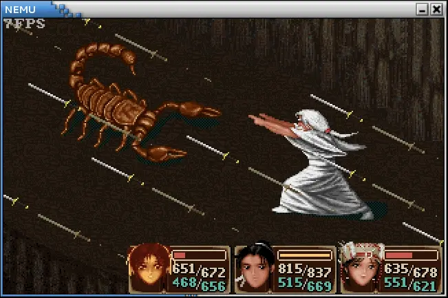
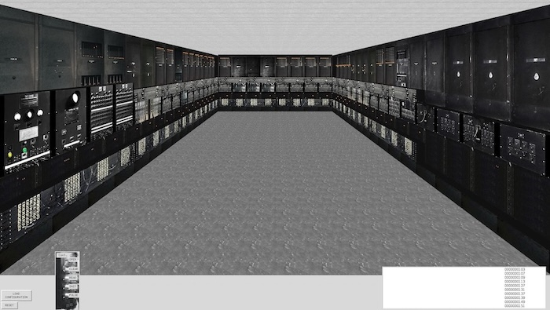
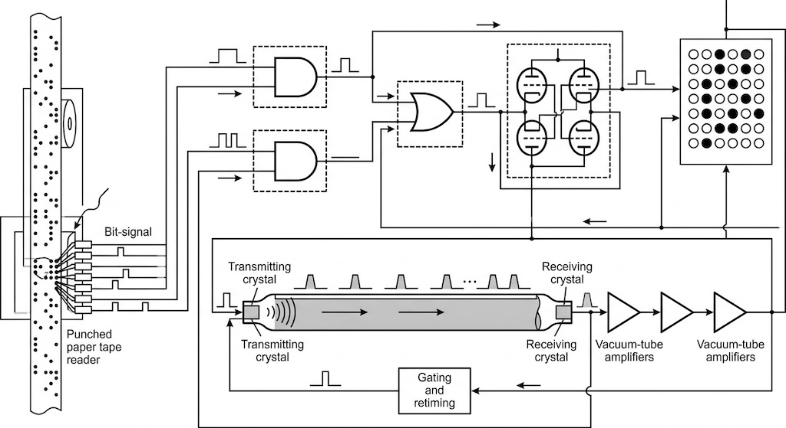
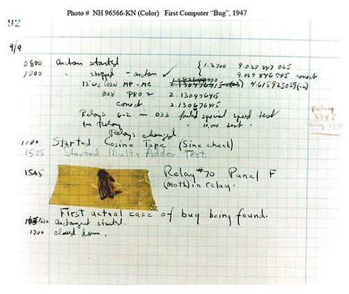
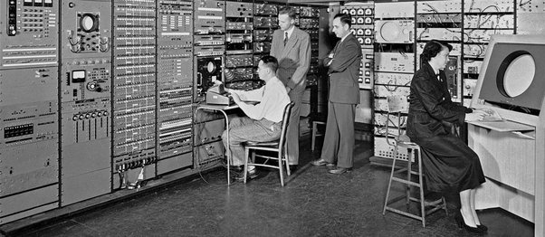
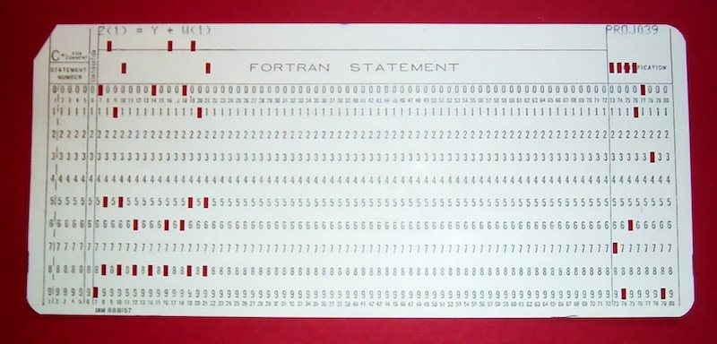
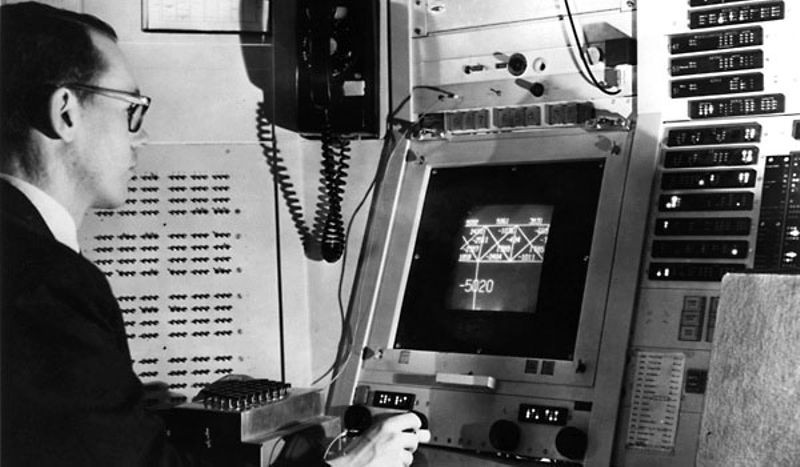
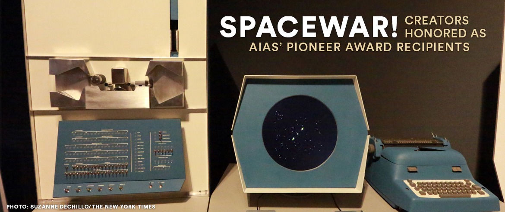
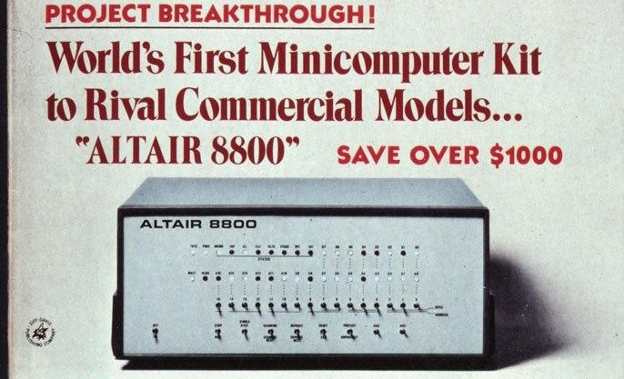
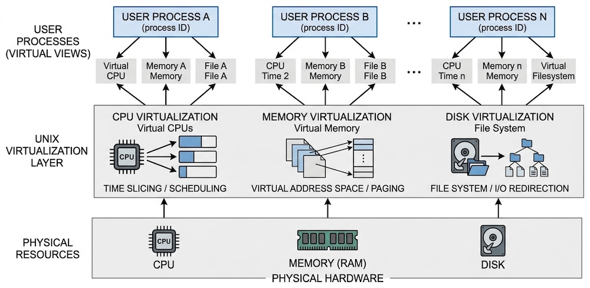

# 操作系统概述

## 1\. 个人/课程简介

# 个人简介

## [🎓 副教授](https://zhuanlan.zhihu.com/p/1986494838795941546) (新老体制交替的飞升疾走受害者)

  - 教**操作系统**、做 **PL** 的**软工**人 😂
      - 身体里还有 1/4 Theory 的血 (ICPC World Finalist)
          - 给小学生出了 10 年题 😈
      - 5 个 CCF-A 类 Paper Awards
          - 对于现在的 AI 时代来说，已经都入土了

## 计算机学院教学委员会成员

  - 南京大学 “我最喜爱的老师”
  - 操刀了新版教学计划
      - 已经减下了学时，剩下的只能艰难推进了
      - 本学期课程主线按照 3 学分建设，剩下的课时讲 OS 相关的课外内容

# 课程简介

## 课程目标

  - 真正理解 “操作系统给我们带来了什么”
      - 每节课都带着 “实现一点什么” 的目标，探索操作系统 API 和背后的设计理念
      - 还有含金量不断增加的 UNIX Philosophy
      - AI 时代，99.9% 的人不再需要知道底层细节
          - 违背祖宗的决定：砍掉了所有内核内容

## 课程信息

  - [课程主页](https://jyywiki.cn/OS/2026/)可以找到所有信息
  - 传统：不强制要求到课 (但不保证录制不会翻车)
      - 后续重要信息将群发邮件通知
  - 助教：刘瀚之 (hanzhiliu@smail.nju.edu.cn)
  - Office Hour: 每周四下午 16:30-17:30

# 课程简介：成绩组成

## 期末考试 50%

  - 以课堂内容为主

## 随堂期中测验 10%

  - 放轻松，跟上课堂示例代码即可

## 实验 40%

  - MiniLab Only
  - 都是有趣的编程实验
      - (注意 AIGC Policy)
      - AI 时代，Hackathon 这种形式的 lab 也许更好

# 课程简介：蹭课

## 仅限校内同学

  - 从[此链接](https://table.nju.edu.cn/dtable/forms/89294bff-427b-46af-b2aa-bcbcbc314f24/)报名蹭课
      - 开学两周后截止
      - 之后会通过 @smail.nju.edu.cn 发送 TOKEN
      - (正式选修的同学无需报名)

## 关于 Online Judge

  - 希望完全开源
      - 在 2027 年后结束这门课 (早日退休)
      - 秋季学期开一门面向所有人的 “Vibe Coding”

# 意见与反馈

### 邮件：jyy@nju.edu.cn

  - 保证邮件 100% 回复 (太久不回可以戳我)
  - 线上反馈：会看，但不会回复
      - (没有时间)
  - 但感谢一切 critical 的建议
      - 批评总是有原因的
      - 我会试图考虑背后的逻辑/改动的必要

### QQ 群

  - 选课名单确定后，群发邮件
  - 未必能看到/及时回复

## 2\. (Why) 为什么学习操作系统

# AC (Anno ChatGPT) 05 年

## 模型能力

  - 非常强的幻觉抑制和指令遵循
      - IMO/IOI 金牌；AK ICPC World Finals
  - Agent “勉强能用” → “非常能用”
  - Context 128K → 1M

## 推理速度

  - LLaMA3 8B: [15,000 token/s](https://chatjimmy.ai/) (这个速度意味着什么？)
      - 实时交互、脑机接口、Beam search……**全行业的血洗**
      - 27B Dense/35B MoE 的能力已经非常出众了

## 现象级应用

  - Claude Code (我一直用 cc 管理个人数据库)
  - Clawdbot (我也实现过微信 AgentBot)
      - 结果跟微信系统号聊了一上午废话 😂

# 从算法时代到 AI 时代：反思

## 算法时代

  - 计算机能解决 mathematically **well-formed** 问题
      - 数据持久化、约束求解、优化、加密……
      - 由**软件工程师**将现实世界的问题建模求解，并提供给人访问的接口 (App, GUI, …)
          - “软件是物理世界过程在信息世界中的投影”

## AI 时代

  - 计算机能解决 mathematically **ill-formed** 问题了
      - 甚至可以从中提取出 well-formed 的部分，调用工具求解 (Agent)
      - 具备**动态生成**一切 (文本、声音、图像、界面……) 的能力

# 学 CS 还有意义吗？

## “软件已死，氛围当立”

  - 残酷的事实：PhD Student 还不如 AI 好用
      - AI 技术已经使顶级的 “人类劳动力” 逐渐失去价值
      - (也许共产主义真的就要实现了？)

## 但是！复杂系统的实现仍然需要**抽象**

  - 抽象是分解和隔离复杂性的途径
      - 《操作系统》传递的 takeaway message 是**抽象层的设计与实现**
          - Claude Code 就是一个 CLI “用户”
          - Skills 就是编程语言中的抽象和复用机制
      - 操作系统 (和上面的应用生态) 赋予 AI 手和脚
          - 提供了显示界面、发送网络、隔离虚拟环境……的底层能力
          - 安全、可靠、高效、有保障

# 舞台已经到搭好，去书写你的传奇

## 《操作系统》是你的最后一门编程课

  - 能够知道程序**能做什么**、**为什么能做**
      - 为什么能创建窗口？
      - [为什么 Ctrl-C 有时不能退出程序](https://stackoverflow.blog/2017/05/23/stack-overflow-helping-one-million-developers-exit-vim/)？
          - StackOverflow helped 1,000,000 developers exit Vim (2017.5)
          - [StackOverflow is dying](https://www.digit.in/features/general/stack-overflow-is-dying-blame-it-on-chatgpt-and-ai-coding-tools.html) (2026.1)
      - Code Agent 里面是什么？
      - 怎么把服务器的 CPU 和 GPU 都用满？
  - 每天都在用的东西，能实现出来了
      - 浏览器、编译器、IDE、游戏/外挂、杀毒软件、病毒……

## AI 时代赋予了每个人追寻童年梦想的能力

  - Code is cheap, show me the talk——当然，你需要首先能**掌控**代码

## 3\. (What) 什么是操作系统

# 操作系统：定义

> Operating System: A body of software, in fact, that is responsible for *making it easy to run programs* (even allowing you to seemingly run many at the same time), allowing programs to share memory, enabling programs to interact with devices, and other fun stuff like that. (OSTEP)

## 诸多疑点

  - “Programs” 就完了？
      - 我看到的一切都是 program 啊？
      - 窗口管理器 (Sway)、终端、浏览器、虚拟机、Claude Code……
  - “Shared memory, interact with devices, …”？

# 操作系统：不需要定义

## 操作系统是来帮我们的，不是来折磨我们的

  - 我们不需要 “精准” 的教科书定义
      - **操作系统是帮我们更好地开发程序的**
      - 很多事办起来很复杂，所以需要操作系统 (所以知道 “能做什么” 很有必要)

## 理解操作系统：理解它发展的历史

  - 操作系统如何从一开始变成现在这样的？
  - 三个重要的线索
      - **硬件** (计算机)、**软件** (程序，**本课程视角**)、**操作系统** (管理硬件和软件的软件)

### 3.1. 硬件、软件和操作系统

# 复习：理解计算机硬件 (电路)

## Quiz: 《数字逻辑电路》课学了个什么？

  - 一个极简的公理系统 (导线、时钟、逻辑门、触发器)
  - 能支撑非常复杂的数字系统设计 (例如，高性能计算机)

# [数字电路模拟器](/OS/demos/intro/logisim)

时钟、导线、NAND、寄存器是数字系统的基本组成部分：数字系统在时钟驱动下离散地更新下一周期的寄存器状态。

这一小段程序模拟数字电路的执行过程，它也是 [nvboard](https://github.com/NJU-ProjectN/nvboard) 的基本原理。这个例子还展示了 UNIX Philosophy 中命令行工具的协作原理——C 程序 logisim 输出类似 `A=0; B=1; ...` 的数码管状态，而另一个程序负责解析这些输出并真实地 “画” 出来。

# ASCII Art

ASCII Art 起源于缺乏图形显示能力的打字机与早期计算机时代，人们利用基础的文本字符 (如字母、数字和符号) 来拼凑和构建图像。在 BBS 和早期互联网时期，它迎来了蓬勃发展的黄金期，成为极客文化、论坛签名和纯文本游戏中不可或缺的视觉载体。尽管今天图形技术已极其发达，ASCII Art 仍作为一种独特的复古美学活跃于现代数字世界，被广泛应用于程序员的代码注释彩蛋、终端命令行界面设计、部分独立游戏的美术风格以及网络梗中。

# [RISC-V 处理器模拟器](/OS/demos/intro/mini-rv32ima)

C 语言实现的 single-header RISC-V32IMA 系统模拟器 (项目源自[mini-rv32ima](https://github.com/cnlohr/mini-rv32ima))。因为有 M-Mode，这个模拟器可以运行几乎 “任意复杂” 的程序——甚至是没有 MMU 的 Linux。我们稍稍修改了这份代码，更好地体现《操作系统》课程的教学目标。

#### 3.1.1. Aside: 有没有觉得怪怪的？

# 为什么要用这个方式上课？

## 今年所有的课程内容，都在一份代码里

    with Vibe():
        slideshow()
        ...

## “System design” 的有趣之处

  - 前后端分离 (TUI/WebUI)
  - 可控的 AIGC 和代码演示 (logisim)
  - 自动生成 lecture notes

# Content as Code

## 没什么东西是不能用代码表示的

  - 图形/动画: SVG, Python (matplotlib), …
      - [Remotion: Make videos programmatically](https://www.remotion.dev/)
  - 幻灯片: Markdown, HTML, CSS, …
  - ……

## 程序化的好处：人类、AI、机器都友好

  - 在现代计算机系统上可以高效执行
      - 现成的工具还可以分析日志/trace
  - AI 可以理解、修改、定制、**创造更多的工具**！

## 生成定制、交互式的数字人也没有任何根本性的障碍

  - 大学教师危在旦夕

# 会编程，你就拥有全世界！

## Logisim 是本次课程的第一个彩蛋

  - 同样的方式可以模拟任何数字系统 (包括计算机系统)
  - 同时还体验了 UNIX 哲学
      - Make each program do one thing well
      - Expect the output of every program to become the input to another
      - Use text interface

## 命令行是一个非常有趣的设计

  - 在自然语言和编程语言之间达到了平衡
      - 因此大语言模型 (agent) 用起来得心应手！

# 复习：理解计算机软件 (程序)

## Quiz:《计算机系统基础》课学了个什么？

  - 高级语言代码 → 指令序列 → 二进制文件 → 处理器执行
  - Everything is a state machine

# [汉诺塔](/OS/demos/intro/hanoi-nr)

汉诺塔是递归和分治的经典问题，而同学们也曾经在理解这个程序的时候遇到困难。遇到困难是正常的：C/C++ 中的 “函数” 和数学的函数很不一样，例如我们可以把 Fibonacci 数列的递归写成

    int x = f(n - 1);
    int y = f(n - 2);
    // 也可以 return y + x;
    return x + y;

或是任意调换函数调用的次序，但汉诺塔不行。

不行的根本原因在于汉诺塔中的 printf 会带来全局的副作用。但 C/C++ 遵循 “顺序执行” 的原则，函数的执行有 “先后” (不像数学的函数，先后是无关的)，按照不同顺序调用会导致程序输出不同的结果。实际上，C 标准中 `return f(n - 1) + f(n - 2);` 甚至不保证从左到右的调用顺序。(但现代编译器为了防止产生难以理解的执行，通常按照自然顺序调用、不做激进优化。)

# 到底什么是操作系统？

## 本课程讨论**狭义的操作系统**

  - **硬件和软件的中间层**
      - 对单机 (多处理器) 作出抽象
      - 支撑应用程序生态的平稳运行
  - 这个概念可以推广到 “Systems”
      - 对多台计算机抽象 (分布式系统)、对存储设备的抽象 (存储系统)、……

## 理解操作系统

  - 理解硬件 (计算机) 和软件 (程序) 的发展历史
  - **夹在中间的就是操作系统**

### 3.2. 1940s 的操作系统

# 一个新时代的诞生：ENIAC (1946.2.14)

## “图灵机” 的数字电路实现尝试

  - 数字电路，遵循状态机模型
      - 有 PC 的概念
          - 但 next PC 是用物理线路 “hard-wire” 的
          - 重编程需要重新接线：[Programming the ENIAC](https://ieeexplore.ieee.org/stamp/stamp.jsp?tp=&arnumber=8467000)
      - 在一个周期里，所有寄存器都可以更新

# 1940s 的计算机硬件

## 电子计算机的实现

  - 逻辑门：[真空电子管](https://www.bilibili.com/video/av59005720)
  - 存储器：水银延迟线 (delay lines)
  - 输入/输出：打孔纸带/指示灯

# 1940s 的计算机软件

## 打印平方数、素数表、计算弹道……

  - 解释了《程序设计》教课书上经典习题的来源
      - 如果大家对 “为什么要做这些” 有疑问，说明教科书没有把历史讲好
      - (以及，教科书完全可以增加更现代的例子)
  - 大家还在和真正的 “bugs” 战斗

# 1940s 的操作系统

## **没有操作系统**

  - 甚至连编程语言都没有
      - 大家还在画流程图、写机制代码、戳纸带

## 能把程序跑起来就很了不起了

  - 程序直接用指令操作硬件
  - 不需要画蛇添足的程序来管理它
      - 颇像今天 Agents, MCP, Skills 所处的时代

### 3.3. 1950s 的操作系统

# 1950s-1960s 的计算机硬件

## 硬件改进了，逻辑门-存储-I/O 的基本格局没有变

  - 晶体管、磁芯内存、丰富的 I/O 设备
  - I/O 设备的速度严重低于处理器的速度，中断机制出现 (1953)

# 1950s-1960s 的计算机软件

## 更复杂的通用的数值计算

  - 高级语言和 API 诞生 (Fortran, 1957)：一行代码，一张卡片
      - 80 行的规范沿用至今

# 1950s-1960s 的计算机软件 (cont’d)

## Fortran 已经足够好用

  - 迎来了自然科学、工程机械、军事……对计算机的需求暴涨

    C---- LARGE LANGUAGE MODEL CAN EXPLAIN EVERYTHING.
      100 READ(5,10) I1, I2, I3
       10 FORMAT(3I5)
          IF (I1.EQ.0 .AND. I2.EQ.0 .AND. I3.EQ.0) GOTO 200
          ISUM = I1 + I2 + I3
          WRITE(6,20) I1, I2, I3, ISUM
       20 FORMAT(7HSUM OF , I5, 2H, , I5, 5H AND , I5,
         *   4H IS , I6)
          GOTO 100
      200 STOP
          END

  - Content as Code 的好处：可以让 Coding Agent 直接解释这个代码！

# 1950s-1960s 的操作系统

## **库函数 + 管理程序排队运行的调度代码**

  - 写程序 (戳纸带)、跑程序都是非常费事的
  - 计算机非常贵
      - $50,000-$1,000,000$
      - 通常一个学校只有一台

## 算力成为服务，操作系统概念形成

  - **多用户轮流共享计算机**，operator 负责操作程序切换
  - Operating systems (操作系统/作業系統)
      - (今天算力又成为服务了)

# 1950s-1960s 的操作系统

## CTSS (Compatible Time-Sharing System)

  - 操作系统中出现了各类对象：设备、文件、任务……
  - CTSS Subroutines “抽象层”
      - 现在这些功能是编程语言的一部分 (和标准库)

    RDFLXA: Read an input line from console
    WRFLX: Write an output line to console
    DEAD: Put the user into dead status, with no program in memory
    DORMNT: Put the user into dormant status, with program in memory
    GETMEM: Get the size of the memory allocation
    SETMEM: Set the size of the memory allocation
    TSSFIL: Get access to the CTSS system files on the disk
    USRFIL: Change back to user's own directory
    GETBRK: Get the instruction location counter at quit

### 3.4. 1960s 的操作系统

# 1960s-1970s 的计算机硬件

## 集成电路、总线出现

  - 更快的处理器
  - 更快、更大的内存；虚拟存储出现
      - **可以同时载入多个程序而不用 “换卡” 了**
  - 更丰富的 I/O 设备；完善的中断/异常机制

# 1960s-1970s 的计算机软件

## 更多的高级语言和编译器出现

  - COBOL (1960), APL (1962), BASIC (1965), PASCAL (1970), C (1972)
  - 计算机科学家们在今天难以想象的计算力下开发惊奇的程序
      - 许多那个时候沿用至今的程序都会在本课程中覆盖

# 个人电脑登上历史舞台

## Altair 8800 (1975)

  - Bill Gates 和 Paul Allen 的传奇故事
  - 竟然和我们的《计算机系统基础》不谋而合
      - [Fire in the Valley](https://www.amazon.com/Fire-Valley-Birth-Personal-Computer/dp/1937785769)
      - 今天是更热烈的 “PC 时代”

# 1960s-1970s 的操作系统：资源虚拟化

## 几乎就是 “今天的计算机” 了

  - 内存和磁盘的空分复用是非常 “自然” 的 (MMU → 进程)
  - 借助中断的 CPU 时分复用

### 3.5. 1970s+ 的操作系统

# 1970s+ 的操作系统和应用生态

## **UNIX 奠定了 pre-AI 时代计算机世界的基础**

  - 1973: 信号 API、管道 (对象)、grep (应用程序)
  - 1983: BSD socket (对象)
  - 1984: procfs (对象)……
  - UNIX 衍生出的大家族
      - 1BSD (1977), GNU (1983), MacOS (1984), AIX (1986), Minix (1987), Windows (1985), Linux 0.01 (1991), Windows NT (1993), Debian (1996), Windows XP (2002), Ubuntu (2004), iOS (2007), Android (2008), Windows 10 (2015), ……

## 然后就是大家熟悉的故事了

  - PC 普及、云计算、智能手机、AI 时代……

# 2030s+ 的操作系统：展望

## 操作系统不再是只给 “人” 用了

  - Model context 也会和 OS 交互
  - 底层的操作系统也许不会变，但会增加更多的抽象层
      - Model context 类似于 “一个人” (agent)
      - “人”：可以调用工具、创建分身、互相抬杠……

## 让我们共同期待

  - 无论如何，在这门课里把现代操作系统为应用程序提供的接口讲清楚
  - 从解锁 “理解一切软件” 的能力

## 4\. (How) 怎么学习操作系统

# 找到乐趣和动机

## 上课是为了理解人类文明的高光时刻

  - 基本**动机**、基本方法、里程碑、走过的弯路
  - 走向应用、创新、**革命**
      - 《操作系统》课的主题很明确：就是一套 API，支撑起一切了不起的软件

## 上课是实现童年梦想的途径

  - 每一节课都让你 “能力增长”
      - (并且马上就能用获得的新能力做点什么)

# 忘掉 Reward Hacking 的本能

## 大学教育是为了 long-term reward (实现梦想)

  - 即便分数很重要，也可以用更合理的学习方法
      - 我们不考犄角旮旯的细节 (不是没有细节，但如果你真正理解了 first principles，就可以根据自己的理解补充细节)

## 坚守 [Academic integrity](https://integrity.mit.edu/): “诚朴雄伟” 的精神

  - 世界上已经没什么 “学不懂” 的东西了
      - 相比于大家，我更苦恼 “没时间学”
  - 不再需要为了眼前的分数而损失了更长期的价值
      - (其实我是觉得 AI 时代，大学没什么用了)

# 拥抱新时代

## 大语言模型

  - Next-token prediction 的一个概率分布
      - 聊天、解题、写代码，样样在行
      - 过去一年：指令遵循和幻觉抑制大幅提升

## Agent

  - 具备了手和脚的大语言模型
      - 能对你的**整个项目**开刀，按需调取其中的部分，还能修改
      - 想象力限制了你 Agent 的能力 🦞

## Copilot

  - 把过去发生的事情告诉模型
      - 模型就知道你干得好不好、下一步想干什么
      - Agent 也能帮你干

# AIGC Policy

## 日常学习：鼓励使用 AI 辅助

  - 解释概念、命令行工具、API 等
  - 获取方法指导 (使用什么工具调试、如何调试、有何技巧)
  - 生成辅助性的代码 (调试、可视化……)
      - 这些都可以做成 Copilot 随时随地帮助你

## MiniLab：仅限单个 API 使用的生成

  - 禁止将自然语言需求翻译成代码
      - ✅: 帮助我调用 pipe()，并将读口和写口的文件描述符赋值给 read\_fd 和 write\_fd
      - ❌: 帮我完成实验，测试通过以后直接提交

# Takeaways

操作系统是软件和硬件之间的桥梁；因此我们 “找到” 一些合适的软件、一些相对简单的硬件，理解操作系统就会变得容易——我们的课程通过讲解操作系统上的应用，帮助你实现 “编程” 的梦想。

# 阅读材料

课程网站 (首页上的信息、课程概述、参考书与参考资料、生存指南)；教科书 Operating Systems: Three Easy Pieces:

  - Preface 前言
  - 第 1 章 - Dialogue on the Book
  - 第 2 章 - Introduction to Operating Systems
  - 延伸阅读 (如果有兴趣): Harley Hahn’s Guide to Unix and Linux。
