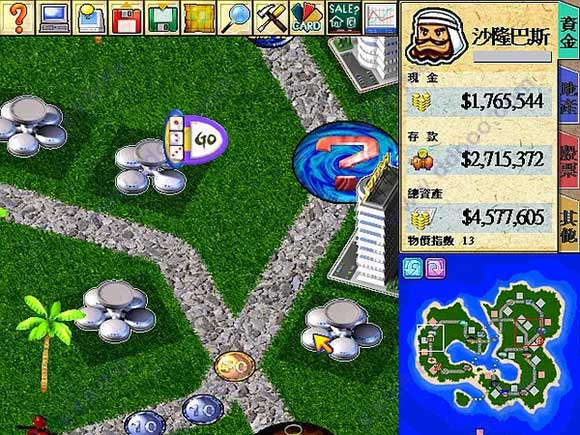

# 应用视角的操作系统

## 1\. 程序：解释与编译

# 操作系统上的程序

> Operating System: A body of software, in fact, that is responsible for *making it easy to run programs* (even allowing you to seemingly run many at the same time), allowing programs to share memory, enabling programs to interact with devices, and other fun stuff like that. (OSTEP)

## 《操作系统》课会彻底讲清楚**什么是程序**

  - 精确到每一个 bit 都是 well-defined
  - 顺便也充当 “形式语义” 的第一课

### 1.1. 单步解释执行 C 程序

# 理解计算机程序

## C → SimpleC

  - [C Intermediate Language](https://cil-project.github.io/cil/) transpiler
      - 任何 C 程序都可以改写成 “每行只做一小件事” 的形式
      - 于是我们可以像 NEMU 一样 “单步解释执行” C 语言代码
          - 例子：[PicoC](https://github.com/jpoirier/picoc): a very small C interpreter for scripting

    while (1) {
        stmt = fetch_statement();
        decode_and_execute(stmt);
    }

  - (我们让 LLM 改写了 printf，调试一下试试吧！)

# [C 解释执行器](/OS/demos/intro/cinterp)

虽然我们不大费周章去实现一个 SimpleC 的解释器 (烧一些 tokens 完全也可以做到)，但我们可以在 gdb 中模拟这个效果：我们可以主动把程序改写成 SimpleC 的形式，在 gdb 中单步，就收集到了程序运行的状态和迁移，从而反过来 “看” 解释器是如何执行的。

# 理解计算机程序：函数调用

## Tower of Hanoi: C++ 课的噩梦

  - 第一次领教了计算机里的 “函数” 不是数学里的 “函数”
      - 总有一种 “搞懂了，又没完全搞懂” 的感觉
      - 有多少同学自信能不借助 AI 写对一个非递归的版本？
  - 后悔没有选修 SICP 了 (里面讲了函数式编程呢)

# 理解函数调用：终极考题

    int f(int n) { return (n<=1) ? 1 : f(n-1) + g(n-2); }
    int g(int n) { return (n<=1) ? 1 : f(n+1) + g(n-1); }

| 模型                  | 汉诺塔 | f 和 g | 输出调用序列      |
| ------------------- | --- | ----- | ----------- |
| GPT-3.5 (22.12)     | ✅   | N/A   | N/A         |
| GPT-4 (23.3)        | ✅   | ❌     | N/A         |
| deepseek-v3 (24.12) | ✅   | ❌     | ❌           |
| deepseek-r1 (25.1)  | ✅   | ✅     | ❌ 错的 Python |
| o3-mini (25.1)      | ✅   | ✅ 逃课  | ✅           |
| deepseek-?? (26.2)  | ✅   | ✅     | ✅           |

# 理解函数调用：程序状态机

> 状态机是拥有**严格数学定义**的对象。这意味着你可以把定义写出来，并且用**数学严格**的方法理解它 —— 形式化方法

## 状态

  - \[StackFrame, StackFrame, …\] + 全局变量
  - 状态 ≠ “变量 + 栈 + PC”

## 初始状态

  - 仅有一个 StackFrame(main, argc, argv, **PC=0**)
  - 全局变量全部为初始值

## 状态迁移

  - 执行 frames\[-1\].PC 处的语句 (假设是 SimpleC)
  - f(x): stack\[-1\].next\_pc(); stack.push(x=x, PC=f)
      - 这一步是完全**机械**的操作
      - 许多体系结构都提供完成这个操作的 call 指令

# [汉诺塔](/OS/demos/intro/hanoi-nr)

汉诺塔是递归和分治的经典问题，而同学们也曾经在理解这个程序的时候遇到困难。遇到困难是正常的：C/C++ 中的 “函数” 和数学的函数很不一样，例如我们可以把 Fibonacci 数列的递归写成

    int x = f(n - 1);
    int y = f(n - 2);
    // 也可以 return y + x;
    return x + y;

或是任意调换函数调用的次序，但汉诺塔不行。

不行的根本原因在于汉诺塔中的 printf 会带来全局的副作用。但 C/C++ 遵循 “顺序执行” 的原则，函数的执行有 “先后” (不像数学的函数，先后是无关的)，按照不同顺序调用会导致程序输出不同的结果。实际上，C 标准中 `return f(n - 1) + f(n - 2);` 甚至不保证从左到右的调用顺序。(但现代编译器为了防止产生难以理解的执行，通常按照自然顺序调用、不做激进优化。)

### 1.2. 编译器

# 什么是 “编译后” 的程序？

## 程序最终还是在**计算机**上执行的

    struct CPUState {
        uint32_t regs[32], csrs[CSR_COUNT];
        uint8_t *mem;
        uint32_t mem_offset, mem_size;
    };

## 无情的、执行指令的**状态机**

  - 取指令、译码、执行……
  - SimpleC 到机器指令几乎可以 “原样翻译”

# [RISC-V 处理器模拟器](/OS/demos/intro/mini-rv32ima)

C 语言实现的 single-header RISC-V32IMA 系统模拟器 (项目源自[mini-rv32ima](https://github.com/cnlohr/mini-rv32ima))。因为有 M-Mode，这个模拟器可以运行几乎 “任意复杂” 的程序——甚至是没有 MMU 的 Linux。我们稍稍修改了这份代码，更好地体现《操作系统》课程的教学目标。

# 什么是编译器？

## 编译器输入一个 SimpleC 程序

  - 在不同的输入下，会有不同的输出 (和外部 API 调用序列)
  - 编译器需要保证：输出**等价**的程序 (SimpleC, 汇编代码……)
      - 等价：在相同输入下有相同的 API 调用序列

## 推论 (假设程序一定终止)

  - 如果从未调用过外部 API，那么所有代码都是死代码 (DCE)
  - 我们可以看一些编译器做优化的例子

# [什么是编译器](/OS/demos/intro/ccompile)

“编译器是一种将高级语言转换为低级语言的程序。” 这个定义不错；但到底什么是 “编译正确”？编译正确意味着对于任何输入，编译后程序的执行结果都和执行 C 语言形式语义的结果等价 (包括输出和终止)。这个定义其实给了编译器很多优化的空间——例如，所有最终 “用不上” 的计算都可以抹去。现在的编译器为了确保编译正确性，能做的优化相对有限，一个著名的论断是 “编译器不能把冒泡排序优化成快速排序”——虽然在今天也许不再是这样了。

## 2\. 操作系统上的最小程序

# 从一开始就获得机器的控制权

## 构造一个 “最小” 的程序

  - 从一开始就取得程序的控制权
  - 《计算机系统基础》说，程序是从 \_start 开始执行的

    void _start() {
        // ...
    }

## 编译运行 “最小” 的程序

  - 如何确认程序加载后的确从我的 \_start 开始执行？

# 退出程序

## 程序自己是不能 “停下来” 的

  - 指令集里没有一条关闭计算机的指令，那么操作系统是如何在关闭所有软件后，切断计算机的电源的？

## 只能借助**操作系统**

    movq $SYS_exit,  %rax   # exit(
    movq $1,         %rdi   #   status=1
    syscall                 # );

  - 把**系统调用**的参数放到寄存器中
  - 执行 syscall，操作系统接管程序
      - 操作系统可以任意改变程序状态 (甚至终止程序)

# [最小可执行文件](/OS/demos/intro/minimal)

为了理解操作系统上的程序，我们的目标是构造一个能直接被操作系统加载且打印 Hello World 的指令序列。如果你能想到这一点，剩下的一切都可以让 AI 帮助你。

# 系统调用指令：请求操作系统系统服务

## syscall (x86-64), ecall (risc-v), svc (aarch64)

  - 对应用程序而言，这是一条区别于所有其他指令的 “特别指令”
      - 只有它可以打破 “程序状态” (memory/register) 的边界
      - **将状态机 “完全交给” 操作系统**

## 直观地理解 syscall：类比 “全身麻醉”

  - 失去一切对自己的控制权
  - 把权限主动交给另一组权限更高的人
      - 对于计算机系统而言，就是一条向操作系统代码的跳转
          - 跳转目的地是操作系统 “写死” 的，程序无权更改
  - 服务完成后返回
      - 操作系统可以做 “任何事”
          - 可能醒来没事，可能肾没了，也可能再也醒不过来了

## (这是整个《操作系统》课最重要的一页 slide)

## 3\. 操作系统上的应用世界

### 3.1. 各式各样的应用程序

# 操作系统上的应用程序

## 天天说操作系统，但我们其实是**感知不到**操作系统存在的

  - 能感受到的是操作系统上**运行的程序** (进程)

# 能直接看到的程序：Applications

## 开发

  - 集成开发环境 Vscode, Cursor, …
  - 编程工具 gcc, clang, nodejs, gdb, …
  - 终端工具 tmux, vim, htop, …

## 日用

  - 办公 LibreOffice, GIMP, …
  - 浏览器 Chrome, Firefox, …
  - 媒体 OBS, VLC, …

# 能直接看到的 (幕后) 程序：Utilities

## Core Utilities (coreutils)

  - *Standard* programs for text and file manipulation
  - 系统中默认安装的是 [GNU Coreutils](https://www.gnu.org/software/coreutils/)
  - 也有简化版 [busybox](https://www.busybox.net/), [toybox](https://landley.net/toybox/)

## 系统/工具程序：无所不能

  - Shell, Claude Code (下一代 Shell), [binutils](https://www.gnu.org/software/binutils/), …
  - 包管理 (apt, dpkg, …)、网络管理 (ip, ssh, curl)、多媒体 (ffmpeg, gstreamer, …)

# 不能直接看到的：各种后台程序

## “守护进程” daemon

  - 万物归宗 systemd
      - systemd-network, systemd-logind, systemd-udevd, …
  - 系统管理 cron, udiskd, unattended-upgrade (讨厌), …
  - 各类服务 httpd, sshd, dbus, …
  - 安全组件 auditd, firewalld, …

## 图形与媒体

  - Wayland compositor, pulseaudio, pipewire, video4linux, …

### 3.2. 应用程序是什么

# 一切应用程序：它们都是 “一样” 的

## 和 minimal.S 有任何区别吗？

  - 简短的答案：**没有**
  - 任何程序 = minimal.S = 状态机

## 可执行文件是操作系统中的对象

  - 系统里的程序和 minimal 一样，都是 ELF 可执行文件
      - 可执行文件就是 “状态机初始状态的描述”
          - 执行信息 (类型、入口地址……)
          - 指令序列 (普通指令/系统调用)、数据……
      - 毫无疑问，打开文件是 “乱码”

# 我的第一次二进制逆向 (\~2000)

## ¥5 一张盗版游戏光盘的时代……

  - 人畜无害的《大富翁 4》，却藏了一个神秘的文件夹
      - 大家知道 “[Elf](https://zhuanlan.zhihu.com/p/21347746)”？(不是 a.out 的 Elf)
      - 可是难度实在太高了 😭
      - GAME.SAV 里有一串神秘的 0x00 0x00 0x01 0x00 0x00 代表了解锁 CG 的 “进度”

# 感叹：世界变了

## **Curiosity is all you need**

  - 如果那时候有人告诉我……
      - 同样的方式也可以去 hack Windows binary
      - Binary 太复杂？我们总有办法**用工具**把 “不在意” 的部分屏蔽掉

## 在 AI 的辅助下，你与 “顶尖人类” 的差距几乎为零

  - 一切代码工具都能自由组合、无限复用
  - 只要你能给出正确的 prompt
      - 让 Claude Code hack 一下 minimal 吧！

### 3.3. 用正确的工具 “打开” 应用程序

# 使用正确的工具

## 操作系统课会帮助大家建立正确的 “工具体系” 思维

  - 打开程序的执行：Trace (追踪)

> In general, trace refers to the process of following *anything* from the beginning to the end. For example, the traceroute command follows each of the network hops as your computer connects to another computer.

## **System call trace (strace)**

  - 理解程序是如何与操作系统交互的
      - (观测状态机执行里的 syscalls)
      - Demo: 试一试最小的 Hello World

# 操作系统中的 “任何程序”

## **任何程序 = minimal.S = 状态机**

  - 总是从被操作系统加载开始
      - 通过另一个进程执行 execve 设置为初始状态
  - 经历状态机执行 (计算 + syscalls)
      - 进程管理：fork, execve, exit, …
      - 文件/设备管理：open, close, read, write, …
      - 存储管理：mmap, brk, …
  - 最终调用 \_exit (exit\_group) 退出

## 感到吃惊？

  - 浏览器、游戏、杀毒软件、病毒呢？都是这些 API 吗？

# 自己动手做实验：观察程序的执行

## 工具程序代表：编译器 (gcc)

  - strace -f gcc a.c (gcc 会启动其他进程)
      - UNIX Philosophy 再次亮相
          - 可以管道给编辑器 vim - (vscode 也可以)
          - 编辑器里还可以 %\!grep
      - 过去：《操作系统》课的 “魔法”
      - 今天：AI 学会了

## 图形界面程序代表：编辑器 (xedit)

  - strace xedit
      - 图形界面程序和 X-Window 服务器按照 X11 协议通信
      - 虚拟机中的 xedit 将 X11 命令通过 ssh (X11 forwarding) 转发到 Host

# 想象 “一切应用程序” 的实现

## 应用程序 = 计算 + 操作系统 API

  - 窗口管理器
      - 能直接管理屏幕设备 (read/write/mmap)
          - 能画一个点，理论上就能画任何东西
      - 能够和其他进程通信 (send, recv)
  - 任务管理器
      - 能访问操作系统提供的进程对象 (readdir)
  - 杀毒软件
      - 文件静态扫描 (read)、主动防御 (ptrace)

## 操作系统的职责：提供令应用程序**舒适**的抽象 (对象 + API)

  - (我们用一学期来讲这个内容)

# Takeaways

程序 = 状态机 (变量 + 栈)，通过指令/语句不断迁移状态。操作系统提供了一组抽象和 API：进程管理 (fork, execve, exit)、文件/设备管理：(open, close, read, write)、存储管理：(mmap, brk)……通过 strace 观察程序的行为，我们确认了 “真实” 的应用程序确实只是计算 + 系统调用实现的。

# 阅读材料

本次课没有书本阅读材料；但你可以花一些时间和 AI 对话，了解一下 GNU Coreutils, Binutils，建立 “手边有哪些可用的命令行工具” 的一些印象，并且让 AI 带着你玩一玩这些应用。你还可以浏览 gdb 文档的目录，找到你感兴趣的章节了解，例如——“Reverse Execution”、“TUI: GDB Text User Interface”……对于你有兴趣的命令行工具，可以参考 busybox 和 toybox 项目中与之对应的简化实现。Toybox 现在已经成为了 Android 自带的命令行工具集。
