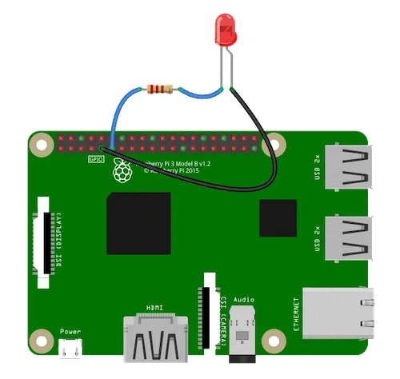
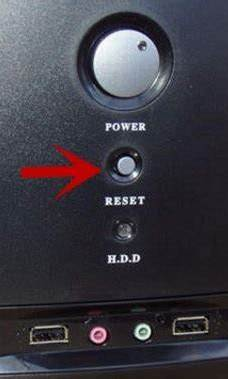
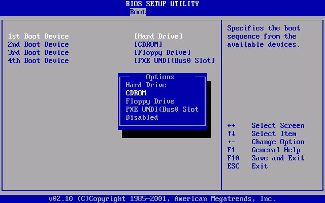
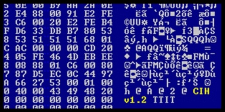
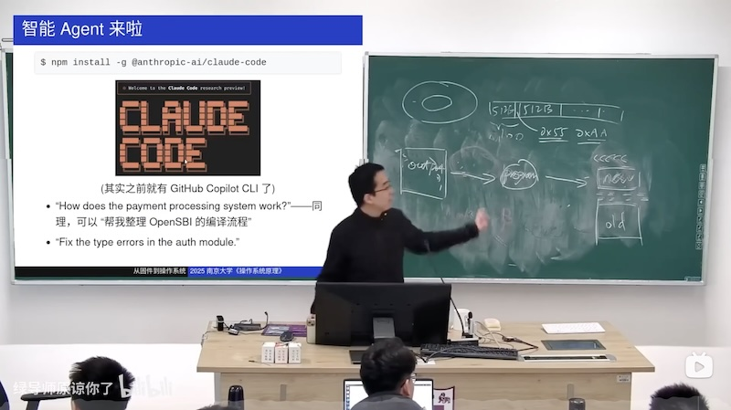

# 硬件视角的操作系统

## 1\. Aside: 上课之前

# 学习方法：你做对了吗？

## 大家都明白**应该下载运行示例代码**

  - 但[好麻烦啊](https://jyywiki.cn/OS/demos/intro/mini-rv32ima/)，看一眼就不想下了 😭
  - Don’t panic\! 现在已经是 “intelligence is cheap” 的时代了

## 一个改变世界的 prompt

  - 我在做 X。如果你是一个专家，你会怎么做？
      - 被动：学习 Coding Agent 所做的 “正确的事”
      - 主动：让 Copilot 不停地追问，并实时给出建议
      - 都可以帮助你建立正确的概念
  - 不用担心，我也是新手
      - 我也虚心请教 AI: code 绑定到 workspace \#2、解决了 click url 的问题、加大了鼠标指针、默认进入 /tmp/vibe/……

# 复习：软件、硬件和操作系统

## 软件：C (SimpleC), Python, …

  - 初始状态：stack=\[main(argc, argv), globals\]
  - 迁移：执行一条语句

## 硬件：x86, RISC-V, ARM…

  - 初始状态：CPU Reset
  - 迁移：执行一条指令/响应中断

## 操作系统：使软件能运行在硬件上的程序

  - 系统调用 API (syscall/ecall/svc 指令)，将控制权交给操作系统

## 2\. 什么是计算机硬件

# 硬件视角的操作系统

## 一句话：硬件**根本不知道有没有操作系统**

  - 我就是个无情执行指令的状态机
      - 见什么指令执行什么指令

## 这就是计算机系统中的**抽象**

  - 隔离复杂性的根本手段
      - [三省六部制](https://github.com/cft0808/edict)
  - 下层不需要知道上面怎么用，只管 “无情地提供服务”
      - 系统调用、指令集、sub-agent……
  - **抽象层的设计将是 Agentic AI 时代的重要能力**
      - 对于低年级的同学，先去广泛地了解各种设计

# 计算机系统的状态机模型

> 无情执行指令的机器。

## 状态

  - 内存、寄存器的数值

## 初始状态

  - 由系统设计者规定 (CPU Reset)

## 状态迁移

  - 从 PC 取指令执行

## 准确，但忽略了一些重要的细节

  - 一个 “jmp .” 机器不就永远卡死了吗？
      - 一点点细节使**操作系统可以被实现出来**

# 计算机系统：状态

## 内部状态：寄存器、内存

    struct CPUState {
        uint32_t regs[32], csrs[CSR_COUNT];
        uint8_t *mem;
        uint32_t mem_offset, mem_size;
    };

## 外部状态：整个世界

  - 计算机系统**无法完全控制**的客观存在
      - 设备上的寄存器 (memory-mapped I/O 可以访问)
          - 计算机对外界产生影响的主要方式
      - Interrupt/Reset Line

# 例子: GPIO

    gpio_set_value(GPIO_23, 1); // in Linux kernel

  - 大家只要有 “GPIO” 的概念，剩下的都可以用聊天解决
      - 扫描系统中的 GPIO，询问可以做什么

# 计算机系统：初始状态

## CPU Reset 是**明确的行为**

  - 为什么老旧电脑要配一个 Reset 按钮？
      - 历史总是惊人的相似
      - 今天的 OpenClaw 颇有当年 PC 时代的感觉

# 实际的 CPU Reset

## x86, ARM, RISC-V

  - 它们的 CPU Reset 是什么？
  - 体现了怎样的设计理念？
      - 你只需要有正确的**概念**，剩下的可以交给 AI

## 对比：我的预训练过程

  - 去 The Friendly Manual 里大海捞针：我学习 Systems Programming 时的圣经
      - CPU Reset ([Intel® 64 and IA-32 Architectures Software Developer’s Manual](https://software.intel.com/en-us/articles/intel-sdm), Volume 3A/3B)
      - Volume 3A: \~400 页
  - (但是这的确帮我建立了正确的概念)

# [探索 CPU Reset](/OS/demos/intro/cpu-reset)

我们都知道完整的计算机系统是从 CPU Reset 开始的。这里提供了三个架构的 “最小代码” 演示，展示 CPU Reset 后立即执行 “结束” 代码的短小程序，并打印出执行的指令序列和寄存器变化。运行程序，我们可以明确地看到 CPU Reset 后的寄存器状态，以及执行指令的结果：计算机世界没有任何魔法。

# 计算机系统：状态迁移

## 执行指令

  - 如果有多个处理器？
      - 可以想象成 “每次选一个处理器执行一条指令”
      - 在并发部分会回到这个问题

## 响应中断

  - if (intr) goto vec;

## 输入输出

  - 与 “计算机系统外” 交换数据
      - 读取电信号 (input) 或把电信号传递给设备 (output)

# 小结：硬件视角的操作系统

## 一句话：硬件**根本不知道有没有操作系统**

  - 我就是个无情之行指令的状态机
      - 见什么指令执行什么指令
      - 为了操作系统能实现出来，提供了许多机制 (中断、I/O、……)

## **操作系统就是一个普通的 (二进制) 程序**

  - 接管了中断、I/O、……
      - 应用程序不能直接访问
  - 把应用程序 “放” 到 CPU 上运行一会
      - 中断 (系统调用) 后，操作系统又开始执行
      - (操作系统启动后，操作系统就变成了一个中断处理程序)

## 3\. 固件：硬件和操作系统之间的桥梁

# 刚才遗漏的一个细节

## CPU = 无情执行指令的机器

  - 从 CPU Reset 开始执行
      - 从 Mem\[PC\] 取指令
      - 译码、执行，如此往复
  - 这里必须得是**合法的代码**
      - 那到底执行了什么代码呢？
      - 代码是谁放在这里的呢？

## 答案：系统厂商的代码

  - 把一个特殊的存储器 memory-map 到 CPU Reset 后的代码
      - 这段代码 “出生” 就有机器完整的控制权

# Firmware

## “固件”

  - 厂商 “固定” 在计算机系统里的代码
      - 早期：固件是 ROM
      - 想升级？换芯片！(今天可以直接升级固件了)

## Firmware 的功能

  - 完成硬件扫描、初始化和配置
      - (这些配置要生效可能需要重启计算机)
  - 不严格地说，**加载操作系统**
      - QEMU：可以绕过 Firmware 直接加载操作系统 ([Manual](https://www.qemu.org/docs/master/system/invocation.html#hxtool-8))

# Firmware 功能：配置计算机系统

## 按一个特殊的组合键进入菜单

  - Del, F2, F1, ESC, F10, F12, … (品牌差异很大)
  - 你会得到一个直接 “看到” 系统硬件的机会
      - 甚至可以配置 CPU 功能开关、风扇转速、接口功能、供电电压、内存时许……

# Firmware：就是一段代码

## 一个小 “操作系统”

  - CPU Reset 后初始化硬件；对接操作系统 Boot Loader

## Legacy BIOS (Basic I/O System)

  - IBM PC 所有设备/BIOS 中断是有 specification 的
      - 16-bit DOS 时代 BIOS 常驻内存，提供 I/O 等功能
  - 成就了百花齐放的 “兼容机” 时代
      - [AMI](https://www.ami.com/bios-uefi-utilities/) 和 [Phoenix BIOS](https://www.phoenix.com/device-firmware/), 等都活到了今天！

## [UEFI (Unified Extensible Firmware Interface)](https://www.zhihu.com/question/21672895)

  - 提供更丰富的支持 (例如设备驱动程序)：指纹锁、山寨网卡上的 PXE 网络启动、USB 蓝牙转接器连接的蓝牙键盘……

### 3.1. 小插曲

# 梦回 1998

## Firmware 通常是只读的 (当然……)

  - (它可是接管了 CPU Reset，store 指令不会有任何效果)

## 但是 Firmware 也需要更新

  - Intel 430TX (Pentium) 芯片组允许**写入 (更新) PROM**
      - 在那个时代，大家还没意识到问题……
      - 有些主板有写保护的跳线 (但默认可写)
  - 为防止 Bug 损坏 Firmware
      - 只要向 BIOS 写入特定序列，写保护即打开
      - 但这个序列就在手册里 👽……

# 有一个和你们差不多大的青年

> “……CIH (Chernobyl) 病毒完全是他一人设计的，目的是想出一家在广告上吹嘘 “百分之百防毒软件” 的洋相……”

## 历史上影响最大的病毒之一：它可以**破坏硬件**！

  - 坏了就只能拆主板，换 EEPROM 啦！(让我们看看代码吧)
  - 当年作者被捕，未被定罪 (时年 23 岁)

# [CIH 病毒](/OS/demos/intro/cih)

CIH (也称为 Chernobyl 病毒) 是台湾大同大学学生陈盈豪于 1998 年创建的，能够影响早期的 Windows 9x (95、98、Me) 操作系统。在 AI 的帮助下，我们把病毒代码翻译成了 “好读” 的 C 语言，可以清晰地看到病毒感染、潜伏和破坏的过程。

# 如何预防病毒破坏固件？

## 只允许写入**信任**的固件更新

  - 数字签名机制
      - 公钥加密 (Diffie-Hellman/RSA)
      - 感谢今天的 SSL/TLS (HTTPS)！
  - [Intel Boot Guard 私钥泄露](https://www.binarly.io/blog/leaked-intel-boot-guard-keys-what-happened-how-does-it-affect-the-software-supply-chain)

## 现在的电脑病毒

  - 炫技搞破坏的意义越来越小
      - 更安全的操作系统、AppStore 机制 (软件包经过审查)、云端备份
          - 我不小心 rm -rf 了 iCloud，也找回来了 😂
  - 获取权限的意义越来越大
      - 偷取隐私、LLM Token、移动支付……

## 4\. 从固件到操作系统

# 回到 43 年前

## IBM PC/PC-DOS 2.0 (1983)

  - Firmware (BIOS) 会加载磁盘的前 512 字节到 0x7c00
      - (如果这 512 字节最后是 0x55, 0xAA)
      - 为什么是 0b01010101 和 0b10101010？

## 让我们试一试

    (printf "\xeb\xfe"; cat /dev/zero | head -c 508; printf "\x55\xaa") > a.img

  - 还记得 eb 是什么吗？

# 如果 Firmware 也是代码？

## 计算机系统从 CPU Reset 开始

  - CPU Reset 的时候，0x7c00 应该是啥也没有的
  - Firmware 的代码扫描了磁盘、加载了它

## 那我们是不是可以看到 “加载” 的过程？

  - **计算机系统公理：你想到的就一定有人做到**
  - 再次使用 [QEMU, A fast and portable dynamic translator](https://www.usenix.org/legacy/publications/library/proceedings/usenix05/tech/freenix/full_papers/bellard/bellard.pdf)
      - 如果你想知道是哪条指令加载了 0x7c00 位置的 eb fe，你需要？

# Firmware 和系统程序员的第一个接口

## 我们可以写 446 字节的 16-bit 代码

  - 446 = 512 - 2 (55 aa) - 64 (分区表)

## Grub 的例子

  - Stage 1: 扫描磁盘，找到附近的 ELF 文件头，加载到内存
      - 根据文件系统，可能会需要 Stage 1.5
  - Stage 2: 这个 ELF 文件是 Grub; 弹出熟悉的选择系统窗口
  - Stage 3: 加载 Linux Kernel
      - 忽然觉得没什么难的了！

# [调试 SeaBIOS 固件](/OS/demos/intro/debug-firmware)

课程和互联网上的文档都声称是 Firmware 代码将具有 55 aa Magic Number 磁盘的前 512 字节载入内存。经过一些尝试 (例如修改 Magic Number)，我们确认了这一行为；更进一步地，我们能否调试固件的代码，看看到底是什么指令实现了磁盘到内存的搬运？这就用到了《计算机系统基础》实验中的 Watch Point。在这里，我们还用到了 init.gdb，它可以帮我们省去每次运行时的重复输入命令，也可以设置 hook (钩子)，每当程序暂停时显示一些我们关心的信息——我们**定制和扩展**了 gdb，使它在调试专属于我们的任务时更加强大。

# RISC-V: 固件与操作系统引导

## OpenSBI

  - 开源的 “Supervisor Binary Interface” (就是 firmware)

## 一年以前：我们还在 “古法阅读”，Agent 还各种不听指令

  - 万万没想到：今天只要提问就行了
      - OpenSBI 的入口位于什么地方？如何组织……？
      - 在大型系统上，self-attention 和 “编程直觉” 强得可怕

# [OpenSBI](/OS/demos/intro/opensbi)

一个开源的 RISC-V 引导固件，用于管理 RISC-V 平台的启动过程。它实现了 SBI（Supervisor Binary Interface）规范，为操作系统提供了硬件抽象层，简化了系统启动和硬件管理。OpenSBI 支持多种 RISC-V 处理器和平台，广泛用于嵌入式系统和开发板。<https://github.com/riscv-software-src/opensbi>

# Takeaways

硬件是一个无情执行指令的状态机，从 CPU Reset 开始执行固件 (Firmware) 中的代码。固件负责初始化硬件并加载操作系统。操作系统本质上就是一个普通的二进制程序，它接管了中断、I/O 等资源，并把应用程序 “放” 到 CPU 上运行。从硬件的角度看，硬件根本不知道有没有操作系统的存在。

# 阅读材料

大家可以在 AI 的帮助下，了解你感兴趣的体系结构的执行模型，例如 CPU Reset 行为、中断处理、特权级等；了解 BIOS/UEFI 的工作原理；尝试编译 OpenSBI 并理解固件的编译链接过程。
