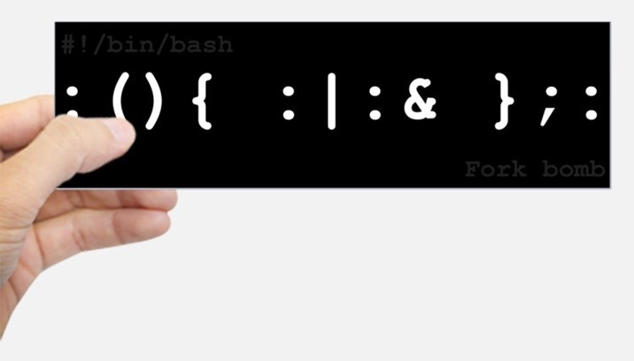

# 程序和进程

## 1\. Review & Comments

# Clarifications

## 上节课到底用了什么模型？

  - 日志告诉我了：doubao-seed-2.0-code
      - 上次课是第一次使用 (各家就属他最快了)
      - 后续使用体验：智力极低，各种不听指令
          - 细思恐极啊 🤔

# 内容回顾

## 应用视角的操作系统

  - 操作系统 = 对象 + API

## 硬件视角的操作系统

  - 操作系统 = 程序

## 它们都有非常明确的 “数学模型”

  - 应用程序从 main(argc, argv) 开始执行语句
  - 机器从 CPU Reset 开始执行固件指令

# 《操作系统》正片开始

## 虚拟化

  - One of the most fundamental abstractions that the OS provides to users: the **process**
  - 把物理计算机 “抽象” 成 “虚拟计算机”
      - 程序好像独占计算机运行

## 进入 “每一讲都实现一点什么” 的模式

  - 每次课都感到编程 “能力边界” 的扩展

## 2\. 程序和进程

# 虚拟化：一个疯狂的想法

## 还记得 Tower of Hanoi 的非递归版本？

  - 我们可以在程序里模拟任何 “另一个程序” 执行
      - 选一个程序，执行一条语句
      - 我们不就实现了 “操作系统” 吗？

## CrazyOS

    while (1) {
        p = pickup_one();
        p->single_step();
    }

  - 没错，**这就是操作系统的主循环**
      - 只不过实际的操作系统是 “p-\>run\_sometime\_on\_cpu()”
      - Code is cheap; show me the talk\! 我们不是有 riscv32ima 吗？

# [Crazy OS](/OS/demos/virtualization/crazy-os)

我们希望 “模拟” 一个操作系统：crazy-os.c 能加载 argv 指定的 binary (p1, p2, …)，基于 mini-rv32ima.h 模拟单步执行 (RISC-V 指令)，并能够处理 syscall。

# 程序 v.s. 进程

    #include <unistd.h>

    int main() {
        while (1) {
            write(1, "Hello, World!\n", 13);
        }
    }

## 程序是语义 (状态机) 的**静态描述**

  - 描述了**初始状态**和**迁移规则**
  - 程序运行起来，就成了**进程** (进行中的状态机实例)
      - (同一个程序可以同时运行多份)

# 操作系统上的进程

## 进程：程序的**运行时状态**随时间的演进

  - 除了程序状态，操作系统还会保存一些应用不直接可见的额外状态
      - CrazyOS 里的 buf

## 问出正确的问题，就有最好的答案

  - 真实的操作系统，进程到底有哪些状态？
      - 试着去**探索**：试图获取进程的各种信息

    // Author: Claude Opus 4.6
    // 不知道说什么好 (绿导师该退休了)

# [展示进程信息](/OS/demos/virtualization/proc-info)

操作系统为每个进程都维护了二进制文件之外 “操作系统” 意义上的状态。实现一个 C 语言工具 (假设 Linux 系统)，不调用外部工具，尽可能地获取并展示出进程自身不直接可见的操作系统状态。

# \[OS API\] 查询进程状态

## procfs

  - /proc/\[pid\]/
      - 通过 readdir, open, read 访问进程信息
      - 一座宝库 (claude code 启动)

## 各式各样的 syscalls

  - getpid(), getppid(), getpgrp(), getsid(), getuid(), geteuid(), getgid(), getegid(), ……
      - 涉及到各个 subsystem; 会在用到的时候介绍

## 3\. 进程管理

### 3.1. 创建进程

# 进程管理系统调用

## 操作系统 = 状态机的管理者

  - 进程管理 = 状态机管理

## 一个直观的想法

  - 创建状态机：spawn(path, argv)
  - 销毁状态机: \_exit()
      - 这是一个合理的设计 (例子：Windows)

## UNIX 的答案

  - 复制状态机: fork()
  - 复位状态机: execve()

# \[OS API\] 创建状态机

    pid_t fork(void);

## 现在我们已经有 “一个状态机” 了

  - 只需要 “创建状态机” 的 API 即可
  - UNIX 的答案: *fork*
      - 做一份状态机完整的复制 (内存、寄存器现场)

# fork() 的行为

## 立即复制状态机

  - 包括**所有状态**的完整拷贝
      - 寄存器 & 每一个字节的内存
      - Caveat: 进程在操作系统里也有状态: ppid, 文件, 信号, …
          - **小心这些状态的复制行为**
      - 复制失败返回 -1
          - errno 会返回错误原因 (man fork)

## 如何区分两个状态机？

  - 新创建进程返回 0
  - 执行 fork 的进程返回子进程的进程号——“父子关系”

# 进程树

## 进程的创建关系形成了进程树

  - A → B → C，如果 B 终止了……C 的 ppid 是什么？
      - 看似简单：我们 “往上提” 一层就行
      - 实际复杂：
          - 子进程结束会通知父进程
              - 通过 SIGCHLD 信号
              - 父进程可以捕获这个信号
          - “往上提” 就发错人了

## 如何验证这个行为？

  - 让 AI 帮我们写程序！

# [创建一棵进程子树](/OS/demos/virtualization/pstree)

创建一棵 5 层的进程树，并随机退出其中的一些进程——我们可以观察进程退出前后父子进程的关系。

#### 3.1.1. fork() 的用处

# Fork Bomb

## 刚才的示例程序

  - 1 变 2, 2 变 4, 指数级增长
  - “核裂变” 使快资源迅速消耗殆尽
      - 曾经会使系统彻底卡死，但现在 Linux 有 OOM 保护

# fork() 的全量内存快照：应用

## 共享信息预处理

  - 计算 prime\_table，然后 fork 进程分段处理
      - 更酷的例子：Android Zygote Process，完成 “冷启动”

## 并行搜索

  - Depth-first search 中，为每个分支创建一个进程

## 沙箱隔离

  - 定期做一个 checkpoint，如果程序 crash 了就从 checkpoint 恢复

# [fork-based DFS](/OS/demos/virtualization/fork-dfs)

如果我们使用深度优先搜索，总是需要维护当前的 “搜索状态”。通常这是通过将状态作为参数传递实现的 (当然，也可以用维护全局状态的方式实现)。借助 fork()，我们可以在每个搜索分支创建一个当前状态的快照，实现并行搜索。

#### 3.1.2. 软件系统的复杂性

# 理解 fork: 习题

## 阅读程序，写出运行结果

    for (int i = 0; i < 2; i++) {
        fork();
        printf("Hello\n");
    }

## 计算机系统里没有魔法

  - ./a.out
  - ./a.out | cat
      - (无情执行指令的) 机器永远是对的，以及，我们甚至可以在 CrazyOS 里实现它！

# [理解 fork()](/OS/demos/virtualization/fork-demo)

fork() 会完整复制状态机；新创建的状态机返回值为 0，执行 fork() 的进程会返回子进程的进程号。同时，操作系统中的进程是并行执行的。程序的精确行为并不显然——model checker 可以帮助我们理解它。在这个例子中，我们还发现执行 `./a.out` 打印的行数和 `./a.out | wc -l` 得到的行数不同。根据 “机器永远是对的” 的原则，我们可以通过提出假设 (libc 缓冲区影响) 求证、对比 strace 系统调用序列等方式，最终理解背后的原因。标准输入输出的缓冲控制可以通过 setbuf(3) 和 stdbuf(1) 实现。

### 3.2. 重置进程

# \[OS API\] 复位状态机

    int execve(const char *filename,
               char * const argv[], char * const envp[]);

## UNIX 选择只给一个复位状态机的 API

  - 将当前进程**重置**成一个可执行文件描述状态机的初始状态
  - **操作系统维护的状态不变**：进程号、目录、打开的文件……
      - (程序员总犯错，因此打开文件有了 O\_CLOEXEC)

## execve 是**唯一能够 “执行程序” 的系统调用**

  - 因此也是一切进程 strace 的第一个系统调用

# execve() 设置了进程的初始状态

## argc & argv: 命令行参数

  - 困扰多年的疑问得到解答：main 的参数是 execve 给的！

## envp: 环境变量

  - 使用 env 命令查看
      - PATH, PWD, HOME, DISPLAY, PS1, …
  - export: 告诉 shell 在创建子进程时设置环境变量

## 程序被正确加载到内存

  - 代码、数据、PC 位于程序入口

# [理解 execve](/OS/demos/virtualization/execve-demo)

execve 有三个参数：path, argv, envp，分别是可执行文件的路径、传递给 main 函数的参数和环境变量。execve 是一个 “底层” 的系统调用，而 POISX 额外提供了 execl 等库函数便于我们使用。请搜索互联网或询问人工智能理解它们的区别。

# 例子：PATH 环境变量

## 可执行文件搜索路径

  - 还记得 gcc 的 strace 结果吗？

    [pid 28369] execve("/usr/local/sbin/as", ["as", "--64", ...
    [pid 28369] execve("/usr/local/bin/as", ["as", "--64", ...
    [pid 28369] execve("/usr/sbin/as", ["as", "--64", ...
    [pid 28369] execve("/usr/bin/as", ["as", "--64", ...

  - 这个搜索顺序恰好是 PATH 里指定的顺序

    $ PATH="" /usr/bin/gcc a.c
    gcc: error trying to exec 'as': execvp: No such file or directory
    $ PATH="/usr/bin/" gcc a.c

  - **计算机系统里没有魔法。机器永远是对的。**

### 3.3. 销毁进程

# \[OS API\] 销毁状态机

    void _exit(int status);

## 这个没有争议

  - 立即摧毁状态机，允许有一个返回值
      - 返回值可以被父进程获取

## 实际的退出要复杂一些

  - 有了线程以后，就有了两种退出方式 (exit, exit\_group)

# UNIX 进程的生存周期

## UNIX 中实现 “创建新状态机” 的方式

  - Spawn = fork + execve
  - 我们会在之后介绍这些系统调用的灵活应用

    int pid = fork();
    if (pid == -1) { // 错误
        perror("fork"); goto fail;
    } else if (pid == 0) { // 子进程
        execve(...);
        perror("execve"); exit(EXIT_FAILURE);
    } else { // 父进程
        ...
        int status;
        waitpid(pid, &status, 0); // testkit.c 中有
    }

# [理解 exit](/OS/demos/virtualization/exit-demo)

除了 libc 为我们提供的 `exit` 函数之外，Linux 提供了两个系统调用：`exit` 和 `exit_group`，它们可以在 syscalls(2) 的手册中看到。同时，你也可以在这份手册中看到 Linux 肩负的 “历史包袱”。strace 可以查看应用程序是如何 “退出” 的。

# Takeaways

操作系统通过进程抽象为应用程序提供了独立的执行环境。进程是操作系统中最基本的资源分配单位，它包含程序本身的状态和操作系统内部的状态。操作系统提供了一系列系统调用 (如 Linux 中的 fork、exec、wait 和 exit，Windows 中的 CreateProcess 和TerminateProcess) 来创建、管理和终止进程。

# 阅读材料

课程网站 (首页上的信息、课程概述、参考书与参考资料、生存指南)；教科书 Operating Systems: Three Easy Pieces:

  - 第 3 章 - Dialogue
  - 第 4 章 - Processes
  - 第 5 章 - Process API
