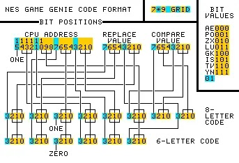
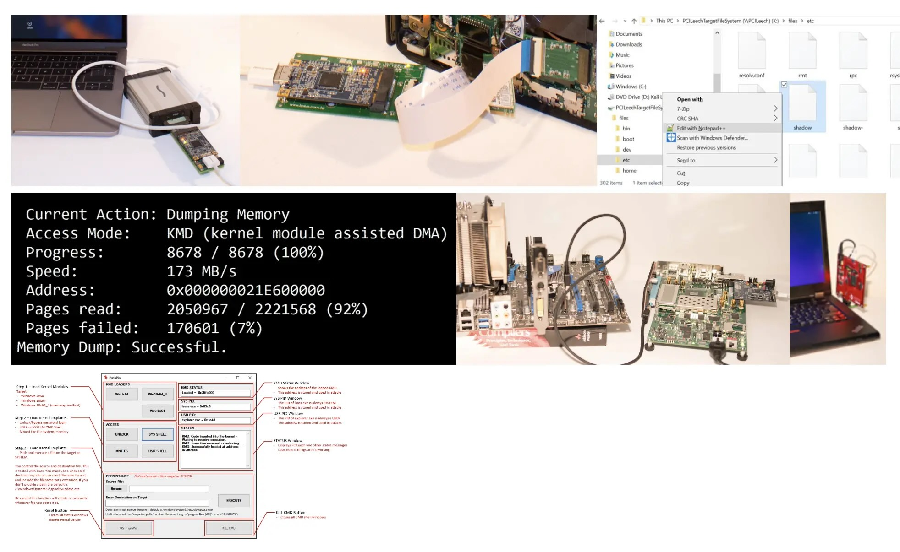

# 进程的地址空间

## 1\. Review & Comments

# 进程管理 API

## fork(), execve() 和 \_exit()

  - 程序状态的复制、重置和删除

    int pid = fork();
    if (pid == -1) { // 错误
        perror("fork"); goto fail;
    } else if (pid == 0) { // 子进程
        execve(...);
        perror("execve"); exit(EXIT_FAILURE);
    } else { // 父进程
        ...
        int status;
        waitpid(pid, &status, 0); // 会反复在示例代码中看到
    }

# 观察 CrazyOS

## 细节：进程是有 “内存” 的

    #define MEM_SIZE   (1 << 20)
    #define MEM_OFFSET 0x80000000u
    #define STACK_TOP  (MEM_OFFSET + MEM_SIZE)

    struct proc {
        struct CPUState cpu;  // points to mem[MEM_SIZE]
        uint8_t mem[MEM_SIZE];

        // OS-internal state (pid, buf, buf_len, ...)
    };

  - 代码 (指令序列)、数据、堆、栈……都在同一份 “内存” 里
      - 就有了今天的主题

# [Crazy OS](/OS/demos/virtualization/crazy-os)

我们希望 “模拟” 一个操作系统：crazy-os.c 能加载 argv 指定的 binary (p1, p2, …)，基于 mini-rv32ima.h 模拟单步执行 (RISC-V 指令)，并能够处理 syscall。

## 2\. 进程的地址空间

### 2.1. 地址空间和指针

# 进程的地址空间 (Address Space)

> AI: 操作系统为每个进程提供的一套**独立的、连续的虚拟内存地址范围**，因此也叫 “虚拟地址空间”。

## 核心作用

  - 隔离与保护：不同进程的地址空间相互独立
  - 便于管理与扩展：程序以为自己占有一大片连续内存 (实际按需分配)
  - 支持共享在隔离的前提下，允许有限的共享

## 非常教科书式的精确定义

  - 但其实我们可以从一个更直观的角度理解
      - 知识的正向 “构建” v.s. 逆向 “总结”

# 地址空间和指针

## 地址空间 = CrazyOS “struct proc 中的 mem”

  - 指针可以访问地址空间？

    volatile char *ptr = input();
    *ptr;  // load
    *ptr = 1;  // store

  - Quick Quiz: 为什么需要 volatile?
  - 代码 (指令序列)、数据、堆、栈……都在同一份**地址空间**里
      - 看看把指针指向不同的符号，能从中读出什么？

# [重新理解指针](/OS/demos/virtualization/pointers)

编写一个 C 程序，用指针指向不同的位置：代码、数据、栈，打印地址，并从中读出一些数据。并且验证指向 main 指针读取到的数据确实是 main 的二进制代码。

# 问出今天这节课的关键问题

## **计算机世界里没有魔法**

  - 每个字节都一定是有**规定**的
      - 到底进程内存的每个字节是怎么来的？谁规定的？
      - (你可以和 AI 聊历史)

## GPT-5.4: 下课

  - 字节 “是什么”：本身不带类型，由 CPU 的 ISA 决定
  - 字节 “放哪”：由链接与可执行文件格式决定
      - 编译/汇编会生成各类段 (.text, .rodata, …)，链接器决定布局
  - 字节 “初始是什么样”：由 OS 加载器 + ABI 约定决定
      - Load 程序段，清零 bss、建立初始 CPU 状态 (PC, SP)、准备运行时栈内容 (argc, argv, enpv, auxv)
  - 划定动态区域 (堆、栈……)

# 问出今天这节课的关键问题 (cont’d)

## 进程 execve 后的进程地址空间

  - ABI 中规定的 initial state ([System V ABI](http://jyywiki.cn/OS/manuals/sysv-abi.pdf))
      - Section 3.4: “Process Initialization”
      - 只规定了部分寄存器和栈 (argv 和 envp 中的字符串保存在栈中)
  - Binary 中指定的 PT\_LOAD 段
      - 内存是分成 “一段一段” 的
      - 每一段有访问权限 (rwx)

## 概念是概念，实现是实现

  - 计算机系统公里：**有意义的事情就一定能做到**
      - 比如，看看 minimal 和真实进程的地址空间里有什么

# [探索进程地址空间](/OS/demos/virtualization/addr-space)

我在课堂上学习了 Linux 进程的地址空间。请你帮我做一个命令行工具，从命令行接收一个 pid，解析它的地址空间，输出每个部分是什么，如果是可执行的区域，把第一个 KB 的内容反汇编 (要兼容 x86-64 和 arm64)。

### 2.2. 地址空间管理 API

# 如果我们从 minimal.S 开始？

## 地址空间里 “什么也没有”

  - malloc(size) 的内存从哪里来呢？

## MMU: 操作系统给进程**强制**戴上的 VR 眼镜

  - 应该有一个**系统调用**可以配置它
      - Quick Quiz: 你会怎么设计？
      - UNIX: brk/sbrk (.bss 后有一个 “break”)

# \[OS API\] Memory Map 系统调用

## 在 struct proc 上增加/删除/修改一段可访问的内存

  - MAP\_ANONYMOUS: 匿名 (申请) 内存
  - fd: 把文件 “搬到” 进程地址空间中
  - 更多的行为请让 AI 阅读 manpage

    // 映射
    void *mmap(void *addr, size_t length, int prot, int flags,
               int fd, off_t offset);
    int munmap(void *addr, size_t length);

    // 修改映射权限
    int mprotect(void *addr, size_t length, int prot);

  - 我有了一个更疯狂的想法：Vibe Code 一个全功能的 CrazyOS\!

# 使用 mmap

## Example 1: 申请大量内存空间

  - 瞬间完成内存分配
      - mmap/munmap 为 malloc/free 提供了机制
      - 不妨 strace/gdb 看一下

## Example 2: Everything is a file

  - 映射大文件、只访问其中的一小部分

    with open("/dev/sda", "rb") as fp:
        mm = mmap.mmap(fp.fileno(),
                       prot=mmap.PROT_READ, length=128 << 30)
        hexdump.hexdump(mm[:512])

# [mmap 系统调用](/OS/demos/virtualization/mmap)

Linux 系统使用 anonymous 的 mmap 来实现大段连续内存的分配——甚至在系统调用返回的瞬间，进程可以没有得到任何实际的内存，而是只要在首次访问时 (触发缺页异常) 分配即可。AddressSanitizer 就用 mmap 分配了 shadow memory，我们可以使用 strace 观察到这一点。

# 使用 mmap (cont’d)

## 所有和**内存**相关的功能，底层几乎都是 mmap

  - 内存分配
      - 进程内的内存分配器会问操作系统要大内存
          - sbrk/brk 被保留，但操作系统内用 mmap 实现
      - 再切小了分配给 malloc()
  - Memory-mapped I/O
      - /dev/gpiomem
  - 进程间共享内存
      - shm\_open() 可以返回一个文件，mmap 实现进程共享内存
  - Just-in-time 生成代码
      - mprotect 可以改变 mmaped region 的权限 (rwx)
  - ……

## 3\. 地址空间：有趣的应用

# Hacking Address Spaces

## 刚才我们已经不经意探索过进程的地址空间了

  - 一个进程可以**访问**其他进程的地址空间
      - 例子：gdb (分分钟可以 Vibe Code 一个 gdb 😂)

## 在 code is cheap 的今天……

  - 1970s: 个人电脑 (Bill Gates, Steve Jobs, …)
  - 2010s: 自媒体
  - 2020s: content-as-code 时代，一切皆可生成

# 案例：物理入侵进程地址空间

## 金手指：直接物理劫持内存

  - 听起来很离谱，但 “卡带机” 时代的确可以做到！
      - 插卡 = mmap(NULL, rom\_size, PROT\_READ | PROT\_EXEC, MAP\_PRIVATE, rom\_fd, 0);
      - 今天我们有 Debug Registers 和 [Intel Processor Trace](https://perf.wiki.kernel.org/index.php/Perf_tools_support_for_Intel%C2%AE_Processor_Trace) “合法入侵” 地址空间

# 物理入侵进程地址空间 (cont’)

## Game Genie: 一个 Look-up Table (LUT)

  - 简单、优雅：当 CPU 读地址 a 时读到 x，就替换为 y
      - [Technical Notes](https://tuxnes.sourceforge.net/gamegenie.html) ([专利](https://patents.google.com/patent/EP0402067A2/en), [How did it work?](https://www.howtogeek.com/706248/what-was-the-game-genie-cheat-device-and-how-did-it-work/))

# 物理入侵进程地址空间 (cont’)

## Game Genie as a Firmware

  - 配置好 LUT、加载卡带上的代码 (像是一个 “Boot Loader”)

# 能做一个对任何游戏都生效的金手指吗？

## 我们需要 “知道” 程序的**语义**

  - 例如：地址空间里到底什么是金钱/经验/…
  - 观察它们的**变化**！
      - 进入游戏时 EXP = 4,950，打一个怪 EXP = 5,100
      - 扫描内存，只有一个 int \*p 符合，改成 1,000,000，打一个小怪就满级

## Game Wizard 32, Cheat Engine, 金山游侠

# [金山游侠](/OS/demos/virtualization/knight)

通过操作系统赋予我们实现调试器的机制，我们可以窥探甚至修改任何进程的代码和数据。这个能力使我们可以绕过游戏为我们设置的 “人为障碍”，取得更多的金钱、经验，或是锁定生命值等。

# 扫描内存：对有些游戏是不生效的

    state_new = new State(state);
    state_new.update(exp);
    state = state_new;

## 我们需要更深入地知道程序的语义

  - 无非就是为 “[某个游戏](https://jyywiki.cn/OS/img/game-hack.mp4)” 定制的 gdb 脚本
      - (Tower of Hanoi 也是游戏外挂)
      - 例如 “变速齿轮” 会 patch 所有和时间相关的系统调用 (sleep, alarm) 实现 ”加速效果“

# [汉诺塔](/OS/demos/intro/hanoi-nr)

汉诺塔是递归和分治的经典问题，而同学们也曾经在理解这个程序的时候遇到困难。遇到困难是正常的：C/C++ 中的 “函数” 和数学的函数很不一样，例如我们可以把 Fibonacci 数列的递归写成

    int x = f(n - 1);
    int y = f(n - 2);
    // 也可以 return y + x;
    return x + y;

或是任意调换函数调用的次序，但汉诺塔不行。

不行的根本原因在于汉诺塔中的 printf 会带来全局的副作用。但 C/C++ 遵循 “顺序执行” 的原则，函数的执行有 “先后” (不像数学的函数，先后是无关的)，按照不同顺序调用会导致程序输出不同的结果。实际上，C 标准中 `return f(n - 1) + f(n - 2);` 甚至不保证从左到右的调用顺序。(但现代编译器为了防止产生难以理解的执行，通常按照自然顺序调用、不做激进优化。)

# 畅想的空间

## Intelligence is cheap\!

  - **Retro 任何老游戏**：逆向游戏状态 + 重渲染 + 更改游戏进程
  - **AI 游戏辅助**：采集游戏画面，并给出训练建议
  - 软、硬、物理融合的应用…… (未来课程的 Project)

# 例子：“外挂” 的终极手段

## 做一个虚假的内存控制器 😂

  - CXL double-write (memory mirror)——不仅可以是游戏外挂！

# Takeaways

操作系统通过虚拟内存为每个进程提供独立的地址空间，实现了进程间的隔离和保护。操作系统通过 mmap/munmap 实现地址空间的管理，并且还提供特定机制 (如 procfs、ptrace、process\_vm\_writev、共享内存等) 访问彼此的地址空间。

# 阅读材料

教科书 Operating Systems: Three Easy Pieces:

  - 第 12 章 - Dialogue
  - 第 13 章 - Address Spaces
  - 第 14 章 - Memory API
