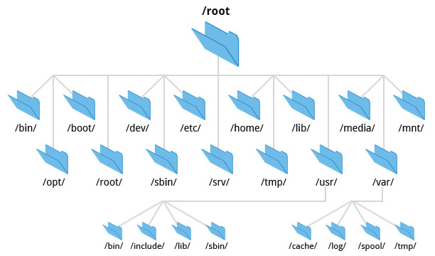
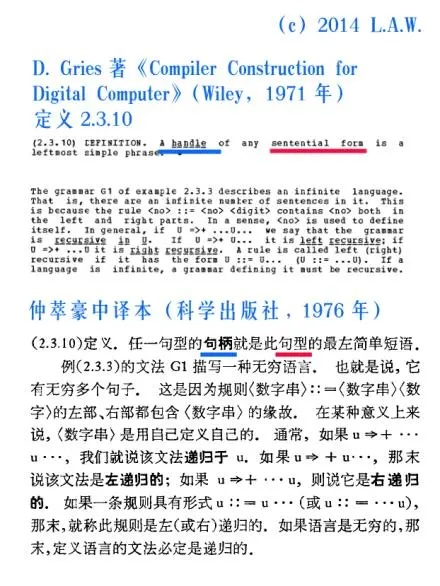

# 访问操作系统对象

## 1\. Review & Comments

# 关于实验的更新

## 周日 (3.22) 中午更新了 main 分支

  - Bug: 新版本的框架，旧版本的 testkit 😭
      - 新版本 SystemTest 的参数变了
      - 于是无论如何也通不过测试了

## 不太会，怎么办？

  - 让我从零开始假装小白演示一次
      - 让 AI 把 main 往后挪一个 commit
      - 再让 AI 同步回来
      - 干脆让 AI Agent 直接把实验全做完算了 😂
  - **拥抱世界的变化**：让 AI 放大你的 “自主性”

# 复习：程序和进程

## 进程：一个封闭的世界

  - 加载了一个程序
  - 除了寄存器和内存是程序 “自己” 的，其他都需要通过系统调用访问
      - 进程管理 API: spawn, fork, execve, exit
      - 内存管理 API: mmap, munmap, mprotect

## 操作系统里肯定还有其他对象的！

  - 也需要一些 API 来管理它们
  - (这是本次课的内容)

## 2\. 操作系统中的对象

# 操作系统对象和 API

## 程序员脑袋里想的

  - 请求操作系统帮他 “做一件事”
      - 读取网络请求、写入文件、和其他进程通信……
      - 本质上都是 “访问操作系统中的对象”

    Path("/proc/1234/maps").read_text()
    GetMemoryMap(pid)
    ReadProcessMemory(pid, addr, buf, size)

## 操作系统设计者脑袋里想的

  - 提供一套**简单、稳定**的通用 API (抽象层)
      - 能在此基础上 “二次开发” 出任何东西
      - Windows: 开发者要什么我就给什么 (CreateFileW, WriteFile, SetFilePointerEx, OpenProcess, VirtualQueryEx, K32EnumProcessModulesEx, OpenProcess, ReadProcessMemory, …)

# UNIX: Everything is a File

## 回头想：什么是文件？

  - 一个小学电脑课就学过的概念
      - 一个有名字的**数据**对象 (字节序列)
      - 可以对任意位置读取/写入

## 一个非常普适的抽象

  - **任何数据流/数组**，一个正在向你发送数据的服务器连接、连接到系统的打印机/终端/显卡、一把锁、一个管道……它们都可以假装自己是**文件**

## 最后，用 “目录” 来管理名字

  - 甚至操作系统内部可以直接用一个 dict\[Path,bytes\] 来实现

# Everything is a File (cont’d)

## 文件系统可以用于构建任何信息系统

  - 例子：课程网站
      - 提交会被保存到 /var/www/filerecv
      - 评测完毕后结果会生成一个 .result 文件
      - 刷新页面时会遍历目录树
  - (为什么不用数据库呢？)

## Build Everything with BlockFlow

  - 基于文件系统的实现不就是最好的**模型**吗？
  - 让 LLM 帮我翻译成数据库/serverless 的实现不就行了？
      - 还可以自动证明 idempotence 和语义等价 🤔

# Everything is a File (cont’d)

## 那么，到底有什么呢？

  - Filesystem Hierarchy Standard [FHS](http://refspecs.linuxfoundation.org/FHS_3.0/fhs/index.html): enables *software and user* to predict the location of installed files and directories

# UNIX Philosophy

## Keep It Simple, Stupid

  - (1) Do one thing and do it well. (2) Work together. (3) Handle text streams as a universal interface.

## 操作系统还会 “假装” 一些文件

  - /proc, /dev, …
      - 真实的设备 /dev/sda, /dev/tty
      - 虚假的设备 /dev/urandom, /dev/null (黑洞)
  - 操作系统只要把它们当成 “可读写的对象”，就可以用文件 API 访问了

## 实现小工具 + 数据的组合和复用

  - 自然语言和编程语言的**平衡点** (quick & dirty)，当然[广受诟病](https://web.mit.edu/%7Esimsong/www/ugh.pdf)
  - 在 Agentic AI 时代，即将成为历史

    grep -s VmRSS /proc/*[0-9]/status | awk '{sum += $2} END {print sum " kB"}'

## 3\. 访问操作系统中的对象

### 3.1. 文件描述符

# 文件描述符：访问操作系统对象的 “指针”

    struct FILE { // Inside CrazyOS
        char *data;
        size_t offset;
    }

  - 这不就是在 CrazyOS 里允许多个 buffer 吗
      - open: f = malloc(sizeof(struct FILE));
      - close: free(f);
      - read/write: \*(f-\>data++);
      - lseek: f-\> += offset;
      - dup: f\_new = f;

## 应用程序怎么访问操作系统里的 struct FILE 呢？

  - 让应用程序持有一个由操作系统解读的 “指针”
  - “The open() system call opens the file specified by pathname.”

# [Crazy OS](/OS/demos/virtualization/crazy-os)

我们希望 “模拟” 一个操作系统：crazy-os.c 能加载 argv 指定的 binary (p1, p2, …)，基于 mini-rv32ima.h 模拟单步执行 (RISC-V 指令)，并能够处理 syscall。

# 文件描述符

## 另一个 “地址空间”

  - 0 (stdin), 1 (stdout), 2 (stderr), …
  - open() 总是分配最小的未使用描述符
      - 新打开的文件从 3 开始分配
      - 文件关闭后，编号可以重复利用
  - (让 AI 调用命令行工具确定我的进程最多能同时打开多少文件，再编一个程序确认)

## Windows Handle (把手；握把；**把柄**)

  - 非常形象的名字，除了[你不会用](https://www.tesla.com/ownersmanual/model3/zh_cn/GUID-7A32EC01-A17E-42CC-A15B-2E0A39FD07AB.html) 😂

# [文件描述符](/OS/demos/virtualization/filedesc)

文件描述符是一个用于访问文件或其他输入/输出资源的 “指针”。在 Unix 和类 Unix 操作系统中，文件描述符是一个非负整数，用于表示一个打开的文件、管道、网络连接或其他类似的资源。当一个程序打开一个文件或创建一个数据流时，操作系统会返回一个文件描述符，程序可以通过这个描述符来读取、写入或操作对应的文件或资源。

# “句柄” 乌龙

# 操作系统的真正复杂性

## API 之间会产生**互相影响**

  - fork() 以后，offset 会发生什么？
      - 这就是 fork() 看似优雅，实际[复杂](https://dl.acm.org/doi/10.1145/3317550.3321435)的地方
      - 软件系统的每一处设计都要小心考虑和其他部分的交互

## Windows Handle API

  - 默认 handle 是**不继承**的 (和 UNIX 默认继承相反)
      - 可以在创建时设置 bInheritHandles，或者运行时修改
      - “最小权限原则”
  - lpStartupInfo 用于配置 stdin, stdout, stderr
      - Linux 引入了 O\_CLOEXEC

### 3.2. 特殊的文件

# 看看系统里到底有什么文件吧！

    ls -l /proc/*/fd/* 2>/dev/null \
        | awk '{print $(NF-2), $(NF-1), $NF}' \
        | claude explain it

## Intelligence is Cheap

  - 完全可以用自然语言描述**任何意图**
  - 人类更需要的是想象力
      - 我的观点：想象力本质上是可枚举的

# 匿名管道

## 创建一个**仅进程内部可见**的管道

    int pipe(int pipefd[2]);

  - 返回两个文件描述符
  - 进程同时拥有读口和写口
      - 看起来没用？不，fork 就有用了

## 想知道发生了什么？

  - 不需要读文档，直接调试示例代码
  - 甚至直接让 AI 帮我们 “翻译” 程序状态 (像 Tower of Hanoi 那样)

# [UNIX 管道](/OS/demos/virtualization/pipe)

UNIX 管道 (pipe) 是一种典型的进程间通信机制，允许数据在不同的进程之间单向流动。管道可以被视为一种特殊的文件，其中一个进程将数据写入管道的一端，而另一个进程从另一端读取数据。我们完全可以借助 AI 生成的辅助可视化工具来理解这一过程。

# 综合例子：TestKit

## C 语言的测试框架

  - 直接在代码里写单元测试和系统测试
      - 随时随地调用内部函数
      - 全部在子进程中运行 (允许直接 crash)
  - 还是 “很不错” 的想法和代码呢
      - 用来理解原理很不错
      - (但也许以后也不需要了)

## 正确打开方式

  - 让 LLM 帮我写测试用例
  - 用魔法打败魔法 (M1 的 testcases 都是 AIGC)
      - 我甚至看都没看一眼 🤔

# [TestKit 测试框架](/OS/demos/virtualization/testkit)

Writing test cases fearlessly\! 这是同学们的第一个测试框架：支持单元测试和系统测试，自动注册测试用例并在程序退出后运行。最重要的特点是它使用简单：你只需要包含 testkit.h，并且链接 testkit.c 即可。

# Takeaways

操作系统必需提供机制供应用程序访问操作系统对象。对于 UNIX 系统，文件描述符是操作系统中表示打开文件 (操作系统对象) 的指针；而 Windows 则更直接地提供了 handle 机制。

# 阅读材料

教科书 Operating Systems: Three Easy Pieces:

  - 第 39 章 - Files and Directories
