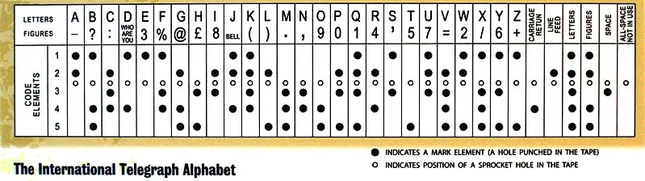
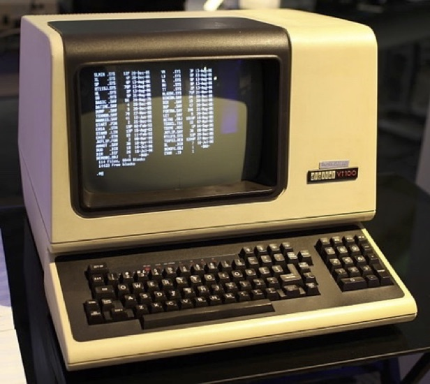
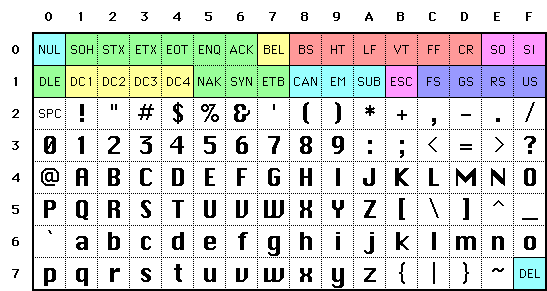
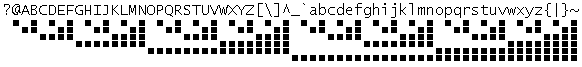
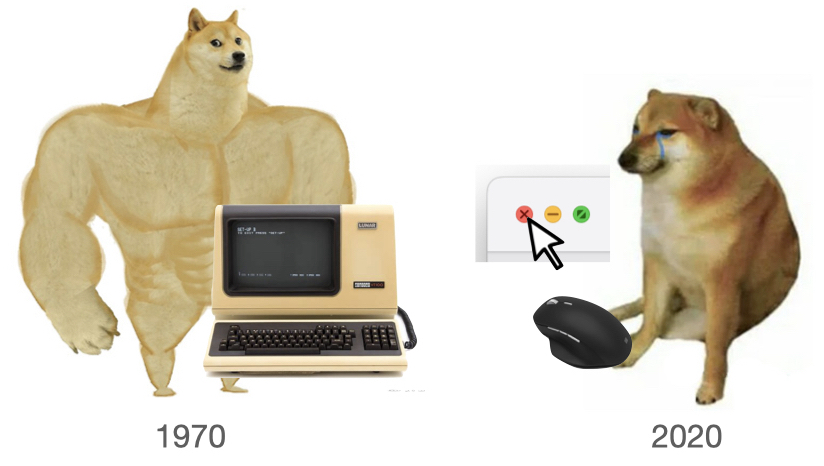
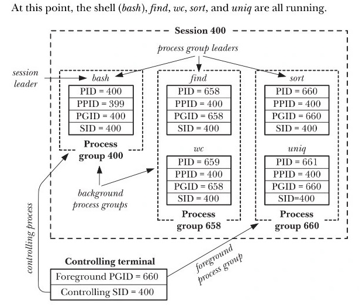

# 终端和 UNIX Shell

## 1\. 从键盘到终端

# “键盘” 的老祖宗

## “键盘” 的历史比大家想象的要长

  - 最早可以追溯到公元前 3 世纪 (Water Organ, Hydraulis)
      - 管风琴 (Pipe Organ)
      - 1500s：今天熟悉的 [“击奏弦鸣乐器” 前身](https://www.bilibili.com/video/BV1Zg411P7GQ/)诞生


# 打字机 (Typewriter)

## 类似的 “键盘”，但字模打击色带

  - 擒纵机构：按键储能，松开时带着字车走一个字符的距离
  - QWERTY 键盘 (1860s) 是为降低打字速度设计的
      - 功能逐渐增加，例如双色带 (2000 年的时候还玩过真货)


# 打字机时代的遗产

## Shift/Caps Lock

  - 使字锤或字模向上移动一段距离，切换字符集

## CR & LF

  - \\r CR (Carriage Return): 回车，将打印头移回行首
      - 试试 print(‘Hel\\rlo’)
  - \\n LF (Line Feed): 换行，将纸张向上移动一行
      - UNIX 的 \\n 同时包含 CR 和 LF

## Space & Backspace & Tab

  - Space/Backspace: 移动 ±1 个位置 (Backspace 再打一个 “-” 杠掉 😊)
  - Tab: 移动到下一个 “tabstop” 实现垂直对齐 (所以叫 “制表符”)

# 进入电气化时代

## 电传打字机 (Teletypewriter)

  - 为了发电报设计 (收发两端同时打印)
  - Telex (teleprinter exchange): 1920s，早于计算机
      - 使用 Baudot Code (5-bit code)
      - 很自然地也能用在计算机上



# 电传打字机 (Teletypewriter)

## 终于实现了 “键盘打字，远端打印”

  - Teletype Model 28 (1951); [technical data sheet](http://www.samhallas.co.uk/repository/telegraph/teletype_28_tech_data.pdf)


# Video Teletypwriter

## 里程碑：VT100 (DEC, 1978)

  - 从 “打字机” 继承而来的功能: **putchar**
  - 成为事实上的行业标准
      - 首个完整实现 ANSI Escape Sequence 的终端
      - 80 × 24 字符显示成为标准布局



# (Aside) 感谢 Unicode

## 光是 “显示字符” 就可以玩很多花活了

  - 例子：ANSI Escape Code 和 toybox
  - 有了 Unicode 之后
      - ▁▂▃▄▅▆▇█▇▆▅▄▃▂▁
      - 可以做出 fancy 的 [Powerline status bar](https://github.com/powerline/powerline)

```
 ▐▛███▜▌
▝▜█████▛▘
  ▘▘ ▝▝
```

# 终端：作为输入设备

## 输入字节流直接送入操作系统

  - 很像是 Typewriter
      - 按下 Shift 的时候没有任何数据被送入计算机
      - 只有 Shift + 字母才真正触发
  - 我们可以读到这些原始的字节流
      - (终端还支持很多配置，例如关闭回显 echo off)

## 一切都编码在 ASCII Table 里

  - 不在 ASCII Table 里的怎么办？
      - Escape Code\!



# [理解终端](/OS/demos/virtualization/tty)

我们可以让 AI 实现各类终端控制的程序——包括一个在终端里的终端模拟器，去理解操作系统提供了怎样的对象和 API 来帮助我们操作终端设备。

# 伪终端和终端模拟器

## Pseudo Terminal: 想要多少就有多少

  - 一对 “管道” 提供双向通信通道
      - 主设备 (PTY Master): 连接到终端模拟器
      - 从设备 (PTY Slave): 连接到 shell 或其他程序
  - (参考 minitty 的实现)
      - 例子：如何创建一个新的 Pseudo Terminal?
      - /dev/ptmx
          - 大家看到的 /dev/pts/0 就是这么来的

## 有趣的应用：ttyrec/ttyplay

  - 我们只需要记录下所有流出 pty 的字符和时间戳，就可以把 minitty 改造成 “录屏器”

# 伪终端和终端模拟器 (cont’d)

## 如果我们不满足于字符终端？

  - DEC 早就想到了 (VT200)
      - Sixel (six pixel)
          - 一个字符编码一个 6 x 1 的 Yes/No (颜色靠调色板控制)
          - 今天的终端大多支持 (Kitty, Windows Terminal, …)

## 去年的 flag: 应该内嵌 WebView

  - 2025.12: [Google’s A2UI](https://a2ui.org/)



## 2\. 终端与操作系统

# 终端：人机交互的第一个设备

## 用户登录的起点

  - 系统启动 (内核 → init → getty)
  - 远程登录 (sshd → fork → openpty)
      - stdin, stdout, stderr 都会指向分配的终端
  - getty/sshd 会创建一个 session
      - Session 会关联到控制终端 (controlling tty)

## 调用 login 程序

  - The login program is used to establish a new **session** with the system.
      - (但 session 其实不是 login 创建的，login 只是继承)

# 终端：进入人机交互的世界

## 你熟悉的终端

  - read(STDIN\_FILENO, buf, size)
      - 并没有立即返回按键的 ASCII 码
      - 我甚至可以做行编辑
  - 这**完全是操作系统的行为**
      - “模拟” 出了编辑器

## Text (Terminal) User Interface (TUI)

  - 试试 python3 -m textual
      - (感谢 Unicode)



### 2.1. Ctrl-C 到底发生了什么？

# 等一等！TUI 是 “多进程” 的

## 和 Windows 的窗口管理器没有本质区别

  - 问题来了：Ctrl-C 到底是如何关闭程序的？

## 终端：我就是个 typewriter，我不管

  - 它只管传输**字符**
      - Ctrl-C: End of Text (ETX), 03
      - Ctrl-D: End of Transmission (EOT), 04
      - stty -a: 你可以看到按键绑定 (奇怪的知识增加了)
  - 但**操作系统**收到了这个字符
      - 就可以对 “当前” 的进程采取行动

# 多进程的 TUI……

> 作为操作系统的设计者，需要在收到 Ctrl-C 的时候找到一个 “当前进程”

## 信号机制

  - signal: 注册一个信号处理程序
  - kill: 中断程序执行，强行跳转到信号处理程序
      - 于是我们就可以实现 Ctrl-C 不能退出的程序了 (Demo)
  - 今天：sigaction

## 更麻烦的问题：**信号发给谁**？

  - 完整的进程树，有的在前台，有的在后台，进程可以同时打开多个终端，到底给谁发信号？
  - fork() 会产生树状结构
      - (还有托孤行为)
  - Ctrl-C 应该终止所有前台的 “进程们”
      - 但不能误伤后台的 “进程们”

# [信号处理](/OS/demos/virtualization/signal)

我们可以通过 signal (sigaction) 注册信号处理程序——这也解释了为什么有些程序不能用 Ctrl-C 退出。即便是终止信号，我们也可以执行清理代码退出。

# UNIX 会话 (Session) 和进程组 (Process Group)



# 会话和进程组：机制

## 给进程引入一个额外编号 (Session ID，大分组)

  - 子进程会继承父进程的 Session ID
      - 一个 Session 关联一个控制终端 (controlling terminal)
      - Leader 退出时，全体进程收到 Hang Up (SIGHUP)

## 再引入另一个编号 (Process Group ID，小分组)

  - 只能有一个前台进程组
  - 操作系统收到 Ctrl-C，向前台进程组**所有进程**发送
      - (真累……但你也想不到更好的设计了)

# 会话和进程组：API

## 太不优雅了

  - setsid/getsid
      - setsid 会脱离 controlling terminal
  - setpgid/getpgid
  - tcsetpgrp/tcgetpgrp
      - 迷惑 API

## 以及……uid, effective uid (?), saved uid (???)

  - [Setuid Demystified](https://www.usenix.org/conference/11th-usenix-security-symposium/setuid-demystified)
      - 任何软件都很难逃脱千疮百孔的设计

### 2.2. Job Control

# 实现类似窗口管理器的 Job Control

## 窗口和多任务：终端可以有 “一个前台进程组”

  - “最小化” = Ctrl-Z (SIGTSTP)
      - SIGTSTP 默认行为暂停进程，收到 SIGCONT 后恢复
  - “切换” = fg/bg (tcsetpgrp)

## 为了实现 “窗口栏上的按钮”，还很是大费周章

  - 还不如 Sway/tmux 管理多个 pty 呢 (选择性 “绘制” 在终端上)
      - 那是因为发明 session/pg 的时候还没有 pty 呢……

# 是的，历史的糟粕

## 但是，这是 POSIX 的一部分……

  - 😂 几乎任何人都无法预知 “软件” 的未来

## 回头看这个问题

  - 我们不需要 “绑定进程到设备”
  - 管理程序 (tmux, gnome, …) 去模拟就行
      - Window Manager: 只需要 “进程组” 就行了
          - 关窗口，全部 ❌ 一个不留
      - Android: 每个 app 都是不同的用户
          - 强行终止 = 杀掉属于这个用户的所有进程
      - Snap: 程序在隔离的沙箱运行
          - AppArmor + seccomp + namespaces (真狠)

## 3\. UNIX Shell: 一门编程语言

# UNIX 哲学背后的编程语言

## Keep It Simple, Stupid

  - Do one thing and do it well; Work together; Handle text streams as a universal interface.

## 背后是 UNIX Shell **编程语言**支撑的

  - **基于文本替换的极简编程语言** (只有字符串类型)
      - 算术运算？对不起，我们不支持 😂 (但可以 expr 1 + 2)
  - “把**命令**被翻译成**系统调用**” (open, dup, pipe, fork, execve, waitpid, …)
      - 预处理: $(), \<()
      - 重定向: cmd \> file \< file 2\> /dev/null
      - 顺序结构: cmd1; cmd2, cmd1 && cmd2, cmd1 || cmd2
      - 管道: cmd1 | cmd2

# 例子：实现重定向

## 利用子进程继承文件描述符的特性

  - 在父进程打开好文件，到子进程里腾挪
      - 发现还是 Windows API 更 “优雅”

    int fd_in  = open(..., O_RDONLY | O_CLOEXEC);
    int fd_out = open(..., O_WRONLY | O_CLOEXEC);

    int pid = fork();
    if (pid == 0) {
        dup2(fd_in, 0);
        dup2(fd_out, 1);
        execve(...);
    } else {
        close(fd_in);
        close(fd_out);
        waitpid(pid, &status, 0);
    }

# 读一下手册吧

## man sh: dash — command interpreter (shell)

  - **dash** is the standard command interpreter for the system. The current version of dash is in the process of being changed to conform with the POSIX 1003.2 and 1003.2a specifications for the shell.
  - The shell is a command that reads lines from either a file or the terminal, interprets them, and generally executes other commands. It is the program that is running when a user logs into the system (although a user can select a different shell with the chsh(1) command).
      - 一个高效、简洁、精确的 “自然” 编程语言

## AI 时代：遍历手册的意义

  - **建立正确的概念**
  - AI 时代的 UNIX Philosophy
      - man -P cat ls | claude ‘Make a comprehensive summary’
      - Read the friendly manual\!

# UNIX Shell: 有优点就有缺点

## 无奈的取舍

  - Shell 的设计被 “1970s 的算力、算法和工程能力” 束缚了
      - 后人只好将错就错 (PowerShell: 我好用，但没人用 😭)

## 例子：操作的 “优先级”？

  - ls \> a.txt | cat
      - 我已经重定向给 a.txt 了，cat 是不是就收不到输入了？
  - bash/zsh 的行为是不同的
      - 所以脚本用 \#\!/bin/bash 甚至 \#\!/bin/sh 保持兼容
  - 文本数据 “责任自负”
      - 空格 = 灾难

# 另一个有趣的例子

    $ echo hello > /etc/a.txt
    bash: /etc/a.txt: Permission denied

    $ sudo echo hello > /etc/a.txt
    bash: /etc/a.txt: Permission denied


# A Zero-dependency UNIX Shell

## 真正体现 “Shell 是 Kernel 之外的 壳”

  - 来自 xv6
  - 完全基于系统调用 API，零库函数依赖
      - \-ffreestanding 编译、ld 链接

## 支持的功能

  - 重定向/管道 ls \> a.txt, ls | wc -l
  - 后台执行 ls &
  - 命令组合 (echo a ; echo b) | wc -l

# [Shebang](/OS/demos/virtualization/shebang)

在 UNIX 的早期，为了能更方便地将脚本作为可执行文件，实现了 `#!` 开头的 “可执行文件”，并沿用至今。Shebang 会调用第一行中执行的命令和参数，并把这个脚本文件作为命令行参数传入。

# Takeaways

通过 freestanding 的 shell，我们阐释了 “可以在系统调用上创建整个操作系统应用世界” 的真正含义：操作系统的 API 和应用程序是互相成就、螺旋生长的：有了新的应用需求，就有了新的操作系统功能。而 UNIX 为我们提供了一个非常精简、稳定的接口 (fork, execve, exit, pipe ,…)，纵然有沉重的历史负担，它在今天依然工作得很好。
