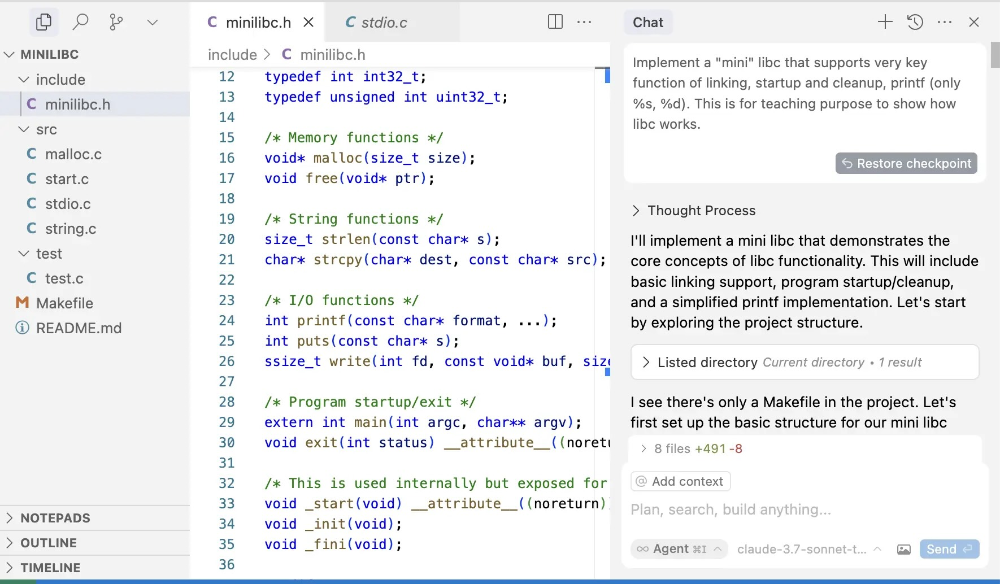

# C 标准库和实现

## 1\. Review & Comments

# M2 发布

## 3.30 更新过一次

  - 大家可以观察一下 Makefile

    NAME := $(shell basename $(PWD))
    export MODULE := M2
    all: $(NAME)

    include ../oslab.mk
    include ../.shadow/oslab.mk

## Online Judge 本周开放

  - (你完全可以 vibe coding 一些 test cases，无需 Online Judge)

# 复习：操作系统上的进程

## 一个汇编/C/Python/… 程序

  - 只有寄存器和内存是可以通过指令不受监管 “随意访问”
  - 其他所有功能都需要通过系统调用实现
      - 进程管理 API: fork, execve, exit
      - 内存管理 API: mmap, munmap, mprotect
      - 访问对象 API: open, read, write, lseek

## 实际上，用这些 API 就可以构建**应用生态**了

  - UNIX 世界为我们提供了一系列的**对象**
      - /proc/\[pid\]/maps, …
      - man -P cat \[anything\] | claude Summarize.
          - pts (4), proc (5), pipe (7)
          - 我甚至 vibe code 了工具来遍历完整的手册！
  - C → (C++, Python, …); C++ → (Java, Node.js, …); …
      - (今天的主题)

## 2\. C 和 libc

# The C Programming Language

## 回顾：SimpleC 的语法和语义

  - 指针、数组、结构体、函数调用
  - 都是**内存和寄存器的直接操作**

## 但这并不是 C 语言的 “完全体”

  - 还有跨越语言边界的能力 (Foreign Function Interface, FFI)
      - C 可以和汇编实现的函数**链接** (ABI)
      - C 可以使用 inline assembly

    void _start() {
        __asm__("mov $60, %eax\n"  // syscall: exit
                "xor %edi, %edi\n" // status: 0
                "syscall");
    }

# Aside: Inline Assembly Demystified

## [一个设计得很糟的嵌入式 DSL](https://gcc.gnu.org/onlinedocs/gcc/Extended-Asm.html)

  - Instructions : Outputs : Inputs : Clobbers : GotoLabels (保持和 C 的 syntax parser 兼容)

    int a = 7, b = 5, result;
    __asm__ ("leal (%1,%1,4), %0" // result = a*5
        : "=r" (result) // output operand
        : "r" (a)); // input operand
    printf("%d * %d = %d\n", a, b, result);

  - 就这玩意地球人绝对写不对啊！
      - 故事：2019 年的时候开始做这份工作，结果手慢了被别人拿到了 Distinguished Paper Award
      - 没想到 AI 时代再也不会需要这样的工作了

# 构建应用生态：组合、复用、分层

## 在抽象层上累积抽象层

  - 1950s: 只有汇编语言
  - 1970s: 用汇编语言编程 = 行为艺术
      - 1960s 高级语言就开始普及了
      - C, Pascal 和结构化程序设计；UNIX……
  - 2010s: C 语言 = “古法编程” (虽然还挺好用的)
      - Python, Java, JavaScript, …
  - 2026: 用高级语言编程 = 行为艺术
      - 自然语言就是编程语言

## 标准化的力量

  - ISO IEC 标准的一部分 (ISO C)
      - 稳定、可靠 (不用担心升级版本会破坏实现)、**世界最佳的移植性**
  - POSIX C 的子集 (unistd.h, …)
      - 几乎所有 “能用” 的操作系统都提供一定的 POSIX 兼容性

# The C Standard Library

## 有请 AI 老师上场

  - 2025: claude-sonnect-3.7 各种翻车
      - 那时候觉得自己可能还有点用
  - 2026: 🤡 竟是我自己
      - 世界变化就是这么快

# 学习已有 libc 的实现

## 调试 glibc？

  - 可以，但不必要
  - glibc 的代码有非常沉重的历史包袱
      - 以及非常多的优化——都是对 “理解原理” 的阻碍
      - 新手阅读体验极差

## 基本原则：**总有办法的**

  - 是否有比 glibc 更适合学习的 libc 实现？
      - 你们只要能问出正确的问题就行了
      - AI 都知道，你为什么不知道呢？让我们学习 [musl](https://musl.libc.org) 吧
          - 直接让他帮我用 -g3 -O1 编译得到一个 musl-gcc，豆包一次搞定

# [调试 “小程序”](/OS/demos/virtualization/musl-demos)

再次回到学习 C 语言时 “最简单” 的例子；但当我们有了操作系统的知识以后，我们就可以深入调试其中的每一个细节。从汇编指令到系统调用到，我们可以看到程序和处理器、操作系统的所有交互。

## 3\. 探索 libc

### 3.1. 指令集体系结构和计算的封装

# Freestanding 环境

## C 代码是直接翻译成指令在机器上执行的

  - 有些标准库功能是依赖操作系统的 (例子: putchar, exit)
      - [Freestanding](https://en.cppreference.com/w/cpp/freestanding): 不依赖任何 Host OS 功能 (syscall)

## 机器/平台相关的常数和定义

  - [stddef.h](https://cplusplus.com/reference/cstddef/), [float.h](https://cplusplus.com/reference/cfloat/), [limits.h](https://cplusplus.com/reference/climits/), [inttypes.h](https://cplusplus.com/reference/cinttypes/), [stdint.h](https://cplusplus.com/reference/cstdint/)
      - 你所有 “不知道” 的定义都在里面
      - 还有一个有趣的 “offsetof(T, m)” (遍历手册的乐趣)
      - 看看 PRIdPTR PRIuPTR 在 gcc -E 后的结果吧

## 指令集的语义和 ABI 相关的参数解析

  - [stdarg.h](https://cplusplus.com/reference/cstdarg/)
      - 由于寄存器传参，它的实现相当复杂……

# 一些 “随手可以实现” 的函数

## [string.h](https://cplusplus.com/reference/cstring/): 字符串/数组操作

  - memcpy, memmove, strcpy, …

## [stdlib.h](https://cplusplus.com/reference/cstdlib/): 常用功能

  - rand, atoi, qsort , …
      - 这些都是 “课后习题” (作为 “高级汇编语言”，标准库是真的很难做)

    void qsort(void*, size_t, size_t, int (*)(const void*, const void*));

## [math.h](https://cplusplus.com/reference/cmath/)

  - 什么数满足 \!(a \> a || a \< a || a == a)？
      - [FP8: E4M3/E5M2](https://arxiv.org/pdf/2209.05433.pdf); [Quantization](https://spectrum.ieee.org/number-representation)

# setjmp/longjmp: 长跳转

## 还记得 SimpleC 的模拟器 (形式语义) 吗？

    pc = stack[-1].PC
    stack[-1].PC.next()
    inst[pc].execute()

## 栈上的 “标记” 和 “长跳转”

    match inst[pc]:
        case "call setjmp":
            buf.depth = len(stack)
            buf.pc = stack[-1].PC
            stack[-1].retval = 0
        case "call longjmp":
            stack = stack[:buf.depth]
            stack[-1].PC = buf.pc
            stack[-1].retval = (x if x != 0 else 1)
        case _:
            inst[pc].execute()

### 3.2. 系统调用的封装

# 文件描述符

## Standard I/O: [stdio.h](https://www.cplusplus.com/reference/cstdio/)

  - FILE \* 背后其实是一个文件描述符
      - C 和 UNIX 的设计就是这样密不可分
  - 我们可以用 gdb 查看具体的 FILE \*
      - 例如 stdout
  - 封装了文件描述符上的系统调用 (fseek, fgetpos, ftell, feof, …)

## The printf() family

  - 这些代码理应没有 “code clones”

    int vfprintf(FILE *, const char *, va_list);

# 进程管理

## 退出管理

  - abort: 给自己发送 SIGABRT (从而触发 core dump)
  - exit: 正常退出，包含 flush stdio buffers
  - atexit: 注册 exit handler (normal exit 时被调用)

## 与其他进程协同

  - system: 启动 Shell
  - popen, pclose: 管道通信
      - 一个设计有历史包袱和缺陷的 API: Since a pipe is by definition unidirectional, the type argument may specify only reading or writing, *not both*; the resulting stream is correspondingly read-only or write-only.

# err, error, perror

## 所有 API 都可能失败

    $ gcc nonexist.c
    gcc: error: nonexist.c: No such file or directory

  - 系统调用明确规定了返回的错误码 (ERRORS in manpages)

## 反复出现的 “No such file or directory”

  - 这不是巧合！
      - 我们也可以 “山寨” 出同样的效果
      - 试试 LANGUAGE=zh\_CN ls nonexist

### 3.3. 进程运行环境的封装

# 进程的运行环境

## 环境 (envp) 会影响应用的行为

  - UNIX 通过 “环境变量” 和 “默认子进程继承” 机制实现
      - man 3 exec

    int main(argc, char *argv[], char *envp[]);

## man 7 environ

  - 全局变量 environ 是谁赋值的？
      - environ 是一个**变量** (符号)
      - 进程初始化时的 envp 因为 ASLR 并不知道在哪里
          - 那一定就是 libc 干得了！
      - 是时候请出我们的老朋友 watch point 了
  - System V ABI “Initial Process Stack”

# C Runtime

## 终究，程序是从 \_start 开始运行的

  - 这也是 libc 的一部分！
      - 你会发现二进制文件链接了 crt1.o
      - “C runtime”，最终把控制权交给 \_\_libc\_start\_main
          - 你还会发现 crtbegin.o, crtend.o, crtn.o 😊

## 让我们从第一条指令开始调试 musl libc 吧！

  - 好消息：做的事情不多

# Takeaways

在系统调用和语言机制的基础上，libc 为我们提供了开发跨平台应用程序的 “第一级抽象”。在此基础上构建起了万千世界：C++ (扩充了 C 标准库)、Java、浏览器世界……今天，C 语言在应用开发方面有很多缺陷，但仍然为 “第一级抽象” 提供了一个有趣的范本：[C is not a low-level language](https://dl.acm.org/doi/pdf/10.1145/3209212), 以及 [C isn’t a programming language any more](https://gankra.github.io/blah/c-isnt-a-language/)。

# 阅读材料

在 AI 的帮助下调试 musl libc 中你感兴趣的函数。
