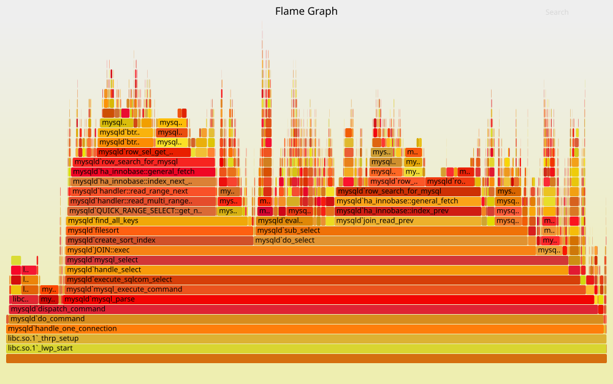

# C 标准库和实现 (2)

## 1\. 编译 musl libc

# 使用自己的 libc

## 原理

  - 在 freestanding 的环境里，除了 “我的代码”，什么都没有
      - 控制了 \_start，就控制了一切
      - Foreign function interface/inline assembly 可以执行系统调用/指令序列
      - 于是就没什么是不能实现的了

## 实例：musl-libc

  - 编译一份自己的 libc (musl-gcc), -Og & -ggdb
  - 上次翻车原因：直接让豆包搞定，他幻觉搞定了 (这次直接修改配置并检查了)

### 1.1. Aside: Debug Info

# Debug Info

## 二进制文件里除了指令和数据，还有**额外的信息**

  - 低级程序状态 (PC、寄存器、内存) → 高级程序状态 (栈帧、变量、代码行)
      - 我们可以用 .symtab 做近似的 addr2line
      - gcc 支持 -gstabs 生成 .stab 符号表 (更好用的 addr2line)

## 今天：[DWARF Debugging Standard](https://dwarfstd.org/)

  - 包含一个 bytecode 指令集，能任意访问进程内存，描述 “在某个 PC 范围内，变量的值在哪里、如何算出来”
      - 甚至可以在**优化后**的二进制代码中得到部分信息
  - 也用于实现 C++ 异常的 stack unwinding

# 热评：Claude Code 源代码泄漏

## JavaScript 的 debug info

  - 你的 node\_modules 里到处都是 .map (Source Code Map, JSON) 文件
  - [cli.js.map](https://github.com/hangsman/claude-code-source/blob/main/cli.js.map) 泄漏后，光速就有了[能运行的版本](https://github.com/oboard/claude-code-rev)
      - 他们的 CI 竟然没有 `claude 是否存在潜在内部信息泄漏` 😊

    {
        "version": 3,
        "file": "bundle.js",
        "sources": ["src/index.js"],
        "names": ["map", "callbackFn"],
        "mappings": "AAAA, ...",
        "sourcesContent": ["const x = 1; ..."]   // 就是这个！
    }

# Debug Info 的作用

## 重构 “程序意义” 状态的能力

  - Stack unwinding (backtrace)
  - Trace/profiler ([Perfetto](https://perfetto.dev/), flame graph, …)
  - Crash dump 调试
  - AddressSanitizer 诊断报告

## 2\. 探索 libc 实现

# [调试 “小程序”](/OS/demos/virtualization/musl-demos)

再次回到学习 C 语言时 “最简单” 的例子；但当我们有了操作系统的知识以后，我们就可以深入调试其中的每一个细节。从汇编指令到系统调用到，我们可以看到程序和处理器、操作系统的所有交互。

# crt1.o 和程序初始化

## 我们可以用代码里 “反向推出” Initial Process Stack

  - 依旧豆包，启动
  - (可以看到 dummy 的 strace 十分精简)

# 调试 printf 和 va\_args

## printf

  - 可以看到 struct FILE 的 “内部”
      - 包括 stdout 变量
      - 一直到系统调用的使用 (和 strace 可以对上)

## 变参数

    void foo(int n, ...) {
        intptr_t *vargs = (intptr_t *)&n;
        // vargs[0]
        // vargs[1]
        // ...
    }

  - cdecl 的 hack 在 x86-64, aarch64, riscv 上都不能正常工作了

# 调试 setjmp/longjmp

## 这个比较复杂了

  - 我们做一个有趣的 trick
      - setjmp 前写入所有寄存器
      - longjmp 前再写入一次所有寄存器
      - 就可以很清楚地看到 setjmp/longjmp 的行为了
  - 甚至可以逆向出部分 aarch64 的 calling convention
      - 哪些恢复了，就是 callee-saved
      - 没恢复的都是 caller-saved (call-clobbered，我更喜欢这个理解)

# 调试 gettimeofday

## 回答一个问题：到底有没有用系统调用？

  - 我们一路可以看到进入 vDSO 的过程
      - 甚至我们可以看到**获取 gettimeofday 实际入口地址的代码** (musl 的一部分)
  - 我们甚至可以让 AI 帮我们 trace 指令序列

## 3\. 动态内存分配

# malloc 和 free

## 非常简单直观的 API

  - ptr = malloc(n); free(ptr)
      - 例子：实现链表
      - 问题：内存从哪里来的呢？
  - 操作系统**不支持**分配一小段内存
      - 应用程序可以每次向操作系统 “多要一点” 内存
      - 自己在内存上实现一个数据结构

## 内存分配背后的系统调用：mmap/sbrk

  - 大段内存，要多少有多少
      - 用 MAP\_ANONYMOUS 申请
      - 超过物理内存上限都行 (回忆我们的 demo)

# Aside: malloc/free 犯下的 “错误”

> I call it my billion-dollar mistake. It was the invention of the null reference in 1965. (Tony Hoare, 1934—2026)

## 最小完备性 & 机制与策略分离

  - 系统调用, libc, …
      - 有些 API 不引入额外的复杂性，例如 open/write → Pathlib
      - 有些不一样：malloc 要求在任何可能路径上都必有一次配对的 free，且之后不再使用
          - 就为了证明这个，人类不知道走了多少弯路
              - 今天：managed runtime, RAII, ownership/borrowing, …
          - 无穷无尽的 CVEs: Use after free, concurrent use after free, memory leak, …

# 作业：实现 malloc

## 如果 n 足够大

  - 直接用 mmap 分配内存

## 如果 n 不够大

  - 每个 mmap region 都维护了一个**数据结构**
      - 数据结构维护了不相交的小区间集合
      - 我们需要区间的 find-first、删除
  - 如果你向这个方向思考，就会想到 balanced binary search tree ❌

# 年轻的你们对现实的恐怖一无所知

## 早在 1995 年：[这才叫 research](http://jyywiki.cn/OS/manuals/malloc-survey.pdf)

  - Segregated free lists 在 1964 年就提出了
  - 停止无意义的 “科研实践”，去做真正有价值的事情

> Understanding real program behavior still remains the most important first step in formulating a theory of memory management. Without doing that, we cannot hope to develop the science of memory management; we can only fumble around doing ad hoc engineering, in the too-often-used pejorative sense of the word. At this point, the needs of good science and of good engineering in this area are the same—a deeper qualitative understanding. We must try to discern what is relevant and characterize it; this is necessary before formal techniques can be applied usefully.

# 实现高效的 malloc/free

> Premature optimization is the root of all evil.
>
> ——D. E. Knuth

## 重要的事情说三遍：

  - **脱离 workload 做优化就是耍流氓**
      - 在开始考虑性能之前，理解你需要考虑什么样的性能

## 然后，去哪里找 workload?

  - 当然是 paper 了 (顺便白得一个方案)
      - [Mimalloc: free list sharding in action](https://www.microsoft.com/en-us/research/uploads/prod/2019/06/mimalloc-tr-v1.pdf) (APLAS‘19)
      - [卷到今天](https://dl.acm.org/doi/10.1145/3620666.3651350)大家做的事情也没变：看 workload 调性能

# 理论 v.s. 实践

## 在实际系统中，我们通常不考虑 adversarial worst case

  - 现实中的应用是 “正常” 的，不是 “恶意” 的
      - 但这给了很多 Denial of Service 的机会：[Cross container attack](https://dl.acm.org/doi/abs/10.5555/3620237.3620571)

## malloc() 的观察

  - **大对象分配后应，读写数量应当远大于它的大小**
      - 否则就是 performance bug
      - 申请 16MB 内存，扫了一遍就释放了😂
          - 这不是 bug，难道还是 feature 吗？
  - 推论：**越小的对象创建/分配越频繁**

# malloc() 的观察

## 我们需要管理的对象

  - 小对象：字符串、临时对象等；生存周期可长可短
  - 中对象：容器、复杂的对象；更长的生存周期
  - 大对象：巨大的容器、分配器；很长的生存周期

## 结论

  - **我们几乎只要管好小对象就好了** (当然，仅针对 oslabs)
  - 由于所有分配都会在所有处理器上发生
      - 小对象分配/回收的 **scalability** 是主要瓶颈
      - 使用链表/区间树 (first fit) 可不是个好想法

# malloc, Fast and Slow

## 人类也是这样的系统

  - *Thinking, Fast and Slow* by Daniel Kahneman

## 设置两套系统

  - Fast path (System I)
      - 性能极好、覆盖大部分情况
      - 但有小概率会失败 (fall back to slow path)
  - Slow path (System II)
      - 不在乎那么快
      - 但把困难的事情做好
  - 计算机系统里有很多这样的例子 (比如 cache)

# 人类的智慧：空间换简洁

## 分配: Segregated Lists (Slab)

  - 每个 slab 里的每个对象都**一样大**
      - 每个线程拥有每个对象大小的 slab
      - fast path → 立即在线程本地分配完成
      - slow path → mmap()

## 回收: O(1)

# AI 时代？

## Heuristics is dead, Policy is Heuristics, LLM is Policy, Mechanism is King.

> 原文：“Tape is Dead, Disk is Tape, Flash is Disk, RAM Locality is King.” (Jim Gray, 2006)

  - Scaling law & bitter lesson: 我们需要为 AI 搭建**舞台**
  - 让 AI 在一个 Design Space 里探索
      - 甚至允许扩充 Design Space

## 为什么我们要让 PhD 学生做[综述](http://jyywiki.cn/OS/manuals/malloc-survey.pdf)？

  - 学会提取 Design Space 的能力
  - malloc/free 的 Design Space 是什么呢？

# Takeaways

libc 作为屏蔽了几乎所有指令集体系结构和 ABI 的抽象层，里面有许多隐秘的 “角落”，必须用 “机器级” 的 hacking 实现，而不仅仅是系统调用的封装。在 libc 的抽象之上，除了极致性能的场景，我们几乎不再需要任何 “机器相关” 的代码——这个可移植的抽象层最终支撑了世界的应用生态。

# 阅读材料

在 AI 的帮助下调试 musl libc 中你感兴趣的函数。
