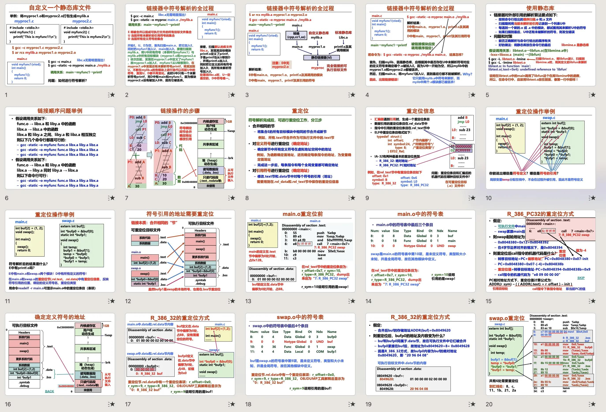
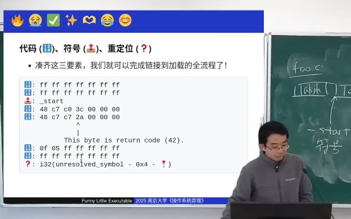

# 可执行文件

## 1\. 静态链接和加载

# 复习：什么是可执行文件？

## 学习操作系统前

  - 那个 “双击可以弹出窗口的东西”

## 学习操作系统后

  - 一个操作系统中的对象 (文件)
  - 一个字节序列 (我们可以把它当字符串编辑)
  - 一个描述了进程初始内存布局的**数据结构** (打扰了)

# 真正的可执行文件

## UNIX [a.out](https://man.freebsd.org/cgi/man.cgi?a.out\(5\)) “assembler output”

    struct exec {
        uint32_t  a_midmag;  // Machine ID & Magic
        uint32_t  a_text;    // Text segment size
        uint32_t  a_data;    // Data segment size
        uint32_t  a_bss;     // BSS segment size
        uint32_t  a_syms;    // Symbol table size
        uint32_t  a_entry;   // Entry point
        uint32_t  a_trsize;  // Text reloc table size
        uint32_t  a_drsize;  // Data reloc table size
    };

  - 人造物：复杂的东西都是从简单演变过来的
      - 甚至都没有 offset (.text 位置是平台/ABI 相关的常数)
      - 不支持动态链接、调试信息、内存对齐、thread-local……
          - 所以有了现在的 ELF\!

# 被《计算机系统基础》支配的恐惧？

## [System V ABI](https://jyywiki.cn/OS/manuals/sysv-abi.pdf)

  - Section 3.4: “Process Initialization” (调试 crt1.o 的时候确认)
  - Section 4: “Object Files”

# 和 ELF 搏斗的每一年

## 你期末复习的时候吐血了吗？

  - 同学 A: 吐了
  - 同学 B: 吐了
      - “连 CSAPP 这一章都讲得不怎么样”

## 不只是你们，我们也在吐血

  - 任课教师 A: 第一次打开 ppt 真的有点吐血的感觉
  - 任课教师 B: 根本讲不完，我估计听懂的人也不多
  - 我自己：太好了，再也不用教了

## 为什么？

  - ELF 是**为机器效率**设计的: 高效、紧凑
      - 大量的 bitfield、offset、交叉引用、……
      - 人类偏向于 “信息立即可见” 的平坦结构

### 1.1. Funny Little Executable

# 一个疯狂的想法

## ELF 不过是一个 “描述”

  - 基本信息 (版本、体系结构……)、内存布局 (哪些部分是什么数据)、其他 (调试信息、符号表、重定位……)

## 我们总是可以在**等价的描述形式**之间转换

  - Intelligence is cheap
      - 让 AI 帮我们做一个转换工具就行
  - Step 1: 把 ELF 转成一个 “容易阅读” 的格式
  - Step 2: 实现一个加载器加载它
      - 反正可以 vibe coding，麻烦的事情让 AI 搞定吧

# Funny Little Executable

## 这几年一直在改进 “FLE”

  - 既兴奋，又有些怅然若失：“聪明” 的努力只值一句 prompt

# [Funny Little Executable](/OS/demos/virtualization/fle)

我们 “自行设计” 了能实现 (静态) 链接和加载的二进制文件格式，以及相应的编译器、链接器 (复用 gcc/ld) 和加载器。FLE 文件直接将一段可读、可写、可执行的位置无关代码连通数据映射到内存并跳转执行。

# Funny Little Executable 2.0

## 如果让我再做一次？

  - 我也许会选 Markdown-based (人类可读绝对优先)

    # ELF [class=64 endian=le osabi=sysv machine=x86_64 type=ET_DYN pie=true entry=_start]
    ## PT_LOAD [flags=R|X align=0x1000]
    ### .text [type=PROGBITS flags=A|X align=16]
    _start:
        48 c7 c0 01 00 00 00          # mov rax,1   ; sys_write
        48 c7 c7 01 00 00 00          # mov rdi,1   ; fd=1
        48 8d 35 {pcrel32: msg - . - 4}  # lea rsi,[rip+msg]
        48 c7 c2 {u32: msg_end - msg} # mov rdx,len
        0f 05                         # syscall

        48 c7 c0 3c 00 00 00          # mov rax,60  ; sys_exit
        48 31 ff                      # xor rdi,rdi
        0f 05                         # syscall
    ## PT_LOAD [flags=R align=0x1000]
    ### .rodata [type=PROGBITS flags=A|R align=16]
    _msg:
        48 65 6c 6c 6f 2c 20 4d 44 21 0a   # "Hello, MD!\n"

# 反思

## 我们应该怎么教《操作系统》(和任何课程)？

  - 把知识网络、案例、动机、思路呈现给学生
      - [Andrej Karpathy’s LLM Wiki](https://gist.github.com/karpathy/442a6bf555914893e9891c11519de94f)
      - (我的 PhD Training 很大程度上是 “人肉” 建立这些关联)
  - 学生：提出问题、把握解决问题的方向、质疑并确认结论

## 我是人奸

  - 以下过程能产生所有人类知识：

    D = {"a", "aa", "abandon", ...}
    for k in [1, 2, ... MAX_K]:
        for sentence in D**k:
            do_research(sentence)

### 1.2. Aside: Linux 内核里的加载器

# 加载器是内核实现的一部分

## execve(path, argv, envp)

  - 操作系统内核解析 path、完成加载
  - 还有[代码 (binfmt\_elf.c)](https://elixir.bootlin.com/linux/latest/source/fs/binfmt_elf.c)呢
      - 可以找到各种上课介绍过的概念
          - Initial Process Stack (argc, argv, envp)
          - Auxiliary Vector (auxv)
      - 关键字搜索：PT\_LOAD
      - 有代码的地方就有 bug: [CVE-2024-46826](https://cvefeed.io/vuln/detail/CVE-2024-46826)

## 让 Coding Agent 直接打开 Linux Kernel 吧

  - Coding Agent 在大型项目上的表现令人吃惊
      - 很大程度是因为人类维护了项目的 consistency，使 AI 可以 in-context learning

# Shebang 运行程序

## UNIX 对注释的妙用 (滥用): execve 一个可执行的**脚本文件**

  - 我们甚至可以 strace ./a.sh，execve 的参数正如我们预期的一样
      - 但如果在程序里，argv 又是不同的值
      - Path(“S”).read\_text() == “\#\!A B C”
          - S x y → execve(“A”, \[“A”, “B C”, “S”, “x”, “y”\], envp)
          - Caveat: macOS (BSD) 会把 B C 作为两个参数 (POSIX 漏了规定)
  - Linux 的实现：[binfmt\_script.c](https://elixir.bootlin.com/linux/latest/source/fs/binfmt_script.c)
      - 优先使用 `#!` 作为解释器 (Magic Number)

    /* Not ours to exec if we don't start with "#!". */
    if ((bprm->buf[0] != '#') || (bprm->buf[1] != '!'))
            return -ENOEXEC;
    ...
    file = open_exec(i_name);

# [Shebang](/OS/demos/virtualization/shebang)

在 UNIX 的早期，为了能更方便地将脚本作为可执行文件，实现了 `#!` 开头的 “可执行文件”，并沿用至今。Shebang 会调用第一行中执行的命令和参数，并把这个脚本文件作为命令行参数传入。

## 2\. 动态链接和加载

# 为什么需要动态链接？

## 静态链接的世界

    struct exec {
        uint32_t  a_midmag;  // Machine ID & Magic
        uint32_t  a_text;    // Text segment size
        uint32_t  a_data;    // Data segment size
        uint32_t  a_bss;     // BSS segment size
    };

  - “d3dx9\_xxx.dll” 为每个游戏复制一份，似乎不是个好想法？

## 我们希望 **“拆解” 应用程序**

  - 运行库和应用代码分离
  - 整个系统里只有一个 glibc 的副本，可以[独立升级](https://semver.org) (Dependency Hell)
  - 也可以实现大型项目的分解 (libjvm.so, libart.so, …)
      - NEMU: “把 CPU 插上主板”

# 探索动态链接的行为

## 我们可以在 Linux 上观察到这种共享吗？

  - 必须可以\!
      - 我们可以构造一个非常大的 bloat()
      - 再创建 1,000 个进程使用 API 动态加载并执行 bloat()

## 观察系统的内存占用情况情况

  - 如果不是一份拷贝，我会立即翻车
      - 我们可以观察到 Address Space Layout Randomization (ASLR) 的效果
      - 动态链接库是**位置无关代码** (Position Independent Code)

## 还记得 /proc/\[pid\]/fd 吗？

  - 我们应该可以看到所有进程打开/映射的文件！
  - lsof libbloat.so 可以看到
      - 它是怎么实现的呢？strace &| grep open 就知道啦！

# [动态链接库是进程间共享的吗？](/OS/demos/virtualization/bloat)

试着创建一个 10M nop 组成的 bloat()，编译在 libbloat.so，然后创建 1000 个进程动态链接它。如果 libbloat.so 的每个进程都有一份副本，那么系统的内存占用应该会达到 10GB。

# 动态链接程序的加载

## 细思恐极：先有鸡还是先有蛋？

  - 之前 musl-gcc -static 编译出的 \_start 在 crt1.o 中
      - 如果 libc 是动态链接的，\_start 在哪里？
      - \_\_libc\_start\_main 又在哪里？

## 计算机世界没有魔法

  - crt1.o 还是静态链接的 (程序需要 \_start)
  - 动态链接 a.out 的第一条指令**不是**程序的 \_start
      - musl-gcc 调试一下吧！
          - 可以 info proc mappings (pmap) 验证
      - “ld-linux.so”: “写死” 在 ELF 文件的 INTERP (interpreter) 段里的
          - 我们可以调试，甚至直接编辑它
          - glibc 是用 ld-linux.so 调用 mmap 系统调用加载的

### 2.1. Aside: 阅读 ld.so 手册

# man 8 ld.so

## 一座 “打开系统世界大门” 的金矿

  - 仅仅是 man -P cat ld.so | claude Summarize，今天就值回票价了

## 一些有趣的功能

  - LD\_LIBRARY\_PATH (类似于 PATH)
  - LD\_DEBUG=libs ls; ldd /bin/ls
  - LD\_BIND\_NOW=1 (可以用于调试)
  - LD\_SHOW\_AUXV=1 ls
      - 里面有 AT\_SYSINFO\_EHDR (计算机世界没有魔法！)
      - 不懂就管道给 AI Agent 吧 😊

# LD\_PRELOAD

## 一个神奇的 “hook” 机制

  - ld.so: 谁先被加载并**首次满足未定义符号**，谁就生效
      - 如果在任何库加载之前 load 一个 .so，就可以 “覆盖” 任何符号
      - LD\_PRELOAD: 这里可以玩的花活就多了

## 让我们实现 “变速齿轮”

  - 我只是让 AI 覆盖 time-related functions，他就可以给你惊喜
  - AI 还知道 LD\_PRELOAD 可以玩的花活
      - glXSwapBuffers 实现透视挂
      - 劫持 rand() 实现 “随机”
      - 非侵入性的日志 (例如 malloc/free trace)

# [变速齿轮](/OS/demos/virtualization/wheel)

实现 “变速齿轮”：通过 LD\_PRELOAD 机制覆盖和时间相关的系统调用 (gettimeofday, usleep, alarm 等)，通过在启动时记录时间并维护 10 倍速度的虚拟时间实现变速。

### 2.2. Aside: 实现动态链接

# 实现动态链接

## 更多对细节的追问

  - main 和 libwheel.so 都可以调用 printf()
      - printf() 是动态加载的
      - 意味着编译/链接的时候**地址是不知道的**
          - aarch64 bl: 26 位立即数，±128M
          - x86-64 call: 32 位立即数，±2GB
          - a.out 和 libwheel.so 的跳转指令必须**链接时确定地址**

> *All problems in computer science can be solved by another level of indirection*. (Butler Lampson)

  - 如果是 same\_binary()，就直接跳转
  - 如果不是，就跳转到一小段 trampoline code (PLT)
      - PLT 里会查表 call \*TABLE\[printf\]
      - Global Offset Table (GOT)，它们是需要重定位的 (和静态链接类似)

# PLT: 没能解决数据的问题

## 数据不能像代码一样 “两级跳转”

    extern int x;
    x = 1;

  - 如果在同一个 .so: `mov $1, x(%rip)`
  - 如果在另一个 .so: `mov GOT[x], %rdi; mov $1, (%rdi)`
      - main 访问 stdout: 高效
      - libwheel.so 访问 stdout: 低效

## 不优雅的解决方法

  - \-fPIC 默认会为所有 extern 数据增加一层间接访问
      - 可以通过 **attribute**((visibility(“hidden”))) “告诉” 编译器

# Takeaways

可执行文件本质上是 “进程初始状态的描述”。ELF 格式虽然强大但复杂不友好，通过理解链接和加载的核心概念（代码、符号、重定位），我们可以设计更友好的格式。动态链接通过 GOT/PLPL 实现了代码共享，是现代操作系统的重要机制。

# 阅读材料

教科书 Operating Systems: Three Easy Pieces:

  - 第 17 章 - Free Space Management

以下为选读，考试不涉及：

  - 第 18 章 - Introduction to Paging
  - 第 19 章 - Translation Lookaside Buffers
  - 第 20 章 - Advanced Page Tables
  - 第 21 章 - Swapping: Mechanisms
  - 第 22 章 - Swapping: Policies
  - 第 23 章 - Complete VM Systems
