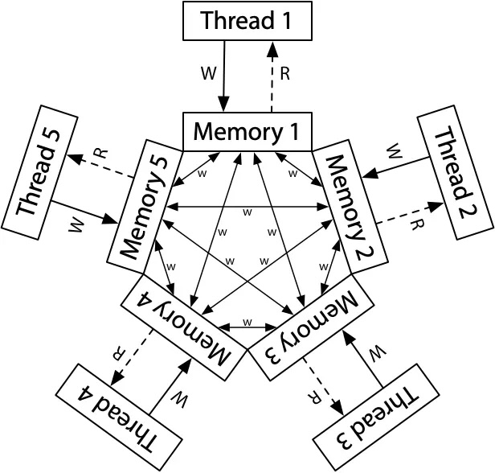

# 多处理器编程：从入门到放弃

# Review: 从系统调用到应用生态

## 初始状态：CPU Reset

  - Firmware 加载操作系统
  - 操作系统加载 initramfs 里的 init 程序
      - (我们讲了链接和加载)
  - init 程序加载真正的文件系统，pivot\_root 到新的 init 程序 (systemd pid=1)
      - (OS 持续提供 syscalls: fork, execve, mount, mmap, open, …)

## 基于操作系统 API 的应用生态

  - libc: 一个有 ISO 标准、可移植的基座
  - 底层库函数 (curses, readline, …)、编程语言供应链 (PyPI, npm、……)
  - 海量的应用程序

## “系统调用” API 很好地隔离了应用和指令集

  - x86, Aarch64, RISC-V 都共享一份应用生态
      - 体系结构相关代码只占很小一部分

## 1\. 并发编程入门

# 共享内存的并发编程：动机

## 动机 1：syscall 可能执行很长时间

  - 在执行系统调用时，程序也许可以 “不闲着”
      - 也许我们可以同时执行若干个 handle\_request

    void http_server(int fd) {
        while (1) {
            buf = alloc_buf();
            nread = read(fd, buf, 1024);  // syscall
            handle_request(buf, nread);
        }
    }

## 动机 2：多处理器系统是共享内存的，不用白不用

  - 一旦分叉 (fork)，就 “形同陌路” 了，无法直接用内存通信
  - 这里有一个先有鸡还是先有蛋的问题
      - 一开始设计了 Symmetric Multiprocessing，就下不了车了 😂 即便是 Non-uniform Memory Access (NUMA)，也要维持共享内存的模型

# 实现共享内存的 “进程”？

## 加一个操作系统 API 就搞定

  - C 程序的状态机模型
      - 初始状态：main(argc, argv, envp)
      - 状态迁移：执行一条语句 (指令)
  - 扩展这个模型就行

## **多线程程序**的状态机模型

  - 增加一个特殊的系统调用：spawn()
      - 增加一个 “状态机” (**线程**, thread)，有独立的栈，但共享全局变量
  - 状态迁移：选择一个状态机执行一条语句 (指令)

## 恭喜你，你已经了解了并发的全部

  - 吗……？
  - 不，你打开了魔鬼的盒子
      - AI 让我 “顺着补几刀，把魔鬼具体化”，完美预言了我后面要讲什么 😭

### 1.1. 概念：并发 v.s. 并行

# 并发 v.s. 并行

## 并发

  - 逻辑上的 “同时执行”
      - 可以由操作系统/运行库模拟出的 “轮流执行”
      - （也可以是真正同时执行）

## 并行

  - 真正意义上的 “同时执行”
  - 有 (共享内存的) 多个处理器
      - 同时执行指令 (load/store 访问共享内存)

## 对应到概念模型

  - SimpleC 选一个线程执行一条语句 (并发模型)
  - SimpleC 的每个线程同时执行一条语句 (并行模型)
      - 实际处理器每条指令执行的速度不同，更准确地说，当前 “在处理器上的线程” 执行指令的一部分 (这里有一个魔鬼的伏笔)

### 1.2. 迷你线程库

# Spawn & Join

## 简化的线程 API (thread.h)

  - 给操作系统 pthreads (7) 线程库做了一点减法
  - 只适合最简单的程序，仅供理解原理使用，完全不具有任何实用性

## spawn(fn)

  - 创建一个入口函数是 fn 的线程，并立即开始执行
      - void fn(int tid) { … }
      - 参数 tid 从 1 开始编号

## join()

  - 等待所有运行线程的返回
      - main 返回默认会 join 所有线程
  - 行为：while (num\_done \!= num\_threads) ;

# [迷你线程库](/OS/demos/concurrency/thread-lib)

在这个 “最简” 的线程库中，我们封装了 POSIX 线程库，提供了线程管理的 API：`spawn(fn)` 创建一个新线程，执行函数 `fn`；`join()` 等待当前运行的线程结束。使用这两个 API，我们就可以利用系统中的多处理器资源了：线程可以被同时调度到不同的处理器上并行执行。

# 证明 “共享内存并发”

    #include <thread.h>

    int x = 0, y = 0;

    void inc_x() { while (1) { x++; sleep(1); } }
    void inc_y() { while (1) { y++; sleep(2); } }

    int main() {
        spawn(inc_x);
        spawn(inc_y);
        while (1) {
            printf("\\033[2J\\033[H");
            printf("x = %d, y = %d", x, y);
            fflush(stdout);
        }
    }

  - 这个程序 “证明” 了全局变量确实是共享的

# 更多的问题

## 多线程程序真的利用了多处理器吗？

  - 并发确定了，那是不是真并行？

## 线程是否具有独立堆栈？

  - 如果是，栈的范围？

## 如何用 gdb 单步调试多线程程序？

  - LLM 帮你读过 [The Friendly Manual](https://sourceware.org/gdb/onlinedocs/gdb/Threads.html) 了
      - 2025 年的讨论：System 人最擅长的就是底层工具的使用，曾经是 “做 system” 的壁垒；但现在有 LLM 了，这都不算什么了
      - (那时候甚至 agents 还不那么好用，现在 agent 都可以直接替你用工具了)

# [通过线程库理解线程行为](/OS/demos/concurrency/thread-examples)

我们可以不必 “直接接受” 老师或书本上的知识，而是亲手验证它们，例如线程的确是共享内存的，再比如验证每个线程都有独立的栈——我们可以把 “访问过” 的栈空间标记出来，从而得到每个线程栈的大概范围。

## 2\. 放弃 (1)：状态迁移的确定性

# 不确定性 (Non-determinism) 的魔鬼

## 数学的确定性 (determinism)

  - 函数 f: X ↦ Y 同样的输入，产生**唯一**的输出

## 程序的确定性 (determinism)

  - SimpleC；计算机 (NEMU) 的迁移都是函数
      - s’ = f(s); f 是确定性的
      - 给定相同的初始状态，程序总是执行相同的指令序列
  - “Everything is a state machine”
      - 虽然把数学视角砍掉了，但在理解并发程序的时候，这个视角还是很有用

## 确定性给我们 “可控” 的感觉

  - 同一件事总是 **reproducible** 的
      - 这就是我们喜欢 functional programming 的原因

# 不确定性 (Non-determinism) 的魔鬼 (cont’d)

## 程序 “自身” 是完全确定的

  - 初始状态不确定 (argv, envp, auxv)
  - 系统调用不确定 (getpid, read, …)
  - 所有内存和计算指令是确定的
      - 有一些例外 (rdrand, rdtsc)

## **共享内存**的并发打破了这一点

  - 线程执行的**速度**是没有保证的
      - 这意味着 load 可能读到其他线程的 store (也可能不)
  - 非确定性的程序理解起来相当困难

# 确定性的丧失：例子

    unsigned int balance = 100;

    int T_alipay_withdraw(int amount) {
        if (balance >= amount) {
            balance -= amount;
            return SUCCESS;
        } else {
            return FAIL;
        }
    }

## 猜到两个线程并发支付 ¥100 会发生什么吗？

  - Bug/漏洞不跟你开玩笑：Mt. Gox Hack 损失 650,000 BTC
      - 时值 \~$28,000,000,000
  - [Diablo I 的 “物品复制” bug](https://jyywiki.cn/OS/img/diablo-item-clone.mp4)

# [山寨支付宝](/OS/demos/concurrency/alipay)

由于线程调度可能随时随地发生，人类并不擅长理解它们的行为。与其他的编程语言特性联系在一起，就可能产生糟糕的后果——尤其是在有 undefined behavior 的编程语言 (例如 C/C++) 中，可能导致诸多安全漏洞。

### 2.1. 非确定性带来的并发控制难题

# 于是，你发现 1 + 1 都不会求了……

## 你还会计算 1 + 1 + … + 1 吗？

    #define N 100000000
    long sum = 0;

    void T_sum() {
        for (int i = 0; i < N; i++) {
            sum++;
        }
    }

    int main() {
        create(T_sum);
        create(T_sum);
        join();
        printf("sum = %ld\n", sum);
    }

  - sum++ 包含一个 load，一个 store

# [使用 mutex API 实现互斥](/OS/demos/concurrency/sum-mutexapi)

我们的线程库提供了 mutex\_lock, mutex\_unlock 的 API 实现互斥。

# 失去确定性的后果

## 并发执行三个 T\_sum，sum 的最小值是多少？

    void T_sum() {
        for (int i = 0; i < 3; i++) {
            int t = load(sum);  // 假设单行语句的执行是原子的
            t += 1;
            store(sum, t);
        }
    }

## 这个问题本质上就很难：[Trace recovery is NP-Complete](https://epubs.siam.org/doi/10.1137/S0097539794279614); [vibe code 的游戏](https://jyywiki.cn/OS/2026/vsc.html)

    - 2025: deepseek-r1, o3-mini 全军覆没
    - 2026: Deepseek Expert, Qwen-3.5-max, GLM-5.1 ✔︎
    - Deepseek Instant, Qwen-3.6-plus ❌

# 确定性的丧失：后果

## 正确实现并发 1 + 1 比想象中困难得多

  - 1960s，大家争先在共享内存上实现原子性 (互斥)
  - 但几乎所有的实现都是**错的**
      - 直到 [Dekker’s Algorithm](https://en.wikipedia.org/wiki/Dekker%27s_algorithm)，还只能保证两个线程的互斥

## 并发影响了计算机系统世界中的一切

  - libc 里的函数还能在多线程程序里调用吗？
  - 我们都知道 printf 是有缓冲区的 (fork 的例子)
      - 两个线程同时执行 buf\[pos++\] = ch 很危险；看看 printf (3) 吧

## 3\. 放弃 (2)：顺序执行的幻想

# SimpleC：幻想 v.s. 现实

## 可以 vibe code 一个 SimpleC 的解释器

  - Fully functional，支持 FFI，**任何** C 程序都可以
      - (招募一个同学做毕业设计)

## 但是，我们还想要**极致的性能**

  - Frances Allen 2006 年获得了图灵奖，PL 领域的图灵奖就更多了
  - 毕竟性能 = 金钱 (AI 时代更是了)
      - 编译器：除了 FFI (系统调用) 不能动，**语句完全不需要按 SimpleC 写的来**

## Rewriting-based optimization

  - 语义等价的 Inline, Constant Propagation, Dead Coded Elimination, …
      - 等一等，**语义等价**是针对 deterministic 程序假设的！
      - 如果读到来自其他线程写入的值……
          - 如果依赖这个假设编程，编译器会教你做人的 😊

# 一个聪明的例子

    while (!flag);

  - “等另一个线程举起旗子，我就能继续了”？

## 聪明，但编译器更聪明 😭

  - 如果这是个顺序程序，编译器可以做什么优化？
      - (这甚至也是一个常见的并发 bug 模式)
      - [“Ad hoc synchronization considered harmful”](https://www.usenix.org/conference/osdi10/ad-hoc-synchronization-considered-harmful)

# 求和 (再次出现)

    void T_sum() {
        for (int i = 0; i < N; i++) sum++;
    }

    int main() {
        create(T_sum);
        create(T_sum);
        join();
        printf("sum = %ld\n", sum);
    }

## 如果添加编译优化？

  - \-O1: 100000000 (n) 😱😱
  - \-O2: 200000000 (2n) 😱😱😱
      - 让 AI 读一下汇编来解释吧

# 控制编译器优化的行为

## 方法 1：插入 “不可优化” 的代码块

while (\!flag) { asm volatile (“” ::: “memory”); }

## 方法 2：标记变量 load/store 为不可优化

int volatile flag; while (\!flag);

## 以上都**不是**《操作系统》课推荐的方法

  - **Don’t play with shared memory.**

## 4\. 放弃 (3)：指令顺序执行

# 两层 “编译”

## .c → .s

  - 编译器 “大杀四方”
  - 调换语句的顺序；删除死代码；……

## .s → CPU 的内部状态

  - 没想到吧，**处理器也是个编译器**！
      - 处理器内有不止一条 on-the-fly 的指令
      - 会做动态的数据流分析，“擅自调整” 指令执行的顺序
          - 依然是 deterministic 的假设

## SimpleC 并发模型只是一个幻想

  - [Memory Models](https://research.swtch.com/mm) by Russ Cox

# 宽松内存模型 (Relaxed Memory Model)

## 一切为了性能

  - Store 写入 local memory (cache)，再慢慢同步给其他处理器
  - 允许 load 读到 local memory (cache) 的旧值

# 观测 “无序” 带来的后果

    int x = 0, y = 0;

    void T_1() {
      x = 1; // Store(x);
      int t = y; // Load(y);
    }

    void T_2() {
      y = 1;  // Store(y);
      int t = x; // Load(x)
    }

  - 我们可以试着排列一下可能的运行结果
      - Intel 做了一个错误的决定：让 x86 有一个 “很强” 的内存模型
      - 既没有强到 “好编程”，又给性能拖了后腿 (还让给 ARM 模拟 x86 增加了很大的麻烦)
          - Rosetta 2: [Apple cheated](https://github.com/saagarjha/TSOEnabler)
  - 这样的 “litmus tests” 可以用来 “逆向” memory model 类型

# [宽松内存模型](/OS/demos/concurrency/mem-model)

我们简化理解多处理器的状态机模型时假设了每次选择一个处理器执行一条指令。然而，由于动态指令调度和缓存的共同作用，实际程序的运行结果更可能超出我们的预期。

# 总结：“图方便，把刀直接递给程序员” 的过度开放机制

## 用到刀子的时候还挺方便的……

  - 共享内存多线程：1 + 1 都不会写了
  - 宽松内存模型：1, 2, 3 都数不对了
  - malloc/free：今天你是你是不是又 Use After Free 了？
  - open/close：你是不是又忘了 close 了？
      - 算了，做新的编程语言/框架，把刀子没收吧

## AI 时代的思考

  - AI 是真正的 “核动力牛马”，不需要 “图方便”
      - 只要给他 critical path 上极限性能的**能力**，让他麻烦一点没问题

# Takeaways

我们可以很容易地把状态机模型扩展为共享内存上的多线程模型——只是每次选择一个状态机执行一步，通过提供 spawn 和 join 两个 API 来利用现有多处理器系统的共享内存能力。

然而，我们 “单步语义” 的直觉只是一个不切实际的假设。由于编译优化的 “无处不在” (处理器也是编译器)，共享内存并发的行为十分复杂。与此同时，人类又恰好是物理世界 (宏观时间) 中的 “sequential creature”，编程语言的直觉 (顺序/选择/循环结构) 也是围绕顺序程序设计，因此共享内存上的并发编程是非常具有挑战性的 “底层技术”。在《操作系统》课中，我们不建议大家 “玩火”——我们之后会介绍多种并发控制技术，使得我们可以在需要的时候避免并发的发生，使并发程序退回到顺序程序，从而使我们能够理解和控制并发。

# 阅读材料

教科书 Operating Systems: Three Easy Pieces:

  - 第 25 章 - Dialogue on Concurrency
  - 第 26 章 - Concurrency and Threads
  - 第 27 章 - Thread API
  - 延伸阅读: Russ Cox, [Memory Models](https://research.swtch.com/mm)
