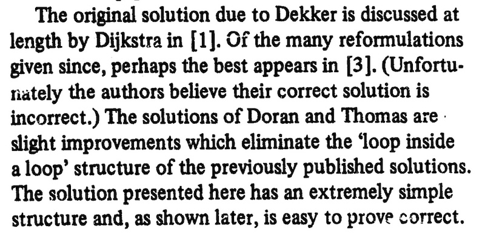
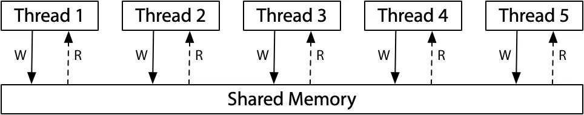
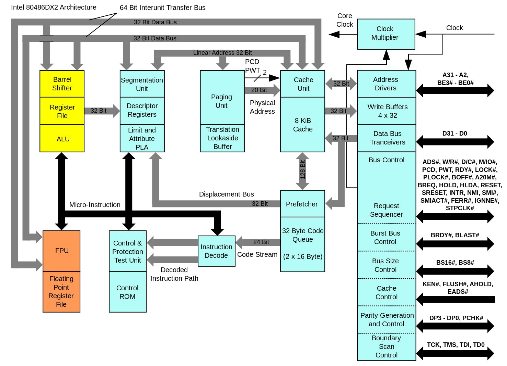

# 并发控制：互斥

# Review & Comments

## 多处理器编程：从入门到放弃

  - thread.h: spawn(fn), join()
  - 1 + 1 也不会求了，1, 2, 3 也不会数了 😂

## 为什么在《操作系统》课讲并发？

  - UNIX 的 fork-execve 模型，进程是**不共享内存**的
      - 但是系统调用是**共享内存**的
          - syscall 指令会跳转到操作系统代码执行
          - 操作系统是 “同一个 C 程序” (共享内存)
  - 每个进程的系统调用部分就成了多个**线程**
      - P1: read(fd, buf, size);
      - P2: write(fd, buf, size);
          - 它们可以访问**同一个文件**
      - 操作系统是第一个真正 “严肃” 的大型并发程序

## 1\. 互斥：概念与 API

# 上节课没解决的问题：1 + 1

## 我们希望引入一个语言机制/API

  - 无论怎么执行，sum 的求和都是正确的
  - 互斥 (互相排斥)：**阻止一些代码的并发/并行执行**
      - 至少我们就能解决 1 + 1 了

    long sum = 0;

    void T_sum() {
        make_it_work {
            sum++;
        }
    }

  - 祝贺，你发明了 “Transactional Memory”
      - Intel TSX: xbegin, xend (这又是一条可以和所有指令行为产生关联的指令 😂)

# 在操作系统内核实现互斥

## 单处理器系统：简单粗暴，一条指令 make it work

    disable_interrupt();
    sum++;
    enable_interrupt();

  - 关闭中断处理使当前代码无法被中断
      - 如果是 while (1)，就真的死机了
      - 让 AI 写一个 “关闭中断死循环” 的程序，看看会发生什么？
  - 多处理器系统：就算同时关掉所有处理器的中断也没能实现保护

# [尝试关闭中断](/OS/demos/concurrency/cli)

在单处理器系统中，关闭中断即可实现 “stop the world” 的效果，消除并发/并行的可能性。我们尝试在进程中也调用关闭中断的指令。

# 互斥：API

## 所有被 lock 标记的代码块都 “mutually exclusive”

  - 因此也叫 “mutex lock”

    lock();
    // 任意代码，例如 sum++;
    unlock();

## 拟人视角 (1)：宿舍厕所的包厢

  - lock: 锁住别人就进不来了 (但我可以继续)
  - unlock: 解锁别人才可以进来

## 拟人视角 (2)：桌上有一把 🔑

  - lock (acquire): 有 🔑，就拿走继续；没有 🔑，需要等待
  - unlock (release): 把 🔑 放回桌上

# 互斥：API (cont’d)

## 没有人阻止我们创建多个桌子 (多把钥匙)

    mutex_t lock_a = MUTEX_INIT();
    mutex_t lock_b = MUTEX_INIT();

    mutex_lock(&lock_a);
    x++;
    mutex_unlock(&lock_a);

    mutex_lock(&lock_b);
    y++;
    mutex_unlock(&lock_b);

  - 终于可以实现 1 + 1 了 (例子)

# [使用 mutex API 实现互斥](/OS/demos/concurrency/sum-mutexapi)

我们的线程库提供了 mutex\_lock, mutex\_unlock 的 API 实现互斥。

## 2\. 使用互斥锁

# 互斥锁的使用方法

## 假设正确使用锁 (其他线程的读写和 mutex 内的读写互不干扰)

  - 程序行为就和 lock(); unlock(); 完全等价
  - 甚至和 stop\_the\_world(); 完全等价

# 你高兴得太早了

## 从设计出这个 API 开始……

  - 人类就走上万劫不复的错误道路了
  - 因为 lock 和 unlock 都是**程序员负责的**
      - **写代码的时候就必须清楚地知道什么时间会和谁共享数据**

## 例子：链表

    struct node {
        lock_t lock;
        struct node *prev, *next;
    };

  - 遍历需要先锁 next，再解锁 current
  - 插入、删除需要拿到 prev, current, next 三把锁
  - 删除后的内存回收 (必须由获得最有一个引用的线程回收)……
      - 实验会教你的！

# 你高兴得太早了 (cont’d)

## 看出错误了吗？

    T_1: lock(&l); sum++; unlock(&l);
    T_2: lock(&I); sum++; unlock(&I);

  - 不要笑，🤡 就是你自己
  - 你以为不会犯这种错误？现实比你想象得复杂！
      - 几十把锁、十几个文件
      - 没有人能确信自己能记得

## 《操作系统》课的建议

  - 从**一把大锁保平安**开始
      - 做好充足的压力测试
  - Premature optimization is the root of all evil

# FAQ: 都不并发了，我们还要线程吗？

## 悲观的 Amdahl’s Law

  - 如果你有 1/k 的代码是不能并行的，那么

T\_∞ \> T\_1 / k

## 乐观的 Gustafson’s Law (的更细致版本)

  - 能并行的并行计算总是能实现的

T\_p \< T\_∞ + T\_1 / p

  - (T\_n 代表 n 个处理器的运行时间)

# FAQ: 都不并发了，我们还要线程吗？ (cont’d)

## 经典物理：局部性原理

  - **物体对相邻物体的影响需要时间**
      - (即便[严格来说不成立](https://plato.stanford.edu/entries/bell-theorem/)，依然是一个很好的近似)
  - 推论：任何物理世界模拟皆可以大规模并行

T\_∞ \<\< T\_1

## Embarrassingly Parallel 的例子

  - 图书馆 v.s. 分布式数据存储
  - 大脑 v.s. 深度神经网络
  - NP-Hard 问题的搜索 (还记得 fork-based DFS 吗)

## 3\. 在操作系统上实现互斥

### 3.1. 不正确的尝试 (方向)

# Dekker’s Algorithm (1965)

> [绕口令](https://series1.github.io/blog/dekkers-algorithm/)：A process P can enter the critical section if the other does not want to enter, otherwise it may enter only if it is its turn.

  - “[Myths about the mutual exclusion problem](https://zoo.cs.yale.edu/classes/cs323/doc/Peterson.pdf)” (IPL, 1981)

# Peterson’s Algorithm (1981)

> 还是绕口令：A process P can enter the critical section if the other does not want to enter, or it has indicated its desire to enter and has given the other process the turn.

## 并发的危险

  - 你很难从字面上判断它到底对不对
      - n 个线程循环 m 次，sum 的最小值为 1
      - n 个线程循环 m 次，sum 的最小值为 2
      - n 个线程循环 m 次，sum 的最小值为 3
          - 这是一个 NP-Complete (甚至更难) 的问题

# 回到我们 “拟人” 的视角理解并发

## 熟悉的仙林校区宿舍厕所……

  - 厕所当然需要**互斥使用**
  - (这厕所也太干净了吧……)

# Peterson’s Protocol

> 有三个变量：你的手、他的手、厕所门。

## 如果希望进入厕所，按顺序执行以下操作：

1.  举起自己的旗子 (store 手)
2.  把写有对方名字的字条贴在厕所门上 (store 门)

## 然后进入持续的观察模式：

1.  观察对方是否举旗 (load 手)
2.  观察厕所门上的名字 (load 门)
3.  **对方不举旗或名字是自己，进入厕所，否则继续观察**

## 出厕所后，放下自己的旗子 (不用管门上的字条)

# 直观解释

## 进入厕所的情况

  - 如果只有一个人举旗，他就可以直接进入
  - 如果两个人同时举旗，由厕所门上的标签决定谁进
      - 看似 “谦让”，实则手快有 (被另一个人的标签覆盖)、手慢无

## 一些更细节情况

  - A 看到 B 没有举旗
      - B 一定不在厕所
      - B 可能想进但还没来得及把 “A 正在使用” 贴在门上
  - A 看到 B 举旗子
      - A 一定已经把旗子举起来了 (*\!@^\#*&\!%^(&^\!@%\#

# 如何理解 Peterson 算法？

## 在 AI 时代，找一个 proof/disproof 是**不难**的

  - Prove by brute force
      - Peterson 算法的状态空间是**有限**的
          - (x, y, turn, PC1, PC2)
      - 我们完全可以在黑板上模拟它的执行 (曾经我真的是这么干的)
      - 黑板上可以做，计算机也能做 (2007 Turing Award)
  - Prove by induction (适用于无限的状态空间)
      - 其实和 brute force 是一样的，只不过把状态空间做了**划分**

## “电脑”：scalable 的智能

  - 先贴标签再举旗，还对吗？
  - 如果放下旗子之后 (前) 把门上的字条撕掉，还对吗？
  - 观察举旗和名字的顺序交换，还对吗？
  - 是否存在“两个人谁都无法进入厕所”、“对某一方不公平”等行为？

# [操作系统模型和检查器](/OS/demos/mosaic)

我们可以把 “状态机的管理者” 这个思想在 Python 世界中构造出来：我们用 Python 的函数来声明状态机，并且实现状态空间的遍历。所有的实现都是 “最简” 的——但它真的能用来澄清 Three Easy Pieces 里的概念：Concurrency, Virtualization, 和 Persistence。

# Computer Science 的 “叛逆” 本质

## 每个班上都有一个老师总是夸夸，你曾经暗恋的 Ta

  - Ta：认认真真完成老师作业
      - 工整的笔记，启发了思维，浪费了生命
  - 我：烦死了！原神启动！
      - **战略**：提出好的问题、适当地分解问题
      - **战术**：执行过程中使用先进工具替代机械思考
          - 状态空间搜索 + AI 启发式剪枝 (AlphaX)

#### 3.1.1. Peterson 算法的实现

# 回到刚才的 “模型”

## 模型 ≠ 现实：我们做了简化的假设

1.  Load/store 指令是瞬间完成且生效的 ❌
2.  指令按照程序书写顺序执行 ❌
      - (不怪他们，那时候还没有高性能编译器和多核计算机)

## 所以……直接写那么一个 Peterson 算法应该是错的？

  - 我们当然能写个程序试试！

# 实现正确的 Peterson 算法

## Compiler barrier (编译优化屏障)

  - asm volatile(“”: : :”memory”); 或是 volatile 变量

## Memory barrier (内存屏障)

  - \_\_sync\_synchronize() = Compiler Barrier +
      - x86: mfence
      - ARM: dmb ish
      - RISC-V: fence rw, rw
  - 能够实现**单次** load/store 的原子性

# [Peterson 算法](/OS/demos/concurrency/peterson)

在宽松内存模型上，Peterson 算法既低效又很难实现。直接用 load/store 实现互斥并不是正确的努力方向。

# 而且……上厕所的问题并没有解决……

## 智力体操不是我们想要的

  - 我们需要 “absolutely correct” 的工程化方案

### 3.2. 硬件和操作系统来帮忙

# Peterson 算法的路线错误

## 试图在 load/store 上实现互斥

  - 计算机系统是我们造的
      - 我们当然也可以**把它改成容易实现互斥的样子**
      - 这是 Computer Science 和自然科学的一个很大不同
          - 相当多的游戏规则是我们定的

## 软件不好解决的，硬件帮忙

  - 允许我们添加一些**指令** (不太过复杂就行)
      - 就像操作系统可以直接关闭中断
      - 但实现线程互斥需要怎样的指令？

# 实现线程互斥：分析

## 思路

  - 从不正确的代码开始，把我们 “想做到” 的事用指令去做
  - 错误原因：if 条件在执行 can\_go = ❌ 时已经不成立了
      - 和 Alipay 的例子是一样的

    void lock() {
    retry:
        if (can_go == ✅) {
            can_go = ❌;  // then function returns
        } else {
            goto retry;
        }
    }

    void unlock() {
        can_go = ✅;
    }

# 硬件：只要提供一小段时间的 stop-the-world 就可以

## ἄτομος (atomos)：“indivisible” 的原子指令

  - 一个 “不被打断” 的 load + 计算 + store
      - x86: Bus Lock (locked instruction)
      - RISC-V: LR/SC & A 扩展
          - 来自 MIPS: Load-Linked/Store-Conditional (LL/SC)
      - arm: ldxr/stxr, stadd (store add) 指令

    if (can_go == ✅) {
        can_go = ❌;  // then function returns
    }

    // movl $✅, %eax
    // movl $❌, %edx
    // lock cmpxchgl %edx, (can_go)

# 终于可以实现 1 + 1 了 😂

  - 甚至我们也可以用一条 lock addq $1, (sum) 来实现 + 1

# [使用硬件原子指令实现互斥](/OS/demos/concurrency/sum-spinlock)

我们的线程库也提供了 spin\_lock, spin\_unlock 的 API 实现互斥，直接用 inline assembly 调用指令集实现——在实际上，GCC 提供了 \_\_atomic\_compare\_exchange\_n 的 built-in 帮助我们实现跨体系结构的可移植性：例如，armv8.1 加入了新的原子指令，使用正确的编译选项可以获得最佳的性能。

# 自旋锁：严重的性能问题

## 性能问题 (1)

  - 除了获得锁的线程，其他处理器上的线程都在**空转**
      - “一核有难，八核围观”
      - 如果代码执行很久，不如把处理器让给其他线程

## 性能问题 (2)

  - **应用程序不能关中断……**
      - 持有自旋锁的线程被切换
      - 导致 100% 的资源浪费
  - 如果应用程序能 “告诉” 操作系统就好了
      - 如何 “告诉” 操作系统？
      - syscall\!

# 线程自己解决不了，就让操作系统来帮忙

## 把锁的实现放到操作系统里就好啦

  - syscall(SYSCALL\_acquire, \&lk);
      - 试图获得 lk，但如果失败，就切换到其他线程
  - syscall(SYSCALL\_release, \&lk);
      - 释放 lk，如果有等待锁的线程就唤醒
  - 剩下的复杂工作都交给内核
      - 关中断 + 自旋
          - **自旋锁只用来保护操作系统中非常短的代码块**
      - 成功获得锁 → 返回
      - 获得失败 → 设置线程为“不可执行”并切换

## 实际上由一个系统调用实现

  - man 7 futex | claude Explain
      - Fast (user-space only) & Slow (kernel) Path
      - [LWN: A futex overview and update](https://lwn.net/Articles/360699/)
      - [Futexes are tricky](https://cis.temple.edu/~giorgio/cis307/readings/futex.pdf) by Ulrich Drepper

# 定量研究方法

## 到底有没有提升性能？

  - 我们可以做一个不太严格的**控制变量**的对比实验！
      - 确定总的 sum++ 次数不变
      - 分布在 T = 1, 2, 4, 8, 16 个线程
      - 实验重复 5 次，统计一次 sum++ 的平均时间
  - AI 太擅长做这件事了 (值得一个 skill)
      - 原始数据的列表 (csv)
      - Jupyter Notebook 里生成的 plot (带 error bar)

## A final comment

  - [Systems Benchmarking Crimes](https://gernot-heiser.org/benchmarking-crimes.html)

# [使用不同方式求和](/OS/demos/concurrency/sum-experiment)

我们对比使用自旋锁 (手工实现)、互斥锁和原子指令在求和上的性能，做一个基础的控制变量的对比实验：确定总的 sum++ 次数不变，分布在 T = 1, 2, 4, 8, 16 个线程，分别为三种实现实验重复 5 次，统计一次 sum++ 的平均时间。保存原始数据的列表 (csv)，并且在 Jupyter Notebook 里生成带 error bar 的 plot。

# Takeaways

并发编程 “很难”，而类应对这种复杂性的方法就是退回到不并发。我们可以在线程中使用 lock/unlock 实现互斥——所有被同一把锁保护的代码，都失去了并发的机会 (虽然先后依然是不受控制的)。当然，互斥的实现是相当有挑战性的，现代系统中的互斥设计线程中的原子操作、内核中的中断管理、原子操作和自旋等机制。值得注意的是，而只要程序中 “能并行” 的部分足够多，串行化一小部分也并不会对性能带来致命的影响。

# 阅读材料

教科书 Operating Systems: Three Easy Pieces:

  - 第 29 章 - Locked Data Structures
