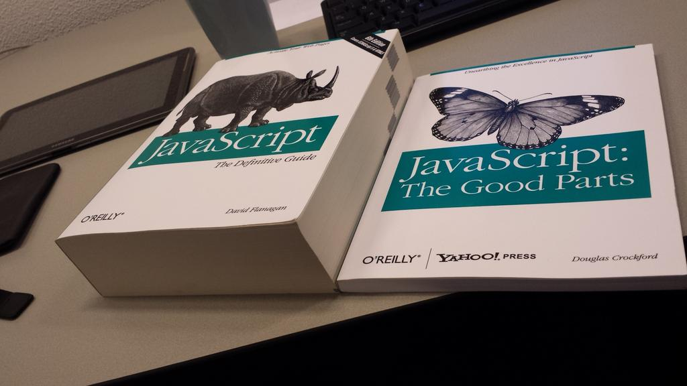

# 异步编程模型

# Review & Comments

## 计算图

  - 理解并行计算的关键
  - (这是一个非常核心的概念)

## 并行算法

  - 大规模数值计算问题
  - Mandelbrot set 那样的 “embarrassingly parallel”
  - ……

## 并行数据结构

  - 数据结构通常具有访问局部性
  - 尽可能把计算留在线程本地 (thread-local)

# 例子：实现 malloc/free

> Premature optimization is the root of all evil.
>
> ——D. E. Knuth

## 重要的事情说三遍：

  - **脱离 workload 做优化就是耍流氓**
      - 在实际系统中，我们通常不考虑 adversarial worst case (和算法题不同)，而是要在真实的分布下 “表现好” (但也有了 Denial of Service 的机会)
      - 在开始考虑性能之前，理解你需要考虑什么样的性能

## malloc() 的观察

  - **大对象分配后，读写数量应当远大于它的大小**
      - 否则就是 performance bug
      - 申请 16MB 内存，扫了一遍就释放了😂

# 实现 malloc/free: 观察

## 推论：越小的对象创建/分配越频繁

  - 小对象：字符串、临时对象等；生存周期可长可短
  - 中对象：容器、复杂的对象；更长的生存周期
  - 大对象：巨大的容器、分配器；很长的生存周期

## 通过实验：几乎只要管好小对象就好了

  - 小对象分配/回收的 **scalability** 是主要瓶颈
      - 和 `sum++` 一样，小对象的分配尽可能在本地完成
  - (glibc 直接用 mmap 分配大对象)

# 区分 Fast/Slow Paths

## 分配: Segregated Lists (Slab)

  - 每个 slab 里的每个对象都**一样大**
      - 每个线程本地都持有一些 slabs
      - Fast path → 立即在线程本地分配完成
          - 类比 sloppy counter，我们甚至没有全局的读者
      - Slow path → mmap()

## 回收: O(1)

# 年轻的你们对现实的恐怖一无所知

## 早在 1995 年：[这才叫 research](http://jyywiki.cn/OS/manuals/malloc-survey.pdf)

  - Segregated free lists 在 1964 年就提出了
  - 停止无意义的 “科研实践”，去做真正有价值的事情

> Understanding real program behavior still remains the most important first step in formulating a theory of memory management. Without doing that, we cannot hope to develop the science of memory management; we can only fumble around doing ad hoc engineering, in the too-often-used pejorative sense of the word. At this point, the needs of good science and of good engineering in this area are the same—a deeper qualitative understanding. We must try to discern what is relevant and characterize it; this is necessary before formal techniques can be applied usefully.

## 1\. 线程的代价

# 线程的代价

## 线程是需要占用资源的

  - 首先，需要内存 (线程栈、操作系统里的各种数据结构……)
      - /proc/\[pid\]/ 下的文件都是操作系统内数据结构的投射
  - 还有一些分配的 “资源”，例如 pid (用完就要循环)
      - 线程的切换需要进入操作系统内核代码 → 这都是开销

## Linux 下的一个线程到底要占用多少资源？

  - 上了那么多年，我甚至都没有提过这个问题
  - 但既然提了，就让 AI 给个答案吧
      - 找到一个可以计数的 “资源” 集合
      - 重复实验：创建足够多线程，统计资源的变化

# [线程的代价](/OS/demos/concurrency/thread-cost)

我们可以通过创建线程、统计系统的资源变化，来估算创建线程所占用的资源。

# 我们想要 “随时随地” 的并行计算

## 然而，启动线程的代价远大于函数调用

  - Approach I: 轻量化线程
      - 让 spawn 和 join 的代价接近函数调用
      - Coroutine, goroutine, …

    t1 = spawn(f); t2 = spawn(g); t3 = spawn(h);
    join(t1); join(t2); join(t3);

  - Approach II: 异步编程
      - 改变程序的执行模型，允许描述并行/并发的计算图
      - Promise/Future, async/await, …

    j1 = enqueue_job(f); j2 = enqueue_job(g); j3 = enqueue_job(h);
    wait_job_complete(j1); wait_job_complete(j2); wait_job_complete(j3);

## 2\. 方案一：线程的轻量化

# 在用户空间实现 “线程”

## 放弃中断驱动的上下文切换

  - 依然保持 spawn, join
  - 但只在 yield 的时候切换到其他线程
      - 多线程 SimpleC 的 “直接实现”
      - 甚至只要编译器能封存函数运行时状态就行 (类似闭包)
          - Python generator, C++20 coroutine
          - (但这使 nested yield 实现变得很麻烦)

## 就像一个小 “操作系统” 模拟器

    threads = [T_worker(i) for i in range(1000000)]
    while True:
        random.choice(threads).send(None)

  - 但有一个致命的缺点：长时间等待的系统调用无法并行
      - sleep, read, … 都会阻塞所有线程
      - 我们有办法让轻量级线程真正并行起来吗？

# [轻量级线程的实现](/OS/demos/concurrency/coroutine)

我们可以不在操作系统中分配额外的资源，而是仅用进程自身的地址空间和指令集实现多个执行流的切换。既可以在编程语言的帮助下实现无栈的轻量级线程，也可以实现栈切换。

# 协程：缺陷与解决方法

## 一个协程等待，1,000,000 个都等待

  - 操作系统里只有一个执行流
  - mutex\_lock + yield = AA 型死锁

## 解决方法：异步 I/O

  - man 2 open: `O_NONBLOCK` “非阻塞”
      - 系统调用不与 I/O 操作完成同步
      - `read` 可能返回 nread 或者 EAGAIN → 这时候就可以 yield 了！
  - 一些额外的 APIs
      - man -P cat 7 epoll | claude -p Explain
      - 还有 eventfd, timerfd, io\_uring, …
          - 设计成 fd 就可以被 epoll 监听了！
          - 主循环 epoll，创建协程工作，eventfd 同步
  - **站在操作系统设计者的视角，设计就显得很自然了**

# 一个 Programming-Language Trick

## 如果允许我设计自己的编程语言

  - 程序员脑子里就是线程和 blocking 的 I/O 最舒服

    sleep(1);  // wait_until(T >= cur + 1s);
    read(fd, buf, size);  // wait_until(fd has data);

  - 让编译器帮我 hack 一下

    put_my_self_into_sleep(1); yield();
    while (read_async(fd, buf, size) == -EAGAIN) {
        yield();
    }

## 恭喜你，你发明了 goroutine！

  - 每个 CPU 上有一个 Go Worker Thread (协程调度器)
  - 像线程一样使用，像协程一样轻量

# Go 语言中的同步与通信

> Do not communicate by sharing memory; instead, share memory by communicating. ——*Effective Go*

## 共享内存 = 万恶之源

  - 信号量/条件变量：实现了同步，但没有实现 “通信”
      - 数据传递完全靠手工 (没上锁就错了)

## 但 UNIX 时代就有一个非常棒的并发编程机制了

  - `(cat *.txt; cat *.cpp) | wc -l`
      - 这不就是计算图、生产者/消费者同步吗？
      - 为什么不用 “管道” (Channels in Go) 实现线程间的同步 + 通信呢？

## Golang 真正继承了 UNIX Philosophy

  - 因为它的发明人是 Rob Pike, Ken Thompson, Russ Cox 😊

# [Mandelbrot-Go](/OS/demos/concurrency/mandelbrot-go)

多个 goroutine 按行分块并行计算 Mandelbrot 集，通过 channel (`done`) 汇报完成，monitor 用 `select` 同时监听完成信号和定时器实现实时预览，最终由 `finish` channel 通知主线程退出。

## 3\. 方案二：描述计算图

# 另一条平行的世界线

## 1995 年 Brendan Eich 加入了 Netscape

  - 委以重任设计未来的网页脚本语言
      - 他的主要兴趣是**函数式编程** (应该感谢这个机缘巧合 😊)
  - 花了 10 天，糅合了 C, Java, Scheme, Self
      - 人类命运的齿轮开始转动

# 另一条平行的世界线 (cont’d)

## 这是一个怎样的语言呢……

  - `this` 不是 C++/Python/Java 的那个 “this”——是在调用时动态绑定的
  - 无数意外脱离对象调用时的 `undefined`

# 互联网时代的序幕：Web 1.0

## 从 PC 时代到互联网时代 (1990s)

  - Amazon (1994), Yahoo (1994), eBay (1995), Google (1998)
  - [HTTP](https://developer.mozilla.org/en-US/docs/Web/HTTP/Guides/Evolution_of_HTTP), HTML，甚至没有 CSS
      - 比大家想象得简单 (curl -i); 以及我们有一个实验
      - 中国互联网初代 “三巨头”：新浪、搜狐、网易诞生
      - ``, `<table>` 和切图工程师一统天下

# [Web 和事件编程](/OS/demos/concurrency/web)

这里展示了如何从 `shopper.html` 充满了 `setInterval`、DOM 操作和事件驱动的动画，到 `modernize.js` 将其瞬间改造为今天的页面风格。

# 从 Web 1.0 到 Web 2.0

## Asynchronous JavaScript and XML (XMLHttpRequest; \~1999)

  - (你没看错，竟然不是 JSON)
      - 原因：当时的后端 (Java) 应用广泛使用 XML
  - 网页终于可以实现 “后台刷新”
      - 随时请求后端，更新 DOMTree: MVC 分离架构
      - 任何 “应用” 可以做的，网页也都可以做了！

## jQuery $ (2006): A DOM Query Language (编程抽象)

    $(document).ready(function(){ /* code */ });
    $("#myElement").text("新内容").css("color", "red");

  - 现代浏览器：$ 就是 `document.querySelector`

# 从此，做 “任何事” 都只要浏览器就行

## 甚至诞生了 ChromeOS

  - HTML + CSS 构建应用的方便程度超过传统 GUI 编程
  - GTK, Qt, MFC 谁用谁知道 😂
      - ChromeOS/Chromebook 没能成功
      - 微信小程序继承了 ChromeOS 的遗志 😂

# JavaScript 并发编程

## 线程？协程？

  - 零门槛的编程语言，让大家并发编程？
      - Data race, atomicity violation, … 分分钟教你做人
  - 我们需要一个更简单的**描述计算图**的模型

## Event-based concurrency in JavaScript

  - **禁止任何计算节点并行**
  - **没有任何 Blocking I/O**
      - 按顺序执行所有 event handlers; run to completion
      - 网络请求、sleep 都在队列里插入一个新的事件 (计算图中的节点)

# 事件编程、计算图与回调

## 异步回调 (callback)

  - 在事件完成后排队调用 (success, error)
  - 创建了计算图中的**动态节点**

    $.ajax({
        url: '/api/user',
        success: function(user) {
            $.ajax({
                url: `/api/user/${user.id}/friends`,
                success: function(friends) {
                    $.ajax({url: `/api/friend/${friends[0].id}`, ...});
                },
                error: function(err) { ... }
            });
        }, ...
    });

## “Callback hell (回调地狱)”

  - A → B → C 的顺序逻辑硬生生被拆分成了几个部分，极容易写出屎山代码

# 回归 “描述计算图”

## Promise (“承诺”、“契约”): 生成 “未来将会完成” 的计算图节点

    useEffect(() => {
        fetch(`/api/localhost/?action=demo&path=${path}`)
            .then(response => response.json())
            .then(fetchedData => setData(fetchedData))
    }, []);

    Promise.all([
        fetch(...).then(...), fetch(...).then(...), ...
    ]).then(
        // succeeded
    ).catch(
        // error handling (catches exceptions in the fetch)
    )

  - 特别注意：`Promise.all()` 会立即返回一个新的 Promise

# Async/Await 语法糖

## Promise.then 还是没有解决顺序逻辑断裂的问题

  - 还能再简单一点吗？
  - 编译器/编程语言设计在我，有什么办不到的呢？
      - **同步的写法表达异步的流程**，剩下的让编译器去头疼吧

    async function fetchData(token) {
      const response = await fetch(
        `/api/submissions/?token={token}`
      )
      return response.json()
    }
    await Promise.all([fetchData('1234'), fetchData('5678')])

  - async function f() → function f() { return new Promise(…) }
  - await f() → return Promise.resolve(f()).then(…)

# 从前端到全栈

## ECMAScript 2015 (ES6)

  - 一统第三方库 “军阀混战” 的局面
  - 开源生态开始起飞

## 操作系统上的另一个应用生态

  - Angular, React, Vue, Bootstrap, Tailwindcss
  - Express, Next, Nest
  - Electron 和 vscode; [Ink](https://github.com/vadimdemedes/ink) 和 Claude code; React Native
  - asm.js (和之后的 [WebAssembly](https://webassembly.org/docs/faq/))
  - Mermaid, TensorFlow, Three, …

# Takeaways

从 malloc 的设计到异步编程模型，核心思想都是：理解真实 workload，再用合适的抽象（slab 分配、协程、计算图）来降低代价；当单机不够时，这个思想延伸到分布式系统，就催生了 Serverless。
