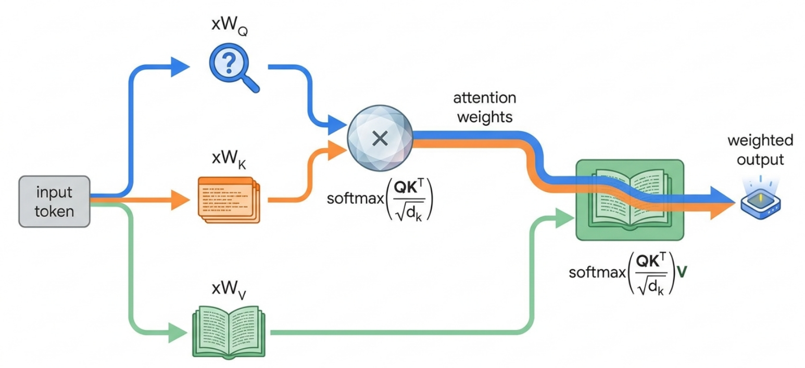

# 一个 Token 的旅程

# Review & Comments

## 回顾 “并发编程”

  - 从 `spawn(T_worker)` 和 join 开始
      - 一切的基础：**计算图模型**
      - 共享内存、互斥锁、条件变量、信号量的底层机制
  - 面向 “异构” 复杂 T\_worker 的改进
      - 关键问题：管理状态、同步、复杂性
          - Coroutine, goroutine
          - Promise, async/await
  - 面向 “同构” 小而短 T\_worker 的改进
      - 关键问题：最大化计算密度和能效比
          - SIMD (数据并行)
          - 从图形处理器到到 CUDA/SIMT

## 并发部分的最后一课

  - 让我们看看 “真实的系统” 吧！

## 1\. 用户的视角

# 让 DeepSeek 和我聊聊天

## 官方 API doc

    curl https://api.deepseek.com/chat/completions \
      -H "Content-Type: application/json" \
      -H "Authorization: Bearer ${DEEPSEEK_API_KEY}" \
      -d '{
            "model": "deepseek-v4-flash",
            "messages": [
              {"role": "user", "content": "Hooo."}
            ],
            "stream": true
          }'

  - https://jyywiki.cn/submit.sh 也有一个 curl
      - curl: command not found 会提交失败
  - 我们准备了一个 “有功能” 的 Python 版本
      - 让我们用 strace 拆开它
      - 建立连接、发送数据 (HTTP request)、等待数据

# [一个 LLM Request](/OS/demos/concurrency/llm-request)

在地球上的任何一个地方，只要能接入互联网，通过 requests 库请求 DeepSeek API endpoint，就能够直接启动和 AI 的聊天。很难想象短短数年时间，全人类都在使用的新基础设施就已经建设完毕了。

# “数据” 是如何到达另一台机器的？

## 第一步：DNS 解析 — 域名 → IP

    dig api.deepseek.com +short

  - 直接让 DeepSeek 自己瞧瞧吧
      - (DNS 就已经开始做负载均衡了)

## 第二步：packet forwarding — 逐跳到达

  - 你的机器 → 路由器 → ISP → … → 数据中心 → 服务器
  - Gateway: 默认网关，”不知道往哪走就往这扔”

    traceroute api.deepseek.com

  - 操纵 TTL 值，使路由器产生 ICMP Time Exceeded
  - 典型的延迟：局域网 \<1ms, 同城 \<5ms, 跨国 \~200ms

# 终于，我们 “到达” 数据中心的另一台机器

## 这台机器很大概率也只是一个 Load Balancer

  - 会再把请求转发到真正的业务服务器
  - 我们实际看到的 response (curl -i)

    HTTP/2 200
    server: openresty
    content-type: text/event-stream
    cache-control: no-cache
    connection: keep-alive

  - https://api.deepseek.com/chat/completions 和 https://www.deepseek.com/ 是不同的服务
      - API: `server: openresty`
      - WWW: `server: tencent-cos`

# 最终，到达实际的业务节点

## 业务节点收到来自本机的请求

  - Header 中的 DEEPSEEK\_API\_KEY
  - Body 中的 JSON (model, messages, stream, …)

## 麻烦的事情才真正开始！

  - 服务端要鉴权、计费、审计……
  - 后面还连着数据库、缓存、消息队列……
      - 我们学习的 “操作系统 API”、“并发编程”……默默支撑了这一切
      - 把做过的实验拼起来，就是一个非常完整的 Computer Systems 的图景

## 2\. 进入数据中心

# 数据中心：互联网 & AI 时代的幕后英雄

> Datacenter: “A network of computing and storage resources that enable the delivery of *shared* applications and data.” (CISCO)

## 上半场：应用后端 (199X - 至今)

  - 从静态的 http 页面 (Yahoo\!), … 到 Web 2.0 (Facebook)，再到移动互联网 (iOS, Android)
  - 在 “云端” 留有你的 personality
      - 同时，意味着我们其实没有任何隐私 😂

## 下半场：AI 推理 (2022 - 至今)

  - DeepSeekV4 Flash: 284B-A13B
  - DeepSeekV4 Pro: 1.6T-A49B
      - 这还是 per token 的计算量，不包括 attention 的成本

# 数据中心：一个产业链

## 我们在学校里学 “做题”，很少学 “题目是怎么来的”

  - 但市场的供需关系永远存在
      - 朝阳产业就需要更多的人
      - 夕阳产业就会陷入内卷
  - 技术总有一天会过时
      - 试着去获得 “推导出这些技术” 的能力，才能获得 visions

## 学校不教大家的 “世界模型”

  - 产业结构和市场环境
  - 企业的本质、供应链、运转、股权、激励机制……
      - 做题家们进入社会，还会经历一次重新学习的机会

# 数据中心中的海量分布式数据处理

## 实时的 “小数据处理” (CRUD)

  - 订单事务、内容分发、用户鉴权、弹幕、计费、视频串流……
  - DeepSeek Chat 会保存完整的聊天记录，允许继续追问

## 半离线的 “中数据处理”

  - 周期记账、备份、数据看板……

## 离线的 “大数据处理”

  - 内容索引、数据挖掘、流量分析……

## 所有应用，无一例外

  - 豆包、千问、搜索、社交、支付、游戏……

# The C10K Problem

## Dan Kegel, 1999

> It’s time for web servers to handle ten thousand clients simultaneously, don’t you think? After all, the web is a big place now.

    while (true) {
        Request *rq = get_request();
        pthread_create(&tid, NULL, handle_request, rq);
        // 如果软件写得不好，就无法支撑 C10K
    }

  - 催生了 epoll、Nginx、事件驱动架构，和之前的并发编程模型 (goroutine, etc.)
  - 再等到 C10M 的时代，就必须走向分布式系统了 (Google, 2003)

# 数据中心里的并发编程

## 高吞吐 (QPS) & 低延迟的事件处理

  - 处理事件可能需要读写持久存储或请求其他节点的服务
      - 计算机系统栈是一层一层垒起来的，到处都是坑
      - 例子：下单会关联多个子系统 (是一个计算图)
  - P99/P999 Latency (最慢的那一些也不能卡顿) 也很关键
      - 一个 fully locked hash table resize 就能出性能事故

## 假设有数千/数万个请求同时到达服务器……

  - “Denial of Service, DoS”
      - 全国的小爱音箱在小米汽车发布会上同步瘫痪

## 还必须保证 “超高可靠性”

  - 99.9999% 的可用性和绝对的数据正确性

# 分布式系统难题

## CAP Theorem

  - 数据保持一致 (Consistency)、服务时刻可用 (Availability)、容忍机器离线 (Partition tolerance) 不可兼得
      - Sloppy counter 有 “牺牲一致性换可用性” 的意味

# 例子：LLM Request

## Header 中有 DEEPSEEK\_API\_KEY

  - 需要从 key 反查到账号做鉴权、billing (类似点赞/收藏)
  - 需要做日志记录 (审计、频率控制 429 Rate Limit)

## 同一个 key 可以被多个机器使用 (真正的并行)

  - 用户还可以随时 disable API key
  - 这就立即撞到了 CAP Theorem 的墙了
      - 大家在 mymalloc 并发编程的时候已经吃够苦头了
          - 分布式的锁开销从 ns 级到 ms 级
          - 还有随时可能发生的 non-deterministic delay/crash

# 解决方法：重新设计系统接口

## UNIX 的设计: open, read, write, …

  - 对于单机应用很好，分布式应用不行

## 数据 v.s. 计算

  - UNIX: 管道流式数据处理 (**把数据带到计算**)
  - 分布式系统：必须把计算分发到机器/线程 (**把计算带到数据**)

## 容错和可靠性

  - UNIX: 假设机器和程序都是可靠的
  - 分布式系统：必须支持透明的网络延迟/容错 (重算)

## 扩展 UNIX 的设计

  - Google File System: 数据依然是文件 (byte array)
  - BigTable: 在文件的基础上构建 key-value 数据库，解决 CRUD (OLTP, Transactional)
  - MapReduce: 限制计算必须是 “能 scale out” 的形式，解决后台索引 (OLAP, Analytical)

# 如何为大规模分布式系统编程？

## 其实只要抄之前 Promise 的答案就行了

  - 足够好的存储系统 + 描述数据上的计算图 = Serverless Computing
  - Function as a Service: Write Once, Planet Scale
      - **函数的写法表达分布式的流程**，C10M 就让厂商去头疼吧
      - FaaS 允许多次重试，因此大部分功能需要 idempotence (幂等性)

    const dynamo = new AWS.DynamoDB.DocumentClient();
    exports.handler = async (event) => {
        const apiKey = event.headers['Authorization']?.replace('Bearer ', '');
        const user = await dynamo.send(new GetCommand({
            TableName: 'APIKeys', Key: { apiKey }
        })).Item;
        if (!user || user.disabled) {
            return { statusCode: 401, body: ... };
        }
        return {
            statusCode: 200,
            body: do_llm_inference(...),  // 就剩下它了
        }
    }

## 3\. 从 Token 到 Tensor

# 进入 SIMT 的世界

## `do_llm_inference()`

  - Next-token prediction
  - 本质：从一个 “学到的” 函数里采样
      - 一个非常大的计算图，但存在一个 “很短的 generator” ([gpt.c](https://git.nju.edu.cn/jyy/os2026/-/blob/M6/gpt/gpt.c?ref_type=heads))
      - Richard Sutton: [The Bitter Lesson](https://www.cs.utexas.edu/~eunsol/courses/data/bitter_lesson.pdf)

## 有各种各样的 “tensors” (参数)

# Attention is All You Need

## 每一层 Transformer (head) 都是 “一本书”

  - 每一本书都输出一个 “改写后的版本” (去掉噪声，越来越接近天书)
      - 看书 = Q: 需要补全的句子 (我在找什么)，K: 书的目录 (我有什么)，V: 书的内容 (具体的内容是什么，甚至这也是学出来的)
      - “看书” 以后生成 “短时记忆”，不需要再看 context，直接经过全连接层 “重写” 记忆

# Attention is All You Need: 实现

## 让我们看一眼 `llm.c/train_gpt2_fp32.cu`

  - `attention_forward`, `matmul_forward` 的代码，是不是和 `mandelbrot()` 很像？
  - 我们可以非常容易地用 spawn、SIMD, SIMT 等任何一种方式并行化它 (当然要获得极致的性能，这并不容易)

    void matmul_forward(float* out, ..., int B, int T, int C, int OC) {
        int sqrt_block_size = 16;

        dim3 gridDim(CEIL_DIV(B * T, 8*sqrt_block_size), CEIL_DIV(OC, 8*sqrt_block_size));
        dim3 blockDim(sqrt_block_size, sqrt_block_size);
        matmul_forward_kernel4<<<gridDim, blockDim>>>(out, inp, weight, bias, C, OC);
        cudaCheck(cudaGetLastError());
    }

  - `<<< >>>`: 发送参数到 GPU，GPU 开始执行，CPU 立即返回，GPU 内部会按顺序执行所有的 kernels

# 如果还要压榨极致的性能？

## 能不能把 SIMD 引入到 PTX 指令集里？

  - SIMT + SIMD，指令译码的开销就真的接近零了
  - 恭喜你，你发明了 [Tensore Cores](https://docs.nvidia.com/cuda/parallel-thread-execution/index.html#tensorcore-5th-generation-instructions)
      - 混合精度 FMA `D (m×n) += A (m×k) x B (k×n)`

## 不，你没有

  - SIMD 省去了 `base + row * stride + col` 的指令
  - 但难题其实是**内存移动与布局优化**
      - 多维寻址、稀疏数据搬运、跨步访问、异步同步、布局转换和内存管理
      - cp.async.bulk.tensor
          - 支持稀疏数据拷贝 (解压缩)
          - 支持 zero-overhead 转置
          - ……

# 这些就是十万亿美元产业生态的起点

## 再回顾操作系统的发展历程，历史总是**惊人地相似**

  - 底层：加速器 (GPU)、底层编程模型 (CUDA)，库函数 (cuBLAS, DeepGEMM, NCCL)
  - 中层：编译器 (FlashAttention, Triton)、训练 (Megatron)、推理 (vLLM) 框架、
  - 开发者生态：训练 (PyTorch, TensorFlow)、模型分发 (HuggingFace), …
  - 用户接口：ollama, OpenWebUI, …
  - 应用：Claude Code, OpenClaw, Manvus, NotebookLM, …
      - 你能想到的一切，都有人做 (所以在 “做题” 之余，也可以想一想 big picture)

# 生成一个 Token

## 如果推理集群运行的都是 GPT2-XL (1.5B), 1k context

  - 问题就几乎解决了 (类似于 http 请求最终到达业务节点，直接创建一个 goroutine 执行就行)
  - 但是对于 1.6T, 1M context 的模型来说，绝对是极为困难的
      - O(n²) 的 full attention → sparsify, low-rank, …
      - ChatGPT 爆火以后，NVDA 的起飞绝对是可以预见的

## 生成一个 token 要做两件事

  - Prefill: 算出每一层所有的 attention “书库” (K 和 V)
      - 保存到 KV Cache
  - Decode: 生成输出 token
      - 读取完整 KV Cache
      - 取出 K/V → 根据当前 Q 计算 “短时记忆” → 生成下一个 token → 更新 KV Cache

## MLSyser: “你们在体系结构、操作系统课上学的概念全都过时了”

  - 存储、互联、带宽、延迟……都和经典教科书完全不一样
  - 只有分析问题的 first principles 是有用的

# 旅程的终点

## 终于，生成的 token 回来了

  - 在推理集群内经历了 TP (Tensor Parallelism)、PP (Pipeline Parallelism)、EP (Expert Parallelism), … 返回**一个整数**
  - 后端代码再次开始执行
      - 审计 (模型经常生成到一半闭嘴)、记账 (通常是 append 到一个 log，然后 log 延迟更新到 dashboard)……最终生成一个 http event-stream response (jsonl)，原路返回

    HTTP/1.1 200 Connection established

    HTTP/2 200
    content-type: text/event-stream; charset=utf-8 ...

    data: {"id":"8fd70919-7f53-4a75-a959-bb6851d542dc","object":"chat.completion.chunk","created":1778726742,"model":"deepseek-v4-flash","system_fingerprint":"fp_8b330d02d0_prod0820_fp8_kvcache_20260402","choices":[{"index":0,"delta":{"role":"assistant","content":null,"reasoning_content":""},"logprobs":null,"finish_reason":null}]}

# 旅程：没有终点

## 也许全世界都做错了呢？

  - Scaling Law: Transformers 比 LSTM 在长上下文下表现更好
      - 但 “最好” 的那个在哪里，人类也许还不知道
  - 希望大家不要 “错上加错”：**无意义的学术裁缝是有害的**
      - 象牙塔里的老登们在权利寻租，年轻人被服从性测试疯狂折磨 (参与答辩与评教有感)

# Takeaways

一个 Token 的旅程，穿越了整个计算机系统栈：从浏览器的 HTTP 请求，到数据中心的负载均衡、API 网关、分布式存储，最终到达 GPU 上的矩阵乘法。课堂的意义从来不是教会大家具体的技术，而是在理解这些技术的过程中领悟属于自己的 “还原方法论”，从而去面对未知的新挑战。
