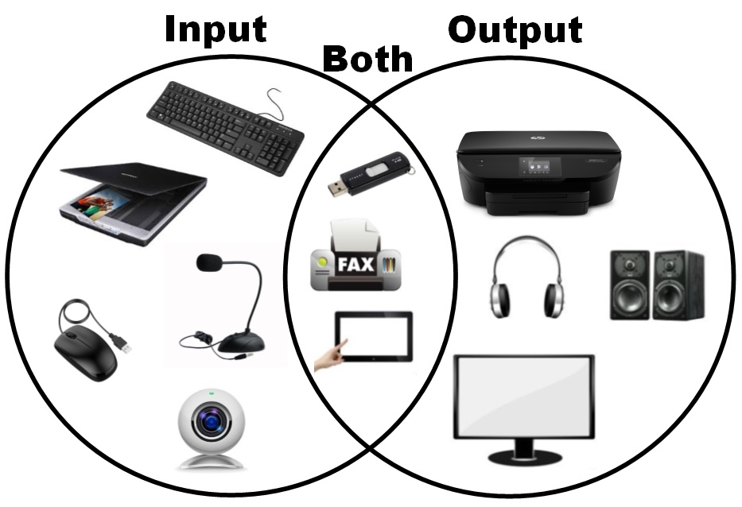
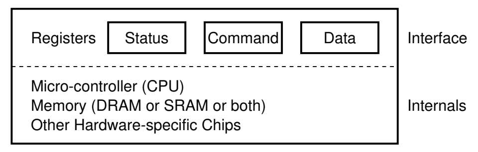
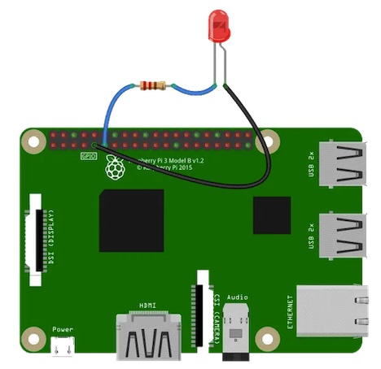
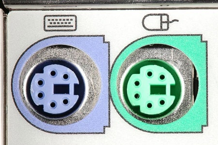
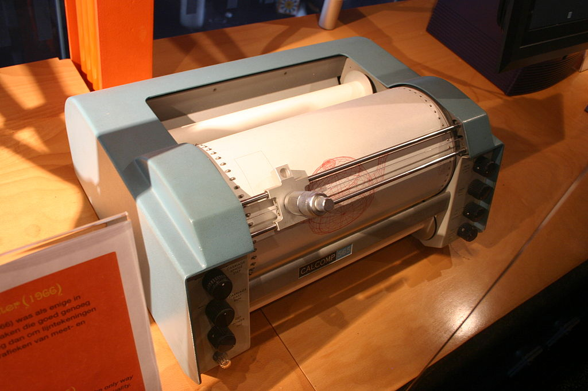
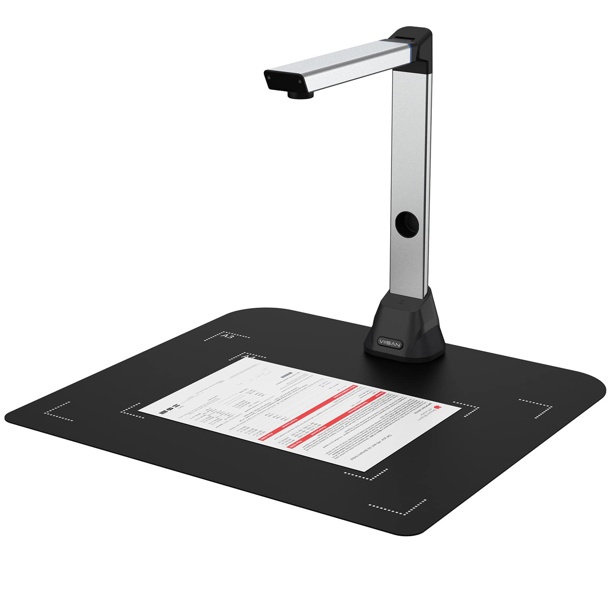

# 输入/输出设备原理

# Review & Comments

## Virtualization & Concurrency: 总结

  - 进程和系统调用上的应用世界 (经典 UNIX)
  - `spawn(T_worker)` 打开了魔鬼的盒子 (并行计算、异步编程、异构计算)

## 操作系统中的对象

  - 文件描述符：**指向操作系统对象的 “指针”**
      - Everything is a file
      - 通过指针可以访问 “一切”
  - 我们直接使用了操作系统对象 (tty, disk, …)
      - 今天开始正式展开

## 1\. I/O 设备

# 今天的主角：输入输出设备

## 这是你实际上 “看到” 的计算机

  - 我们花了大量时间讲解的 CPU、内存、……都是 “看不见” 的

# I/O 设备：“计算” 和 “物理世界” 之间的桥梁

## I/O 设备 = 一个能与 CPU 交换数据的接口/控制器

  - 使计算机能**感知外部状态** (眼睛、耳朵)、**对外实施动作** (手)
  - 就是 “几组约定好功能的线” (寄存器)
      - 通过握手信号从线上读出/写入数据
  - 给寄存器 “赋予” 一个内存地址 (Address Decoder)
      - CPU 可以直接使用指令 (in/out/MMIO) 和设备交换数据 (是的，就这么简单)
      - 也可以向计算机发送中断 (这部分实现在操作系统内部)

### 1.1. 一些简单的设备

# 实现核弹发射：只需要 “一根线” I/O 设备

## GPIO (General Purpose Input/Output)

  - 极简的模型：Memory-mapped I/O 直接读取/写入电平信号 (Logic 1 = 3.3V)
  - 我们甚至可以直接控制 Raspberry Pi 上的灯！

# [GPIO LED](/OS/demos/persistence/gpio-led)

计算机上的任何 I/O 设备都是可以通过程序控制的——只是通常并不推荐这么做：我们有丰富的应用程序抽象可以帮助我们更好地完成设备的交互。

# 串口 (UART)

## “COM1” (Communication 1)

  - Universal Asynchronous Receiver/Transmitter
  - `/dev/ttyS0` 映射到了 UART (可以接真正的终端使用)

    #define COM1 0x3f8
    static int uart_init() {
      outb(COM1 + 2, 0);   // 控制器相关细节
      outb(COM1 + 3, 0x80);
      outb(COM1 + 0, 115200 / 9600);
      ...
    }
    static void uart_tx(AM_UART_TX_T *send) {
      outb(COM1, send->data); // 写寄存器
    }
    static void uart_rx(AM_UART_RX_T *recv) {
      recv->data = (inb(COM1 + 5) & 0x1) ? inb(COM1) : -1;  // 读寄存器
    }

# 键盘控制器

## IBM PC/AT 8042 PS/2 (Keyboard) Controller

  - 6 根线：Data, Clock, VCC, GND, 两个预留
  - 映射到 Port 0x60 (data), 0x64 (status/command)
      - command = 0xED → LED 灯控
      - command = 0xF3 → 设置重复速度和重复延迟

# 磁盘控制器

## ATA (Advanced Technology Attachment)

  - IDE 接口磁盘 (40pin data 很 “肥” 的数据线 + 4pin 电源)
      - primary: 0x1f0 - 0x1f7; secondary: 0x170 - 0x177

    void readsect(void *dst, int sect) {
      waitdisk();
      out_byte(0x1f2, 1);          // sector count (1)
      out_byte(0x1f3, sect);       // sector
      out_byte(0x1f4, sect >> 8);  // cylinder (low)
      out_byte(0x1f5, sect >> 16); // cylinder (high)
      out_byte(0x1f6, (sect >> 24) | 0xe0); // drive
      out_byte(0x1f7, 0x20);       // command (read)
      waitdisk();
      for (int i = 0; i < SECTSIZE / 4; i ++)
        ((uint32_t *)dst)[i] = in_long(0x1f0); // data
    }

### 1.2. 更有趣的设备

# 打印机

## [任何能 input/output 的东西](https://jyywiki.cn/OS/manuals/CalComp-Software-Reference.pdf)，都可以是 Canonical Device

  - 打印机：将字节流描述的文字/图形打印到纸张上

# PostScript 和打印机

## PostScript: 一种描述页面布局的 DSL

  - 类似于汇编语言 (由 “编译器”，如 latex，生成)
      - PDF 是 PostScript 的 “改进版”
      - “图形状态机”：路径构造、路径着色、文本渲染、外部对象

## 打印机 = “汇编语言解释器”

  - PCL, PostScript, [IPP](https://www.rfc-editor.org/rfc/rfc8011) (AirPrint) → 打印机机械动作
      - 历史悠久的 lp/lpr (Line Printer Daemon)

    <ESC>*t300R          // PCL: Set resolution to 300 DPI
    <ESC>*r1A            // Start raster graphics
    <ESC>*b100W          // Set width of raster data (100 bytes)
    <ESC>*b0M            // Set compression mode (0 = uncompressed)
    <ESC>*b100V          // Send 100 bytes of raster data
    <binary raster data> // Actual image data
    <ESC>*rB             // End raster graphics

# [PostScript](/OS/demos/persistence/postscript)

PostScript是一种页面描述语言 (PDL)，由 Adobe Systems 在 1980 年代初开发。它是一种编程语言，专门用于描述图形和文本的布局和外观，主要用于打印和显示系统。PostScript 文件包含了详细的指令，告诉打印机或显示设备如何生成页面上的每一个元素，包括字体、图形、颜色和图像。

# 摄像头 (WebCam)

## 你买到的所有摄像头都是 “免驱” 的

  - 要感谢 UVC (USB Video Class)
  - 一个标准化的协议：枚举设备 → 协商格式/分辨率/帧率 → 传输开始 → 逐帧读取 MJPEG/H.264
      - 仍然是交换字节流 (canonical device model)
      - 诞生了大量衍生产品：行车记录仪、显微镜、内窥镜、平板扫描仪、眼球鼠标……

### 1.3. 协处理器和总线

# 打破 I/O 设备与内存之间的边界

## 刚才都是 “独立于计算机” 的设备

  - 核弹发射器、键盘、鼠标、磁盘、打印机、摄像头……
  - 如果允许设备访问**计算机内的资源**？

## DMA: 一个专门执行 memcpy 的协处理器

  - 早期的 “多处理器系统”，协处理器只能执行 hard-wired 程序 (比 CPU 简单很多)
      - 但可以和 I/O 端口通信，因此大幅解放了 CPU 的压力

    void T_i8237() {
        while (1) {
            for (int i = 0; i < 4; i++) {  // Channel
                struct channel_t *ch = &channels[i];
                if (ch->count-- > 0) {
                    if (ch->mode == READ) ch->io = ch->mem[ch->addr++];
                    else ch->mem[ch->addr++] = ch->io;
                    break;  // Priority
                }
            }
        }
    }

# 异构加速器：GPU 和 NPU

## GPU 看起来就是 “一台完整的计算机”

  - 可以执行 `<<< >>>` 中定义的 kernel
  - 但代码和数据都是由 CPU 送过去的 (`cudaMalloc`, `cudaMemcpy`, …)；送数据又是由 DMA 完成的；控制指令则是 canonical device model

    void T_worker(dim3 threadIdx, dim3 blockIdx, dim3 gridDim, dim3 blockDim) {
        ...
    }

## 其他的加速器也是类似的 ([NPU](https://docs.qualcomm.com/nav/home/index_SNPE.html))

    // Qualcomm Neural Processing SDK for AI
    // Input/output maps are “zdl::DlSystem::UserBufferMap&”
    snpe->execute(inputMap, outputMap);

# 连接万千设备：总线

## 计算机硬件生态的 “扩展性”：“无穷无尽” 的 I/O 设备？

  - 想卖大价钱的 “大型机”：IBM, DEC, …
  - 车库里造出来的 “微型机”：名垂青史的梦想家
      - IBM PC/AT: ISA (Industry Standard Architecture) 总线
      - Apple II: 50-pin slot connector (Apple II Bus)

## 总线：提供设备的注册和转发

  - 把收到的地址 (总线地址) 和数据转发到相应的设备上
  - 例子: port I/O 的端口就是总线上的地址
      - IBM PC 的 CPU 其实只看到这一个 I/O 设备
  - [USB 总线 P\&P 名场面 (Windows 98)](https://jyywiki.cn/OS/img/win98-scanner.mp4)

# PCIe 和 CXL

## 今天获得 “CPU 直连” 特殊待遇的标准设备

  - PC: “PCIe lanes”，CPU 负责内存一致性
  - ARM SoC: 内存、PCIe 都挂在高速总线上
      - PCIe 6.0 x16 带宽达到 128GB/s (800Gbps 网卡)
      - 总线自带 DMA、能够发送中断 (Message-signaled Interrupts)
      - 接口支持 75W 供电 (所以我们需要 6-pin, 8-pin 的额外供电)
  - 高速设备都是直插 PCIe 的：FPGA、显卡、网卡、NVMe、USB Bridge……
      - lspci 看一看吧

## 更进一步，基于 PCIe 物理层的 CXL (Compute Express Link)

  - CXL.io, CXL.cache, CXL.memory
  - CXL 3.0 允许设备直接共享内存
      - “设备” 可以是任何东西：GPU, NPU, 甚至**另一台计算机上的内存**\!
      - “Disaggregated Datacenter” (Memory hierarchy 发生了变化)

## 2\. 程序视角的 I/O 设备

# 应用程序如何访问设备？

## 操作系统设计者视角：程序不应该直接访问总线/设备寄存器

  - 访问 → 共享；共享 → 同步；同步 → bug
  - 转念一想：CPU 和内存也是 “I/O 设备” 啊
      - CPU: 取指令，写内存
      - 内存：load/store = input/output
  - 既然 CPU/内存可以虚拟化，设备也能！

# Everything is a File

## File = 实现了文件操作的「Anything」

    struct file_operations {
        struct module *owner;
        loff_t (*llseek) (struct file *, loff_t, int);
        ssize_t (*read) (struct file *, char __user *, size_t, loff_t *);
        ssize_t (*write) (struct file *, const char __user *, size_t, loff_t *);
        ...
    }

  - 这是一个巨大的结构体，定义了设备虚拟化以后的接口
      - 对于无法虚拟化的设备 (例如 GPIO)，就直接提供寄存器的访问
  - 我们可以任意 “二次开发” 使设备变得更好用
      - 把系统调用 “翻译” 成**设备能听懂的数据**
          - 就是一段普通的内核代码
          - 例如，对 canonical device 提供 mmap 功能
  - 我们可以看一看 Linux source 里 /dev/ptx, /dev/null, … 的实现
      - 我们也可以自己实现一个！

# [一个设备驱动程序](/OS/demos/persistence/launcher)

理解了设备驱动程序的职责是把系统调用 “翻译” 成与设备能听懂的数据，我们也可以实现 `struct file_operations` 中相应的操作，从而模拟一个设备。

# ioctl

## 设备不仅仅是数据，还有**配置**

  - 打印机的卡纸、清洁、自动装订……
      - 一台几十万的打印机可不是那么简单 😂
  - 键盘的跑马灯、重复速度、宏编程……
  - 磁盘的健康状况、缓存控制……

## 操作系统必须提供一个设备相关的接口

> The ioctl() system call manipulates the underlying device parameters of special files. In particular, many operating characteristics of character special files (e.g., terminals) may be controlled with ioctl() requests. The argument fd must be an open file descriptor.

  - “非数据” 的设备功能几乎全部依赖 ioctl
      - Arguments, returns, and semantics of `ioctl()` vary according to the device driver in question

# ioctl (cont’d)

## 堆叠的 💩 山

  - 设备的复杂性是无法降低的
      - “就是有那么多功能”
      - UNIX 的负担：复杂的 “hidden specifications”
          - 例子：procfs

## ioctl 的例子

  - 终端：为什么 libc 能 “智能” 实现 buffer mode？
  - 网卡，GPU，……
  - KVM Device (代码示例)

# [KVM Device](/OS/demos/persistence/kvm)

KVM 设备提供了硬件虚拟化的机制，允许我们在用户空间通过 /dev/kvm 在虚拟化的环境中运行一段代码直到 VM Exit。

# 终于，理解了 “操作系统的对象”

## 让我们看一看程序是如何访问它的

  - 我今天带了一个 UVC 设备

## 更多的例子

  - GPU = 一个有自己内存的协处理器
      - 通过 mmap 把内存交给设备驱动/设备
      - 通过 ioctl 提交命令 (doorbell)
  - Linux DRM (Direct Rendering Manager) 内核模块
      - libdrm: 用户态库，封装 ioctl
      - Mesa: 用户态 OpenGL/Vulkan 实现，通过 libdrm 提交渲染命令

# [WebCam](/OS/demos/persistence/webcam)

USB Video Class (UVC) 是 USB 设备类规范，定义了视频流设备无需额外驱动即可通过标准 USB 接口传输未压缩或压缩视频数据的通信协议。Linux通过 Video for Linux 2 (V4L2) 子系统将其抽象为 /dev/videoX 设备节点，并提供标准 ioctl 接口 (如查询格式、设置帧率、申请缓冲区) 和内存映射 (mmap) 或用户指针方式获取视频帧。

# Takeaways

输入/输出设备可以说是五花八门，你也看到越来越多的设备上甚至 “自带电脑”。但无论如何，操作系统都把它们抽象成一个可以读写、可以控制的，实现了 struct file\_operations 的文件 (操作系统对象)。

# 阅读材料

教科书 Operating Systems: Three Easy Pieces:

  - 第 36 章 - I/O Devices
