# 存储设备的抽象

# Review & Comments (1)

## 🔥🔥🔥 DeepSeek 招聘 Agent Harness 研发工程师了！

> 除模型本身以外的所有工作，都属于 Harness 的范畴……参与 DeepSeek 桌面端 Agent 产品研发的全过程，定义 DeepSeek 对 Harness 的理解。

## 任职要求

  - ……能够在 AI 辅助下，**在没有直接经验的领域（如语言、技术、框架等）进行有质量保证的编程工作**
  - ……对 Agent Harness 的开发有极大的热情，对模型行为有品味有判断力，对开发者体验有强感知。深度使用过代码类及通用类 Agent 产品，并将相关产品的使用融入到自己的工作和生活中……

## 这不就是招**AI 原生时代的超级个体**吗 😂

  - 写这个 JD 的人：“这年头还有不拥抱 AI 的学生啊”
  - 传统的学习方法可以说是出生即死亡了 🤔

# Review & Comments (2)

## 输入/输出设备

  - 设备 = Canonical Device Model (总线上的寄存器)
      - 从 LED 灯到打印机、GPU，都遵循这个模型
  - 设备驱动程序：把 file operations 翻译成设备能听懂的命令
      - 读、写、控制 (`ioctl`)

## 我们终于进入 “持久化”

  - “持久化” 的数据保存在存储设备上
      - 存储设备就是 “字节序列” 的抽象
      - 今天展开这部分内容

# 正式进入 “持久化” 部分

> Persistence: “A firm or obstinate continuance in a course of action in spite of difficulty or opposition.”

  - 我们的祖先就就希望**数据能永久留存** (在石头上刻字就行啦)

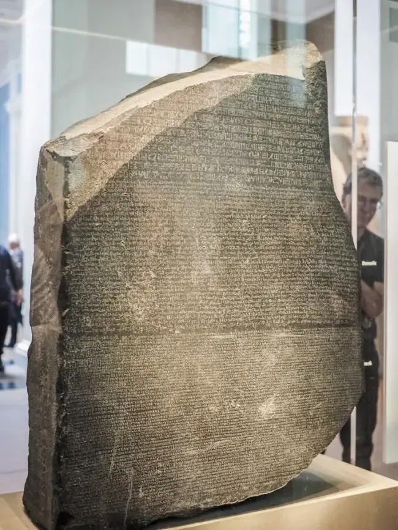

## 1\. 数据的持久化

### 1.1. 正 v.s. 反

# “持久化” 可能没有想象的那么困难

## 一个 “能反复改写的状态”

  - 为了让计算机能访问，一个 bit 必须能**用电路读写**

# 电磁感应：物理和数字世界的桥梁

## 1D 存储设备：把 Bits “卷起来” (磁带：1928)

  - 纸带上均匀粘上铁磁体
  - 只需要一个机械部件 (转动) 定位
      - 读取：磁通量变化产生电动势，放大感应电流
      - 写入：强磁场下电子自旋方向翻转 (不是磁针物理翻转)

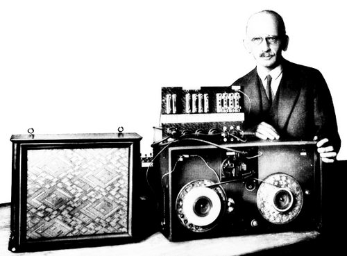

# 磁带：密度可以高得离谱！

## 和集成电路同级别的制程

  - 但结构要简单得多 (存储部分只需要结晶)
  - 离谱的 300 Gb/in² (30TB/磁带)

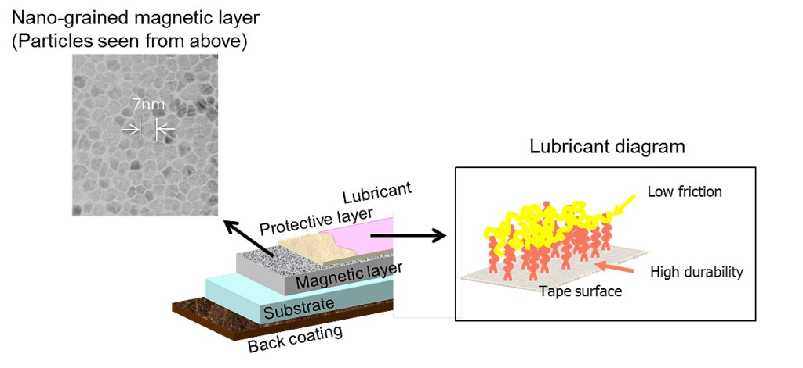

# 磁带：作为存储设备的分析

## 存储特性

  - 价格**低** (比电路容易制造)、容量**高**、可靠性**高** (适当封装)

## 读写性能

  - 顺序读写**勉强** (需要等待定位)、随机读写**几乎完全不行**
      - 这是致命的缺陷

## 应用场景

  - 冷数据的存档和备份；只需要顺序读 (写) 的场景：音频/视频！

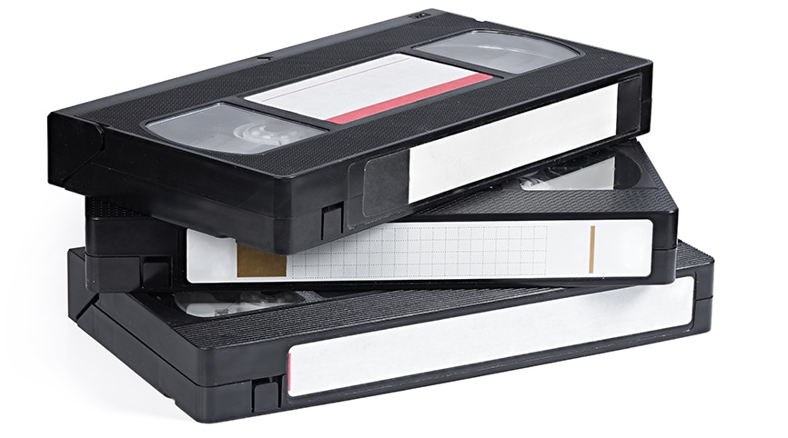

# 磁鼓 (Magnetic Drum, 1932)

## 1D → 1.5D (1D x n)

  - 用旋转的二维平面存储数据 (无法内卷，容量变小)
  - 读写延迟不会超过旋转周期 (随机读写速度大幅提升)

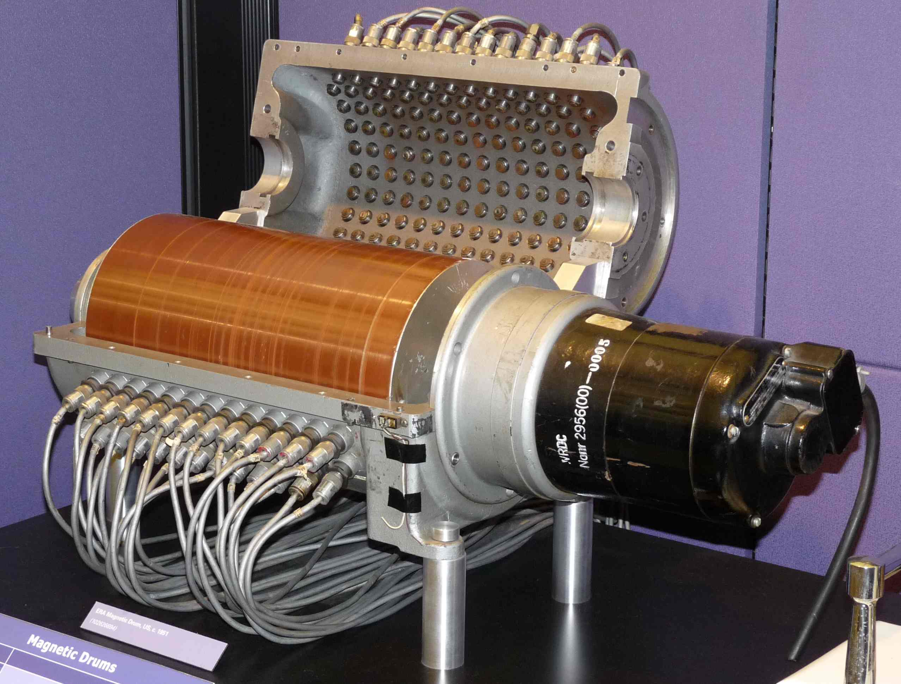

# 疯狂内卷：磁盘 (Hard Disk, 1956)

## 1.5D → 2.5D (2D x n)

  - 在二维平面上放置许多磁带

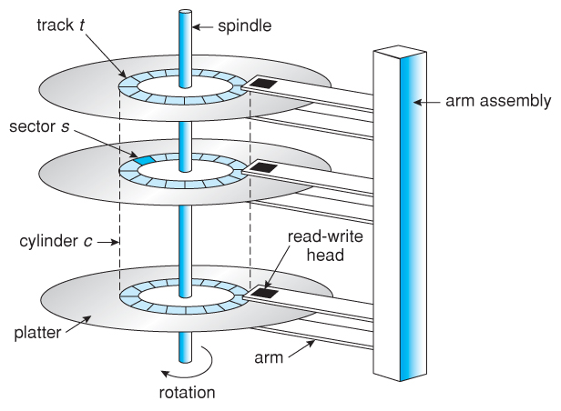

# 磁盘：克服各种工程挑战

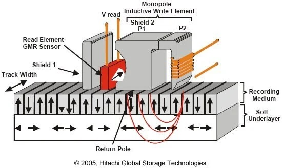

# 磁盘：克服各种工程挑战 (cont’d)

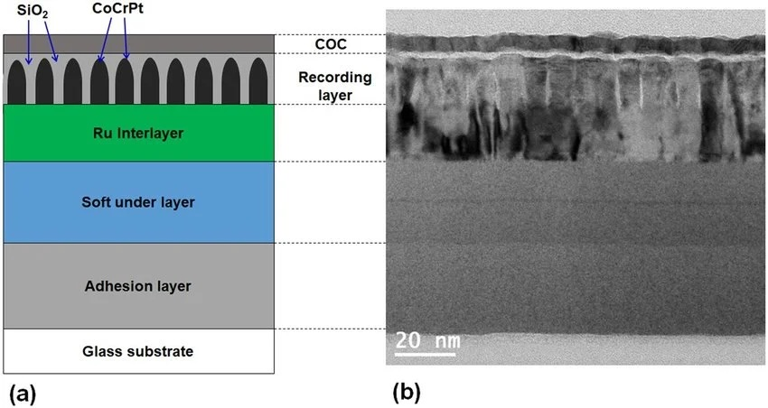

# 磁盘：作为存储设备的分析

## 存储特性

  - 价格**低**：高密度、低成本
  - 容量**高**：2.5D，上万磁道
  - 可靠性**高** (高速运转的机械部件是潜在的威胁)

## 读写性能

  - 顺序读写：**较高**
  - 随机读写：**勉强** (需要等待定位)

## 应用场景

  - 计算机系统的主力数据存储 (便宜；甚至坏了还有可能修)

# 磁盘：性能调优

## 为了读/写一个扇区

1.  读写头需要到对应的磁道
      - 7200rpm → 120rps → “寻道” 时间 8.3ms
2.  转轴将盘片旋转到读写头的位置
      - 读写头移动时间通常也需要几个 ms

## 通过缓存/调度等缓解

  - 例如著名的 “电梯” 调度算法
      - 成为了历史的尘埃
  - Advanced Host Controller Interface (AHCI); Native Command Queuing (NCQ)

# 软盘 (Floppy Disk, 1971)

## 把读写头和盘片分开——实现数据移动

  - 计算机上的软盘驱动器 ([drive](https://www.bilibili.com/video/BV1BS4y1X76n)) + 可移动的盘片
      - 8″ (1971), 5.25″ (1975), 3.5″ (1981)
          - 最初的软盘成本很低，就是个纸壳子
          - 3.5 英寸软盘为了提高可靠性，已经是 “硬” 的了

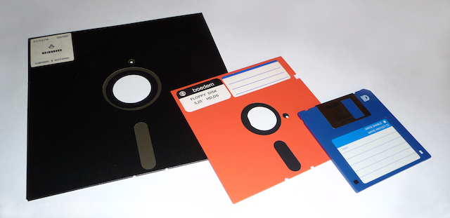

# 曾经，软件是通过“软盘”发行的！

# 软盘：作为存储设备的分析

## 存储特性

  - 价格**低**：极低成本
  - 容量**低**：裸露介质，密度受限
  - 可靠性**低**：不要抱有太大的期望

## 读写性能

  - 顺序读写：**低**
  - 随机读写：**低**

## 应用场景

  - 当年可是把整个操作系统带着走的
      - (几十 KB 的 BASIC 代码其实就可以很复杂了)
  - 今天作为吉祥物存在的按钮 💾

### 1.2. 坑 v.s. 平

# 坑：天然容易 “阅读” 的数据存储

## 跨越千年的持久化存储方法

# 现代工业：我们可以挖出更精细的坑！

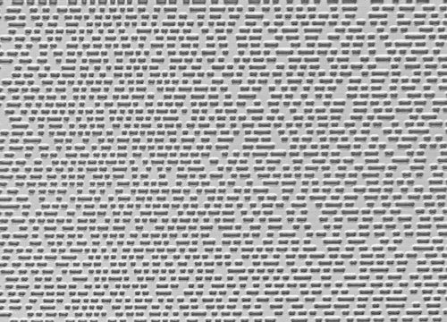

# Compact Disk (CD, 1980)

## 在反射平面 (1) 上挖上粗糙的坑 (0)

  - 激光扫过表面，就能读出坑的信息来
      - 44.1kHz, 16-bit, 2 声道贝多芬第九交响曲 (74 分钟, \~700MB)，飞利浦 (碟片) 和索尼 (数字音频) 发明
      - Eight-to-Fourteen Modulation 编码 (8 bit 编码到 14 bit)

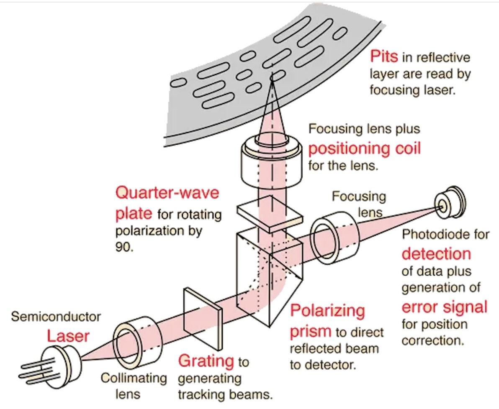

# 光盘最有趣的特性：容易复制！

## 光盘的坑是挖在透明塑料上的

  - “压盘” 后镀上反射膜
  - 3s 生产一张 Blue Ray 100GB (33,000MB/s 写入速度)

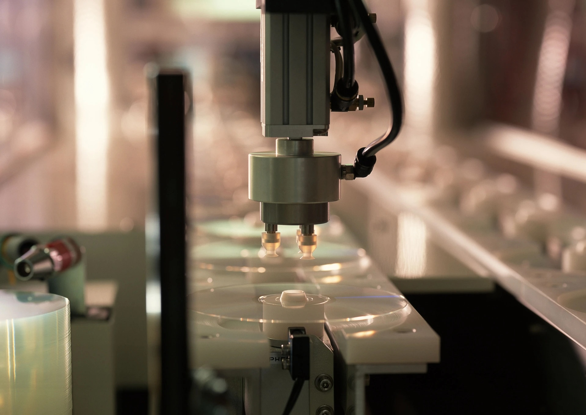

# 光盘：作为存储设备的分析

## 存储特性

  - 价格极低
  - 容量高 (当然，也没有那么高)
  - 可靠性高 (你划伤的是没有数据的那一面)

## 读写性能

  - 顺序读：一般
  - 随机读：低；很难写入 (CD/R & [CD/RW](https://www.scientificamerican.com/article/how-do-rewriteable-cds-wo/))

## 应用场景

  - 数字内容分发
  - (逐渐被互联网的速度优势取代)

# 挖坑：还有别的用处吗？

## Project Silica: 回归 Rosetta Stone

  - Random read + Append-only write = 任何数据结构
  - [Nature Paper](https://www.nature.com/articles/s41586-025-10042-w); [视频](https://www.bilibili.com/video/BV1Wu4y187Dh/)

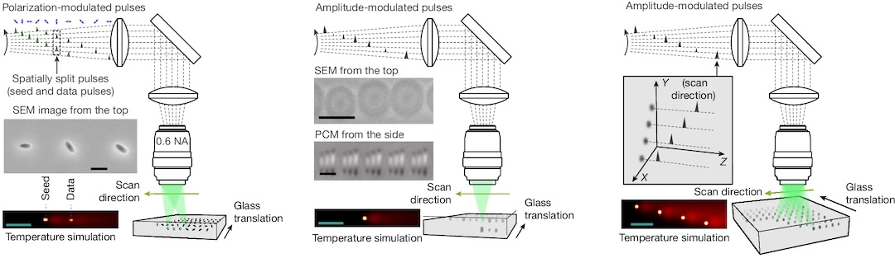

### 1.3. 充电 v.s. 放电

# Solid State Drive (1991)

## 磁和坑都不太完美

  - 磁：机械部件 (无法避免的 ms 级延迟)
  - 坑 (光)：挖坑效率低、填坑很困难

## “完美” = 电子的密度、电路的速度

  - Flash Memory “闪存”
  - 如何在电路中持久 1-bit？
      - 挖个坑
      - 把电子填进去 = 一个状态
      - 把电子放跑 = 另一个状态
  - 甚至可以 MLC/TLC/QLC
      - 精确控制电压来实现更多 bits
      - MLC: 2 bits, TLC: 3 bits, QLC: 4 bits

# 1-Bit Flash Memory

## Floating Gate 的充电/放电

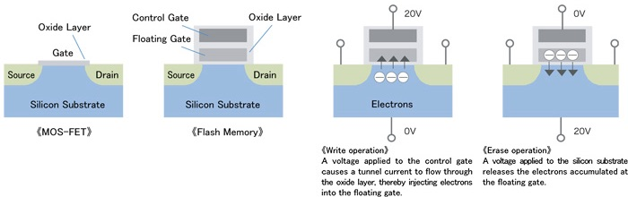

# 闪存：作为存储设备的分析

## 存储特性

  - 价格**低**：大规模集成电路
  - 容量**高**
  - 可靠性**高**：集成电路封装，不怕摔

## 读写性能

  - **极高**，而且有极高的扩展性 (电路是天然并行的)
      - 极为离谱的优点：**容量越大，速度越快**

## 应用场景

  - Tape is Dead, Disk is Tape, Flash is Disk, RAM Locality is King (Jim Gray, 2006)

# 开启 “优盘” 时代 (1999)

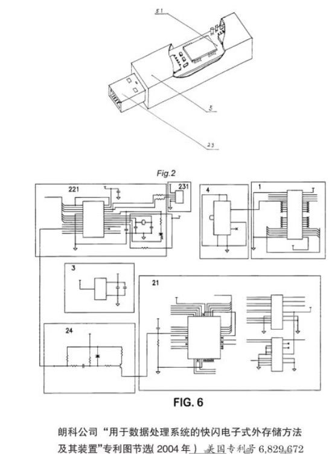

# Flash Memory 有一个致命的缺陷

## 放电 (erase) 做不到 100% 放干净

  - 放电**数千/数万次**以后，就好像是 “充电” 状态了 (Erase Saturation)
  - Dead cell; “wear out”
      - QLC: 大约只有 1,000 次写入寿命

## 有没有感到很害怕？

    for i in range(1000):
        Path("a.txt").write_text(str(i))

  - 这个文件就该要损坏了？

# 软件定义磁盘

## 你的 SSD、优盘，甚至是 TF 卡里都藏了完整的计算机系统

  - FTL: Flash Translation Layer
  - “Wear Leveling”: 用软件使写入变得 “均匀” (虚拟内存)
      - 维护一个 Logical-to-Physical Table (L2P Table)
      - 再一次：Random Read + Append-only Write = 任何数据结构

# Flash Translation Layer (FTL)

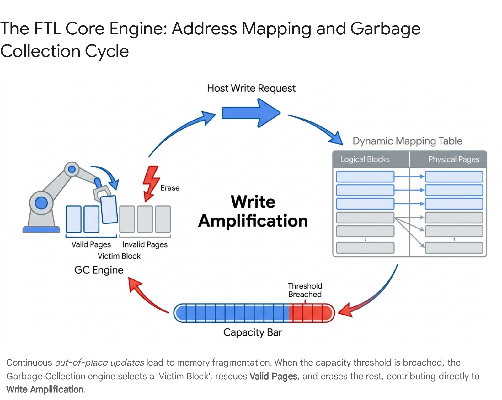

# Flash Disk 与 NAND Flash

## 优盘, SD 卡, SSD 都是 NAND Flash

  - 但软件/硬件系统的复杂程度不同，效率/寿命也不同
      - 典型的 SSD：CPU, RAM, 缓存, store buffer, 操作系统 …
      - SD 卡/TF 卡标准没有规定必须内置 FTL，但实际上都有[计算机系统](https://www.bunniestudios.com/blog/?p=898)

## 不要买过度便宜的优盘

  - 设备 = 一组寄存器 → 设备可以 “伪造”
  - (今天优盘的应用场景越来越少了)

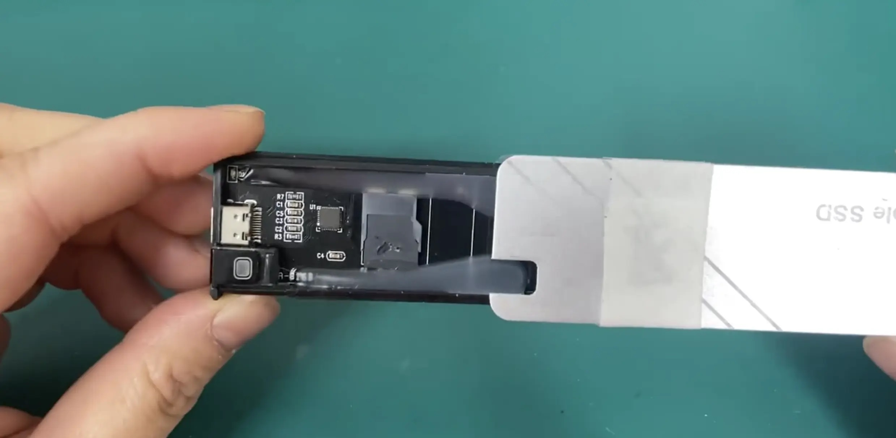

## 2\. 操作系统视角的存储设备

# 存储设备的抽象

## Random Access 的代价：寻址

  - 磁盘/磁带/光盘需要物理旋转 (Project Silica 就更复杂了)
  - 电路也需要选通信号 Die → Plane → Block → Page (16KB)

## 减少寻址的代价：按块访问

  - SSD Page 内的独立选通信号就是浪费电路
      - 整个 Page 是同步并行读写的
  - 存储设备 = 随机读写的 block array
      - `struct block disk[NUM_BLOCKS]`

## Block devices

  - 按块访问的字节序列 (可以直接 mmap 到进程的地址空间)
  - 但这个抽象不是没有代价的
      - 不经意间的读/写放大 (read/write amplifications)
      - 需要极致性能的场景，NVMe ZNS (Zoned Namespaces) 直接操纵 append-only 的 Zone

# Linux Bio

## 一个应用程序 “看不见” 的接口

  - 为你的存储设备实现 `struct block_device_operations` 和 `struct request_queue`，剩下的 read/write/mmap/… 都是文件系统的事了
  - (凭什么不能看到看不见的接口？)

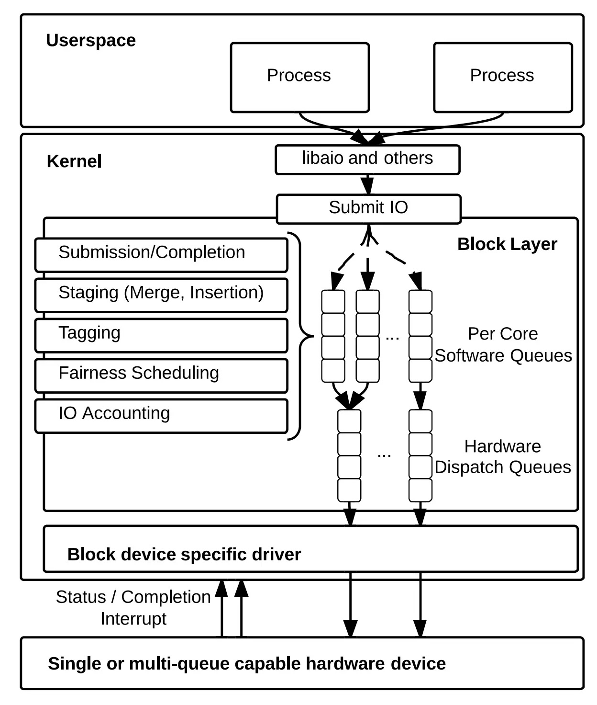

# [打开 Linux Block I/O](/OS/demos/persistence/bio)

让我们借助 Coding Agent，“在没有直接经验的领域（如语言、技术、框架等）进行一些编程工作” 吧！虽然我作为《操作系统》的教师，知道 Linux 内核内部的机制，但我决定在对话时假装自己对系统内的这些机制一无所知。模型：deepseek-v4-pro (high)，成本：¥ 0.72。

# Takeaways

无论是内存还是持久存储，最终胜出的仍然是电——它的密度和速度是其他介质难以比拟的。但同时我们也看到，NAND Flash 作为持久存储时有着巨大的缺陷——写入寿命。但我们也看到了工业界竟然敢于试制这样跨时代的产品，在十多年的争议中终究成为了今天存储的主角。如果更快的 non-volatile memory 到来又退场，我们的计算机系统是否会发生翻天覆地的变化？欢迎到大家在 AI 的帮助下扩展自己的知识面，例如 [SSD Guide](https://github.com/mikeroyal/SSD-Guide) 和 [Coding for SSDs](https://codecapsule.com/2014/02/12/coding-for-ssds-part-1-introduction-and-table-of-contents/)。海量的阅读帮助你形成正确的 “计算机科学世界观”，用计算机科学的方式处理问题。

# 阅读材料

教科书 Operating Systems: Three Easy Pieces:

  - 第 37 章 - Hard Disk Drives
  - 第 44 章 - Flash-based SSDs
