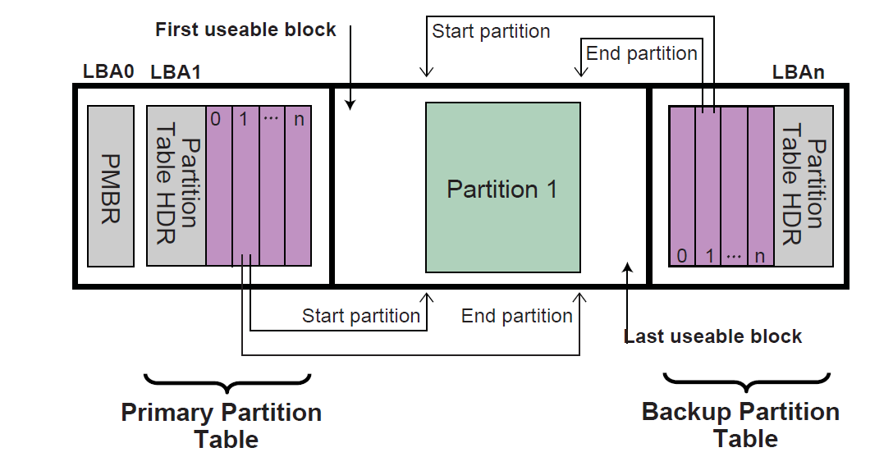
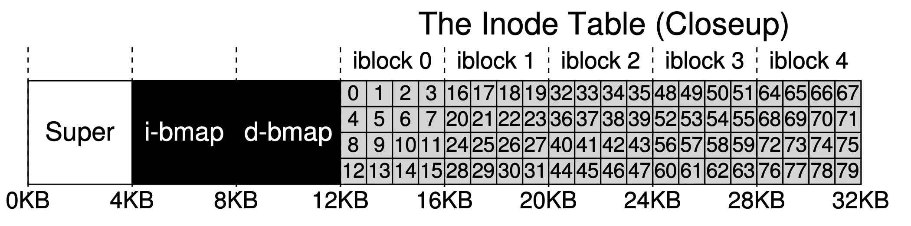
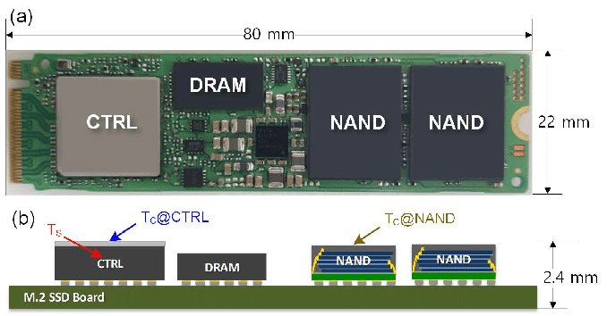
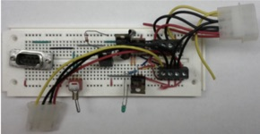
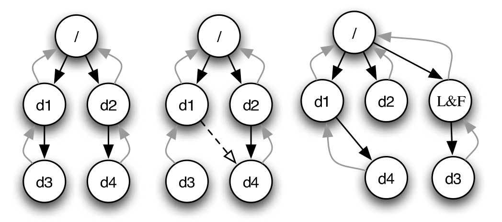
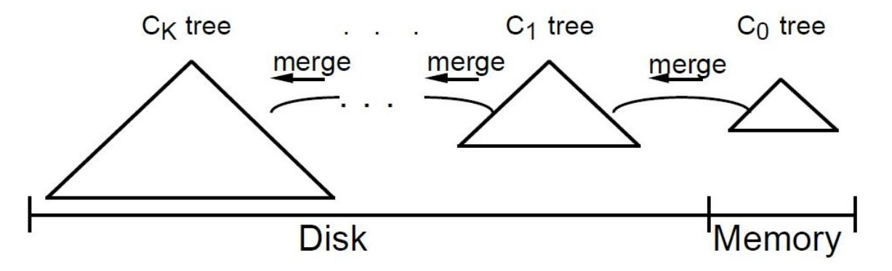
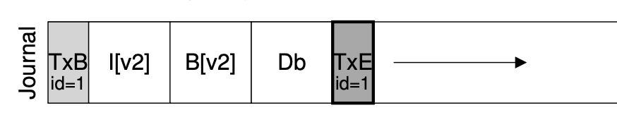

# 文件系统实现

# Review & Comments

## 文件系统 = 数据结构

  - 任何实现了 “`struct fuse_operations`” 的东西都是文件系统
      - readdir, mkdir, getattr, open, …
      - 例子例子：procfs, sysfs, Galgame FS

## 我们需要在块设备 (按块访问的字节序列) 上实现数据结构

  - bread (load), bwrite (store)
  - bsync (`__sync_synchronize`)
      - 这不是魔鬼的盒子吗？

## 1\. 块设备上的数据结构

### 1.1. 复习：块设备模型

# 真实的块设备

## 可以是一个实际的设备

  - GPT (GUID Partition Table), 属于 UEFI 的一部分
  - 也是一个[数据结构](https://uefi.org/specs/UEFI/2.10/05_GUID_Partition_Table_Format.html)，帮助你分出 /dev/nvme0n1p1, …

## 也可以是虚拟化的设备

  - Physical Volume → Volume Group → Logical Volume (可以一对多、多对一、多对多)
      - 用户空间的工具：vgdisplay, lvextend, resize2fs
      - 我们也可以 strace 观察它们
  - NVMe namespace: “硬件级”的 “LVM”

# [Logic Volume Manager](/OS/demos/persistence/lvm)

Logical Volume Manager (LVM) 是 Linux 中用于虚拟化存储设备的工具。它允许将物理卷 (Physical Volume, PV) 组成卷组 (Volume Group, VG)，然后从卷组中创建逻辑卷 (Logical Volume, LV)。

# 实现文件系统的代价

## 读、写放大

  - bread, bwrite 必须按块读写
  - 更新一个字节 (例如 modification time) 会发生什么？
      - bread() x 1
      - bwrite() x 1，会涉及 SSD FTL 的 map table **数据结构更新**，因此写放大可能达到几万倍 😂

## 缓解办法：缓存

  - 和 memory hierarchy 一样，在更快的存储器 (内存) 中留一份数据
      - bread/bwrite 总是访问 cache
      - 如果 cache miss，就要去存储设备里取
      - 异步 write back
  - Locality 原理也帮忙了 (把相近文件的 metadata 放在一起)

# 进入文件系统设计

## 先做需求分析

  - 要 persist 什么？
      - 文件数据 (bytes)
      - 文件 metadata (name, size, permissions, timestamps, …)
      - 目录结构 (name → 文件的映射)
  - 观察一些统计规律
      - Most files are small (\~2K); a few big files use most space
      - Directories are typically small (≤20 entries)
      - File systems are roughly half full

## 核心数据结构问题

  - 文件的 metadata (size, mode, time, …) 怎么存储？
  - 文件的 virtual to physical map table 什么数据结构？怎么存储？
  - 目录如何实现？

# Super Block

## 数据结构的 “根结构体”

  - 任何数据结构都需要一个入口
      - 链表 head; 树结构的 root
      - 各种文件的 Header: ELF, BMP, …
  - 文件系统把 “入口” 放在 Superblock (固定位置)

## 描述文件系统布局的 “元信息”

  - Magic number, block size
  - Total/free blocks, total/free inodes
  - 数据结构的起始位置、大小、…
      - `mkfs` 创建; `mount` 命令会根据 super block 确定文件系统类型

## 最关键的一个 block

  - 损坏 = 修复起来比较麻烦 (因此通常备份多份)

# 小文件系统和 FAT

## 5.25“ 软盘：单面 160 KiB

  - 320 个 512B 扇区 (sectors)：任何复杂的数据结构都显得过于奢侈

## 核心数据结构：[File Allocation Table](https://jyywiki.cn/OS/manuals/MSFAT-spec.pdf) (FAT)

  - 把磁盘分成 clusters (sector 的 2^k 倍), `BPB_SecPerClus`
  - `cluster_t fat[4096];` (FAT-12)，代表每个 cluster 的 next
      - 0 = free, -1 = EOF
      - 在 FAT 碎片的情况下，大文件 lseek 会产生显著的读放大

## 目录

  - `struct dent entries[0];` “目录文件”
      - DOS “8 + 3” 文件名 “AUTOEXEC.BAT”，连一个字节都省了
      - 不支持硬链接、长文件名需要打补丁

# [readfat](/OS/demos/persistence/readfat)

通过摘抄手册，可以得到 fat32.h 并明确每个字段的含义，mmap 把磁盘镜像映射到内存就可以实现解析了。现在这个工作，哪怕是全新的系统，也完全可以交给大语言模型完成。

# UNIX 的选择：分离

## G(V, E) 顶点和边分开存储 (非常符合直觉的选择)

  - inode (Index Node): Mode, Links, User/Group, Size, …
      - fstat 直接返回 inode 里的信息即可 (FAT 就麻烦了)
  - 通过 bitmap 分配 (相比 FAT 有更好的 locality)

## 索引：联合数据结构 (Fast/Slow Path) ext2

  - 12 个直接指针 + 1 indirect + 1 double indirect + 1 triple indirect
  - 代价：inode 本身体积变大

## 目录

  - `using dent = map<string, inode_t>;` 天然支持硬链接
  - 能不能 dump inode 和 dirent 的数据结构，并且可视化它？
      - ext4: \<= 60B 的符号链接直接存储在 inode 中

# [Debug File Systems](/OS/demos/persistence/ext4)

debugfs 工具使我们能在用户态调试文件系统——这也给了我们 “可视化” 一个目录的机会，我们可以递归地 dump 出一个目录的 raw data structure，看到文件系统的 “内部”，例如符号链接是如何存储的，并且用合适的工具渲染成直接可视化的 diagram。

## 2\. 文件系统的崩溃一致性

# 存储系统：应对崩溃

## Crash: 内存里的一切都瞬间丢失

  - 可能是 power loss，也可能是 bug (Kernel panic)
      - 但 persistent storage 的数据是**不能丢失**的

## Crash Consistency

  - Move the file system from one consistent state (e.g., before the file got appended to) to another atomically (e.g., after the inode, bitmap, and new data block have been written to disk.

# 暗藏杀机的数据结构

## 数据结构更新涉及 multiple-location writes

    write(fd, buf, 4096); // append

  - 分配数据块: bwrite(d-bitmap)
  - 写入数据块: bwrite(data)
  - 更新元数据 (size, time, index, …): bwrite(iblock)

# 层次化存储结构带来的问题

## Block cache → queue (DMA) → 存储系统上的计算机 → queue

  - 计算机系统会按照他认为的 “最佳” 顺序写入 (乱序执行)
      - 例子：HDD 的磁头运动规划；SSD FTL
  - 于是 bread, bwrite 不就成了 relaxed memory model 了吗
      - 不就又打开了魔鬼的盒子吗 😱😱😱

# 乱序执行：后果

## 磁盘掉电时，写入请求的顺序是没有任何保证的

  - multi-write 会产生怎样的后果？
      - bwrite(inode), bwrite(d-bitmap), bwrite(data)
      - (人类在几十年的时间里其实都在 “裸奔” 😂)

## 早期 SSD 还有更严重的问题

  - FTL crash 后会留下 corrupted data structure\!

# Systems: “先挣钱，后还债”

## 崩溃会导致数据丢失、目录损坏，甚至文件系统无法挂载

  - 这时候当然是送去修电脑 (File System Check) 了！
  - “快速格式化” 的文件系统都，不一致的文件系统必须也能
      - “摄影师事件” 中修电脑的被判处有期徒刑 8 个月
      - 于是有了 fsrecov 的实验

# File System Checking (FSCK)

## 根据磁盘上已有的 G(V, E)，恢复出 “最可能” 的数据结构

  - 这是个算法题；但要小心 [fsck crash](https://dl.acm.org/doi/10.1145/3281031)
  - 强行终止虚拟机，可能观测到 Git repo 的损坏 (git fsck 可以修复)
      - Linus: Git 已经是 append-only 了，不要引入额外的性能问题

# 实现崩溃一致性：重新理解 “数据结构”

## 视角 1: 存储实际数据结构

  - 链表、二叉树、……
      - 文件系统的 “直观” 表示
      - Multi-write (crash unsafe)

## 视角 2: Append-only 记录所有历史操作

  - 容易实现崩溃一致性
  - 一旦有历史操作，就可以随时重构实际的数据结构了
      - Write-ahead log (“Redo log”)
      - 1 + 1 \> 2: append 在现代存储系统上更容易高效实现！

# Append-only + Lazy Update

## Store buffer

  - Store 写入 CPU 本地缓存，慢慢传递给其他处理器

## LSM (Log-structured Merge Trees)

  - 只有 MemTable 可写 (例如 Skip List)，带 WAL (crash consistency)
      - MemTable 写满，触发 Flush 向磁盘持久化
  - 磁盘上全是 Immutable SSTable
      - 如果结构不够好就 Merge (创建新 SSTable), Amortized O(1)
      - 类比 Memory Hierarchy，小的树会 override 大的树

# 文件系统中的 Write-ahead Log

## 写入 TXBegin; operations

  - 写完后 flush 等待数据落盘

## 写入 TxEnd

  - 在此之前写完后 flush 等待数据落盘
  - 数据落盘 “happens-before” TxEnd 落盘

## 写入文件系统 (Checkpointing) & 崩溃恢复

  - replay(operations) 写入文件系统、回收日志空间
  - 如果写入时崩溃，fsck 将会 replay(operations) 恢复数据

# Journaling Tricks

## 批处理 (xv6; jbd)

  - 多次系统调用的 Tx 合并成一个，减少 log 的大小
  - jbd: 定期 write back

## Checksum (ext4)

  - 不再标记 TxBegin/TxEnd
  - 直接标记 Tx 的长度和 checksum (顺便还检查了日志完整性)

## Metadata journaling (ext4 default)

  - 数据占磁盘写入的绝大部分
      - 只对 inode 和 bitmap 做 journaling 可以提高性能
  - 保证文件系统的目录结构是一致的；但数据可能丢失

## 3\. 应用程序的崩溃一致性

# 应用程序的崩溃一致性

## 应用程序的多个写入操作也会被乱序吗？

  - 会！因为有 metadata journaling，下面的操作是 crash unsafe 的
      - `Path("a.txt.tmp").write_text(...)`
      - `unlink("a.txt")`
      - `rename("a.txt.tmp", "a.txt")`

## 想起了[我读 PhD 时候的工作](https://dl.acm.org/doi/10.1145/2950290.2950327)

  - 想法来自 [All file systems are not created equal](https://www.usenix.org/conference/osdi14/technical-sessions/presentation/pillai)
  - 能不能实现一个能 “自动检查任何软件” 的 checker？
      - Make, sort, perl, bzip2, … 无一幸免
      - 2016 年的 Node.js 甚至无法安全地保存文件

# sync() 系列系统调用

## 全局同步

  - 同步所有文件系统中的所有数据
  - 等于 performance bug
      - 只在关机/命令行使用

## 文件描述符同步

  - `syncfs(fd)`: 同步 fd 对应的文件系统
  - `fsync(fd)`: 同步文件 data + 全部 metadata
  - `fdatasync(fd)`: 同步文件 data
      - 仅同步改变了的数据相关 metadata (size、索引)
      - 最弱，但依旧可以控制 data loss
      - 例子：实现应用程序中的 WAL (实现 bflush 的效果)

# 《操作系统》课到底教会了我们什么？

## 学习了新的文件系统 API

  - fsync, fdatasync
  - 有什么办法巩固学习的成果呢？

## Vibe code a crash consistency checker\!

  - 打开 Coding Agent 读一遍论文
  - 再让他实现一个简易版本，直接开跑
      - 半天时间就可以得到一个好得多的实现
      - 再做范围巨大的实验，提交成百上千的补丁

## 我找到了一个发 (洗) paper 的流量密码

  - 找到一些有 conceptual novelty 的老 paper
  - 用钞能力扩大 100× 实验验规模，用 LLM 替代 heuristics
      - (不要总这么做，会伤害大家的研究品味)

# [Crash Consistency Checker](/OS/demos/persistence/ccheck)

一个 user-space 的 strace-based crash consistency checker。追踪一次程序所有对数据文件的写入，包括 fsync 系列的系统调用，生成一系列的 trace，并使用 LLM 判定是否存在数据不一致等。

# Takeaways

把文件系统理解成一个 “数据结构”，就不难理解经典和现代文件系统的设计理念——所有人都是在为了合适的硬件、合适的读写 workload 上，用合适的方式组织数据，维护树状 (和链接) 的目录结构和随机访问的文件操作。当然，文件系统也通过各种手段默默守护了你数据的安全和一致性。

# 阅读材料

教科书 Operating Systems: Three Easy Pieces:

  - 第 40 章 - File System Implementation
  - 第 41 章 - Locality and The Fast File System
  - 第 42 章 - Crash Consistency: FSCK and Journaling
  - 第 43 章 - Log-Structured File Systems
