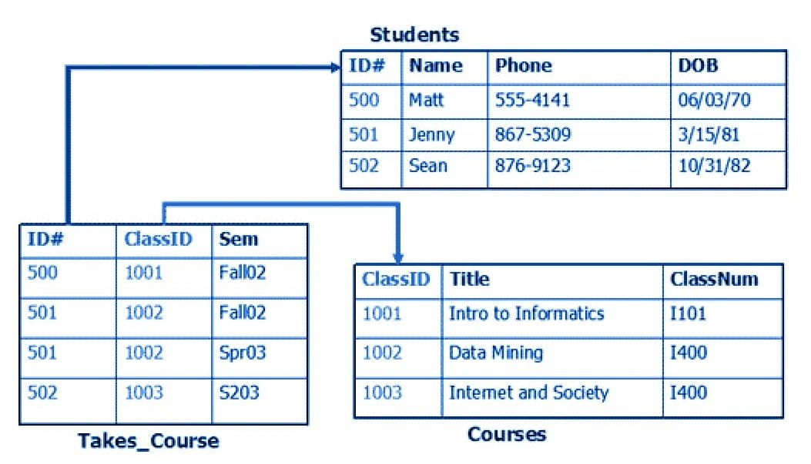
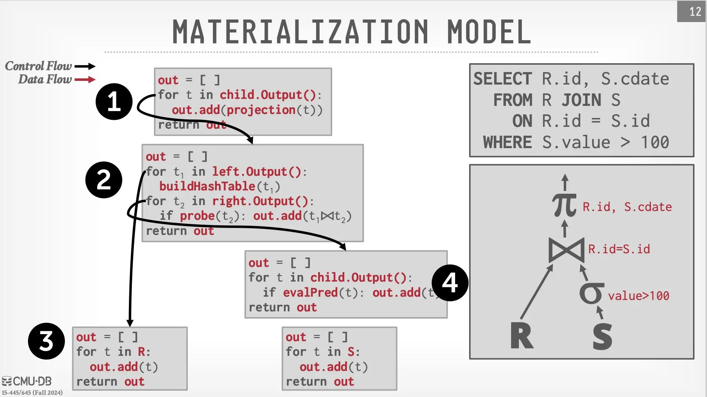
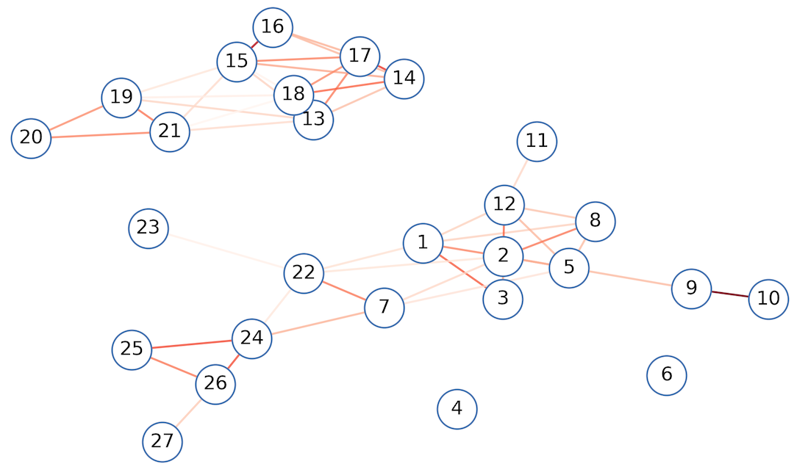

# 数据库系统

# Review & Comments

## 持久化：文件系统

  - Linux: 块设备上的一个数据结构
  - 支持 crash consistency 和 recovery

## 我们用文件系统来做什么？

  - 保存**应用程序**用的数据
  - 我们总是通过应用程序访问文件 (哪怕是 cat, sort)
      - 课件.pptx, 作业.docx, 电影.mp4, Projects/oslabs/…
      - 这也是为什么应用程序的 crash consistency 也很重要
  - 文件系统提供了 “原始” 的 API
      - 文件 (byte array)、目录
      - 有没有更好的保存应用程序数据的方法？

## 1\. 持久保存应用数据

# 什么是 “应用程序”？

> 软件是物理世界过程在信息世界中的投影。

## 软件天生有 persist data 的需求

  - 个人信息 (学籍……)
  - 订单
  - 日志 (支付记录、维护记录)……

## 本质：数据结构的 CRUD

  - [教务系统](https://ehallapp.nju.edu.cn/jwapp/sys/teacherJxrwApp/*default/index.do)
      - 管理员、教务员、教师、学生看到不同的数据和操作接口
  - [演示文稿](https://cs.nju.edu.cn/yuanyao/course/dismath/lec1.pptx)
      - XML 描述的数据结构 (ISO/IEC 29500)

### 1.1. 使用目录和文件

# Everything is a File

    ehall.nju.edu.cn/teacherJxrwApp/22020230/4
    ├── enrollment
    │   ├── 231220001.md
    │   └── ...
    ├── syllabus
    │   ├── 1-intro.md
    │   └── ...
    └── textbook
        └── 1-ostep.md

## UNIX 世界中的工具都能用了：find, grep, …

  - 甚至可以用 symlink 去实现 “引用” (enroll/id/student -\> …)
  - 自动得到的 agent friendly (非常巨大的优势)

# 优点和缺点

## Tool friendly 和 agent friendly 的代价

  - Crash consistency 实现需要小心
      - 最好是 append-only 的
  - 性能稍差一些
      - 每次都需要去文件系统 API 绕一圈，还有隐藏的读/写放大

## 结论：小规模系统 (例如课程主页) 的选择

  - 提交存储在 `/var/www/filerecv/OS2026/M1/[stuid]`
      - `2026-04-04-19-26-43.tar.bz2`: 提交
      - `2026-04-04-19-26-43.tar.bz2.result`: 结果
  - 统计 Accepted 数量：`cat **/*.result | grep ... | wc -l`
  - Rejudge M5: `echo M5/**/*.result | xargs rm`

### 1.2. 直接保存数据结构

# 一个有趣的 Hack

## 直接在文件 (虚拟磁盘) 上构建**数据结构**

  - 就像 ELF, BMP, …

    struct superblock {
        struct student *s;
        struct course *c;
    }
    struct student { char stuid[16]; ...  };
    struct course  { char cid[16]; ...  }

  - 实现数据结构的 CRUD: `expel(s);` `enroll(s, c);` …

## 甚至可以直接把数据结构 mmap 到内存，直接 persist 指针

  - 坑：mmap region 不会自动 write-back
  - 需要 msync (2); 而且 msync 并不保证 crash consistency
  - 还需要额外的 fdatasync

# [Memory-mapped 数据结构](/OS/demos/persistence/mmds)

如果我们总是把数据结构映射到固定的位置 (并且为数据结构的分配使用专用的分配器，总是从固定位置分配)，就可以直接把数据结构映射到磁盘上，甚至也可以实现 write-ahead log。

# 你甚至可以实现 WAL Log

## 比大家想象的简单

    struct superblock {
        u32 magic;
        char wal[256];
        ...
    };

  - 对于任何数据结构操作，先把所有的 side effects 写入 wal
      - (代码示例里偷懒了，只记了命令，crash 时数据结构是一致的)
  - 然后执行操作，清除 WAL

## 恭喜你，发明了 “[single-level store](https://dl.acm.org/doi/10.1145/3477132.3483563)” 操作系统！

  - 在 persistent memory 时代很有可能复活

## 2\. 关系型数据库

# 需求：一个非常非常好的数据结构

## 好用

  - 能处理几乎任意类型的数据结构
  - 好对任何人来说都比较好上手

## 性能

  - 全校一起选课，系统不能崩 (不能一把大锁保平安)

## 持久化 (Crash Consistent) 和一致性

  - 系统故障，数据不能丢
  - 数据结构需要支持 multi-write
      - 例子：批量导入学生选课信息，需要 all-or-nothing
  - 同时满足这些需求的东西真的能存在吗？

# 反思：我们是怎么实现数据结构的？

## 我们的计算机是 Pointer machine

  - 实现数据结构其实不需要 “数组”
  - malloc(constant) 分配固定大小的内存，就能实现任意数据结构

## Pointer 是对象之间的关系

    struct node {
        char value[32];  // Record
        struct node *left, *right;  // Pointers
    }

  - 离散数学：整个计算机世界都是在二元关系上 foramlize 的

# Relational Database (关系型数据库)

## 一个 surprisingly simple 的模型

  - [A relational model of data for large shared data banks](https://dl.acm.org/doi/10.1145/362384.362685)
      - Edgar F. Codd: 1981 Turing Award Winner
      - “Future users of large data banks must be protected from having to know how the data is organized in the machine.”
          - 我做了很多年 program synthesis; 但凡是 end-user 的，最后的设计理念都会回到这一篇 paper

## Everything is a table

  - 每行一个对象；对象可以用 id 索引其他对象
  - struct = table 的一行

# 关系数据库模型

## “对象和指针”

# 关系数据库查询：指针 “配对”

    SELECT Courses.Title
    FROM Student
    JOIN Takes_Course
        ON Student.ID = Takes_Course.ID  -- Key
    JOIN Courses
        ON Takes_Course.ClassID = Courses.ClassID  -- Key
    WHERE Student.Name LIKE '张%'

# 从模型到实现：数据库系统

## “ACID” 数据库开启软件的新时代

  - A (Atomicity), C (Consistency), I (Isolation), D (Durability)
      - Serializability: 并发执行的效果等价于某种串行执行
      - Strong crash consistency: 系统 crash 也不会损坏或丢失

## 支持任意长 (允许混合任意计算) 的 Transaction

  - 这个特性太重要了

    tx_begin();
    if (user1.balance < m) tx_abort();  // SQL
    user1.balance -= m;  // SQL
    user2.balance += m;  // SQL
    tx_commit();

# ACID 数据库

## 学过《操作系统》就很好理解了

  - 并发执行的效果 = 一把大锁保平安
  - 但性能远优于粗粒度加锁
  - 完全自动的崩溃恢复
      - 应用数据交给数据库 = **一劳永逸**
      - 甚至在应用有 bug 的时候，都还可以[强行抢救](https://www.zhihu.com/question/602083441/answer/3038238487)

## 关系数据库：海量的实现优化

  - 查询优化 (rewriting)
  - 索引 (B+ Tree 等数据结构)
  - 缓存、分库分表、并发控制、读写分离……
      - 只要不是大到 “国民级” 的应用，数据库都能搞定

### 2.1. 数据库系统：实现

# Databases v.s. Compilers

## 实现查询 = 实现编译优化 (语义等价的 rewriting)

  - 我选择抄作业 ([CMU 15-445](https://15445.courses.cs.cmu.edu/), Andy Pavlo) 😂

# 一个超级复杂的并发程序

## 每个 SQL 都操作数据库的一部分

  - Write(x)
  - Read(y)
      - 用于维护 “磁盘上的数据结构”
      - 类似文件系统，write-ahead logging (crash consistency)

## 但并发控制更困难

  - T\_1: `tx_begin(); x = 1; may_crash(); y = 2; tx_commit()`
  - T\_2: `tx_begin(); y = 1; sleep(100000); x = 2; tx_commit()`
      - 2 Phase Locking: 由于 Tx 可以执行任意代码，所以只能 “边执行边上锁” + deadlock detection，遇到死锁就 rollback，commit 时释放
      - MVCC: 每次都开一个新的 git branch (copy-on-write)，commit 的时候向 main merge，检测到冲突就 rollback

# 例子：SQLite

## 无处不在的数据库

> [SQLite](https://sqlite.org/index.html) is a C-language library that implements a small, fast, self-contained, high-reliability, full-featured, SQL database engine. SQLite is the most used database engine in the world…

  - 一个基于文件实现的支持 SQL 的 “数据结构”
  - Android, iOS, macOS, Chrome, … 中广泛内嵌了 SQLite
      - Zero Configuration (发行版自带 libsqlite3.so；适合 “年轻人的第一个应用”)

## 3\. 从 SQL 到 NoSQL (NewSQL)

# 实现 “国民级” 的应用

## “透明” 的 SQL 就有些困难了

    SELECT *
    FROM chat_records
    WHERE (sender_id = @user_id1 AND receiver_id = @user_id2)
       OR (sender_id = @user_id2 AND receiver_id = @user_id1)
    ORDER BY timestamp DESC
    LIMIT 10

  - 正确，但压力给到数据库引擎
      - 分库、分表、读写分离、索引、缓存、优化……
  - **永远无法预知程序员会写出怎样的 query**
  - 提供了功能 = 被滥用 → Performance Bug
  - 任何 “Systems” 都无法避免的 tech debt
      - 例子：fork()

# 解决办法：做减法

## 只支持一个 “够用” 但可以 scale out 的 subset

  - Key-value store
  - 应用程序全靠 key 管理数据
      - `user:{uid}`
      - `user:{uid}:like_history (a list)`
      - List 支持 append/pop/range 等操作
      - 应用场景：🍠 上的点赞/浏览/历史记录

## 关键的性能优化

  - 给 key 做 hash，load balance 到多台机器上
  - Everything is append-only
      - LSM-Tree; 只支持 append 的 list; …
  - 分布式高性能、高可靠就完成了

# Redis: Everything is In-memory

## 核心：key-value store (GET, SET)

  - 支持存储数据结构：String, List, Set, Hash, Sorted Set, …, [Stream](https://redis.io/docs/latest/develop/data-types/streams/)
  - 支持查询
      - `FT.SEARCH products "@price:[200 300] @category:misc"`
  - 甚至支持 [MULTI/WATCH/EXEC](https://redis.io/docs/latest/develop/interact/transactions/) 事务

## 应用：高性能缓存

  - 点赞插入 `user:{uid}:like_history`; 更新 `user:{uid}:like_count`
  - 定期合成一条 persistent 数据库的插入

# NoSQL & NewSQL

## 提供 SQL 的一个子集

  - MongoDB (Document):
      - Key → BSON (Binary JSON，比 JSON 支持更多类型)
      - 例子：创建一个新 document (message)，然后 append 到 `user:{uid}.messages`
  - Cassandra (Column)
      - CQL: 依然是 Table 的模型
      - (限制程序员的滥用)

    INSERT INTO messages (user_id, message_id, content, timestamp)
    VALUES ('1234567', now(), message, toTimestamp(now()));

## 甚至提供完整的 SQL 支持

  - Google Spanner; TiDB; CockroachDB

# Vector Database

## AI 应用的新基础设施

  - Embedding model: 将 context 映射为高维向量 (距离越近，语义越近)
  - Vector database: 存储和检索向量的数据库
      - ANN: Approximate Nearest Neighbor 返回 “最近” 的文档

