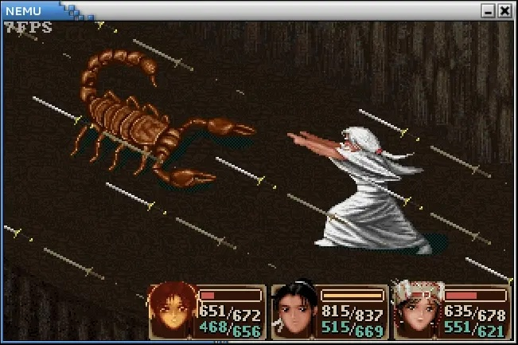
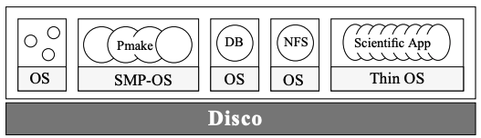
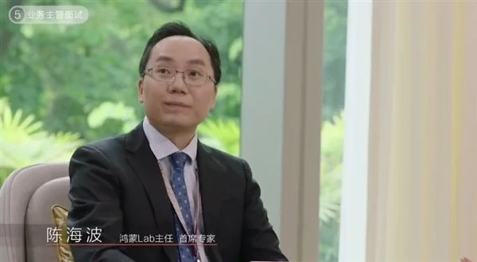

# 虚拟机和容器

## 1\. 全系统虚拟化

# 一个进程，一台机器

## Full System Emulation

  - 这个简单，就是 NEMU 啊：取指令、译码、执行
      - 致命的是**性能**: 不及 native 的 10%
      - [PA4 x86 JIT](https://www.bilibili.com/video/BV1aWVN6uEoY)

# QEMU dyngen

## 来自[早期版本](https://www.usenix.org/conference/2005-usenix-annual-technical-conference/qemu-fast-and-portable-dynamic-translator)

  - **借用**一个有优化能力的编译器，为每条指令生成优化后的本机代码
  - 运行时把连续的非跳转指令用 memcpy 组装起来 + relocate

## 例子：解释执行 `addi r1, r1, -16` (PowerPC)

    // 手写的汇编 (T0 通常是寄存器)
    // op_movl_T0_r1
    // op_addl_T0_im
    // op_movl_r1_T0

    void op_addl_T0_im(void) {
        T0 = T0 + ((long)(&__op_param1));
    }

  - 这是一个 “比解释执行好一些” 的方案
  - Just-in-time: 把连续的指令代码交给编译器优化
      - (只适合在后台 profile-guided 慢慢做)

# 黄金时代的起点

## [Disco](https://dl.acm.org/doi/10.1145/268998.266672)

  - SOSP‘97; Mendel Rosenblum 是 LFS 的作者
  - Virtual machine monitors 重现江湖

## “.COM” 泡沫时代的商机 (\~2000)

  - ISP (Internet Service Provider) 提供的是**物理机**
      - 绝大部分应用 (bbs、邮件、Web) 的 CPU 空闲率达到 90% 以上
  - 虚拟机：和物理机用起来完全一样，但一台能当 n 台卖
      - 黑心商人：我们都是 oversubscribe 的 💰💰💰

# 黄金时代的起点 (cont’d)

## Mendel Rosenblum 和他老婆：财富自由的机会来了

  - 顺便把 paper 的作者也带走吧！
  - 于是有了大家熟知的 VMware (1998)
      - 大部分做产品的投机家死了，但技术留下来了

## 硅谷的创业公司们

  - 科技巨头：HP, Cisco, Yahoo, Google, Sun, … 都是这样起家的
  - Paul Graham 的 [Y Combinator](https://www.ycombinator.com/)

    def Y(f):
        def wrapper(*args):
            return f(wrapper)(*args)
        return wrapper

    factorial = Y(lambda f: lambda n: 1 if n < 2 else n * f(n - 1))

### 1.1. Aside: 大学的使命

# 这些 “传说” 离我们并不远

## 今天我们似乎已经 “忘记” 发论文的意义了

  - 老板有个项目 → 需要一帮打手 → 凑个数，流水线论文工厂启动
  - 后果：耿同学
      - [Benchmark crime](https://gernot-heiser.org/benchmarking-crimes.html)
      - 虚假的 SOTA 都是污染人类语料库的垃圾
      - 很明显，LLM 对垃圾的容忍比我高 (而且对垃圾的容忍比我高)

## Disco (SOSP‘97): “Brings back an idea popular in the 1970s”

  - 这才是发论文的真正意义所在
  - 其实世界上 “品味好” 是有传承的
      - Mendel Rosenblum 的 LFS 和 Disco
          - 更早的 SimOS (Stephen A. Herrod, Emmett Witchel)
      - Tom Anderson 的 Scheduler activations, Nachos…

# 技能与品味

## 不学技能，谈不上品味

  - 数字逻辑电路、计算机系统基础、操作系统……
  - 没有基本的概念，是不可能做出任何创新的

## 但技能学习的 “执行” 是非常重要的

  - 环境和见闻会影响人的判断
      - 上一代人没有见过好东西，不代表世界上没有
  - 例子：我们为古法编程时代设计的《计算机系统基础》
      - NEMU 实验、AbstractMachine、Differential Testing
      - 我们的品味也是在进步的
  - 例子：我们为现代编程时代设计的课程联动
      - 但应该是实现不了了

# 我们在追赶的时代

## 20 年前，实验室里的几位师兄弟

  - [Live updating operating systems using virtualization](https://dl.acm.org/doi/10.1145/1134760.1134767) (VEE‘06); 2007 年，VMware 在纽交所上市
  - 实验室诞生了华为操作系统首席科学家、上海交通大学 IPADS 所长

## 20 年后，同学们还在 reward hacking

  - “老师，最后两个实验中的内容，考试会出现吗？”
  - 我完全可以理解，“分数就是一切” 的那种感觉
      - 但忽然有一天分数不作为评价标准的时候，人生是否就失去动力？
      - The Mythical Man-Month → The Mythical Agent-Month 的今天，应该怎么办？

# 关键技术: 直接执行特权代码

## Disco: “Emulate the execution of the virtual CPU by using direct execution on the real CPU”

  - 不管是操作系统还是进程，看到的都是虚拟地址空间
      - 只不过操作系统可以修改 “VR 眼镜” (CR3、页映射)
      - VMM: 控制住 VR 眼镜就行了

## VMM

  - 模拟所有 “有系统级副作用” 的指令，例如关中断、I/O
      - 包括所有对 CR3 和页表的修改
      - “改写” 一份页表到 CR3 (Shadow Page Table)
  - 这样就可以在 Ring 3 模拟执行 Ring 0\!
      - 实际：Ring 1，或者 patch 特权指令

# 虚拟化的黄金时代

## 更多的技术方案

  - [Xen and the art of virtualization](https://dl.acm.org/doi/10.1145/1165389.945462) (2003)
      - “Paravirtualization”: 修改操作系统，主动配合虚拟化
      - 非特权代码直接执行 (Ring 1)，做分页、中断等操作 trap 到 Ring 0

## 甚至影响了硬件的设计

  - Intel: VT-x (2005) → VT-d (2006) → EPT (2008)
  - [Virtual I/O Device (VIRTIO)](https://docs.oasis-open.org/virtio/virtio/v1.1/csprd01/virtio-v1.1-csprd01.html)

## 虚拟机也使 “操作系统状态” 可以直接管理了

  - [ReVirt: Enabling intrusion analysis through virtual-machine logging and replay](https://www.usenix.org/conference/osdi-02/revirt-enabling-intrusion-analysis-through-virtual-machine-logging-and-replay) (OSDI‘02)
      - 时间转移：“replay the long-term, instruction-by-instruction execution of a computer system.”
  - [Optimizing migration of virtual computers](https://www.usenix.org/conference/osdi-02/optimizing-migration-virtual-computers) (OSDI‘02)
      - 空间转移：“a system that moves a computer’s state over a slow (384kbps) DSL link in minutes rather than hours.”

## 2\. 操作系统级虚拟化

# 虚拟化的另一个方法

## 操作系统：我自己就能虚拟化自己啊 🤔

  - 整个就被 VMware 带歪了
  - 应用程序只能看到系统调用 API
      - 操作系统：“假装” 在虚拟机里执行系统调用
      - 例子：虚拟的 pstree
          - pid = 1: init (systemd)

## pid 可以不再是整个操作系统唯一的

  - 给每个进程增加一个 “osid”，增加系统调用 vos(fs\_root)
      - 创建一个新的 osid
      - pid 从 1 开始分配
      - fork() 继承父进程的 osid

# Aside: pidfs

## pid 是会回收利用的

  - `ps | grep SomeProcess`
  - `kill -9 31181`
      - 如果你的反射弧太长，就可能错杀其他进程
      - pid 机制是无法避免 TOCTTOU 问题的

## pidfs: Everything is a file

  - `pidfd_open(pid)` → 获得 fd
  - `pidfd_send_signal(fd, sig)` → 给进程发信号
      - fd 是稳定的引用，不受 PID 回收影响
      - (一旦作为 fd 打开，进程就会增加一个引用计数，进程数据结构就不会回收)
  - PID 是一个 “leaky abstraction”：TOCTTOU、僵尸进程、托孤……

# 这个想法其实很古老

## chroot (1979, Version 7 Unix)

  - 把进程的文件系统视图限制在某个子目录下
      - `chroot(“/path/to/root”)`
      - 进程看到的 `/` 就是 “/path/to/root”
  - 只虚拟化了**文件系统**一个命名空间
      - PID、网络、用户……都还是共享的
      - 逃逸也很容易……

## 如果要创建一个 “完全虚拟” 的操作系统

  - 隔离 pid + 文件系统就已经完成大部分 “功能性” 任务了
  - 想一想 “操作系统里有什么对象”，就可以知道还有什么需要虚拟化的

# 祝贺，你发明了 Linux Namespaces\!

## osid 需要管理的对象

  - pid: (刚才讲了)
  - user: 用户和组 (这个很重要)
  - mnt: 文件系统和设备
  - ipc: 信号量、消息队列、共享内存
  - net: 网络设备、协议栈、端口 (localhost:5000)
  - time: 系统时间和时区
  - uts: 主机名和域名
  - Linux namespaces: /proc/\[pid\]/ns/
      - lsns 可以查看 (strace)

## Namespaces (7)

  - clone: 创建进程时可以带 CLONE\_NEW\_xxx (PID, IPC, …) 选项
  - setns, unshare: 改变某一个对象的 “osid”

# 再进一步：资源调度

## 实现资源的控制

  - “圈一些进程”，设定资源使用策略
  - 祝贺，你发明了 cgroups
      - `cat /proc/*/cgroup`; `/sys/fs/cgroup`

## 这是一个和 namespaces 正交的机制

  - 共同使用，你就得到了容器
      - 例子：只有 busybox 的 “系统中的系统”
      - 再加上我们之前讲过的 OverlayFS——分层镜像
      - 祝贺，你发明了 docker\!

## 其实 VMware 把人类 “带歪了” 😊

  - 2000 年就有 [FreeBSD Jails](https://docs.freebsd.org/en/books/handbook/jails/) 了
  - 2006 年 cgroups 和 namespaces 才引入，到 2008 年 LXC (Linux Containers)
      - Richard Sutton: [The Bitter Lesson](https://www.cs.utexas.edu/~eunsol/courses/data/bitter_lesson.pdf): 这都不重要，有 meta-mechanism 就行

# 云时代的虚拟机

## 如果只需要 Linux

  - 容器就和虚拟机**完全一样**
  - 开销比虚拟机低很多，安全性略低
      - 这样不就可以在一台物理上部署更多的服务了吗
          - **黑心商人**: 💰💰💰 的机会来啦！

## Kubernetes (K8s): “容器编排”

  - 动态、透明管理的 “无状态” 容器 Pod (虚拟机)
      - 容器出错、网络异常、节点崩溃都可以随时在另一个地方重启
  - 声明式的访问和路由
      - 配置好之后，你只要访问 Gateway API，自动路由到正确的容器
      - 自动的负载均衡、健康检查……

## 开启 “云原生” 的时代

  - 机器不可靠 → 多副本、自动故障转移
  - 人工不可靠 → 声明式，运维全部交给系统
  - 环境不可靠 → 容器化确定性
