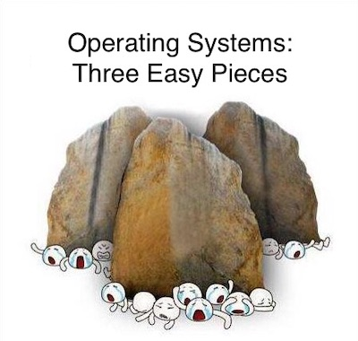
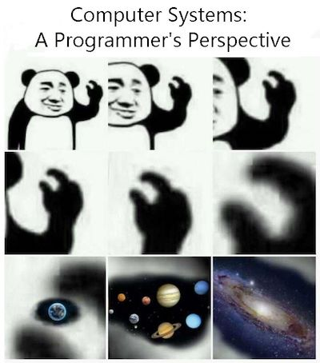

[Yanyan's wiki](/)

 for

  - [操作系统 (2026 春)](/OS/2026/)

# 《操作系统》教科书与参考资料

虽然阅读不可替代，但 Claude Code 这样的 CLI 工具可以真正让你事半功倍。正确地与 AI Agent 对话将是短期内提升自己能力最重要的技能 (虽然幻觉抑制已经得到了长足进步，依然需要对他们的回答请谨慎求证)。然而，现在大语言模型在顶层架构设计方面还有明显的短板，因此我们还是建议大家多读书，吸收前人的智慧：

  - 计算机系统中的很多知识是关联的，因此你对体系结构、编译器、软件工程等领域的理解都会加深对操作系统的理解；反之也一样。认识通常是 “螺旋式上升” 的；
  - 计算机系统不是纸上谈兵，因此学习很多技术是非常重要的，例如如何使用 Linux 系统调用编程、如何使用正则表达式、如何使用 profiler 等等。技术类书籍是掌握这些实践的很好切入点；
  - 每一本书的作者都有他们独到的视角 (某些为了凑数编教材而编教材的除外)。因此也许某个作者的思维方式就特别适合你，读起来就会很轻松。

## 参考书

  - “OSTEP” Remzi H. Arpaci-Dusseau and Andrea C. Arpaci-Dusseau. *[Operating Systems: Three Easy Pieces](http://pages.cs.wisc.edu/~remzi/OSTEP/)*. Arpaci-Dusseau Books, 2018. 课后会有阅读本书的要求。

 (感谢 2017 级同学的投稿)

  - “CSAPP” Randal E. Bryant and David R. O'Hallaron. *Computer Systems: A Programmer's Perspective* (3ed). Pearson, 2017. 全面的手册和参考书；LLM Copilot 阅读效果更佳。

 (感谢 yzh 的投稿)

## 参考书

  - “OSTEP” Remzi H. Arpaci-Dusseau and Andrea C. Arpaci-Dusseau. *[Operating Systems: Three Easy Pieces](http://pages.cs.wisc.edu/~remzi/OSTEP/)*. Arpaci-Dusseau Books, 2018. 至今为止最好的操作系统读物，没有之一，课后阅读。

 (感谢 2017 级同学的投稿)

  - “CSAPP” Randal E. Bryant and David R. O'Hallaron. *Computer Systems: A Programmer's Perspective* (3ed). Pearson, 2017. 全面的手册和参考书；LLM Copilot 阅读效果更佳。

 (感谢 yzh 的投稿)

## 参考资料

### 2\. 编程基础

  - Brian W. Kernighan and Dennis M. Ritchie. *The C programming language* (2nd Edition). Prentice Hall, 1998.
  - [The CERT C Coding Standard: Rules for Developing Safe, Reliable, and Secure Systems](https://wiki.sei.cmu.edu/confluence/display/c/SEI+CERT+C+Coding+Standard). Software Engineering Institute of Carnegie Mellon University, 2016.
  - [pwn.college: Learn to hack](https://pwn.college/)

### 3\. UNIX/Linux 编程

  - Jlevy Hollowa. [*The Art of Command Line*](https://github.com/jlevy/the-art-of-command-line).
  - Gerard Beekmans. [Linux from Scratch](http://linuxfromscratch.org).
  - Harley Hahn. *[Harley Hahn's Guide to Unix and Linux](http://www.harley.com/books/sg3.html)*. McGraw-Hill Higher Education, 2008.
  - Michael Kerrisk. *The Linux Programming Interface: A Linux and UNIX System Programming Handbook*. No Starch Press, 2010.
  - W. Richard Stevens and Stephen A. Rago. *[Advanced Programming in the UNIX® Environment](http://www.apuebook.com/apue3e.html)* (3rd Edition). Addison-Wesley, 2013.

### 4\. 操作系统原理

  - 陈海波、夏虞斌. *[现代操作系统：原理与实现](http://ipads.se.sjtu.edu.cn/mospi/)*. 机械工业出版社, 2020.
  - Thomas Anderson, Michael Dahlin. *Operating Systems: Principles and Practice* (2nd Edition). Recursive Books, 2014.
  - John R. Levine. *[Linkers and Loaders](https://linker.iecc.com)*. Morgan-Kauffman, 1999.
  - Robert Love. *Linux Kernel Development: A Thorough Guide to the Design and Implementation of the Linux Kernel* (3rd Edition). Addison-Wesley, 2010.
  - Marshall Kirk McKusick, Keith Bostic, Michael J. Karels, and John S. Quarterman. *[The Design and Implementation of the 4.4BSD Operating System](https://www.freebsd.org/doc/en/books/design-44bsd/book.html)*. Addison-Wesley Longman, 1996.

### 5\. 开源操作系统实现

  - [xv6](https://pdos.csail.mit.edu/6.828/2018/xv6.html)，十分精简优美的 UNIX 实现
  - [Plan 9](https://9p.io/plan9/)，来自 Bell Labs 的著名原型操作系统
  - [seL4](https://sel4.systems)，在抽象层上构建安全的微内核操作系统内核
  - [Fuchsia](https://fuchsia.googlesource.com)，Google 的微内核操作系统，基于 Zircon 微内核
  - [OpenHarmony](https://gitee.com/openharmony)，“鸿蒙” 操作系统
  - [Linux Kernel](https://www.kernel.org)，巨无霸项目 (新手请绕行)
  - [Android Open Source Project (AOSP)](https://source.android.com)，Android 系统栈

### 6\. Finally, The Friendly Manual

  - Linux manpages (tldr, man, info, ...): [man7.org](https://www.man7.org)
  - [Bourne-Again Shell (bash)](https://www.gnu.org/software/bash/manual/html_node/index.html)
  - [GNU Compiler Collection (GCC)](https://gcc.gnu.org/onlinedocs/)
  - [GNU Debugger (gdb)](https://sourceware.org/gdb/documentation/)
  - [Binutils (ld, as, objdump, and more)](https://sourceware.org/binutils/docs/)
  - [GNU Make](https://www.gnu.org/software/make/manual/html_node/index.html)
  - 作为 “上一个时代长大的人”，jyy 受过过度训练，觉得这些文档很 friendly 了。曾经这可以看作是评价 “system maturity” 的一条标准，类似 “[mathematical maturity](https://blogs.ams.org/matheducation/2019/04/15/precise-definitions-of-mathematical-maturity/)”，但今天每个掌握了正确顶层方法的人，都可以胜任系统编程！但无论如何，浏览这些手册从而对计算机系统建立正确的认识也是非常重要的。

[Creative Commons License: BY-NC 4.0](http://creativecommons.org/licenses/by-nc/4.0/)
[苏 ICP 备 2020049101 号](https://beian.miit.gov.cn/)
