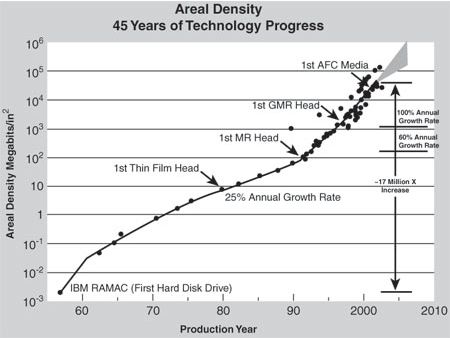
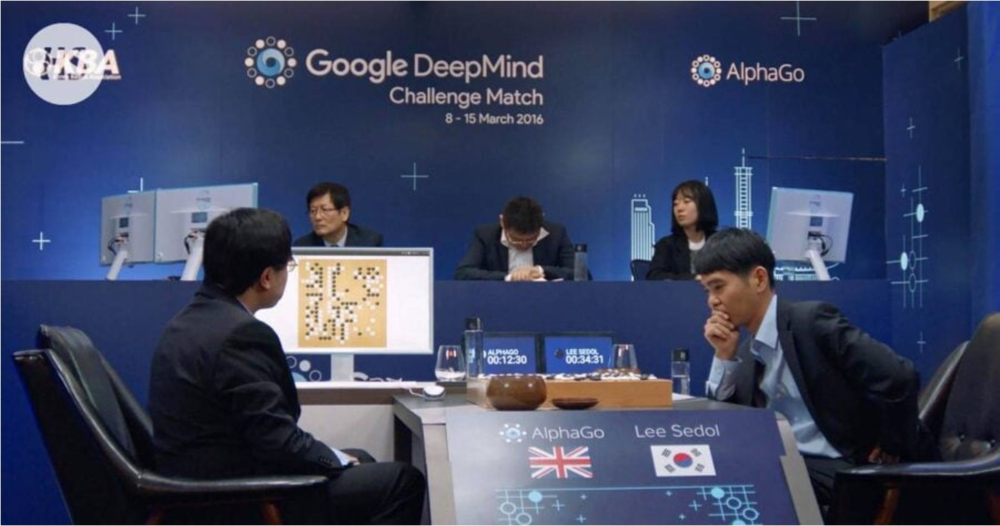
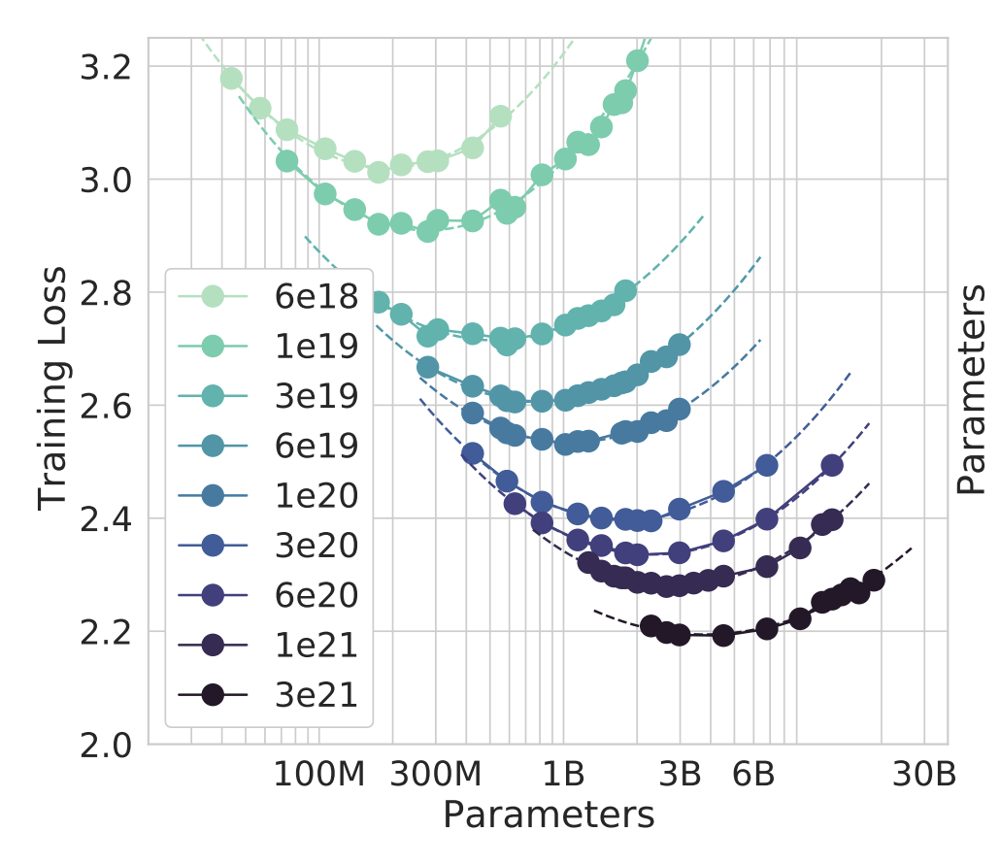

# 第 4 讲：Scaling Law 和 Agentic AI——把“会回答”变成“能做事”

> 原始讲义：[sources/notes/lect04.md](../../sources/notes/lect04.md)  
> 本讲关键词：Hacking Day、LLM、ViT、Chain-of-thought、ReAct、Toolformer、Agentic Loop、Bitter Lesson、Scaling Law、机制与策略、subsystem、protocol、os-minimal
> 前一讲：[硬件视角的操作系统](03-hardware-view.md) · 后一讲：[程序和进程](05-programs-processes.md)

## 0. 本讲定位：从硬件接口走向可扩展的问题求解

第 3 讲把计算机一路拆到 CPU Reset、Firmware、Boot Loader 和 OpenSBI。

那一讲反复出现一个结构：复杂实现被一个稳定边界挡在后面。

```text
应用程序 ──系统调用──> 操作系统
操作系统 ──ISA/SBI──> 硬件/固件
Boot Loader ──启动协议──> 内核
```

只要接口说清楚，接口两边就可以相对独立地开发、替换和调试。

本讲暂时不继续增加一个传统 OS 知识点，而是举行一次 **Hacking Day**：观察大语言模型为什么突然变得有用，以及怎样把它组织成能读项目、改代码、运行工具并检查结果的 Agent。

这并不是和操作系统无关的插曲。

恰恰相反，本讲要把前三讲已经用过的系统方法提升为一般方法：

```text
复杂目标
  → 找到可扩展的资源
  → 建立稳定的机制与接口
  → 把任务拆成可验证的子系统
  → 让人或 Agent 反复执行“计划—行动—观察—修正”
```

课程调整为 3 学时后，约四分之一内容会作为补充选讲，不纳入考试范围；Hacking Day 属于这种扩展内容。

“不考试”不等于“可以略过”：它展示了此后读代码、做实验乃至实现一个最小内核的方法。

下一讲回到《操作系统》正片，讨论程序与进程。

届时会把“一个持续变化、带有记忆、能执行动作的 Agent”换成更严格的词：**运行中的状态机实例**。

## 1. 学习目标与问题地图

学完本讲，你应该能够：

- 解释 2023 年课堂上的编译器案例为什么令人震动，并能用汇编输出核验回答；
- 分别说明“大”“语言”“模型”三个词承担的含义与边界；
- 解释视觉、草稿纸和工具怎样把一次文本补全扩展成 Agentic Loop；
- 区分模型、Agent、工具、工作区和安全机制；
- 用 The Bitter Lesson 解释“可扩展的通用方法”为何常在长期胜过大量手工规则；
- 说清存储密度、GS132、DeepBlue、AlphaGo 和当代模型 Scaling Law 的共同结构与不同条件；
- 阅读简单的幂律图，并识别“相关趋势”不等于“无条件保证”；
- 解释 `Policy is Heuristics, LLM is Policy, Mechanism is King` 与 OS 中“机制/策略分离”的关系；
- 把 prompt engineering 更准确地理解为上下文组织和注意力管理；
- 设计一个由 subsystem、protocol、验收测试和持久化记录组成的 Agent 工作流；
- 解释“Vibe Code 一个 OS Kernel”真正测试了什么，以及失败时应如何分层定位。

问题地图如下：

| 问题 | 最小答案 | OS/系统方法论中的对应物 |
| --- | --- | --- |
| 模型为什么要“大”？ | 宏观复杂性需要足够的信息容量和计算量 | 内存、存储和计算资源决定可实现机制的上限 |
| 语言为什么有用？ | 它压缩了人类共享的概念、关系和经验 | ABI、协议和文档也是协作双方的共同语言 |
| 模型怎样“行动”？ | 生成结构化调用，由外部运行时执行工具并返回观察 | 应用发起 syscall，OS 检查参数、执行并返回结果 |
| Agent 怎样记住进展？ | 有限 context 加上持久工作区和版本历史 | 内存状态加文件系统持久状态 |
| 为什么量会带来质变？ | 成本曲线跨过阈值后，过去不可行的整体方案变得可行 | 能存下全部页面、能搜索更深、能反复生成并测试代码 |
| 代码变便宜后什么更贵？ | 正确规格、稳定接口、证据、安全边界和责任 | 系统调用/ISA、测试、权限、隔离、恢复 |

## 2. Hacking Day：课堂不是成品演示，而是公开实验

普通讲授往往只展示成功路径：代码提前写好，命令提前试过，结论也已经知道。

Hacking Day 刻意改变这一点。

教师给出目标，把大量实现交给 Coding Agent，并允许课堂现场翻车。

这样做至少能观察三件事：

1. 模型在陌生但有明确反馈的系统任务上能走多远；
2. 哪些失败来自模型，哪些失败其实来自模糊的需求、错误的工具链或不清楚的启动协议；
3. 人在代码生成变便宜以后，应该把精力放到哪里。

因此，课堂上的“没有事先准备”不是把随机输出当工程方法。

它是一次带风险的现场测量：输入是项目、指令、工具和模型；输出不仅是代码，还包括每一步日志、错误和修正轨迹。

系统实验也总是如此。

如果只看最后屏幕上有没有出现字符，就会把编译、链接、加载、执行和设备输出混在一起；如果保存每一步证据，失败反而能暴露真实边界。

## 3. 第一次感受 ChatGPT 的威力：编译器会怎样优化？

讲义回到 2023 年 2 月 16 日，即 ChatGPT 发布两个多月后的课堂。

当时的问题不是常识问答，而是一段带 GNU 内联汇编约束的 C 代码：

```c
int return_1(void) {
  int x;
  for (int i = 0; i < 100; i++) {
    // 编译器为 %0 选择一个具体汇编操作数
    __asm__("movl $1, %0" : "=g"(x));
  }
  return x;
}
```

GPT-3.5 能给出正确分析，冲击来自它跨越了多层知识：C 循环、编译器优化、GNU inline asm、约束和目标汇编。

当很多工作还在为单项任务微调 BERT 时，一个统一的对话模型已经能组合这些知识，因而让人产生“世界变了”的感受。

### 3.1 先不用 AI：逐层读这段代码

从 C 层看，循环执行 100 次，每次都让扩展汇编产生一个输出 `x`，最后返回最后一次输出。

`"=g"(x)` 可以拆成：

- `=`：这是只写输出；旧的 `x` 不作为输入；
- `g`：允许编译器选择一般操作数，在这个例子中通常是寄存器或可写内存；
- `%0`：模板中第 0 个操作数，由编译器替换成它实际选择的位置。

汇编模板把立即数 1 写入 `%0`，所以在目标机器真正执行后，最后返回 1。

但必须注意：**编译器把模板视作不透明文本，并不会因为看见 `movl $1` 就在 C 语义里推导出 `x == 1`。**

它知道的是约束：这段 asm 定义了 `x`，没有显式输入，没有声明 `memory` clobber，也没有 `volatile`。

因此，优化器可以判断多次输出里只有最终到达 `return` 的值有用，并可能移动、合并或删除不需要的非 `volatile` asm 实例。

若把循环体换成普通的 `x = 1`，优化器理解完整语义，通常会把整个函数直接变成“返回 1”。

若把 asm 声明为 `volatile`，则每一次汇编都必须作为可观察动作保留；编译器仍能展开或改写循环控制，但不能把 100 次动作缩成一次。

GCC 和 Clang、不同版本与目标架构可能产生不同的合法汇编。

所以“完美回答”不应是死背某一份输出，而应是：说清编译器被告知了什么，再用当前工具链验证。

### 3.2 实验 1：让编译器裁判模型的答案

依赖：Linux、GCC、`diff`；不需要 root。

```bash
work=$(mktemp -d) || exit 1
test -d "$work" || exit 1

for opt in 0 2; do
  gcc -O"$opt" -S -x c -o "$work/asm-O$opt.s" - <<'EOF'
int return_1(void) {
  int x;
  for (int i = 0; i < 100; i++) {
    __asm__("movl $1, %0" : "=g"(x));
  }
  return x;
}
EOF
done

gcc -O2 -S -x c -o "$work/volatile.s" - <<'EOF'
int return_1(void) {
  int x;
  for (int i = 0; i < 100; i++) {
    __asm__ volatile("movl $1, %0" : "=g"(x));
  }
  return x;
}
EOF

gcc -O2 -S -x c -o "$work/plain-c.s" - <<'EOF'
int return_1(void) {
  int x;
  for (int i = 0; i < 100; i++) x = 1;
  return x;
}
EOF

printf 'temporary files: %s\n' "$work"
grep -nE 'return_1:|movl[[:space:]]+\$1|ret' "$work"/*.s
diff -u "$work/asm-O0.s" "$work/asm-O2.s" || true
```

观察重点不是寄存器恰好叫 `%eax` 还是 `%edx`，而是三个不变量：

- `plain-c.s` 通常只剩一次返回常量的动作；
- 非 `volatile` asm 在 `-O2` 下可能只保留对最终值有贡献的实例；
- `volatile.s` 中应保留 100 次动态 asm 执行，虽然编译器可能用循环展开让模板在汇编文件中出现两次或更多次。

可以再用 Clang 重复实验。

若两个编译器不同，不要问“谁错了”，先问两份输出是否都满足约束和 C/扩展汇编语义。

### 3.3 这个案例真正教了什么

第一，LLM 能跨越传统课程边界组合知识。

第二，回答仍然必须落到可执行证据；`gcc -S`、`objdump` 和测试才是裁判。

第三，提问者必须区分层次：ISO C 没有 `asm`，这里使用的是编译器扩展；汇编模板、编译器约束和硬件执行也不是同一层语义。

这正是 OS 学习的基本纪律：模型可以提出解释，工具把解释变成可证伪的预测。

## 4. “大；语言；模型”：三个词分别解决什么

讲义故意把词拆开，因为三个部分缺一不可。

### 4.1 “大”：宏观复杂性需要信息容量

讲义借用 Schrödinger《生命是什么》中的问题：原子为什么如此小，而生命体为什么如此大？

一个局部、微小的组成单元能承载的稳定状态和信息有限。

宏观结构由巨量组成单元构成后，才可能形成冗余、层级、记忆和对噪声稳定的规律。

对模型而言，“大”可以包括参数、训练数据、训练计算、上下文、推理计算和外部工具资源。

参数更多并不自动等于更聪明，但容量不足时，模型不可能同时容纳语言、代码、物理常识和大量长尾模式。

这与 OS 的资源观一致：一个地址空间抽象再漂亮，也不能在完全没有物理内存、存储和 CPU 时间时凭空工作。

机制能组织资源，不能取消资源下界。

### 4.2 “语言”：人类共同压缩出的世界描述

语言并不只是词典。

人类用它记录物体、因果、规范、程序、失败经验和协作关系；千年文本因此包含了一个由人类感官与社会实践共同对齐的世界模型。

讲义说“无法和外星人对齐”，强调的是共同背景：如果对方的感官、尺度、目标和概念体系完全不同，同一个词未必指向同一种经验。

不过，语言模型不是精确物理模拟器。

文本可能缺失细节、互相矛盾或带有偏见；一句“磁盘已经落盘”也不能替代 `fsync` 的实际语义和测量。

语言提供高带宽先验，实验负责校准现实。

### 4.3 “模型”：用统一策略复用共同结构

传统系统可能为翻译、问答、代码补全、分类分别训练模型。

大语言模型的变化是：大量任务可以通过同一个模型、不同上下文和工具协议完成。

这里的“只要一个模型”应理解为**统一的通用策略核心**，而不是整个系统只剩一个神经网络文件。

真实 Agent 仍需要 tokenizer、推理运行时、权限系统、工具、存储、检索、测试与监控。

同样，OS 内核提供统一系统调用面，不等于用户空间数据库、编译器和浏览器都消失了。

## 5. 大语言模型的进化：眼睛、草稿纸和计算器

讲义用拟人化部件说明能力怎样被接到语言核心上。

### 5.1 “眼睛”：ViT 与多模态输入

[Vision Transformer](https://arxiv.org/abs/2010.11929) 把图像切成 patch，并把 patch 表示为类似 token 的序列交给 Transformer 处理。

更一般地，图像、声音或传感器数据可以编码为向量，再与语言表示对齐或通过跨模态注意力交互。

于是模型不只读取报错文本，还可以读取截图、波形、性能图和电路照片。

从系统角度看，传感器接入仍然需要驱动、格式转换和权限。

“有眼睛”不是模型直接触碰硬件，而是外围机制把设备状态编码成模型可消费的输入。

### 5.2 “草稿纸”：Chain-of-thought 与显式计划

早期常用提示是 “think step by step”：让模型生成中间步骤，而不是立刻猜最终答案。

中间步骤提供了更多 test-time compute，也让长问题能被拆成若干较短决策。

但一串看似流畅的推理文字仍可能自洽地犯错。

工程上更可靠的“草稿纸”是可检查的外部产物：任务列表、假设、测试结果、补丁和失败日志。

有时人需要先给计划；更强的推理模型也可以提出计划。

无论计划来自谁，都应附带完成条件和反例，而不是把“我将仔细检查”当成已经检查。

### 5.3 “计算器”：ReAct、Toolformer 与可验证动作

模型未必应该在参数里心算 `123 * 456`。

它可以产生结构化工具调用，让 Python 算出 `56088`，再把结果作为 observation 放回上下文。

[ReAct](https://arxiv.org/abs/2210.03629) 的核心是交替进行推理、行动和观察；[Toolformer](https://arxiv.org/abs/2302.04761) 探索模型怎样学习何时调用工具。

工具于是成为 Agent 的“手和脚”：

- 搜索文件，得到真实代码位置；
- 调用编译器，得到语法和类型错误；
- 运行测试，得到可复现通过/失败；
- 调试进程，得到寄存器、栈和系统调用轨迹；
- 调用计算器，避免语言概率替代确定运算。

这和系统调用非常相似。

模型只提出“动作名称 + 参数”；可信运行时负责验证参数、施加权限和超时、真正执行，再返回结果。

绝不能因为模型能生成 `rm`、`mount` 或网络请求，就让它拥有无限权限。

## 6. LLM Agents：不是一次回答，而是一个闭环

讲义用“活生生的人”形容具备感官、草稿纸和工具后的 LLM。

这是强调它能试错和完成长任务的工程比喻，不是关于意识的科学结论。

一个更精确的 Agent 最小模型是：

```text
状态：目标 + 上下文 + 工作区 + 历史观察 + 剩余预算
策略：LLM 根据当前状态提出下一动作
机制：运行时检查并执行动作
迁移：把工具结果写回状态
终止：验收条件满足，或预算/安全边界触发
```

用伪代码表示：

```python
while not acceptance_tests_pass():
    observation = inspect_workspace_and_last_result()
    action = model.plan_next_action(observation)
    result = sandboxed_dispatch(action, timeout=30)
    append_to_journal(action, result)
    if repeated_same_failure_too_many_times():
        revise_plan_or_escalate()
```

这段循环里，LLM 是策略，`sandboxed_dispatch`、权限、超时和日志是机制。

Agent 能犯错并不可怕；可怕的是错误没有反馈、动作不可回滚或终止条件根本不存在。

### 6.1 从 thef\*\*k 到通用 Agent

在 ChatGPT 之前，[thef\*\*k](https://github.com/nvbn/thefuck) 一类工具会根据上一条 shell 错误推荐修正命令。

它把“观察失败—匹配规则—建议动作”做成了很窄的闭环。

LLM Agent 的变化不是发明了纠错，而是用通用策略替代大量任务专用匹配，并能连续处理跨文件、跨工具的状态。

窄工具仍有价值：规则少、边界清楚、结果可预测。

通用 Agent 覆盖面更广，但也更需要验证和隔离。

### 6.2 记忆：Context 不是完整工作区

模型一次推理看到的是有限 context。

大型项目的源码、构建产物、Git 历史和测试日志远大于一次上下文，因此 Agent 需要把重要状态保存到工作区。

讲义把它概括为：

```text
memory = Context + Git repository
```

这里的 Git 不只是备份。

它提供可比较的快照、变更归属和回滚点；文件则让下一轮推理或另一个 sub-agent 能重新读取事实。

“死亡循环”比喻也由此而来：每次模型调用像在新一轮醒来，如果没有持久记录和失败指纹，它可能反复尝试同一个错误方案。

### 6.3 计划、执行、检查和复用

一个可扩展的 Agentic Loop 通常包含：

1. 把目标拆成有输入、输出和验收条件的子任务；
2. 一次只改变少量状态；
3. 调用工具执行，而不是声称已经执行；
4. 读取退出码、标准错误、差异和测试报告；
5. 失败时更新假设，不盲目重复；
6. 将成熟流程封装为 tool、skill 或 sub-agent 任务。

sub-agent 的价值来自可并行且边界清楚的任务，不来自名字更多。

如果两个 Agent 同时随意改同一接口，速度越快，冲突也越快。

## 7. The Bitter Lesson：应把什么写死，什么交给扩展

Richard Sutton 的 [The Bitter Lesson](https://www.cs.utexas.edu/~eunsol/courses/data/bitter_lesson.pdf) 总结了一条长期反复出现的经验：能够持续利用更多计算和数据的通用搜索、学习方法，往往最终超过由人精心写入大量领域规则的方法。

讲义引用的段落强调：外部世界的具体复杂性无穷无尽，不应幻想用少量漂亮规则把“心智内容”全部写死；应构建能发现并吸收复杂性的元方法。

“Bitter” 在于，研究者引以为豪的巧妙领域知识可能得到短期领先，却挡不住更一般的方法沿计算曲线持续改进。

但它不等于以下口号：

- 不是“领域知识毫无用处”；搜索空间、数据和评价函数仍由知识塑造；
- 不是“参数越多必然越好”；数据质量、优化、架构和系统瓶颈都会限制收益；
- 不是“正确性可以交给概率”；内核权限检查、文件系统一致性和协议仍需硬约束；
- 不是“任何烂代码都值得堆算力”；必须找到确实能规模化且能测量进步的方向。

对 OS 而言，最自然的对应是**机制与策略分离**。

机制提供隔离、计时、页表、系统调用和恢复边界；策略可以是规则、搜索、学习器或 LLM。

策略可以快速进化，机制必须让错误策略无法随意破坏整个系统。

## 8. “量变引起质变”（一）：存储密度与从零开始

### 8.1 当存储增长快过网页增长

讲义用 1980 年代以来的存储趋势讲了一个故事：如果存储系统的增长速度长期高于网络内容的增长速度，那么“保存和索引几乎全部公开页面”会从幻想变成工程方案。



这里要比较的不是某一年两条曲线的绝对数字，而是增长率和成本：

```text
需要保存的网页字节数 W(t)
可负担的存储容量 S(t)

当 S(t) / W(t) 跨过工程阈值后，
全量抓取、建索引和重复分析才可能成为常规基础设施。
```

严格说，今天意义上的 Web 在 1980 年代末才出现；幻灯片把长期存储趋势作为后来网页爆发的前史。

而且容量只是必要条件，不是 Google 的充分解释：还需要爬虫、索引、排序、分布式存储、故障恢复和商业组织。

质变发生在整条系统成本曲线跨过阈值时。

这也预告课程后半段：文件系统和数据库不是“把字节放到盘上”就结束，而是在规模上升后处理命名、并发、一致性和故障。

### 8.2 Loongson GS132 的“烂代码”故事

讲义的另一个故事是 Loongson GS132：第一版代码也许不漂亮，但它先运行起来，后来又逐步变快。

这则故事的重点不是赞美技术债，而是**从零到一必须先建立可工作的反馈回路**。

在没有可运行系统时，任何性能讨论都缺少真实测量对象；有了能启动、能测试的基线，才可以持续替换模块并比较结果。

适用的顺序是：

```text
最小可运行版本
  → 可重复测试
  → 找到瓶颈
  → 局部优化
  → 保持接口与正确性
```

若“先跑起来”之后没有测试、文档和重构，烂代码只会把维护成本也 scale 起来。

## 9. “量变引起质变”（二）：DeepBlue 与 Elo

DeepBlue 的故事把规模变量换成搜索能力。

棋类搜索树分支很多；多向前搜索一层，节点数可能成倍乃至指数增加。

更强硬件带来每秒更多节点，更好的剪枝和评价函数则让有限节点更有价值。

因此 DeepBlue 不是“只有蛮力”，而是专用硬件、搜索、剪枝、评价和棋类知识共同组成的可扩展系统。


讲义链接 [Elo ranking system](https://www.attackingchess.com/understanding-the-elo-rating-system-in-chess/) 是为了引入可比较的能力尺度。

Elo 本质上根据对局结果估计相对强弱；它不是智能的绝对单位，也依赖对手分布和比赛条件。

但有了统一度量，就能问出 Scaling 问题：计算、搜索深度或算法改进增加后，胜率/Elo 是否稳定提高？边际收益何时下降？

系统优化也需要类似尺度。

“更快了”应变成吞吐、延迟、IPC、缺页次数或测试通过率，而不是主观感觉。

## 10. “量变引起质变”（三）：AlphaGo

2016 年 AlphaGo 对局让许多人第一次现场感到这种跨阈值变化。



与 DeepBlue 相比，AlphaGo 把学习得到的 policy/value 与树搜索结合，并利用大量对局和自我对弈形成反馈回路。

可以把二者的共同结构写成：

```text
更多计算/数据
  → 更好的候选评估或更深搜索
  → 更多高质量轨迹
  → 更强策略
  → 生成下一轮更有价值的数据
```

它们的差别也很重要：DeepBlue 高度专用于国际象棋；AlphaGo 的学习组件减少了一部分手工评价，但仍工作在规则明确、反馈清楚的围棋环境。

从封闭棋盘迁移到开放软件工程，反馈更稀疏、错误代价更高，所以 Agent 更依赖测试、sandbox 和协议。

## 11. 今天的 Scaling Law：为什么敢训练更大的模型

所谓 Scaling Law，不只是“大家觉得更大更好”，而是从多次受控实验中拟合出的经验关系。

[Kaplan 等人的论文](https://arxiv.org/pdf/2001.08361) 研究模型规模、数据、计算与损失之间的幂律趋势；[Chinchilla 论文](https://arxiv.org/abs/2203.15556) 进一步强调在固定训练计算下应平衡参数量和训练 token，很多大模型实际上训练数据不足。

一个只表达结构、不代表固定系数的简化式是：

```text
L(N, D) ≈ L∞ + a · N^(-α) + b · D^(-β)
```

其中：

- `L` 是验证损失；
- `L∞` 是当前数据分布和设定下不可约或尚未消除的部分；
- `N` 是参数规模；
- `D` 是训练数据量；
- `a, b, α, β` 必须由实验拟合，不是自然常数。

在双对数坐标中，单一幂律部分近似直线。

这让团队能先训练许多小模型，拟合趋势，再估计一次昂贵大训练是否值得，而不是完全凭直觉下注。



讲义说“我们甚至不知道 optimal 在哪里，人类就造出智能机器了”，强调工程探索常先于完整理论。

生物进化也没有全局设计者，人类更不是对所有环境和目标的最优解；“不是最优”与“已经很强”可以同时成立。

### 11.1 实验 2：在 log-log 坐标中识别幂律

下面使用一组教学数据，不是对 Kaplan/Chinchilla 实验的复现。

假设 `resource` 每次翻倍，测得扣除损失下限后的 `excess_loss`：

```bash
python3 - <<'PY'
import math

points = [
    (1, 0.800),
    (2, 0.570),
    (4, 0.402),
    (8, 0.286),
    (16, 0.201),
]

xs = [math.log(x) for x, _ in points]
ys = [math.log(y) for _, y in points]
x_bar = sum(xs) / len(xs)
y_bar = sum(ys) / len(ys)
den = sum((x - x_bar) ** 2 for x in xs)
if den == 0:
    raise SystemExit("resource values must not all be equal")
slope = sum((x - x_bar) * (y - y_bar) for x, y in zip(xs, ys)) / den
intercept = y_bar - slope * x_bar

print(f"fitted excess_loss ~= {math.exp(intercept):.3f} * resource^({slope:.3f})")
for resource in (32, 64):
    pred = math.exp(intercept) * resource ** slope
    print(f"resource={resource:2d}, predicted excess loss={pred:.3f}")
PY
```

预期指数接近 `-0.5`：资源扩大 4 倍，超额损失大约减半。

随后可以做三个分析练习：

1. 把最后一点改成 `0.35`，观察单次异常如何改变外推；
2. 给所有损失先加 `0.2`，却不扣除这个下限，观察 log-log 直线怎样弯曲；
3. 同时记录训练时间和电费，判断“损失继续下降”是否等于“值得继续扩大”。

这就是实验科学的含义：Scaling Law 是特定范围内对测量数据的压缩，不是无限外推许可证。

### 11.2 边界：损失曲线不是全部能力

还应区分：

- 平均训练/验证损失与某项用户任务成功率；
- 训练时 scaling 与 Agent 在测试时反复搜索、调用工具的 scaling；
- 参数规模与实际内存带宽、通信、功耗和推理延迟；
- 更多数据与更高质量、合法授权且不重复的数据；
- 基准分数与真实系统中的可靠性、安全性和可维护性。

能力可能在某个任务阈值附近显得“突然出现”，但底层指标仍可能平滑变化。

反过来，平均能力提高也不保证罕见的灾难性错误消失。

## 12. 世界变了：Policy 会变，Mechanism 更重要

讲义改写 Jim Gray 2006 年的句子：

> Heuristics is dead, Policy is Heuristics, LLM is Policy, Mechanism is King.

原句 “Tape is Dead, Disk is Tape, Flash is Disk, RAM Locality is King” 描述存储层次角色随技术曲线迁移：新介质接管旧介质的位置，旧介质则下沉为更冷的一层。

改写后的意思也不是启发式真的消失，而是角色迁移：

- 过去手写的一堆 heuristics，可以被更统一的 policy 吸收；
- LLM 可以成为产生决策、代码和工具调用的 policy；
- 当 policy 便宜且变化快时，真正稀缺的是约束它的 mechanism。

这与 OS 教材中的经典区分高度一致：

| Policy（做什么选择） | Mechanism（如何安全地做到） |
| --- | --- |
| 选哪个任务先执行 | 时钟中断、上下文切换、运行队列操作 |
| Agent 要改哪个文件 | 路径权限、sandbox、原子写入、版本控制 |
| 是否重试一次测试 | 进程创建、超时、资源配额、退出码采集 |
| 选择哪个生成补丁 | 补丁应用边界、测试、审查和回滚 |

如果把策略和机制混在一起，模型每改变一次主意，都可能破坏底层安全不变量。

### 12.1 正确理解“量变引起质变”

错误理解是：只要重复次数够多，任何低水平工作都有价值。

正确问题是：**哪个方向能持续利用新增资源，并且有可信反馈？**

Agentic AI、OpenClaw、Agent Skills 等被讲义列为“能走量”的候选，是因为任务可以分解、执行、检查和复用。

若没有自动测试，生成一万份代码只会制造一万个待审查对象；若验收反馈便宜可靠，才能让更多 test-time compute 转化为更高成功率。

### 12.2 Code is cheap，不等于 Correctness is cheap

过去难以规模化的高级任务，如跨项目代码修改、论文逻辑审查和实验复现，现在可以由 Agent 批量尝试。

讲义用一个激进例子说明：先检查论文是否有致命逻辑错误，再尝试复现实验，对严重不吻合之处提出证据。

真正能 scale 的流程必须把“怀疑”与“结论”分开：

```text
提出风险点
  → 定位原文和假设
  → 构造复现实验
  → 保存环境与原始结果
  → 排除实现/随机性差异
  → 才能讨论结论是否成立
```

Agent 可以降低执行成本，却不能授权无证据指控，也不能替代研究伦理和人工责任。

## 13. 打开 Agentic AI：Prompt 是注意力预算的布局

讲义提醒：大模型的核心架构是 Transformer，attention 决定当前 token 如何汇聚上下文中的信息。

因此，prompt engineering 可以理解成 **attention engineering**：把目标、约束、证据和当前问题安排到模型更容易关联的位置。

这是一种有用的工程比喻，但不是说我们能直接手工设置每个 attention weight。

长提示词在早期常见，是因为用户试图一次写入角色、背景、格式、规则和例子。

长度本身不保证效果；无关材料会争夺有限上下文，矛盾规则还会让输出摇摆。

一个更可执行的任务描述通常包括：

```text
目标：最终要得到什么
范围：允许读写哪些对象
不变量：绝不能破坏什么
证据：应先读哪些事实
验收：运行哪些命令、预期什么结果
交付：输出补丁、报告还是可执行物
```

模型没有合适上下文时容易输出“车轱辘话”：复述目标、列出泛化建议，却不读取项目和执行验证。

instruct fine-tuning 和 RLHF 倾向于产生友好、完整的对话回答，但工程任务要求的是外部状态变化和证据。

解决方法不是一句更凶的 prompt，而是把任务接到工具和验收循环。

### 13.1 从 “think step by step” 到任务分解

“Think step by step” 曾经帮助模型把推理摊开；后来的推理模型会使用更多内部推理计算。

对软件工程更关键的是把长任务分成可独立检查的单元：

```text
“实现一个 OS”
  ├─ 确认目标架构和启动协议
  ├─ 生成可重现构建
  ├─ 建立入口、栈和链接布局
  ├─ 实现一个可观察输出
  ├─ 加入 panic/异常路径
  └─ 用模拟器自动验收
```

单 context 推理容易在后半程遗忘前面的细节。

Agent 则能把每个结果落到文件和测试，再从工作区恢复状态；成熟子流程还可以复用为 skill 或交给 sub-agent。

分解也有代价：接口定义错误会让每个子任务都“局部正确、整体失败”。

所以分解之后必须写 protocol 和集成测试。

## 14. 软件工程中的复杂性分解

讲义给出两条已经在前三讲出现的抽象链：

```text
软件生态 ──系统调用── 操作系统实现
操作系统/软件生态 ──指令集── 硬件实现
```

系统调用把“打开文件、创建进程、映射内存”等需求变成有限 API。

ISA 把软件需要的计算与控制变成有限指令语义。

Linux 内核可以重写调度器而不重新编译所有应用；处理器可以换微架构而继续执行同一 ISA 二进制。

抽象并没有消灭复杂性，而是规定复杂性由哪一边负责。

### 14.1 函数封装为何不总够用

函数调用已经能自由组合和复用，例如：

```text
register_user(name=..., gender=...)
```

问题是，一旦参数、返回值或语义改变，所有调用点都可能需要同步修改。

LLM 能快速完成机械修改，却也可能：

- 漏掉动态调用或字符串协议；
- 同时改两边，使旧测试无法暴露兼容性破坏；
- 为绕过类型错误复制逻辑；
- 让一个小接口变化扩散成难以审查的大补丁。

生成速度只缩短了“写代码”阶段，没有消除变更的 blast radius。

### 14.2 Subsystem 与 protocol

更强的分解是让子系统拥有自己的状态和职责，只通过版本化 protocol 通信。

一个好 protocol 至少要说明：

- 消息或文件的 schema；
- 谁创建、谁消费、谁拥有修改权；
- 成功、失败和重试如何表示；
- 重复请求是否幂等；
- 何时算提交完成；
- 协议升级时怎样兼容旧版本。

syscall 和 ISA 就是这种稳定 protocol 的典型。

函数调用可以是 subsystem 内部实现，protocol 则保护 subsystem 之间的边界。

### 14.3 为什么文件系统适合做 Agent protocol

讲义提到 Vibe-learning 和基于文件系统的 protocols。

文件有几个朴素但强大的性质：持久、可枚举、可 diff、可被不同语言读取，还能借助目录权限、原子 `rename` 和 Git 管理。

例如可以约定：

```text
tasks/004.request.md      # 尚未领取的任务
claims/004               # 某 worker 的领取记录
work/004.response.tmp     # 尚未提交的临时结果
done/004.response.md      # 原子提交后的结果
evidence/004.sha256       # 结果摘要
```

模型无需记住所有历史，只需读取当前目录状态。

代价是需要处理并发领取、部分写入、权限、垃圾文件和 schema 演进；这些恰好都是 OS 与文件系统问题。

### 14.4 实验 3：用目录实现一个最小 Agent 交接协议

依赖：POSIX shell、`sha256sum`；不需要模型和 root。

```bash
set -eu
proto=$(mktemp -d) || exit 1
test -d "$proto" || exit 1
mkdir -p "$proto/tasks" "$proto/claims" "$proto/work" "$proto/done" "$proto/evidence"

printf '%s\n' \
  'protocol: 1' \
  'task: explain why a syscall is an abstraction boundary' \
  'acceptance: response contains both mechanism and policy' \
  >"$proto/tasks/004.request.md"

# noclobber 让第一个创建 claim 的 worker 获得任务。
claim() (
  set -C
  : >"$proto/claims/004"
) 2>/dev/null

if claim; then
  printf '%s\n' \
    'A syscall is a protected mechanism boundary.' \
    'Kernel policy decides how the requested resource is allocated.' \
    >"$proto/work/004.response.tmp"
  grep -qi mechanism "$proto/work/004.response.tmp"
  grep -qi policy "$proto/work/004.response.tmp"
  mv "$proto/work/004.response.tmp" "$proto/done/004.response.md"
  (cd "$proto/done" && sha256sum 004.response.md) \
    >"$proto/evidence/004.sha256"
fi

(cd "$proto/done" && sha256sum -c "$proto/evidence/004.sha256")
find "$proto" -maxdepth 2 -type f -print | sort
printf 'protocol workspace kept at %s\n' "$proto"
```

预期看到 `004.response.md: OK`，并看到 request、claim、done 和 evidence 四类状态。

关键状态变化是：

1. `open`/创建 claim 决定任务所有权；
2. worker 先写临时文件，避免消费者读到半份结果；
3. 同一文件系统内的 `rename` 让发布动作表现为原子名称切换；
4. checksum 让消费者验证内容没有在交接后悄悄变化。

可以同时在两个终端运行 `claim`，观察只有一个成功。

这个玩具协议仍不完美：worker 崩溃后 claim 如何过期？恶意 worker 能否伪造结果？跨文件系统 `mv` 是否仍是单次原子 `rename`？

这些问题说明 Agent orchestration 的底层并不神秘，它建立在进程、文件、权限、锁和持久化语义上。

## 15. Hacking Day 的课堂尝试：Vibe Code 一个 OS Kernel

讲义最后把方法推向一个大胆目标：在准备好的 `os-minimal` 框架中，把实现尽量交给 AI，现场测试模型能否生成一个最小 OS Kernel。

框架用 `CLAUDE.md`（同类项目也常使用 `AGENTS.md`）描述设计思路、架构和工作流程；讲义说明该文档由 GPT-5.4 生成。

真实大项目不应把所有规则堆进一个无限增长的文件，而应按子系统拆分文档，让每个 Agent 只加载相关契约。

课程目标是“不依赖任何外部库函数和代码”。

这句话需要分层理解：

- 内核运行时不能假设 `printf`、`malloc`、`pthread` 或宿主 OS syscall 已经存在；
- 它仍然需要编译器、汇编器、链接器、固件/引导环境和模拟器来构建与启动；
- 写屏、串口或关机都必须遵守目标机器的设备/固件协议；
- C 的 freestanding 模式只取消 hosted environment 假设，不会自动生成启动代码。

### 15.1 最小内核也有一整条契约链

即使目标只是显示 `OS`，也至少要回答：

```text
CPU 从哪里开始执行？
  → Firmware/Boot Loader 以什么格式加载镜像？
  → 链接器把入口放到了哪个地址？
  → 当前处于什么位宽和特权级？
  → 栈在哪里，BSS 是否清零？
  → 输出设备的地址和协议是什么？
  → 成功后如何停机，测试如何知道成功？
```

这正好复用第 3 讲的全部知识。

AI 可以很快生成 `kernel.c`，但如果它假设 BIOS 已经进入 x86-64 long mode，而框架实际给的是 16 位入口，代码一条也执行不了。

### 15.2 实验 4：构造 freestanding ELF，并证明它还不能启动

依赖：x86-64 Linux 上的 GCC、GNU `ld`/`readelf`/`nm` 以及 `file`；不需要 root。

```bash
set -eu
kdir=$(mktemp -d) || exit 1
test -d "$kdir" || exit 1

gcc -m64 -ffreestanding -fno-pie -fno-stack-protector \
  -fno-asynchronous-unwind-tables -fcf-protection=none \
  -Wall -Wextra -Werror -c -x c -o "$kdir/kernel.o" - <<'EOF'
typedef unsigned short u16;

__attribute__((noreturn)) void kmain(void) {
  volatile u16 *const vga = (volatile u16 *)0xb8000;
  vga[0] = (u16)(0x0700u | (unsigned char)'O');
  vga[1] = (u16)(0x0700u | (unsigned char)'S');
  for (;;) __asm__ volatile("hlt");
}
EOF

ld -m elf_x86_64 -nostdlib -static -e kmain -Ttext 0x100000 \
  -o "$kdir/kernel.elf" "$kdir/kernel.o"

file "$kdir/kernel.elf"
readelf -h "$kdir/kernel.elf" | grep -E 'Class:|Machine:|Entry point'
readelf -l "$kdir/kernel.elf"
nm -n "$kdir/kernel.elf" | grep ' kmain$'
printf 'artifact kept at %s\n' "$kdir/kernel.elf"
```

预期 `readelf` 显示 ELF64、x86-64，入口约为 `0x100000`，`nm` 也能找到 `kmain`。

但不要直接声称“OS 已完成”。

这个 ELF 只是一个 freestanding 可执行制品：

- Legacy BIOS 不会自动解析并把它的 segment 加载到 `0x100000`；
- CPU Reset 后也不是天然处于该 C 代码要求的 64 位环境；
- 代码没建立自己的栈、GDT、页表或异常处理；
- VGA 文本内存只在特定 PC 兼容环境和模式下有这个含义；
- `hlt` 在中断开启时未必永久停住 CPU。

`readelf` 证明了“编译链接层的契约”，没有证明“启动协议层的契约”。

下一步应让 Boot Loader 明确装载 ELF，或按框架要求生成可引导镜像，并在 QEMU 中用串口标记和超时做验收。

这正是适合交给 Agent 的下一子任务，因为输入、输出和失败证据已经明确。

### 15.3 怎样为 os-minimal 设计 Agent 分工

一个可行的分解是：

| 子任务 | 输入契约 | 输出/验收 |
| --- | --- | --- |
| 启动与链接 | 目标 ISA、固件和加载地址 | `readelf` 入口/segment 符合约定 |
| 控制台 | 串口或显示设备协议 | 模拟器输出唯一成功标记 |
| 运行时 | 栈、BSS、基本整数类型 | C 入口稳定执行，无 hosted libc 引用 |
| 异常与 panic | trap frame 和错误编码 | 故意触发后打印确定错误并停机 |
| 构建/测试 | 工具链版本和 QEMU 命令 | 一条命令构建，超时内通过/失败 |
| 审查 | 前述所有契约 | 检查未解析符号、危险指令和隐式假设 |

适合封装为 skill 的则是重复流程，例如：

- 检查 ELF header、program header 和未定义符号；
- 运行 QEMU，截取串口日志并强制超时；
- 对照目标 ISA 手册审查入口汇编；
- 把一次失败归类为 compile/link/load/run/device/test 哪一层。

### 15.4 “一个人就是产品经理”到底意味着什么

Agent 能生成设计、代码、测试和文档后，一个人可以协调过去需要多人完成的原型。

但产品经理角色不是只说一句“做个 OS”。

人仍需决定：

- 用户真正需要什么；
- 哪些假设可以接受；
- 哪些破坏具有不可逆风险；
- 怎样衡量完成；
- 失败后继续投入是否值得；
- 谁对发布结果负责。

Code is cheap 以后，判断、接口、验证和责任反而占据更高比例。

### 15.5 现场翻车应怎样读

若 Agent 没完成，不能只得出“模型不行”。

应按层保存最小证据：

| 阶段 | 证据 | 常见错误 |
| --- | --- | --- |
| 编译 | 编译器诊断、预处理结果 | freestanding 头文件、目标选项、内联汇编约束 |
| 链接 | map、`readelf`、未定义符号 | 入口、地址、section、隐式 runtime |
| 镜像 | 大小、magic、校验和 | 格式不符合固件/Boot Loader 契约 |
| 加载 | QEMU trace、断点、内存检查 | 程序没被放到预期地址 |
| 执行 | PC、寄存器、异常号 | 位宽、特权级、栈、页表错误 |
| 输出 | I/O trace、串口日志 | 设备地址、初始化、轮询条件错误 |
| 验收 | 退出码、超时、唯一标记 | 内核成功但测试不会判定，或假阳性 |

公开失败的教学价值，就在于它迫使我们看见这些边界，而不是只欣赏最终动画。

## 16. 本讲机制推导：为什么 Agentic AI 与 OS 是同一种系统问题

现在可以把全讲压缩成一条推导。

1. 单次语言补全只能生成建议，不能改变外部世界；
2. 接入视觉和工具后，模型能够观察并执行动作；
3. 长任务需要多轮动作，因此必须保存状态、计划和日志；
4. 多轮和多 Agent 会引入并发、冲突、权限、部分失败和恢复；
5. 这些问题要求稳定 subsystem 与 protocol；
6. 文件、进程、权限、timeout、sandbox 和 Git 提供了可用机制；
7. LLM 作为快速变化的 policy，在这些机制之上搜索解决方案；
8. Scaling Law 使 policy 和生成代码持续变便宜，机制设计与验收因而更加关键。

也就是说，Agent 不是飘在操作系统上方的魔法。

它是 OS 对象和 API 的重度用户：读写文件、创建进程、等待退出、限制资源、连接网络、记录时间、隔离权限。

学习 OS 能让你看清 Agent 每一次“行动”究竟改变了什么状态。

## 17. 概念辨析与常见误区

### 误区 1：LLM 是人，所以可以像信任同事一样直接给生产权限

“像人”只是能力比喻。

模型没有天然责任边界，会受上下文、采样和恶意输入影响；工具运行时必须实施最小权限、确认、超时、日志与回滚。

### 误区 2：模型说汇编会这样生成，就等于编译器一定这样生成

错。

语言和约束给出合法变换集合，具体输出取决于编译器、版本、选项、ABI 和目标架构；用当前工具链验证。

### 误区 3：`asm` 模板写了 `mov $1`，编译器就理解 `x` 是 1

通常不理解。

编译器依据 operand constraint、clobber 和 `volatile` 建模，CPU 执行时才解释模板指令。

### 误区 4：Chain-of-thought 越长，答案越可靠

长度不是证据。

可执行测试、反例、类型检查、汇编和日志比流畅推理更可靠；工程协作应保存可验证中间产物。

### 误区 5：Scaling Law 证明只要无限加参数就得到任意能力

错。

它是观测范围内的经验拟合；数据、训练计算、硬件、能耗、推理成本和评价指标都可能成为新瓶颈。

### 误区 6：Bitter Lesson 要求删除所有人类知识和抽象

错。

它反对把无穷外部复杂性写成僵硬规则，不反对建立能利用计算的表示、搜索、接口和反馈机制。

### 误区 7：先有“烂代码”说明代码质量不重要

错。

可运行基线的价值在于建立反馈；持续 scale 依赖测试、重构和边界，未受控技术债会阻断扩展。

### 误区 8：Code is cheap，所以维护也便宜

生成字符便宜，理解行为、兼容接口、排查竞态、保障数据和承担事故仍昂贵。

### 误区 9：freestanding C 编译成功就是操作系统成功启动

错。

编译、链接、镜像、加载、CPU 模式、设备输出是不同契约；每层都需要独立证据。

### 误区 10：基于文件的协议只是“把 prompt 放进文件”

真正 protocol 还包括 schema、所有权、提交原子性、幂等、失败和版本演进。

## 18. 一份可复用的 Agentic 系统任务清单

以后让 Agent 阅读内核、写驱动或修并发 Bug 时，可以按下面检查：

1. **状态**：工作区当前有哪些事实，哪些只是猜测？
2. **边界**：允许读、写、执行和联网的范围是什么？
3. **模型**：目标程序/硬件/协议的最小状态机是什么？
4. **计划**：子任务能否独立完成，接口由谁拥有？
5. **动作**：每一步调用了什么工具，退出码是什么？
6. **证据**：输出能支持还是推翻当前假设？
7. **验收**：成功标记能否被自动且唯一地检测？
8. **恢复**：部分失败或 Agent 中断后，下一轮怎样继续？
9. **安全**：最坏动作是否被 sandbox、权限和配额限制？
10. **终止**：何时完成，何时应停止重复并请人决策？

这份清单实际上也是一个小型 OS 的设计清单：状态、隔离、调度、接口、持久化和恢复一个都不少。

## 19. 本讲小结

本讲从一段内联汇编开始。

ChatGPT 令人惊讶，不只是因为它知道答案，而是因为同一模型能组合语言、编译器和体系结构知识。

“大”提供容量和计算，“语言”提供人类共享的世界描述，“模型”提供可跨任务复用的策略核心。

视觉给模型输入世界的通道，草稿和计划提供推理空间，工具提供可验证动作；工作区与 Git 保存跨轮次状态，于是一次回答变成 Agentic Loop。

The Bitter Lesson 和四个 Scaling 故事共同指出：长期优势常来自能持续吸收更多数据、计算、存储或搜索的通用路径。

但量变并非盲目堆量。

只有反馈可测、瓶颈可移、接口可维持时，新增资源才可能跨过质变阈值。

因此在 `LLM is Policy` 的时代，`Mechanism is King`：系统调用、ISA、protocol、sandbox、测试和证据规定了廉价策略可以安全做什么。

Hacking Day 的 os-minimal 尝试把这条主线落到最硬核的对象上。

一个最小内核也必须经过编译、链接、加载、执行和设备协议；Agent 可以加速每一层，却不能取消任何一层的契约。

## 20. 思考题与实践题

1. 对实验 1，为什么没有 `volatile` 和没有 `memory` clobber 是两个不同问题？各自允许编译器做什么？
2. 若 asm 模板偷偷修改了一个未声明的寄存器，为什么这属于程序/约束错误，而不是“编译器优化过头”？
3. “语言是世界模型”在哪些任务上成立，在哪些精确物理或系统任务上必须调用工具？各举一例。
4. 把 Agentic Loop 写成状态机后，列出它的初始状态、迁移规则和至少三种终止状态。
5. 如果两个 sub-agent 同时修改 syscall ABI，怎样用 ownership 和 protocol 防止“各自测试通过、集成失败”？
6. 在实验 2 中，为何要扣除 `L∞` 后再做 log-log 拟合？不扣会产生什么视觉误导？
7. 存储容量足以保存全部网页后，还需要哪些 OS/分布式系统机制才能建立搜索服务？
8. DeepBlue 的 nodes/second、搜索算法和 Elo 分别属于资源、方法和指标中的哪一项？
9. AlphaGo 的自我对弈为什么形成可扩展反馈？开放软件工程为何难以复制完全相同的闭环？
10. 找一个“写代码很便宜，但验收昂贵”的例子，为它设计一个更便宜的代理指标，并讨论代理指标可能怎样被钻空子。
11. 在实验 3 中模拟 worker 在 `mv` 前崩溃。另一 worker 怎样安全接管？时间戳租约有什么时钟和误判问题？
12. 为什么跨文件系统移动临时文件可能破坏原子发布假设？可怎样确保临时文件与目标位于同一文件系统？
13. 给实验 4 增加自定义 linker script，明确 `.text/.rodata/.data/.bss`；用 `readelf` 验证每个 section 的地址和权限。
14. 若 QEMU 中看不到 `OS`，设计一个最少步骤的排查顺序，不允许直接重写全部代码。
15. “模型负责 policy，运行时负责 mechanism”在哪些情况下仍不够？考虑模型通过合法工具组合产生危险结果。
16. 为 os-minimal 写一个不超过 20 行的任务契约，必须包含目标架构、启动协议、输出和自动验收，不要直接实现内核。

## 21. 下一讲衔接：从 Agent 的运行状态到进程

本讲已经悄悄使用了下一讲的核心模型：

```text
静态模型/程序/任务说明
  + 当前上下文、工作区、工具结果
  = 一个正在演进的运行实例
```

第 5 讲会把表述严格化：程序是初始状态与迁移规则的静态描述，程序运行起来成为进程；操作系统保存程序看不见的额外运行状态，并轮流让多个进程在 CPU 上执行。

Agent 的 plan 类似待执行控制流，context 类似易失运行状态，repository 类似持久状态，tool invocation 最终则落实为宿主进程的系统调用。

第 5 讲开场还会根据课堂日志澄清实际使用的模型，并复盘模型“不听指令”的体验。

这恰好提醒我们：Agent 能力不是抽象口号，要以真实轨迹评价；随后 CrazyOS 会把“选择一个状态机、让它执行一会”写成操作系统主循环。

## 22. PPT 内容覆盖表

| 原讲义主要标题/案例 | 本章对应位置 | 覆盖要点 |
| --- | --- | --- |
| Scaling Law 和 Agentic AI (Hacking Day) | §0、§2 | Hacking Day 选讲定位、课程向 3 学时调整及现场实验为何仍与主线相关 |
| 1. 大语言模型和 Agents | §3–§6 | 编译器案例、概念拆解、多模态、工具和 Agentic Loop |
| 在课堂上第一次感受 ChatGPT 的威力 | §3 | 2023-02-16 背景、GPT-3.5 冲击、跨层知识组合 |
| 编译器会对这段代码做出怎样的优化 | §3.1–§3.3、实验 1 | `=g` 输出约束、opaque asm、`volatile`、GCC/Clang 验证 |
| 大；语言；模型——大 | §4.1 | Schrödinger 问题、信息容量、宏观复杂性和资源下界 |
| 大；语言；模型——语言 | §4.2 | 千年世界描述、人类间对齐、与精确物理模型的边界 |
| 大；语言；模型——模型 | §4.3 | 统一策略核心、跨任务复用、外围运行时仍不可少 |
| 大语言模型的进化——“眼睛” | §5.1 | ViT、patch/token、多模态编码、设备输入仍需系统机制 |
| 大语言模型的进化——“草稿纸” | §5.2 | Chain-of-thought、step by step、计划与可检查中间产物 |
| 大语言模型的进化——“计算器” | §5.3 | ReAct、Toolformer、Python 计算、工具作为手脚与 syscall 类比 |
| LLM Agents；像活生生的人 | §6 | 工程拟人比喻、试错能力、状态—策略—机制模型 |
| ChatGPT 前的 thef\*\*k | §6.1 | 窄纠错闭环与通用 Agent 的连续任务能力 |
| Agentic Loop——记忆 | §6.2 | Context + Git repository、持久工作区、DEATHLOOP 风险 |
| Agentic Loop——计划、执行、调用工具、检查结果 | §6.3 | 任务分解、反馈、终止、tools/sub-agents/skills 复用 |
| 2. 量变和质变 | §7–§12 | Bitter Lesson、历史故事、模型幂律和机制/策略结论 |
| The Bitter Lesson | §7 | 通用可扩展元方法、手工规则局限、不是盲目蛮力 |
| “量变引起质变”；网页与存储系统 | §8.1 | 两条增长曲线、全量存储/索引阈值、Google 还需完整系统 |
| Loongson GS132 的“烂代码” | §8.2 | 从零到可运行反馈、测量优化、技术债不是目标 |
| 再讲一个我经历过的故事 | §9 | DeepBlue 的搜索规模、剪枝/评价、Elo 相对能力度量和系统基准 |
| 和大家经历过的故事 | §10 | AlphaGo 2016 对局、学习+搜索+自我对弈反馈、与开放任务区别 |
| 今天的 Scaling Law；为什么 OpenAI 敢训练更大模型 | §11 | 经验幂律、小实验外推、大训练决策依据 |
| Kaplan’s Scaling Law；Chinchilla | §11、实验 2 | 参数/数据/计算平衡、compute-optimal 直觉和适用边界 |
| 不知 optimal；生物进化也 highly suboptimal | §11 | 工程先于完整理论、非最优系统仍可展现强能力 |
| 世界变了；Jim Gray 原句改写 | §12 | 存储层次角色迁移、heuristic/policy/LLM/mechanism 角色迁移 |
| 对“量变引起质变”的理解 | §12.1 | 反对低水平重复、寻找有可靠反馈的 scalable path |
| Agentic AI、OpenClaw、Agent Skills | §12.1、§13.1 | 可分解、执行、检查和复用为何能走量 |
| Code is cheap 的时代；论文审查/复现实验例子 | §12.2 | 证据链、复现边界、生成便宜不等于结论便宜 |
| 3. 打开 Agentic AI | §13–§15 | attention、问题分解、软件抽象与现场 OS 实验 |
| 如何用好大模型的能力？ | §13 | Transformer、prompt 作为上下文/注意力布局，长度不等于质量 |
| 没有合适提示词会“车轱辘话”；instruct/RLHF | §13 | 对话偏好与工程行动的差别，用工具验收闭环解决 |
| 提示词的方法；Think step by step；o1/deepseek-r1 | §13.1 | 从中间推理到外部可验收任务分解 |
| Agent 分解与复用，而非 single-context 推理 | §13.1 | 持久产物、sub-agent/skill、接口和集成风险 |
| 软件工程中的复杂性分解；构建合适抽象 | §14 | 软件—syscall—OS、软件/OS—ISA—硬件两条边界 |
| 函数调用封装；`register_user` | §14.1 | 组合复用、接口变化 blast radius、LLM 修改失控风险 |
| Sub-systems 和 protocols | §14.2 | schema、所有权、幂等、提交、错误和版本演进 |
| Vibe-learning 与基于文件系统的 protocols | §14.3–§14.4、实验 3 | 持久/可 diff 工作区、claim、临时写、原子提交与校验 |
| Hacking Day: 尝试；Vibe Code 一个 OS Kernel | §15 | AI 现场实现、测试能力、不预演和允许翻车的意义 |
| 已准备 os-minimal；GPT-5.4 生成 CLAUDE.md | §15 | 框架、项目指令文档、大项目需要按子系统拆分 |
| 最小“操作系统”；不依赖外部库函数和代码 | §15–§15.2、实验 4 | freestanding 与 hosted 区分、ELF 不等于可启动镜像 |
| 设计 skills/subagents | §15.3 | 启动、控制台、运行时、测试、审查的输入输出契约 |
| “一个人就是产品经理” | §15.4 | 需求、风险、验收、投入和责任仍由人作判断 |
| 我没有事先准备；随时可能翻车 | §2、§15.5 | 把失败按 compile/link/load/run/device/test 分层取证 |
