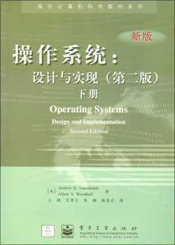
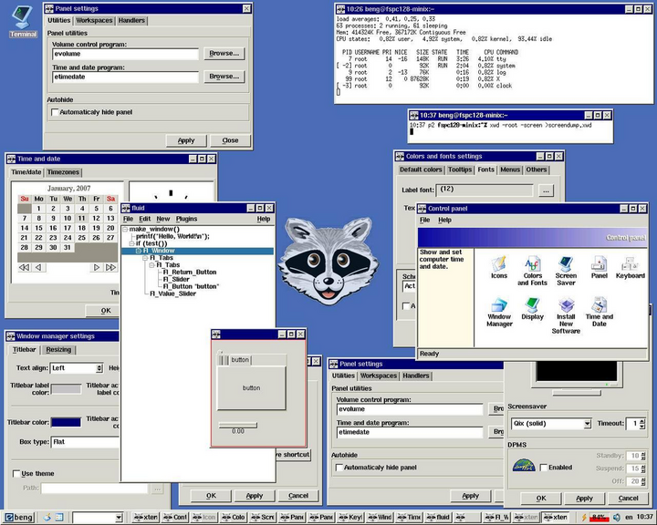
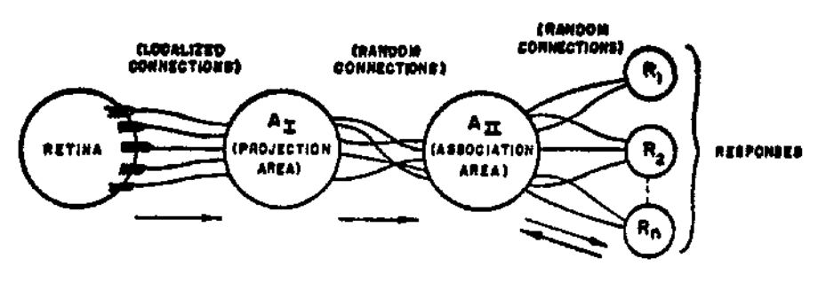
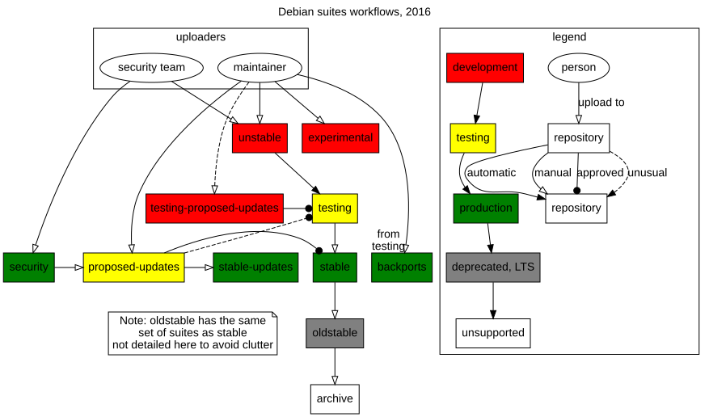

# 第 12 讲：构建应用程序生态（Hacking Day）——从第一个进程到发行版世界

> 原始讲义：[sources/notes/lect12.md](../../sources/notes/lect12.md)  
> 前一讲：[可执行文件、链接与加载](11-executable-linking.md)  
> 后一讲：[多处理器编程](13-multiprocessor.md)  
> 本讲关键词：UNIX、Minix、Linux、initramfs、PID 1、BusyBox、`pivot_root`、systemd、Debian、APT、dpkg、deb、软件供应链、AI 应用生态

## 0. 本讲定位：一个进程已经能启动，整个世界怎样启动

上一讲把 `execve` 拆到了机器能兑现的程度：ELF 的 program header 描述映射，动态加载器完成重定位，内核和运行时共同构造 `argc`、`argv`、`envp`、辅助向量与入口寄存器。于是，“运行一个程序”不再有魔法。

但我们每天看到的 Linux 显然不只是一个 ELF 文件。登录终端、网络、设备节点、系统服务、编译器、浏览器和包管理器从哪里长出来？如果内核刚启动时一个普通进程都没有，那么谁启动第一个进程？如果只给这个进程系统调用，它又怎样铺开整个应用世界？

本讲用一次 Hacking Day 回答这些问题。它先回到 UNIX、Minix 与 Linux 的历史现场，说明今天的系统调用不是一次顶层设计的产物，而是可以运行、可以改进的系统长期演化出的接口；再亲手把 Linux 的初始用户态压缩到一个 `init`，从确定的初始状态推导 BusyBox、真实根文件系统和 systemd；最后越过内核边界，看 Debian、deb 与软件供应链怎样把“对象 + API”变成可持续更新的应用生态。

课程主线在这里完成一次换挡：

```text
进程、地址空间、操作系统对象
  → libc
  → ELF、链接、加载
  →【本讲：initramfs、PID 1、发行版与包生态】
  → 下一讲：多个共享内存的状态机与多处理器
```

本讲的核心结论是：**Linux 有两面**。一面是内核提供的对象与系统调用；另一面是开发者围绕这些 API 建成的发行版、工具、服务和软件供应链。前者给出可能性，后者把可能性组织成一个可用的世界。

## 1. 学习目标与问题地图

学完本讲，你应该能够：

- 把上一讲的链接与加载结论压缩为 `execve` 所构造的进程初始状态；
- 说明早期 UNIX 为什么没有 `fork()` 也能先工作起来，以及“先做出 0.1，再持续改进”的工程意义；
- 按时间解释 Minix 1、Minix 2、Minix 3 与 Linux 诞生之间的关系；
- 复述 Linux 诞生公告、Tanenbaum–Torvalds 争论和 Linux 走向 SMP 的历史线索，而不把历史简化成“某种架构永远胜利”；
- 从 CPU Reset、firmware、内核启动一路推导到第一个用户进程；
- 解释 initramfs 是什么、为什么可以只有一个 `/init`、`/dev/console` 为什么重要；
- 自己检查当前机器的 PID 1、内核命令行与 initramfs 内容；
- 用静态 BusyBox、cpio 和 QEMU 构造一个最小可启动 Linux；
- 区分 initramfs、最终根文件系统、`pivot_root(2)`、`switch_root(8)` 和 systemd；
- 用“对象 + API”解释设备节点、procfs、进程、地址空间乃至服务管理如何从系统调用长出来；
- 区分 Linux 内核、发行版、APT、dpkg 和 deb 包各自承担的职责；
- 在不安装软件、不执行维护脚本的前提下拆开一个 deb，检查元数据、文件和生命周期钩子；
- 解释包管理为什么同时是便利设施与软件供应链安全边界；
- 对 AI 时代“应用会不会退化为工具与服务、GUI 会不会消失”给出基于接口和生态的分析，而不是口号式预测。

问题地图如下：

| 表面问题 | 最小机制 | 真实系统中的扩展 |
| --- | --- | --- |
| 内核启动后第一个程序是谁？ | initramfs 中的 `/init` 或内核尝试的 init 路径 | 它发现真实根、切换根并 `exec` systemd 等 PID 1 |
| 一个文件怎样成为最小用户态？ | 静态链接的可执行文件 + `execve` | BusyBox 用一个 multicall binary 提供数百个命令 |
| `/proc`、`/dev` 是内核镜像里自带的吗？ | 用户态通过 `mount`、`mknod` 等 API 建立可见对象 | udev、systemd 与驱动事件持续管理它们 |
| `switch_root` 是系统调用吗？ | 核心内核原语包括 `pivot_root`、`mount`、`chroot`、`execve` | `switch_root(8)` 是用户态命令，具体实现会编排多个原语 |
| Linux 为什么能变成日常系统？ | 稳定 syscall ABI 支撑程序 | libc、工具、服务、发行版、仓库与开发者共同形成生态 |
| `apt install` 只是复制文件吗？ | 下载、校验、解包、更新数据库 | 还要解依赖、配置、运行维护脚本与触发器 |
| AI 让写代码便宜后，生态自动繁荣吗？ | 从 0 到 0.1 的成本下降 | 维护、评审、信任、兼容与供应链治理仍决定能否走到 1 |

## 2. Review & Comments：链接和加载其实都在解释 `execve`

### 2.1 一次 `execve` 改了什么，又留下什么

可以把上一讲的全部机制压成一次状态变换：

```text
旧进程状态
  ├─ PID、凭据、工作目录、部分 fd 等
  ├─ 旧地址空间、旧代码、旧栈、旧线程
  └─ path, argv, envp
              │ execve(path, argv, envp)
              ▼
新程序映像
  ├─ 主 ELF 的 PT_LOAD/PT_TLS/PT_GNU_STACK/...
  ├─ PT_INTERP 指定的动态加载器及其 PT_LOAD
  ├─ SP → argc, argv[], NULL, envp[], NULL, auxv
  └─ PC → 解释器入口；静态 ELF 则进入自身入口
```

这里必须用“替换程序映像”而不是“创建新进程”描述 `execve`。成功后 PID 没有变；没有设置 `FD_CLOEXEC` 的文件描述符仍然打开，所以 Shell 才能在 `execve` 前用 `dup2` 接好管道和重定向。当前目录、根目录和许多凭据也延续下来。

另一些状态会被替换或重置：旧地址空间消失，除调用线程外的其他线程不再存在，捕获型 signal disposition 会复位为默认动作。被设置为忽略的信号、阻塞信号集合等又有各自的继承规则。因而“继承 signal handler”只能作为课堂速记，精确行为必须查 `execve(2)`；这正是本课程强调阅读手册的原因。

`PT_GNU_STACK` 通常只是对栈权限的请求，不是让内核从文件中“加载一个栈段”；`PT_TLS` 为线程局部存储给出模板；`PT_INTERP` 告诉内核还要加载哪个解释器。动态链接器、musl/glibc 启动代码、构造函数和 CRT 继续把这个机器初态抬升成 C/C++ 看到的运行环境。

脚本也遵循相同思想。内核识别开头的 shebang，例如：

```sh
#!/bin/sh
```

它不会把 Shell 脚本变成机器指令，而是改为执行解释器，并把脚本路径组织进参数。ELF、shebang、动态解释器看似分支很多，本质都在回答同一个问题：**怎样根据一个文件描述出新程序的初始状态**。

### 2.2 回到应用视角：课程真正训练的能力

截至本讲，课程一直在研究“系统调用的行为”：

- 参数怎样表示需求；
- 返回值怎样报告结果；
- 哪些进程状态会改变；
- 为什么 API 要具有当前的形状；
- libc、语言运行时和命令行工具怎样在 API 之上继续封装。

目标并不是背完 Linux 的系统调用表，而是形成一条可复用的证据链：

```text
提出一个可观察问题
  → 查对应 man page 与 ABI 文档
  → 让 AI 帮助生成最小、会检查错误的实验
  → 用 strace / procfs / readelf / gdb 观察
  → 对照返回值和状态变化修正模型
```

AI 可以加快写代码和找文档，但“要观察什么”“哪一个输出能区分两个解释”“生成代码是否越权或遗漏错误处理”仍需要人判断。掌握这套方法后，新系统调用只是新的对象和状态迁移，而不是新的魔法。

## 3. 见证历史：这些系统调用是怎么来的

### 3.1 最早的 UNIX：没有 `fork()` 也先把系统跑起来

Dennis Ritchie 在 [Evolution of the UNIX Time-Sharing System](https://read.seas.harvard.edu/~kohler/class/aosref/ritchie84evolution.pdf) 中回顾了 UNIX 的早期演进。最初版本甚至没有今天最具标志性的 `fork()`。

一个极简 Shell 大致这样工作：

1. 关闭先前打开的文件；
2. 把终端打开到文件描述符 0、1；
3. 从终端读入一行命令；
4. 打开目标程序，把一小段加载器复制进内存；
5. 加载器覆盖当前映像并跳转执行，效果近似后来的 `exec`；
6. 程序 `exit` 时，再重新加载 Shell。

这套设计很“不完善”：Shell 自己被命令覆盖，返回命令行还要重新加载；并发执行和管道组合也不自然。但它已经闭合了“输入命令—加载—执行—返回”的循环，用户可以使用，开发者也有了继续改进的对象。

### 3.2 `fork`/`exec` 不是天降公理，而是演化出的分工

当系统需要让 Shell 保留自身状态、让父进程等待或并发管理子进程时，“复制当前执行上下文”与“用新程序替换映像”分成两个操作就变得自然：

```text
shell
  │ fork：先保留一个 shell，同时得到子进程
  ├───────────────┐
  │ parent        │ child：重定向 fd，再 exec
  │ wait/继续读   └──────────────→ command
```

今天我们会讨论 `fork()` 在多线程、大地址空间和非 UNIX 平台上的代价，也会使用 `posix_spawn` 等组合接口。但不能因此倒推早期设计者“本应一次做对”。接口是在当时硬件、已有代码和新需求的共同约束下长出来的。

讲义给出的 takeaway 很直接：**不要因为第一个版本“不够好”而不做；先让最小闭环工作，再让现实反馈推动改进。** 这并不等于容忍安全漏洞或无测试代码，而是区分“可演化的 0.1”和“永远停留在纸面的完美设计”。

## 4. Minix：教学系统怎样成为历史的支点

### 4.1 从 Minix 1 到 Minix 3

Andrew S. Tanenbaum 创建 Minix 的核心动机之一，是让学生能够阅读、运行和修改一个足够完整的 UNIX-like 系统：

| 版本 | 时间与兼容目标 | 课程中的意义 |
| --- | --- | --- |
| Minix 1 | 1987，面向 UNIX V7 兼容 | 代码小、可教学；成为 Linus 开发早期 Linux 的环境与参照 |
| Minix 2 | 1997，转向 POSIX 兼容 | 随教材提供完整源代码，让一代学习者能把书本机制落到实现 |
| Minix 3 | 2006，兼容 POSIX/NetBSD 生态 | 发展成全功能微内核系统；其技术进入大量 Intel 管理引擎设备 |

Minix 3 曾因部署在海量 Intel 平台的管理环境中而被称为“一度应用最广的操作系统”。这句话强调的是嵌入式部署数量，不代表普通 PC 用户会直接看到一个 Minix 桌面，也不代表桌面应用生态因此超过 Linux 或 Windows。



讲义把这本书称为“梦开始的地方”。个人线索在这里很重要：一个可读、可改、可启动的真实系统，可能比一套抽象定义更能让学习者相信“我也能造一个”。

### 4.2 Minix 3：教学价值不等于玩具



Minix 把大量服务放在用户态，用进程隔离和消息传递组织系统。它非常适合追问：驱动失败能否重启？服务怎样相互隔离？内核中究竟必须保留什么？这些问题后来仍是可靠系统研究的重要主题。

课程给出的 [Minix 演示](/OS/demos/virtualization/minix) 使用 *Minix 1 and 2, Quick and Dirty editions* 的代码。观察它时不要只看复古界面；应寻找与现代 UNIX 相通的对象：进程表、文件描述符、Shell、加载器和系统服务。历史系统的价值正在于：层次较少，因果链更短。

## 5. Linux 的诞生：一个 hobby project 接住了时代

### 5.1 1991 年 8 月 25 日的帖子

21 岁的 Linus Torvalds 在 `comp.os.minix` 新闻组宣布，他正在为 386/486 AT 兼容机写一个 free operating system，并谦称它是 “just a hobby”。

把它翻译成今天学生熟悉的语境，大约是：“我写了一个加强版 OSLab，现在分享给大家。” 第一版远不是凭空独立的宇宙：开发工具链依赖 Minix，目标是运行 GNU GCC、bash 等已有自由软件。正因为已经有编译器、Shell 与用户需求，内核一旦提供合适接口，就能立刻接入比自身大得多的生态。

这揭示了 Linux 成功的一组条件：

- 386 个人计算机逐渐可得；
- Minix 提供了学习与开发起点；
- GNU 提供了编译器、Shell 和大量用户态软件；
- Usenet 让代码、反馈和贡献可以迅速传播；
- Linus 愿意发布一个尚不“专业”的系统，并持续合并改进。

因此，Linux 既是个人创造，也是不可能脱离时代条件的生态事件。

### 5.2 “合适的人、合适的时间”不是贬低创造者

讲义把 Linux 与 Frank Rosenblatt 的 [Perceptron 论文](https://homepages.math.uic.edu/~lreyzin/papers/rosenblatt58.pdf) 并置。感知机思想很早就出现，但计算资源、数据、算法和工程基础要在后来同时成熟，神经网络才会出现新的爆发。



“机缘巧合”并不是说个人努力无关紧要，而是提醒我们避免英雄史观：许多人可能有相似想法，真正改变世界的是有人在窗口出现时做出可运行系统，又让系统能吸收社区贡献。

## 6. 名场面与 Just for Fun：革命通常不能按计划交付

### 6.1 2012 年的 NVIDIA 名场面

Linux 与硬件厂商的驱动支持长期有摩擦。2012 年，Linus 在公开场合用 “the single worst company” 表达对 NVIDIA 合作体验的不满，留下广泛传播的画面。


同一时期，Alex Krizhevsky、Ilya Sutskever 与 Geoffrey Hinton 正在推动 AlexNet；随后 AlphaGo、GPT-3 等系统又改变了计算产业对 GPU 的需求。讲义还用教师自己读 PhD 时抱怨 CUDA 编程模型的经历补上一层个人视角：当下让人厌烦的接口，可能恰好处在下一轮生态扩张的入口；当下的强弱关系也可能快速反转。

这里不必把争执判断为“谁永远正确”。真正值得观察的是接口和生态的耦合：没有驱动与工具链，硬件能力无法进入应用；没有足够应用需求，厂商也缺少投入兼容的动力。

### 6.2 *Just for Fun*：意外的革命者

Linus 与 David Diamond 的书 *Just for Fun: The Story of an Accidental Revolutionary* 把重点放在“意外”上。书中观点可以概括为：革命者未必天生，革命也很难被精确计划和管理；许多革命是在好奇心、乐趣、可用原型和参与者反馈中发生的。

这与早期 UNIX 的教训相呼应：

```text
想做一点有趣且可运行的东西
  → 发布 0.1
  → 真实用户提出需求、发现缺陷
  → 接口与协作方式继续演化
  → 事后看起来像一场“有路线图的革命”
```

### 6.3 宏大目标与个人动机之间

讲义并列了 2025 年 12 月全国高校科技创新工作会议中关于战略任务、评价指标和标志性成果的表述，以及“我的博导也是干摩托车发动机的，他为什么没干出来”的文章与课堂自嘲。它不是要否认重大工程的价值，而是在追问：**能否只靠目标、指标和口号规划出突破？**

大型基础设施需要长期组织与资源；但很多原创方向又始于不确定、难量化、甚至看上去“不够重大”的探索。健康生态需要同时容纳任务牵引和个人好奇心，并让小原型能够被检验、淘汰或成长。

## 7. 质疑、回应与时代的车轮

### 7.1 Tanenbaum–Torvalds 争论：架构判断要放回当时

随着 Linux 讨论在 `comp.os.minix` 增多，Tanenbaum 发表回应，认为 1990 年代再采用单体内核思路已经落后；Linus 则强烈反驳。讨论的[完整材料](https://www.oreilly.com/openbook/opensources/book/appa.html)里甚至有已获图灵奖的 Ken Thompson 参与回复。

争论经常被压缩成“微内核输给单体内核”，但这会漏掉四件事：

1. Minix 有明确的教学、可移植性与可靠性目标，Linux 则首先要在手边的 386 上实用；
2. 微内核把隔离边界做得清晰，却要处理 IPC、调度和跨服务协作的成本；
3. 单体内核让子系统直接调用与共享状态，早期更容易获得性能和硬件支持，却扩大了故障与并发推理范围；
4. 现实系统会混合思想：Linux 有模块、用户态服务、eBPF 和多种隔离机制，微内核系统也会为性能做工程折中。

“官方专家认为太落后”没有阻止 Linux 前进；Linux 的成功也没有使可靠微内核问题失去意义。工程胜负由目标、硬件、兼容、开发者和时间共同决定。

### 7.2 时代成就英雄：Linux 也用了很多年才学会并行

Linux 并非 1991 年就拥有今天的可扩展性。讲义用一条时间线提醒我们：

- Linux 2.0 引入 SMP 支持，但早期依赖 Big Kernel Lock，多个处理器进入内核后仍有很大串行区域；
- 2.4 时代逐步把大锁拆细，让更多内核路径能够真正并行；
- Linux 在 2002 年引入 RCU（Read-Copy-Update），为读多写少数据提供重要的低开销同步方案；
- Linux 2.6 于 2003 年发布，随后与多核服务器、互联网服务和云计算浪潮共同扩张。


代码量曲线不是“越多越好”的成绩单。它说明支持新体系结构、驱动、网络协议、安全机制和并行硬件需要持续工程投入，也意味着审计、维护和理解成本不断增加。一个 hobby project 能走到数据中心基础设施，靠的是长期演化而不是创始时已经完美。

### 7.3 同样的故事反复发生：从零到 0.1

讲义把 *Fire in the Valley* 中的个人电脑史、Ritchie 的 UNIX 回忆，以及借助 AI 阅读历史论文的课堂实践放在一起：伟大系统都曾经是少数人手里的粗糙原型。

AI 时代，“从 0 到 0.1”前所未有地容易：

- CrazyOS 一类项目可以快速探索操作系统与硬件 co-design；
- Claude Mythous 一类实验强调 agent 帮助寻找 bug；
- [caveman](https://github.com/JuliusBrussee/caveman) 用极简表达挑战“必须堆很多 token 才能完成事情”的直觉。

但 0.1 到 1 仍然昂贵：异常路径、兼容性、性能、安全、文档、测试、发布、升级和社区治理不会因代码生成而自动完成。AI 扩大的是可以尝试的设计空间；系统知识帮助我们识别哪些原型有清晰边界，哪些只是暂时跑通。

## 8. 创造世界：回顾“初始状态”

### 8.1 进程的初始状态

对普通程序，上一讲已经给出最小模型：

```c
execve(path, argv, envp);
```

成功后，栈指针附近按 ABI 放着：

```text
SP → argc
     argv[0] ... argv[argc-1]
     NULL
     envp[0] ...
     NULL
     auxv(type, value) ... AT_NULL
```

主程序与解释器被映射进地址空间；若有 `PT_INTERP`，PC 先指向解释器的 ELF entry。动态加载器完成依赖装载与重定位后，再把控制权交给程序入口和 CRT。所谓“程序开始”，就是处理器从一个约定好的状态继续执行。

### 8.2 计算机系统也必须有初始状态

把视角再向前推：

```text
CPU Reset
  → 在手册规定的地址和模式开始执行 firmware
  → firmware 初始化最低限度硬件，装入 bootloader/内核
  → 内核建立内存管理、调度、中断和根文件系统
  → 内核启动第一个用户态程序
  → 该程序成为后续服务与进程树的根
```

CPU Reset 与 `execve` 在抽象上非常相似：二者都把复杂历史压成一个有文档约束的初始状态。前者让 firmware 能依赖处理器行为，后者让应用能依赖 ABI 与操作系统行为。

### 8.3 第一个进程在哪里，它为什么特殊

Linux 最终要运行一个 init 程序。通常它获得当前 PID namespace 中的 PID 1，并承担额外职责：

- 启动后续服务或最终 `exec` 真正的 init；
- 回收失去父进程的孤儿后代，避免僵尸积累；
- 对信号采用 PID 1 的特殊语义，并明确处理关机、重启等控制流；
- 如果 PID 1 退出，系统通常无法像普通进程退出那样继续运行。

“第一个进程长出所有进程”是进程树视角，不等于每个后台任务都永远是它的直接孩子。服务管理器会形成自己的父子关系，进程也可能退出、被收养或处在容器的另一个 PID namespace 中。

## 9. initramfs：控制 Linux 加载的第一个进程

### 9.1 initramfs 的最小模型

initramfs 是随内核提供或由 bootloader 一并加载的一份 cpio 归档。内核把它解包成早期根文件系统，然后尝试运行指定的初始程序。常见控制项包括内核命令行中的 `rdinit=`、`init=`；默认路径会涉及 `/init` 以及 `/sbin/init`、`/etc/init`、`/bin/init`、`/bin/sh` 等回退规则，具体顺序应以所用内核文档和版本为准。

因此，一个教学用 initramfs 可以真的只有一个可执行 `/init`。不过“一个文件”有隐藏前提：

- 如果它是动态链接 ELF，还需要 ELF interpreter 和所有共享库；
- 如果它是脚本，还需要 shebang 指定的解释器；
- 若想调用 `ls`、`mount`、`sh`，还需要相应工具；
- 所以最方便的单文件常是静态链接的 BusyBox，或一个静态链接的小 C 程序。

这恰好把上一讲的链接加载知识用于启动故障：`/init` 明明存在却报 `No such file or directory`，常见原因不是文件缺失，而是它声明的动态加载器不存在。

### 9.2 `/dev/console` 与 0、1、2 号文件描述符

第一个进程也要有输入输出。Linux 启动路径会准备 `/dev/console`，并让初始用户态拥有可用的标准输入、输出、错误通道。随后早期用户态通常会挂载 devtmpfs，并由设备管理服务建立和维护更多 `/dev` 节点。

这不是装饰细节。如果 `/init` 的错误信息没有可写 fd 2，系统可能只表现为“黑屏”；如果交互 Shell 没有控制终端，job control 和信号行为也会异常。调试最小系统时，`console=ttyS0`、`/dev/console` 与 fd 0/1/2 是第一批应检查的状态。

### 9.3 实验一：在当前系统寻找初始状态

依赖：Linux、procfs；检查 initramfs 列表时，Debian/Ubuntu 常用 `lsinitramfs`，Fedora/RHEL 常用 `lsinitrd`。以下均为只读观察，不要附着或修改 PID 1。

```sh
ps -p 1 -o pid,ppid,comm,args
readlink /proc/1/exe
readlink -f /sbin/init

printf '%s\n' '--- kernel command line ---'
cat /proc/cmdline

printf '%s\n' '--- PID 1 file descriptors ---'
ls -l /proc/1/fd/0 /proc/1/fd/1 /proc/1/fd/2

printf '%s\n' '--- selected mounts ---'
findmnt --target /
findmnt --target /proc
findmnt --target /dev
```

在传统发行版主机上，PID 1 常是 systemd；在容器内，它也可能是 Shell、测试程序或 `tini`，因为容器可以拥有独立 PID namespace。`/sbin/init` 可能是到 systemd 的符号链接。PID 1 的 fd 可能连到 `/dev/null`、console、pipe 或 socket；这说明“标准 fd 指向终端”是启动策略，不是系统调用公理。

继续检查当前内核对应的 initramfs：

```sh
kernel_release=$(uname -r)
initrd_path="/boot/initrd.img-$kernel_release"

if command -v lsinitramfs >/dev/null 2>&1 && test -r "$initrd_path"; then
    lsinitramfs "$initrd_path" | less
elif command -v lsinitrd >/dev/null 2>&1; then
    lsinitrd | less
else
    printf '%s\n' '请安装发行版的 initramfs 查看工具，或指定可读的 initrd 路径。'
fi
```

预期能看到 `/init`、BusyBox 或发行版自己的早期工具、存储/文件系统模块和脚本。搜索 `crypt`、`lvm`、`nvme`、`network` 等名字，可以反推这台机器启动前必须解决哪些问题。一个启用了全盘加密的系统，必须先在 initramfs 中解锁设备，才可能读取真正根文件系统里的程序。

## 10. 最小 Linux：用一个 `/init` 点亮世界

### 10.1 为什么“只有一个文件”在原理上成立

课程的[最小 Linux 演示](/OS/demos/virtualization/linux-minimal)把结论做到极致：只要内核能加载一个合法 init，用户态就已经开始。这个 init 可以直接调用 `write` 在 console 输出，再停机；也可以调用 `mount`、`mknod`、`execve`，逐步创造更多对象。

Linux 的[内核命令行文档](https://www.kernel.org/doc/html/latest/admin-guide/kernel-parameters.html)列出了可传入内核的选项。它们类似启动阶段的环境变量，但不要混淆：`/proc/cmdline` 来自 bootloader 传给内核的字符串，不是某个用户进程的 `envp`；内核和早期用户态按各自约定解析它。

### 10.2 实验二：用 BusyBox + cpio + QEMU 构造 initramfs

依赖：Linux 主机、`busybox-static`、`cpio`、`gzip`、`qemu-system-x86_64`，以及一个可由 QEMU 启动的 x86-64 Linux kernel。实验只在 QEMU 客体内挂载文件系统，不改宿主机的根目录。

先确认 BusyBox 是静态链接的；不同发行版的命令路径可能不同：

```sh
command -v busybox
file "$(command -v busybox)"
ldd "$(command -v busybox)" 2>&1 || true
```

`file` 应报告 `statically linked`，`ldd` 通常报告不是动态可执行文件。然后构造归档：

```sh
set -eu

# Fail closed：任何临时路径创建失败都立即退出，绝不让空变量退化成
# 宿主机的 /bin、/dev、/proc、/sys 或 /init。
tmp_root=${TMPDIR:-/tmp}
[ -d "$tmp_root" ] && [ "$tmp_root" != / ] || {
    printf '%s\n' 'unsafe or missing temporary directory' >&2
    exit 1
}

lab_dir=''
image_path=''
cleanup() {
    case ${lab_dir:-} in
        "$tmp_root"/jyy-os-initramfs.*)
            [ ! -e "$lab_dir" ] || rm -rf -- "$lab_dir"
            ;;
    esac
    case ${image_path:-} in
        "$tmp_root"/jyy-os-initramfs-img.*)
            [ ! -e "$image_path" ] || rm -f -- "$image_path"
            ;;
    esac
}
trap cleanup EXIT HUP INT TERM

lab_dir=$(mktemp -d "$tmp_root/jyy-os-initramfs.XXXXXX") || exit 1
image_path=$(mktemp "$tmp_root/jyy-os-initramfs-img.XXXXXX") || exit 1
[ -n "$lab_dir" ] && [ -d "$lab_dir" ] || exit 1
[ -n "$image_path" ] && [ -f "$image_path" ] || exit 1

mkdir -p "$lab_dir/bin" "$lab_dir/dev" "$lab_dir/proc" "$lab_dir/sys"
cp "$(command -v busybox)" "$lab_dir/bin/busybox"
ln -s busybox "$lab_dir/bin/sh"

cat >"$lab_dir/init" <<'EOF'
#!/bin/sh
export PATH=/bin

/bin/busybox --install -s /bin
mount -t proc proc /proc
mount -t sysfs sysfs /sys
mount -t devtmpfs devtmpfs /dev 2>/dev/null || true

echo 'hello from initramfs'
echo "pid=$$"
echo 'kernel command line:'
cat /proc/cmdline
echo 'type exit to power off'

setsid cttyhack sh
exec poweroff -f
EOF

chmod +x "$lab_dir/init"
(
    cd "$lab_dir" || exit 1
    find . -print0 | cpio --null -o --format=newc
) | gzip -9 >"$image_path"

printf 'initramfs image: %s\n' "$image_path"
```

最后启动。若宿主机没有 `/boot/vmlinuz-$(uname -r)`，把 `kernel_path` 改成课程提供或自行构建的内核映像：

```sh
kernel_path="/boot/vmlinuz-$(uname -r)"

qemu-system-x86_64 \
    -kernel "$kernel_path" \
    -initrd "$image_path" \
    -append 'console=ttyS0 rdinit=/init panic=-1' \
    -nographic -no-reboot
```

预期串口日志最后出现 `hello from initramfs`、`pid=1` 和一个 Shell。运行以下命令观察这个极小世界：

```sh
ps
mount
ls -l /bin | head
cat /proc/1/cmdline
```

状态变化可以逐步解释：内核把 cpio 解到早期 rootfs；`rdinit=/init` 选择脚本；shebang 让内核执行 `/bin/sh`；静态 BusyBox 不再需要额外 loader；`mount` 系统调用把 procfs、sysfs、devtmpfs 接入目录树；`busybox --install` 创建许多指向同一 ELF 的符号链接。输入 `exit` 后脚本 `exec` `poweroff -f`，PID 1 的程序映像被替换并触发关机。

这个脚本只适合实验。生产 PID 1 还必须可靠回收子进程、处理信号、记录失败并安排恢复，不能把“成功出现 Shell”误认为已经实现完整 init system。

### 10.3 BusyBox 怎样用一个 ELF 提供一整个工具箱

讲义的 BusyBox 幻灯片列出从 `ash`、`cat`、`cpio`、`grep`、`mount` 到 `ip`、`mdev`、`modprobe`、`switch_root`、`syslogd`、`wget` 的大量 applet。无需死记列表，可以按职责理解：

- Shell 与文本处理：`ash`、`awk`、`sed`、`grep`、`cut`、`sort`；
- 文件与归档：`cp`、`mv`、`tar`、`cpio`、`gzip`、`xz`；
- 进程与系统管理：`ps`、`kill`、`dmesg`、`sysctl`、`taskset`；
- 存储与启动：`mount`、`mknod`、`modprobe`、`pivot_root`、`switch_root`；
- 网络：`ip`、`ping`、`route`、`udhcpc`、`wget`、`httpd`；
- 登录与服务：`getty`、`login`、`init`、`syslogd`、`crond`。

运行 `busybox --list` 可以得到当前构建真正启用的 applet。它们通常不是数百份独立机器码，而是链接或命令名最终进入同一个 BusyBox ELF；BusyBox 根据 `argv[0]` 或第一个参数选择实现。这个设计减少空间和动态依赖，非常适合 initramfs、嵌入式设备与故障恢复环境。

## 11. initramfs 并不是我们最终“看到”的 Linux 世界

### 11.1 启动的初级阶段

一个真实 initramfs 通常要完成：

1. 挂载 procfs、sysfs、devtmpfs，获得内核信息与设备接口；
2. 加载访问磁盘、文件系统、网卡所需的剩余内核模块；
3. 根据 `/proc/cmdline` 找到 `root=` 指定的设备；
4. 必要时解密磁盘、组装 RAID/LVM，或通过网络取得根文件系统；
5. 只读或读写挂载真正的 root filesystem；
6. 把控制权移交给新根中的 init。

`/etc/fstab` 通常位于最终根文件系统，由后续用户态读取，用来挂载其余文件系统。不要把它与内核命令行混为一谈：前者是普通配置文件，后者在真正根尚不可读时就已经可从 procfs 取得。

### 11.2 启动的第二级阶段

切换到真正根后，`/sbin/init` 常指向 systemd，也可能是 OpenRC、runit、SysV init 或专用程序。它继续启动：

- udev 与设备管理；
- 日志、时间、主机名等基础服务；
- NetworkManager 或其他网络栈配置；
- getty、SSH、图形登录和桌面；
- 数据库、容器运行时和用户配置的服务。

字体变化、网卡上线、登录提示符出现，看起来像“Linux 内核逐步变完整”，其实大量动作发生在 switch root 之后，是普通用户态程序通过 syscall 完成的。课程的 [Linux 演示](/OS/demos/virtualization/linux) 与 [NOILinux Lite](https://zhuanlan.zhihu.com/p/619237809) 例子都在展示这一边界。

在自己的机器上运行：

```sh
ls -l /sbin/init
readlink -f /sbin/init
ps -p 1 -o pid,comm,args
```

你看到的路径没有魔法：最终仍是一个 ELF 或脚本，经过前一讲解释过的加载路径成为 PID 1 的当前程序映像。

### 11.3 `pivot_root`：改变 mount namespace 看到的根

讲义给出的核心接口是：

```c
int pivot_root(const char *new_root, const char *put_old);
```

它改变调用进程所在 mount namespace 的根挂载，把旧根放到 `put_old`。这行原型用于表达内核接口；glibc 并未提供同名包装函数，C 程序通常经 `syscall(SYS_pivot_root, ...)` 调用。典型概念流程是：

```text
mount(real_root, /newroot)
mkdir(/newroot/oldroot)
pivot_root(/newroot, /newroot/oldroot)
chdir(/)
execve(/sbin/init, ...)
umount2(/oldroot, MNT_DETACH)
```

真实调用有严格前置条件，例如 `new_root` 与 `put_old` 的挂载关系、传播属性和当前目录处理；应查 `pivot_root(2)`。它需要相应权限，绝不能在宿主机根 mount namespace 中照抄实验。课程在最小虚拟机中复现，正是为了让破坏范围可控。

`switch_root(8)` 是用户态命令，不是同名系统调用。BusyBox、util-linux 和发行版脚本的实现细节可能不同：它们会组合移动挂载、清理旧 initramfs、`chroot`/`pivot_root` 相关操作以及最后的 `execve`。尤其初始 rootfs 本身不能直接作为 `pivot_root` 要移走的旧根，工具常需采用移动挂载和 `chroot` 一类路径。所以“switch_root 背后是 `pivot_root`”表达的是根切换这一类核心机制，不能推出一次命令只对应一次 syscall。

### 11.4 构建真实应用世界的仍是系统调用

switch root 之后发生的每件事都能继续拆解：

| 用户看到的现象 | 典型用户态动作 | 相关内核 API |
| --- | --- | --- |
| `/proc` 出现进程信息 | init 挂载 procfs | `mount`、`openat`、`read` |
| `/dev` 出现设备节点 | devtmpfs/udev 响应设备事件 | `mount`、netlink `socket`、`mknod` |
| 网络“上线” | 网络管理器配置接口与地址 | `socket`、netlink message、`ioctl` |
| 登录终端出现 | getty 打开 tty 并执行 login | `openat`、`ioctl`、`dup2`、`execve` |
| 服务被拉起 | 服务管理器创建环境与进程 | `clone`/`fork`、`set*id`、`execve`、cgroup 文件 API |
| 配置和日志可读 | 程序创建目录、文件和 socket | `mkdirat`、`openat`、`write`、`fsync`、`socket` |

内核提供机制，systemd、udev、NetworkManager 等程序提供策略。它们有特殊权限、启动位置和复杂依赖，但在 CPU 看来仍是指令；越过保护边界时仍必须调用 API。

## 12. 故事的结尾：应用视角下，操作系统就是对象 + API

### 12.1 一个确定的起点

从应用视角可以把 Linux 启动压成：

```text
initramfs + /dev/console + exec(init)
```

“确定”不是说所有机器都有相同驱动、地址或日志时序，而是说内核与 init 之间存在可描述的契约：可见的初始文件系统、标准 fd、参数/环境/辅助向量和可调用的 syscall。只要初态与状态迁移规则明确，后续世界原则上都能推导。

### 12.2 对象与 API 的总表

其他对象由用户态通过系统调用创建、访问和管理：

- 进程管理：`fork`、`clone`、`execve`、`exit`、`waitpid`、`getpid`；
- 对象访问：`openat`、`close`、`read`、`write`、`stat`；
- IPC 与网络：`pipe`、`mkfifo`、`socket`、`bind`、`connect`；
- 文件系统与设备：`mount`、`umount2`、`mknod`、`pivot_root`；
- 地址空间：`mmap`、`munmap`、`mprotect`、`msync`；
- 身份与权限：`chmod`、`chown`、`setuid`、capability 相关接口。

procfs、devtmpfs 不是对这一结论的反例。它们是内核实现的特殊文件系统，但仍要通过 `mount` 接入进程的 namespace，并通过 `open/read/write/ioctl` 等接口被应用访问。

### 12.3 “在 Linux API 上没有做不到的事”的边界

UNIX → Minix → Linux 的接口经历长期演化，最终形成相当成熟稳定的应用基座。在权限、资源和硬件允许的前提下，窗口系统、数据库、容器、编译器、浏览器乃至新的发行版都能建立在这些 API 上。

这句话不是说每件事都由一个系统调用直接完成，也不是说 API 永不变化。GUI 需要显示协议和工具包，数据库需要崩溃一致性协议，容器需要 namespace/cgroup 与用户态镜像工具。**系统调用给足机制，应用生态通过组合创造语义。**

## 13. 应用生态：拥抱持续变化的时代

### 13.1 成就操作系统繁荣的是应用

用户选择一个平台，通常不是为了欣赏内核数据结构，而是因为它能运行需要的应用。厂商、个人开发者和社区每天发布新软件，操作系统需要提供共同底座：

- 基本运行库与动态加载器；
- coreutils、Shell 与文本工具；
- 安装、升级和卸载工具；
- 用户、网络、日志、服务与设备管理；
- 稳定 ABI、开发头文件、编译器与调试器；
- 发布仓库、版本策略与安全响应。

内核 API 越稳定，应用越愿意投资；应用越多，硬件厂商越愿意提供驱动；工具与开发者越成熟，新应用成本越低。这是正反馈，也是后来者构建生态最困难的地方。

### 13.2 从软盘、光盘到在线仓库

前互联网时代，DOS、Windows 3.x/95 软件常通过软盘或光盘发行。用户双击安装程序、复制文件、修改注册表并输入 CD-Key。软件来源、依赖和升级由每个厂商各自处理，破解与恶意安装程序也很常见。

互联网把分发变成持续服务：App Store、APT、RPM 仓库、PyPI、npm、Hugging Face、Ollama 等分别管理应用、系统包、语言包、模型和本地 AI artifact。便利来自统一索引、自动下载和依赖管理；风险也从“一张来历不明的光盘”扩展到维护者账户、构建机、仓库元数据、传递依赖与安装钩子。


## 14. Debian：自由操作系统与跨时代的包管理

### 14.1 Debian 的任务与“free”的含义

Debian 是由个人组成的社区项目，目标是创造人人可获得的自由操作系统。这里的 free 主要指软件自由，而不是售价为零。源代码开放允许任何人阅读实现、修复缺陷、重新构建和派生发行版；治理、许可证与构建基础设施则把单个开源仓库组织成相互兼容的整体。

计算机科学的一个特殊之处正在于：大量奠基性成果以论文、标准和源代码形式开放。Minix 随书代码、GNU 工具、Linux 内核和 Debian 仓库形成了一条可学习、可修改、可再发布的链。

今天熟悉的命令是：

```sh
apt-get install firefox
```

讲义括号中的 1998 指 APT 在那个时代出现并带来的跨时代体验，不是说 Firefox 在 1998 年已经作为该名称的软件包存在。APT 的关键提升是：用户声明“我要这个包”，工具解析仓库元数据与依赖，取得并验证包，再调用底层工具完成安装。

### 14.2 APT、dpkg、deb 不在同一层

```text
用户意图：安装/升级 firefox
          │
          ▼
APT：选择版本、解析依赖、选择仓库、下载、校验
          │
          ▼
dpkg：维护本机包数据库、解包、配置、运行维护脚本/trigger
          │
          ▼
deb：承载元数据、payload 和维护脚本的归档格式
          │
          ▼
Linux syscall：创建/替换文件、改权限、exec 脚本、刷新数据
```

因此 `dpkg -i one.deb` 不等于完整的 `apt install`。前者能安装一个本地归档，但不会像 APT 那样完整解决仓库中的依赖组合。反过来，APT 也不是内核特权入口；它与 dpkg 都是普通用户态程序，只是在安装系统文件时通常需要 root 权限。

### 14.3 Debian 软件供应链是一条循环



一条简化链路是：

```text
upstream source
  → Debian maintainer 的 source package 与补丁
  → 隔离构建、测试、生成 binary packages
  → 签名的仓库元数据与镜像
  → APT 解析、下载、校验
  → dpkg 解包和配置
  → bug/security feedback 回到维护者和上游
```

“供应链”不是单向下载管道。一个上游修复要进入发行版版本，用户报告也会反向推动补丁；不同架构要重复构建，安全团队还要追踪受影响版本。生态繁荣依赖的不只是服务器带宽，而是持续承担这些工作的开发者。

## 15. Debian 软件包：拆开 deb 看清安装的机制与风险

### 15.1 deb 的三层结构

deb 本质上是一个 `ar` 归档，通常至少包含：

```text
debian-binary       # 格式版本文本，通常是 2.0
control.tar.*       # 包元数据、维护脚本、校验等
data.tar.*          # 要放入目标文件系统的 payload
```

`control` 文件常见字段包括 `Package`、`Source`、`Version`、`Architecture`、`Maintainer`、`Depends`、`Suggests`、`Section`、`Priority`、`Description`。`data.tar.*` 中的 `./usr/bin/...`、`./etc/...` 等路径在安装时相对于目标根展开，逻辑上对应系统中的绝对位置。

压缩后缀并不固定为 `.xz`；不同包和工具链还可能使用 `.gz`、`.zst` 等。解析器应读成员名和格式，而不是写死“永远有 control.tar.xz”。

### 15.2 安装不是一次 `cp`

一个包从不可见到可用，大致经历预安装检查、unpack、configure、trigger 与安装后动作。Debian 具体使用 `preinst`、`postinst`、`prerm`、`postrm` 等 maintainer scripts，并由 dpkg 管理 trigger；不同操作（首次安装、升级、失败恢复、卸载）的调用顺序不同，应查 Debian Policy，而不是依赖一条过度简化的固定序列。

底层仍然可以还原成系统调用：

- 创建临时文件和目录：`openat`、`mkdirat`；
- 写入 payload：`write`、`renameat`、`linkat`；
- 设置模式和所有者：`fchmodat`、`fchownat`；
- 更新包数据库：文件读写、锁与 `fsync`；
- 执行 maintainer script：`fork`/`clone`、`execve`、`wait`；
- 通知服务重载：socket、signal 或 service manager API。

所以 dpkg 没有“安装软件”这一条神秘 syscall。它只是以高权限、按包格式和事务规则组合普通 API。

### 15.3 实验三：不安装、不执行脚本地拆开一个 deb

依赖：Debian/Ubuntu 系系统上的 `apt-get`、`ar`、`dpkg-deb`，并需要网络下载示例包。`apt-get download` 只下载到当前目录，通常不需要 root；以下命令不会执行包中的维护脚本。

```sh
deb_lab=$(mktemp -d) || exit 1
[ -n "$deb_lab" ] && [ -d "$deb_lab" ] || exit 1
cd "$deb_lab" || exit 1

apt-get download hello
deb_path=$(find . -maxdepth 1 -type f -name 'hello_*.deb' -print -quit)
test -n "$deb_path" || { printf '%s\n' '没有找到下载的 deb' >&2; exit 1; }

printf '%s\n' '--- ar members ---'
ar t "$deb_path"

printf '%s\n' '--- package metadata ---'
dpkg-deb --info "$deb_path"

printf '%s\n' '--- payload paths ---'
dpkg-deb --contents "$deb_path" | sed -n '1,40p'

mkdir control payload
dpkg-deb --control "$deb_path" control
dpkg-deb --extract "$deb_path" payload

printf '%s\n' '--- control files ---'
find control -maxdepth 1 -type f -print
sed -n '1,120p' control/control
```

预期 `ar t` 显示 `debian-binary`、`control.tar.*`、`data.tar.*`；`control/control` 显示版本、架构和依赖；`payload` 下出现将来会进入 `/usr` 等位置的文件。示例包未必带维护脚本，因此 `control` 目录可能只有 `control` 与校验文件，这本身也是观察结果。

若安装了 `strace`，还能只追踪解包过程的文件系统调用：

```sh
mkdir traced-payload
strace -f -e trace=%file dpkg-deb --extract "$deb_path" traced-payload
```

你会看到打开归档、创建目录和文件、查询路径等动作；不会看到内核理解 `Package:` 或 `Depends:`，因为这些语义完全由用户态工具解释。实验结束后可直接离开临时目录；它没有修改 dpkg 数据库，也没有把文件装入宿主根目录。

### 15.4 `postinstall` 为什么能偷走“一切”

讲义以近期 axios 供应链投毒事件提醒：一个每周下载量极大的依赖一旦被污染，影响会沿自动安装迅速扩散。这里还要区分术语：Debian 维护脚本通常叫 `postinst`，npm 生态常见生命周期钩子叫 `postinstall`；名称不同，风险结构相同——包管理器可能以开发者或管理员身份 `execve` 包内代码。

脚本能访问什么，取决于安装进程的权限和隔离：

- 开发者用户身份下，可能读取 SSH key、云凭据、源码和环境变量；
- root 安装系统包时，可能改系统文件、服务与账户；
- CI 中，可能窃取发布 token，并继续污染下游 artifact；
- 网络开放时，秘密还可能被立即外传。

仓库签名主要证明“取得的是仓库发布的内容”，不自动证明内容没有恶意逻辑。缓解需要多层措施：最小权限、隔离构建、锁定与审查依赖、保护维护者账户、审计 lifecycle scripts、可重复构建、快速撤销和安全更新。便利越自动化，信任边界越要显式化。

## 16. AI 时代：应用生态会繁荣还是消亡

### 16.1 生态的关键仍是开发者与设计

传统生态的稀缺资源是能持续交付合格软件的开发者。AI 大幅增加代码产量，却没有消除设计错误：边界模糊、状态分散、接口不稳定、错误处理缺失的系统，会成为难以测试和维护的泥潭。课堂所说的“高血压代码”，不是格式不好看，而是局部看似能跑、整体无法推理。

操作系统课程的使命因而不是训练手写更多样板，而是让学习者见识不同设计及其代价：

- 哪些状态应由内核保护，哪些策略应留在用户态；
- 接口怎样隔离变化；
- 最小模型如何扩展，何时会失效；
- 出错时能否观察、恢复与追责；
- 生成的代码把什么权限交给了谁。

会提出这些问题的人，才能把 agent 生成的 0.1 变成可信的 1.0。

### 16.2 应用会退化为“工具”和“服务”吗

讲义用 OpenClaw 时代提出猜想：Agent 也许不再要求用户逐个打开 GUI 应用，而是把能力看作可调用工具和远端服务。A2UI 探索 agent-driven interface；豆包手机、Qwen 应用等则展示模型、工具与界面可能重新组合。

这更像接口层次重排，而不是应用凭空消失：

```text
过去：人 → 固定 GUI → 应用逻辑 → OS API
可能的未来：人 → Agent → 工具/服务协议 → 应用能力 → OS API
                         ↘ 动态生成或选择 UI ↗
```

GUI 未必消失。视觉确认、复杂创作、空间布局、无障碍和高风险授权仍需要可理解界面；变化的是 GUI 可能按任务动态生成，而不是每种能力都绑定一个固定 App。无论形态怎样变，底层仍要处理身份、权限、文件、网络、进程、日志和更新，操作系统对象与 API 反而成为 agent 的“手和脚”。

### 16.3 AI 生态的新供应链问题

当应用变成模型调用的工具，传统包风险还会叠加新的层次：

- 工具描述可能诱导模型越权调用；
- 动态生成代码可能拉入未经审核的依赖；
- 服务返回值可能包含 prompt injection；
- 模型、数据、插件、容器镜像和本地二进制都有各自来源；
- 自动化 agent 能以机器速度放大一次错误。

因此 AI 时代的生态建设不能只追求“工具数量”。还要记录 provenance、最小化 capability、隔离执行、明确授权、保留审计日志，并让升级可回滚。包管理几十年积累的签名、依赖、版本和安全响应经验不会过时，而会迁移到新的 artifact 和协议。

## 17. 概念辨析与常见误区

### 17.1 内核、initramfs、发行版不是一个东西

- **误区：Linux 内核启动完成，就已经有熟悉的 Linux。** 内核只提供机制；initramfs、init、服务、工具和应用组成用户实际使用的环境。
- **误区：initramfs 一定是最终根文件系统。** 它通常只是发现和挂载真正根的过渡环境；极简或嵌入式系统也可以把它永久当根。
- **误区：PID 1 是内核线程。** init 是用户态程序；只是由内核首先启动，并在 PID namespace 中具有特殊地位。
- **误区：`/dev`、`/proc` 是磁盘上的普通目录内容。** 目录可以预先存在，但其中对象主要来自挂载的特殊文件系统和内核/用户态设备管理。

### 17.2 命令、库函数和系统调用不能按名字等同

- `switch_root(8)` 是命令，`pivot_root(2)` 是系统调用；前者可能组合后者及其他调用。
- `mount(8)` 是解析选项和配置的用户态工具，最后通过 `mount(2)` 或新 mount API 请求内核。
- BusyBox 的 `mount`、`sh`、`ls` 可以是同一 ELF 的不同 applet，不代表内核里有这些命令。
- `execve` 不创建新 PID；`fork`/`clone` 与 `execve` 的组合才形成常见的“启动另一个程序”。

### 17.3 包、包管理器和仓库各有边界

- deb 是归档格式，dpkg 是本机低层包管理器，APT 是更高层的仓库与依赖工具。
- 安装不只是复制 payload；维护脚本、trigger、数据库更新和失败恢复都属于语义。
- “开源/自由软件”不等于不花钱，也不等于自动安全；它提供检查和修改的权利，安全仍需要流程与人员。
- 签名能验证来源和完整性，不证明维护者发布的逻辑一定可信。

### 17.4 历史成功不是一条技术定律

- Linux 成功不证明单体设计在所有目标下都优于微内核；Minix 的可靠性与教学目标也不能自动赢得桌面生态。
- 稳定 syscall ABI 不保证任意旧二进制在任意架构、缺失动态库或变化的用户态配置下都能运行。
- AI 能生成可启动原型，不代表它已经处理并发、升级、安全和供应链；从 0 到 0.1 与从 0.1 到长期维护是不同问题。

## 18. Takeaways：从内核可能性到生态现实

1. UNIX 的接口来自演化。最早没有 `fork()` 也能形成工作闭环；可运行原型与持续改进比等待一次完美设计更能创造历史。
2. Minix 让完整系统变得可读可改，并成为 Linux 的起点之一；Linux 又借助 GNU 工具、个人计算机与网络协作接住时代窗口。
3. Linux 从 hobby project 到 SMP、RCU、云基础设施经历多年演进。时代成就英雄，英雄也必须让系统能吸收时代的贡献。
4. 内核把计算机交给用户态时，会建立确定契约：initramfs、console、PID 1 的初始程序状态。
5. initramfs 用 `mount`、模块加载和设备发现找到真实根，再通过 root 切换与 `execve` 把控制权交给 systemd 等 init。
6. 应用视角下，操作系统是对象 + API。所有“完整世界”的高级语义，最终由普通用户态程序组合系统调用实现。
7. Linux 的另一面是发行版生态。Debian、APT、dpkg 和 deb 把海量开发者成果组织成可安装、可升级的软件集合。
8. 自动包管理也是供应链执行引擎；维护脚本和依赖会继承安装进程的能力，必须配合来源验证、最小权限、隔离和审计。
9. AI 让 0→0.1 更容易，也会放大糟糕设计和供应链风险。未来应用形态可以变化，稳定接口、权限边界和可维护设计仍是生态地基。

## 19. 思考题与下一讲衔接

1. 为什么一个动态链接的 `/init` 存在且有执行权限，内核仍可能报告找不到文件？请从 `PT_INTERP` 推导。
2. 若 PID 1 不回收退出的孤儿进程，长时间运行的容器里会发生什么？为什么容器常使用 tiny init？
3. `/proc/cmdline` 和 `envp` 都是字符串参数，它们的生产者、消费者与生存期有何不同？
4. BusyBox 根据 `argv[0]` 分派 applet。若通过 `execve("/bin/busybox", {"ls", "/"}, envp)` 启动，它应如何判断要执行什么？再查实际规则验证。
5. 为什么 `pivot_root` 必须针对 mount namespace 定义，而不能只是把进程结构里的路径字符串改成 `/newroot`？
6. APT 验证了仓库签名后，为什么恶意 `postinst`/`postinstall` 仍可能被可信地执行？签名究竟证明了什么？
7. 设计一个只读 deb 审计器时，需要解析哪些成员和字段？怎样确保它不会误执行归档中的代码？
8. 如果 Agent 动态选择工具，传统“用户点击安装”这一授权时刻消失了，能力授权应放在哪里？
9. Linux 早期用 Big Kernel Lock 获得了什么开发便利，又为什么会阻碍多处理器扩展？
10. `fork` 后的两个进程地址空间彼此隔离。若想让多个执行流真正共享全局变量并同时用上多个 CPU，最小 API 应该增加什么？

最后一题正是[下一讲：多处理器编程](13-multiprocessor.md)的入口。我们已经有稳定系统调用、libc、加载器和应用生态，也知道 Linux 为 SMP 演进付出了巨大代价。接下来把单个程序状态机扩展成多个共享地址空间的线程：系统只需给出 `spawn/join` 一类接口，程序却会立刻失去熟悉的确定性，并打开并发、并行、同步与内存模型的“魔鬼盒子”。

## 20. PPT 内容覆盖表

| 原讲义标题/内容 | 本章对应小节 |
| --- | --- |
| 构建应用生态 (Hacking Day) | §0–§1 |
| Review & Comments；链接和加载 | §2.1 |
| `execve` 继承 fd/signal 状态、加载 ELF/INTERP、构造初始栈和寄存器 | §2.1（含继承规则的精确辨析） |
| musl、`ld-linux.so`、shebang；复杂加载“不过如此” | §2.1 |
| 回到应用视角的操作系统；阅读手册、指导 AI 理解 syscall | §2.2 |
| 1. 见证历史；这些系统调用是怎么来的 | §3 |
| Ritchie《Evolution of UNIX》；最早没有 `fork()` 的 Shell/loader/exit | §3.1–§3.2 |
| Takeaway：不要害怕“不好”，大胆做并持续改进 | §3.2 |
| Andrew Tanenbaum：Minix 1/2/3 | §4.1 |
| 我 “梦开始的地方” | §4.1 |
| Minix 3 桌面；教学系统、研究者与 Intel ME | §4.1–§4.2 |
| Minix 课堂演示与 Quick and Dirty editions | §4.2 |
| Linux 的诞生 (1991 年 8 月 25 日) | §5.1 |
| “加强版 OSLab”、`comp.os.minix`、Minix 工具链、GNU GCC/bash | §5.1 |
| 合适的人与时间；Rosenblatt Perceptron | §5.2 |
| 诞生了不少名场面 | §6.1 |
| *Just for Fun*；意外的革命者 | §6.2 |
| 2025.12 高校科技创新会议、摩托车发动机文章与课堂反思 | §6.3 |
| 质疑、回应与时代的车轮；`comp.os.minix` 争论 | §7.1 |
| Tanenbaum 回应、Linus 反驳、Ken Thompson 参与 | §7.1 |
| Linux 2.0/BKL、2.4 并行化、2002 RCU、2003 Linux 2.6/云计算 | §7.2 |
| kernel LOC 图与“时代成就英雄” | §7.2 |
| 同样的故事还在反复发生 | §7.3 |
| *Fire in the Valley*、UNIX 历史论文与借助 AI 阅读 | §7.3 |
| AI 时代 0→0.1；CrazyOS、Claude Mythous、caveman | §7.3 |
| 回顾：关于 “初始状态” | §8 |
| 进程初态：`execve`、SP 上的 argc/argv/envp/auxv、interp entry | §8.1 |
| 系统初态：CPU Reset、firmware、OS 与第一个进程 | §8.2–§8.3 |
| “长出所有进程”的 init 在哪里、做什么 | §8.3 |
| initramfs：能否控制 Linux 的第一个进程 | §9.1 |
| 单个 init 文件、默认 init 路径、`/dev/console` 与标准 fd | §9.1–§9.2 |
| 能否解开当前 initramfs | §9.3（可操作实验） |
| 最小 Linux 演示；init RAM Disk/FS 与内核命令行参数 | §10.1–§10.2 |
| Linux 演示；initramfs 可放应用、模块、数据、脚本 | §10–§11 |
| 点亮 Linux 世界；BusyBox utilities 完整工具集 | §10.3 |
| initramfs: 并不是我们 “看到” 的 Linux 世界 | §11.1 |
| 加载驱动、挂载文件系统、`/proc/cmdline`、`/etc/fstab` | §11.1 |
| 启动第二级阶段；查看 `/sbin/init` | §11.2 |
| 构建真正应用世界的系统调用；`switch_root`/`pivot_root` | §11.3 |
| `pivot_root(new_root, put_old)`、mount namespace、卸载旧根 | §11.3 |
| 驱动、NetworkManager、tty/systemd 与 NOILinux Lite | §11.2、§11.4 |
| 故事的结尾：应用视角的操作系统 | §12.1–§12.3 |
| 操作系统 = 对象 + API；进程、对象、地址空间及其他 syscall | §12.2 |
| UNIX → Minix → Linux；Linux API 上的创造空间 | §12.3 |
| 拥抱变化的时代 | §13 |
| 应用成就 OS；运行库、coreutils、安装与系统管理工具 | §13.1 |
| 前互联网软盘/光盘/CD-Key；App Store、APT、RPM、PyPI、npm、HF、Ollama | §13.2 |
| 例子：Debian | §14.1 |
| `apt-get install firefox` 与 1998 APT | §14.1（澄清年份含义） |
| Debian 的包管理 ("软件供应链") | §14.2–§14.3 |
| Debian 软件包 deb；`control.tar.*`、`data.tar.*` 与字段 | §15.1 |
| dpkg 是使用 syscall 安装的普通应用 | §14.2、§15.2 |
| AI 阅读包；preinstall/unpack/configure/triggers/postinstall | §15.2–§15.3 |
| axios 投毒与 postinstall 窃取能力 | §15.4 |
| AI 时代：应用生态的变化 | §16.1–§16.2 |
| OpenClaw、工具/服务、GUI 是否消失、A2UI、豆包手机、Qwen 应用 | §16.2 |
| Takeaways：UNIX→Linux、内核/发行版两面、initramfs、包生态 | §18 |
