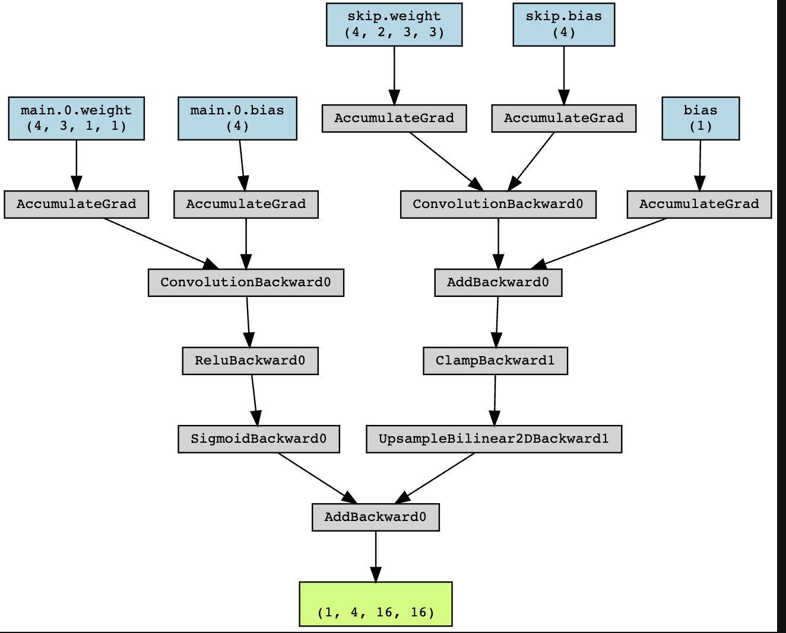
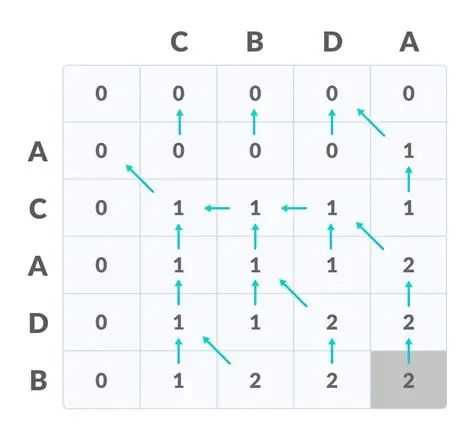
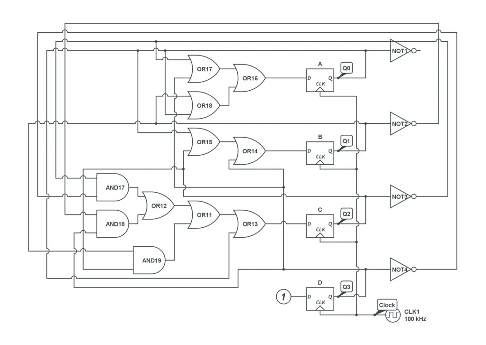

# 第 15 讲：并发控制——同步与条件变量

> 原始讲义：[sources/notes/lect15.md](../../sources/notes/lect15.md)  
> 前一讲：[并发控制：互斥](14-mutual-exclusion.md) · 后一讲：[并发控制：同步与信号量](16-semaphores.md)  
> 配套示例：[examples/bounded_buffer.c](../../examples/bounded_buffer.c)  
> 本讲关键词：同步、同步点、happens-before、条件变量、谓词、`wait`、`signal`、`broadcast`、生产者—消费者、计算图、Executor Pool

## 0. 本讲定位：互斥以后，为什么还是不会实现 `join`？

上一讲用互斥锁把一段危险的并发程序退回到顺序世界。只要所有线程都用同一把锁保护 `sum++`，任意时刻最多一个线程修改 `sum`，于是终于能算对 `1 + 1`。

但互斥只承诺“不同时做”，不承诺“谁先做”。假设两个线程分别执行：

```c
// T1                         // T2
mutex_lock(&lk);             mutex_lock(&lk);
print("A");                  print("B");
mutex_unlock(&lk);           mutex_unlock(&lk);
```

合法结果既可以是 `AB`，也可以是 `BA`。锁把两个临界区排成了某个顺序，却没有让我们指定只能是 `A → B`。这意味着我们甚至还没有真正实现课程线程库中的 `join()`：它要求所有目标线程的结束都先于 `join` 返回。

本讲解决并发控制的第二个基本问题——**同步**：不只排除同时执行，还要建立事件之间确定的先后关系。条件变量把这个需求写成“等待一个由共享状态定义的条件”。本讲最后会发现，任意有向无环计算图都可以归结为这种等待。

下一讲将从一个故意违反 mutex 所有权规则的计算图 hack 出发，把“通知”保存成可计数的许可，从而发明**信号量**。三讲的关系是：

```text
互斥：A、B 不能并发，但次序未定
                 │
                 ▼
条件变量：等待共享谓词，建立 A → B
                 │
                 ▼
信号量：把尚未消费的通知保存为可计数 token
```

## 1. 学习目标与问题地图

学完本讲，你应该能够：

- 区分互斥、同步、物理上的“同时”和程序中的 happens-before；
- 从忙等检查推导出为什么 `cond_wait` 必须原子地“释放锁并等待”；
- 正确写出 `mutex + while (predicate) + wait` 模板；
- 解释条件变量为什么不是保存通知的“事件盒子”；
- 判断何时可用 `signal`，何时应保守使用 `broadcast` 或拆分条件变量；
- 用 `0 <= count <= capacity` 推导有界生产者—消费者的两个同步条件；
- 解释 `if` 替代 `while`、先检查再睡眠、唤醒错误类型线程分别怎样出错；
- 把 `<><_`/`><>_` 这类奇怪输出要求写成共享状态机与等待谓词；
- 用 DAG 表示并行计算中的依赖，并解释 LCS、电路仿真、构建系统和深度学习图中的任务粒度；
- 比较“一节点一线程”与“调度器 + 工作线程池”两种任意 DAG 实现；
- 分清 POSIX API、libc、内核等待机制和语言内存可见性所在的层次。

问题地图：

| 问题 | 最小答案 | 本章位置 |
| --- | --- | --- |
| 同一把 mutex 能保证 `A` 一定先于 `B` 吗？ | 不能；它只保证二者不重叠 | §2 |
| 为什么不能“解锁后再调用 sleep”？ | 检查与睡下之间可能丢失通知 | §5.1 |
| `pthread_cond_wait` 返回时锁是什么状态？ | 它已重新获得传入的 mutex | §5.2 |
| 收到 signal 是否等于条件必然成立？ | 不等于；必须在锁内用 `while` 重检谓词 | §8 |
| signal 会为未来等待者保存一次通知吗？ | 不会；持久事实应保存在共享状态中 | §5.3 |
| 一个条件变量能等待多个不同谓词吗？ | 能，但 signal 可能叫醒错误的等待者 | §8.3 |
| 为什么计算图的边是同步？ | `u → v` 要求 `u` 的结果在 `v` 开始前完成并可见 | §11 |
| 每个 DAG 节点都创建线程好吗？ | 语义直接，但细粒度图上创建与阻塞成本过高 | §13 |

## 2. Review：互斥解决了 `1 + 1`，没有解决先后顺序

共享内存并发使 `sum++` 的读—改—写可能交错。互斥锁提供 acquire/release，使同一把锁保护的临界区形成串行顺序，并通过相应的同步语义发布共享内存修改。

不过，“存在一个串行顺序”和“指定某个串行顺序”是两件事：

- **互斥**约束同时性：`A → B` 或 `B → A`，两种都允许；
- **同步**约束相对次序：例如只允许 `A → B`；
- **调度**决定某次运行谁何时获得 CPU，但不能拿 `sleep()` 或优先级猜测代替同步协议。

`join` 是最典型的同步：

```text
T1 结束 ─┐
T2 结束 ─┼── happens-before ──> join 返回
...      ─┤
Tn 结束 ─┘
```

这里并不要求 `T1...Tn` 之间有固定顺序；它们仍可以并发。我们只要求一个汇合点：所有结束事件都发生后，主线程才越过它。同步约束通常是**偏序**而非把整个程序强行排成一个总序，这正是保留并行性的关键。

## 3. 什么是同步：异步行动者之间建立相对关系

### 3.1 人类与线程默认“各管各的”

人通常以异步方式行动：点完外卖后继续做别的事，骑手送达时再由通知触发下一步。线程也一样；创建后，各自按调度独立推进。除非程序建立关系，不能因为源码中 `spawn(T1)` 写在 `spawn(T2)` 前，就推断 `T1` 的工作先完成。

讲义把同步定义为：两个或更多随时间变化的量，在变化过程中保持一定的**相对关系**。物理世界有许多同步机制：

- 同步电机通过电磁关系锁定相位；
- 同步数字电路用时钟边沿规定状态更新点；
- 人们约定 wall-clock time，例如 10:10 上课；
- 民用时钟可追溯到天体周期，高精度计时依赖原子振荡；
- 夏令时甚至会人为改变民用时钟，因此 wall clock 本身也未必单调。中国历史上也曾实行夏令时。

这些例子提醒我们：同步需要一个大家共同承认的参照或握手协议，不能只靠每个参与者“差不多到时候了”的猜测。

### 3.2 乐团需要“齐”，程序需要可验证的偏序

现实中两个声部若相差 20–30 ms，人耳就可能察觉“不齐”；对 GHz 级处理器而言，这已经足够执行数千万条指令。南京大学乐团的图片承担的论证不是“线程必须在同一纳秒运行”，而是多个独立行动者必须围绕共同节拍建立相对关系。

音乐本身也可以由程序生成，甚至有 [Strudel](https://strudel.cc/) 和 [Hacklily](https://www.hacklily.org/) 这样的专用 DSL。它们体现了讲义的 “Content as Code” 视角：代码和 Coding Agent 不只能生产传统软件，也能描述音乐等内容；但只要多个声部并发推进，节拍同步仍是底层必须解决的问题。


程序里的同步一般不追求两个操作物理上绝对同时。更可用的合同是：

```text
指挥发布第 k 拍  happens-before  乐手演奏第 k 拍
```

不同乐手可以在发布后并行演奏；程序只需要保证没人抢拍。这比要求所有 CPU 在同一个纳秒执行同一条指令更弱，也更容易实现。

### 3.3 用代码表达直觉：等待条件发生

讲义把几个看似不同的问题写成同一种形式：

```c
// 教学伪代码：真实 C 不能无同步地轮询普通共享变量。
while (!posedge(clk)) {
}                              // await posedge(clk)
ff_out = ff_in;

spawn(T1); spawn(T2); /* ... */ spawn(Tn);
while (!all_threads_done()) {
}                              // await all_threads_done()

study_until(23, 50, 0);
goto_place("大活门口");
while (!freak_guy_arrived()) {
}                              // await freak_guy_arrived()
```

共同点是一次**握手**：

1. 等待者检查某个条件；
2. 条件不成立时不能继续；
3. 系统中另一个动作能够使条件成立；
4. 条件成立后，等待者从同步点继续分叉执行。

在同步点上，全局状态暂时变得容易描述：“时钟上升沿已到来”“所有工作线程均已结束”“最后一个约定的人已到达”。它建立了我们需要的先后关系。

注意，日常语言里的“先发生”不自动等于 C/C++ 内存模型中的 happens-before。可靠的线程间关系必须由线程创建/回收、mutex、原子操作或其他标准同步原语建立；仅仅观察 wall-clock 时间或添加 `sleep` 不够。

## 4. 乐团的第一版实现：正确轮询也会浪费处理器

假设指挥更新受 `lk` 保护的节拍状态，乐手可以这样等待：

```c
// 语义上可正确，但会忙等。
bool can_proceed;
do {
  mutex_lock(&lk);
  can_proceed = check_condition();
  mutex_unlock(&lk);
} while (!can_proceed);

assert(can_proceed);
play_one_beat();
```

这段代码比 `while (!shared_flag) {}` 强得多：对共享状态的访问由同一把 mutex 保护，避免普通 C 对象上的数据竞争；指挥 release 锁、乐手随后 acquire 同一把锁，也使节拍发布对乐手可见。

但它有明显代价：

- 条件长期不成立时，乐手仍不停获得和释放锁，消耗 CPU；
- 大量等待者反复争锁，会干扰真正能使条件成立的指挥线程；
- 单核机器上，等待者占用时间片后又什么也没做；
- “多加一点 `usleep`”只能折中延迟与浪费，不能给出正确唤醒合同。

我们真正想表达的是：“条件不成立时，把线程停放；可能成立时再叫醒它。”难点在于不能让检查条件与进入睡眠之间出现缝隙。

## 5. 发明条件变量

### 5.1 为什么“解锁，然后睡眠”会丢失唤醒

考虑一个自制 API：

```c
// 反例：check、unlock、sleep 不是一个原子动作。
mutex_lock(&lk);
if (!ready) {
  mutex_unlock(&lk);
  sleep_on(&cv);
} else {
  mutex_unlock(&lk);
}
```

可能发生如下交错：

```text
等待者 W                         通知者 N
lock(lk)
读到 ready == false
unlock(lk)
             ── 切换 ──>
                                  lock(lk)
                                  ready = true
                                  signal(cv)   // 此时无人睡在 cv 上
                                  unlock(lk)
             <─ 切换 ──
sleep_on(cv)                      // 可能永远等下去
```

状态已经是 `ready == true`，但通知不是为未来保存的票；W 错过它后睡着。这叫 lost wakeup。根因不是“signal 太快”，而是协议没有原子地完成“释放保护谓词的锁并加入等待”。

### 5.2 `cond_wait` 的关键合同

POSIX 条件变量把上述两步合成一个 API：

```c
pthread_mutex_lock(&lk);
while (!check_condition()) {
  pthread_cond_wait(&cv, &lk);
}
// 返回时条件已在持锁状态下重新检查；此处仍持有 lk。
use_shared_state();
pthread_mutex_unlock(&lk);
```

`pthread_cond_wait(&cv, &lk)` 的语义重点是：

1. 调用时线程必须持有 `lk`；
2. 它原子地释放 `lk` 并把调用者置于 `cv` 的等待关系中；
3. 等待期间线程不持有 `lk`，所以其他线程能改变共享状态；
4. 被 `signal`/`broadcast` 唤醒后，它先重新获得 `lk`；
5. 函数返回给调用者时，线程再次持有 `lk`。

“原子”不是说整个等待过程是一条 CPU 指令，而是说相对于遵守同一 mutex/condition 协议的通知者，不存在上一小节那个会丢失通知的窗口。

### 5.3 条件变量不是条件，也不是邮箱

`cv` 本身不保存 `ready`、`count > 0` 等布尔值。它只是等待者集合及相关库状态。真正持久的事实保存在由 mutex 保护的共享对象中：

```text
共享状态 ready/count/phase   决定程序现在能否继续
mutex                        保护检查与修改
condition variable           状态可能改变时，帮助等待者睡眠/醒来
```

因此：

- 没有等待者时调用 `pthread_cond_signal`，通常不会留下供未来消费的通知；
- 等待者晚到时应直接看到共享谓词已经为真，而不是期待补收旧 signal；
- 被叫醒只表示“值得再检查一次”，不表示谓词必然为真；
- 同一个条件变量可以服务不同谓词，库并不知道哪个等待者“更合适”。

这也解释了名字容易造成的误会：condition variable 不是装着 condition 的 variable。条件是程序员写出的谓词；条件变量只是等待机制。

### 5.4 API、libc、系统调用和硬件不是同一层

在 Linux/POSIX 上，层次大致是：

```text
程序谓词：count > 0、phase == 3、n_done == n_pred
       ↓
POSIX API：pthread_mutex_*、pthread_cond_wait/signal/broadcast
       ↓
libc 线程库：用户态原子状态、等待队列协议
       ↓ 慢路径常见实现
Linux futex 等内核等待/唤醒机制与调度器
       ↓
硬件原子指令、缓存一致性、内存顺序
```

`pthread_cond_wait` 不是名为 `cond_wait` 的系统调用；无竞争路径和部分 bookkeeping 可以在用户态完成，真正需要停放或唤醒线程时，libc 常借助 futex。应用应依赖 POSIX 合同，不能依赖某个 libc 版本恰好发出几次 `futex`。

## 6. 万能同步模板：先写谓词，再套协议

解决同步问题时，先回答“程序在什么共享状态下可以继续”，再写 API。一个保守、容易审查的模板是：

```c
// 等待者
mutex_lock(&lk);
while (!sync_condition()) {
  cond_wait(&cv, &lk);  // 原子地释放 lk 并等待；返回前重新获得 lk
}
assert(sync_condition());
perform_state_transition();
mutex_unlock(&lk);
```

使条件可能成立的一方写成：

```c
// 通知者
mutex_lock(&lk);
change_shared_state();
cond_broadcast(&cv);    // 保守地通知所有可能受影响的等待者
mutex_unlock(&lk);
```

这个模板背后有四个证明义务：

1. **状态完整**：谓词所需的变量都在共享状态中，不靠一次性通知暗中携带事实；
2. **锁一致**：对谓词相关状态的检查和修改使用同一把 mutex；
3. **等待原子**：条件不成立时用 `cond_wait(cv, lk)` 释放同一把锁并等待；
4. **唤醒充分**：任何可能让某类等待者从 false 变为 true 的状态转移，都会发出足够的通知。

正确性的一个实用证明框架是：

- 持锁时检查全局不变量；
- 谓词为 false 的线程不执行对应动作，因此不会破坏不变量；
- 谓词为 true 时，线程在同一临界区完成状态转移；
- 状态转移后仍满足不变量，并通知可能获得进展的线程；
- 解锁/重新加锁提供所需的内存可见性。

`broadcast` 往往是第一版程序的安全选择，但可能造成惊群：许多线程同时醒来争锁，只有少数能继续。先证明正确，再根据“哪些谓词从 false 变成 true”拆分条件变量或改用 `signal`。

## 7. 实验 1：让指挥和三名乐手完成四次分拍握手

下面是一个独立的最小 POSIX 程序。指挥发布第 `b` 拍后广播；每名乐手必须看到该拍才打印，指挥又必须等三名乐手都完成后才能发布下一拍。它同时包含“发布”和“汇合”两种同步方向。

将代码保存为 `/tmp/cv-orchestra.c`：

```c
#include <pthread.h>
#include <stdint.h>
#include <stdio.h>
#include <stdlib.h>
#include <string.h>

enum { PLAYERS = 3, BEATS = 4 };

static pthread_mutex_t lock = PTHREAD_MUTEX_INITIALIZER;
static pthread_cond_t beat_changed = PTHREAD_COND_INITIALIZER;
static pthread_cond_t all_played = PTHREAD_COND_INITIALIZER;
static int beat;
static int completed;

static void check_pthread(int error, const char *operation) {
  if (error != 0) {
    fprintf(stderr, "%s: %s\n", operation, strerror(error));
    exit(EXIT_FAILURE);
  }
}

static void *player(void *argument) {
  int id = *(int *)argument;

  for (int expected = 1; expected <= BEATS; expected++) {
    check_pthread(pthread_mutex_lock(&lock), "pthread_mutex_lock");
    while (beat < expected) {
      check_pthread(pthread_cond_wait(&beat_changed, &lock),
                    "pthread_cond_wait(beat_changed)");
    }

    printf("  player %d plays beat %d\n", id, beat);
    completed++;
    if (completed == PLAYERS) {
      check_pthread(pthread_cond_signal(&all_played),
                    "pthread_cond_signal(all_played)");
    }
    check_pthread(pthread_mutex_unlock(&lock), "pthread_mutex_unlock");
  }
  return NULL;
}

int main(void) {
  pthread_t threads[PLAYERS];
  int ids[PLAYERS];

  for (int i = 0; i < PLAYERS; i++) {
    ids[i] = i + 1;
    check_pthread(pthread_create(&threads[i], NULL, player, &ids[i]),
                  "pthread_create");
  }

  for (int next = 1; next <= BEATS; next++) {
    check_pthread(pthread_mutex_lock(&lock), "pthread_mutex_lock");
    completed = 0;
    beat = next;
    printf("conductor announces beat %d\n", beat);
    check_pthread(pthread_cond_broadcast(&beat_changed),
                  "pthread_cond_broadcast(beat_changed)");
    while (completed != PLAYERS) {
      check_pthread(pthread_cond_wait(&all_played, &lock),
                    "pthread_cond_wait(all_played)");
    }
    check_pthread(pthread_mutex_unlock(&lock), "pthread_mutex_unlock");
  }

  for (int i = 0; i < PLAYERS; i++) {
    check_pthread(pthread_join(threads[i], NULL), "pthread_join");
  }
  return EXIT_SUCCESS;
}
```

编译运行：

```bash
cc -std=c11 -O2 -Wall -Wextra -Wpedantic -pthread \
  /tmp/cv-orchestra.c -o /tmp/cv-orchestra
/tmp/cv-orchestra
```

一次可能的片段是：

```text
conductor announces beat 1
  player 2 plays beat 1
  player 1 plays beat 1
  player 3 plays beat 1
conductor announces beat 2
...
```

每一拍内乐手顺序不确定，这是保留的并发；但第 `b + 1` 条 conductor 行绝不会出现在第 `b` 拍三条 player 行之前，这是同步强制的偏序。

还可以验证“通知不是状态”：乐手可能在线程创建后尚未来得及 wait，指挥就 broadcast；它仍不会永远睡眠，因为 `beat` 持久记录了发布事实。乐手拿锁后发现 `beat >= expected`，无需依赖那次旧通知。

## 8. 经典同步问题：生产者—消费者

### 8.1 一个模型覆盖大量真实系统

生产者与消费者共享缓冲区：

- Producer 产生对象；缓冲区有空位时放入，否则等待；
- Consumer 取走对象；缓冲区有对象时取出，否则等待；
- 对同一个对象，生产必须 happens-before 消费。

线程池任务队列、网络收包与协议处理、日志生成与落盘、scheduler–worker（旧称 master–slave）都具有相同形状。讲义用“99% 的实际并发问题”强调的不是精确统计，而是这套模型的高度通用性：一方发布可消费状态，另一方等待并消费。

### 8.2 括号序列：把队列压缩成一个整数

暂时不存真正对象，只让生产者打印 `(`，消费者打印 `)`：

```c
void T_producer(void) { printf("("); }
void T_consumer(void) { printf(")"); }
```

令当前嵌套深度

```text
depth = 已生产数量 - 已消费数量
```

容量为 `n` 的有界缓冲区恰好对应全局不变量：

```text
0 <= depth <= n
```

- `depth < n` 时才可生产，随后 `depth++`；
- `depth > 0` 时才可消费，随后 `depth--`。

所以容量 `n = 3` 时，讲义中的 `((())())(((` 是合法前缀；它从未负数，也从未超过 3。`(((())))` 曾达到深度 4，`(()))` 则消费了不存在的对象，二者都非法。若整个工作负载结束，还通常额外要求最终 `depth == 0`。

这个简化很有价值：先丢掉对象内容、队头队尾等实现细节，只留下同步条件；条件正确后再恢复真正队列。

### 8.3 从 `depth` 恢复有界环形队列

真正队列通常维护：

```text
items[capacity]、head、tail、count
不变量：0 <= count <= capacity
```

两个继续条件是：

```text
can_produce := count < capacity
can_consume := count > 0
```

生产者模板：

```c
mutex_lock(&queue.lock);
while (!(queue.count < CAPACITY)) {
  cond_wait(&queue.not_full, &queue.lock);
}

assert(queue.count < CAPACITY);
enqueue_object();
queue.count++;
cond_signal(&queue.not_empty);
mutex_unlock(&queue.lock);
```

消费者完全对称：等待 `count > 0`，出队并 `count--`，然后通知 `not_full`。队列内容、索引和 `count` 必须由同一把锁保护；否则即使条件变量调用看起来成对，也仍可能数据竞争或错过状态转换。

## 9. 条件变量的正确打开方式：`while`、状态和通知

### 9.1 为什么必须是 `while`，不能是 `if`

考虑两个消费者等待空队列，生产者放入一个对象后 broadcast：

```text
C1、C2 都因 count == 0 等待
P 放入一个对象：count = 1；broadcast
C1 醒来并先拿到锁，取走对象：count = 0
C2 随后拿到锁
```

若 C2 使用 `if`，它从 `cond_wait` 返回后直接出队，就会消费不存在的对象。若使用 `while`，它重新发现 `count == 0`，再次等待。

即使只 signal 一个等待者，也必须用 `while`，原因至少有三类：

- POSIX 允许 spurious wakeup；
- signal 到真正重新拿锁之间，其他线程可能改变并消耗状态；
- 同一条件变量可能服务不同谓词，被唤醒者未必是当前能继续的线程。

这通常称为 Mesa 风格语义：signal 只是让等待者重新具备竞争运行的资格，不把锁和“条件为真”的所有权直接交给它。

### 9.2 修改状态，而不是只发通知

下面是反例：

```c
// 反例：没有把持久事实写进共享状态。
pthread_cond_signal(&cv);
```

如果 signal 时无人等待，未来线程没有办法知道事件发生过。正确程序先在锁内改变状态，再通知：

```c
pthread_mutex_lock(&lk);
ready = true;
pthread_cond_broadcast(&cv);
pthread_mutex_unlock(&lk);
```

等待者无论早到还是晚到都正确：早到者睡下后被叫醒，晚到者直接读到 `ready == true`。通知优化“何时重检”，状态决定“能否继续”。

POSIX 允许在某些经过证明的协议中解锁后 signal，但把状态更新和通知放在同一个持锁区通常更容易审查。尤其涉及对象销毁、多个谓词或状态快速来回变化时，不要凭直觉移动通知。

### 9.3 一个条件变量 + `signal` 的并发 caveat

讲义中的括号版若让生产者和消费者都等待同一个 `cv`，下面的写法很危险：

```c
void T_producer(void) {
  mutex_lock(&lk);
  while (!(depth < n)) {
    cond_wait(&cv, &lk);
  }
  depth++;
  printf("(");
  cond_signal(&cv);  // 危险：库不知道应唤醒 consumer 还是 producer
  mutex_unlock(&lk);
}
```

生产一个对象使 `depth > 0`，真正需要通知的是消费者；但 `cv` 的等待队列不按程序谓词分类，signal 可能选择另一个生产者。被选者醒来后若条件仍不成立，只会再次等待，而本可消费对象的消费者仍睡着。复杂交错中，系统可能因此失去进展。

有两种常用修复：

1. 第一版对单个混合条件变量使用 `broadcast`，所有线程醒来后各自用 `while` 判断；
2. 把等待集合按谓词拆开：生产者只等 `not_full`，消费者只等 `not_empty`；入队 signal `not_empty`，出队 signal `not_full`。

仓库的 `bounded_buffer.c` 采用第二种，因此每次新增一个对象只需唤醒一个消费者，每次空出一个槽位只需唤醒一个生产者。这里的 signal 是基于“一个状态变化只新增一个同类资源”的证明，不是习惯写法。

### 9.4 `signal` 与 `broadcast` 的选择

| 状态变化 | 通常选择 | 理由 |
| --- | --- | --- |
| 向 `not_empty` 队列增加一个对象 | `signal(not_empty)` | 至多新增一个可消费名额 |
| 从满队列移走一个对象 | `signal(not_full)` | 至多新增一个可生产槽位 |
| `shutdown = true`，所有等待者都应退出 | `broadcast` | 每个等待者的退出谓词同时成立 |
| 多种谓词共享一个 cv，难以判断谁可继续 | 先用 `broadcast` | 避免叫醒错误类型造成失去进展 |
| 每个 DAG 节点只有一个专属等待线程 | `signal(node.cv)` 可行 | 等待者身份唯一，状态计数不会丢 |

`broadcast` 的正确性通常更直观，代价是惊群和额外上下文切换。优化成 signal 前，应明确回答：这次状态变化使几个名额出现、cv 上有哪些类型等待者、错误等待者醒来后是否还保证有人推进。

### 9.5 安全性、活性与公平是三个问题

`0 <= count <= capacity` 是安全性：坏事永不发生。只要生产者和消费者都存在，系统最终继续，是活性问题。某个特定等待者最终有机会运行，则还涉及调度和条件变量实现的公平性。

POSIX condition variable 不一般性承诺 FIFO 唤醒或无饥饿。一个程序可能从不越界，却让某个线程长期抢不到锁。正确性分析不能只看 assert 是否触发。

## 10. 实验 2：运行有界缓冲区，并观察谓词如何守住不变量

仓库示例 [examples/bounded_buffer.c](../../examples/bounded_buffer.c) 包含两个生产者、一个消费者和容量为 4 的环形队列。为了不在仓库中产生构建产物，可以直接编译到 `/tmp`：

```bash
cc -std=c11 -O2 -g -Wall -Wextra -Wpedantic -D_GNU_SOURCE -pthread \
  examples/bounded_buffer.c -o /tmp/bounded_buffer
/tmp/bounded_buffer
```

两个生产者分别产生 `100...105` 和 `200...205`。消费顺序受调度影响，但每个对象恰好消费一次，最终应有：

```text
consumer sum=1830
```

其中 `(100 + ... + 105) + (200 + ... + 205) = 1830`。连续运行可把非确定顺序和确定不变量分开观察：

```bash
for run in $(seq 1 20); do
  /tmp/bounded_buffer | tail -n 1
done | sort | uniq -c
```

预期只出现一种末行，计数为 20：

```text
     20 consumer sum=1830
```

回到源码逐行标注四个同步点：

1. `put` 在 `count == CAPACITY` 时等待 `not_full`；
2. 入队与 `count++` 在锁内完成，然后 signal `not_empty`；
3. `get` 在 `count == 0` 时等待 `not_empty`；
4. 出队与 `count--` 在锁内完成，然后 signal `not_full`。

输出正确并不单独证明实现对所有交错都正确；真正的论据是每次状态转移都在锁内保持 `0 <= count <= CAPACITY`，而两个 `while` 禁止越过边界。压力测试用于寻找反例，不能替代不变量证明。

若系统允许 `ptrace`，还可以观察 libc 的慢路径：

```bash
strace -f -e trace=futex -o /tmp/bounded_buffer.futex \
  /tmp/bounded_buffer >/tmp/bounded_buffer.out
sed -n '1,40p' /tmp/bounded_buffer.futex
```

有真实阻塞/争用时，常能看到 `FUTEX_WAIT...` 与 `FUTEX_WAKE...` 一类操作。具体次数和参数依赖 libc、调度与运行时竞争；一次没出现 WAIT 可能只是线程没有走慢路径。容器的安全策略也可能禁止 `ptrace`，这不是条件变量程序失败。

## 11. 条件变量是“万能”的：奇怪同步也只是状态机

讲义提出三类线程：

- 若干 `T_a` 循环打印 `<`；
- 若干 `T_b` 循环打印 `>`；
- 若干 `T_c` 循环打印 `_`；
- 输出必须是 `<><_` 和 `><>_` 两种四字符块的任意拼接。

不要从线程身份猜调度顺序；先把合法前缀写成状态。用 `phase = 0...3` 表示块中下一个位置，用 `lead` 记录本块首字符：

| 当前状态 | `<` 可以打印的条件 | `>` 可以打印的条件 | `_` 可以打印的条件 |
| --- | --- | --- | --- |
| `phase == 0` | 是，并令 `lead = '<'` | 是，并令 `lead = '>'` | 否 |
| `phase == 1` | `lead == '>'` | `lead == '<'` | 否 |
| `phase == 2` | `lead == '<'` | `lead == '>'` | 否 |
| `phase == 3` | 否 | 否 | 是，随后回到 `phase = 0` |

于是三个谓词可以写成：

```c
can_print_left =
    phase == 0 || (phase == 1 && lead == '>') ||
    (phase == 2 && lead == '<');

can_print_right =
    phase == 0 || (phase == 1 && lead == '<') ||
    (phase == 2 && lead == '>');

can_print_underscore = phase == 3;
```

每类线程都套同一个模板：

```c
mutex_lock(&lk);
while (!my_predicate()) {
  cond_wait(&cv, &lk);
}
print_and_advance_state();
cond_broadcast(&cv);
mutex_unlock(&lk);
```

这里用 broadcast 很自然，因为三种异构谓词共用 `cv`。打印本身也要放在同一个临界区；若先更新 phase、解锁后才打印，实际字符输出可能按另一个顺序到达 `stdout`，破坏我们试图观察的序列。

这个“鱼形”同步问题说明条件变量为何万能：只要有限状态机能判定谁当前可走，就可以把每条转移写成“锁内检查谓词—执行转移—通知”。万能不代表高效或容易验证；状态很多时，应考虑 channel、barrier、任务队列或更高层运行时。

## 12. 计算图：把所有依赖边都看成 happens-before

### 12.1 最小模型

计算图是有向无环图 `G(V, E)`：

- 节点 `v ∈ V` 是一段计算任务；
- 边 `(u, v) ∈ E` 表示 `v` 会使用 `u` 产生的值；
- 因而 `u` 的计算与结果发布必须 happens-before `v` 开始消费。

对节点 `v`，同步条件就是：

```text
n_done(v) == n_predecessors(v)
```

它仍是生产者—消费者：每个前驱完成时向 `v` “生产一份完成事实”，`v` 收齐入度那么多份后才能消费输入并运行。

计算图中的节点可以访问共享内存，但“前驱在真实时间上先算完”本身不足以保证语言层可见性。实现必须通过 mutex、原子 release/acquire、信号量等同步原语发布结果。

### 12.2 为什么这个视角无处不在



许多系统都可视为计算图：

- PyTorch autograd/FX graph 中，算子等待输入张量准备好；
- Makefile 中，目标等待 prerequisites 完成，GNU Make 可用 `-j` 并行 ready 目标；
- 编译器 pass、数据处理流水线、CI 作业和 workflow engine 都执行依赖图；
- 动态计算图会在运行中创建新节点，图本身成为受同步保护的共享数据结构。

图是否能高效并行，不只取决于节点数。若关键路径很长、ready 节点很少，并行度有限；若节点独立计算时间远大于调度开销，线程池才能获得收益。

## 13. 两个具体计算图：LCS 与电路模拟

### 13.1 Longest Common Subsequence：波前并行与任务粒度

LCS 的动态规划状态 `dp[i][j]` 依赖左、上、左上几个状态：

```text
dp[i - 1][j] ─┐
dp[i][j - 1]  ─┼──> dp[i][j]
dp[i - 1][j-1]─┘
```

同一条反对角线上的单元之间没有直接依赖，可以形成 wavefront 并行；下一条反对角线等待前面的依赖完成。



但若为每个 `dp[i][j]` 创建一个 pthread，线程创建、栈、调度、锁和唤醒的开销可能远超一次整数比较。更现实的划分是把表格切成 tile：tile 内顺序计算，tile 之间按波前同步。计算图告诉我们**哪些可以并行**，任务划分决定这样做是否划算。

### 13.2 电路模拟：同步时钟之外仍有依赖图

同步数字电路在时钟边沿更新寄存器；一个周期内，组合逻辑信号沿门电路传播。仿真器可把网表划分成若干 partition，在依赖允许时并行求值，再在周期边界或跨 partition 依赖处同步。



Verilator 等工具支持 partition 和并行仿真。这里同样存在粒度权衡：切得过粗会损失并行，切得过细则同步、cache line 迁移和调度成本占主导。含反馈的时序电路跨周期看有环，但把时间步展开后，每个周期的寄存器旧值到新值仍给出有方向的依赖关系。

## 14. 实现任意 DAG 的方法一：每个节点一个线程和条件变量

为每个节点维护：

```c
struct node {
  mutex_t lock;
  cond_t cv;
  int n_done;
  int n_predecessors;
  /* 任务、结果和后继表 */
};
```

节点线程先等待全部前驱完成：

```c
void T_v(struct node *v) {
  mutex_lock(&v->lock);
  while (!(v->n_done == v->n_predecessors)) {
    cond_wait(&v->cv, &v->lock);
  }
  mutex_unlock(&v->lock);

  compute(v);

  for_each_successor(v, u) {
    mutex_lock(&u->lock);
    u->n_done++;
    cond_signal(&u->cv);
    mutex_unlock(&u->lock);
  }
}
```

根节点的 `n_predecessors == 0`，立即通过等待条件。每个前驱计算完成后，在后继的锁内递增 `n_done`。最后一个前驱使等式成立；后继醒来并重新获得同一把锁后，既看见计数，也通过锁的同步语义看见前驱发布的结果。

讲义特意指出这里可以使用 signal：每个节点只有一个专属线程等待自己的 `cv`，不存在唤醒“错误种类”的等待者。较早前驱的 signal 即使只让线程醒来检查后再次睡下也没关系；最后一次增量的状态不会丢失。

优点是图结构与代码一一对应，证明直观。缺点也明显：

- `|V|` 个节点需要 `|V|` 个线程、栈和库对象；
- 大量线程大部分时间阻塞，调度和内存开销高；
- 对 LCS 单元格这类微小任务完全不经济；
- 动态图需要不断创建和回收线程，生命周期复杂。

它适合解释语义或节点数很少、任务很重的情况，不是通用高性能运行时的终点。

## 15. 实现任意 DAG 的方法二：调度器与 Executor Pool

更常见的办法是固定少量 worker，另设 scheduler 管理 DAG。共享状态包含节点完成标记、ready 集合、worker 是否空闲、每个 worker 的 job slot 和全局 `all_done`。

scheduler 的角色是生产 job：

```text
找出所有前驱已完成的节点
        +
找出空闲 worker
        ↓
把节点放入该 worker 的 job slot，signal(worker_cv[tid])
```

worker 循环消费 job。一个正确的轮廓是：

```c
for (;;) {
  mutex_lock(&lk);
  while (!(all_done || has_job(tid))) {
    cond_wait(&worker_cv[tid], &lk);
  }
  if (all_done) {
    mutex_unlock(&lk);
    break;
  }
  job_t job = take_job(tid);       // 在锁内取得稳定任务
  mutex_unlock(&lk);

  result_t result = process_job(job);  // 计算在大锁外进行

  mutex_lock(&lk);
  publish_result(job, result);
  mark_worker_ready(tid);
  cond_signal(&sched_cv);
  mutex_unlock(&lk);
}
```

scheduler 等 `sched_cv` 的谓词则是“存在完成通知/ready worker，或全部结束”。它消费 worker 的 ready 状态，再生产新 job。双方仍是生产者—消费者：

```text
worker：消费 job，生产 ready/completion
scheduler：消费 ready/completion，生产 job
```

实现时有几个关键点：

- `all_done` 和 `has_job(tid)` 都在 `lk` 内检查，不能解锁后再读普通共享变量；
- shutdown 要 broadcast 所有 `worker_cv`，否则无 job 的 worker 可能永久等待；
- `process_job` 放在大锁外，否则所有 worker 又被串行化；
- 结果先发布，再在同一同步协议中报告完成，后继才可见；
- scheduler 不应在仍有运行中节点时把“暂时无 ready 节点”误判为完成。

线程数从 `|V|` 降为接近可用 CPU 数，任务节点只是队列中的数据。代价是调度器和 ready queue 更复杂，中央锁可能成为瓶颈；成熟运行时还会使用共享队列、work stealing、依赖计数和批量唤醒。

两种方法的同步条件其实完全相同：节点只有在全部前驱完成后才能开始。区别在于“谁等待”：方法一让节点对应线程等待，方法二让固定 worker 等 job，由 scheduler 代替节点管理依赖。

## 16. 一个诱人的错误：跨线程解锁 mutex 来实现计算图

对每条边 `e: u → v` 分配一把初始由 main 锁住的 mutex，看起来可以这样同步：

```text
main: lock(e); spawn all threads
T_u : compute(u); unlock(e)
T_v : lock(e); compute(v)
```

release–acquire 的确很像“u 放下一把钥匙，v 拿到钥匙才继续”，课程演示 `cgraph-mutex` 也可能在某些环境中跑出预期结果。但它不是合法的 POSIX mutex 用法：锁由 main 获得，却由 `T_u` 解锁，违反所有者语义；对普通 mutex 这么做是 undefined behavior，error-checking mutex 还可能直接报告错误。

不要把“实验运行成功”误当成 API 允许。mutex 表示临界区所有权，不是任意线程可发、另一线程可收的通知。

不过，这个错误想法精准暴露了我们想要的新抽象：

```text
初始没有钥匙；u 完成后可以放下一把；v 等到并拿走它
```

如果还允许桌上同时存在多把钥匙，就得到一个可计数许可。下一讲将把它正式化为 semaphore：任意线程可以 `post/V` 生产 token，另一线程 `wait/P` 消费 token。信号量因此自然承接计算图边和计数型资源。

## 17. 同步的关键：永远先理解同步条件

把本讲所有案例重新写成“生产 happens-before 消费”：

| 场景 | 被生产的状态/事实 | 消费者继续的条件 |
| --- | --- | --- |
| 同步电路 | 时钟上升沿 | `posedge(clk)` |
| 线程 `join` | 各线程完成事实 | `n_done == n_threads` |
| 约定见面 | 最后一人已到达 | `n_arrived == n_people` |
| 乐团 | 指挥发布当前拍 | `beat >= expected` |
| 有界队列生产 | 消费者释放槽位 | `count < capacity` |
| 有界队列消费 | 生产者放入对象 | `count > 0` |
| 奇怪字符序列 | 前一个字符推进 phase | 对应字符的 phase 谓词 |
| 一节点一线程 DAG | 每个前驱各生产一次完成 | `n_done == n_predecessors` |
| Executor Pool | scheduler 发布 job | `all_done || has_job(tid)` |

通用步骤可以压缩成五句话：

1. 定义需要保护的共享状态和全局不变量；
2. 写出每类线程可以继续的布尔谓词；
3. 在同一把锁内用 `while (!predicate) wait`；
4. 在锁内完成状态转移，并通知所有可能获得进展的等待者；
5. 分别证明安全性、活性，并检查公平和性能边界。

条件变量之所以“万能”，是因为谓词可以是任意计算；困难没有消失，只是集中到了状态建模和证明上。

## 18. 概念辨析与常见误区

### 18.1 “互斥就是同步”

广义文献有时把 mutex 也归入 synchronization primitives，但本课程的问题划分很有用：互斥主要排除重叠，同步主要规定事件相对顺序。一个 mutex 的 release/acquire 当然也会建立 happens-before；区别在于程序要表达的目标。

### 18.2 “signal 了，条件就成立”

signal 不知道谓词是什么，也不保证被唤醒者拿锁时状态仍成立。唯一可靠的判断是在锁内重算谓词。

### 18.3 “signal 可以像 semaphore 一样攒起来”

条件变量通常不保存无人接收的 signal。需要持久化的事件写入 `ready`、计数器、队列或 phase；若问题天然需要积累 token，下一讲的信号量可能更同形。

### 18.4 “把 `while` 换成 `if`，少检查一次更快”

这是正确性错误，不是性能优化。竞争、broadcast 和 spurious wakeup 都能使返回后的谓词为 false。

### 18.5 “等待时仍持有 mutex 才安全”

若睡眠期间一直占锁，使条件成立的线程也无法进临界区，程序会死锁。`cond_wait` 正是为了安全地释放锁，并在返回前重获。

### 18.6 “忙等普通变量只是性能差”

在 C/C++ 中，无同步地读写普通共享变量可能构成 data race 和 undefined behavior，不只是浪费 CPU。即使用原子变量修复语言语义，长时间自旋仍可能是糟糕的调度选择。

### 18.7 “测试一百次不挂，就没有 lost wakeup”

并发测试只能采样交错。应通过谓词、锁和通知覆盖证明没有窗口，再用压力测试、ThreadSanitizer、模型检查等寻找反例。

### 18.8 “计算图节点越细，并行度越高，性能越好”

更细的节点增加理论并行度，也增加调度、同步、cache 和元数据开销。LCS 每单元一线程就是反例；应让任务计算量足以摊薄运行时成本。

### 18.9 “mutex 可以由任意线程 unlock”

POSIX mutex 有所有者语义。跨线程 unlock 的计算图 hack 是 UB；需要跨线程传递许可时选择条件变量、信号量、channel、future 等合同允许的原语。

## 19. 小结：从“不能同时做”到“条件成立才能做”

互斥把危险代码段串行化，却不能指定 `A` 必须先于 `B`。同步把需求写成共享状态上的条件：上升沿到达、线程全部结束、节拍已经发布、队列非空、前驱全部完成。

条件变量提供的关键动作是：在持锁检查谓词为 false 后，原子地释放锁并等待；醒来后重新获得锁，并用 `while` 再次检查。signal/broadcast 不是状态，也不会自动携带业务含义；状态转移、谓词和通知覆盖才组成完整协议。

生产者—消费者揭示了这套方法的通用性，奇怪字符序列展示了任意有限状态同步，计算图则把每条依赖边解释为 happens-before。一节点一线程直观但昂贵，Executor Pool 用少量 worker 和调度器执行同一依赖关系。

最后那个“前驱解锁、后继加锁”的想法抓住了许可传递的直觉，却违反 mutex 所有权。下一讲将允许任意线程生产和消费可计数 token，正式引出信号量，并继续讨论如何用它实现 join、计算图和资源容量控制。

## 20. 思考题

1. 画出“检查 `ready == false`、解锁、再睡眠”丢失 signal 的最短交错；`cond_wait` 消除了哪条缝？
2. 在乐团实验中，为什么指挥即使先 broadcast、乐手稍后才运行也不会永久等待？哪个变量保存了事实？
3. 若把乐团中两个 `while` 都改成 `if`，哪些调度或 spurious wakeup 会破坏合同？
4. 有界队列从 `count == CAPACITY` 变成 `count == CAPACITY - 1` 时，新增了几个生产名额？这支持 signal 还是 broadcast？
5. 一个 cv 同时等待“队列非空”和“系统关闭”时，shutdown 为什么通常需要 broadcast？等待谓词应怎样写？
6. 为 `<><_`/`><>_` 状态机增加第三种合法块 `<<<_`，需要增加哪些状态或谓词？
7. LCS 的 `dp[i][j]` 依赖哪些单元？画出 `4 × 4` 表的反对角线执行批次，并设计 `2 × 2` tile 版本。
8. 一节点一线程的 DAG 实现中，为什么 `n_done` 必须在目标节点自己的 mutex 下修改？
9. Executor Pool 中，“ready queue 暂时为空”为什么不等于 `all_done`？还要记录什么状态？
10. 为什么 main 先 lock 边 mutex、前驱线程再 unlock 的方案即使在本机运行成功，也不能视为正确 POSIX 程序？下一讲需要什么不同语义？

## 21. 阅读材料

- *Operating Systems: Three Easy Pieces* 第 30 章：Condition Variables；
- POSIX `pthread_cond_wait(3)`、`pthread_cond_signal(3)` 手册页；
- 仓库完整例子：[bounded_buffer.c](../../examples/bounded_buffer.c)；
- 下一讲原始讲义：[第 16 讲：同步与信号量](../../sources/notes/lect16.md)。

## 22. PPT 内容覆盖表

| 原讲义标题/内容 | 本章对应位置 |
| --- | --- |
| Review & Comments | §0、§2 |
| 互斥终于能求和，但不能确定 `A → B`、仍不会实现 join | §0、§2 |
| 并发控制：同步；人类天生异步；同步定义与物理例子 | §3.1 |
| 同步无处不在、20–30 ms 与乐团 | §3.2 |
| 用代码表示直觉的同步 | §3.3 |
| 同步思考：握手、全局同步点、happens-before | §3.3 |
| 让我们实现一个同步的乐团吧！ | §4、实验 1 |
| [实现乐团同步](/OS/demos/concurrency/orchestra) | §4–§7、实验 1 |
| 发明条件变量：不希望自旋；`cond_wait` 释放锁并立即等待 | §5.1–§5.2 |
| signal/broadcast 唤醒与条件变量不是状态 | §5.3 |
| 万能同步的实现方法 | §6 |
| 经典同步问题：生产者-消费者问题 | §8.1 |
| 生产者-消费者问题的简化 | §8.2 |
| 正确打开方式：先想继续条件，再套 `while/wait` | §6、§8.3、§9.1 |
| 使用条件变量实现同步 (cont’d) | §8.2–§8.3、§9 |
| [生产者-消费者问题](/OS/demos/concurrency/producer-consumer) | 实验 2（§10） |
| Caveat: 小心并发！ | §9.3–§9.4 |
| 条件变量：万能的同步方法 | §11 |
| [奇怪的同步问题](/OS/demos/concurrency/fish) | §11 |
| 计算图模型 `G(V,E)`、边代表 happens-before、动态图 | §12.1 |
| 无处不在的计算图：PyTorch FX、Makefile | §12.2 |
| 例子：Longest Common Subsequence | §13.1 |
| 例子：电路模拟 | §13.2 |
| 同步：实现任意计算图 (1) | §14 |
| 同步：实现任意计算图 (2) | §15 |
| 同步的关键：理解同步条件 | §15、§17 |
| 使用互斥锁实现计算图及跨线程 unlock 的 UB | §16 |
| Takeaways：同步、条件变量、生产者—消费者、计算图 | §17、§19 |
| 阅读材料：OSTEP 第 30 章 | §21 |
