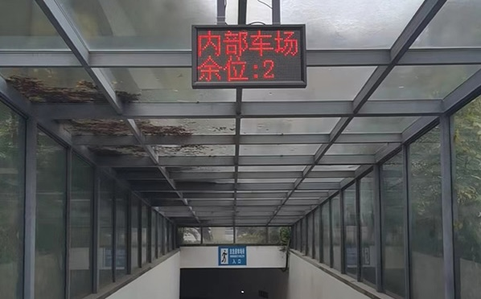
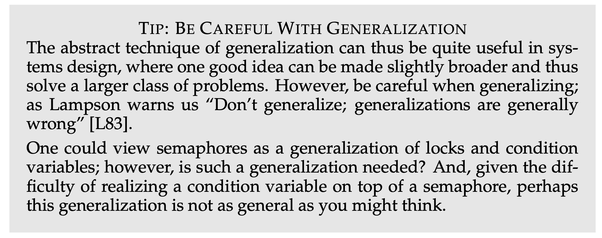

# 第 16 讲：并发控制——同步与信号量

> 原始讲义：[sources/notes/lect16.md](../../sources/notes/lect16.md)  
> 前一讲：[并发控制：条件变量](15-condition-variables.md) · 后一讲：[并发 Bug 和应对](17-concurrency-bugs.md)  
> 配套示例：[semaphore_dag.c](../../examples/semaphore_dag.c)、[bounded_buffer.c](../../examples/bounded_buffer.c)  
> 关键词：同步点、happens-before、semaphore、`P/V`、token、join、DAG、生产者—消费者、哲学家

## 0. 本讲定位：从“等待谓词”到“消费 token”

上一讲用 `mutex + condition variable` 等待任意共享谓词：

```c
// 教学伪代码
lock(&lk);
while (!condition())
  wait(&cv, &lk);
unlock(&lk);
```

它很通用，但若需求只是“等 A 完成一次”“收齐 n 份完成通知”或“最多允许 n 个线程进入”，我们仍要手工维护状态、锁和条件变量。本讲把一次完成或一个名额表示成可保存、可累计、可跨线程传递的 **token**，由此推导信号量。

信号量非常适合一次性 happens-before、join、DAG 和有界缓冲区；它却不取代条件变量。当同步条件是多个字段组成的任意谓词时，硬压成一个数字会让证明更难。本讲最后的哲学家、close/open 队列和错误 condvar 模拟都会展示这条边界。

```text
mutex：谁能进入临界区
condvar：共享谓词何时成立
semaphore：还有多少枚可消费 token
```

下一讲将从本章已经出现的哲学家循环等待出发，系统讨论死锁、数据竞争、原子性违反和顺序违反。

## 1. 学习目标与问题地图

学完本讲，你应该能够：

- 从计算图的边推导信号量，并解释跨线程 unlock mutex 为什么是 UB；
- 准确说明 `P/V`、初值、阻塞、发布和 token 守恒；
- 使用 POSIX `sem_init/sem_wait/sem_post/sem_destroy` 并处理关键错误；
- 用 semaphore 实现互斥、一次 `A → B` 和并发数上限；
- 用“一边一 semaphore”或“一节点一 semaphore”执行 DAG；
- 用完成计数实现 join，并说清它与 `pthread_join` 的区别；
- 推导生产者—消费者的 `empty/fill` 和完整不变量；
- 区分容量同步和队列数据结构互斥；
- 比较 semaphore 与 condvar 的适用条件；
- 找出哲学家朴素方案的死锁，证明两种 workaround；
- 构造简单 semaphore-condvar 模拟中“新 waiter 偷旧 token”的交错；
- 解释服务员/调度线程怎样集中处理复杂谓词。

| 问题 | 最小答案 | 位置 |
| --- | --- | --- |
| post 早于 wait 会丢通知吗？ | 不会，token 会保存在计数中 | §4、§6 |
| semaphore(1) 就是 mutex 吗？ | 能实现互斥性质，但没有 owner 等 mutex 合同 | §5 |
| 一次 post 能唤醒两个后继吗？ | 不能，一枚 token 只能被消费一次 | §7–§8 |
| empty/full 后队列还要锁吗？ | 要；token 不原子化 `head/tail/items` | §9 |
| 一个计数能表达任意“或”条件吗？ | 不自然；condvar 可直接等待全局谓词 | §11–§12 |
| 数 `nwait` 再 post 为何仍会错？ | 新一代 waiter 可能消费旧一代 token | §16 |

## 2. Review：同步点不等于等待者已经运行

同步点是全局状态达到确定条件的瞬间：`posedge(clk)`、`all_threads_done()`、`freak_guy_arrived()` 或 `CAN_PRODUCE`。条件此刻已经成立，但等待线程可能仍在睡眠或 ready queue 中；正确性不能依赖“通知后立即运行”。

同步还要发布内存效果。若 A 先写好结果，再用同步原语通知 B；B 越过对应等待后，才可可靠使用结果：

```text
A 在通知前的计算  happens-before  B 越过等待后的计算
```

条件变量用锁内谓词表达这个关系；模板中的 `while` 不是 CPU 忙等，`wait` 会阻塞线程，醒来后循环只负责重查谓词。本讲改问：如果“条件成立”就是“某人放来一枚许可”，能否直接等待许可？

## 3. 计算图和一个奇妙但非法的想法

### 3.1 DAG 的边就是同步合同

在有向无环图 `G=(V,E)` 中，节点是计算，`u → v` 表示 `work(u)` 完成并发布结果后，`work(v)` 才能开始。`v` 有多个前驱时，必须等待全部入边。图是 DAG 很重要：根节点可以启动；一个没有初始许可的依赖环可能所有节点都等前驱。

### 3.2 用 mutex 传递钥匙？

对每条边 `e: u → v` 分配一把 mutex：

```text
T_main: lock(e); spawn_threads()
T_u   : work(u); unlock(e)
T_v   : lock(e); work(v)
```

直觉上 main 先收走钥匙，`u` 做完归还，`v` 拿到才运行；release–acquire 的形状恰好建立 happens-before。课堂 `cgraph-mutex` 甚至可能在某些环境输出正确结果。

但 POSIX mutex 有**所有者**：main lock 的对象却由 `T_u` unlock，属于 undefined behavior；error-checking mutex 还可能报 `EPERM`。“本机能跑”不是 API 合法性证据。

保留这个错误想法中的正确需求：对象初始无钥匙；`u` 无需先 acquire 就能放下一把；`v` 可以稍后拿走；放和拿可由不同线程完成；通知早到也能保存。若桌上还能同时存在多把钥匙，我们就发明了 semaphore。

## 4. 信号量：一袋可计数的 token

### 4.1 从一把钥匙到 count

二值钥匙可写成 `k∈{0,1}`；推广为非负计数：

```text
P/Acquire：等 count > 0，然后原子地 count--
V/Release：原子地 count++，并让等待者有机会继续
```

课堂沿用 Dijkstra 的 `P/V`：P 又称 wait/down/acquire，讲义以 Prolaag（try + decrease）助记；V 又称 post/up/release，讲义以 Verhoog（increase）助记。词源转写不如操作含义重要。

停车位、游泳馆手环、餐厅桌位都可视为同质 token。初值 `k` 等价于系统已有 `k` 枚许可；每个成功 P 必须消费一枚初始 token 或某次 V 产生的 token：

```text
初始 token + 已完成 V = 已成功 P + 尚未消费 token
```



比喻的边界同样关键：semaphore 只限制进场数，不替你选择具体车位，也不阻止两辆车错误地登记同一位置。资源表仍要其他互斥机制。

### 4.2 用上一讲的原语实现 P/V

```c
// 教学伪代码：省略取消、销毁、溢出与错误处理。
void P(sem_t *s) {
  mutex_lock(&s->lk);
  while (s->count == 0)
    cond_wait(&s->cv, &s->lk);
  s->count--;
  mutex_unlock(&s->lk);
}

void V(sem_t *s) {
  mutex_lock(&s->lk);
  s->count++;
  cond_broadcast(&s->cv);
  mutex_unlock(&s->lk);
}
```

内部锁使“检查并减一”不可分割；零 token 时 condvar 阻塞，不占 CPU 自旋；V 先修改持久状态再通知，所以 waiter 晚运行也不会丢 token。讲义为直接套模板用了 broadcast；一次 V 只增加一个 token，成熟实现通常只需让一个 waiter 取得进展，且不应由此假设 FIFO 公平。

### 4.3 POSIX API 与错误处理

```c
#include <errno.h>
#include <semaphore.h>
#include <stdio.h>
#include <stdlib.h>

static void P_checked(sem_t *s) {
  while (sem_wait(s) == -1) {
    if (errno == EINTR) continue;
    perror("sem_wait"); abort();
  }
}

static void V_checked(sem_t *s) {
  if (sem_post(s) == -1) { perror("sem_post"); abort(); }
}
```

- `sem_init(&s, 0, value)` 创建同进程线程共享的未命名 semaphore；失败返回 `-1`，必须检查；
- `sem_wait` 有 token 就原子消费，否则阻塞；被信号中断可返回 `EINTR`；
- `sem_trywait` 无 token 时立即报 `EAGAIN`；`sem_timedwait` 还要处理超时和时钟；
- `sem_post` 产生 token，连续误 post 可让计数超过协议上限，甚至报 overflow；
- 只有确认无人再访问或等待后，才能检查并调用 `sem_destroy`；
- `pshared != 0` 时对象必须位于真正的进程共享内存；命名 semaphore 使用 `sem_open` 系列。

`sem_getvalue` 只是瞬时观察，读完计数就可能变化，不能用于“先查再决定是否 wait”的正确性判断。

### 4.4 libc、futex 与硬件不是同一层

```text
程序协议/token 含义
  → POSIX sem_wait/sem_post API
  → libc 用户态原子快路径
  → 竞争时用 futex 等内核阻塞/唤醒
  → 硬件原子 RMW 与内存序
```

`sem_wait` 是库 API，不保证每次系统调用；futex 也不是完整 semaphore。实际内部计数可以与教学模型不同。在本课的 POSIX 模型中，可把对应的 `sem_post → sem_wait` 视为 release–acquire：post 前发布的数据对成功消费 token 的线程可见；程序通常不依赖多枚 token 中“具体消费了哪一次 post”的身份。

## 5. 热身：用 semaphore(1) 实现互斥

```c
// 教学伪代码
sem_t s = SEM_INIT(1);
void lock(void)   { P(&s); }
void unlock(void) { V(&s); }
```

唯一 token 被拿走后，其他线程只能等待，因此 `available + threads_inside = 1`。这就是“mutex 是 semaphore 的特例、semaphore 是 mutex 的计数推广”的抽象含义。

API 层面却不能随意替换：mutex 表示所有权，通常只能由 owner unlock，并可有 error-check、robust、priority-inheritance 等属性；semaphore 允许另一线程 post。若 semaphore 版 unlock 被误调用两次，计数可变成 2，互斥悄悄失效。意图是临界区所有权时优先用 mutex；意图是跨线程许可时才用 semaphore。

## 6. 两种典型应用

### 6.1 一次临时 happens-before

初始化 `s=0`：

```text
T_A: A; V(s)
T_B: P(s); B
```

得到 `A → V(s) → P(s) 返回 → B`。A 先完成时 token 会保存，B 后到仍可消费；condvar 若无人等待则不保存 signal，但它会把完成事实保存在锁内谓词中，同样可以正确。循环复用 semaphore 时必须定义 generation，避免上一轮多余 token 被下一轮消费。

### 6.2 控制并发数 `<= n`

令 `slots=n`，线程进入资源前 P，离开后 V，则 `available + holders = n`，所以 holders 不超过 n。这个模型用于连接池、设备名额和并行任务上限。

边界包括：异常路径漏 V 会泄漏容量；未 P 却 V 或 double-post 会凭空增容；许可只表示“可使用一个资源”，具体分配仍需锁；持有其他锁时阻塞 P 可能造成死锁；无死锁也不自动保证每线程公平。

## 7. join 和任意计算图的两种实现

### 7.1 join：逐边等待或聚合计数

每个 worker 有 `done[i]=0`：worker 完成后 `V(done[i])`，main 对每个 `done[i]` 执行 P。这是“一条完成边一个对象”，容易定位谁没完成。

也可共用 `done=0`：每个 worker 完成后 `V(done)`，main 连续 P n 次，收齐 n 枚“完成手环”后继续。worker 先结束也没关系，token 会累计。

这只实现 join 的同步意义。真实 `pthread_join` 还绑定具体线程、取得返回值并回收 joinable thread 资源；普通计数 semaphore 不知道谁失败，也不替代生命周期回收。

### 7.2 DAG 方法一：每条边一个 semaphore

为每条 `e:u→v` 初始化 `sem[e]=0`：

```c
// 教学伪代码
worker(v):
  for each incoming e: P(&sem[e]);
  work(v);
  for each outgoing e: V(&sem[e]);
```

每条边一一对应，证明和诊断直观，代价为 `O(|E|)` 个对象。一个前驱有 k 个后继时必须向 k 条边各 post，一枚 token 不能供 k 个 waiter 重复消费。

### 7.3 DAG 方法二：每个节点一个计数 semaphore

为节点 `v` 初始化 `ready[v]=0`；每个前驱完成后 `V(ready[v])`，节点执行 P 恰好 `indegree(v)` 次：

```c
worker(v):
  repeat(indegree(v)): P(&ready[v]);
  work(v);
  for each successor w: V(&ready[w]);
```

它把多条入边聚合到同一计数，空间降为 `O(|V|)`。节点只关心数量；若要区分来源、失败或结果，必须另设受保护状态。两法都依赖“每条逻辑边恰好 post/wait 一次”：少 post 永等，多 post 可能使下一轮提前运行。

## 8. 实验 1：观察 semaphore DAG 的偏序

[semaphore_dag.c](../../examples/semaphore_dag.c) 构造：

```text
                ┌→ compress ─┐
parse request ──┤             ├→ package
                └→ encrypt  ─┘
```

```bash
make -C examples semaphore_dag
for i in $(seq 1 5); do ./examples/semaphore_dag; done
```

中间两步可能交换：

```text
1. parse request
2b. encrypt metadata
2a. compress body
3. package response (both prerequisites satisfied)
```

应验证的是偏序而非唯一输出：parse 永远最先；compress/encrypt 可任意先后；package 必须等二者。源码故意按 `package, compress, encrypt, parse` 创建线程，说明 waiter 先到也没问题。parse post 两枚不同 token 是 fan-out，package wait 两个来源是 fan-in。

若环境允许 `ptrace`，可用 `strace -f -e futex ./examples/semaphore_dag` 观察慢路径；受限容器可能拒绝，快路径也可能没有相应 syscall。trace 只解释一次运行，正确性仍来自边的配对。示例为突出机制省略部分返回值处理，工程代码应按 §4.3 检查创建、等待、post、join 和销毁。

## 9. 生产者—消费者：在两个口袋间搬 token

容量 `depth` 对应 `empty=depth` 与 `fill=0`：

```text
producer: P(empty) → produce → V(fill)
consumer: P(fill)  → consume → V(empty)
```

生产者从 empty 口袋拿球，完成后放入 fill；消费者反向搬运。定义 `P_hold` 为生产者已取 empty、未 post fill，`C_hold` 类似，则始终有：

```text
empty + fill + P_hold + C_hold = depth
```

每次 P 只是把 token 从 semaphore 移到线程手中，每次 V 再移入另一口袋，总量不变。漏 post 会把 token 永久留在线程手中，double-post 会凭空造球。

课堂的 `printf("(")/printf(")")` 突出顺序；真实环形队列还有 `items/head/tail/count`。多个生产者即使各拿到合法 empty token，仍可能同时改 tail，所以必须另加 mutex：

```c
// 教学伪代码
producer(item):
  P(empty);
  lock(queue); enqueue(item); unlock(queue);
  V(fill);

consumer:
  P(fill);
  lock(queue); item = dequeue(); unlock(queue);
  V(empty);
  consume(item);
```

empty/fill 保护容量，queue mutex 保护数据结构。必须先 P 再锁队列：若生产者持 queue lock 等 empty，消费者无法取得锁 dequeue 并归还 empty，便会死锁。也必须 enqueue 完整后才 post fill，否则消费者可能读取未发布槽位。取消或错误发生在两种 token 之间时，还要安全回滚。

## 10. 实验 2：把 condvar 队列翻译成 token 不变量

[bounded_buffer.c](../../examples/bounded_buffer.c) 使用上一讲的 `mutex + not_empty + not_full`，正好作为对照：

```bash
make -C examples bounded_buffer
./examples/bounded_buffer
for i in $(seq 1 100); do
  ./examples/bounded_buffer | tail -n 1
done | sort | uniq -c
```

顺序可能变化，但两个生产者的 12 个对象应不重不漏，末行始终为 `consumer sum=1830`；`count` 始终在 `[0,CAPACITY]`，队列字段均在 lock 内访问。100 次压力不是证明，只是增加观察交错的机会。

| condvar 版本谓词/对象 | semaphore 视角 |
| --- | --- |
| `count < CAPACITY` / `not_full` | empty token |
| `count > 0` / `not_empty` | fill token |
| `queue.lock` | 两种版本都需要的数据结构互斥 |

实验目的不是机械改源码，而是先写同步条件和不变量，再判断 token 是否与问题同形。

## 11. Semaphore vs. condition variable

| 维度 | semaphore | condition variable |
| --- | --- | --- |
| 保存什么 | 可累计 token 计数 | cv 不保存业务状态 |
| 无 waiter 时通知 | post 留下 token | signal/broadcast 通常不留通知 |
| 等待条件 | `count > 0` | 锁内任意共享谓词 |
| 成功后 | wait 自动减一 | 醒来后程序重查/修改状态 |
| 典型场景 | 完成、容量、同质资源 | phase、组合条件、关闭/重开 |

能自然说成“生产/消费一枚同质许可”，选 semaphore；必须说成“当全局状态满足布尔表达式”，选 mutex + condvar。若 token 还要身份、payload、错误、取消或 generation，常应使用队列、channel、future 或显式状态机。

不要把 condvar 模板的 `while` 叫忙等：`cond_wait` 会阻塞，循环用于应对竞争、错误类型唤醒和 spurious wakeup。两类原语在理论上可互相构造复杂机制，但可构造不等于易证明、易维护。

## 12. 更复杂的“或”条件

上一讲三类线程打印 `<`、`>`、`_`，合法块是 `<><_` 或 `><>_`。打印 `_` 后，下一字符可为 `<` **或** `>`；条件由 phase、首字符和位置共同决定，而非某个总计数。

单个 semaphore 只能直接等待自身计数。也可为每类字符设 semaphore，`_` 后抛硬币 post `<` 或 `>`，再逐步传 baton；但漏/多 post 会留下 stale token，修改合法模式、加入公平和 shutdown 都很麻烦。condvar 可在一把锁下直接等待 `can_print(kind,state)`，更贴近规格。“不能表达”应理解为单个计数不自然，不是理论计算能力上的绝对不可能。

## 13. 哲学家：失败与两个成功尝试

### 13.1 同时需要左右叉

Dijkstra 的经典问题中，五位哲学家围桌，吃饭必须同时获得左右叉。若一把全局锁保护 `avail[]`，condvar 方案直接等待 `avail[left] && avail[right]`，并在同一临界区同时预留两把；归还后 broadcast。等待者不会拿着一把叉睡眠。


把每把叉当 semaphore(1) 的朴素方案却可能死锁：

```c
// 反例
P(&fork[left]);
P(&fork[right]);
eat();
V(&fork[right]);
V(&fork[left]);
```

五人可同时各拿左叉，再分别等邻居手中的右叉，形成闭环。每把叉从未双占，说明安全性不等于活性；两次 P 也不提供“两资源原子取得”。

### 13.2 Workaround 1：最多四人上桌

先 `P(room)`，其中 `room=4`；吃完归还叉和 room。即使四位上桌者都拿到左叉，也至少有一位缺席者对应的叉空闲，缺席者左邻可取得它作为右叉，至少一人能吃完并释放资源，所以不会形成五人闭环。

这证明无该死锁，不证明公平：某人仍可能长期抢不到 token。异常路径必须按协议归还已取得的每个资源。

### 13.3 Workaround 2：lock ordering

给叉子编号，总是先 P `min(left,right)`，再 P `max(left,right)`。等待边只能从小编号指向大编号，严格递增序列不可能成环，因此打破 circular wait。编号必须稳定，所有路径必须一致；它仍不自动保证公平或高吞吐。

两个 workaround 在给定前提下确实正确，但“成功”不等于信号量总是优雅。真正条件是“两把叉同时可用”；semaphore 先允许部分持有，再靠 room 或编号修补。系统要求 absolutely correct：前提、取消、生命周期和公平都必须写清。



## 14. 加强版生产者—消费者：`close/open` 打破纯计数模型

在 put/get 外加入 `close()` 和 `open()`，讲义故意留下 `???`。先要定义规格：close 后新 put/get 是失败还是阻塞？能否排空旧对象？已拿 token 的在途操作怎么办？多个 close 何时成为 `all_closed`？open 怎样区分新旧 generation？

一种监视器可能维护：

```text
phase ∈ {OPEN, CLOSING, CLOSED, OPENING}
count, active_put, active_get, pending_close, can_reopen, generation
```

再写谓词，例如 `can_put = OPEN && pending_close==0 && count<capacity`，`can_close = CLOSING && active_put==0 && active_get==0`，`can_open = CLOSED && all_closed`。若规格允许关闭后排空，`can_get` 就相应改变。condvar 不要求条件长成固定形状；状态改变后 broadcast，线程醒来重算即可。

纯 empty/fill 方案会有 stale permit：close 时仍有 empty token，生产者可错误通过；试图收走所有 token 又会与在途持有者竞争。增加 `opened/all_closed/can_reopen` 等 semaphore 后，多资源顺序和回滚问题又像哲学家一样出现。不是做不到，而是全局 phase 谓词更适合 condvar/monitor。关键仍是先理解同步条件。

## 15. 用 semaphore 实现 condition variable 的陷阱

### 15.1 诱人的错误实现

```c
// 反例：不是正确 condvar。
wait(cv, mutex):
  cv->nwait++;
  unlock(mutex);
  P(&cv->sleep);
  lock(mutex);

broadcast(cv):
  lock(&cv->lock);
  repeat(cv->nwait): V(&cv->sleep);
  cv->nwait = 0;
  unlock(&cv->lock);
```

若 `nwait++` 和 broadcast 没用同一内部锁，先已有 data race；即使修复，token 仍没有 generation 身份。

### 15.2 新 waiter 偷旧 token

```text
W_old                     B                       W_new
nwait++；释放业务 mutex
暂停
                          读到 nwait=1
                          V(sleep)；nwait=0
                                                  开始新一代 wait
                                                  先 P，消费旧 token
W_old 恢复后 P，没有 token，永久阻塞
```

`W_new` 在 broadcast 后才开始等待，本不属于这次 broadcast，却抢走给 `W_old` 的许可。condvar 要求“释放关联 mutex + 成为本代可唤醒 waiter”相对于通知不可分割，还要隔离新旧代。一个 `nwait + semaphore` 做不到。

可靠实现还需处理 signal 与 broadcast、spurious wakeup、重获 mutex、timeout、取消、销毁、overflow 和惊群。可以用内部锁、两个 turnstile、序列号和 waiter–signaler handshake 构造，但正如讲义引用的 2003 年报告所说，这件事 surprisingly tricky。

Linux futex wait 带 expected value：值已改变就不睡，从而关闭“检查旧值后错过 wake”的窗口。但 futex 不知道业务谓词，也不自动管理 condvar generation、关联 mutex 和取消；libc 仍需用序列计数与原子状态完成 POSIX 合同。“问操作系统”是借助可靠阻塞机制，不是一条 syscall 就得到 condvar。

## 16. 调度线程：发叉子的服务员

另一种办法是重构：让 waiter/server 线程独占全局调度状态。工作线程发送“需要左右叉”等请求，再 `P(can_proceed[tid])`；服务员只有在谓词满足时才原子预留资源并 post 对应私有 semaphore。post 可早于 wait，所以授权不会因工作线程尚未睡下而丢失。

这不是 semaphore 自动表达任意条件，而是服务员计算条件，semaphore 只传最终授权。请求队列仍需安全 channel，每轮需 request id/generation，防止旧许可跨轮。若维护 ready 集合，单次调度可接近 `O(1)`；任务足够粗时开销可摊薄，但中央线程也可能成为瓶颈。

## 17. 常见误区与机制边界

- semaphore 不是普通 `int`；原子 test/decrement、阻塞、内存序和生命周期都是合同。
- count 是许可，不是资源本身；容量同步不能替代资源表/队列的 mutex。
- 初值 1 不保证永远二值；double-post 可使计数变 2。
- 一次 post 只产生一枚 token，不是 broadcast；fan-out 必须逐边 post。
- token 没有生产者身份；需要 payload/错误时用受保护队列、channel 或 future。
- 有在途操作时不是 `empty+fill=depth`，而是还要加 `P_hold+C_hold`。
- 无死锁、无饥饿、公平、安全、异常可恢复是不同性质。
- 多跑几次只采样调度；先写守恒式、配对和等待图，再用压力测试或工具找反例。

## 18. 小结、思考题与下一讲

信号量把 mutex 的一把钥匙推广成可计数、无 owner 的 token。初值 0 适合一次 `A→B`，初值 n 适合容量控制；完成 token 可实现 join；DAG 可按边或按节点聚合；生产者—消费者则是 empty/fill token 的守恒搬运。

它最优雅的时候，问题本来就是计数。`<><_`/`><>_`、左右叉同时可用、close/open generation 是全局谓词，condvar 或集中调度器更贴合。信号量不会替程序员写不变量、处理失败或证明活性。

思考题：

1. 画出 post 先于 wait 与 wait 先于 post 两条时间线，说明为何都保证 `A→B`。
2. semaphore(1) 被误 post 两次后，互斥为何失效？mutex 能提供什么额外诊断？
3. 一个 DAG 节点有三个后继，只 post 一次会怎样？按边和按节点方案分别如何修正？
4. 为什么完成计数 join 仍不能代替 joinable pthread 的资源回收？
5. 容量 4 时两位 producer 已取得 empty、尚未 enqueue，完整守恒式是什么？
6. 把 `V(fill)` 移到 enqueue 前，构造 consumer 读到未发布槽位的交错。
7. `room=4` 的证明依赖哪些前提？它为什么不证明无饥饿？
8. lock ordering 排除循环等待，能否排除同线程重复锁同一 mutex 的 AA 死锁？
9. 为错误 condvar 模拟加 generation 后，还需哪些机制防止新 waiter 偷 token？
10. 为 close/open 队列分别写“关闭后允许排空”和“不允许排空”的 `can_get`。

下一讲[并发 Bug 和应对](17-concurrency-bugs.md)会把本章的失败系统化：哲学家是 ABBA/circular-wait 死锁；post 次数、对象或时机错误会造成顺序违反；还会进一步讨论数据竞争、原子性违反、lock ordering 和检测工具。

阅读材料：*Operating Systems: Three Easy Pieces* 第 31 章；本机 `man 3 sem_wait` 与 `man 7 sem_overview`；讲义引用的 *[Implementing Condition Variables with Semaphores](http://birrell.org/andrew/papers/ImplementingCVs.pdf)*。

## 19. PPT 内容覆盖表

| 原讲义主要标题/内容 | 本章位置 |
| --- | --- |
| Review & Comments：同步点、条件已达成但线程未继续、happens-before | §2 |
| 条件变量 `lock/while/wait/unlock`、broadcast | §0、§2 |
| 计算图和一个奇妙的想法：任意 DAG、每边一把 mutex | §3 |
| 使用互斥锁实现计算图；`u unlock → v lock` 与跨线程 unlock 的 UB | §3.2 |
| 奇妙想法的扩展：release/acquire 钥匙与多个 token | §3.2、§4.1 |
| 祝贺，你发明了信号量 (Semaphore)：P/Prolaag、V/Verhoog | §4.1 |
| 停车场、游泳馆、餐厅与类比边界 | §4.1 |
| 信号量 API：mutex + condvar 实现、POSIX API、初值与配对 | §4.2–§4.3 |
| 热身：用信号量实现互斥锁 | §5 |
| 信号量的两种典型应用：一次 HB、并发数不超过 n | §6 |
| 实现计算图的两种方式：每边、每节点计数 | §7.2–§7.3 |
| 使用信号量实现线程 join：逐边/聚合完成计数 | §7.1 |
| 使用信号量实现计算图：收齐入度 token | §7.2–§7.3、实验 1 |
| 例子：优雅地实现生产者-消费者；empty/fill 搬球 | §9 |
| 使用信号量实现生产者-消费者问题 | §9、实验 2 |
| printf caveat；真实数据结构还需互斥 | §9 |
| `empty + fill + P_hold + C_hold = depth` | §9、实验 2 |
| 信号量 v.s. 条件变量 | §11 |
| 实现更复杂的同步问题：`<><_`/`><>_` 与“或”条件 | §12 |
| 哲 ♂ 学家吃饭问题、左右叉与 condvar 谓词 | §13.1 |
| 哲学家吃饭问题演示：限制最多四人 | §13.2 |
| 失败尝试：每人先拿左叉 | §13.1 |
| 成功的尝试：信号量；最多四人上桌 | §13.2 |
| 成功尝试 2：Lock Ordering | §13.3 |
| “不！这不成功”：绝对正确、计数不总是条件 | §13.3 |
| 加强版生产者/消费者问题：put/get/close/open | §14 |
| pending close、`all_closed → can_reopen` | §14 |
| 用信号量实现条件变量：`nwait + sleep` | §15.1 |
| 新 waiter 偷唤醒；release-wait 必须不可分割 | §15.2 |
| futex 的作用与边界 | §15.2 |
| 调度线程/发叉服务员、per-thread can_proceed | §16 |
| 调度近 O(1)，任务分解合适可摊薄开销 | §16 |
| Takeaways：计数推广很优雅，但不万能 | §18 |
| 阅读材料：OSTEP 第 31 章 | §18 |
