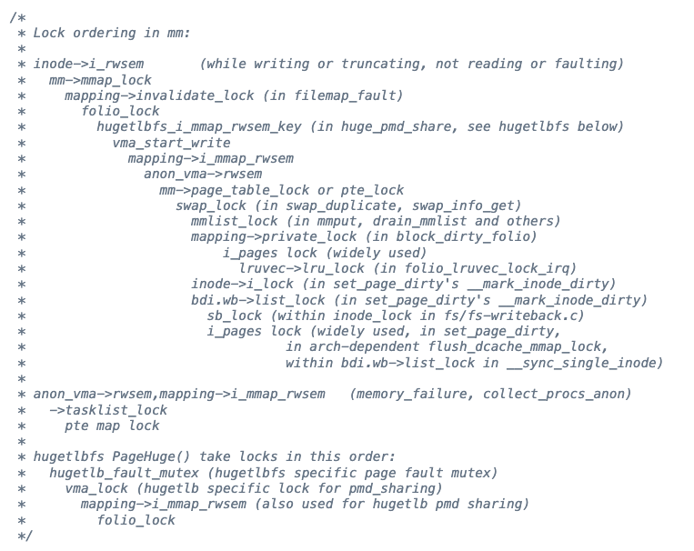
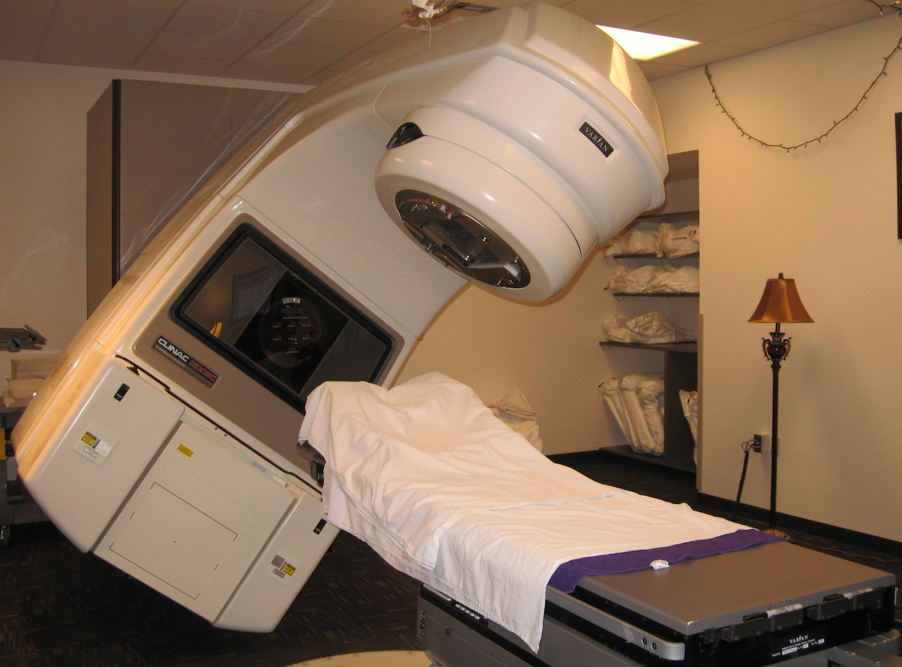
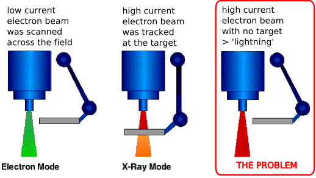
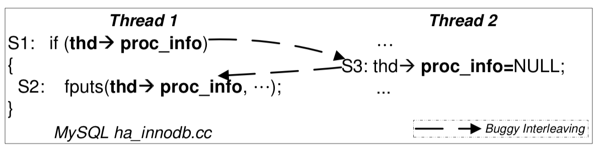
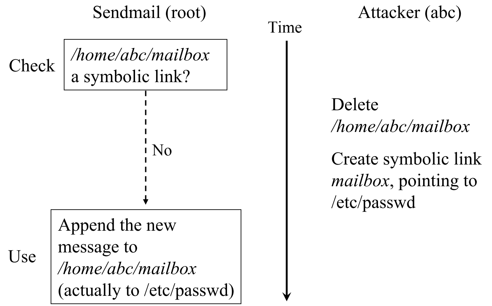
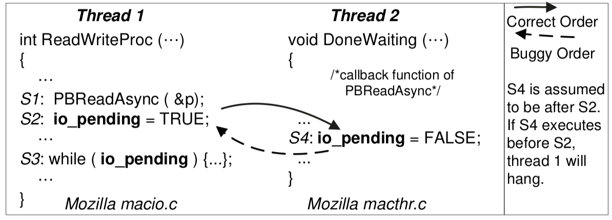

# 第 17 讲：并发 Bug 和应对

> 原始讲义：[sources/notes/lect17.md](../../sources/notes/lect17.md)  
> 前一讲：[并发控制：同步与信号量](16-semaphores.md)  
> 后一讲：[并行算法与数据结构](18-parallel-algorithms.md)  
> 本讲关键词：deadlock、AA、ABBA、lock ordering、lockdep、data race、happens-before、ThreadSanitizer、Therac-25、atomicity violation、order violation、Harness Engineering

## 0. 本讲定位：原语齐了，为什么程序仍然会错？

前几讲逐步获得了四组并发工具：

```text
spawn / join                 创建行动者、等待它结束
lock / unlock                互斥访问共享状态
wait / signal / broadcast    等待任意共享谓词
P / V                        生产和消费可计数的 token
```

上一讲的信号量尤其容易给人一种错觉：既然互斥和同步都能表达，并发编程似乎已经“学完了”。但原语只提供能力，不会替程序员补上协议。多拿一把锁可能永久等待，少拿一把锁可能产生数据竞争；即使每次访问都上了锁，临界区切得太碎或事件顺序没有表达，仍会得到完全合法、却违背业务含义的执行。

本讲转换视角：不再发明新同步原语，而是从真实错误中建立一张故障地图：

```text
                  并发 Bug
                     │
          ┌──────────┴──────────┐
          │                     │
       死锁：不再前进        非死锁 Bug
          │                     │
       AA / ABBA        data race / AV / OV
          │                     │
      lock ordering        happens-before 与审计
          └──────────┬──────────┘
                     ▼
              Harness Engineering
```

下一讲将研究并行算法和数据结构怎样 scale up / scale out。那里的 `job->run()` 只有在依赖都完成、共享状态协议正确时才有意义；因此本讲是从“会用同步原语”走向“敢让程序并行扩展”的正确性地基。

## 1. 学习目标与问题地图

学完本讲，你应该能够：

- 用等待图解释 deadlock，并构造 AA 与 ABBA 的最短执行；
- 写出死锁的四个必要条件，说明打破每一项的代价；
- 证明严格 lock ordering 为什么消除循环等待，并解释它在大型系统中的扩展困难；
- 解释用户态锁追踪器和 Linux lockdep 如何从运行历史构造锁依赖图；
- 准确定义 C/C++ data race，并区分 data race 与更宽泛的 race condition；
- 识别“上错锁”“漏锁”、跨堆/栈/库代码的冲突访问；
- 用 ThreadSanitizer 观察 happens-before race，同时说清动态检测的边界；
- 重建 Therac-25 的快速编辑竞态、8 位计数器溢出以及硬件互锁缺失的系统性后果；
- 区分 atomicity violation（AV）与 order violation（OV），并为二者选择修复方式；
- 把 RAII、锁序、动态追踪、断言、可审计 trace 和故障注入理解为同一类 Harness Engineering。

问题路线是：AA/ABBA 为什么停住（§3–§6）→ 四条件和锁序怎样破环（§7–§10）→ data race 与 TSan 怎样定义和观察错误（§11–§15）→ Therac-25 如何把竞态升级为系统事故（§16–§20）→ 没有 data race 后为何仍有 AV/OV（§21–§26）。

## 2. Review：人类是 sequential creature

课程把并发学习概括为“入门到放弃”：人在物理世界里会 `spawn`、`join`，会传钥匙、排队和等待，但我们最熟悉的程序仍是从上到下执行。函数调用又不断强化两种直觉：

- 调用返回时，动作已经完成；
- 函数像一个不可分割的块，要么全做，要么全不做。

并发程序会打破这两点。另一个线程可以插进当前函数的任意两次内存访问之间；向设备发出“切换模式”也可能只启动一个需要数秒、未来才完成的物理动作。源码看起来相邻，不等于运行时不可分割；函数已经返回，也不等于外部副作用已经生效。

“理解一个并发程序的所有行为”在一般情形下极其困难。与其要求每位程序员在脑中穷举调度，不如像生物学归纳病例那样，从错误中提炼常见形状，并把检查交给工具。本讲不断重复的 **Harness Engineering** 就是：设计约束、包装和观测设施，让错误更难写、更早暴露、事后更容易还原。

讲义开头还保留了当次课程的行政提醒：4 月 30 日周四闭卷期中测验，假期出行者需自行安排。这不影响技术主线，却说明本讲处在互斥、条件变量和信号量之后的阶段复盘点。

## 3. 死锁：每个人都在等待组内另一个人

Deadlock 是一种全局状态：一组行动者中的每个成员都在等组内另一个成员采取行动，等待关系最终也可能绕回自己。关键不是“程序慢”，而是如果没有外部干预，这组行动者已经没有可执行的内部转移。


最小模型是一张等待图：

```text
线程节点 T ──等待──> 资源节点 L
资源节点 L ──持有──> 线程节点 T
```

若资源不可抢占，图中的有向环就是死锁候选。对每种资源都只有一个实例时，环也足以判定死锁；有多个实例、可撤销请求或更复杂协议时，还要结合资源数量和状态判断。

死锁是 **liveness** 失败：程序不再取得进展。它与 safety 失败不同——余额算错、越界访问属于“发生了不该发生的事”；死锁则是“该发生的事永远不再发生”。测试超时能观察症状，但不能告诉我们是哪条等待环造成的。

## 4. AA-Deadlock：自己等自己

最短的等待环只有一个节点：

```c
pthread_mutex_lock(&A);
pthread_mutex_lock(&A);  // A 已由当前线程持有
```

对不可重入的普通 mutex，第二次 acquire 等待 A 被释放；唯一能释放 A 的线程正停在第二次 acquire，于是形成 `T → A → T`。

这段代码看起来太傻，却很容易被真实控制流隐藏：

- `outer()` 持有 A 后调用 `inner()`，而 `inner()` 的内部实现也拿 A；
- 递归在第二层重新进入同一临界区；
- 持锁调用外部 callback，callback 又回调原模块；
- 持锁代码被信号处理程序重入；而多数 pthread API 本来也不是 async-signal-safe；
- 错误处理、析构或日志路径偷偷取得正常路径已经持有的锁。

因此“我不会连续写两次 lock”没有证明价值。真正要审计的是动态调用图和所有隐藏入口。

mutex 类型也必须分清：

- `PTHREAD_MUTEX_NORMAL` 不记录递归层数，同一线程重锁会死锁；
- `PTHREAD_MUTEX_ERRORCHECK` 可返回 `EDEADLK`，适合调试错误协议；
- `PTHREAD_MUTEX_RECURSIVE` 允许重入并累计次数，必须等量 unlock；
- 默认类型的具体行为不能用来替代显式设计，程序不应依赖“我这里恰好会报错”。

递归锁有时符合真正的递归所有权，但把 normal 换成 recursive 往往只是遮住分层设计错误：内层函数究竟要求调用者持锁，还是自己管理锁？接口合同仍然含糊。

## 5. 实验 1：亲眼区分 normal、error-checking 与 recursive mutex

下面的 Linux/POSIX 程序显式创建三种 mutex，并在同一线程内连续加锁两次。将它保存为 `/tmp/aa-deadlock.c`：

```c
#define _XOPEN_SOURCE 700
#include <errno.h>
#include <pthread.h>
#include <stdio.h>
#include <stdlib.h>
#include <string.h>
static void ck(int e, const char *op) {
  if (e) { fprintf(stderr, "%s: %s\n", op, strerror(e)); exit(EXIT_FAILURE); }
}
int main(int argc, char **argv) {
  if (argc != 2) {
    fprintf(stderr, "usage: %s normal|errorcheck|recursive\n", argv[0]);
    return EXIT_FAILURE;
  }
  int type = strcmp(argv[1], "normal") == 0 ? PTHREAD_MUTEX_NORMAL :
             strcmp(argv[1], "errorcheck") == 0 ? PTHREAD_MUTEX_ERRORCHECK :
             strcmp(argv[1], "recursive") == 0 ? PTHREAD_MUTEX_RECURSIVE : -1;
  if (type == -1) {
    fprintf(stderr, "unknown mutex type: %s\n", argv[1]);
    return EXIT_FAILURE;
  }
  pthread_mutexattr_t a; pthread_mutex_t m;
  ck(pthread_mutexattr_init(&a), "attr_init");
  ck(pthread_mutexattr_settype(&a, type), "attr_settype");
  ck(pthread_mutex_init(&m, &a), "mutex_init");
  ck(pthread_mutexattr_destroy(&a), "attr_destroy");
  ck(pthread_mutex_lock(&m), "first lock");
  puts("first lock acquired; trying the second lock...");
  fflush(stdout);
  int second = pthread_mutex_lock(&m);
  if (second == EDEADLK) {
    puts("second lock rejected with EDEADLK");
  } else {
    ck(second, "second lock");
    puts("second lock acquired");
    ck(pthread_mutex_unlock(&m), "recursive unlock");
  }
  ck(pthread_mutex_unlock(&m), "final unlock");
  ck(pthread_mutex_destroy(&m), "mutex_destroy");
  return EXIT_SUCCESS;
}
```

编译并运行；`timeout` 来自 GNU coreutils，只负责防止实验终端永久挂住：

```bash
cc -std=c11 -O2 -Wall -Wextra -Wpedantic -pthread \
  /tmp/aa-deadlock.c -o /tmp/aa-deadlock

timeout 1s /tmp/aa-deadlock normal
echo "normal status=$?"
/tmp/aa-deadlock errorcheck
/tmp/aa-deadlock recursive
```

normal 只打印第一行，随后被 `timeout` 终止（状态 124）；error-checking 报 `EDEADLK`；recursive 取得第二层锁并经两次 unlock 复原。`timeout` 只观察到“很久没结束”，并未证明等待图；课程的[死锁演示](/OS/demos/concurrency/deadlock)还展示下一节的多线程环。

## 6. ABBA-Deadlock：哲学家把局部正确拼成全局环

两个线程、两把锁就能形成经典 ABBA：

```text
T1: lock(A) ───────────────> lock(B)
T2:          lock(B) ───────────────> lock(A)

持有关系：A → T1，B → T2
等待关系：T1 → B，T2 → A
合起来：T1 → B → T2 → A → T1
```

每个线程单独看都遵守“先拿锁、再访问、最后释放”，错误来自两条路径的锁序相反。哲学家就餐只是把环放大：每人先拿左叉再拿右叉；若所有哲学家恰好都拿到左叉，所有人都在等邻居持有的右叉。


ABBA 往往是调度相关的。若 T1 很快拿完 A、B 并释放，测试会通过；只有两线程各拿第一把锁后才暴露。这解释了为什么“运行很多次没挂”不是证明，也解释了为什么检测**潜在锁序环**比等真实死锁发生更有效。

## 7. 死锁的四个必要条件：打破任何一个都能排除死锁

[System Deadlocks（1971）](https://dl.acm.org/doi/10.1145/356586.356588)归纳出的四项通常称为 Coffman conditions。讲义用桌上钥匙来解释：

1. **Mutual exclusion（互斥）**：一把钥匙同时只能被一个人持有；
2. **Hold and wait / wait-for（持有并等待）**：已经拿到钥匙的人继续等更多钥匙；
3. **No preemption（不可抢占）**：系统不能强行拿走别人持有的钥匙；
4. **Circular wait（循环等待）**：等待关系形成闭环。

它们是必要条件，不是充分条件。四项同时成立表示系统具备死锁的结构条件，不表示这一次执行必然进入死锁；打破任意一项，才可从结构上排除死锁：

| 打破的条件 | 设计方式 | 主要代价或边界 |
| --- | --- | --- |
| 互斥 | 不共享可变状态；immutable snapshot；向单一 waiter/actor `send/receive` | 常需重构数据所有权，通信也会阻塞或形成别的环 |
| 持有并等待 | 一把大锁；一次申请全部资源；拿不到就释放并重试 | 并行度下降；释放重试可能 livelock；操作可能需要回滚 |
| 不可抢占 | 撤销持有者、回滚事务后回收资源 | 普通内存副作用难回滚，transactional memory 很难覆盖 I/O |
| 循环等待 | 给锁建立严格全局顺序 | 最实用，但大型系统中的排序、例外和演化都很难维护 |

讲义用一个内容混乱、来源可疑的百科词条提醒读者：背下四句定义并不等于会设计系统。搜索摘要、转载语料乃至大模型 token 中都可能混有断章取义或垃圾片段。可靠做法是回到原始论文和 API 合同，再对具体协议画等待图、写假设、给证明。来源质量本身也是 Harness Engineering 的一部分。

## 8. 实际系统怎样避免死锁

死锁 prevention、avoidance、detection/recovery 常被混成一句“避免死锁”，工程上应分开：

- **设计时排除**：封装锁、禁止嵌套、全局锁序、actor/message passing；这是最强的保证；
- **运行时避免**：只有确认资源分配后仍处于安全状态才批准请求；银行家算法是教学代表，但通用软件通常不知道未来最大请求；
- **运行时检测**：记录等待图或锁依赖图，发现环后报警；检测不自动修复已经发生的副作用；
- **恢复**：终止线程/进程、撤销事务、重启组件；只有状态可回滚或可重建时才可靠。

几条很朴素的规则通常比复杂恢复更有价值：

- 缩短临界区，尽量不同时持有多把锁；
- 锁不暴露到模块头文件，持锁时不调用不可控的 callback、插件、日志钩子或跨模块复杂函数；
- 为“调用者必须持锁”和“函数内部自行加锁”使用清晰命名、类型或注解；
- 异常、取消、早返回都必须释放锁；C++/Rust 用 RAII guard，C 用统一清理路径；
- `trylock + backoff` 可避免永久占有，却可能造成 livelock 或饥饿，不能当成自动正确；
- timeout 是故障隔离和报警手段，不是互斥协议的证明。

## 9. Lock ordering：最实用的破环方法

给系统内每把锁一个严格等级 `rank(L)`，只允许线程按编号从小到大获取：

```c
lock(smaller);
lock(larger);
/* critical region */
unlock(larger);
unlock(smaller);
```

证明可以直接反证。若存在锁环 `L1 → L2 → ... → Ln → L1`，每条边都代表线程持有前者时请求后者，因此：

```text
rank(L1) < rank(L2) < ... < rank(Ln) < rank(L1)
```

严格序不可能回到更小的起点，所以环不存在。换一种课堂直觉：当前已持有锁中编号最大的那一把的持有者若还要锁，只能请求更大的锁；若请求的锁已被别人持有，它才应是“当前最大”，产生矛盾。因此在公平调度且线程最终释放锁的假设下，总有人能继续。证明也可扩展到 lock group：先按组号排序，再定义组内规则。

真实内核会把这些规则写成局部文档。例如 Linux [`mm/rmap.c`](https://elixir.bootlin.com/linux/latest/source/mm/rmap.c) 附近维护复杂的内存管理锁序；图示的价值不是要求读者背编号，而是显示对象关系、页表、匿名映射和中断上下文都会加入层级。



不过，[Linux Kernel 的 locking 指南](https://www.kernel.org/doc/html/latest/kernel-hacking/locking.html)也明确指出，全内核单一巨大锁层级不易扩展：新增一把锁的人很难理解它应插入数千层中的哪里。更好的局部设计是让锁封装在同一文件或组件里，持有它时不调用模块外的复杂函数。这样模块使用者甚至不必知道内部有锁。

[LockDoc（EuroSys 2019）](https://dl.acm.org/doi/10.1145/3302424.3303948) 对真实代码的研究发现，有文档锁规则的变量中只有 53% 始终按规则访问。文档仍重要，但不能是唯一防线。

## 10. Harness Engineering：让 lockdep 替人记住所有历史

项目可以规定 RAII 和 lock ordering，但更防御性的假设是：程序员最终会漏掉规则。于是每次 acquire/release 都留下可检查的事实。

一个教学版 lockdep 的核心只有几步：

```text
每线程维护 held = 当前持有的锁集合

acquire(B):
    对 held 中每个 A，向依赖图加入 A → B
    若图中已经存在 B 到 A 的路径，报告潜在环
    真正执行 lock(B)，成功后把 B 加入 held

release(B):
    检查 B 确由当前线程持有
    真正执行 unlock(B)，再从 held 删除 B
```

AA 会产生自环 `A → A`；两条测试路径分别观察到 `A → B` 和 `B → A`，即使真实四步从未同时发生，也能报告潜在 ABBA。课程的 [lockdep 演示](/OS/demos/concurrency/lockdep)用 `LD_PRELOAD` 拦截 `pthread_mutex_lock/unlock`，因此可以这样想象：

```bash
LD_PRELOAD=./locktrace.so ./a.out | python3 check.py
```

`LD_PRELOAD` 方案只覆盖动态链接且确实经过被拦截符号的调用；静态链接、内联原子、自定义锁可能不可见。完整工具还要处理锁地址复用、递归锁、读写锁、失败的 trylock、`cond_wait` 暂时释放并重获 mutex、线程退出、`fork` 和信号上下文。

Linux 内核真正的 [lockdep](https://docs.kernel.org/locking/lockdep-design.html)以 **lock class** 而非每个对象实例为主要节点，还追踪 hardirq/softirq 使用状态、读写锁和嵌套子类。它的厉害之处是组合历史：只需分别走过简单锁链，就能推导某个罕见多 CPU 调度是否可能成环，无需等生产环境真的卡死。

历史合并会“错杀”分阶段但实际不可并发的顺序，例如第一阶段观察 `A → B`，线程全部结束后第二阶段才观察 `B → A`。工程上常宁愿用注解、锁类或重构消除歧义，也不把如此复杂的阶段证明留给每位维护者。这正是 Harness Engineering：主动减少心智状态空间。

## 11. 不上锁就不会死锁——然后迎来 data race

对 C/C++，更准确的 data race 定义是：两个可能并发的执行在同一内存位置进行**冲突访问**，至少一个是写、至少一个是非原子访问，并且二者之间没有 happens-before。它不是“跑得快的线程赢了”，而是语言层面的 undefined behavior。

典型形状包括：

```c
// check-then-act
if (balance >= amount) {
  balance -= amount;
}

// read-modify-write
sum++;
```

两次普通 load/store 可能交错，编译器还可以在“正确程序没有 data race”的前提下优化。`volatile` 主要约束特定可观察访问，既不把 `sum++` 变成原子操作，也不建立跨线程同步。Peterson 协议若直接用普通 C 变量实现，同样会掉进语言和硬件内存模型的缺口。

Java Memory Model 试图为更多 racy 执行规定边界，这不等于 race 是好设计；单字段 `volatile` 也不会自动把余额的检查与扣款合成一个事务。

还要区分两个词：

- **data race** 是语言内存模型中的技术条件；
- **race condition** 是结果错误地依赖时序的更宽概念。

没有 data race 的原子操作仍可能有业务 race；后面的 AV/OV 就经常如此。

## 12. 两种看似幼稚、实际无处不在的数据竞争

### 12.1 上错了锁

```c
void T1(void) { lock(&A); sum++; unlock(&A); }
void T2(void) { lock(&B); sum++; unlock(&B); } // B 不能和 A 互斥
```

“两边都上锁”不是证明。锁保护的是一条所有访问者共同遵守的协议；A 的 release 与 B 的 acquire 没有配对关系。

### 12.2 忘记上锁

```c
void T1(void) { lock(&A); sum++; unlock(&A); }
void T2(void) { sum++; }                         // 绕开协议
```

真实系统只是把这两种形状藏得更深。“同一内存”可以是全局变量、堆对象，也可以是把地址发布给其他线程后的栈对象；“访问”可能来自本模块、第三方库、编译器生成的汇编，甚至最终由 `ret` 读取一个已被并发破坏的返回地址。栈默认线程私有，但一旦栈指针逃逸或生命周期协议出错，它同样是共享内存。

修复不能只给报错行套锁。要问对象的不变量、全部别名和生命周期入口，以及哪种统一协议保护它。讲义曾用隐蔽的并发返回路径引出 Read-Copy-Update，正说明“访问”不按源码模块边界出现。

## 13. happens-before：工具真正寻找的关系

墙钟上先执行不等于 happens-before。C/C++ 的 happens-before 由程序语义构造，常见边包括：

```text
同一线程 sequenced-before
mutex unlock ──synchronizes-with──> 后续成功 lock
线程启动参数发布 ────────────────> 新线程开始
线程结束 ───────────────────────> 成功 join 返回
匹配的 release/acquire 原子操作
```

若 T1 写 `x`、T2 读 `x`，但图中没有从写到读或从读到写的 happens-before 路径，它们就是并发冲突候选。记录一次 `printf` 的墙钟时间不能补出这条语义边；用 `sleep()` 改变调度也不是同步。

## 14. 实验 2：用 ThreadSanitizer 抓“上错锁”

下面程序故意让两个线程用不同 mutex 保护同一个 `sum`。这是反例；它含有 C data race，不应在生产代码中使用。保存为 `/tmp/wrong-lock.c`：

```c
#include <pthread.h>
#include <stdio.h>
#include <stdlib.h>
#include <string.h>
enum { ITERATIONS = 200000 };
static pthread_mutex_t lock_a = PTHREAD_MUTEX_INITIALIZER;
static pthread_mutex_t lock_b = PTHREAD_MUTEX_INITIALIZER;
static int sum;
static void ck(int e, const char *op) {
  if (e) { fprintf(stderr, "%s: %s\n", op, strerror(e)); exit(EXIT_FAILURE); }
}
static void *worker(void *arg) {
  pthread_mutex_t *lock = arg;
  ck(pthread_mutex_lock(lock), "lock");
  for (int i = 0; i < ITERATIONS; i++) sum++; // 反例：另一线程锁不同
  ck(pthread_mutex_unlock(lock), "unlock");
  return NULL;
}
int main(void) {
  pthread_t first, second;
  ck(pthread_create(&first, NULL, worker, &lock_a), "create first");
  ck(pthread_create(&second, NULL, worker, &lock_b), "create second");
  ck(pthread_join(first, NULL), "join first");
  ck(pthread_join(second, NULL), "join second");
  printf("sum = %d, nominal = %d\n", sum, 2 * ITERATIONS);
  ck(pthread_mutex_destroy(&lock_a), "destroy A");
  ck(pthread_mutex_destroy(&lock_b), "destroy B");
  return EXIT_SUCCESS;
}
```

用 Clang 编译器插桩和 TSan 运行时库构建：

```bash
clang -std=c11 -O1 -g -Wall -Wextra -Wpedantic -pthread \
  -fsanitize=thread /tmp/wrong-lock.c -o /tmp/wrong-lock-tsan
/tmp/wrong-lock-tsan
```

预期标准错误中出现类似内容：

```text
WARNING: ThreadSanitizer: data race
  Read/Write ... by thread T2
  Previous write ... by thread T1
```

报告给出两个冲突访问栈和线程创建位置。`sum` 偶尔等于名义值也不能洗掉 UB。把第二次 `pthread_create` 的 `&lock_b` 改成 `&lock_a` 后重建，两段临界区由同一 mutex 串行化，TSan 不应再报此 race，结果应稳定为 400000。若缺 Clang TSan runtime，可尝试支持该 sanitizer 的 GCC。

## 15. TSan、全内存 trace 与“Intelligence is Cheap”

[ThreadSanitizer 官方文档](https://clang.llvm.org/docs/ThreadSanitizer.html)描述了两部分：编译器给 load/store 和同步操作插桩，运行时用 shadow metadata 与类似 vector clock 的信息判断两个冲突访问是否缺少 happens-before。它比“两个 `sum++` 靠得很近才报警”强得多：访问隔着许多函数和时间，只要对象身份与因果关系仍可追踪，就能关联。

但 TSan 不是证明器：

- 动态分析只覆盖这次真正执行到的路径和调度；稀有分支未触发就看不见；
- 未插桩库、自定义汇编和工具不认识的同步可能造成漏报或误报；
- 它有显著时间与内存开销，不宜直接等同生产构建；
- 原子操作消除 data race 后，业务不变量仍可能遭遇 AV/OV；
- 它不是通用 deadlock、livelock 或公平性检查器。

课程提出“QEMU User trace memory”的思路：把目标程序放进可观测执行环境，记录 lock/unlock 和所有 load/store，再离线检查冲突。过去这类二进制插桩是少数专家的看家本领，如今 Coding Agent 可以快速搭原型、生成 trace parser、聚类报告；Agent Swarm 也能并行审阅不同组件。

“Intelligence is Cheap”不等于正确性免费。工具仍需知道对象身份、同步语义、采样边界和期望不变量；否则只会高速生成大量无法行动的日志。人负责给出可证伪的合同，自动化负责扩大观测覆盖。

## 16. Aside：Therac-25——并发 Bug 真的会伤人

Therac-25 是计算机控制的医用直线加速器。电子模式用电子束治疗较浅组织；X-ray/photon 模式用高能电子撞击靶并经过束流整形，治疗较深组织。课堂用下面这个安全不变量压缩其物理要求：

```text
mode ∈ { Electron(Low), XRay(High) }
beam_flattener ∈ { On, Off }
禁止：mode == XRay(High) && beam_flattener == Off
```



这里的 `beam_flattener` 是教学抽象。真实设备还涉及 turntable、target、扫描磁体、弯转磁体、准直器与剂量监测；危险的本质是**高能/高流束流参数与不匹配的物理附件状态同时出现**。

课件以 “Killed by a Machine” 和“至少 6 人死亡”强调严重性。原始调查 [Leveson 与 Turner（1993）](https://web.mit.edu/6.033/2004/wwwdocs/papers/Therac_1.html)更谨慎的可核实表述是：1985 年 6 月至 1987 年 1 月发生了六起已知的大剂量过量照射事故，造成死亡和严重伤害；个别患者原有晚期癌症，死亡归因并不都相同。因此不要把“六起事故”机械等同为“六人均直接死于设备”。

## 17. 从 Therac-6/20 到 Therac-25：软件成为单点安全屏障

Therac-6 和 Therac-20 的计算机主要增加操作便利，原有独立硬件保护电路和机械 interlock 仍在。Therac-25 从一开始就依赖计算机控制，制造者没有复制全部硬件安全机制，把更多安全责任交给软件。后来人们在 Therac-20 中找到相关软件问题，却没有造成相同伤害，恰恰因为硬件 interlock 阻止了危险束流。

这不是一句“程序员写错了”的故事，而是架构决策：

```text
操作员输入
   │
   ├── keyboard task ──写共享模式/编辑标志
   ├── treatment task ──读标志、推进治疗 phase
   ├── hardware task  ──移动 turntable / magnet / accessory
   └── monitor task   ──决定 pause、suspend 或 beam on

软件状态若短暂不一致
   └── 没有独立硬件安全包络兜底
```

1983 年的安全分析基本排除了软件设计错误，却给“计算机选择错误能量/模式”赋予缺乏依据的极低概率。系统也缺少可靠 hard-copy audit trail，早期患者伤害、医院怀疑和厂商反馈没有及时汇聚成可复现故障。

## 18. 六起事故与两个不同竞态

原始调查记录的六起已知事故可按时间排成：

| 时间、地点 | 发生了什么 | 后续线索 |
| --- | --- | --- |
| 1985-06，Marietta/Kennestone | 电子治疗中发生严重过量照射和烧伤 | 当时未被充分调查，厂商认为不可能由设备造成 |
| 1985-07，Hamilton | 控制台多次显示 pause/“no dose”，操作员按 Proceed 重试 | 厂商怀疑微动开关；独立硬件位置检查建议未及时落实 |
| 1985-12，Yakima | 患者出现条纹状灼伤 | 最初被归为未知原因，直到一年后相似事故才重审 |
| 1986-03，Tyler | 熟练操作员快速把误输的 X-ray 改为 electron，出现 Malfunction 54 | 控制台显示欠剂量，按正常习惯 Continue；患者后因并发症死亡 |
| 1986-04，Tyler | 几乎相同的快速编辑再次触发 Malfunction 54 | 医院物理师复现：只有足够快输入才能触发；患者死亡 |
| 1987-01，Yakima | field-light 位置下错误开启高能束流 | 找到另一处独立 bug：8 位 `Class3` 计数器每 256 次回绕为 0 |

### 18.1 快速编辑：状态更新不是原子的

Tyler 事故中，操作员最初输入 X-ray，随后用光标返回改为 electron，并在约 8 秒内完成。弯转磁体设置本身约需 8 秒；并发 keyboard task 更新屏幕和 mode/energy 共享值，treatment task 却可能错过编辑标志，使显示模式、校准表和物理附件配置不一致。

课件把交错讲成更易观察的状态机：从 Electron 选 X-Ray，机器开始移动附件；切回 Electron；再迅速切到 X-Ray。最后一次编辑落进窄窗口，触发安全断言，控制台只给出难懂的 `Malfunction 54` 和 pause。操作员长期面对无害 pause，形成按 Continue 的正常习惯；在一次事故中视频未接、音频也损坏，人机界面没有把患者的异常及时反馈回来。



“操作员按了 Continue”不是根因。系统允许高危故障被当作低优先级 pause，剂量监测在极高密度束流下饱和并反而显示欠剂量，错误码又不可理解。人的行为只是与设计共同构成事故链。

### 18.2 修完快速编辑，还有计数器回绕

1987 年 Yakima 事故来自不同代码。Set-Up Test 每次执行都把一字节 `Class3` 加一；非零表示应检查准直器位置，零表示一致。循环每 256 次回绕为零，恰好在那一瞬间按下 Set，Housekeeper 会跳过位置检查，软件 interlock 失效。

这印证“修掉当前 bug”不等于系统安全。第一个问题是事件驱动任务间的编辑/配置竞态，第二个是状态编码与整数回绕；两者都因独立硬件底线缺失而可升级为灾难。

## 19. 实验 3：用可执行状态机重放两类 Therac 竞态

下面是**教学模拟器**，不是医疗设备代码，也不模拟真实剂量。它把讲义的快速模式切换、`Class3` 回绕和独立硬件 trip 压缩成可审计 trace。保存为 `/tmp/therac-model.py`：

```python
s = {"requested": "E", "configured": "E", "moving": None, "latch": True}
def select(mode):
    assert mode in ("E", "X")
    s["requested"] = mode
    print("UI selects", mode)
    if s["moving"] is None:
        s["moving"] = mode
        print("  controller starts configuring", mode)
    elif s["latch"]:
        s["moving"], s["latch"] = mode, False
        print("  controller accepts edit", mode)
    else:
        print("  BUG: UI changed, controller missed this rapid edit")
def beam_on(continue_anyway, hardware_trip):
    unsafe = s["requested"] == "X" and s["configured"] != "X"
    if unsafe:
        print("software: Malfunction 54 (treatment pause)")
        if not continue_anyway: return
        print("operator presses Continue")
    if unsafe and hardware_trip:
        print("hardware: excessive pulse detected -> latched shutdown")
    elif unsafe:
        print("UNSAFE: high-energy request with electron configuration")
    else:
        print("beam enabled in a consistent configuration")
print("== stylized fast-edit trace ==")
select("X"); select("E"); select("X")
s["configured"], s["moving"] = s["moving"], None
print("physical configuration becomes", s["configured"])
beam_on(False, False); beam_on(True, False); beam_on(True, True)
print("\n== one-byte Class3 counter ==")
class3 = 0
for pass_number in range(1, 257):
    class3 = (class3 + 1) & 0xFF
    if pass_number >= 254:
        action = "CHECK" if class3 != 0 else "SKIP (BUG)"
        print(f"pass={pass_number}, Class3={class3}, collimator={action}")
```

运行：

```bash
python3 /tmp/therac-model.py
```

关键输出应包括：

```text
BUG: UI changed, controller missed this rapid edit
software: Malfunction 54 (treatment pause)
UNSAFE: high-energy request with electron configuration
hardware: excessive pulse detected -> latched shutdown
pass=256, Class3=0, collimator=SKIP (BUG)
```

观察点不是复刻真实机器，而是把“UI 已切换”“物理配置完成”“安全检查通过”拆成不同状态。课程的 [Therac-25 模拟器](/OS/demos/concurrency/therac-25)提供更直观的交互版；Content-as-Code 能低成本生成教具，但模型边界必须明示。

## 20. 最终修复：安全不能只靠软件恰好没有 bug

快速编辑问题修复后仍发生 Yakima 事故。最终 corrective action 不只改两段代码，还加入：

- 独立硬件 single-pulse shutdown，检测异常高能量后直接关束；
- 独立 turntable 位置传感与硬件 interlock；
- X-ray 模式下确保 target、beam flattener 等附件就位；
- 剂量相关异常从可继续的 pause 改为必须重新设置的 suspend；
- 更有意义的错误信息、严格测试、安全分析和操作手册修改。

核心原则是 **defense in depth**：软件可以负责便利和正常控制，但最坏能量、速度、温度、压力等危险包络应由足够独立的机制守住。Therac-20 的硬件互锁曾把相似软件错误降级为跳闸，而 Therac-25 删除它们后让软件成为单点故障。

这也是“软件定义”时代的难题：自动驾驶是否主动刹车、具身智能是否执行动作，本身可能需要复杂情境判断；但越难给主控制器写出完美规则，越需要独立、简单、可验证的底线安全与审计。不能把“AI 会判断”当作 safety case。

## 21. 都上锁就没有 bug 了吗？程序员仍要负责协议

人把函数当成同步且原子的块，但线程库只给出“后果自负”的机制：

- mutex 的 lock/unlock 可以实现某段操作的原子性；忘锁或锁区过小会违反原子性；
- condition variable/semaphore 的 wait/signal 可以建立顺序；忘记同步会违反期望顺序；
- 工具不知道哪几行在业务上必须不可分割，也不知道 A 是否应先于 B。

[Threads Cannot Be Implemented as a Library](https://dl.acm.org/doi/10.1145/1065010.1065042) 的要点之一是：线程语义不能只靠一个对编译器不可见的普通函数库补丁实现；语言、编译器和运行时必须共同定义内存模型与同步。即使 POSIX/C++ 已提供这些语义，如何用它们表达应用不变量仍是程序员责任。

纯函数没有共享副作用，因此避开了很大一类并发问题；真实系统却必须修改内存、文件、网络和设备。正确方向不是假装副作用瞬间完成，而是显式建模状态、所有权、提交点和失败恢复。

## 22. 实证研究：97% 的非死锁 Bug 是 AV 或 OV

[Learning from Mistakes（ASPLOS 2008）](https://dl.acm.org/doi/10.1145/1346281.1346323) 收集了 105 个真实并发 bug。讲义列出的 `(非死锁 / 死锁)` 数量为：

| 系统 | 非死锁 | 死锁 |
| --- | ---: | ---: |
| MySQL | 14 | 9 |
| Apache | 13 | 4 |
| Mozilla | 41 | 16 |
| OpenOffice | 6 | 2 |
| 合计 | 74 | 31 |

研究发现 97% 的非死锁 bug 可归入 atomicity violation 或 order violation。这个结论不是说世界只有两种 bug，而是说明 sequential creature 的两种默认假设恰好形成高价值分类：一个块本应不被插入，或者两件事本应按顺序发生。

## 23. Atomicity Violation：ABA，中间被别人强势插入

Atomicity violation（AV）的抽象形状是：线程 1 的 A、A 两步在语义上应构成整体，线程 2 的 B 却插在中间。

```text
期望：A1 ── A2 ── B
实际：A1 ── B ── A2
             ↑
          破坏 A1 建立的前提
```



图中的 MySQL 例子先检查 `thd->proc_info` 非空，再调用 `fputs`；另一线程在两步之间把指针设为 `NULL`。即使每一次单独访问都在各自小临界区中、因而没有 data race，跨两步的不变量仍可能被破坏：消除 data race 不等于获得所需 atomicity。

Diablo I 的物品复制漏洞是课堂用来建立直觉的例子：取物、保存/转移所有权、从原位置删除若不是一个不可分割事务，另一个事件插入就可能让同一逻辑物品在两个位置都“提交”。关键不在游戏细节，而在资源所有权从旧状态到新状态不能暴露半完成中间态。

Therac-25 也可按 AV 阅读：移动物理附件与更新软件模式本应作为一致配置提交，快速编辑却插入正在进行的设置过程。修复方法取决于边界：

- 扩大同一把锁的临界区，覆盖完整 check-and-act；
- 提供组合 API，如 `withdraw_if_enough()`，不让调用者自己拼检查与更新；
- 用事务、版本号或 compare-and-swap 在提交前验证前提仍成立；
- 把对象交给单一 owner/actor 串行处理；
- 对慢设备建立显式 `REQUESTED → MOVING → READY/FAILED` 状态机，只有 READY 才允许后续动作。

锁区扩大也有代价：更少并行、更长等待和更多嵌套锁风险。正确粒度来自不变量，不来自“锁越大/越小越好”的口号。

## 24. 操作系统状态也是共享状态：TOCTTOU

Time-of-check to time-of-use 是跨系统调用的 AV：

```c
// 反例：检查的是路径在 t1 指向的对象
if (access(path, W_OK) == 0) {
  // 另一进程可在这里 rename 或替换符号链接
  int fd = open(path, O_WRONLY);  // t2 可能已是另一个对象
}
```



文件内容不在本进程地址空间里，却仍是由多个进程并发改变的操作系统状态。路径是名字解析请求，不是稳定对象句柄。通常应让真正执行操作的系统调用完成权限检查，先安全地 `open/openat/openat2` 得到文件描述符，再对该 descriptor `fstat` 和读写；`O_NOFOLLOW` 只约束最终路径分量，不是所有路径竞态的万能修复。

这也体现层次区别：mutex 只能协调遵守同一用户态协议的线程，无法锁住任意其他进程对目录项的修改；需要使用内核提供的原子 API、稳定 handle、目录 fd 和适当 flag。关于 TOCTTOU 的系统研究见讲义链接的 [FAST 2005 study](https://www.usenix.org/legacy/events/fast05/tech/full_papers/wei/wei.pdf)。

## 25. Order Violation：BA，本应先发生的 A 没有同步

Order violation（OV）不要求两个操作同时访问同一变量。它只要求业务合同是 `A happens-before B`，实际却允许 B 先发生：

```text
期望：initialize(A) ──> use(B)
实际：use(B) ──> initialize(A)
```



经典例子是 concurrent use-after-free：一个线程仍可能使用对象，另一个线程已经释放它。仅用 mutex 让 `use` 和 `free` 不重叠仍未必足够；若 free 先拿到锁并完成，use 随后拿锁仍会访问失效对象。真正合同是“所有可能使用者结束 happens-before reclaim”。常见表达包括 join、引用计数、future、hazard pointer、epoch/RCU grace period 或显式所有权转移。

修复 OV 的方法是把缺失的边写出来：

- 条件变量等待 `initialized`、`closed`、`n_users == 0` 等谓词；
- 初值为 0 的信号量表达一次 `A → V → P → B`；
- join/future 等待任务结束；
- channel 把数据和发布事实一起传递；
- 生命周期类型或引用计数让 reclaim 不能越过仍存在的使用权。

讲义还提到 [GhostRace](https://www.vusec.net/projects/ghostrace/)：即使架构层同步阻止了真正的 UAF，推测执行也可能瞬时越过控制/同步边界并通过 cache side channel 泄露信息。这属于微架构安全问题，不能简单等同普通 C data race；它提醒我们，架构正确性、安全性和硬件推测行为是三个层次。

## 26. 加强版 Harness：把程序执行对齐到时间轴

lockdep 只理解“持有 A 时请求 B”。对 AV/OV，需要更丰富的 trace：

```text
t=10  T1 enter update_profile      intent: replace object atomically
t=11  T1 check old != NULL         state: old_generation=7
t=12  T2 free old                  effect: generation 7 reclaimed
t=13  T1 write old->field          violation: use after reclaim
t=14  T1 return update_profile
```

每个函数在进入时声明“准备做什么”，返回时审计期间发生了什么；对象 id、版本、锁集合、状态转移和因果边共同构成可查询时间线。这就是讲义所说的 **informal semantics**：日志不只写“调用了函数 0x1234”，还带上人能解释的意图，甚至可在 embedding space 聚类相似事件。

Agentic AI 可以检索“本不该被打断”的区间、找缺失的 `A → B`、从长 trace 生成最小反例。但它必须和硬约束配合：

- 状态机断言与版本号提供客观判据；
- trace id 和稳定对象身份避免把同名事件混淆；
- deterministic replay、模型检查、调度扰动扩大交错覆盖；
- sanitizer、lockdep 和静态注解先捕获已有形式语义；
- AI 负责排序和提出怀疑，不能把“听起来异常”直接当成证明。

最重要的程序员责任，是把隐含的原子区和先后关系尽量变成机器可检查的合同。可审计性不是事后加几行 `printf`，而是系统设计的一部分。

## 27. 概念辨析与常见误区

| 误区 | 辨析 |
| --- | --- |
| 四条件成立就已经死锁 | 四条件描述可能性；还需实际形成无法打破的等待环。 |
| recursive mutex 修好了 AA | 它只允许重入，未澄清不变量所有权，还可能藏住意外递归。 |
| lock ordering 保证一切进展 | 它排除锁环，不排除死循环、崩溃、饥饿、优先级反转和 livelock。 |
| 两边都上锁就无 race | 必须是同一协议；不同 mutex 或第三条漏锁路径都能破坏合同。 |
| 原子变量消除所有并发 bug | 它只处理相应 data race，不把多步操作变成事务，也不补顺序。 |
| TSan 没报就线程安全 | 未覆盖调度/代码、AV、OV、deadlock 和设备状态都可能看不见。 |
| 进程内锁能解决 TOCTTOU | 它管不了其他进程；要用内核原子 API 和稳定句柄。 |
| Therac-25 是操作员误操作 | 熟练输入和 Continue 符合既有工作流；缺少互锁、审计和事故传播才放大后果。 |
| 硬件 interlock 可替软件正确性 | 它限制最坏后果；软件仍须正确控制、诊断和恢复，两者是独立防线。 |

## 28. Takeaways：并发控制的难点是表达人的隐含假设

人类用“顺序执行的块”理解程序，于是最常犯三类错误：

- 等待形成环，所有人都不再前进——deadlock；
- 冲突内存访问缺少 happens-before——data race，在 C/C++ 中是 UB；
- 即使没有 data race，本应不可分割的块被插入，或本应先后的事件颠倒——AV/OV。

应对方法不是寻找一把万能锁，而是多层防御：封装所有权、锁序和 RAII 降低可写错误；lockdep、TSan、trace 与模型检查主动找反例；状态机、组合 API 和同步边表达业务合同；安全关键系统再用独立硬件包络限制最坏后果。

## 29. 思考题与下一讲衔接

1. 画出 callback 导致 AA 的调用栈；把 mutex 改 recursive 后，哪个设计问题仍未回答？
2. 三个线程按 `A→B`、`B→C`、`C→A` 加锁。lockdep 最少观察到哪些单线程锁链就能报告环？
3. 为什么“当前持有最大编号锁的线程能继续”的证明还需要线程最终运行并释放锁的假设？
4. `trylock` 失败就释放全部锁并随机退避，打破了哪个必要条件？它为何仍可能 livelock？
5. 为 TSan 实验增加第三条完全不加锁的读取路径。哪两个栈可能出现在报告中？
6. 用 happens-before 图解释：为什么主线程在 `pthread_join` 后读取 `sum` 本身不是额外的 race？
7. 把 Therac 模拟器中的 `requested/configured` 改成显式 `MOVING` 状态；哪一个转移必须禁止 beam on？
8. 为 `Class3` 回绕写一个不依赖“计数永不溢出”的状态编码。为什么独立 hardware trip 仍不能删除？
9. `access(path)` 后 `open(path)` 的竞态为何不能由进程内 mutex 修复？descriptor 如何改变对象身份语义？
10. 一个工作队列用原子计数正确统计任务，却在任务结果发布前把计数减到零。这是 data race、AV 还是 OV？需要哪条边？

下一讲回到性能：把问题拆成 `get job → run mostly thread-local work → publish done`，让工作时间远大于同步成本，并研究计算图宽度、任务粒度、局部聚合和并行数据结构。信号量可为每个 predecessor 提供 token，条件变量可直接等待完成谓词；本讲提醒我们，在测 scalability 之前必须先证明这些 token、原子区和顺序没有 bug。

## 30. 阅读材料

- *Operating Systems: Three Easy Pieces* 第 32 章：Concurrency Bugs；
- [System Deadlocks（1971）](https://dl.acm.org/doi/10.1145/356586.356588)；
- [Linux Runtime Locking Correctness Validator](https://docs.kernel.org/locking/lockdep-design.html)；
- [Clang ThreadSanitizer](https://clang.llvm.org/docs/ThreadSanitizer.html)；
- [An Investigation of the Therac-25 Accidents](https://web.mit.edu/6.033/2004/wwwdocs/papers/Therac_1.html)；
- [Learning from Mistakes（ASPLOS 2008）](https://dl.acm.org/doi/10.1145/1346281.1346323)；
- [Threads Cannot Be Implemented as a Library](https://dl.acm.org/doi/10.1145/1065010.1065042)。

## 31. PPT 内容覆盖表

| 原讲义标题/内容 | 本章对应位置 |
| --- | --- |
| Review & Comments；4.30 闭卷期中提醒 | §2 |
| 并发编程：spawn/join、lock/unlock、wait/broadcast、P/V | §0 |
| 并发编程很难；sequential creature；理解所有行为困难；Learn from mistakes | §2 |
| 死锁 (Deadlock) | §3 |
| AA-Deadlock；同线程二次 `pthread_mutex_lock`；递归/callback/信号隐藏控制流 | §4、实验 1（§5） |
| ABBA-Deadlock；哲学家就餐；deadlock 演示 | §6 |
| 死锁产生的必要条件 | §7 |
| 百科词条与中文/AI 语料质量旁注 | §7 |
| 逐条解析 | §7–§8 |
| 在实际系统中避免死锁？ | §8–§9 |
| lock ordering proof 与 lock group | §9 |
| Lock Ordering: 应用 | §9 |
| locking guide：全局层级不扩展；最佳锁应封装 | §9 |
| LockDoc：文档锁规则与实际访问不一致 | §9 |
| 软件工程的本质：Harness Engineering | §8、§10、§13–§15、§26 |
| `LD_PRELOAD` lock trace；依赖图 A→B/B→A；可能错杀 | §10 |
| lockdep 演示 | §10 |
| 数据竞争 (Data Race) | §11 |
| 支付宝余额、`sum++`、Peterson；C/C++ UB 与 Java Memory Model | §11 |
| 数据竞争：例子 | §12 |
| 内存可在全局/堆/栈；访问可在库/汇编/`ret`；RCU 线索 | §12 |
| 再谈 Harness Engineering；记录 lock/unlock/load/store 与 happens-before | §13–§15 |
| Intelligence is Cheap；QEMU User memory trace；Agent Swarm | §15 |
| ThreadSanitizer 演示、happens-before race 与调度边界 | 实验 2（§14）、§15 |
| Killed by a Machine；Therac-25 1985–1987 事故 | §16、§18 |
| Therac-25 模式/beam flattener 安全断言 | §16–§17 |
| The Killer Software Bug in History | §18.1、实验 3（§19） |
| Therac-20 硬件 interlock 与软件定义的后果 | §17、§20 |
| Therac-25 模拟器与 Content-as-Code | 实验 3（§19） |
| 这甚至不是 Therac-25 的最后一个杀人 Bug | §18.2、实验 3（§19） |
| 最终独立硬件大剂量停机；自动驾驶/具身智能底线安全 | §20 |
| 伤人性命的并发 Bug：思考 | §2、§21 |
| “后果自负”的并发机制；Threads Cannot Be Implemented as a Library | §21 |
| mutex 对应 atomicity；条件变量/信号量对应 order | §21、§23–§25 |
| 那么，程序员到底用得对不对呢？ | §22 |
| 原子性违反 (Atomicity Violation) | §23 |
| 原子性违反 (cont’d) | §24 |
| 顺序违反 (Order Violation) | §25 |
| 加强 lockdep：函数意图、时间线、AI 查询与可审计 trace | §26 |
| Agentic AI、informal semantics、embedding space | §26 |
| Takeaways：data race、AV、OV 与尽力避免 | §28 |
| 阅读材料：OSTEP 第 32 章 | §30 |
