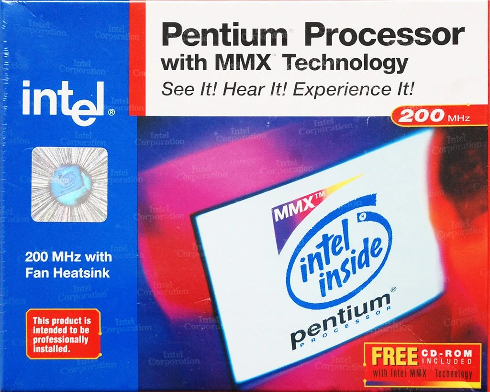
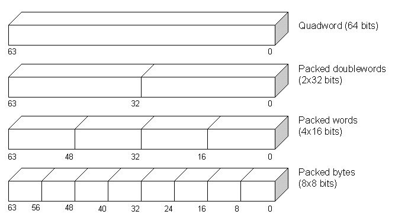
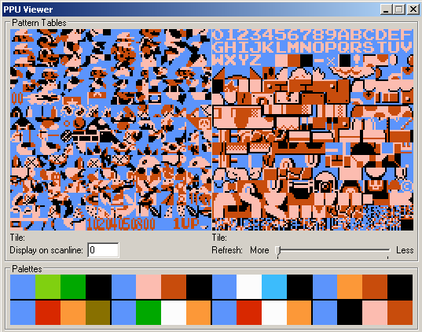
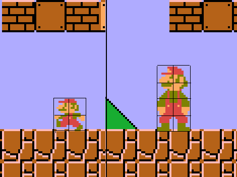
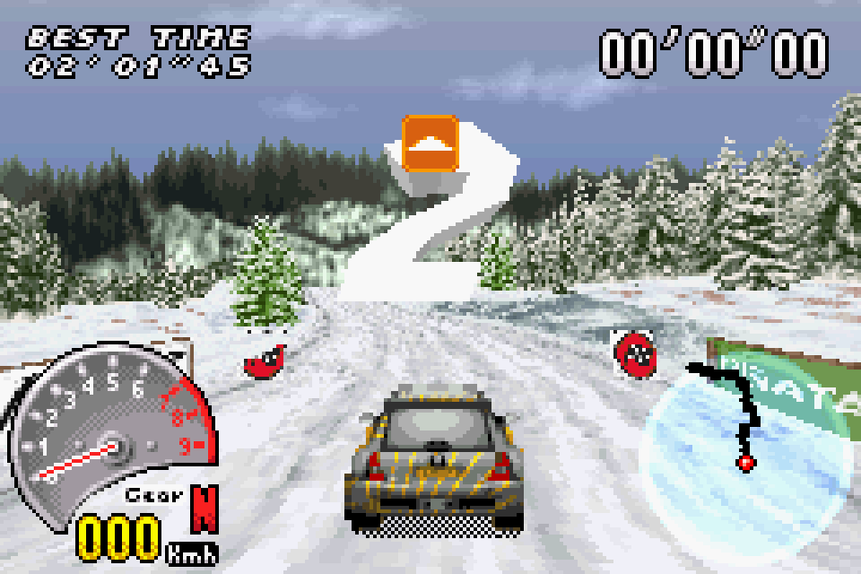
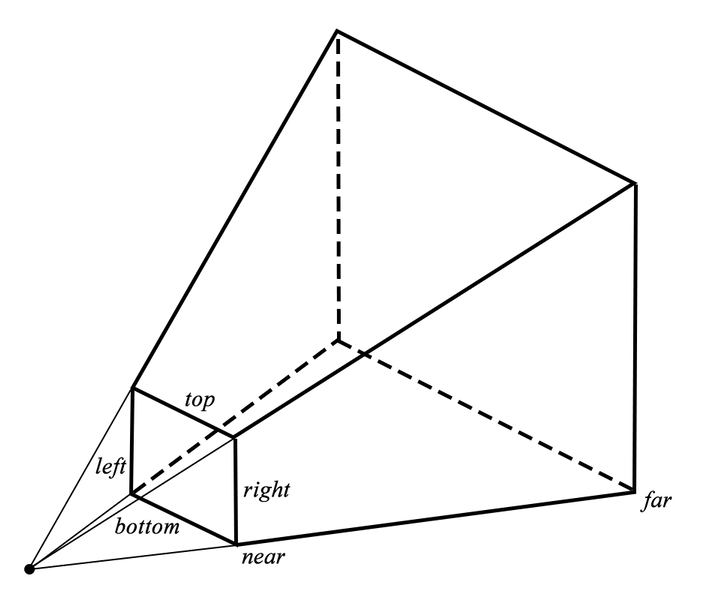
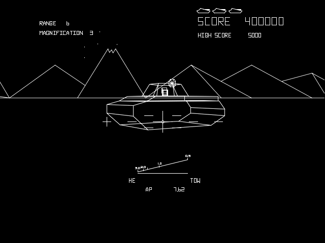
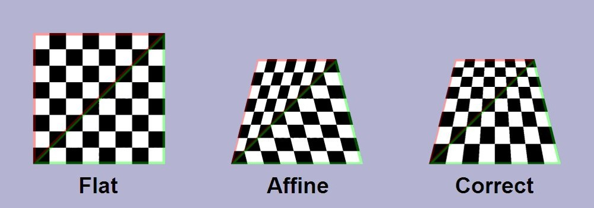
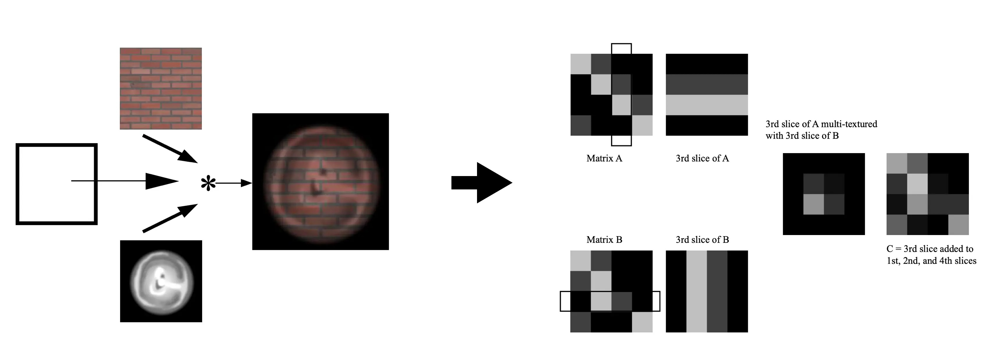
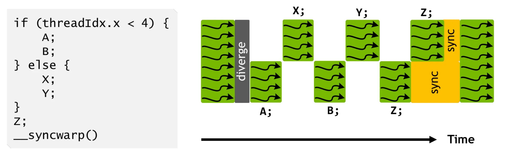

# 第 20 讲：CPU、GPU 和 SIMT 编程模型

> 原始讲义：[sources/notes/lect20.md](../../sources/notes/lect20.md)  
> 前一讲：[异步编程模型](19-async-model.md) · 后一讲：[一个 Token 的旅程](21-token-journey.md)  
> 本讲关键词：流水线、ILP、IPC、功耗墙、SIMD、packed register、PPU、shader、GPGPU、CUDA、SIMT、warp、coalescing、branch divergence

## 0. 本讲定位：异步解决“等什么”，GPU 解决“怎样密集地算”

上一讲沿两条路线管理大量**异构**任务：

- coroutine/goroutine 保存可暂停控制流，让少量内核线程承载大量逻辑线程；
- event、Promise 和 async/await 把 I/O 完成关系写成动态计算图。

它们都主要在 CPU 上工作，目标是管理状态、等待和复杂控制流。现在把 workload 换成几百万个小而相似的任务：每个像素算一种颜色、每个数组元素执行同一算式、每个矩阵单元做相同的乘加。若仍为每个任务准备完整 CPU 的取指、译码、乱序和分支预测硬件，调度本身可能比算术更贵。

本讲从 CPU 内部已经存在的指令级并行出发，沿功耗墙推导两条路线：

```text
摊薄一条指令的调度成本             简化并复制执行者
          │                              │
          ▼                              ▼
        SIMD                     PPU / shader / GPU
                                          │
                                          ▼
                                    CUDA / SIMT
```

历史主线不是“CPU 失败，GPU 胜利”，而是需求塑造专用机制，再推动专用机制重新变得通用。下一讲会把这里的 SIMT 放回真实系统：一次 LLM 请求怎样穿过网络和数据中心，最终落到 GPU 上的 tensor 计算，再把一个 token 送回用户。

## 1. 学习目标与问题地图

学完本讲，你应该能够：

- 解释顺序 ISA 怎样由流水线、超标量和乱序执行维持成“顺序假象”；
- 用数据依赖说明为什么独立指令链能提高 IPC；
- 区分 BogoMIPS、IPC、吞吐、延迟和性能/瓦；
- 从动态功耗近似式推导频率墙、暗硅与多核/异构转向；
- 区分 ILP、线程并行、SIMD、SIMT 以及 C 中的 bit-level parallelism；
- 解释 packed register、lane、shuffle、FMA 和向量宽度演进；
- 用编译器报告和汇编验证循环是否真的向量化；
- 说明 SIMD 为什么会受数据依赖、内存带宽、控制流和功耗限制；
- 解释游戏机为何用场景描述驱动 PPU，而不是让 CPU 逐像素画；
- 说清 tile、name table、attribute table、sprite RAM 和固定渲染流水线的角色；
- 从 2D texture 推导 3D 的 vertex、face、material、light、camera 和透视校正；
- 区分 vertex shader、fragment shader、GLSL 编译与 OpenGL program link；
- 解释 shader 如何被“hack”成通用计算，CUDA 又怎样把它改写为线程模型；
- 单步解释 block/thread 坐标、warp、active mask、延迟隐藏和 memory coalescing；
- 构造 branch divergence 的效率模型，并分析 Mandelbrot 为什么既适合 GPU 又不完全友好；
- 区分 CUDA 源码、PTX、SASS、runtime API、驱动和物理 GPU。

问题地图：

| 问题 | 最小答案 | 本章位置 |
| --- | --- | --- |
| CPU 一次只能执行一条指令吗？ | ISA 看似顺序；微架构可重叠、并发发射并乱序完成 | §3 |
| IPC 高就一定更省电吗？ | 不一定；乱序调度提高低延迟性能，也消耗面积和能量 | §4 |
| `P ≈ CV²f` 是全部功耗吗？ | 只是动态功耗骨架，还缺活动因子与静态泄漏等 | §4.2 |
| SIMD 与 SIMT 相同吗？ | 都共享控制，但 SIMD 暴露向量 lane，SIMT 暴露标量线程 | §7、§23 |
| “10752 CUDA cores” 等于 10752 个 CPU 核吗？ | 不等，执行模型、功能和计数口径完全不同 | §22 |
| 一个 CUDA kernel 的百万线程同时存在吗？ | 是逻辑线程；硬件按 block/warp 分批驻留和调度 | §21–§23 |
| 连续线程连续访问为何快？ | warp 的地址可合并为较少内存事务 | §23.3 |
| 一个 warp 内 `if` 两边都有人走会怎样？ | 路径通常分别执行，另一侧 lane 暂时失活 | §24 |
| Mandelbrot 每像素独立，为何仍会 divergence？ | 每个像素逃逸迭代数不同，warp 等最慢 lane | §25 |

## 2. Review & Comments：CPU 上的并发模型走到了哪里

### 2.1 计算图仍是共同底座

从线程的 spawn/join、条件变量和信号量，到 coroutine、Promise 与 async/await，核心问题一直是：

```text
哪些节点可以并行？
哪些边必须 happens-before？
谁保存尚未完成的状态？
谁挑选 ready 节点执行？
```

生成器和 coroutine 把“暂停位置”保存在用户态对象中；non-blocking I/O 使内核调用不必与设备完成同步；goroutine 借助编译器和 runtime，把很多轻量任务复用到少量 OS 线程。Promise 则直接描述一个运行时才逐步展开的计算图。

### 2.2 这些模型为何还不够

它们擅长异构控制流：一个任务等 socket，另一个解析 JSON，还有一个访问数据库。但图像像素、向量元素和矩阵乘加往往是大量**同构**节点。这里新的问题不是如何保留百万份复杂控制流，而是：

> 能否让百万个短任务共享取指、译码和调度，把能量尽可能花在数据运算上？

于是课程暂时“推翻 CPU 的统治”，先进入 CPU 内部，再沿游戏图形硬件走向 GPU。

## 3. 回顾：什么是 CPU？——顺序只是被精心维护的假象

### 3.1 ISA 状态机与微架构不是同一件事

在 `rv32ima_step` 这样的教学模拟器中，一步大致是：取指、译码、读操作数、执行、写回，再更新 PC。这是清晰的**架构语义**：软件观察到寄存器、内存和异常像按指令顺序变化。

真实 CPU 不必按这个方式实现。同一时刻，流水线可能正在：

```text
取第 i+4 条指令
译码第 i+3 条
重命名第 i+2 条的寄存器
执行第 i+1 条整数加法
等待第 i 条 cache miss
提交更早完成的第 i-5 条
```

“每个程序都是并行程序”指硬件内部存在大量重叠，不是说一段单线程 C 自动获得 pthread 语义，更不允许程序员忽略 data race。

### 3.2 流水线、超标量和乱序执行

逻辑门天然并行。增加译码宽度、多个执行单元和多端口寄存器文件后，CPU 可以在同一周期处理多条彼此独立的指令。若：

```text
i1: r1 = r2 + r3
i2: r4 = r5 * r6
```

二者无数据依赖且执行资源可用，就可能并发发射。若第二条是 `r4 = r1 * r6`，它必须等第一条产出 `r1`，形成 dependency chain。

现代乱序核心在硬件里做动态数据流分析：寄存器重命名消除部分假依赖，保留真实 RAW 依赖；ready 指令可越过被 cache miss 卡住的旧指令先执行；reorder buffer 再按程序顺序提交结果，以维持精确异常和顺序架构状态。分支预测则猜下一批该取什么，猜错要丢弃投机工作。

这像 CPU 内置了一个每周期反复运行的“小编译器/调度器”，但它只有有限窗口，不能看见任意远的未来。

### 3.3 RISC-V 模拟器在这里承担什么论证

课堂的[ RISC-V 处理器模拟器](/OS/demos/intro/mini-rv32ima)可运行复杂程序乃至无 MMU Linux，因为它正确实现了架构状态机；它不需要模拟真实芯片每个流水级才让软件得到相同 ISA 语义。

因此不要混淆：

- ISA 模拟器回答“每条指令在架构上做什么”；
- cycle-accurate 模拟器才试图回答“第几个周期占用哪个单元”；
- 实机 performance counter 观察某次硬件执行；
- wall-clock 还混入频率变化、调度、cache、OS 干扰。

### 3.4 BogoMIPS、IPC 与 `perf`

Linux `/proc/cpuinfo` 中的 BogoMIPS 来自类似 `while (loops--) cpu_relax()` 的延时循环校准。它受实现和校准目的影响，不是跨机器性能排名。

IPC 是 `retired instructions / cycles`，可用硬件计数器近似测量：

```bash
grep -m1 -E 'model name|BogoMIPS|bogomips' /proc/cpuinfo
perf stat -r 5 -e cycles,instructions,branches,branch-misses -- ./your_program
```

但“instructions”可能是架构指令而非内部 micro-ops；多核总计、SMT、频率变化和 multiplexing 都会影响解释。`perf_event_paranoid` 过高或容器缺少 `CAP_PERFMON` 时，`perf` 会报权限不足；这时不要用 sudo 绕过课程环境，改用 `/usr/bin/time` 作较弱观察，或在有权限的本机复现。

### 3.5 实验 1：依赖链怎样限制 ILP

下面两个循环每轮都做四次无符号乘加。`dependent` 的四次串成一条链；`independent` 有四条互不依赖的链。无符号溢出按 C 语言模 `2^64` 定义。

```c
// ilp_probe.c
#include <errno.h>
#include <inttypes.h>
#include <stdint.h>
#include <stdio.h>
#include <stdlib.h>
#include <string.h>

#if defined(__GNUC__)
#define NOIPA __attribute__((noinline, noipa))
#else
#define NOIPA
#endif

static NOIPA uint64_t dependent(uint64_t n, uint64_t a) {
  uint64_t x = 1;
  for (uint64_t i = 0; i < n; i++) {
    x = x * a + 1; x = x * a + 1;
    x = x * a + 1; x = x * a + 1;
  }
  return x;
}

static NOIPA uint64_t independent(uint64_t n, uint64_t a) {
  uint64_t x0 = 1, x1 = 2, x2 = 3, x3 = 4;
  for (uint64_t i = 0; i < n; i++) {
    x0 = x0 * a + 1; x1 = x1 * a + 1;
    x2 = x2 * a + 1; x3 = x3 * a + 1;
  }
  return x0 ^ x1 ^ x2 ^ x3;
}

int main(int argc, char **argv) {
  if (argc != 3 || (strcmp(argv[1], "dep") && strcmp(argv[1], "ind"))) {
    fprintf(stderr, "usage: %s dep|ind iterations\n", argv[0]);
    return EXIT_FAILURE;
  }
  errno = 0;
  char *end = NULL;
  uint64_t n = strtoull(argv[2], &end, 10);
  if (errno || end == argv[2] || *end != '\0') {
    fputs("bad iteration count\n", stderr);
    return EXIT_FAILURE;
  }
  uint64_t ans = !strcmp(argv[1], "dep")
               ? dependent(n, 1664525) : independent(n, 1664525);
  if (printf("%" PRIu64 "\n", ans) < 0) return EXIT_FAILURE;
  return EXIT_SUCCESS;
}
```

编译时关掉 loop vectorization 和 unrolling，尽量把变量控制在“依赖关系”上：

```bash
cc -O3 -fno-tree-vectorize -fno-unroll-loops \
  -std=c11 -Wall -Wextra -Wpedantic ilp_probe.c -o ilp_probe
/usr/bin/time -f 'dependent: %e s' ./ilp_probe dep 30000000 >/dev/null
/usr/bin/time -f 'independent: %e s' ./ilp_probe ind 30000000 >/dev/null
perf stat -e cycles,instructions -- ./ilp_probe ind 30000000 >/dev/null
```

在一台测试机上，wall time 约为 `0.15 s` 对 `0.03 s`；数值不是课程答案。关键观察是独立版本允许多个乘法执行单元/流水级同时有活干，而单链下一步必须等上一步。请同时用 `objdump -d -Mintel ./ilp_probe` 确认编译器没有删除或重写核心工作。

边界：这不是纯粹的“处理器乘法延迟测量”；循环控制、编译器、频率、cache 和计时粒度仍会影响结果。只有配合汇编和 performance counters，才能把解释逐步收紧。课堂[指令级并行 (ILP)](/OS/demos/concurrency/cpu-ilp)用内联汇编在 Cortex-A7 上构造依赖整数、独立整数、VFP、NEON、整数/浮点混合和独立乘法，正是为了更精确控制这些变量。

## 4. Instruction-level Parallelism 意味着什么？

### 4.1 CPU 用大量控制硬件换单线程低延迟

乱序窗口、rename table、issue queue、分支预测器和多级 cache 都不直接完成用户的加法，却让一条复杂控制流尽快向前。每次门电路翻转都会消耗能量；预测错误、投机后丢弃和等待 cache 的结构仍占面积与功耗。

因此要区分两个目标：

- **latency**：这一条单线程任务多久完成；
- **throughput / performance per watt**：单位时间、单位能量完成多少总工作。

大 CPU 倾向为低延迟和通用性付出调度“税”；GPU 会在后文选择牺牲单线程能力，以共享控制换高吞吐。

### 4.2 功耗墙与 Dark Silicon

讲义写出 CMOS 动态功耗骨架：

```text
P_dynamic ≈ α C V² f
```

`C` 是等效开关电容，`V` 是电压，`f` 是频率，`α` 是实际翻转活动因子。它不是芯片总功耗公式：静态泄漏、内存与 I/O、时钟树等还会消耗能量。提高频率常常还要提高电压，因此功耗增长可能比线性更糟。

制程可以塞入更多晶体管，却不能让所有逻辑在最大频率下同时翻转而不超出供电和散热预算。这就是“Dark Silicon”：芯片上有电路，但在给定时刻不能全部全速点亮。

讲义把 `~1995–2005` 描述为先进制程持续推高单核性能、最终撞上功耗/频率墙的阶段。这里“墙”指物理上限；“税”指尚可支付但会拖慢系统的 overhead，例如数据搬运、网络、存储和调度成本。

## 5. 面对功耗墙：两条 performance/watt 路线

### 5.1 Approach I：一条指令处理更多数据

若取指、译码和调度一条指令的开销大致固定，让它同时完成 4、8、16 个元素的运算，就能把控制成本摊到更多有效工作上。这是 SIMD。

它要求 workload 有数据并行：相同运算作用于独立元素。若循环每次依赖上次结果，或每个元素走完全不同控制流，硬塞进向量 lane 会浪费大部分宽度。

### 5.2 Approach II：复制更多、更简单的处理器

同样面积下，简单核心通常能复制更多份。多核 CPU、ARM big.LITTLE（2011）和 Intel P-core/E-core 都在通用性、单线程延迟与吞吐/能效之间取不同点；异构系统还会把图形、视频、AI 等交给领域加速器。

多核没有消灭 Amdahl 定律，也没有扩张内存带宽。代码必须暴露线程级并行，OS/runtime 还要调度任务、放置数据和处理负载不均。后半讲会继续追问：小核心还能不能再小，以至于很多线程共享一个控制前端？

## 6. Single Instruction, Multiple Data：把大操作数切成 lanes

### 6.1 最小模型

把一个宽寄存器看成多个独立小元素：

```text
标量 add：a0 + b0
4-lane SIMD add：[a0 a1 a2 a3] + [b0 b1 b2 b3]
              = [a0+b0 a1+b1 a2+b2 a3+b3]
```

例如 64-bit 可解释为 4 个 16-bit 整数做 pairwise 运算。Intel MMX 的名字 MultiMedia eXtension 很有年代感：音视频像素与采样天然适合窄整数 packed 运算，早期宣传甚至随 CPU 附赠[展示游戏](https://www.bilibili.com/video/BV1sKszezEDi/)。



同一位模式可按 signed/unsigned、8/16/32-bit 或 float 解释；具体指令决定 lane 类型和语义。SIMD 不是“64-bit 整数加法自动变四次小整数加法”，必须选 packed instruction。

### 6.2 Aside：普通整数里的“SIMD”

bitset 用一条机器字操作几十个布尔量：

```c
// arr 必须足够大，x/8 所在字节必须有效。
unsigned bit = (arr[x / 8] >> (x % 8)) & 1u;
```

`lowbit` 在二进制补码的**无符号模运算**中成立：

```c
uint32_t low = x & (0u - x);       // 等价于 x & (~x + 1u)
```

不要对可能为 `INT_MIN` 的有符号整数写 `-x`：有符号溢出在 C 中是 undefined behavior。

讲义的 broadword `popcount` 逐级合并 1-bit、2-bit、4-bit、8-bit 分组：

```c
static inline unsigned popcount32(uint32_t x) {
  x = (x & 0x55555555u) + ((x & 0xaaaaaaaau) >> 1);
  x = (x & 0x33333333u) + ((x & 0xccccccccu) >> 2);
  x = (x & 0x0f0f0f0fu) + ((x & 0xf0f0f0f0u) >> 4);
  x = (x & 0x00ff00ffu) + ((x & 0xff00ff00u) >> 8);
  x = (x & 0x0000ffffu) + (x >> 16);
  return x;
}
```

一次 word operation 同时推进多个小字段，这类技巧常称 SWAR。现代编译器也可能把 `__builtin_popcount` 映射为专用 `popcnt`；源码技巧、编译器 builtin、SIMD ISA 和物理执行单元是不同层次。

## 7. 引入 Packed Registers：从 MMX 到 AVX-512

### 7.1 宽寄存器与更多类型

MMX 增加 64-bit `%mm` 寄存器和约 57 条 packed 指令；讲义还给出当年的 [MMX 手册](https://jyywiki.cn/OS/manuals/mmx.pdf)。随后 x86 演进为：

```text
MMX   %mm   64 bit
SSE   %xmm 128 bit
AVX   %ymm 256 bit
AVX-512 %zmm 512 bit
```



越宽意味着同一次调度可覆盖更多 int8/16/32、float32、float64 元素，但实际 ISA 支持逐代增加，并非每种宽度都有每种运算。现代向量扩展还提供：

- 三操作数形式，避免目的寄存器必须覆盖一个输入；
- shuffle/permutation，在 lane 间重排数据；
- gather/scatter，处理非连续地址，但通常比连续 load/store 贵；
- FMA，一条指令完成 `a*b+c`，只在最终结果舍入一次；
- mask/predicate，选择哪些 lane 生效，处理尾部和条件操作。

### 7.2 实验 2：让 GCC 告诉你哪里向量化了

`saxpy` 的各次迭代独立；`chain` 的第 `i+1` 次依赖第 `i` 次：

```c
// vector_probe.c
#include <stddef.h>

void saxpy(float *restrict y, const float *restrict x,
           float a, size_t n) {
  for (size_t i = 0; i < n; i++)
    y[i] = a * x[i] + y[i];
}

float chain(float x, size_t n) {
  for (size_t i = 0; i < n; i++)
    x = x * 1.000001f + 1.0f;
  return x;
}
```

```bash
cc -O3 -march=native \
  -fopt-info-vec-optimized -fopt-info-vec-missed \
  -S vector_probe.c -o vector_probe.s
sed -n '/saxpy:/,/\.size.*saxpy/p' vector_probe.s
sed -n '/chain:/,/\.size.*chain/p' vector_probe.s
```

GCC 官方文档说明 `-fopt-info-vec-optimized/missed` 可报告成功和错失的向量化机会。[GCC optimization-report 文档](https://gcc.gnu.org/onlinedocs/gcc/Developer-Options.html)

在一台 x86-64 AVX2/FMA 测试机上，报告为：

```text
optimized: loop vectorized using 32 byte vectors
optimized: loop vectorized using 16 byte vectors
missed: couldn't vectorize loop
missed: not vectorized: unsupported use in stmt
```

`saxpy` 主循环出现 `vbroadcastss`、`vmovups`、`vfmadd...ps` 和 256-bit `%ymm`：一次 FMA 处理 8 个 float；后面还有 128-bit/scalar 尾循环。`chain` 使用 `...ss` 标量指令，因为递推依赖不能同时求未来值。

你的机器可能生成 SSE、AVX-512、ARM NEON/SVE 或根本不向量化；`-march=native` 生成的二进制也未必能拿到另一台较旧 CPU 运行。`restrict` 是“不别名”的语言级承诺，写错会使程序行为未定义，不能为了骗编译器而乱加。浮点重排、FMA 舍入和 `-ffast-math` 也可能改变数值语义。

## 8. 寄存器越长，调度成本越薄，但不会无限获益

### 8.1 宽度的收益边界

从 MMX 到 SSE、AVX、AVX-512 的直觉是：相似前端成本驱动更多 lane。但加速上限还受：

- 可向量化元素数和尾部处理；
- 数据是否连续、对齐，alias 是否明确；
- cache 和 DRAM 能否按时供数，即内存墙；
- shuffle/gather 与横向归约的额外代价；
- 某些宽指令的执行端口、吞吐和频率策略；
- 热设计功耗：更多 lane 同时翻转会提高瞬时功耗。

所以 512-bit 不保证比 256-bit 快两倍。若循环每元素只做一次加法，往往先撞带宽；若分支稀疏或数据布局糟糕，lane 利用率更低。

### 8.2 SIMD 没有消灭 CPU 调度

向量指令仍进入 CPU 的 rename、issue、cache 和乱序流水线，与标量指令争取前端、执行端口、cache 和功耗。它摊薄了调度，却没有把调度近似降为零。

VLIW 尝试把多个可并行操作静态打包，让编译器承担调度，从而简化动态流水线。它在某些 DSP/加速器上有生命力，但没有成为通用 CPU 的普遍替代：运行时 cache miss 与分支难静态预测，不同微架构的最佳 schedule 不同，宽指令中空槽还会浪费编码和执行资源。讲义也留下一个开放判断：若未来模型/编译器更善于全局调度，类似静态打包思路也可能以新形式回归。

课程所谓“成功的尝试”是横向扩展：把一个大 CPU 变成许多更小执行者。接下来游戏图形需求会把这条路线推到极致。

## 9. 改变人类命运的另一条时间线：Magnavox Odyssey (1972)

Magnavox Odyssey 是一次极大胆的尝试：没有声音，电子画面主要是简单光点，最标志性的体验近似 Ping Pong，却证明“交互式画面”本身就能成为产品。


这张历史图片承担的论证不是怀旧，而是需求转向：人不再只要 CPU 算出一个数，而要机器持续把**场景状态**变成可见画面。每秒几十帧、每帧数万乃至数百万像素的规则工作，逐渐催生与通用 CPU 完全不同的硬件。

## 10. 游戏机遇到的性能问题：CPU 画不完每个像素

最直接的渲染器是二维循环：

```c
// 教学模型；putchar 只适合低速文本观察。
for (int y = 0; y < H; y++) {
  for (int x = 0; x < W; x++)
    putchar(f(x, y) ? '*' : ' ');
  putchar('\n');
}
```

不同 `(x,y)` 的 `f` 常互不依赖，例如 Mandelbrot，是 embarrassingly parallel。但“容易并行”不等于当年的 CPU 来得及串行完成。

讲义把时间拨到 1983 年的 Nintendo Entertainment System：MOS 6502 约 1.79 MHz，课堂估计 IPC 约 0.43；画面 `256×240=61,440` 像素、约 60 FPS。粗略预算是：

```text
1.79M cycles/s × 0.43 instructions/cycle ÷ 60 frame/s
≈ 12.8K instructions/frame
```

一帧指令数还不到像素数的四分之一，更别提游戏逻辑、输入、声音和访存。CPU 不可能为每个像素执行通用 `f(x,y)`。解决方式不是把像素循环写得更花，而是让 CPU 提交压缩的**场景描述**，专用 PPU 按固定管线持续生成视频信号。1986 年的 *Legend of Zelda* 就建立在这套约束和技巧之上。

## 11. NES 的图形描述：tile、地图和属性

### 11.1 用数据结构代替逐像素命令

NES 背景以 `8×8` tile 为基本单位：

- Tile/Pattern ROM 保存可复用小图块的像素模式；
- Name Table/Tile Map 说明屏幕各位置引用哪个 tile；
- Attribute Table 为区域选择 palette 等属性；
- scroll 寄存器移动背景窗口；
- sprite 描述动态前景。



地图重复引用 tile，大幅压缩场景；CPU 只需更新地图、卷轴和少量对象，PPU 每条扫描线按固定节奏取数据。这与现代 GPU 的共同思想是“提交数据结构与少量程序，让专用硬件批量解释”，但 NES PPU 仍是固定功能电路，不是 CUDA GPU。

### 11.2 场景描述也是性能合同

表示法决定哪些画面便宜：重复 tile、规则卷轴和少量 sprite 很自然；任意逐像素特效很难。游戏中的视觉技巧不是绕过硬件，而是选择能被现有 pipeline 高效解释的数据结构。

这是一条贯穿系统的规律：接口不仅表达功能，还塑造可实现的性能。

## 12. NES 动态前景渲染：Sprite RAM

动态前景 sprite 可抽象为四元组：

```text
sprite = (x, y, tile, attr)
```

讲义给出 256-byte Sprite RAM，共 64 个 4-byte sprite。属性字节：

```text
76543210
||||||||
||||||++-- Palette
|||+++---- Unimplemented
||+------- Priority
|+-------- Flip horizontally
+--------- Flip vertically
```



硬件用位域而非通用对象，原因是存储和逻辑都极有限。flip 位让同一图块复用左右/上下姿态；priority 决定前景和背景合成顺序；palette 选择颜色组。这又是“用紧凑描述换固定硬件批处理”。

## 13. PPU 中的静态渲染管线：相同动作，连续扫描

对每个输出像素，PPU 大致重复：确定背景 tile 像素、寻找覆盖该位置的 sprite 像素、按透明/priority 合成颜色，再输出扫描线。概念一直延续到现代的 depth/z-buffer、纹理采样和 blending，只是状态与算法复杂了许多。

讲义用下面的 OpenMP 伪装帮助建立并行直觉：

```c
// 概念草图，不是 NES PPU 的软件实现，也未处理优先级冲突。
for (int row = 0; row < lines; row++) {
  #pragma omp parallel for
  for (int i = 0; i < 64; i++) {
    struct sprite *s = &SPRAM[i];
    if (s->y <= row && row < s->y + 8) {
      /* 计算 sprite 在本扫描线的贡献 */
    }
  }
  display_row(row);
}
```

真实硬件不是创建 64 个 pthread；它复制/流水化小而固定的逻辑。每个“GPU 线程”执行相同动作的想法已出现，只是程序还焊死在电路里，所以称 fixed-function pipeline。

## 14. 从 PPU 到 2D 图形渲染管线

更强的 2D 引擎扩展场景描述：更多 layer、可缩放/旋转 texture、blending 和更灵活 sprite。核心仍是动态拼凑图片，让固定循环处理大量像素。



Game Boy Advance 的 [*V-Rally 3*](https://www.bilibili.com/video/BV1bT4y1g75x/) 说明：视觉上像 3D，不代表硬件在运行完整现代 3D pipeline。程序可以用预计算、纹理变换、分层和透视技巧，在受限数据结构上模拟空间。看效果猜实现，往往会高估硬件抽象。

## 15. 从 2D 到 3D：继续扩展“场景描述”

3D 场景需要更多对象：

| 对象 | 作用 |
| --- | --- |
| Vertex | 位置、法线、纹理坐标等局部数据 |
| Face/Primitive | 顶点怎样组成三角形 |
| Texture | 表面采样的数据 |
| Material | 反射、粗糙度等表面参数 |
| Light | 光源位置、方向和强度 |
| Camera | 观察位置、方向、投影视锥 |

多边形可以三角剖分；三点定义平面，三角形内部插值和光栅化规则稳定，因此三角形成为主流 primitive。“你看到的一切都是三角形”是渲染数据层面的概括，不是说物理对象本体由三角形组成。

平移、旋转、缩放、view 和 projection 可在 4D 齐次坐标中统一写成矩阵乘法：

```text
clip_position = Projection × View × Model × local_position
```

随后还要做 perspective divide，故从 3D 到最终屏幕坐标的完整过程并非普通 3D 线性变换。矩阵形式让顶点阶段可以对大量顶点重复相同乘加。



## 16. 一些早期的 3D 游戏：只画线也能建立空间



只要能变换顶点并画线，就能构造线框 3D。早期游戏证明“3D”的关键先是几何关系和相机，而不是照片级纹理。随后填充三角形、隐藏面、depth test、texture 和 lighting 才逐层加入。

这与操作系统课程的方法相同：先找最小可运行状态机，再逐步增加机制；不要从现代最终形态倒推历史系统似乎“一开始就该如此”。

## 17. 从 2D 到 3D（cont’d）：纹理为何会扭曲

把 2D texture 贴到透视中的三角形时，若直接在屏幕空间对 `(u,v)` 做 affine 插值，顶点位置可能正确，内部纹理却会随着视角“游动/扭曲”。因为屏幕空间等距不等于 3D 表面上的等距，深度信息被丢掉了。



透视正确的思路是插值 `u/z`、`v/z` 和 `1/z`，再在像素处相除恢复；现代硬件把这类操作纳入 rasterization/interpolation。图片论证了一个系统规律：仅扩展数据结构还不够，pipeline 每一阶段的数学语义也必须一起升级。

## 18. 从数据结构到编程语言：可编程 shader

### 18.1 为什么固定功能最终不够

固定 pipeline 只能组合预设开关。开发者想要水波、毛发摆动、新光照模型和材质效果时，不可能每种效果都等待芯片增加专用按钮。于是部分阶段从“固定电路参数”升级为“小程序”：shader。

- **Vertex shader** 对单个顶点运行，典型工作是坐标变换、形变、生成传给后续阶段的数据；波纹和摆动可改变几何位置。
- **Fragment/pixel shader** 对光栅化产生的 fragment 运行，计算颜色，也可影响深度或丢弃 fragment；它操作的是 fragment，不保证与最终物理显示像素严格一一对应。

Normal mapping 不增加真实几何细节，而是从纹理读取扰动后的法线，改变光照计算，让远处表面看起来有凹凸：


### 18.2 OpenGL Shader：程序里的程序

课堂[OpenGL Shader](/OS/demos/concurrency/gl-shader)展示“套娃”：C/C++ 程序把 GLSL 源码作为字符串交给 OpenGL；驱动编译 shader object，再把 vertex/fragment 等阶段链接成 program object，绑定后才影响 draw call。

最小控制流是：

```text
glCreateShader
  → glShaderSource
  → glCompileShader
  → glGetShaderiv(GL_COMPILE_STATUS)
  → 失败时 glGetShaderInfoLog

glCreateProgram
  → glAttachShader
  → glLinkProgram
  → glGetProgramiv(GL_LINK_STATUS)
  → 失败时 glGetProgramInfoLog
  → glUseProgram
```

编译失败不会自动变成普通 OpenGL error，必须显式查状态与日志；链接还会检查阶段接口是否匹配。[Khronos Shader Compilation](https://wikis.khronos.org/opengl/Shader_Compilation)给出了完整合同。

交互 demo 想观察三层：宿主 C 程序仍由 CPU 执行；GLSL 经驱动/编译器变成目标 GPU 代码；draw call 批量触发许多 shader invocation。复现通常需要 OpenGL 开发库和可用 display/context；无图形会话的服务器要用 EGL/OSMesa 或虚拟显示，不能把“窗口打不开”误判成 shader 算法错误。

### 18.3 可选实验：只验证 GLSL 语法

若安装 Khronos `glslangValidator`，可在不创建窗口时编译阶段源码：

```glsl
// wave.vert
#version 450
layout(location=0) in vec3 position;
layout(location=0) uniform float t;
void main() {
  vec3 p = position;
  p.y += 0.05 * sin(8.0 * p.x + t);
  gl_Position = vec4(p, 1.0);
}
```

```bash
command -v glslangValidator
glslangValidator -S vert wave.vert
```

成功说明前端接受语法，不说明 program 接口能链接，更不说明目标 GPU 上性能好；完整 OpenGL demo 仍须检查 context、compile、link 和 draw 结果。

## 19. GPGPU 与 CUDA：Hacking“可编程”Shader

### 19.1 把通用计算伪装成图像

shader 一旦可编程，人们很快尝试把非图形问题编码为纹理和 render target。讲义引用 SC'01 的 [*Fast Matrix Multiplies using Graphics Hardware*](https://dl.acm.org/doi/pdf/10.1145/582034.582089)：

```text
AB = Σ_k A[:,k] B[k,:]
```

每个外积更新都可映射成规则像素计算。物理模拟、天气预报和矩阵运算也能伪装成“输入 texture → shader → 输出 framebuffer”。



这种 hack 证明图形硬件有强大通用算力，也暴露接口错配：程序员必须把数组叫 texture、把输出叫颜色，还受图形 pipeline 的数据类型和读写规则约束。下一步自然是保留并行硬件，提供真正的通用编程模型。

## 20. 什么是 Shader Program？——对一大批对象执行同一代码

shader 的共同结构是：对大量 vertex、fragment 或数据元素运行同一个短程序。把像素任务写成普通函数：

```c
// CUDA 风格教学伪代码
__device__ int *screen;

void T_kernel(int row, int col) {
  int color = f(row, col);
  screen[row * 1920 + col] = color;
}
```

CPU 视角仿佛：

```c
for (int row = 0; row < 1080; row++)
  for (int col = 0; col < 1920; col++)
    spawn(T_kernel, row, col);
```

这会产生 `1920×1080=2,073,600` 个**逻辑线程**。它们可访问 global memory；同一 block 内还可使用 CUDA 特指的低延迟 shared memory 并同步。这里 shared memory 不是“所有 GPU 线程都共享的一块普通 C 堆”，作用域、容量和同步规则都由 CUDA memory model 决定。

更重要的边界是：两百万线程不会同时各占一颗完整物理核心。CUDA 把 grid 分成 blocks，硬件再把 block 中线程分成 warps，按资源容量分批驻留与执行。大量线程是暴露并行性、隐藏延迟的编程模型，不是物理核心清单。

## 21. 改变人类命运的时间线：复盘

### 21.1 CPU 并不是需求同形的最小硬件

若在多处理器上执行这些像素线程，每个 CPU 都有完整 PC、取指、译码、乱序和 cache 逻辑，因此每个核心能运行完全不同的程序。但像素 workload 恰恰不需要这份自由：绝大多数线程执行同一 kernel，只是寄存器中的 `(row,col,color)` 不同。

于是可以保留并行计算必需的 per-thread registers 和算术状态，让一组线程共享取指/译码与 issue。这把控制成本摊到许多 lane，正是 SIMT 的来源。

### 21.2 SIMT 与 SIMD 的关键区别

```text
SIMD：程序显式操作 vector register，知道一次有若干 lanes
SIMT：程序写单个 scalar thread；硬件把若干 threads 成束执行
```

两者底层都让一条控制指令驱动多个运算位置。但 SIMD ISA 把向量宽度、lane 与 mask 更直接暴露给软件；SIMT 提供 thread id、独立寄存器和标量控制流的表象，再由硬件组 warp、管理 active lanes。NVIDIA 官方指南也用这一区别解释 SIMT。[CUDA C++ Programming Guide](https://docs.nvidia.com/cuda/cuda-c-programming-guide/)

从正确性上，程序员可先把每个 CUDA thread 当独立标量线程；从性能上，必须理解它和邻近 threads 共用执行资源。

## 22. 唯一的麻烦：怎样做出海量“shared-memory CPUs”？

讲义以 2006 年、65 nm 的 G80/GeForce 8800 为里程碑：它被视为首个 CUDA GPU，让 C 风格 device program 成为现实；128 个 stream processors 对比同时代桌面 CPU 约 2C4T。统一、标量化的 thread processor 让程序员不必手工管理传统向量寄存器。[NVIDIA G80 技术简报](https://www.nvidia.com/content/PDF/Geforce_8800/GeForce_8800_GPU_Architecture_Technical_Brief.pdf)记录了 128 个 stream processors。

讲义再对比 RTX 5080 的 10,752 CUDA cores；这个数字可在 [NVIDIA 官方规格](https://www.nvidia.com/en-us/geforce/graphics-cards/50-series/rtx-5080/)核对。但 CUDA core 不是缩小版通用 CPU core：它不各自配一套完整前端，也不能用“核心数相除”预测速度。GPU 还有 SM、warp scheduler、load/store、special-function、Tensor Core、cache 和内存系统等层次。

真正问题不是“晶体管凭空增多”，而是共享控制、简化执行 lane，并让同一 SM 同时保存许多 warp 的寄存器上下文。当一个 warp 等 global memory，scheduler 可发射另一个 ready warp；这种延迟隐藏依赖足够 occupancy，也受每个 kernel 的寄存器、shared memory 和 block 大小限制。

## 23. 让我们单步执行 SIMT 程序

### 23.1 从 CUDA 坐标到一个像素

假设同一 warp 的 32 个线程对应 `(row,col)=(3,0)..(3,31)`。每个线程有自己的 `row/col/color` 寄存器状态，却执行同一条 store：

```text
screen[3 * 1920 + 0]  = color_0
screen[3 * 1920 + 1]  = color_1
...
screen[3 * 1920 + 31] = color_31
```

传统教学模型说 warp 有一个 PC 和 active mask。对 NVIDIA，warp size 是 32。现代 Volta 及之后引入 Independent Thread Scheduling，保存更细粒度的 per-thread PC/call stack，并可在 sub-warp 粒度重组 active threads；但执行资源仍以 SIMT groups 利用，分歧的吞吐代价没有魔法消失。不要依赖旧式“warp 天然 lockstep”来省略 `__syncwarp` 等必要同步。[CUDA 指南的 SIMT 说明](https://docs.nvidia.com/cuda/cuda-c-programming-guide/#simt-architecture)

### 23.2 多个 resident warps 隐藏延迟

SM 上可以同时驻留多个 warps。每到 issue 时刻，scheduler 从 ready warp 中选一个；某 warp 的 load miss 时，其寄存器上下文仍在片上，不必像 CPU 线程那样保存到内核栈，再切换到另一 ready warp。

这不是“内存延迟为零”，而是用更多并行工作覆盖等待。若 kernel 使用太多寄存器/shared memory，resident warps 变少；若所有 warp 同时等待同一瓶颈，仍无工作可发射。occupancy 高也不自动等于性能高，最终要测瓶颈。

### 23.3 Memory coalescing

相邻 lane 访问相邻 4-byte word 时，硬件可把地址合并为少量 global-memory transactions。32 lanes 合计覆盖 128 bytes；课堂说“像一次 128-byte store”是在描述逻辑连续范围，现代具体架构可能用多个 32-byte transaction 服务它。NVIDIA 的最佳实践明确要求尽量 coalesced，并说明 transaction 数取决于地址覆盖和 compute capability。[CUDA Best Practices Guide](https://docs.nvidia.com/cuda/cuda-c-best-practices-guide/#coalesced-access-to-global-memory)

比较二维数组两种映射：

```c
map[row * width + col] = t;       // 相邻 col → 相邻地址
map[row + col * height] = t;      // 相邻 col → 大跨度地址
```

若一个 warp 沿 col 排列，前者通常 coalesced；后者每 lane 跨 `height`，会触发更多 transaction、浪费带宽。两式可能在数学上都写满矩阵，却有截然不同的物理访问局部性。

### 23.4 实验 3：没有 GPU，也能读 kernel 的 PTX

先写一个最小 kernel：

```cuda
// simt_probe.cu
extern "C" __global__
void add1(float *out, const float *in, int n) {
  int i = blockIdx.x * blockDim.x + threadIdx.x;
  if (i < n) out[i] = in[i] + 1.0f;
}
```

若安装 CUDA Toolkit：

```bash
command -v nvcc
nvcc -arch=sm_80 -ptx simt_probe.cu -o simt_probe.ptx
sed -n '1,180p' simt_probe.ptx
nvidia-smi
```

即使没有可用 NVIDIA driver/device，`nvcc` 仍可能离线生成 PTX。一个实测输出的核心是：

```text
mov.u32       %r3, %ctaid.x;
mov.u32       %r4, %ntid.x;
mov.u32       %r5, %tid.x;
mad.lo.s32    %r1, %r3, %r4, %r5;
setp.ge.s32   %p1, %r1, %r2;
@%p1 bra      ...
ld.global.f32 ...
st.global.f32 ...
```

`%ctaid/%ntid/%tid` 对应 block、block size、thread 坐标；`mad` 算全局索引；predicate/branch 实现边界条件；每个 active thread 计算自己的地址并 load/store。

PTX 是 NVIDIA 虚拟 ISA，不是最终硬件 SASS。`nvcc` 存在只证明 toolkit 可编译；`nvidia-smi` 能通信才说明驱动看见设备；真正运行还要检查每个 CUDA runtime 返回值、kernel launch 后的 `cudaGetLastError()`，以及同步点 `cudaDeviceSynchronize()`。计时时若不同步，会只量到异步 launch 时间。

## 24. 当然，这也意味着 CUDA 程序很难写

### 24.1 分支发散

一个 warp 执行：

```c
if (lane_condition)
  path_A();
else
  path_B();
```

若全部 lane 同路，可满宽执行；若两边都有人，硬件通常分别执行 A、B 路径，另一组 lanes 在对应阶段 inactive，之后再汇合。NVIDIA 指南明确指出 divergence 发生在 warp 内，不同 warps 可以走不同路径而不互相串行。[CUDA warp divergence 说明](https://docs.nvidia.com/cuda/cuda-c-programming-guide/#simt-architecture)

循环也会 divergence：先退出的 lane 失活，warp 继续到最慢 lane 完成。Volta 的独立线程调度改善灵活性和某些正确性问题，却不把两条不同路径变成同一执行资源上的免费并行。

### 24.2 地址、分支与资源一起决定性能

GPU 优化至少要同时看：

- warp 内控制流是否一致；
- global memory 是否 coalesced；
- 数据能否复用到 shared memory/cache；
- block size 是否产生严重尾 warp 浪费；
- registers/shared memory 是否压低 occupancy；
- CPU↔GPU 拷贝和 kernel launch 是否吞掉收益；
- 结果是否需要频繁同步回 CPU。

所以“把函数加上 `__global__`”只建立正确的并行映射，不保证快。链表追踪、复杂业务规则、小输入和频繁主机交互常更适合 CPU。



## 25. 难写，意味着有收益：GPU Mandelbrot

### 25.1 为什么它适合 GPU

Mandelbrot 对每个复平面点重复：

```text
z₀ = 0
zₙ₊₁ = zₙ² + c
若 |z|² > 4 则逃逸，否则最多迭代 MAX 次
```

不同像素不交换数据，因此有海量独立节点；相邻像素写相邻 output，可 coalesce；每个线程只需少量标量状态。CUDA 版通常只把 CPU worker 换成 kernel，通过：

```c
int col = blockIdx.x * blockDim.x + threadIdx.x;
int row = blockIdx.y * blockDim.y + threadIdx.y;
```

取得坐标，核心 `mandelbrot(c)` 函数几乎不改。课堂[CUDA 实现的 Mandelbrot Set](/OS/demos/concurrency/mandelbrot-cu)正要观察“百万轻量线程”不是修辞，而是 grid mapping。

### 25.2 为什么它又对 CUDA“不太友好”

不同点逃逸迭代数不同。靠近集合边界的 lane 可能跑很久，其他 lane 早已退出却要以 inactive 状态等待 warp 最慢者。因此它兼具：

```text
像素之间：极强 thread-level parallelism
warp 内部：不规则 while 带来 divergence
```

讲义给出 `25600×25600` 的课堂测量：Ryzen 5 9600X 约 `25.1 s @ 65 W`，RTX 4060 Ti 16 GB 约 `6.1 s @ 42 W`。这是特定实现、设备和测量口径的一次结果，约 4.1× wall-time 差异；不能把设备标称/采样功率直接当精确能量，也不能外推所有 CPU/GPU。它想说明的是：即使 workload 有发散，GPU 的并行密度仍可能带来明显性能/能效收益。

### 25.3 实验 4：在 CPU 上量化“最慢 lane 拖住 warp”

下面不是 GPU 模拟器，只用简化指标估算循环 lane 利用率：

```text
efficiency = Σ lane_iterations / Σ(warp_size × max_iterations_in_warp)
```

```python
# warp_model.py
import random

W = H = 256
MAX_ITER = 256
WARP = 32

def escape(px, py):
    c = complex(3.5 * px / (W - 1) - 2.5,
                2.0 * py / (H - 1) - 1.0)
    z = 0j
    for k in range(1, MAX_ITER + 1):
        z = z * z + c
        if z.real * z.real + z.imag * z.imag > 4.0:
            return k
    return MAX_ITER

def efficiency(values):
    useful = issued = 0
    for i in range(0, len(values), WARP):
        group = values[i:i + WARP]
        useful += sum(group)
        issued += len(group) * max(group)
    return useful / issued

row_major = [escape(x, y) for y in range(H) for x in range(W)]
shuffled = row_major.copy()
random.Random(0).shuffle(shuffled)
print(f"row-major={efficiency(row_major):.3f}")
print(f"shuffled ={efficiency(shuffled):.3f}")
print(f"mean iterations={sum(row_major) / len(row_major):.1f}")
```

```bash
python3 warp_model.py
```

一次结果：

```text
row-major=0.676
shuffled =0.233
mean iterations=59.7
```

相邻像素迭代数有相关性，把它们放进同一 warp 通常比随机混合更少发散；映射既影响 coalescing，也影响控制流一致性。这个指标忽略指令差异、cache、warp scheduler、独立线程调度和设备结构，不能预测真实秒数，只把“等待最慢 lane”的机制定量化。

### 25.4 阅读 GPU 上的代码

`nvcc -ptx` 可看 PTX，生成 cubin 后可用 `cuobjdump --dump-sass` 看目标架构机器码；两者都比 CUDA 源码短，不表示 kernel 没有并行调度和内存成本。编译器会内联、消除公共表达式并使用 predicate。

GPU 不擅长通用数据中心业务逻辑，原因也由这里可推导：请求解析、哈希表、指针图、异常和不可预测分支缺少规则 lane；单请求还在意低延迟。GPU 更适合把其中规则、密集、批量的 tensor/图形节点抽出来。

## 26. 概念辨析：不要把五个“并行”混成一个词

| 层次 | 并行单位 | 控制怎样共享 | 典型限制 |
| --- | --- | --- | --- |
| ILP | 同线程多条指令 | CPU 动态调度窗口 | dependency、端口、cache miss |
| 多核/线程 | 多个软件线程 | 各核心有独立控制流 | 同步、调度、Amdahl、共享带宽 |
| SIMD | 一个向量指令的 lanes | 显式一条向量指令 | lane 宽、mask、layout、尾部 |
| SIMT | 一个 kernel 的 scalar threads | hardware grouping/warp issue | divergence、coalescing、occupancy |
| bit-level/SWAR | 一个整数的 bit fields | 普通整数指令 | 字段宽、carry/overflow、可读性 |

常见误区：

- **“顺序程序里没有并行。”** 微架构有 ILP，但语言可见语义仍按其内存模型；不能据此制造 race。
- **“IPC 越高程序越快。”** 运行时间还取决于指令总数、频率、等待和并行核数；减少指令可能让 IPC 降低却更快。
- **“SIMD 宽度翻倍必然快一倍。”** 带宽、尾部、shuffle、频率和不可向量化部分都会限制。
- **“shader 就是每屏幕像素运行一次。”** invocation 对象取决于 stage；fragment 还受覆盖、采样、early test 等影响。
- **“CUDA thread 就是 pthread。”** 前者轻量、海量并按 warp/block 调度，栈、阻塞和同步合同不同。
- **“warp 永远只有一个 PC。”** 这是有用的教学模型；Volta+ 有 independent thread scheduling，性能仍受 active-lane grouping 约束。
- **“global/shared memory 都是共享内存。”** CUDA 的 global、block-local shared、local/register 有不同地址空间、延迟和可见性。
- **“工具链能编译就能运行。”** `nvcc`、driver、runtime、设备与目标 compute capability 缺一不可。
- **“GPU 核心数可和 CPU 核心数相除。”** 二者计数单位与能力不同，必须比较具体 workload 的时间、能量和正确性。
- **“一次 classroom benchmark 就是产品结论。”** 先固定算法、精度、输入、预热、拷贝范围和同步点，再重复测量。

## 27. Takeaways：需求推动专用化，规模推动重新通用化

本讲的技术链条可以还原为：

```text
CPU 用复杂动态调度挖 ILP，换单线程性能
  → 功耗墙限制所有门同时高速翻转
  → SIMD 用宽 lane 摊薄指令调度
  → 多个简单核心提高 throughput/watt
  → 游戏需求用场景描述驱动固定 PPU
  → 2D/3D pipeline 增加几何、纹理、深度
  → shader 把固定阶段变成可编程小程序
  → GPGPU 把普通计算伪装成图形
  → CUDA/SIMT 直接暴露百万逻辑线程
```

人类需求驱动这条看似理所当然、实际充满意外的时间线。GPU 从领域加速器变得更通用；CUDA 的影响最终远超早期图形和传统科学计算想象，成为 AI 时代的重要底座。但抽象没有抹平硬件：warp divergence、memory layout、数据搬运和功耗仍决定收益。

下一讲[一个 Token 的旅程](21-token-journey.md)会把“同构小任务”的 SIMD/SIMT 与“异构复杂任务”的 coroutine/Promise 汇合起来：请求先经异步网络和分布式服务，最终进入 GPU；矩阵乘法和 attention 继续用 SIMT、Tensor Core 与专用内存搬运生成下一个 token。

## 28. 思考题

1. 两条独立整数指令为何可能同周期发射？增加执行单元后还需要哪些寄存器文件和调度支持？
2. 乱序执行若先完成新指令，为什么软件仍能看到精确异常？reorder/retirement 扮演什么角色？
3. BogoMIPS、IPC、wall time、throughput 和 performance/watt 各回答什么问题？
4. 在 `P≈αCV²f` 中，降低 V 为什么重要？这个式子遗漏了哪些芯片功耗？
5. 为何 `restrict` 能帮助 SAXPY 向量化？若 x/y 实际重叠，错误发生在哪一层？
6. broadword popcount、`popcnt` 指令和 AVX packed add 分别是哪种并行？
7. NES CPU 为何更新 tile map 比逐像素绘制便宜？场景描述限制了哪些画面？
8. 透视纹理为什么不能只线性插值 `(u,v)`？`1/z` 在校正中有什么作用？
9. vertex shader 和 fragment shader 的输入/输出单位分别是什么？为什么 fragment 不严格等于 display pixel？
10. CUDA grid 有两百万 threads，为什么物理上不需要两百万份取指译码器？
11. 对一行 1920 个 float，为什么 warp 沿 col 排列通常比沿转置地址排列 coalesced？
12. 一个 warp 中 16 lanes 走 A、16 lanes 走 B，最坏会如何影响执行？换成两个各自一致的 warps为何不同？
13. Mandelbrot 同时具备哪些 GPU 友好和不友好特征？怎样重排像素可能降低 divergence，又会影响哪些局部性？
14. `nvcc -ptx` 成功而 `nvidia-smi` 失败说明什么？PTX 与最终 SASS 又有什么区别？
15. 下一讲的 LLM matmul 与 Mandelbrot 在计算图上有什么共同点？它们在数据复用和 memory layout 上又有什么不同？

## 29. 阅读材料与官方参考

- *Operating Systems: Three Easy Pieces* 中关于并发/并行的相关章节；
- [GCC Auto-vectorization](https://gcc.gnu.org/projects/tree-ssa/vectorization.html) 与 [optimization reports](https://gcc.gnu.org/onlinedocs/gcc/Developer-Options.html)；
- [Khronos OpenGL Shader](https://wikis.khronos.org/opengl/Shader) 与 [Shader Compilation](https://wikis.khronos.org/opengl/Shader_Compilation)；
- [NVIDIA CUDA C++ Programming Guide](https://docs.nvidia.com/cuda/cuda-c-programming-guide/)；
- [NVIDIA CUDA Best Practices Guide](https://docs.nvidia.com/cuda/cuda-c-best-practices-guide/)；
- 原讲义中的 [Fermi whitepaper](https://www.nvidia.com/content/PDF/fermi_white_papers/NVIDIA_Fermi_Compute_Architecture_Whitepaper.pdf)；
- 下一讲原始材料：[sources/notes/lect21.md](../../sources/notes/lect21.md)。

## 30. PPT 内容覆盖表

| 原讲义一级标题（按原顺序） | 本章对应位置 |
| --- | --- |
| CPU、GPU 和 SIMT 编程模型 | 全章 |
| Review & Comments | §2 |
| 回顾：什么是 CPU？ | §3 |
| [RISC-V 处理器模拟器](/OS/demos/intro/mini-rv32ima) | §3.3 |
| [指令级并行 (ILP)](/OS/demos/concurrency/cpu-ilp) | §3.5、实验 1 |
| Instruction-level Parallelism 意味着什么？ | §4 |
| 面对功耗墙 | §5 |
| Single Instruction, Multiple Data (SIMD) | §6.1 |
| Aside: 编程中的 “SIMD” | §6.2 |
| 引入 Packed Registers | §7.1 |
| 寄存器越长，调度代价就被摊薄得越多 | §7–§8.1、实验 2 |
| SIMD: 没能完全解决问题 | §8.2 |
| Magnavox Odyssey (1972) | §9 |
| 游戏机遇到的性能问题 | §10 |
| NES 的图形描述 | §11 |
| NES 动态前景渲染 | §12 |
| PPU 中的静态渲染管线 | §13 |
| 从 PPU 到 2D 图形渲染管线 | §14 |
| 从 2D 到 3D | §15 |
| 一些早期的 3D 游戏 | §16 |
| 从 2D 到 3D (cont’d，与上一项同主题但内容保留) | §17 |
| 从数据结构到编程语言 | §18 |
| [OpenGL Shader](/OS/demos/concurrency/gl-shader) | §18.2–§18.3 |
| Hacking “可编程” Shader | §19 |
| 什么是 Shader Program？ | §20 |
| 改变人类命运的时间线：复盘 | §21 |
| 唯一的麻烦 | §22 |
| 让我们尝试 “单步执行” SIMT 程序 | §23、实验 3 |
| 当然，这也意味着 CUDA 程序很难写 | §24 |
| 难写，意味着有收益 | §25 |
| [CUDA 实现的 Mandelbrot Set](/OS/demos/concurrency/mandelbrot-cu) | §25.1–§25.4、实验 4 |
| Takeaways | §27 |
