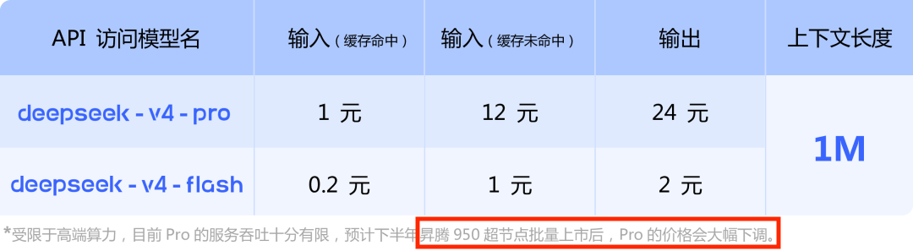
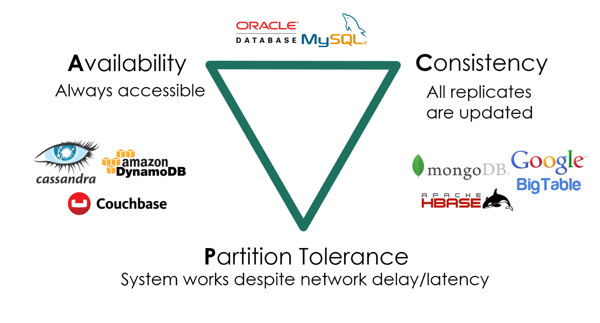
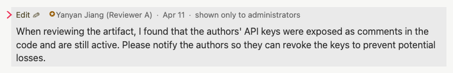
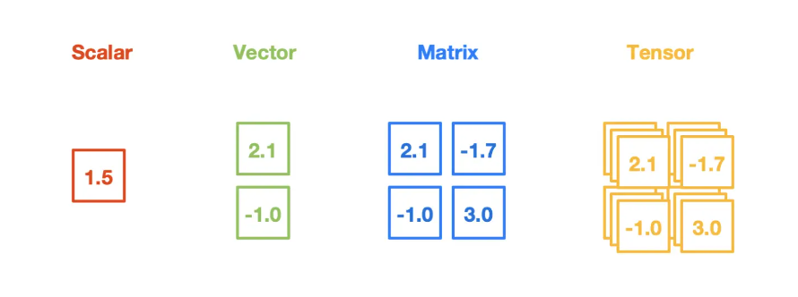
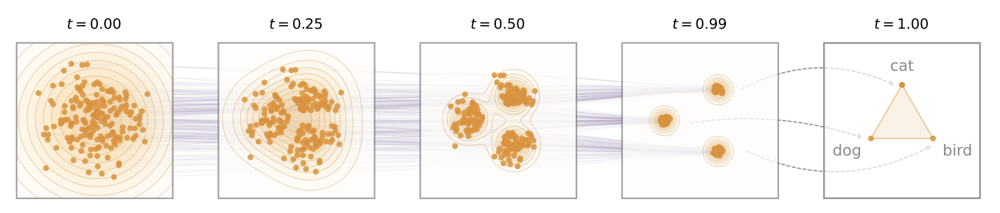

# 第 21 讲：一个 Token 的旅程

> 原始讲义：[sources/notes/lect21.md](../../sources/notes/lect21.md)  
> 前一讲：[CPU、GPU 和 SIMT](20-cpu-gpu-simt.md)  
> 后一讲：[输入/输出设备原理](22-io-devices.md)  
> 配套示例：[epoll_timer.c](../../examples/epoll_timer.c)  
> 本讲关键词：HTTP、DNS、路由、负载均衡、数据中心、C10K、CAP、幂等、FaaS、SIMT、attention、Q/K/V、KV cache、prefill、decode、TP/PP/EP、SSE

> **时效说明**：讲义中的 DeepSeek 模型名、参数量、响应头和示例事件是 2026 年课堂快照。API、部署拓扑和 header 都可能变化；机制不依赖某一次实测值。任何实验都不要把真实 API key 写入代码、命令行历史、截图或仓库。

## 0. 本讲定位：把前二十讲拼成一次真实请求

前几讲从一条 `spawn(T_worker)` 出发，逐步获得三类并发计算方法：

```text
通用而异构的 worker
  ├── pthread + lock/condition/semaphore
  ├── coroutine / goroutine
  └── Promise / async/await

短小而同构的 worker
  ├── SIMD：一条指令处理多个数据
  └── SIMT/CUDA：一个 kernel 启动海量轻量线程
```

它们的共同基础是 **计算图**：节点做计算，边表达数据与先后关系。
上一讲把这张图映射到 GPU；本讲是并发部分的最后一课，要把它放回真实系统：用户在终端输入一句话，为什么几百毫秒后会收到模型生成的 token？

一次请求会穿过几乎整个课程栈：

```text
用户文本
  → curl/Python：JSON、HTTP、TLS、socket
  → DNS：名字解析为地址
  → 网卡/路由器/ISP：packet forwarding
  → 数据中心 load balancer / API gateway
  → 鉴权、限流、审计、计费、缓存、数据库
  → 推理调度器：batch / TP / PP / EP
  → GPU：Q/K/V、矩阵乘法、prefill、decode
  → 一个 token id
  → SSE 事件、HTTP/TLS/TCP/IP
  → 用户看到一小段文本
```

这条链也解释了为什么下一讲转向 I/O 设备。
本讲把网络当作“字节怎样跨机器移动”的服务；下一讲将打开这个黑箱，研究网卡、磁盘、键盘等控制器怎样通过寄存器、DMA 和中断同 CPU 交换数据。

## 1. 学习目标与问题地图

学完本讲，你应该能够：

- 从 `curl` 命令逐层说出 JSON、HTTP、TLS、TCP/IP 与系统调用各自承担什么；
- 用 DNS、路由表、默认网关、TTL 和 ICMP 解释 packet 的逐跳旅程；
- 解释为什么公网 endpoint 通常先落到 load balancer，而不是直接落到 GPU；
- 区分实时 CRUD、半离线处理与离线大数据处理；
- 从线程资源和阻塞等待推导 C10K、事件循环与多机扩展；
- 建立 crash、丢包、重复、任意延迟、partition 等失败模型，并解释协调为何昂贵；
- 准确陈述 CAP 在网络分区期间的取舍，而不是背“任意三选二”；
- 说明 retry 为什么要求 idempotence，以及请求 id 解决什么、没有解决什么；
- 从 Q/K/V 公式推导 causal attention 的输出与 `O(T²)` 中间状态；
- 区分 CPU 发起 CUDA kernel、GPU stream 排序和 kernel 真正完成三个事件；
- 解释 tensor core 之外，内存移动、布局和同步为何常是性能核心；
- 区分 prefill 与 decode，并说明 KV cache 为什么既省计算又耗内存/带宽；
- 解释 TP、PP、EP 如何让一个 token 跨多块 GPU 生成；
- 把返回的整数 token 重新接回审计、计费和 SSE 流。

本讲严格沿 PPT 的三段路径展开：用户视角（§3–§7）→ 数据中心（§8–§18）→ token 到 tensor 再返回（§19–§27）。

## 2. Review & Comments：三种 worker，一张计算图

最初的并发程序只有：

```c
tid = spawn(T_worker);
join(tid);
```

当 worker 的控制流各不相同，难点是保存状态、等待 I/O 和组织同步；coroutine、goroutine、Promise、async/await 都在降低这种异构并发的管理成本。

当 worker 小、短且高度同构，难点变为最大化计算密度和能效；SIMD 分摊取指/译码，GPU 用 CUDA/SIMT 管理成千上万条同构执行流。

真实 LLM 服务两者都要：

- API gateway 同时等待大量网络连接，是异构、I/O 密集的并发；
- attention 和矩阵乘法让相同 kernel 处理海量 tensor 元素，是同构、计算密集的并行；
- 数据库、消息队列、GPU stream 和分布式 collective 把这些节点连接成更大的计算图。

所以“并发部分的最后一课”不是再介绍一个原语，而是检验能否用已有模型还原一套陌生基础设施。

## 3. 用户的视角：让 DeepSeek 和我聊聊天

### 3.1 官方 API 请求究竟描述了什么？

讲义从官方 API 形式开始：

```bash
curl https://api.deepseek.com/chat/completions \
  -H 'Content-Type: application/json' \
  -H "Authorization: Bearer ${DEEPSEEK_API_KEY}" \
  -d '{
        "model": "deepseek-v4-flash",
        "messages": [
          {"role": "user", "content": "Hooo."}
        ],
        "stream": true
      }'
```

这段命令至少包含四层合同：

1. URL 指定 scheme `https`、服务名和 path；
2. `Content-Type` 告诉服务端 body 按 JSON 解释；
3. `Authorization` 携带 bearer credential，证明调用者身份；
4. body 选择模型、传入消息历史，并请求流式返回。

`stream: true` 不会让模型“一次算完再切碎”。自回归 decode 本来就是逐 token 推进；服务端可以在 token 可用后持续发送 data-only Server-Sent Events，末尾发送 `[DONE]`。当前接口细节以 [DeepSeek 官方 Chat Completion 文档](https://api-docs.deepseek.com/api/create-chat-completion)为准。

安全边界很重要：环境变量避免把 key 写进脚本，但命令、进程环境、debug log 和 shell history 仍可能泄密。
生产程序应从 secret manager 读取，并在 trace 中对 `Authorization` 做删除或不可逆脱敏。

讲义提醒 `https://jyywiki.cn/submit.sh` 也依赖 `curl`。
若系统报 `curl: command not found`，失败发生在 shell 查找可执行文件阶段：还没有 DNS、socket 或 HTTP，请勿把所有“网络提交失败”都归因于服务器。

### 3.2 Python 版本与 `strace`：库并没有越过操作系统

课堂的“一个 LLM Request”演示用 Python `requests` 提供完整功能，再用 `strace` 拆开：建立连接、发送 HTTP request、等待 response。
从 Python 看是一行 `requests.post()`；向下展开却是：

```text
Python 对象/JSON 编码
  → requests/urllib3 组织 HTTP
  → TLS 库加密并校验证书
  → libc resolver / DNS
  → socket/connect/read/write 等系统调用
  → 内核 TCP/IP 栈和网卡
```

`strace` 位于系统调用边界，所以对 HTTPS 通常只能看到 TLS record 对应的密文字节，不能直接看到库内部的明文 HTTP header。
要理解协议，需要把应用日志、`curl -v`、TLS 工具与 syscall trace 对齐，而不是期待一种工具看穿所有层。

短短数年，全世界只要能接入互联网，就能通过同一 endpoint 启动 AI 对话。
课堂演示要表达的反直觉事实是：新基础设施的用户界面极其简单，而简单界面背后是全球网络、数据中心软件和加速器产业链。

## 4. 实验 1：本地重放一个流式 LLM request，并用 `strace` 分层

真实 API 实验需要付费 credential，也会受网络、模型和限流变化影响。
下面先用 Python 标准库实现一个 **协议形状相同、但不做推理** 的本地 SSE endpoint。

将代码保存为 `/tmp/mini-llm-sse.py`：

```python
#!/usr/bin/env python3
import json
import time
from http.server import BaseHTTPRequestHandler, ThreadingHTTPServer

class Handler(BaseHTTPRequestHandler):
    protocol_version = "HTTP/1.1"

    def do_POST(self):
        if self.path != "/chat/completions":
            self.send_error(404)
            return
        try:
            length = int(self.headers.get("Content-Length", "0"))
            request = json.loads(self.rfile.read(length))
            prompt = request["messages"][-1]["content"]
        except (ValueError, KeyError, json.JSONDecodeError):
            self.send_error(400, "invalid request")
            return

        self.send_response(200)
        self.send_header("Content-Type", "text/event-stream")
        self.send_header("Cache-Control", "no-cache")
        self.send_header("Connection", "close")
        self.end_headers()
        try:
            for piece in ["echo", ":", " ", prompt]:
                event = {"choices": [{"delta": {"content": piece}}]}
                payload = "data: " + json.dumps(event, ensure_ascii=False) + "\n\n"
                self.wfile.write(payload.encode())
                self.wfile.flush()
                time.sleep(0.25)
            self.wfile.write(b"data: [DONE]\n\n")
            self.wfile.flush()
        except (BrokenPipeError, ConnectionResetError):
            pass                    # client cancelled the stream

    def log_message(self, fmt, *args):
        print("server:", fmt % args)

server = ThreadingHTTPServer(("127.0.0.1", 18080), Handler)
print("listening on http://127.0.0.1:18080")
server.serve_forever()
```

终端 A 启动服务：

```bash
python3 /tmp/mini-llm-sse.py
```

终端 B 发送请求，并只跟踪网络与数据搬运系统调用：

```bash
strace -f -s 160 -e trace=network,read,write \
  curl --noproxy '*' --no-buffer --silent --show-error \
  -H 'Content-Type: application/json' \
  -d '{"messages":[{"role":"user","content":"Hooo."}],"stream":true}' \
  http://127.0.0.1:18080/chat/completions
```

预期每隔约 250 ms 出现一个 `data:` 事件，最后是 `data: [DONE]`。
`--no-buffer` 避免 curl 的标准输出缓冲掩盖流式到达时间。

在 trace 中寻找以下状态变化：

```text
socket(...)          创建一个文件描述符，指向内核 socket 对象
connect(...)         127.0.0.1:18080 上建立 TCP 连接
sendto/write(...)    请求行、header 和 JSON body 进入内核
recvfrom/read(...)   response header 与 SSE 字节到达用户态
write(1, ...)        curl 把事件写到终端 stdout
close(...)           文件描述符引用释放
```

具体 syscall 取决于 curl/libc 版本，可能看到 `sendto`、`recvfrom`、`read`、`write` 的不同组合。
本实验刻意没有 DNS、TLS、代理、负载均衡、鉴权和 GPU；`ThreadingHTTPServer` 还是“一连接一线程”的教学实现，不能据此声称解决 C10K。
它只固定住客户端—HTTP—SSE—系统调用这几层，让后续旅程有一个可观察起点。

## 5. “数据”是如何到达另一台机器的？

### 5.1 第一步：DNS 解析——域名到可连接地址

应用先要把 `api.deepseek.com` 解析为一个或多个 IPv4/IPv6 地址：

```bash
dig api.deepseek.com +short
```

典型路径是应用调用 resolver，resolver 查询本地缓存、系统配置的递归 DNS 服务，递归服务再根据缓存或 DNS 委派获得 A/AAAA/CNAME 等记录。
DNS 返回的是“此刻应尝试的地址”，不是“最终运行 attention 的 GPU 地址”。

多个地址、短 TTL、地域化应答、CDN 或 anycast 都可以让 DNS 承担第一层流量分配。
因此讲义说“DNS 已经开始做负载均衡”；但只看一次 `dig` 不能反推出完整策略。
让 DeepSeek 自己解释 DNS 可以帮助形成假设，实际答案仍应由 `dig`、resolver 配置和 packet trace 验证。

### 5.2 第二步：packet forwarding——逐跳到数据中心

内核根据目标 IP 查询路由表。
若没有更具体的 route，就把 packet 交给默认网关：可把它理解为“不知道更远路径时的下一跳”。

```text
本机
  → 家庭/校园路由器
  → ISP 接入与骨干网
  → 跨地区/跨国互联
  → 数据中心边缘
  → 服务入口
```

IP router 每次只选择下一跳，不预先为应用保存一条固定物理路径。
本地链路还可能需要 ARP/IPv6 Neighbor Discovery 找到下一跳的链路层地址，家庭网络常有 NAT；这些都不改变 IP 逐跳转发的核心模型。

`traceroute` 利用 TTL：发送 TTL 从 1 逐渐增加的 probe；路由器转发前递减 TTL，减到 0 时丢弃 packet，并通常返回 ICMP Time Exceeded。
于是客户端从一串 ICMP response 推测沿途 hop：

```bash
traceroute api.deepseek.com
```

讲义给出的局域网 `<1 ms`、同城 `<5 ms`、跨国约 `200 ms` 是帮助建立数量级的典型值，不是 SLA。
排队、拥塞、无线链路、海缆距离、路由策略和 ICMP 优先级都能改变观察。

## 6. 实验 2：对齐 DNS、内核路由、逐跳路径与 HTTP 入口

以下命令不需要 API key，也不会发起付费推理：

```bash
name=api.deepseek.com

dig +noall +answer "$name"
addr=$(dig +short A "$name" | head -n 1)
test -n "$addr" || { echo 'no IPv4 answer' >&2; exit 1; }

ip route get "$addr"
traceroute -n -q 1 -w 1 "$addr"

curl --silent --show-error --dump-header - --output /dev/null \
  --connect-timeout 5 "https://$name/"
```

逐条解释观察：

- `dig` 主动向 DNS server 发查询，answer 和 TTL 可能随地点、时间而变；
- `ip route get` 只查询本机内核 FIB，显示下一跳、出接口和候选源地址，本身不向目标发 packet；
- `traceroute` 发多组 TTL 递增的 probe，`*` 表示超时，不等于该 router 或后续路径宕机；
- `curl` 才建立 TCP、完成 TLS 握手并发送 HTTP request；根 path 返回 404/其他状态也足以证明入口可达。

边界同样重要：forward path 与 return path 可能不对称；MPLS、隧道、NAT 和不响应 ICMP 的 router 会隐藏 hop；DNS 可能返回 IPv6，而上例为便于 `ip route get` 只选择 A record。
若网络策略禁止外连或工具未安装，实验失败反映的是本地环境边界，不应伪造成某个固定“标准输出”。

## 7. 终于“到达”数据中心：load balancer 与业务节点

### 7.1 第一台机器大概率只是 Load Balancer

公网地址前面常是四层 load balancer、七层 reverse proxy、API gateway 或它们的组合。
它们可能负责：

- TCP/TLS termination 与证书管理；
- 根据 host/path/model/account 路由；
- 健康检查、流量分配、熔断和重试；
- 鉴权前置检查、限流、WAF 和访问日志；
- 把长连接映射到后端连接池。

课堂用 `curl -i` 看到过类似快照：

```http
HTTP/2 200
server: openresty
content-type: text/event-stream
cache-control: no-cache
connection: keep-alive
```

`server: openresty` 最多说明某一层选择暴露这个 header，不能证明请求只经过一个 OpenResty 进程。
HTTP/2 对 connection-specific header 还有自己的规则，因此不要把一份抓包文本当作永恒协议合同。

讲义还对比了 `https://api.deepseek.com/chat/completions` 与 `https://www.deepseek.com/`：当堂观察分别出现 `server: openresty` 与 `server: tencent-cos`。
API 与官网静态内容本就是不同服务，可以使用不同域名解析、CDN、存储和发布链；未来 header 改变也不影响这个结论。

### 7.2 最终到达实际业务节点

业务节点看到的核心输入是：

```text
header.Authorization = Bearer <DEEPSEEK_API_KEY>
body = { model, messages, stream, ... }
```

“收到请求”远未到推理：服务端还要鉴权、检查账户和额度、做频率限制、创建审计记录、估算/结算 token、选择模型版本，并连接数据库、缓存、消息队列和推理调度器。

一次下游 fan-out 可以画成：

```text
request
  ├── account/key store
  ├── quota/rate-limit store
  ├── conversation store
  ├── audit/log pipeline
  └── inference scheduler → GPU cluster
              └──────────────┘
                  fan-in 后开始/继续 response
```

这里再次出现课程全部基础：进程和虚拟内存承载服务，文件描述符指向 socket，锁/原子保护本机状态，Promise 表达下游计算图，持久存储保存账户与记录。
真实系统不是另一个世界，而是把做过的实验以更大的规模拼起来。

## 8. 进入数据中心：互联网与 AI 时代的幕后英雄

讲义引用 Cisco 对 data center 的概括：由计算与存储资源组成的网络，用来交付共享应用和数据。
“共享”是关键：一批物理机器、网络、供电和运维设施，同时承载许多用户、租户和服务。

### 8.1 上半场：应用后端（1990s 至今）

互联网后端从 Yahoo! 等静态 HTTP 页面，走到 Facebook 式 Web 2.0，再走到 iOS/Android 移动互联网。
页面不再只是下载文件；身份、社交关系、订单、照片、推荐状态都留在“云端”。

讲义用“在云端留下 personality，也意味着我们其实没有任何隐私”调侃其代价。
严格说，云服务不必然消灭隐私；但集中数据确实让权限设计、加密、保留策略、审计、商业激励和监管成为系统问题，而不只是用户是否设置了一个强密码。

### 8.2 下半场：AI 推理（2022 至今）

课堂快照列出：

- DeepSeek-V4 Flash：`284B-A13B`，总参数约 284B、每 token 激活约 13B；
- DeepSeek-V4 Pro：`1.6T-A49B`，总参数约 1.6T、每 token 激活约 49B。

这些数值也见于当时的 [DeepSeek V4 官方公告](https://api-docs.deepseek.com/news/news260424/)。
`A13B/A49B` 体现 Mixture-of-Experts 的稀疏激活，但不是完整服务成本：attention、KV cache、路由、通信、embedding、采样和数据搬运仍然存在。



Web 后端主要消耗通用 CPU、内存、网络和存储；AI 推理把 GPU/HBM/高速互连与功耗推到中心位置。
这不是替代关系：GPU 前后仍有庞大的通用业务系统。

## 9. 数据中心是一个产业链：从“会做题”到会找到题目

讲义在这里暂停技术细节，讨论题目从哪里来。
市场供需会决定哪些能力稀缺：朝阳产业吸收人才和资本，夕阳产业更容易在存量机会里竞争；任何具体框架终有过时的一天。

因此更耐久的能力不是背下某一版 CUDA/API，而是推导技术为何出现：

- workload 发生了什么变化？
- 旧抽象在哪个数量级上失效？
- 成本由计算、存储、互连、可靠性还是组织协作主导？
- 谁为基础设施买单，谁从供应链获得收益，风险又由谁承担？

课堂所谓学校较少讲的“世界模型”，包括产业结构、市场环境、企业本质、供应链、运转、股权和激励机制。
这是工程判断的一部分：进入社会后，题目定义、资源约束和评价函数都不再由 Online Judge 完整给出。

## 10. 数据中心中的海量分布式数据处理

PPT 按时间尺度和数据量把工作分成三类。

### 10.1 实时“小数据”：面向在线请求的 CRUD

订单事务、内容分发、用户鉴权、弹幕、计费和视频串流都要求快速响应。
DeepSeek Chat 保存完整聊天记录并允许继续追问，也意味着每次请求前后还有 conversation CRUD。

“小”指一次操作涉及的数据相对有限，不代表系统简单。
单次更新可能跨账户、额度、内容、索引和审计多个服务；它是一张低延迟分布式计算图。

### 10.2 半离线“中数据”：周期性工作

周期记账、备份和数据看板不必在用户点击后的几十毫秒内全部完成，但通常有分钟、小时或日级 deadline。
它们会读取在线系统产生的 log/快照，做聚合，再把结果写回报表或账本。

### 10.3 离线“大数据”：吞吐优先

内容索引、数据挖掘和流量分析处理海量历史数据，常接受更长完成时间，关注总吞吐、失败重算和资源利用率。

豆包、千问、搜索、社交、支付、游戏等应用无一例外地组合这些路径。
区别不是“用不用分布式系统”，而是每条路径对一致性、延迟、成本和新鲜度的合同不同。

## 11. The C10K Problem：一万条连接为什么曾经是难题？

Dan Kegel 在 1999 年提出 [C10K problem](https://www.kegel.com/c10k.html)：Web 已经很大，服务器理应同时处理一万个 client。
最直觉的 thread-per-request 写法是：

```c
// 课堂伪代码：故意省略错误处理和资源回收，不是生产模板。
while (true) {
  Request *rq = get_request();
  pthread_create(&tid, NULL, handle_request, rq);
}
```

它的语义很舒服：handler 可以像顺序程序一样阻塞 `read`、访问数据库、再 `write`。
问题是每个 pthread 都要栈、内核 task、调度状态和切换成本；一万个连接中绝大部分可能只是在等网络，资源却仍被长期占用。

C10K 推动了 readiness notification、`epoll`、Nginx 式事件驱动，以及后来更轻量的 goroutine 等模型。
核心改变是：少量 OS thread 监听大量 fd，只为“现在能前进”的连接执行代码。

当目标从单机 C10K 上升到 C10M，文件描述符、内存、网卡队列和单机故障域都成为边界，系统自然走向多机分片。
讲义以 Google 2003 为历史标记；同年的 [Google File System 论文](https://research.google/pubs/the-google-file-system/)正体现了用廉价机器、故障容忍和 workload 驱动接口设计的思路。

## 12. 实验 3：用 `epoll` 观察“少量线程等待多个事件源”

仓库的 [examples/epoll_timer.c](../../examples/epoll_timer.c) 用两个 `timerfd` 代替两条网络连接。
它们都是 fd，都能在“有事件可读”时被一个 `epoll` 实例通知，因此足以观察事件循环骨架。

```bash
cc -std=c11 -O2 -g -Wall -Wextra -Wpedantic -D_GNU_SOURCE \
  examples/epoll_timer.c -o /tmp/epoll_timer

strace -e trace=epoll_create1,epoll_ctl,epoll_wait,\
timerfd_create,timerfd_settime,read,close \
  /tmp/epoll_timer
```

预期看到两个周期不同的 timer 交错触发，程序只用一个主线程：

```text
timerfd_create        创建两个可读事件源
timerfd_settime       在内核登记 120 ms / 200 ms 周期
epoll_create1         创建 interest/ready set 对象
epoll_ctl ADD         把两个 fd 加入 interest set
epoll_wait            没有 ready fd 时睡眠，有事件时返回
read(timerfd)         取走累计 expiration，清除相应可读状态
```

再查看当前 shell 的 fd 上限：

```bash
ulimit -n
sed -n '/Max open files/p' "/proc/$$/limits"
```

这个实验没有证明单机一定能支撑一万连接。
真实 server 还要处理 nonblocking `accept/read/write`、半包、输出 backpressure、超时、每连接内存、CPU 饱和和安全限制；`epoll` 只解决“如何高效发现哪些 fd 可前进”这一环。

## 13. 数据中心里的并发编程：QPS、尾延迟、过载与可靠性

在线服务同时追求高吞吐与低延迟：

- **QPS** 衡量单位时间完成多少请求；
- median/P50 描述典型请求；
- **P99/P999** 描述最慢的 1%/0.1%，决定少数用户是否持续卡顿；
- availability 描述多长时间、多少请求能获得符合合同的服务。

请求 handler 很少只做本机计算。
它可能读取持久存储、请求账户服务、等待 quota、写审计 log，再排队等 GPU；每个等待都是计算图上的边，也是超时和失败传播的位置。

尾延迟还会被 fan-out 放大。
若下单要同时等待多个子系统，整体完成时间由最慢分支决定；即使单个服务只有少量慢请求，一次请求扇出到许多 shard 后，撞上至少一个慢分支的概率也会升高。
上一讲的 fully locked hash table 若在 resize 时暂停所有访问，就可能制造整批请求的 P99 性能事故。

### 13.1 数千请求同时到达：正常流量也可能长得像 DoS

服务容量有限；若到达速率持续高于处理速率，无界 queue 只会把“立即拒绝”变成“占满内存后一起超时”。
系统需要组合：

- bounded queue 与 backpressure；
- per-key/per-IP/global rate limit；
- deadline、timeout、cancellation；
- load shedding 和 429/503；
- 熔断、隔离舱与优先级；
- autoscaling，但承认扩容也有启动时间。

恶意制造这种过载是 Denial of Service；没有攻击者的惊群、热点事件或所有设备同时重连，也会出现同样资源曲线。
讲义用“小米汽车发布会时，全国小爱音箱同步瘫痪”作课堂案例，强调大规模同步行为足以压垮共享后端；这是一则教学轶事，不应在缺少事故报告时自行推断唯一根因。

### 13.2 “六个 9”不是多复制几份就自动得到

讲义提出 `99.9999%` 可用性和绝对数据正确性的高目标。
若粗略按一年连续时间计算，百万分之一 downtime 只有约 31.5 秒；现实 SLA 还必须定义测量窗口、请求集合、地区和“成功”标准。

可靠性需要消除单点、隔离故障、演练恢复和验证数据不变量。
副本能容忍部分 crash，却会引入复制延迟、一致性和 failover 协调；重试能提高成功率，却会制造重复副作用。
“可用”与“正确”不是同一个开关。

## 14. 分布式系统难题：先声明失败模型，再谈 CAP

单机并发已经有 nondeterministic scheduling；分布式系统又加入 nondeterministic communication 和独立故障。
常见失败模型包括：

| 失败 | 调用方观察 | 协议必须考虑 |
| --- | --- | --- |
| crash-stop | 节点停止且不再回来 | 副本、重新选主、任务迁移 |
| crash-recovery | 节点重启，内存状态丢失 | 持久 log、epoch、恢复协议 |
| omission | request/response 丢失 | timeout、retry、去重 |
| duplication | 同一消息或任务出现多次 | idempotency、唯一 request id |
| reordering | 消息到达顺序变化 | sequence/version、因果关系 |
| arbitrary delay | 节点很慢但未必死亡 | deadline；不能仅凭慢就安全判死 |
| partition | 一组节点彼此无法通信 | 一致性与可用性取舍 |
| clock skew/jump | 不同节点的“现在”不同 | lease 余量、逻辑时钟、避免只信墙钟 |

异步网络里，客户端仅凭 timeout 无法区分：server 没收到、执行前崩溃、已经提交但 response 丢失、或只是很慢。
这就是重试产生重复操作的根源，也是“分布式锁”远不只是把 pthread mutex 放到网络上的原因。

本机无竞争 lock 可能是 ns 数量级；跨节点协调至少要经历网络 RTT、序列化、队列和持久化，还必须处理持锁者失联。
lease 到期可避免永久锁死，但旧持有者可能暂停后恢复；需要递增 epoch/fencing token，让存储拒绝旧持有者的迟到写入。

### 14.1 CAP Theorem 的准确读法

PPT 用 CAP 图总结冲突：Consistency、Availability、Partition tolerance 不可兼得。



更准确地说，在 Gilbert–Lynch 的异步网络模型中，当网络发生 partition 时，系统不能同时保证：

- **Consistency**：这里接近 linearizability/单副本实时语义，所有操作像落在一个最新副本；
- **Availability**：每个发给未失败节点的请求最终都得到非错误 response；
- **Partition tolerance**：即使节点间任意消息丢失/无限延迟，系统仍按所选合同工作。

若两个分区都继续响应更新，它们可能给出冲突状态，放弃 C；若坚持一个权威顺序，无法联系权威侧的请求必须等待或拒绝，放弃 A。
所以 CAP 不是日常稳定网络下随意“选两个”的产品标签，而是 **分区实际发生时** 必须明确哪种请求牺牲什么。
原始证明可查 [Gilbert 与 Lynch 论文 DOI](https://doi.org/10.1145/564585.564601)。

讲义说 sloppy counter 有“牺牲一致性换可用性”的意味，这个类比只用于直觉。
单机 sloppy counter 的局部值仍在共享内存中，失败与一致性定义都不同，不能直接把它当 CAP 实现。

## 15. 例子：LLM Request 的 API key 立刻撞上协调问题

收到 `DEEPSEEK_API_KEY` 后，gateway 至少要完成：

1. 从 key 反查账户并验证是否 disabled；
2. 检查余额、套餐、模型权限与频率限制；
3. 为审计、billing 和滥用检测记录 request；
4. 超额时返回 `429 Too Many Requests`，无效 key 返回 401/403。

这和点赞、收藏、余额等状态操作一样，必须面对并行更新。
不同之处是同一个 key 可在多台客户端、多个地区和多个 gateway 上真正同时使用，用户又希望 disable 后立即失效。

设账户数据库在区域 A，区域 B 的 gateway 有缓存；此时网络分区：

```text
用户在 A disable key
              X  partition
B 仍缓存 enabled=true，并收到新请求
```

B 若继续服务，可能接受已经撤销的 credential；若要求绝不接受旧状态，就只能在无法确认时 fail closed。
系统不能用一句“我们有缓存”同时得到即时撤销、分区期间始终响应和单一最新状态。

工程策略取决于风险：短 TTL、主动 invalidation、版本号、权威在线检查、按权限分级、关键操作 fail closed、普通读请求容忍短暂陈旧。
billing 还需要 request id 与幂等扣费，不能因 gateway retry 重复收费。



图片提醒另一条边界：一旦 key 泄露，攻击流量可能从世界各地并发出现。
撤销传播、限流与审计必须共同工作；只在客户端“删除 key”不会撤回已经复制出去的秘密。

## 16. 解决方法：重新设计系统接口

### 16.1 UNIX 接口为何不足以直接表达 planet-scale？

经典 UNIX 提供 `open/read/write/close`，把本机文件描述符当作 OS 对象的引用。
它非常适合单机组合：程序用 pipe 把字节从一个计算送到下一个计算，即“把数据带到计算”。

分布式数据常大到不能来回搬动，网络又比本地内存慢且不可靠。
调度器更愿意把 map/function 派到拥有 shard/副本的机器，即“把计算带到数据”。

讲义把 UNIX 概括为“假设机器和程序可靠”，应理解为接口心智模型的对比，不是说 UNIX 没有 `EIO`、进程 crash 或网络错误。
分布式接口必须把 partial failure 当常态，并提供或要求：

- timeout/deadline 与 cancellation；
- retry、指数退避和 jitter；
- request identity、deduplication 和 idempotence；
- 副本、重算、checkpoint 和任务重新调度；
- 一致性、持久性和失败时行为的明确合同。

“透明容错”也有边界：runtime 可以重算一个 pure map task，却不能安全地猜测一次外部付款是否应再执行。

### 16.2 扩展 UNIX：GFS、Bigtable 与 MapReduce

讲义用 Google 三个系统展示重新设计路径：

| 系统 | 保留/新增的抽象 | 针对的 workload |
| --- | --- | --- |
| GFS | 数据仍像巨大 byte array/file；加入 chunk、复制与面向大流式读写/append 的接口 | 海量文件与故障常态下的存储 |
| Bigtable | 在分布式文件之上提供稀疏、排序、持久的 map/key-value 风格结构 | 大规模 structured data 与在线/批量访问 |
| MapReduce | 把计算限制为 map 产生中间 key/value、reduce 合并同 key 值 | 索引、分析等可 scale-out 的离线计算 |

可核查的原始资料是 [GFS（2003）](https://research.google/pubs/the-google-file-system/)、[MapReduce（2004）](https://research.google/pubs/mapreduce-simplified-data-processing-on-large-clusters/) 与 [Bigtable（2006）](https://research.google/pubs/bigtable-a-distributed-storage-system-for-structured-data/)。

PPT 用 Bigtable 对应 CRUD/OLTP、MapReduce 对应索引/OLAP，抓住了在线小操作与后台分析的差异。
但 Bigtable 不是完整关系数据库或任意跨行 ACID transaction；原始数据模型和原子性边界必须按系统合同理解。

MapReduce 的价值也不只是两个函数名。
限制计算形状后，runtime 才能自动切 input、把任务放到数据附近、shuffle、处理慢节点，并在 worker crash 后重算；“限制表达能力”换来了可恢复、可扩展的执行框架。

## 17. 如何为大规模分布式系统编程？Promise 的答案再次出现

Promise/Future 已经允许程序写出：节点依赖哪些异步结果、失败怎样传播、何时 fan-in。
若再提供足够可靠的分布式存储和调度器，就得到讲义的概括：

```text
好的存储系统 + 数据上的计算图 = Serverless Computing
```

Function as a Service 让开发者提交函数，由平台决定实例在哪台机器启动、扩到多少副本、何时回收。
“Write Once, Planet Scale”表达抽象目标：开发者写流程，平台承担 C10M、部署和故障迁移；它不是保证任何函数无需设计就能无限扩展。

PPT 的鉴权 handler 可整理成如下 **说明性伪代码**（需要真实 SDK、错误处理、schema、secret 与推理异步接口后才能运行）：

```javascript
import { DynamoDBDocumentClient, GetCommand } from "@aws-sdk/lib-dynamodb";

export const handler = async (event) => {
  const apiKey = event.headers.authorization?.replace(/^Bearer /, "");
  const response = await dynamo.send(new GetCommand({
    TableName: "APIKeys",
    Key: { apiKey },
  }));
  const user = response.Item;
  if (!user || user.disabled) {
    return { statusCode: 401, body: "unauthorized" };
  }
  return {
    statusCode: 200,
    body: await doLlmInference(event.body),
  };
};
```

平台可能在 timeout、worker crash 或消息重投时执行同一 event 多次。
AWS 官方也明确要求函数按可能重复交付来设计，并建议 idempotency key；参见 [Lambda application design](https://docs.aws.amazon.com/lambda/latest/dg/concepts-application-design.html)。

### 17.1 幂等不是“函数运行两次也没关系”这么简单

数学上，操作 `f` 幂等意味着 `f(f(x)) = f(x)`。
工程上常用唯一 operation id：第一次执行持久保存 `(id, payload, result)`，重试看到同 id 就返回旧结果。

必须同时回答：

- 同一个 id 但 payload 不同，是拒绝还是覆盖？通常必须拒绝；
- dedup record 保存多久？过期后旧 retry 是否可能重现？
- “记录已处理”和业务副作用能否在同一 transaction 提交？
- 发邮件、调用支付等外部副作用无法同库原子提交时怎么办？
- 并发两个相同 id，存储是否支持 conditional insert/唯一约束？

因此 idempotency key 是协议的一部分，不是随机加个 header 就自动 exactly-once。

## 18. 实验 4：模拟“提交成功但 response 丢失”，观察幂等 retry

下面用 Python 标准库 SQLite 充当单节点权威存储。
唯一主键和 transaction 把“登记 operation”与“更新余额”放在同一提交中。

保存为 `/tmp/idempotent-retry.py`：

```python
#!/usr/bin/env python3
import sqlite3

db = sqlite3.connect("/tmp/idempotent-retry.db")
db.execute("DROP TABLE IF EXISTS operations")
db.execute("DROP TABLE IF EXISTS account")
db.execute("CREATE TABLE operations (id TEXT PRIMARY KEY, amount INTEGER, result INTEGER)")
db.execute("CREATE TABLE account (name TEXT PRIMARY KEY, balance INTEGER)")
db.execute("INSERT INTO account VALUES ('alice', 0)")
db.commit()

def apply_credit(operation_id, amount):
    with db:                       # commit on success, rollback on exception
        old = db.execute(
            "SELECT amount, result FROM operations WHERE id = ?",
            (operation_id,),
        ).fetchone()
        if old is not None:
            if old[0] != amount:
                raise ValueError("same id reused with a different payload")
            return old[1], "deduplicated"

        db.execute(
            "UPDATE account SET balance = balance + ? WHERE name = 'alice'",
            (amount,),
        )
        result = db.execute(
            "SELECT balance FROM account WHERE name = 'alice'"
        ).fetchone()[0]
        db.execute(
            "INSERT INTO operations VALUES (?, ?, ?)",
            (operation_id, amount, result),
        )
        return result, "committed"

print("attempt 1:", apply_credit("req-42", 7))
print("client: imagine the response was lost; retrying the same request")
print("attempt 2:", apply_credit("req-42", 7))
print("final balance:", db.execute(
    "SELECT balance FROM account WHERE name = 'alice'"
).fetchone()[0])
db.close()
```

运行并观察文件操作：

```bash
python3 /tmp/idempotent-retry.py
strace -f -e trace=openat,fcntl,fdatasync,fsync,close \
  python3 /tmp/idempotent-retry.py 2>&1 | tail -n 30
```

预期第一次返回 `(7, 'committed')`，第二次返回 `(7, 'deduplicated')`，最终余额仍为 7。
若删掉 `operations` 查询/唯一记录，客户端 retry 会把余额加到 14。

SQLite 的 transaction 最终通过文件锁、journal/WAL 与同步系统调用保护本机数据库状态；具体 `fsync/fdatasync` 数量受 SQLite build 和 journal mode 影响。
这个实验没有解决 planet-scale：分布式版本要求对同一 operation id 的 conditional write 有清晰一致性，且数据库 transaction 无法自动包住已经发出的邮件或第三方支付。

## 19. 从 Token 到 Tensor：进入 SIMT 的世界

业务 handler 最后留下一个看似简单的调用：

```text
do_llm_inference(messages) → next token
```

这里的 token 有两层含义需要先分开：

- tokenizer 把输入字符串编码为离散整数 id；一个 token 不保证正好是一个汉字、单词或 UTF-8 code point；
- 模型从词表上的概率分布采样/选择下一个整数 id，再由 tokenizer 解码为文本片段。

所以用户看到的 SSE `content` 片段不必与模型内部“一 token”一一对应。
服务端可能合并多个 token、等待 UTF-8 片段完整，或把 reasoning/content 放进不同字段。

### 19.1 `do_llm_inference()` 是一个学到的巨大函数

自回归模型近似实现：

```text
p(next_token | all_previous_tokens)
```

推理先计算 logits，再按 greedy、temperature/top-k/top-p 等策略得到下一个 id。
参数不是程序员手写规则，而是训练从数据中学到的 tensor；模型本身是一张非常大的静态计算图，却可以由很短的 generator 描述。

讲义指向课程的 [gpt.c](https://git.nju.edu.cn/jyy/os2026/-/blob/M6/gpt/gpt.c?ref_type=heads)，并引用 Richard Sutton 的 [The Bitter Lesson](https://www.cs.utexas.edu/~eunsol/courses/data/bitter_lesson.pdf)：长期看，能利用不断增长计算量的通用方法常胜过大量手工领域技巧。
这不是说算法与系统不重要；恰恰因为计算规模巨大，怎样把图高效映射到硬件成为关键。



上一讲已经从 CPU 的 SIMD 走到 GPU 的 SIMT。
本讲把同一个模型用于实际推理：大量输出元素做相似乘加，天然适合 kernel；API、鉴权和调度则仍留在通用 CPU 上。

## 20. Attention is All You Need：Q、K、V 到底算什么？

PPT 用“每个 Transformer head 是一本书”建立直觉：

- **Q（Query）**：我现在要找什么，像待补全句子提出的问题；
- **K（Key）**：每个历史位置提供怎样的索引，像目录；
- **V（Value）**：若某个位置相关，真正取回什么内容；
- attention 输出：按相关度加权得到的短时上下文，再交给 output projection、残差/归一化和后续全连接层改写表示。

这只是类比。head 不是存放原句的数据库，Q/K/V 都是从 hidden state 经学习矩阵投影出的向量。
设单个 head 的输入为 `X ∈ R^(T×d_model)`：

```text
Q = X W_Q                         shape: T × d_k
K = X W_K                         shape: T × d_k
V = X W_V                         shape: T × d_v

S = Q Kᵀ / sqrt(d_k) + M          shape: T × T
P = softmax(S, row-wise)          shape: T × T
Y = P V                           shape: T × d_v
```

causal mask `M[i,j]` 在 `j > i` 时为负无穷，保证位置 i 不能偷看未来 token。
`QKᵀ` 比较每个 query 与所有 key，softmax 把一行转为权重，`PV` 再取 value 的加权和。

多头 attention 并行做多组投影，把结果 concatenate 后再做 output projection。
完整 Transformer layer 还含位置编码、残差、normalization、MLP/MoE 等；“看书后直接重写记忆”只抓住 attention 的信息聚合角色。

原始 Transformer 论文是 [Attention Is All You Need](https://arxiv.org/abs/1706.03762)。
它的重要系统属性之一是训练时不同位置比 RNN 更容易并行；自回归 decode 的 token 之间仍有先后依赖。

## 21. 实验 5：零依赖实现一个 causal attention head

下面只用 Python 标准库，把公式逐步写出来。
矩阵很小，目标是验证 shape、mask 与 row-wise softmax，而不是性能。

保存为 `/tmp/tiny-attention.py`：

```python
#!/usr/bin/env python3
import math

def transpose(a):
    return [list(col) for col in zip(*a)]

def matmul(a, b):
    assert len(a[0]) == len(b)
    bt = transpose(b)
    return [[sum(x * y for x, y in zip(row, col)) for col in bt]
            for row in a]

def softmax(row):
    finite = [x for x in row if x != -math.inf]
    pivot = max(finite)             # subtract max for numerical stability
    exps = [0.0 if x == -math.inf else math.exp(x - pivot) for x in row]
    total = sum(exps)
    return [x / total for x in exps]

# Three token positions, hidden size 3; each projection maps to head size 2.
x = [[1.0, 0.0, 1.0],
     [0.0, 1.0, 1.0],
     [1.0, 1.0, 0.0]]
wq = [[1.0, 0.0], [0.0, 1.0], [1.0, 1.0]]
wk = [[1.0, 1.0], [1.0, 0.0], [0.0, 1.0]]
wv = [[1.0, 0.0], [0.0, 2.0], [1.0, -1.0]]

q, k, v = matmul(x, wq), matmul(x, wk), matmul(x, wv)
scale = math.sqrt(len(q[0]))
scores = []
for i, query in enumerate(q):
    row = []
    for j, key in enumerate(k):
        dot = sum(a * b for a, b in zip(query, key)) / scale
        row.append(dot if j <= i else -math.inf)  # causal mask
    scores.append(row)
weights = [softmax(row) for row in scores]
output = matmul(weights, v)

def show(name, matrix):
    print(name)
    for row in matrix:
        print("  ", [round(value, 4) for value in row])

show("Q", q)
show("K", k)
show("V", v)
show("attention weights", weights)
show("output", output)

for i, row in enumerate(weights):
    assert abs(sum(row) - 1.0) < 1e-9
    assert all(row[j] == 0.0 for j in range(i + 1, len(row)))
```

运行：

```bash
python3 /tmp/tiny-attention.py
```

预期 `attention weights` 每行之和为 1，且主对角线右上方全部为 0。
第 0 个位置只能读取自己的 V；第 1 个位置可在前两个 V 间加权；第 2 个位置才可读取全部历史。

状态变化可按数据流追踪：`X → Q/K/V → T×T scores → normalized weights → output`。
这个纯 Python 程序会显式物化 score matrix，时间/空间都不代表优化实现；它没有 batch、多 head、位置编码、低精度或 GPU。
实验验证的是数学依赖，不能拿它的耗时评价 attention kernel。

## 22. Attention is All You Need：实现如何映射到 CUDA？

讲义让我们查看 `llm.c/train_gpt2_fp32.cu` 的 `attention_forward` 与 `matmul_forward`。
它们和 Mandelbrot 的相似点是：一旦确定输出 tile，每个 worker 执行规则、局部的乘加；输出坐标空间可以分给大量 GPU thread。

课堂代码片段：

```c
void matmul_forward(float *out, /* ... */, int B, int T, int C, int OC) {
  int sqrt_block_size = 16;
  dim3 gridDim(CEIL_DIV(B * T, 8 * sqrt_block_size),
               CEIL_DIV(OC,    8 * sqrt_block_size));
  dim3 blockDim(sqrt_block_size, sqrt_block_size);
  matmul_forward_kernel4<<<gridDim, blockDim>>>(
      out, inp, weight, bias, C, OC);
  cudaCheck(cudaGetLastError());
}
```

`blockDim(16,16)` 让一个 block 有 256 threads；grid 的两个维度覆盖输出的 token/batch 方向与 output-channel 方向。
为什么每个 grid tile 对应 `8×sqrt_block_size`，要由 `kernel4` 内每线程计算多少输出共同决定，不能只看 launch wrapper 猜测。

### 22.1 `<<< >>>` 是 enqueue，不是“GPU 已经算完”

CUDA triple-chevron 把 kernel launch 配置与参数提交给 runtime。
正常 launch 对 CPU host thread 是异步的：调用很快返回，GPU 随后执行。

同一 CUDA stream 中的操作按入队顺序执行；不同 stream 若没有 event/依赖，则可能重叠，也可能因资源不足而不重叠。
因此“GPU 内所有 kernel 一定全局按顺序”过强，准确说法是 **stream 内有序，跨 stream 需显式同步**。
可对照 [CUDA 官方异步执行与 stream 文档](https://docs.nvidia.com/cuda/cuda-programming-guide/02-basics/asynchronous-execution.html)。

`cudaGetLastError()` 能报告 launch 配置等已知错误，但不会等待 kernel 完成。
非法内存访问等异步执行错误可能到 `cudaDeviceSynchronize()`、event synchronize 或后续同步 API 才暴露。
benchmark 若只量 launch 返回时间，测到的是排队开销，不是 kernel latency。

### 22.2 spawn、SIMD、SIMT 都能并行，极致性能却不等价

理论上可以为独立输出 spawn CPU worker，也可以让编译器生成 SIMD，或为 GPU 写 SIMT kernel。
差别来自粒度、调度成本、存储层次和数据移动：

```text
pthread spawn：通用控制流，worker 重，数量有限
SIMD：一个 CPU instruction 操作 packed lanes
SIMT：海量 thread 共享取指/调度资源，按 warp 执行
```

正确映射只是第一步。
矩阵乘法极致性能要求 tile、寄存器复用、shared memory、coalescing、低精度、pipeline 和边界处理共同配合。

## 23. 如果还要压榨极致性能：Tensor Core 之后仍是数据移动

### 23.1 SIMT + SIMD：Tensor Core 的直觉

PPT 追问“能不能把 SIMD 引入 PTX 指令集”，把 SIMT thread-level parallelism 与 tile matrix instruction 结合。
Tensor Core 可执行混合精度矩阵乘加，抽象为：

```text
D(m×n) += A(m×k) × B(k×n)
```

一条矩阵指令分摊地址生成、取指和调度成本，并匹配 Transformer 的主要算子。
但“恭喜你发明了 Tensor Core——不，你没有”用来打断过度简化：有高峰值 FMA 不代表应用能持续喂饱计算单元。

### 23.2 真正难题：内存移动与布局优化

若每个元素只从 HBM 读一次就做一次乘法，程序通常先耗尽带宽；高性能 kernel 要让 tile 在 cache/shared memory/register 中反复使用，提高 arithmetic intensity。

具体困难包括：

- 多维 `base + row*stride + col` 地址计算；
- contiguous/coalesced 与跨步访问；
- shared-memory bank conflict 与寄存器压力；
- 稀疏数据的索引、搬运和负载不均衡；
- global→shared→register 的异步 pipeline；
- layout/swizzle/transpose 与不同算子间格式转换；
- 临时 tensor 分配、生命周期与 fusion；
- copy 完成和 consumer 开始之间的同步。

讲义点名 PTX `cp.async.bulk.tensor`。
它通过 tensor map 描述多维布局，异步把 global-memory tile 搬到 shared memory，并用 barrier/async-group 表达完成；当前 PTX 的具体 load mode、gather/scatter、im2col、转置/稀疏相关能力随 ISA 和架构变化，不能脱离 target 假设“零开销”。
[NVIDIA PTX ISA](https://docs.nvidia.com/cuda/parallel-thread-execution/)把它定义为 non-blocking tensor copy；[CUDA TMA 指南](https://docs.nvidia.com/cuda/cuda-programming-guide/04-special-topics/async-copies.html)说明 TMA 用于卸载重复、易错的多维地址计算。

这也解释 FlashAttention 的价值：不是改变 `softmax(QKᵀ)V` 的数学结果，而是 IO-aware 地分块，避免把完整 `T×T` score/weight matrix 往返写入慢层存储。
可查 [FlashAttention 原始实现与论文索引](https://github.com/Dao-AILab/flash-attention)。

## 24. 这些就是十万亿美元产业生态的起点

讲义把 AI 系统类比操作系统生态：底层机制成熟后，中间抽象、工具链、用户界面和应用层层长出。

| 层次 | PPT 中的例子 | 承担的角色 |
| --- | --- | --- |
| 加速器/底层模型 | GPU、CUDA | SIMT、存储层次、kernel/stream |
| 基础库 | cuBLAS、DeepGEMM、NCCL | GEMM/MoE kernel、collective communication |
| 编译/算法/系统中层 | FlashAttention、Triton、Megatron、vLLM | IO-aware attention、kernel DSL/编译、分布式训练、推理服务 |
| 开发生态 | PyTorch、TensorFlow、Hugging Face | 模型表达、自动微分、训练与分发 |
| 用户接口 | Ollama、OpenWebUI | 本地/服务模型管理与交互 UI |
| 应用 | Claude Code、OpenClaw、Manvus、NotebookLM 等 | 把模型能力嵌入具体工作流 |

表中的分类是大图而非严格 taxonomy：FlashAttention 是算法与 kernel 实现，不是通用编译器；Triton 才更接近 kernel language/compiler；vLLM 是 serving system。
重点是看见层间合同，而不是争论一个项目只能放在哪一格。


“十万亿美元”是课堂对巨大产业空间的修辞。
GPU 公司市值的历史变化不能只由一个 kernel 解释，但 ChatGPT 爆发后，训练/推理对加速器、HBM、互连和电力的需求使这一供应链的重要性变得可推导。
讲义鼓励在做题之外保持 big picture：底层瓶颈改变，会沿整条生态重新分配机会。

## 25. 生成一个 Token：prefill、decode 与 KV cache

若集群只运行 GPT-2 XL（约 1.5B 参数）且 context 约 1k，模型可能放进单机/少量设备，调度很像 HTTP 请求到业务节点后启动一个 goroutine。
讲义用它与 `1.6T` 参数、`1M` context 的极端服务对比：后者无法忽略模型分片、KV cache 容量、互连和 attention 成本。

标准 full attention 对长度 `T` 的 prompt 会形成 `T×T` 关系，计算/显式中间状态呈二次增长；长上下文系统因此研究 sparse、sliding-window、low-rank、IO-aware 或其他结构。
这些方法的语义、精度和复杂度不同，不能把“sparsify, low-rank”当成一个透明开关。

### 25.1 Prefill：读完整 prompt，建立每层“书库”

给定所有输入 token，prefill 可以并行处理许多位置：

```text
token ids
  → embeddings/positions
  → layer 0: Q/K/V + attention + MLP
  → layer 1: ...
  → ...
  → final prompt logits
```

每层每个历史位置的 K/V 会保存到 KV cache。
它们依赖模型参数和到该位置为止的 hidden state；只要请求前缀不变，decode 时无需为旧 token 重算这些 K/V。

Prefill 通常是矩阵较大的 compute-heavy 阶段，但长 prompt 也带来 `O(T²)` full-attention 工作与大量内存流量。

### 25.2 Decode：一个 token 接一个 token，反复读 KV

decode 第一步用当前 hidden state 生成当前位置 Q，与每层缓存的历史 K 做相关度，再用权重聚合 V；通过剩余层和输出 head 得到下一个 token 分布。
采样一个整数后，把这个新位置的 K/V 追加到 cache，再进入下一轮。

```text
current Q
  + all cached K/V
  → attention output
  → logits
  → sample token id
  → append this token's K/V
  → next decode step
```

同一请求的 token `n+1` 依赖 token `n`，无法像 prefill 的位置那样全部提前并行。
服务系统会把许多用户“当前这一步”组成 continuous batch，以设备吞吐换取每个请求仍逐步前进。

decode 每步算术量相对小，却要读取不断增长的 KV cache，常偏 memory-bandwidth bound。
KV cache 容量大致随层数、序列长度、KV head 数、head dimension 和每元素字节数线性增长；多请求同时服务时，碎片会限制 batch。

扩展资料：[vLLM/PagedAttention 论文](https://arxiv.org/abs/2309.06180)借用操作系统分页思想管理非连续 KV block，减少碎片并支持共享。
这正是课程方法的回声：旧概念未必过时，关键是识别“动态、可增长对象如何映射到有限物理内存”的同构问题。

### 25.3 “体系结构、操作系统概念都过时了”——留下 first principles

PPT 用 MLSyser 的激烈说法提醒：AI 集群里的存储层次、互连、带宽与延迟，和经典单机教科书的数量级、接口都不同。
不能拿磁盘/DRAM/CPU 的旧常数直接推导 HBM/NVLink/RDMA 集群。

但分析方法仍然有效：

- 画出状态与数据流；
- 找关键路径、串行边与 failure boundary；
- 计算数据搬运量、算术强度和容量；
- 区分吞吐、平均延迟与 tail latency；
- 明确一致性、重试和恢复合同；
- 用测量校验，而不是拿硬件峰值代替应用性能。

真正“过时”的是未经验证的常数和默认假设，不是 first principles。

## 26. 旅程的终点：TP、PP、EP 最终返回一个整数

大模型不能装进一块 GPU，也未必能由一种切分解决。
推理集群会组合：

- **TP（Tensor Parallelism）**：把同一层的矩阵/tensor 沿维度切给多块 GPU；层内需要 all-reduce、all-gather 或 reduce-scatter，延迟敏感；
- **PP（Pipeline Parallelism）**：把不同 layer 放到不同 stage，activation 在 stage 间传递；吞吐受 microbatch 和 pipeline bubble 影响；
- **EP（Expert Parallelism）**：MoE 的 expert 分散到设备，router 把 token 发到选中 expert，再聚合；需要 all-to-all 类通信并面对 hot expert/负载不均；
- 真实部署还会有 request replica、data/context parallel、prefill/decode 分离和 continuous batching。

[Megatron Core parallelism guide](https://docs.nvidia.com/megatron-core/developer-guide/latest/user-guide/parallelism-guide.html)给出 TP/PP/EP 的官方术语与组合；这些策略不会免费叠加，切分位置决定通信量、等待和故障域。

经过 embeddings、每层 attention/MLP 或 MoE、最终 logits 与 sampling，集群返回的核心结果只是词表中的 **一个整数 token id**。
庞大计算图在这一轮收缩为一个小状态转移，然后下一轮 decode 又展开。

### 26.1 后端代码再次开始执行

推理 scheduler 把 token/片段交回业务层后，普通 CPU 服务继续：

- 内容安全与审计可能使模型“生成到一半闭嘴”；
- usage/billing 常先 append 到 log，再异步聚合到 dashboard，所以页面额度可能滞后；
- conversation store 更新生成状态；
- gateway 把增量编码成 `text/event-stream` response。

讲义保存的课堂响应片段是：

```http
HTTP/1.1 200 Connection established

HTTP/2 200
content-type: text/event-stream; charset=utf-8

data: {"id":"8fd70919-7f53-4a75-a959-bb6851d542dc","object":"chat.completion.chunk","created":1778726742,"model":"deepseek-v4-flash","system_fingerprint":"fp_8b330d02d0_prod0820_fp8_kvcache_20260402","choices":[{"index":0,"delta":{"role":"assistant","content":null,"reasoning_content":""},"logprobs":null,"finish_reason":null}]}
```

第一行通常来自 HTTP proxy 的 CONNECT tunnel 建立，后面的 HTTP/2 200 才是隧道内上游 response；它们不一定由同一 server 生成。
SSE 以空行分隔 event，每个 `data:` 字段里可放 JSON 文本，所以它“看起来像 JSONL”，但协议边界仍是 SSE event，不应把任意逐行 JSON parser 当完整 SSE parser。

response 经 TLS、TCP/IP 和路由返回客户端。
“原路返回”在逻辑上指沿同一连接回到调用者；IP return path 不保证经过完全相同的物理 router。
curl/Python 解密、解析 event，tokenizer/SDK/UI 把片段组合，用户终于看到字符。

## 27. 旅程没有终点：也许全世界都做错了

PPT 最后不把当前 Transformer 生态当作历史终局。
Scaling Law 与工程实践显示 Transformer 相比 LSTM 更能利用长上下文和规模，但人类仍不知道整个设计空间中的“最好”在哪里；新的 recurrence、state-space、sparse/linear attention 或尚未命名的方法都可能改变瓶颈。

讲义用尖锐措辞反对“无意义的学术裁缝”：只在已有结构上做缺少问题驱动和实证价值的微小改名，会消耗年轻人的时间；答辩、评教和权力关系还可能把研究训练异化为服从性测试。
这里应提炼出可执行标准，而不只是情绪：

- 研究是否从真实矛盾或清晰理论问题出发？
- baseline、消融、成本和失败样例是否充分？
- 新复杂度带来的收益能否跨 workload/scale 保持？
- 结论是否可复现，还是依赖不可见调参？
- 评价机制是否奖励真正理解和可证伪贡献？



不把产业共识当自然定律，正是本章旅程“没有终点”的含义。

## 28. 一次 token 生成的端到端时间线

把所有层压到一张时间线，便于区分关键路径与旁路：

| 阶段 | 主要状态/动作 | 常见等待或失败 |
| --- | --- | --- |
| client | JSON 序列化、credential、curl/SDK | 配置错误、key 泄露、timeout |
| name/network | DNS、route、TCP、TLS、HTTP | 缓存陈旧、丢包、拥塞、证书失败 |
| edge | LB/API gateway、限流、路由 | 过载、健康检查误判、retry storm |
| business | 鉴权、quota、审计、conversation | 数据库 tail、partition、重复扣费 |
| scheduling | 选模型/replica、batch、分配 KV | queue、显存碎片、取消 |
| prefill | prompt 全位置计算、建立每层 K/V | 长上下文二次 attention、compute |
| decode | 读 KV、当前 Q、logits、sampling | memory bandwidth、自回归串行边 |
| distributed | TP collective、PP activation、EP routing | 互连延迟、straggler、设备 crash |
| return | token id、审计/计费、SSE、TLS/TCP | safety stop、backpressure、断连 |

端到端 latency 不是 GPU kernel time。
Time to First Token 主要包含前置网络/业务排队与 prefill；Inter-Token Latency 主要反映 decode、batch 调度、collective 和流式发送。
优化一层前，应先确认它是否在真实请求关键路径上。

## 29. 概念辨析与常见误区

| 误区 | 辨析 |
| --- | --- |
| `curl` 一执行就直接连接 GPU | 它先经 DNS、TCP/TLS、LB、gateway、业务服务和 scheduler；GPU 只执行图中的计算密集部分。 |
| DNS 返回最终业务机器 | DNS 返回连接入口候选，后面还可能有 CDN、anycast、LB 和多层 proxy。 |
| `traceroute` 显示 packet 的完整固定路线 | 它基于有限 probe 与 ICMP response 推测 forward hops；隐藏、负载均衡和路径不对称都可能存在。 |
| `server:` header 证明后端技术栈 | header 可由任一代理添加/删除/伪装，只是观察线索。 |
| epoll 让业务代码自动非阻塞 | epoll 只报告 readiness；程序仍须设置/处理 nonblocking I/O、缓冲和 backpressure。 |
| P99 就是最慢请求 | P99 是 99th percentile，仍有约 1% 更慢；P999、max 和 timeout 是不同指标。 |
| CAP 是任何时候任意三选二 | 它描述 partition 期间特定 C/A 定义不能同时保证；非分区期间仍有许多 consistency/latency 选择。 |
| timeout 说明 server 没执行 | response 可能丢失，也可能 server 已提交后 crash；调用方看到的是 ambiguous outcome。 |
| retry 总能提高可靠性 | 非幂等副作用会重复；过载时无退避 retry 还会形成 retry storm。 |
| idempotency key 等于 exactly-once | 还需原子 dedup、payload 校验、保留期和外部副作用协议；通常实现的是可安全重试。 |
| Serverless 没有 server | server 仍存在，只是部署、扩缩和部分恢复由平台管理。 |
| 每个 attention head 真的是一本书 | 这是 Q/K/V 检索直觉；实际是学习投影、dot product、softmax 和 value 聚合。 |
| attention 所有阶段都是 `O(T²)` | full prefill 的 score 关系是二次；单步 decode 对已有 KV 的 attention 随 context 线性增长，整个长生成又会累积。 |
| kernel launch 返回表示 GPU 已完成 | launch 对 host 通常异步；完成与异步错误要靠 stream/event/device synchronization 观察。 |
| `cudaGetLastError()` 验证了计算结果 | 它不等待 kernel，也不比较数值；完成错误和正确性需同步与 reference test。 |
| Tensor Core 峰值就是模型吞吐 | 数据布局、HBM/互连、KV、同步、batch 和 tail 都可能成为瓶颈。 |
| SSE chunk 就等于一个模型 token | server 可合并/拆分 token 与 UTF-8 片段；chunk 是传输/接口单位。 |

## 30. Takeaways：还原方法比记住当前技术更重要

一个 token 穿越了整个计算机系统栈：浏览器/终端发出 HTTP request，经 DNS、路由、load balancer 和 API gateway 进入数据中心；鉴权、限流、存储与调度把它送到推理集群；GPU 用 Q/K/V、矩阵乘法和 KV cache 做 prefill/decode；TP/PP/EP 协作得到一个整数；后端再审计、计费并通过 SSE 原路交付。

本章不是要求记住某家 2026 年的模型名或某条 PTX 指令，而是练习“还原”：

```text
简单接口
  → 找状态与计算图
  → 找跨层合同和系统调用
  → 找数据搬运与关键路径
  → 声明失败模型和一致性语义
  → 用实验验证数量级与边界
```

面对未来的新模型、新互连和新服务，这套方法仍能从第一原则重新推导。

## 31. 思考题与下一讲衔接

1. `strace curl https://...` 为什么通常看不到明文 Authorization header？哪一层完成加密？
2. `dig` 返回四个地址，curl 最终只连接一个。DNS、resolver 和客户端分别做了什么选择？
3. traceroute 第 5 跳为 `*`、第 6 跳有回复，为什么不能说第 5 台 router 宕机？
4. 一个请求 fan-out 到 100 个 shard，整体 P99 与单 shard P99 有什么关系？怎样用 hedging/cancellation 又不制造双写？
5. 网络 partition 时，API key disable 应 fail open 还是 fail closed？分别伤害哪项合同？
6. “扣款已提交、response 丢失”为什么不能由客户端 timeout 区分？设计 operation id 记录的 schema 与保留期。
7. MapReduce 为什么容易重算 map task？若 map 直接向外部系统发邮件会发生什么？
8. 在 tiny attention 实验中删除 causal mask，位置 0 会发生什么语义泄露？
9. 为什么 prefill 更像大矩阵计算，而 decode 更容易受 KV-cache bandwidth 限制？
10. TP、PP、EP 各自在哪个维度切图？哪一种更依赖低延迟 collective，哪一种会遇到 expert skew？
11. SSE 连接中途断开，服务端已经生成/计费的 token 应如何恢复或对账？request id 能解决哪些部分？
12. 把本章时间线中每次用户态—内核态边界标出来；哪些等待最终由设备完成？

最后一题正通向下一讲。
本章把 `socket/read/write` 当作抽象，packet 仿佛自动进出机器；实际上 NIC 是 I/O 设备，CPU 通过设备寄存器、DMA ring 和 interrupt/轮询得知收发完成。
下一讲从文件描述符这个“指向 OS 对象的指针”继续向下，研究 UART、键盘、磁盘、网卡等设备如何把计算连接到物理世界。

## 32. 扩展资料（区别于 PPT 主线）

以下资料用于核查实现边界，不是本讲额外必须背诵的幻灯片：

- [DeepSeek 官方 API 首次调用](https://api-docs.deepseek.com/)与 [Chat Completion schema](https://api-docs.deepseek.com/api/create-chat-completion)：模型名、stream 与 SSE 结束事件；
- [RFC 1034：Domain Names—Concepts and Facilities](https://www.rfc-editor.org/rfc/rfc1034)；
- [RFC 791：IPv4](https://www.rfc-editor.org/rfc/rfc791)与 [RFC 792：ICMP](https://www.rfc-editor.org/rfc/rfc792)：TTL 与 Time Exceeded 的协议背景；
- [WHATWG Server-Sent Events](https://html.spec.whatwg.org/multipage/server-sent-events.html)：event stream 解析规则；
- [epoll(7)](https://man7.org/linux/man-pages/man7/epoll.7.html)与 [The C10K Problem](https://www.kegel.com/c10k.html)；
- [Brewer’s Conjecture and the Feasibility of Consistent, Available, Partition-Tolerant Web Services](https://doi.org/10.1145/564585.564601)；
- Google 的 [GFS](https://research.google/pubs/the-google-file-system/)、[MapReduce](https://research.google/pubs/mapreduce-simplified-data-processing-on-large-clusters/) 与 [Bigtable](https://research.google/pubs/bigtable-a-distributed-storage-system-for-structured-data/) 原始论文；
- [AWS Lambda：重试与幂等设计](https://docs.aws.amazon.com/lambda/latest/dg/concepts-application-design.html)；
- [Attention Is All You Need](https://arxiv.org/abs/1706.03762)、[FlashAttention](https://github.com/Dao-AILab/flash-attention) 与 [vLLM/PagedAttention](https://arxiv.org/abs/2309.06180)；
- [CUDA asynchronous execution](https://docs.nvidia.com/cuda/cuda-programming-guide/02-basics/asynchronous-execution.html)、[PTX ISA](https://docs.nvidia.com/cuda/parallel-thread-execution/)与 [Megatron 并行策略](https://docs.nvidia.com/megatron-core/developer-guide/latest/user-guide/parallelism-guide.html)。

## 33. PPT 内容覆盖表

| PPT 非重复一级标题（按原顺序） | 本章对应位置 |
| --- | --- |
| `一个 Token 的旅程` | §0–§1、§30 |
| `Review & Comments` | §2 |
| `让 DeepSeek 和我聊聊天` | §3 |
| `[一个 LLM Request](/OS/demos/concurrency/llm-request)` | §3.2、实验 1（§4） |
| `“数据” 是如何到达另一台机器的？` | §5、实验 2（§6） |
| `终于，我们 “到达” 数据中心的另一台机器` | §7.1 |
| `最终，到达实际的业务节点` | §7.2 |
| `数据中心：互联网 & AI 时代的幕后英雄` | §8 |
| `数据中心：一个产业链` | §9 |
| `数据中心中的海量分布式数据处理` | §10 |
| `The C10K Problem` | §11、实验 3（§12） |
| `数据中心里的并发编程` | §13 |
| `分布式系统难题` | §14 |
| `例子：LLM Request` | §15 |
| `解决方法：重新设计系统接口` | §16 |
| `如何为大规模分布式系统编程？` | §17、实验 4（§18） |
| `进入 SIMT 的世界` | §19 |
| `Attention is All You Need` | §20、实验 5（§21） |
| `Attention is All You Need: 实现` | §22 |
| `如果还要压榨极致的性能？` | §23 |
| `这些就是十万亿美元产业生态的起点` | §24 |
| `生成一个 Token` | §25 |
| `旅程的终点` | §26 |
| `旅程：没有终点` | §27 |
| `Takeaways` | §30 |

### 33.1 PPT 二级要点与课堂案例复核

| 原讲义要点/演示（按出现顺序） | 本章对应位置 |
| --- | --- |
| spawn/join、计算图、共享内存与同步原语；coroutine/goroutine、Promise/async；SIMD、CUDA/SIMT | §2 |
| 并发部分最后一课；看真实系统 | §0、§2 |
| 官方 DeepSeek curl；`deepseek-v4-flash`、messages、stream | §3.1 |
| `submit.sh` 依赖 curl；`curl: command not found` | §3.1 |
| 有功能的 Python 版本；用 strace 看连接、HTTP request、等待 response | §3.2、实验 1（§4） |
| 世界任何地点接入互联网即可请求 LLM；新基础设施已建成 | §3.2 |
| DNS 域名→IP；`dig`；DNS 已参与负载均衡 | §5.1、实验 2（§6） |
| packet forwarding；默认网关；`traceroute`；TTL 与 ICMP Time Exceeded | §5.2、实验 2（§6） |
| 局域网/同城/跨国延迟数量级 | §5.2 |
| Load Balancer；HTTP/2、OpenResty、SSE、no-cache、keep-alive | §7.1 |
| API 与 WWW 是不同服务；`openresty` 与 `tencent-cos` header 快照 | §7.1 |
| 业务节点读取 API key 与 JSON；鉴权、计费、审计、数据库、缓存、消息队列 | §7.2 |
| 操作系统 API 与并发实验拼成完整 Computer Systems 图景 | §7.2 |
| data center 定义与 shared applications/data | §8 |
| 应用后端：Yahoo、Web 2.0/Facebook、iOS/Android；云端 personality 与隐私调侃 | §8.1 |
| AI 推理：2022 至今；V4 Flash 284B-A13B、V4 Pro 1.6T-A49B；attention 另计 | §8.2 |
| 产业供需、朝阳/夕阳、技术过时、vision；企业/供应链/股权/激励世界模型 | §9 |
| 实时 CRUD：订单、分发、鉴权、弹幕、计费、串流、聊天记录 | §10.1 |
| 半离线：周期记账、备份、看板；离线：索引、挖掘、流量分析 | §10.2–§10.3 |
| 豆包、千问、搜索、社交、支付、游戏都依赖分布式处理 | §10.3 |
| Dan Kegel 1999；thread-per-request；软件不佳无法 C10K | §11 |
| epoll、Nginx、事件驱动、goroutine；C10M 与 Google 2003 | §11、实验 3（§12） |
| QPS、低延迟、持久存储/跨节点、下单计算图 | §13 |
| P99/P999；全锁 hash resize 性能事故 | §13 |
| 数千请求与 DoS；小爱音箱在小米汽车发布会同步瘫痪案例 | §13.1 |
| 99.9999% 可用性与数据正确性 | §13.2 |
| CAP：Consistency、Availability、Partition tolerance；sloppy counter 类比 | §14.1 |
| API key 反查、billing、审计、429 rate limit | §15 |
| 同 key 多机并行、随时 disable；锁从 ns 到 ms；delay/crash | §14–§15 |
| API key leak 图片 | §15 |
| UNIX open/read/write；数据带到计算 vs 计算带到数据 | §16.1 |
| 单机可靠性心智模型 vs 分布式 delay/容错/重算 | §16.1 |
| GFS byte array、Bigtable CRUD、MapReduce 后台索引；OLTP/OLAP | §16.2 |
| 存储 + 数据计算图 = Serverless；FaaS、Write Once Planet Scale | §17 |
| Lambda/DynamoDB 鉴权伪代码；retry 要求 idempotence | §17、实验 4（§18） |
| `do_llm_inference()`；next-token prediction；短 generator/gpt.c；Bitter Lesson | §19 |
| tensor 参数图片 | §19 |
| 每个 Transformer head “一本书”；Q/K/V 与短时记忆类比 | §20 |
| `attention_forward`、`matmul_forward` 类似 Mandelbrot；spawn/SIMD/SIMT | §22 |
| CUDA `gridDim/blockDim/kernel4<<<>>>` 片段与错误检查 | §22 |
| CPU launch 立即返回；GPU stream 内 kernel 顺序 | §22.1 |
| SIMT + SIMD、Tensor Core、混合精度 FMA | §23.1 |
| 地址计算、内存移动/布局、稀疏、跨步、异步同步、转换和管理 | §23.2 |
| `cp.async.bulk.tensor`、稀疏/转置等架构相关能力 | §23.2 |
| GPU/CUDA；cuBLAS/DeepGEMM/NCCL；FlashAttention/Triton/Megatron/vLLM | §24 |
| PyTorch/TensorFlow/Hugging Face；Ollama/OpenWebUI；Claude Code/OpenClaw/Manvus/NotebookLM | §24 |
| GPT-2 XL 1.5B/1k context 与 1.6T/1M context 对比 | §25 |
| full attention `O(n²)`；sparse、low-rank | §25 |
| Prefill 建 K/V 与 KV Cache；Decode 读完整 cache、当前 Q、追加 K/V | §25.1–§25.2 |
| MLSyser 的“旧概念过时”；存储/互连/带宽/延迟；first principles | §25.3 |
| TP、PP、EP 后返回一个整数 | §26 |
| 后端审计、生成中止、计费 append log、dashboard 延迟 | §26.1 |
| HTTP CONNECT、HTTP/2 SSE chunk 完整课堂样例、逻辑原路返回 | §26.1 |
| Scaling Law、Transformer vs LSTM、未知最优路线 | §27 |
| 对无意义学术裁缝、权力寻租与服从性测试的课堂批评 | §27 |
| 最终 Takeaways：token 穿越完整系统栈；获得自己的还原方法论 | §30 |
