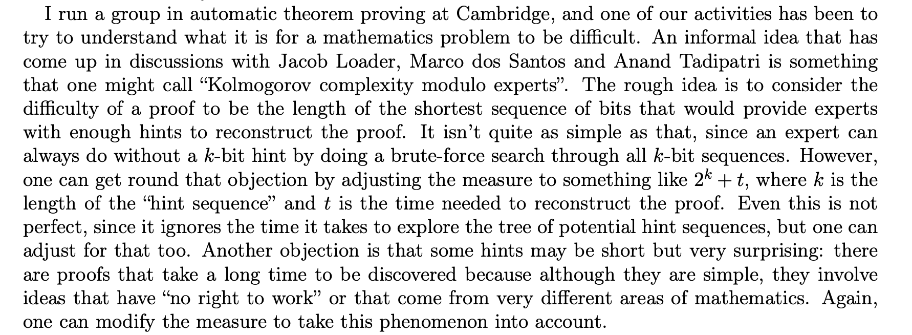

# 第 24 讲：文件系统 API（1）

> 原始讲义：[sources/notes/lect24.md](../../sources/notes/lect24.md)  
> 前一讲：[存储设备的抽象](23-storage.md)  
> 后一讲：[文件系统 API（2）](25-filesystem-api-2.md)  
> 配套示例：[atomic_replace.c](../../examples/atomic_replace.c)、[namespace_info.c](../../examples/namespace_info.c)  
> 本讲关键词：ADT、VFS、inode、dentry、path resolution、mount、FHS、getdents、glob、hard link、symlink、rename、openat、stat、mode、xattr、ACL

> **平台说明**：正文先给 POSIX/UNIX 可移植语义，再单独标出 Linux 扩展。`getdents64(2)`、`openat2(2)`、`renameat2(2)`、`statx(2)`、mount namespace 和 Linux xattr/ACL 接口都不能无条件当作跨平台 POSIX API。

## 0. 本讲定位：block array 之上，为什么最终长出一棵树？

上一讲把磁盘、光盘和 flash 的巨大工程差异压缩成一个操作系统抽象：可随机读写的 block array。

```text
read_block(id)
write_block(id, data)
```

这个接口适合文件系统实现者，却不适合普通进程直接共享。
若每个程序都 `open("/dev/mmcblk0p1", O_RDWR)` 后自行 `lseek/write`，它们会同时修改彼此不知道的数据结构；一个越界写就能摧毁全盘名字、内容和空闲空间记录。

文件系统在块设备上再加一层虚拟化：

```text
物理介质/FTL
  → block device
  → filesystem persistent data structure
  → directories + files + metadata
  → path-based API
  → shell、编辑器、编译器、数据库、Agent
```

本讲关注“人类使用的文件系统 API”：怎样把对象放进目录树、链接、命名、查询和授权。
下一讲会问这个 ADT 除 CRUD 外还能提供什么：监控、快照、OverlayFS，以及怎样用 FUSE 实现新的文件系统视图。

## 1. 学习目标与问题地图

学完本讲，你应该能够：

- 从 block array 推导“持久化 ADT”，并解释目录树为何利用信息局部性；
- 区分 pathname、directory entry、dentry cache、inode、open file description 与 fd；
- 逐分量解释 absolute/relative path、`.`、`..`、mount point 和 symlink resolution；
- 说明多个设备/文件系统如何经 mount 组成进程看到的一棵树；
- 解释 initramfs、`/init` 与最小 Linux 的根目录从何而来；
- 区分挂载文件系统镜像所需的 loop device 与 bind-mount 一个普通文件；
- 区分 POSIX `readdir(3)` 与 Linux `getdents64(2)`，并解释 glob 在 shell/libc 而非内核；
- 用 inode/link count 解释 hard link、`unlink` 与“删除后打开 fd 仍可读”；
- 用“存储 pathname 的文件”解释 symlink、dangling link、相对目标和 `ELOOP`；
- 说明 `rename` 的原子可见性与 crash durability 不是一回事；
- 用 directory fd、`openat`/`fstatat` 缩小 cwd/rename race，并说明 `openat2` 的 Linux 安全扩展；
- 解读 `stat`/`ls -l` 的 type、mode、owner、group、size、timestamps 与 link count；
- 解释 `chmod`、`chown`、directory `rwx`、umask、xattr 与 ACL 的不同职责；
- 评估 Nix、向量检索和智能搜索怎样突破传统路径层次，同时保留目录树的确定性价值。

路线严格沿 PPT：块设备到 ADT（§2–§4）→ 层次索引与统一目录树（§5–§12）→ 目录 API、glob 和 links（§13–§20）→ 元数据、xattr、ACL（§21–§25）→ 海量信息与目录树的妥协（§26–§27）。

## 2. Review & Comments：存储设备抽象还缺什么？

### 2.1 block device 已经替我们隐藏介质复杂性

FTL、磁头调度、纠错、坏块和设备内部固件都可藏在 `read_block/write_block` 之后。
“剩下复杂性不用你操心”只针对设备物理实现；block API 没有名字、所有权、共享、崩溃一致性或空间分配。

一个 block id 只说“第几个块”，不说：

- 这组 bytes 属于哪个用户对象；
- 一个对象占哪些离散块；
- 哪些块空闲；
- 写到一半掉电后哪个版本有效；
- 两个进程怎样避免互相覆盖；
- 人类如何找到十万个对象。

这些正是文件系统作为数据结构与并发协议要补的内容。

### 2.2 为什么不能让进程直接写设备文件？

Linux 确实把块设备暴露为 `/dev/nvme0n1`、`/dev/mmcblk0p1` 等设备节点；有权限的进程可 `open/lseek/read/write`。
这不是建议普通应用这么做：绕开挂载文件系统修改同一设备，会破坏 cache 与磁盘状态的一致性，甚至立即损坏文件系统。

因此层次分工是：设备提供块，文件系统实现对象与目录，VFS 给不同文件系统统一 API，权限系统限制谁能调用危险接口。
本讲讲上层 API；后续实现章再看块怎样组织成 inode、目录和日志。

## 3. Abstract Data Type（数据结构）：磁盘也能承载抽象

### 3.1 从地址空间上的 ADT 类推

内存硬件近似提供 random-access `char[]`。
在它之上，我们已经层层构造：

```text
physical memory
  → virtual address space / mmap
  → malloc/free
  → array/list/set/map/graph/...
```

既然 RAM 上能实现 ADT，持久化 block array 上当然也能。
差异不是“能不能”，而是代价与故障模型：block 粒度更大、延迟更高、写入可能撕裂、掉电会留下中间状态、容量远大于内存且需要持久回收。

文件系统因此是 **persistent concurrent data structure**：

- key 可以是路径或 `(parent inode, name)`；
- value 包含对象身份、内容位置与 metadata；
- update 包含 create/link/unlink/rename/write/truncate；
- invariants 包含目录无非法环、link count 正确、已分配块不重复、crash 后可恢复。

### 3.2 存储设备应该抽象成什么？

把磁盘虚拟化成一个巨大 `vector<char>` 仍不够管理对象。
“文件”把一段可变长 byte array 加上 `read/write/lseek/ftruncate` 等操作，可承载 `hello.c`、`a.out`、照片或数据库。

若再给每个文件一个 `fid`，人类会遇到和 pid 一样的问题：数字稳定但没有语义，难以分类、记忆、迁移和授权。
所以系统为机器内部保留 object id/inode number，为人类和程序提供 pathname。

路径不是对象身份本身；它是一段 **查询程序**：从某个起点沿名字边逐步查找对象。
同一对象可以有多个路径，一个路径也可以在不同时间解析到不同对象。

## 4. 机制地基：inode、目录项、dentry 与打开文件

在继续 PPT 的“图书馆”类比前，先固定几个常被混用的层次。

### 4.1 inode：文件系统内的对象身份与 metadata

在典型 UNIX 文件系统中，inode 保存对象类型、mode、uid/gid、link count、size、timestamps、数据块映射等；文件名通常不在 inode 中。
inode number 只在一个文件系统/设备范围内有意义，`(st_dev, st_ino)` 才是用户态较可靠的组合身份。

不同文件系统实现未必在磁盘上真有传统 inode table，但 Linux VFS 仍用 `struct inode` 表示对象。
所以“fid 的确存在”是抽象层事实，不应推成所有磁盘格式都完全相同。

### 4.2 directory entry：名字到对象的持久映射

目录本身是一个特殊文件/ADT，核心内容近似：

```text
(name bytes) → inode/object reference
```

`work/report.txt` 中，`report.txt` 属于父目录的 entry，不属于目标 inode。
hard link 就是在另一个目录增加一个新名字，指向同一 inode。

### 4.3 dentry：Linux VFS 的路径分量对象与 cache

Linux `struct dentry` 记录分量名、父 dentry 和 inode 指针，并进入 dcache；inode 指针为 `NULL` 的 negative dentry 还能缓存“这个名字不存在”。
dentry 不等于磁盘目录项：前者是 VFS 内存对象/cache，后者是具体文件系统的持久结构。

Linux 内核的 [pathname lookup 文档](https://www.kernel.org/doc/html/latest/filesystems/path-lookup.html)特别强调 dcache 还同 mount table 紧密结合；mount 记录哪棵树覆盖在哪个 dentry 上。

### 4.4 fd 与 open file description：名字解析结束后的稳定引用

`open(path, flags)` 先解析路径，再创建/引用一个 open file description，最后返回进程 fd table 中的整数槽位。

```text
pathname ──lookup──> dentry/inode
                       │
open()                 ▼
process fd ──> open file description ──> opened object
              (offset/status flags)
```

rename/unlink 改变目录项，不会让已经打开的 fd 自动改指向别的 inode。
这条区分将解释原子替换、临时文件和“删除后仍可读”。

## 5. 设备的抽象：目录树——为文件建一个图书馆

目录层次利用信息局部性：同一课程、项目、用户或应用的文件通常一起被创建、浏览、复制和授权。
把相关对象放到同一子树，就能用路径前缀表达一个集合。


图书馆不是把所有书随机编号后让读者背编号，而是按馆、楼层、类别、书架逐级缩小范围。
目录树同样把一次全局搜索拆成每层一次局部 lookup。

这个抽象的强大之处是可组合：相对路径表达上下文，子树可以整体移动/挂载，权限可设在目录边界，工具只需递归遍历通用接口。

## 6. 树状分层索引：信息局部性与“隐藏文件”

讲义的例子：

```text
.
└── 学习资料
    ├── .
    ├── ..
    ├── .学习资料
    ├── ……
    └── 操作系统
```

`.` 表示当前目录，`..` 通常表示父目录；它们参与 path resolution。
以 `.` 开头的普通名字“隐藏”则不是内核访问控制：`.学习资料` 仍是普通 directory entry，`open()`、`readdir()` 都能看到/访问，shell 与 `ls` 只是默认不展示。

BusyBox/coreutils 一类 `ls` 会在用户态判断名字首字节，并根据 `-a/-A` 决定跳过：

```c
while ((entry = readdir(dir)) != NULL) {
  if (entry->d_name[0] == '.') {
    /* 根据 -a/-A 选择是否 continue */
  }
}
```

这说明必须区分：

- kernel/filesystem 决定 lookup/readdir 返回什么；
- libc `readdir(3)` 封装目录读取；
- `ls` 决定怎样过滤与呈现；
- shell 决定 glob 默认是否匹配 dotfile。

Linux `/proc/[tid]` 提供更反直觉的 synthetic filesystem 例子：某些 task path 可直接 lookup，却不一定由 `/proc` 根目录枚举返回。
目录的“可查找集合”和“可枚举集合”可以由虚拟文件系统代码分别实现，不能假定二者永远相等。

把完整目录交给 AI 并不需要新内核 API：Read、Grep、Glob、Bash 已能把层次数据库转成上下文。
但 Agent 仍应尊重隐藏文件、权限、symlink 与体积边界，不能无上限递归整个根目录。

## 7. path resolution：路径是一段逐分量执行的查询

以 `openat(dirfd, "a/b/file", ...)` 为例，VFS 大致执行：

1. 选择起点：绝对路径从进程 root 开始；相对路径从 `dirfd` 或 cwd 开始；
2. 查找 `a`，要求中间对象是目录且调用者有 search/execute 权限；
3. 查找 `b`；遇到 mount point 时切换到挂载树；
4. 遇到 symlink 时把其文本目标拼回剩余路径并继续；
5. 处理 `.`、`..` 与 root/mount 边界；
6. 按最终 syscall flags 决定是否跟随最后一个 symlink、创建或删除对象。

路径解析期间，其他线程可以 rename/unlink 分量。
Linux 通过 dcache、锁、sequence counter 和 RCU walk 优化并保证内核合同；用户程序不能把先 `lstat()`、后 `open()` 两次调用幻想成不可分割事务。

[path_resolution(7)](https://man7.org/linux/man-pages/man7/path_resolution.7.html)是 Linux 行为的权威入口。
POSIX 给出跨平台 pathname 语义；Linux `openat2` 的 `RESOLVE_BENEATH/IN_ROOT/NO_SYMLINKS/NO_XDEV` 是额外安全约束。

## 8. 设备 = 目录树：多棵树怎样组成一个世界？

PPT 先用简化模型说：每个 device/partition 上的文件系统是一棵目录树，例如 `/dev/nvme0n1p1`、优盘或 WebDAV。
更准确的说法是：一个 filesystem instance 暴露一棵可挂载树，但并非每棵树都有 block device——`tmpfs`、`procfs`、网络文件系统和 FUSE 都是反例。

操作系统要管理：

- 已注册的 filesystem type；
- 每个 mounted instance/superblock；
- 它的 root dentry；
- 此 mount 覆盖到 namespace 中哪个 mount point；
- 同一 filesystem 是否被多个位置/namespace 引用。

最终进程看到的是一棵统一目录层次，内部跨越许多 superblock 与设备。

### 8.1 Windows：对象命名空间、UNC 与盘符

讲义用 Windows 对照 UNIX 的单根树。
Windows NT Object Manager 有根 `\`，可包含 `\Device\HarddiskVolume1`、`\Driver\Ntfs` 等对象；这个内部 namespace 不是用户在普通 shell 中 `cd` 的 Win32 文件树。

UNC `\\server\share` 表示网络 share，可经 redirector 映射到 NT 对象路径。
`A:\`、`B:\`、`C:\` 是 DOS 历史遗留视图，背后通过 DOS-device symbolic mapping（常在 `\??` 语境中）指向真正 volume。
课堂把它概括为 per-user namespace；实际映射还有 session/process/global 等层次，重点是“盘符不是物理设备身份”。

讲义展示的：

```c
HANDLE hDevice = CreateFile(
    "\\\\.\\PhysicalDrive0", GENERIC_READ | GENERIC_WRITE,
    FILE_SHARE_READ | FILE_SHARE_WRITE, NULL, OPEN_EXISTING, 0, NULL);
```

会绕到原始物理盘，通常需要高权限且极具破坏性；它是说明命名层次的代码，**不要作为实验运行**。
Windows 为普通用户隐藏 Object Manager 复杂度，和 Linux VFS 把许多 mount 拼成 `/` 有相似目标。

## 9. 从无到有的目录树：`mount` 把一棵树接到一个目录

Linux `mount` 的最小心智模型：

```text
filesystem tree root
          │
          └── attach onto target directory in this mount namespace
```

经典 Linux `mount(2)` 形如：

```c
int mount(const char *source, const char *target,
          const char *filesystemtype,
          unsigned long mountflags, const void *data);
```

`mount -t iso9660 /dev/cdrom /mnt/cdrom` 是 util-linux 用户态命令：它解析选项、可能探测类型，最终调用内核 mount API。
mount 后，target 原来目录项暂时被覆盖而非删除；unmount 后会重新可见。

ISO 9660 不是“光盘魔法”，而是一种可解析的 persistent data structure。
primary volume descriptor 中的 `type`、`"CD001"` standard id、system id、volume id 等字段让实现定位卷与目录记录；UDF 则常用于 DVD/Blu-ray 等介质。

现代 Linux 还有 `fsopen/fsconfig/fsmount/move_mount` 等拆分的新 mount API；它们属于 Linux 扩展。
PPT 和常用 `mount(8)` 的概念仍成立：构造 filesystem tree，再把它接入 namespace。

## 10. 最小 Linux：第一棵根目录从 initramfs 来

系统刚启动不能先从尚未挂载的根文件系统执行 `/sbin/init`。
Linux 可让 bootloader 把 initramfs 交给 kernel；kernel 解包出初始 rootfs，完成基本初始化后执行 `/init`，由第一个用户态进程继续挂载真正 root、设备和伪文件系统。

最小系统可以只准备极少文件：kernel、initramfs 中的 `/init`（脚本或静态程序）以及能交互/输出的 console 配置。
课程的[最小 Linux 演示](/OS/demos/virtualization/linux-minimal)把这个启动链显式化。

相关 kernel command line，例如 console、root、init 和 initrd 行为，应查 [Linux kernel parameters 官方文档](https://www.kernel.org/doc/html/latest/admin-guide/kernel-parameters.html)，不要仅凭 AI 猜一个能启动的参数组合。

“只有一个文件的 Linux”表达最小用户空间的思想，不是说 kernel 不需要内存中的 rootfs、设备接口和执行格式支持。

## 11. Aside：挂载一个文件——loop device 与 bind mount 不是一回事

传统磁盘文件系统 mount 期望 block-device-like source。
若 ext4/ISO image 存在普通文件 `fs.img` 中，loop driver 可把：

```text
block read/write(offset, length)
       ↓
backing file pread/pwrite(offset, length)
```

翻译成 `/dev/loopN` block device。
util-linux 的 `mount -o loop fs.img /mnt` 会协助创建/绑定 loop；底层常见：

```text
ioctl(loop-control-fd, LOOP_CTL_GET_FREE)
open("/dev/loopN", ...)
ioctl(loop-fd, LOOP_SET_FD, image-fd)
mount("/dev/loopN", target, fstype, ...)
```

Linux [drivers/block/loop.c](https://elixir.bootlin.com/linux/latest/source/drivers/block/loop.c)实现 block request/mq 相关操作，不是把 image 伪装成普通 char-device `file_operations`。
`lsblk` 会读取 sysfs/udev 与 block-device 信息；`strace lsblk` 能看到这些文件和 ioctl，而不是“扫描磁盘内容”。

Linux **bind mount** 还允许把一个已有文件挂到另一个文件 path：`mount --bind source-file target-file`。
它只是给同一 VFS object 增加一个 mount view，不解析 source 文件内部为新文件系统；与 loop-mounted image 完全不同。

## 12. 实验 1：观察 mount namespace；有权限时创建私有 tmpfs/bind mount

先做完全无特权、只读的观察：

```bash
printf 'mount namespace: '
readlink /proc/self/ns/mnt

findmnt -n -o TARGET,SOURCE,FSTYPE,OPTIONS / | head -n 1
sed -n '1,5p' /proc/self/mountinfo
```

`/proc/self/ns/mnt` 的 `mnt:[number]` 是当前 mount namespace 身份；`mountinfo` 每行记录 mount id、parent、major:minor、root、mount point、options、filesystem type 与 source。
同一个 disk inode 不等于同一个 namespace view；namespace 隔离的是“挂载列表/树”。

若系统允许 unprivileged user namespace，可在隔离环境中尝试：

```bash
unshare --user --map-root-user --mount sh -eu -c '
  mount --make-rprivate /
  demo=$(mktemp -d /tmp/lect24-mount.XXXXXX) || exit 1
  case "$demo" in /tmp/lect24-mount.*) [ -d "$demo" ] || exit 1 ;; *) exit 1 ;; esac
  mkdir "$demo/tree"
  touch "$demo/source" "$demo/target"
  printf "inside namespace\n" >"$demo/source"

  mount -t tmpfs tmpfs "$demo/tree"
  printf "tmpfs object\n" >"$demo/tree/only-here"
  mount --bind "$demo/source" "$demo/target"

  readlink /proc/self/ns/mnt
  findmnt -R "$demo"
  cat "$demo/target"

  umount "$demo/target"
  umount "$demo/tree"
  rmdir "$demo/tree"
  rm "$demo/source" "$demo/target"
  rmdir "$demo"
'
```

预期 `target` 读到 `inside namespace`，`tree` 显示 tmpfs；子 shell 退出后，host mount table 不应出现这些 mount。
`unshare` 创建 user/mount namespace，`mount` 要求该 user namespace 中的 `CAP_SYS_ADMIN`，而 kernel/seccomp/容器策略可能禁止 user namespace 或 mount，返回 `EPERM`。

失败时不要改用宿主机 `sudo mount` 规避实验边界；上面的 `/proc/self/mountinfo` 与 `findmnt` 已是安全替代。
若只想无特权检查 image，可用 `file fs.img`、`blkid -p fs.img` 或特定格式只读工具；它们解析 bytes，但没有把树接入 VFS。

## 13. Filesystem Hierarchy Standard：统一树还需要位置约定

mount 解决“树接在哪里”，没有规定软件应把配置、库、日志放哪里。
[FHS 3.0](https://refspecs.linuxfoundation.org/FHS_3.0/fhs/index)用 requirements/guidelines 让软件与用户能预测位置：

| 路径 | 典型角色 |
| --- | --- |
| `/etc` | host-specific configuration |
| `/usr/bin`、`/usr/lib` | 用户命令与库的共享/只读层次 |
| `/var` | 日志、spool、数据库等可变数据 |
| `/run` | 本次启动的运行时状态 |
| `/tmp` | 临时文件 |
| `/dev` | 设备节点 |
| `/proc`、`/sys` | Linux 运行时挂载的内核对象视图（不由 FHS 静态文件填充） |
| `/mnt`、`/media` | 临时/可移动介质的挂载位置约定 |

FHS 是用户空间布局标准，不是内核强制：kernel 不会阻止把配置放到 `/banana`。
发行版、容器镜像、Android、NixOS 与 macOS 可以采用不同政策；macOS 有 BSD/UNIX 渊源，却不等于遵循 Linux FHS。


## 14. 目录树 API：对 persistent map 做“增删改查”

### 14.1 API 分层：POSIX libc 与 Linux syscall

PPT 列出：

```c
int mkdirat(int dirfd, const char *pathname, mode_t mode);
int unlinkat(int dirfd, const char *pathname, int flags);
ssize_t getdents64(int fd, void *dirp, size_t count);
```

其中 `mkdirat/unlinkat` 属 POSIX *at family；`getdents64` 是 Linux syscall。
可移植程序通常使用 `opendir/readdir/closedir`，glibc 在 Linux 内部用 `getdents64` 批量填充 buffer。

常见目录操作：

| 意图 | POSIX 接口 | Linux 补充 |
| --- | --- | --- |
| 建目录 | `mkdir`, `mkdirat` | — |
| 删除空目录 | `rmdir`；`unlinkat(..., AT_REMOVEDIR)` | `unlinkat` flags 的具体扩展 |
| 枚举 | `opendir/readdir/closedir` | `getdents64`；`d_type` 可能为 `DT_UNKNOWN` |
| 改名字/移动 | `rename`, `renameat` | `renameat2` flags |
| 打开相对路径 | `openat` | `openat2` resolve policy |
| 查询 metadata | `stat/lstat/fstat/fstatat` | `statx` |

“目录增删改查”不是对字符串数组随意修改。
创建/删除需要父目录 write+search 权限；`rmdir` 只删空目录；当前工作目录、mount point、sticky bit 与并发 rename 都会影响结果。

### 14.2 `rename`：原子目录项替换，不等于落盘持久

同一 filesystem 内，POSIX `rename(old,new)` 保证观察者不会在替换过程中看到 `new` 短暂消失：若已存在，它要么仍指旧对象，要么已指新对象。
其他 hard link 与已打开 fd 不受影响。

边界：

- 跨 filesystem rename 返回 `EXDEV`，通常需 copy+fsync+unlink，已不再是单个原子操作；
- atomic visibility 不保证 crash 后目录项已持久，需要按文件系统合同 `fsync` 文件与 parent directory；
- `renameat2(RENAME_NOREPLACE/EXCHANGE/WHITEOUT)` 是 Linux 扩展；
- 权限检查针对 old/new 的父目录，sticky directory 还有额外限制。

仓库 [atomic_replace.c](../../examples/atomic_replace.c)正是 `mkstemp → write → fsync(file) → rename → fsync(parent)` 模式。

## 15. Globbing：目录树上的结构化查询发生在用户态

输入：

```bash
printf '%s\n' /etc/**/*
```

通常不是 `printf` 自己理解 `*`，更不是 kernel 有一个“glob syscall”。
Bash 在执行命令前枚举目录、匹配 pattern、排序/展开为 argv；程序最终看到许多普通 pathname 参数。

`**` 是否递归取决于 shell 及 `globstar` 选项；不匹配 pattern 时保留字面量还是展开为空，也受 `nullglob/failglob` 等策略影响。
以 `.` 开头的 name 默认不被 `*` 匹配，再次说明“隐藏”是工具 policy。

POSIX [glob(3)](https://pubs.opengroup.org/onlinepubs/9799919799/functions/glob.html)为 C 程序封装 pattern → pathname list；它内部仍需 `opendir/readdir/stat`。
课程的 [globbing 演示](/OS/demos/persistence/globbing)把 pstree 的递归遍历推广到文件树，也对应 Agent 的 Read、Write、Grep、Glob 四类基础技能。

### 15.1 实验 2：观察 shell glob、dotfile 与 `getdents64`

```bash
glob_demo=$(mktemp -d /tmp/lect24-glob.XXXXXX) || exit 1
case "$glob_demo" in /tmp/lect24-glob.*) [ -d "$glob_demo" ] || exit 1 ;; *) exit 1 ;; esac
mkdir -p "$glob_demo/a/b"
touch "$glob_demo/visible" "$glob_demo/.hidden" "$glob_demo/a/b/deep"

printf 'default *:\n'
printf '  %s\n' "$glob_demo"/*

printf 'globstar + dotglob:\n'
GLOB_DEMO=$glob_demo bash -O globstar -O dotglob -c \
  'printf "  %s\n" "$GLOB_DEMO"/**'

strace -f -e trace=getdents64,newfstatat,openat \
  env GLOB_DEMO="$glob_demo" bash -O globstar -c \
  'printf "%s\n" "$GLOB_DEMO"/**' >/dev/null

printf 'temporary tree retained at %s\n' "$glob_demo"
```

第一次不会列 `.hidden`；启用 `dotglob` 后会匹配它，`globstar` 允许 `**` 跨多层。
trace 中 Bash/loader 会有许多额外 `openat/newfstatat`；关键是对目录 fd 的 `getdents64`，证明匹配发生在 shell 进程。

实验故意保留并打印临时路径，便于检查；确认无误后只删除这个由 `mktemp` 返回的目录：

```bash
case "$glob_demo" in
  /tmp/lect24-glob.*) rm -r -- "$glob_demo" ;;
  *) echo 'refusing unexpected cleanup path' >&2 ;;
esac
```

## 16. 硬（hard）链接：多个名字引用同一个 inode

### 16.1 需求：共享“当前版本”而不复制内容

系统可能同时保存 `libc-2.26.so`、`libc-2.27.so` 等对象，又需要一个稳定名字 `libc.so.6`。
若两个名字都指同一个对象，就不必复制 bytes；修改内容也会从任何名字观察到。

实际共享库版本名常使用 symlink，因为“当前版本”需要轻易切换；PPT 先用它提出一般问题，再区分 hard/symbolic 两种解法。

### 16.2 `link` 增加目录引用，`unlink` 减少引用

`link("old", "new")` 在 `new` 的父目录创建 entry，指向 `old` 最终解析到的 inode；inode `st_nlink` 增加。
不存在“哪个名字是原件”：成功后两个 hard link 地位相同。

```text
dir A: "lib" ─┐
                ├──> inode 49152 ──> data blocks
dir B: "copy" ─┘       st_nlink = 2
```

`unlink(path)` 删除一个 directory entry 并递减 link count。
当 `st_nlink == 0` 且没有 open file description/mmap 等引用后，filesystem 才能回收 inode 与数据块。
所以删除系统调用叫 unlink，而不是“立即销毁对象”。

hard link 的重要限制：

- 不能跨 filesystem：inode number/allocator/link count 都由一个 filesystem 管理，失败通常为 `EXDEV`；
- 普通用户不能 hard-link directory，避免生成绕过 `.`/`..` 规则的环；
- Linux 还可能用 `fs.protected_hardlinks` 限制给不属于自己的文件加链接，防止借 link 攻击 privileged 程序；
- directory `st_nlink` 常与子目录数量有关，但不同 filesystem/overlay/synthetic fs 未必按简单公式呈现。

POSIX `link/linkat` 规定可移植语义；Linux [link(2)](https://man7.org/linux/man-pages/man2/link.2.html)记录具体错误和扩展。

## 17. 实验 3：hard/symlink、rename/unlink 与打开 fd 的对象生命周期

整个实验只在唯一临时目录中操作：

```bash
link_demo=$(mktemp -d /tmp/lect24-links.XXXXXX) || exit 1
case "$link_demo" in /tmp/lect24-links.*) [ -d "$link_demo" ] || exit 1 ;; *) exit 1 ;; esac
printf 'version one\n' >"$link_demo/original"

ln "$link_demo/original" "$link_demo/hard"
ln -s original "$link_demo/soft"

stat -c 'name=%n dev=%d inode=%i links=%h type=%F' \
  "$link_demo/original" "$link_demo/hard"
stat -c 'symlink object: name=%n inode=%i size=%s type=%F' \
  "$link_demo/soft"
printf 'symlink payload: '
readlink "$link_demo/soft"

mv "$link_demo/original" "$link_demo/renamed"
printf 'hard after rename: '; cat "$link_demo/hard"
printf 'soft after rename: '
if ! cat "$link_demo/soft"; then echo '(dangling as expected)'; fi

exec 3<"$link_demo/hard"
rm "$link_demo/hard" "$link_demo/renamed" "$link_demo/soft"
stat -Lc 'opened object: inode=%i links=%h size=%s' "/proc/$$/fd/3"
printf 'read through fd after last unlink: '; cat <&3
exec 3<&-

rmdir -- "$link_demo"
printf 'temporary directory removed: %s\n' "$link_demo"
```

预期 `original` 与 `hard` 的 `(dev,inode)` 相同、link count 为 2；symlink 有自己的 inode，payload 是文本 `original`。
rename 后 hard link 仍可读，relative symlink 却继续从“symlink 所在目录”寻找旧名字，于是 dangling。

打开 fd 3 后删除所有 hard link，`/proc/$$/fd/3` 仍指向已打开对象，`st_nlink` 为 0，内容仍可读；关闭 fd 后才允许回收。
这里 `/proc/.../fd` 是 Linux magic link，非 POSIX。

对应 syscall/state：

```text
link/linkat       parent directory 增加 name→inode，nlink++
symlink/symlinkat 新建 symlink inode，保存目标文本
rename/renameat   原子修改目录项名字
unlink/unlinkat   删除目录项，nlink--
openat            fd/open-file-description 持有对象引用
close             释放最后打开引用，若 nlink=0 可回收
```

清理空临时目录前同样验证前缀：

```bash
case "$link_demo" in
  /tmp/lect24-links.*) rmdir -- "$link_demo" ;;
  *) echo 'refusing unexpected cleanup path' >&2 ;;
esac
```

## 18. 软（symbolic）链接：一个保存“跳转提示”的对象

symlink 自己是文件系统对象，其内容是一段 pathname bytes。
`readlink()` 读取这段文本且不会在末尾自动补 NUL；普通 `open/stat` 通常跟随 symlink，`lstat`/`fstatat(..., AT_SYMLINK_NOFOLLOW)` 查询 link 自身。

```text
symlink inode ──payload──> "../releases/libc-2.27.so"
                                │
path resolver 把它替换进剩余路径 ─┘
```

相对 target 相对于 **symlink 所在目录** 解释，不相对于创建它时的 cwd，也不相对于调用者当前 cwd。
绝对 target 从当前进程 root 解释；在 chroot/container/mount namespace 中，同一文本可能解析到不同对象。

因为 symlink 指向名字而非 inode，它可以：

- 跨 filesystem；
- 指向 directory；
- 先于 target 创建，形成 dangling link；
- 指向另一个 symlink；
- 构成环，最终 path resolution 返回 `ELOOP`；
- target rename 后失效，除非同步更新 link。

Linux 普通 symlink mode 总显示 0777 且不参与常规 target 权限判断；真正访问仍检查每个目录和目标对象权限。
symlink owner 在 sticky directory/protected-symlink policy 下可能有意义。

Windows `.lnk` “快捷方式”是更复杂的 shell-link 文件格式，可保存路径外的标识与重定位信息；它不等于内核 pathname symlink。
讲义用 U 盘盘符变化、目标移动后仍可能找到，说明更强 heuristic 带来更多状态和边界。

## 19. Symlink Game：目录树可以被扩展成图和状态机

课程的 [Symlink Game](/OS/demos/persistence/ggmaker)用 symlink 构造“近乎任意”的目录图。
玩家进入某个路径，看到的下一组名字就是状态的 outgoing edges；跟随链接相当于状态转移。

```text
state/start/left  -> ../room-a
state/start/right -> ../room-b
state/room-a/back -> ../start
```

filesystem 没有“Galgame API”，只有 mkdir、symlink 和 path walk；组合简单机制便产生交互叙事。
讲义说今年已改为 Agentic Design Harness，强调机制可以服务创作与自动化，而不只管理配置文件。

“操作系统能正确解析任意图”要带边界：

- symlink 展开有上限，环会 `ELOOP`；
- tree walker 若跟随 link 必须做 visited/深度控制；
- 权限和 mount boundary 仍逐分量检查；
- 多个进程并发改 link，单次 path walk 并非用户态快照。

## 20. path race 与安全边界：为什么需要 `openat`/`fstatat`？

经典反例：privileged 程序先 `lstat("work/output")` 确认是普通文件，攻击者在下一条 `open()` 前把 `work` 或 `output` 换成 symlink。
检查与使用分离，形成 TOCTTOU。

`openat(dirfd, relative, ...)` 的进步是先打开可信目录，再以稳定 directory fd 为起点：cwd 或目录自身被 rename 后，fd 仍引用同一个对象。
同族接口还有 `mkdirat/unlinkat/linkat/symlinkat/renameat/fstatat/fchmodat/fchownat/readlinkat`。

但 `openat` 不是完整 sandbox：`relative` 的中间分量仍可含 symlink/`..` 并逃逸；`O_NOFOLLOW` 只约束最后分量。
Linux `openat2` 才提供 `RESOLVE_BENEATH`、`RESOLVE_IN_ROOT`、`RESOLVE_NO_SYMLINKS`、`RESOLVE_NO_MAGICLINKS` 和 `RESOLVE_NO_XDEV` 等整条路径策略；它自 Linux 5.6 起存在，不是 POSIX，glibc 也未必有普通 wrapper。

参见 POSIX [open/openat](https://pubs.opengroup.org/onlinepubs/9799919799/functions/open.html)与 Linux [openat2(2)](https://man7.org/linux/man-pages/man2/openat2.2.html)。

### 20.1 实验 4：directory fd 经 rename 仍稳定，`O_NOFOLLOW` 拒绝最终 symlink

保存为 `/tmp/openat-demo.py`：

```python
#!/usr/bin/env python3
import errno
import os
import tempfile

with tempfile.TemporaryDirectory(prefix="lect24-openat-", dir="/tmp") as root:
    old = os.path.join(root, "old")
    new = os.path.join(root, "renamed")
    os.mkdir(old, 0o700)
    with open(os.path.join(old, "data"), "w", encoding="utf-8") as f:
        f.write("stable object\n")

    dirfd = os.open(old, os.O_RDONLY | os.O_DIRECTORY | os.O_CLOEXEC)
    try:
        os.rename(old, new)
        fd = os.open("data", os.O_RDONLY | os.O_CLOEXEC, dir_fd=dirfd)
        try:
            print("after parent rename:", os.read(fd, 100).decode().strip())
            st = os.fstat(fd)
            print("opened identity:", (st.st_dev, st.st_ino))
        finally:
            os.close(fd)

        os.symlink("/etc/passwd", os.path.join(new, "bait"))
        try:
            os.open("bait", os.O_RDONLY | os.O_NOFOLLOW, dir_fd=dirfd)
        except OSError as e:
            assert e.errno == errno.ELOOP
            print("final symlink rejected with ELOOP")
        else:
            raise RuntimeError("O_NOFOLLOW unexpectedly followed bait")
    finally:
        os.close(dirfd)
```

运行并观察 *at syscall：

```bash
strace -e trace=openat,rename,mkdir,symlink,read,newfstatat,close \
  python3 /tmp/openat-demo.py
```

预期 parent 从 `old` rename 为 `renamed` 后，`openat(dirfd,"data")` 仍读到 `stable object`；`bait` 则因 `O_NOFOLLOW` 返回 `ELOOP`。
Python 的 `dir_fd=` 在 Linux 映射到 *at family。

边界：实验只防 final symlink，未演示中间分量或并发攻击；安全地打开不可信相对树应考虑 `openat2` resolve flags、最小权限和 fd-based `fstat/fchmod`，而不是重新拼绝对路径。

## 21. 软连接还可以“伪造”文件系统：Nix 与持久化数据结构

Nix 把许多版本的软件包放进独立 store path，例如：

```text
/nix/store/b6gvzjyb2pg0kjfwrjmg1vfhh54ad73z-firefox-33.1
```

store path 的 hash 来自构建输入/derivation 等可复现信息；不同版本和依赖组合可并存。
用户 profile/environment 再用 symlink 选择当前可见的 `bin/lib/...`，无需 in-place 覆盖全局 `/usr`。

```bash
nix-shell -p python3 nodejs
nix-env --list-generations
nix-env --switch-generation N
# 或按 Nix 版本/profile 工具使用 rollback
```

这接近 persistent data structure：不可变 store object 像历史节点，profile symlink 像 root pointer；更新创建新节点并切换 root，旧 generation 仍可回滚。
相比之下，传统 package manager 常原地更新共享层次，回滚需要额外 snapshot/log。

PPT 用“random read + append-only write = 任意数据结构”“`/nix/store` 只增不减”建立类比。
工程上应补两点：store path 通常不可变，但 garbage collection 可以删除不再 reachable 的 path；determinism 还取决于构建是否封闭、输入是否固定，不是有 hash 就自动可复现。

这也说明 symlink 不只是快捷方式：它能构造一套与物理 store layout 不同的逻辑环境。

## 22. 为文件增加属性：byte array 也需要“personality”

文件内容不足以表达所有 policy。
系统还需要知道对象类型、谁拥有、谁能访问、多久前修改、是否可执行、是否被多个名字引用，以及应用自定义标签。

### 22.1 两种“隐藏”揭示 policy 与 mechanism

`.学习资料` 的隐藏完全是名字约定：对象真实存在、API 可访问，命令行工具默认过滤。
讲义提出更丰富 policy：“只有我独自使用电脑时不隐藏，其他时候隐藏。”传统 dot-prefix 无法表达上下文、观察者和动态条件，这正是新接口的设计机会。

`/proc/[tid]` 的“存在但 getdents 不枚举”更接近 filesystem mechanism：procfs lookup 规则与 readdir 规则由内核代码分别生成。
两者都提醒：visibility、discoverability 与 permission 不等价。
隐藏名字不是安全边界；真正保密需要 access control。

### 22.2 `ls -l` 每一列属于谁？

典型输出：

```text
-rw-r--r-- 1 alice staff 1024 Mar 10 12:34 example.txt
│           │ │     │     │    │            └─ directory entry name
│           │ │     │     │    └─ displayed timestamp (usually mtime)
│           │ │     │     └─ size
│           │ │     └─ group
│           │ └─ owner
│           └─ hard-link count
└─ type + mode bits
```

第一字符常见：`-` regular、`d` directory、`l` symlink、`p` FIFO、`c` char device、`b` block device、`s` socket。
后九位是 owner/group/other 的 `rwx`，另有 setuid/setgid/sticky special bits。

`0755` 可拆为：

```text
owner  7 = 111 = rwx
group  5 = 101 = r-x
other  5 = 101 = r-x
```

文件名属于 parent directory entry；其余大多来自目标 inode metadata。
`ls -l symlink` 通常用 `lstat` 显示 link 自身，再用 `readlink` 打印 `-> target`。

### 22.3 `stat` family：查询对象，不要把 path 当身份

POSIX 提供：

- `stat(path)`：跟随最终 symlink，查询 target；
- `lstat(path)`：查询 symlink 自身；
- `fstat(fd)`：查询已打开对象，不再做 path lookup；
- `fstatat(dirfd,path,...,flags)`：相对 directory fd，并可用 `AT_SYMLINK_NOFOLLOW`。

`struct stat` 典型包含 `st_dev/st_ino/st_mode/st_nlink/st_uid/st_gid/st_size/st_blocks` 与 atime/mtime/ctime。
ctime 是 inode status change time，不是 creation time；birth time 不是传统 POSIX `stat` 保证，Linux 可通过 `statx` 在支持时请求。

先 `stat(path)` 再按结果 `open(path)` 有 TOCTTOU；安全逻辑应尽量 `open` 后 `fstat(fd)`，把检查与后续 I/O 绑定到同一打开对象。

## 23. mode、`chmod`、`chown`：文件权限与目录权限不是一回事

### 23.1 regular file 的 `rwx`

- `r`：读取内容；
- `w`：修改内容/截断；
- `x`：允许作为程序执行（仍需有效格式/interpreter 与 mount policy）。

`chmod/fchmod/fchmodat` 修改 mode。
`umask` 在创建时从请求 mode 中屏蔽 bits；它不是之后每次访问都参与，也不能提升调用者未请求的权限。

### 23.2 directory 的 `rwx`

- `r`：读取名字列表（enumerate）；
- `w`：修改目录项；
- `x`：search/traverse，允许按已知名字进入/lookup。

因此可能“能列名字但不能 stat/cat”，也可能“不能列全目录但知道精确名字仍可访问”。
删除一个文件主要要求 parent directory 的 write+search 权限，不要求文件本身可写；sticky bit（如 `/tmp`）再限制谁能删除/rename entry。

路径访问会检查每个中间 directory 的 search 权限，再按最终操作检查对象/parent。
owner bits、group bits、other bits 不是简单把所有匹配权限相加；系统按 owner/ACL/group/other 规则选择并可能受 capabilities、LSM、mount flags 继续限制。

### 23.3 ownership 与 `chown`

`chown/fchown/fchownat/lchown` 修改 uid/gid；`lchown` 操作 symlink 自身。
普通用户不能任意把文件赠给另一个 uid，Linux 通常要求 owner/适当 group 或 capability；ownership change 还可能清除 setuid/setgid bits，避免把特权程序交给未授权修改者。

POSIX 定义基本 `chmod/chown/stat`；Linux capabilities、idmapped mount、LSM 与 `statx` 是扩展层。
权限判断结果不能只靠 `ls -l` 九位预测，ACL 与安全模块还可能介入。

## 24. 更多的元数据：Extended Attributes（xattr）

xattr 为文件/目录附加 `(name,value bytes)`，像每个 inode 上的小 key-value dictionary：

```c
ssize_t fgetxattr(int fd, const char *name, void *value, size_t size);
int fsetxattr(int fd, const char *name,
              const void *value, size_t size, int flags);
```

Linux 常见 namespace：

| 前缀 | 典型用途/权限 |
| --- | --- |
| `user.*` | 普通应用自定义 metadata，受对象权限与 filesystem 支持限制 |
| `trusted.*` | 通常只允许 `CAP_SYS_ADMIN` 访问 |
| `security.*` | SELinux、capability 等安全模块 |
| `system.*` | ACL 等内核/文件系统定义 metadata |

xattr 不在 POSIX 核心接口中；Linux、macOS、BSD 的 API、namespace 与复制行为不同。
macOS 下载来源常保存在 `com.apple.metadata:kMDItemWhereFroms`、`com.apple.quarantine` 等属性，说明 URL/policy 不必塞入正文或文件名。

### 24.1 为什么“好用不火”？兼容性与生命周期

后加 metadata 的致命问题是传播链不完整：

- filesystem 可能不支持或有大小限制；
- archive/protocol/object store 可能没有等价字段；
- `cp`、编辑器的“另存为”、同步工具可能丢失；
- backup/restore 必须显式保留；
- 不同 OS 对 namespace/编码/安全属性语义不同。

GNU `cp --preserve=xattr` 或 `cp -a`、`rsync -X`、`tar --xattrs` 等要按工具合同使用，不能假设复制 bytes 就复制全部 personality。

讲义举 [vectorfs](https://vectorvfs.readthedocs.io/en/latest/)：把 embedding/vector index 接到文件系统搜索，能像照片语义检索一样用内容寻找对象。
这展示 xattr/索引的潜力，也展示“不是所有 filesystem/tool 都懂新 metadata”的部署成本。

## 25. Access Control List：比 user/group/other 更细的授权

传统 mode 只能表达一个 owner、一个 group class 和 everyone else。
若飞书文档要分别授权 Alice 编辑、Bob 只读、实习生组无权，就需要更丰富规则。

Linux POSIX ACL 常见文本 entry：

```text
user::rw-
user:alice:r--
group::r--
mask::r--
other::---

default:user::rwx          # 只用于目录，影响新建子对象的初始 ACL
```

`[d:]u:name:perms`、`[d:]g:name:perms` 是 `setfacl` 常用简写；`getfacl` 查看。
`mask` 限制 named users（owner entry 除外）和 group class 的最大有效权限，所以 entry 写 `rw-` 仍可能显示 `#effective:r--`。

“POSIX ACL”来自 POSIX.1e 草案传统，不是现代 POSIX.1 核心必备接口；Linux 文件系统常把 ACL 存入 `system.posix_acl_*` xattr，由 VFS 权限检查解释。
NFSv4/Windows ACL 又有不同继承、deny/allow 和语义，不能只搬 `setfacl` 文本。

知道 fine-grained access control 存在，能让开发者在实现协作文档时向 AI 提出正确 specification；但仍要定义主体身份、继承、撤销、分享链接、缓存、审计和跨组织边界。

## 26. 实验 5：mode、xattr 与 ACL 的叠加；不支持时明确降级

创建临时对象并先观察传统 metadata：

```bash
meta_demo=$(mktemp -d /tmp/lect24-meta.XXXXXX) || exit 1
case "$meta_demo" in /tmp/lect24-meta.*) [ -d "$meta_demo" ] || exit 1 ;; *) exit 1 ;; esac
umask 027
printf 'classified\n' >"$meta_demo/report"

stat -c 'mode=%A (%a) uid=%u gid=%g links=%h inode=%i' \
  "$meta_demo/report"
chmod 640 "$meta_demo/report"
stat -c 'after chmod: mode=%A (%a)' "$meta_demo/report"
```

预期创建 mode 通常为 `640`（程序请求的 `666` 被 umask `027` 屏蔽），显式 `chmod 640` 后仍相同。
GNU `stat -c` 是用户态格式化，底层通常调用 `statx/newfstatat`；`chmod` 进入 `chmod/fchmodat` 路径。

用 Python 的 Linux/Unix xattr binding，避免依赖 `setfattr` 命令：

```bash
REPORT="$meta_demo/report" python3 - <<'PY'
import errno
import os

path = os.environ["REPORT"]
try:
    os.setxattr(path, "user.lesson", b"filesystem-api")
    print("xattr names:", [x.decode() if isinstance(x, bytes) else x
                           for x in os.listxattr(path)])
    print("user.lesson:", os.getxattr(path, "user.lesson").decode())
except OSError as e:
    if e.errno in (errno.ENOTSUP, errno.EOPNOTSUPP, errno.EPERM):
        print("xattr unsupported or forbidden on this filesystem:", e)
    else:
        raise
PY
```

支持时会打印 `user.lesson` 与 value；tmpfs/ext4 等通常支持，某些 network/sandbox/filesystem policy 会返回 `ENOTSUP/EOPNOTSUPP/EPERM`。

若安装了 `setfacl/getfacl` 且 filesystem 支持 ACL，再运行。脚本先尝试给
`nobody` 添加 named-user entry；若当前容器/idmapped mount 无法表示这个 uid，
就退回到当前用户名，仅观察 ACL 文本和 mask 的计算结果：

```bash
if command -v setfacl >/dev/null && command -v getfacl >/dev/null; then
  if getent passwd nobody >/dev/null 2>&1 &&
     setfacl -m u:nobody:rw-,m:r-- "$meta_demo/report" 2>/dev/null; then
    echo 'named entry: nobody'
    getfacl "$meta_demo/report"
  elif setfacl -m "u:$(id -un):rw-,m:r--" "$meta_demo/report" 2>/dev/null; then
    echo 'secondary uid unavailable; showing mask with the owner name only'
    getfacl "$meta_demo/report"
  else
    echo 'ACL unsupported, forbidden, or uid is unmapped on this filesystem'
  fi
else
  echo 'ACL tools unavailable; inspect mode/xattr results only'
fi
```

成功添加 `nobody` 时，预期它的 entry 请求 `rw-`，而 mask `r--` 使显示的有效权限只有读；是否真能以该身份访问还取决于目录 search、namespace 身份与其他安全层，本实验不切换用户。
退回当前用户名只是为了稳定展示 `#effective:r--`：实际 owner 匹配会优先使用 `user::` entry，不能把这个 fallback 当成授权测试。

可用 `strace -e trace=chmod,setxattr,getxattr,listxattr,newfstatat` 对齐 syscall。
清理时先确认唯一前缀：

```bash
case "$meta_demo" in
  /tmp/lect24-meta.*) rm -r -- "$meta_demo" ;;
  *) echo 'refusing unexpected cleanup path' >&2 ;;
esac
```

## 27. 如何应对海量的信息？Scaling Law 与“专家模去 Kolmogorov 复杂度”

文件系统 API、POSIX、Linux 扩展、工具选项和历史兼容性远超一人记忆。
讲义把 pre-training、SFT 与 test-time scaling 引入这里，不是要求把权限问题交给聊天框拍脑袋，而是改变学习分工：

```text
人：建立 object/path/authority/failure 的稳定模型
模型：从海量语料提出候选 API、源码位置和实验
工具：man page、standard、strace、最小测试提供证据
人：审计边界、权限、破坏性与可移植性
```

Timothy Gowers 的说法“Kolmogorov complexity modulo experts”可理解为：拥有可信专家后，个人描述/掌握问题所需的信息复杂度会下降。
LLM 把“可咨询专家”的范围扩张，但专家可能混淆 POSIX 与 Linux、编造 flag 或忽略安全前提；质量保证来自可核查 source 和实验 harness。



“在没有直接经验的领域进行有质量保证的编程”需要 specification：我要操作哪一个对象？是否跟随 symlink？必须可移植吗？并发 rename 怎么办？失败能否重试？需要 crash durability 吗？
问题问清楚，AI 才有机会找到 `openat2`、ACL 或其他恰当机制。

## 28. “目录树”也是个妥协：路径、结构化查询与智能检索

图书馆按类别/书架的层次索引源于人工检索成本。
若每本书内容已数字化，全文、embedding 和图像定位都可直接成为索引；摄像头甚至能定位实体书，无需读者先知道分类号。


信息访问经历：

```text
精确路径
  → wildcard / globbing
  → metadata / structured query
  → full-text / vector / multimodal intelligent retrieval
```

但“目录树可淘汰”是挑战既有设计的课堂命题，不是说路径毫无价值。
目录树仍提供：

- 短、确定、可离线解析的名字；
- prefix locality 与批量权限/备份边界；
- 脚本和 build 的 reproducible dependency；
- 不依赖二级索引新鲜度的 ground truth；
- mount、namespace 与 delegation 的自然接口。

内容索引更适合作为 secondary index；它会有构建成本、陈旧、隐私、排名不确定和模型更新问题。
未来接口很可能组合路径的确定性与语义检索，而不是简单用一个搜索框替掉所有 object identity。

## 29. 概念辨析与常见误区

| 误区 | 辨析 |
| --- | --- |
| 文件名存在于 inode 中 | 名字通常属于 parent directory entry；inode 保存对象 metadata/data mapping。 |
| dentry 就是磁盘目录项 | Linux dentry 是 VFS 内存对象/cache，可为 negative；持久布局由具体 filesystem 决定。 |
| inode number 全系统唯一 | 通常只在 filesystem 内唯一；用户态比较至少结合 `st_dev`。 |
| path 是稳定对象身份 | path 是 lookup；rename、mount、symlink 和 namespace 都能改变解析结果。打开 fd 更稳定。 |
| mount 会删除 mount point 原内容 | 它覆盖可见视图；unmount 后底层 entry 重新出现。 |
| 每个 filesystem 都有 block device | tmpfs、procfs、network fs、FUSE 都可能没有本地 block backing。 |
| fs.img 可直接当 block device | filesystem image 是普通文件；传统 mount 需 loop 等 block view，或使用用户态格式解析器。 |
| bind-mount 文件等于挂载 image | bind mount 重用已有 VFS object；loop mount 解析 image 内的新 filesystem tree。 |
| dotfile 是内核安全隐藏 | 只是工具命名约定，API 照常访问；permission 才是安全边界。 |
| `getdents64` 是 POSIX 目录 API | 它是 Linux syscall；POSIX 程序应使用 `readdir(3)`。 |
| glob 是 kernel syscall | shell 或 libc 枚举、匹配后生成 pathname；被执行程序只收 argv。 |
| hard link 有“原件”和“副本” | 两个名字平等地引用同一 inode；不能从内容判断哪个先创建。 |
| `rm` 立刻销毁文件 bytes | unlink 先删 name；nlink 为 0 且无打开引用后才可回收。 |
| symlink 相对创建时 cwd 解析 | relative target 相对 symlink 所在目录解释。 |
| `O_NOFOLLOW` 阻止路径中所有 symlink | 它只约束 final component；Linux `openat2(RESOLVE_NO_SYMLINKS)` 才约束整条 walk。 |
| rename 原子就等于掉电不丢 | 原子可见性与 crash durability 不同；持久替换还需正确 fsync 协议。 |
| file 不可写就不能删除 | unlink 检查 parent directory 修改权限与 sticky policy，不主要看 file write bit。 |
| `ctime` 是 creation time | 它是 status-change time；birth time 需其他 API/支持。 |
| mode bits 是最终权限全部 | ACL、capabilities、LSM、mount flags 与 namespace 都可能继续限制/授权。 |
| xattr 会随复制自动保留 | 工具、格式和目标 filesystem 必须显式支持/请求。 |
| “POSIX ACL” 是 POSIX.1 必选核心 | 名称源于 POSIX.1e 草案传统；Linux ACL 是广泛扩展，不等同跨平台统一语义。 |

## 30. Takeaways：目录是链接，文件是对象

块设备只提供持久 bytes；文件系统把它变成可共享、可命名、可授权的 persistent data structure。
目录 entry 把名字链接到对象，inode 承载对象 metadata，VFS dentry/path walk 把多种 filesystem 与 mount 拼成进程看到的一棵树。

hard link 指向对象，symlink 指向名字；`unlink/rename/openat/stat/chmod/chown/xattr/ACL` 分别修改名字关系、稳定引用或 metadata。
理解边界比记命令重要：POSIX 与 Linux 扩展、路径与 fd、原子可见与持久落盘、传统 mode 与 ACL/LSM 都不能混为一谈。

目录树是一种极其成功但并非终极的信息索引。
metadata、glob、full-text 与 vector search 可以提供更丰富服务；简单、确定的 tree 仍是它们可靠的 object substrate。

## 31. 思考题与下一讲衔接

1. 为什么 `(st_dev, st_ino)` 比 pathname 更接近对象身份？OverlayFS/网络文件系统下还需注意什么？
2. 一个文件有两个 hard links 和一个打开 fd。依次 unlink 两个名字后，link count 与对象生命周期怎样变化？
3. relative symlink `../x` 被所在目录 rename 后，目标会不会变化？被整体移动到另一个 parent 呢？
4. 为什么 hard-link directory 会破坏很多 tree-walk/`..` 不变量？
5. mount 在 `/mnt` 上后，原 `/mnt/secret` 去哪里了？打开它的旧 fd 是否仍有效？
6. `stat(path); open(path)` 如何被 symlink/rename 攻击？directory fd 与 `openat2` 各修复哪一层？
7. `rename(tmp,target)` 保证读者看到什么？掉电后还需哪些 `fsync`，为什么跨 filesystem 不成立？
8. 目录 mode 为 `--x` 与 `r--` 分别能做什么？为何 file mode 000 也未必阻止 owner 删除名字？
9. ACL named user 有 `rw-`，mask 为 `r--`，最终权限是什么？`chmod` 为什么可能改变 ACL 有效值？
10. 复制文件时，内容、mode、owner、timestamps、xattr、ACL、sparse layout 哪些默认保留？必须查哪个工具合同？
11. Nix profile symlink 为什么像 persistent tree 的 root pointer？garbage collection 如何改变“只增不减”类比？
12. 若语义索引落后于目录真实状态，搜索系统怎样表达 freshness 与 authoritative path？

下一讲从“CRUD 是简单的一小步”继续：目录改变后如何高效通知应用（inotify/eBPF），怎样让 persistent structure 保存历史快照（Git/btrfs），以及怎样把 upper/lower 目录拼成 OverlayFS。
本讲的 dentry、link、xattr、rename 与 mount 正是监控、snapshot、whiteout/copy-up 的语义地基。

## 32. 扩展资料（区别于 PPT 主线）

- [POSIX.1-2024 `open/openat`](https://pubs.opengroup.org/onlinepubs/9799919799/functions/open.html)与 [`rename/renameat`](https://pubs.opengroup.org/onlinepubs/9799919799/functions/rename.html)；
- Linux [VFS overview](https://docs.kernel.org/filesystems/vfs.html)、[pathname lookup](https://www.kernel.org/doc/html/latest/filesystems/path-lookup.html) 与 [path_resolution(7)](https://man7.org/linux/man-pages/man7/path_resolution.7.html)；
- Linux [openat2(2)](https://man7.org/linux/man-pages/man2/openat2.2.html)、[renameat2(2)](https://man7.org/linux/man-pages/man2/renameat2.2.html)与 [statx(2)](https://man7.org/linux/man-pages/man2/statx.2.html)；
- [mount(2)](https://man7.org/linux/man-pages/man2/mount.2.html)、[mount_namespaces(7)](https://man7.org/linux/man-pages/man7/mount_namespaces.7.html)与 [kernel mount API](https://www.kernel.org/doc/html/latest/filesystems/mount_api.html)；
- [FHS 3.0](https://refspecs.linuxfoundation.org/FHS_3.0/fhs/index)；
- [getdents(2)](https://man7.org/linux/man-pages/man2/getdents.2.html)与 POSIX [glob(3)](https://pubs.opengroup.org/onlinepubs/9799919799/functions/glob.html)；
- Linux [symlink(7)](https://man7.org/linux/man-pages/man7/symlink.7.html)、[xattr(7)](https://man7.org/linux/man-pages/man7/xattr.7.html)与 [acl(5)](https://man7.org/linux/man-pages/man5/acl.5.html)；
- *Operating Systems: Three Easy Pieces* 第 37 章 Files and Directories；第 53、54 章安全内容按讲义标注不在考试范围，第 55 章 Access Control。

## 33. PPT 内容覆盖表

| PPT 非重复一级标题（按原顺序逐字保留） | 本章对应位置 |
| --- | --- |
| `文件系统 API (1)` | §0–§1、§30 |
| `Review & Comments` | §2 |
| `Abstract Data Type (数据结构)` | §3–§4 |
| `设备的抽象：目录树` | §5 |
| `树状分层索引：利用信息的局部性` | §6–§7 |
| `设备 = 目录树` | §8 |
| `从无到有的目录树` | §9 |
| `[最小 Linux](/OS/demos/virtualization/linux-minimal)` | §10 |
| `Aside: 挂载一个文件` | §11、实验 1（§12） |
| `Filesystem Hierarchy Standard` | §13 |
| `目录树 API` | §14 |
| `[globbing](/OS/demos/persistence/globbing)` | §15、实验 2（§15.1） |
| `硬 (hard) 链接` | §16、实验 3（§17） |
| `软 (symbolic) 链接` | §18 |
| `[Symlink Game](/OS/demos/persistence/ggmaker)` | §19 |
| `软连接：还可以用来 “伪造” 文件系统！` | §21 |
| `为文件增加属性` | §22–§23 |
| `更多的元数据` | §24 |
| `Access Control List (访问控制列表)` | §25、实验 5（§26） |
| `如何应对海量的信息？` | §27 |
| `“目录树” 也是个妥协` | §28 |
| `Takeaways` | §30 |
| `阅读材料` | §32 |

### 33.1 PPT 二级要点、API 与课堂案例复核

| 原讲义要点/案例（按出现顺序） | 本章对应位置 |
| --- | --- |
| block device 的 `read_block/write_block`；FTL 隐藏复杂性 | §2.1 |
| 直接 `open("/dev/mmcblk0p1", O_RDWR)` 会乱套；需要 filesystem abstraction | §2.2 |
| RAM `char[]`→virtual memory/mmap→malloc/free→ADT；block vs word | §3.1 |
| 磁盘→虚拟字节序列；file 的 read/write/lseek/ftruncate；fid 不适合人类 | §3.2、§4 |
| 图书馆类比与信息局部性 | §5 |
| `.`、`..`、dotfile、BusyBox/coreutils `ls` 用户态过滤 | §6 |
| 完整目录作为 database 交给 AI | §6、§27 |
| 每设备/partition 一棵树；NVMe partition、优盘、WebDAV | §8 |
| Windows Object Manager `\`、Device/Driver、UNC、LanmanRedirector、盘符与 `\??` | §8.1 |
| `CreateFile("\\\\.\\PhysicalDrive0",...)` 原始设备示意 | §8.1（明确禁止实验） |
| initramfs、`/dev/console`、mount 把 block tree 放到目录 | §9–§10 |
| ISO 9660/UDF、`CD001` primary descriptor、util-linux 最终 mount syscall | §9 |
| 最小 Linux、init RAM FS、第一个进程、kernel parameters | §10 |
| fs.img、loopback、loop.c、block read/write→file read/write | §11 |
| `lsblk`/strace；`LOOP_CTL_GET_FREE`、`LOOP_SET_FD` | §11 |
| FHS 使软件/用户预测位置；macOS 不遵循 Linux FHS | §13 |
| mkdir/rmdir/getdents；mkdirat/unlinkat/getdents64 | §14 |
| `bash -c 'echo /etc/**/*'`、fzf、globbing | §15、实验 2 |
| Agent 四技能 Read/Write/Grep/Glob + Bash | §15 |
| 多版本 libc 与当前 `libc.so.6` | §16.1 |
| hard link 多目录引用；`ls -i`；不能跨 fs/链接目录；unlink refcount-- | §16–§17 |
| fid/inode 仍存在于 filesystem 内部 | §4、§16 |
| symlink 存路径文本；绝对/相对；可跨 fs/链接目录 | §18 |
| Windows 快捷方式、移动/盘符变化等复杂重定位 | §18 |
| symlink 构造任意图/状态机/Galgame；Agentic Design Harness | §19 |
| Nix 集中多版本 store；hash path；symlink 虚拟环境；`nix-shell` | §21 |
| persistent data structure；random read + append-only；generation/rollback；apt in-place 对比 | §21 |
| 软件是物理世界投影；dotfile 隐藏 policy 与 `/proc/[tid]` 枚举差异 | §22.1 |
| `ls -l`：type/mode/link/owner/group/size/mtime/name；0755 | §22.2 |
| file type d/l/p/c/b；目录 hard-link count | §22.2、§16 |
| xattr 的 fgetxattr/fsetxattr；任意 key-value dictionary | §24、实验 5（§26） |
| macOS 下载 URL metadata | §24 |
| vectorfs、照片语义搜索；后加特性兼容差；`cp --preserve=xattr` | §24.1 |
| ACL 比 user/group/other 细；`setfacl/getfacl` 与格式 | §25、实验 5 |
| 飞书文档、fine-grained access control、AI 启发 | §25、§27 |
| pre-training/SFT/test-time scaling；Kolmogorov complexity modulo experts | §27 |
| 图书馆索引可淘汰；内容即索引；摄像头定位 | §28 |
| 路径→wildcard/glob→智能检索 | §28 |
| Takeaways：目录（链接）与文件（对象）；metadata 标签提供服务 | §30 |
| OSTEP 37、53、54、55 与考试范围说明 | §32 |
| inode/dentry/path resolution/link count/rename/openat/stat/chmod/chown 边界（验收补充） | §4、§7、§14、§16–§20、§22–§23 |
