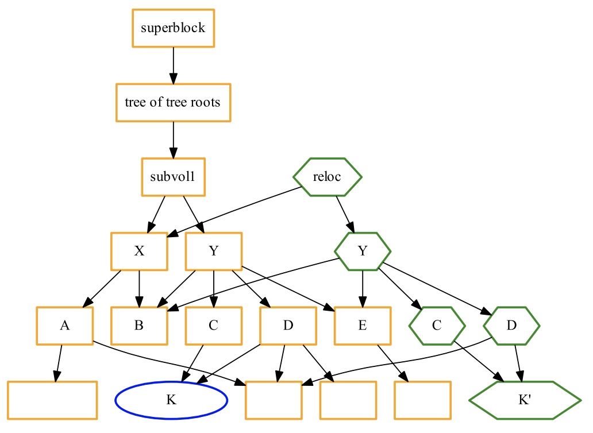

# 第 25 讲：文件系统 API（2）

> 原始讲义：[sources/notes/lect25.md](../../sources/notes/lect25.md)  
> 前一讲：[文件系统 API（1）](24-filesystem-api-1.md)  
> 后一讲：[文件系统实现](26-filesystem-implementation.md)  
> 本讲关键词：inotify、watchdog、eBPF、snapshot、Git object DAG、rebase、worktree、copy-on-write、OverlayFS、whiteout、Docker layer、FUSE、symlink

> **实验边界**：本章的必做实验只修改新建的临时目录。不要在自己的项目里照抄 `reset --hard`，不要向真实块设备写数据，也不要为一次课堂观察临时开放 `/dev/fuse`、Docker socket 或 BPF 特权。OverlayFS、BPF 和 FUSE 的可用性取决于 kernel、namespace、capability 与容器策略；探测失败本身就是要解释的系统事实。

## 0. 本讲定位：目录树不只支持 CRUD

上一讲把块设备上的字节序列包装成面向人的目录树，并逐步得到：

```text
mount/umount             把多棵树接入统一 namespace
mkdir/rmdir/getdents     管理目录
link/symlink             让名字引用对象或跳转到另一路径
mode/xattr/ACL           给对象增加属性与访问策略
```

这些 API 都像对数据结构做“一小步”修改。
但把文件系统看成 Abstract Data Type 后，应用自然会要求更大的操作：

- **监控**：树一改变就通知我，而不是反复扫描；
- **快照**：保留某一时刻的整棵树，并在多个历史间切换；
- **覆盖**：把几棵树拼成一个视图，修改只落到可写层；
- **自定义**：让数据库、网络服务或状态机直接实现为目录树。

本讲依次推导这四种能力。
下一讲再反向追问：这些看似简单的对象和操作怎样落到 block read/write、cache、inode、bitmap 和多位置更新；突然断电时，哪一个版本才算真正持久？

## 1. 学习目标与问题地图

学完本讲，你应该能够：

- 从“遍历并比较 mtime”的成本推导事件通知 API；
- 使用 inotify fd、watch descriptor、mask、name 与 rename cookie 解释事件流；
- 说明事件合并、queue overflow、递归 watch race 和 rename race 为什么使 inotify 不适合作审计日志；
- 区分 watchdog 的 native `Observer` 与 `PollingObserver`；
- 解释 strace、inotify、kernel tracepoint/eBPF 各观察哪一层，以及 Block I/O trace 看不到什么；
- 把 Git 还原为 immutable content objects、commit DAG、mutable refs、index 与 working tree；
- 区分 merge、rebase、fast-forward，并解释 replay 后 object ID 为什么改变；
- 说明 worktree 共享哪些 repository state、隔离哪些 per-worktree state；
- 用 copy-on-write 解释 Btrfs snapshot 的共享、首次修改代价、一致性边界与“快照不是备份”；
- 精确画出 OverlayFS 的 `lower/upper/work/merged`，解释 lookup、copy-up、whiteout 与 opaque directory；
- 说明 Docker image layers、container writable layer 与 volume 的不同故障和安全边界；
- 追踪一次 FUSE lookup/read 从应用进入 kernel、再到用户态 daemon 并返回的路径；
- 解释符号链接如何把树变成图，以及 path traversal/race 的安全问题。

本章严格沿 PPT 原顺序推进：监控（§3–§9）→ 快照（§10–§14）→ 覆盖（§15–§18）→ 终极虚拟化（§19–§21）。

## 2. Review & Comments

### 2.1 文件系统 API：已经有的只是最小指令集

前一讲的目录树操作可以归成：

| 类别 | 代表 API | 改变的状态 |
| --- | --- | --- |
| 挂载 | `mount`, `umount` | mount namespace 中的树连接关系 |
| 目录 CRUD | `mkdirat`, `unlinkat`, `getdents64` | name → object 映射 |
| 链接 | `linkat`, `symlinkat`, `readlinkat` | hard-link edge 或 path hint |
| 元数据 | `chmod`, `setxattr`, ACL API | mode、标签、访问规则 |

每个系统调用只更新有限局部，这使 kernel interface 可组合，也让并发与错误边界相对清楚。
但应用若只拿到这些原语，就必须自己实现“某棵子树变了吗”“保存历史版本”“把两棵树叠起来”等整体操作。

### 2.2 真正设计文件系统 ADT 时要问什么

文件系统不必被限制为“磁盘块的漂亮名字”。
像任何数据结构一样，可以从 workload 反推操作：

```text
需要响应变化        → event stream / watch
需要时间回溯        → persistent root / snapshot
需要组合多个版本    → union view / overlay
需要暴露任意数据    → programmable filesystem / FUSE
```

每加一个操作，都要重新声明：观察点、原子性、并发、失败、持久化和权限。
本章最重要的训练正是：不要只看到“命令成功了”，而要问 API 到底承诺了什么。

## 3. “监控” 的需求

### 3.1 为什么应用想在树改变后得到通知

常见需求包括：

- Web server/debug mode 在 source 或 template 改变后 reload；
- bundler/compiler 只重建受影响目标；
- desktop indexer、thumbnailer 与同步软件更新 cache；
- config manager 检测配置替换；
- backup 工具缩小增量扫描范围；
- IDE、language server 和 test runner 立即反馈。

最朴素做法是给每个 pathname 记录 `(mtime, size, inode, ...)`，稍后重新遍历并 diff。
PPT 的 shell 直觉可以补全为：

```bash
shopt -s globstar nullglob
diff \
  <(stat -c '%n %y' -- ** 2>/dev/null) \
  <(sleep 2; date > a.txt; stat -c '%n %y' -- ** 2>/dev/null)
```

这适合小型演示，却不是可靠协议：

- 每轮至少要枚举并 `stat` 大量对象，百万文件就是百万级工作；
- 文件可能在两次扫描间创建又删除，最终状态相同而事件已发生；
- 相同 timestamp resolution、clock/metadata 语义与 concurrent rename 会制造歧义；
- filename 可含换行，文本 `diff` 不是健壮的记录编码；
- scan 本身没有原子快照，前半棵树与后半棵树可能来自不同时刻。

### 3.2 状态查询与事件通知不是同一个问题

`stat/getdents` 回答“现在是什么”；watch 回答“内核观察到哪些变化”。
两者应组合，而不是相互替代：

```text
初始 scan 建立权威 cache
       ↓
订阅 event stream，增量更新 cache
       ↓
发现 overflow/不确定性
       ↓
重新 scan 并对账
```

事件 API 的性能优势来自把记录动作放到原本就要执行的修改路径上，而不是后台神奇地知道整棵树。
代价是 kernel queue、watch state 和应用处理逻辑；递归目录通常还需每个子目录一个 watch。

## 4. 实现文件系统监控

### 4.1 inotify 的最小对象模型

Linux inotify 先创建一个可读 fd，再把 pathname 与 mask 注册到该 instance：

```c
int fd = inotify_init1(IN_NONBLOCK | IN_CLOEXEC);
int wd = inotify_add_watch(fd, pathname,
                           IN_CREATE | IN_DELETE | IN_MODIFY |
                           IN_MOVED_FROM | IN_MOVED_TO);
```

文件系统变化后，`read(fd, buffer, size)` 返回一串变长记录：

```c
struct inotify_event {
  int      wd;       /* 哪个 watch */
  uint32_t mask;     /* 发生了什么 */
  uint32_t cookie;   /* 配对 rename 的关联值 */
  uint32_t len;      /* name 区域长度 */
  char     name[];   /* watched directory 内的相对名字 */
};
```

因为它是 fd，应用可以用 blocking `read`，也可设 nonblocking 后放进 `poll/epoll`，和 socket、timerfd、signal fd 一起进入 event loop。
watch descriptor 只在一个 inotify instance 内有意义，不是 inode number，也不是永久稳定 ID。

### 4.2 rename、递归和对象生命周期

同一被监控范围内的 rename 通常产生 `IN_MOVED_FROM` 与 `IN_MOVED_TO`，两条记录的非零 `cookie` 相同。
应用不能只按紧邻两条事件配对：中间可能夹入其他事件，跨目录 watch 也可能让处理时机不同。

inotify **不会自动递归**。
监控目录只得到它的直接 children 事件；发现新子目录后，需要 `add_watch`，但“目录创建”与“watch 安装”之间已经可能产生文件。
稳健程序要扫描新目录并与随后读到的事件对账。

watch 还会遇到：

- watched object 被删除、移动或 filesystem unmount；
- hard link 让同一 inode 有多个 pathname；
- pathname 在应用处理事件前已再次 rename/delete；
- watch descriptor 被移除后未来可能重用。

事件携带的是观察线索，不是可以永远重新打开对象的 capability。

### 4.3 三个不能忽略的正确性边界

**事件会合并。** 若两条尚未读取的连续事件具有相同 `wd/mask/cookie/name`，kernel 可把它们合成一条；因此不能用 inotify 精确计数写次数。

**队列会溢出。** producer 快于 consumer 时会产生 `IN_Q_OVERFLOW`，其间事件已经丢失；唯一一般性恢复是把相关 cache 标为未知并 rescan/reconcile。

**建立 watch 有 race。** 先 scan 再 watch 会漏掉中间变化；先 watch 再 scan，则必须缓冲并重放 scan 期间事件。递归树还会反复遇到新目录窗口。

[inotify(7)](https://man7.org/linux/man-pages/man7/inotify.7.html)明确记录 event coalescing、queue overflow、非递归和新子目录 race。
所以它适合 cache invalidation/reload 等可恢复策略，不是天然的 exactly-once change log。

## 5. 实验 1：不用额外包观察 inotify 的真实事件

本环境没有 `inotifywait`，也没有 Python `watchdog`。
下面的程序只用 Python 标准库 `ctypes` 调 Linux libc，并在自动清理的临时目录中操作；可直接复制到 shell 执行：

```bash
python3 - <<'PY'
import ctypes
import os
import struct
import tempfile

libc = ctypes.CDLL(None, use_errno=True)
libc.inotify_init1.argtypes = [ctypes.c_int]
libc.inotify_init1.restype = ctypes.c_int
libc.inotify_add_watch.argtypes = [ctypes.c_int, ctypes.c_char_p,
                                    ctypes.c_uint32]
libc.inotify_add_watch.restype = ctypes.c_int

IN_MODIFY     = 0x00000002
IN_CLOSE_WRITE= 0x00000008
IN_MOVED_FROM = 0x00000040
IN_MOVED_TO   = 0x00000080
IN_CREATE     = 0x00000100
IN_DELETE     = 0x00000200
IN_ISDIR      = 0x40000000
MASK = (IN_MODIFY | IN_CLOSE_WRITE | IN_MOVED_FROM | IN_MOVED_TO |
        IN_CREATE | IN_DELETE)
NAMES = [(IN_MODIFY, "MODIFY"), (IN_CLOSE_WRITE, "CLOSE_WRITE"),
         (IN_MOVED_FROM, "MOVED_FROM"), (IN_MOVED_TO, "MOVED_TO"),
         (IN_CREATE, "CREATE"), (IN_DELETE, "DELETE"),
         (IN_ISDIR, "ISDIR")]

def checked(value, operation):
    if value < 0:
        error = ctypes.get_errno()
        raise OSError(error, f"{operation}: {os.strerror(error)}")
    return value

def drain(fd):
    events = []
    while True:
        try:
            data = os.read(fd, 65536)
        except BlockingIOError:
            break
        offset = 0
        while offset < len(data):
            wd, mask, cookie, length = struct.unpack_from("iIII", data,
                                                           offset)
            offset += 16
            raw_name = data[offset:offset + length]
            offset += length
            name = raw_name.split(b"\0", 1)[0].decode(errors="replace")
            labels = "|".join(label for bit, label in NAMES if mask & bit)
            events.append((wd, labels, cookie, name))
    return events

with tempfile.TemporaryDirectory(prefix="lect25-inotify-") as root:
    fd = checked(libc.inotify_init1(os.O_NONBLOCK | os.O_CLOEXEC),
                 "inotify_init1")
    try:
        checked(libc.inotify_add_watch(fd, os.fsencode(root), MASK),
                "inotify_add_watch")

        draft = os.path.join(root, "draft.txt")
        with open(draft, "w", encoding="utf-8") as output:
            output.write("v1\n")
        print("create:", drain(fd))

        handle = os.open(draft, os.O_WRONLY | os.O_APPEND)
        try:
            os.write(handle, b"a")
            os.write(handle, b"b")
        finally:
            os.close(handle)
        print("two writes before read:", drain(fd))

        final = os.path.join(root, "final.txt")
        os.rename(draft, final)
        print("rename:", drain(fd))

        child = os.path.join(root, "child")
        os.mkdir(child)
        with open(os.path.join(child, "invisible.txt"), "w",
                  encoding="utf-8") as output:
            output.write("not recursively watched\n")
        print("new subtree:", drain(fd))

        os.unlink(final)
        print("delete:", drain(fd))
    finally:
        os.close(fd)
PY
```

一次实测的关键输出是：

```text
create: [(1, 'CREATE', 0, 'draft.txt'),
         (1, 'MODIFY', 0, 'draft.txt'),
         (1, 'CLOSE_WRITE', 0, 'draft.txt')]
two writes before read: [(1, 'MODIFY', 0, 'draft.txt'),
                         (1, 'CLOSE_WRITE', 0, 'draft.txt')]
rename: [(1, 'MOVED_FROM', 9500325, 'draft.txt'),
         (1, 'MOVED_TO',   9500325, 'final.txt')]
new subtree: [(1, 'CREATE|ISDIR', 0, 'child')]
delete: [(1, 'DELETE', 0, 'final.txt')]
```

数值 `wd/cookie` 每次可能不同。
两次 `write` 在读取前合成一条 `MODIFY`；rename 两端 cookie 相同；父目录只报告新建 `child`，没有报告其内部 `invisible.txt`，直接验证了非递归语义。

系统调用路径是：`inotify_init1 → inotify_add_watch → open/write/rename/unlink → read(inotify_fd)`。
若 sandbox 允许 ptrace，可在 `python3` 命令前加 `strace -f -e trace=inotify_init1,inotify_add_watch,read,write,rename,unlink`；若返回 `Operation not permitted`，应尊重容器策略，而不是提升权限绕过。

非 Linux 或 inotify 被禁用时，可以退回 polling snapshot：

```python
from pathlib import Path
import time

def snapshot(root):
    result = {}
    for path in root.rglob("*"):
        try:
            info = path.stat()
        except FileNotFoundError:       # scan 期间被删除
            continue
        result[str(path)] = (info.st_ino, info.st_size, info.st_mtime_ns)
    return result

root = Path("/tmp/watch-me")
root.mkdir(exist_ok=True)
old = snapshot(root)
while True:
    time.sleep(0.5)
    new = snapshot(root)
    print("created", sorted(new.keys() - old.keys()))
    print("removed", sorted(old.keys() - new.keys()))
    print("changed", sorted(k for k in new.keys() & old.keys()
                             if new[k] != old[k]))
    old = new
```

它可移植，却仍会漏掉 0.5 秒内创建又删除的对象，并每轮执行 O(n) traversal/stat；这正是 native event backend 的价值。

## 6. [watchdog](/OS/demos/persistence/watchdog)

[课堂 watchdog 演示](https://jyywiki.cn/OS/demos/persistence/watchdog)使用 Python [watchdog 项目](https://github.com/gorakhargosh/watchdog)把不同平台的文件事件 API 包装成统一 handler：

```python
observer = Observer()          # Linux 通常选择 inotify backend
# observer = PollingObserver() # 明确选择扫描 + 对比
observer.schedule(handler, ".", recursive=True)
observer.start()
```

`recursive=True` 是 library 帮应用维护整棵 watch set，不是 kernel 的一个递归 bit。
用 `strace` 对比两种 observer，通常会看到：

```text
Observer:        inotify_init1/inotify_add_watch + poll/read
PollingObserver: 周期性 getdents64/newfstatat/readlink ...
```

真正的 reload 策略还应处理 editor 的保存模式。
许多编辑器不是原地写目标，而是“写临时文件 → fsync → rename 覆盖”；只监听 `MODIFY` 会漏掉或重复 reload，应同时理解 create/move/close-write，并做短时间 debounce/coalesce。

环境探测无需安装任何包：

```bash
python3 -c 'import importlib.util; print(importlib.util.find_spec("watchdog"))'
command -v inotifywait || printf 'inotify-tools is not installed\n'
```

缺包时使用实验 1 或 polling fallback 即可；不要为了教程向系统 Python 或生产环境全局 `pip install` 未固定版本的依赖。

## 7. 实现文件系统监控 (cont’d)

### 7.1 从不同观察点提取 kernel 执行信息

PPT 说“任何监控都是可以实现的”，要理解为一种设计方法，而非无限可见性保证：选择事件发生的层，在该层插入受控观察点。

| 工具/机制 | 观察点 | 擅长回答 | 主要边界 |
| --- | --- | --- | --- |
| `strace` | 某进程 syscall boundary | 谁调用了 `open/write/fsync` | ptrace 权限、只见被跟踪 task、observer overhead |
| `ltrace` | dynamic library call | 调了哪些动态符号 | static/inlined/直接 syscall 看不到，interposition 有局限 |
| inotify | VFS/filesystem notification | watched objects 出现哪些 change event | 合并、溢出、无 actor identity、非递归 |
| tracefs/tracepoint | kernel 预定义 event | scheduler/block/network 等内部阶段 | 字段依 kernel ABI，buffer 也可能丢事件 |
| eBPF tracing | tracepoint/kprobe/fentry 等 attach point | 可编程过滤、聚合、关联 | verifier、capability、attach 稳定性、成本 |

eBPF 有 10 个通用 64-bit register 与只读 frame pointer `r10`；`r1–r5` 传参数，`r0` 传返回值。
kernel verifier 跟踪 pointer type、bounds、initialized stack、reference 与控制流，只允许当前 program type 暴露的 helper/kfunc。
参见 [BPF ABI](https://www.kernel.org/doc/html/latest/bpf/standardization/abi.html)和[verifier 文档](https://www.kernel.org/doc/html/latest/bpf/verifier.html)。

把 eBPF 叫“in-kernel 只读 VM”适合表达安全直觉，但不够精确。
tracing program 不能任意改 kernel memory，却可通过受控 helper 更新 map、写 ring buffer、取时间/PID 等；其他 program type 还可按 verifier 允许的方式改变 packet/action。
side effect 是白名单化的，不是完全不存在。

### 7.2 稳定 tracepoint 与脆弱 kprobe

优先使用有明确 format 的 tracepoint；kprobe attach 到内部函数名/参数，kernel 升级就可能变化。
加载 BPF 往往需要 root 或细分的 `CAP_BPF`、`CAP_PERFMON` 等权限，发行版也常禁用 unprivileged BPF。

观察代码必须像生产代码一样考虑：

- ring/perf buffer overflow 后如何报告 lost samples；
- key cardinality 是否让 BPF map 爆满；
- timestamp 与 CPU ordering 能否直接比较；
- PID/TID、cgroup、mount namespace 是否正确归因；
- probe 自身是否显著改变 latency。

## 8. [打开 Linux Block I/O](/OS/demos/persistence/bio)

[课堂 Linux Block I/O 演示](https://jyywiki.cn/OS/demos/persistence/bio)的重点有两层。
机制层是在 block path 的 tracepoint 插入 probe，例如关联 request issue/complete，计算 size、latency 或进程分布；方法层则是让 Coding Agent 在自己缺乏某工具经验时，从 specification、官方 event format 和实验反馈生成程序。

不要凭记忆硬编码 tracepoint 字段。
先只读探测：

```bash
command -v bpftrace || printf 'bpftrace is not installed\n'

format=/sys/kernel/tracing/events/block/block_rq_issue/format
if test -r "$format"; then
  sed -n '1,100p' "$format"
else
  printf 'block tracepoint format is not exposed to this process\n'
fi
```

若管理员提供隔离实验机和 bpftrace 权限，再用 `bpftrace -lv 'tracepoint:block:block_rq_issue'` 核对 argument，并在 `/tmp` 生成工作负载：

```bash
dd if=/dev/zero of=/tmp/lect25-block-io.bin \
  bs=1M count=8 conv=fsync status=progress
```

这条 `dd` 只写普通临时文件；绝不能把 `of=` 换成 `/dev/sda`、`/dev/nvme...` 等真实 block device。
`conv=fsync` 让 dirty data 在命令结束前进入同步路径，但仍不保证“一次 `write` 对应一次 block request”：page cache、filesystem allocation、writeback、I/O scheduler、device mapper 与 driver 会 split/merge/reorder request。

kernel 的 `block_rq_issue` 表示 request 发给 driver，`block_rq_complete` 表示 driver 报告完成；[Linux tracepoint API](https://docs.kernel.org/core-api/tracepoint.html)给出了定义。
这与 VFS 层的 `write(2)`、更低层 device firmware 真正落入 nonvolatile media 都不是同一时刻。

课堂中的模型名和 ¥0.72 成本是一次 2026 年演示快照，不是机制的一部分。
Agent 生成 privileged tracing code 时，人工至少要 review attach point、map bound、cleanup、权限和输出解释，并在可丢弃环境验证；“能跑”不能替代 observation model。

## 9. 一些反思

### 9.1 Specification is all you need——但 specification 必须可检验

向 AI 只说“监控目录”仍太模糊。
更好的 spec 应回答：

- 监控哪些 root，是否跨 mount，是否跟随 symlink；
- 需要最终状态还是逐事件计数；
- rename 是否必须配对，能否 debounce；
- queue overflow、进程重启、目录热插入怎样 recovery；
- latency、CPU、watch 数与内存上限；
- 事件需不需要 actor UID/PID、tamper resistance 与持久保留；
- 哪些权限绝不能申请。

PPT 引用的 2026 预印本 [The Time is Here for Just-in-Time Systems](https://arxiv.org/abs/2605.24096)主张：coding agent 使根据 workload/environment/property spec 即时综合专用系统变得可行，并用 evolving tests 迭代。
它提供值得研究的方法与实验结果，不是“自然语言一句话自动得到正确系统”的定理；测试 oracle、隐藏 failure 和维护生命周期仍是系统工作。

### 9.2 机制与策略的彻底分离

inotify/eBPF 提供 **机制**：在某个 kernel 观察点把信息送出来。
应用决定 **策略**：reload、重建、告警、debounce、丢弃、重扫或拒绝服务。

同一 `IN_CLOSE_WRITE`：

- Web dev server 可合并 100 ms 内事件后 reload；
- backup indexer 可标 dirty，稍后 hash 内容；
- security monitor 不能仅凭它判断“谁恶意篡改”；
- database 不应把它当 transaction commit record。

### 9.3 Watch 不是 audit，更不是 transaction log

| 需求 | 普通 watch | audit/transaction log |
| --- | --- | --- |
| 快速触发 reload | 合适 | 通常过重 |
| 精确计数每次写 | 事件可合并，不保证 | 需专门记录协议 |
| 记录 actor identity | inotify 不提供 PID/UID | Linux Audit/应用日志可设计 |
| 抵抗 queue overflow | overflow 后 rescan | 需 durable backpressure/failure policy |
| 证明记录未篡改 | 不保证 | 需权限隔离、完整性链/远端保存 |
| 与业务 commit 原子 | 不保证 | 应进入同一 transaction/WAL 设计 |

Linux Audit 可以按 syscall/path 规则记录访问，但它也有 queue、性能、配置和多记录关联语义；不是把 `auditctl -w` 加上就自动获得完美证明。
稳健设计先声明 threat model 与丢失时策略。

## 10. 在文件系统上实现快照

### 10.1 从“一步修改”到“保留每一个根”

传统 mutable tree 原地更新：

```text
root → directory → file(version 1)
                    │ overwrite
                    ▼
                  file(version 2)
```

旧值一旦覆盖，除非另有 log/backup，就不能再从数据结构本身到达。
persistent data structure 不修改旧节点，而是创建新节点并复用未变子树：

```text
root C1 ──→ tree T1 ──→ blob A
                └─────→ blob B

root C2 ──→ tree T2 ──→ blob A      # 未变，复用
                └─────→ blob B'     # 改变，新对象
```

只要保存 `C1/C2` 两个 root，就能在两个历史间 random read。
“append-only new objects + mutable root pointers”因此足以表达复杂持久结构；快照成本与变化量相关，而不是每次复制所有 byte。

### 10.2 Git 就是一棵 snapshot tree 加一张 commit DAG

PPT 把 Git 识别为持久化数据结构，这比“版本控制命令集合”更接近本质。
Git 核心对象有：

| 对象 | 内容 | 指向什么 |
| --- | --- | --- |
| blob | 一段 file content | 不含 filename |
| tree | mode、name、object ID 条目 | blob 或 subtree |
| commit | top-level tree、parent(s)、作者/时间、message | tree 与 0/1/多个 parent commits |
| annotated tag | tag metadata | 任意 object，常为 commit |

loose object 的逻辑输入是：

```text
<type> SP <decimal-size> NUL <content>
```

例如 blob 是 `blob 5\0hello`；object ID 对这整个序列计算 hash，而不是直接 `sha1sum file`。
传统 repository 用 SHA-1，Git 也支持以 SHA-256 初始化的 repository，所以现代解释应说 object ID，而不是假设永远 40 个十六进制字符。

PPT 将 tree 简写成 `[mode] [filename]\0[hash]\n...`，真实 loose tree content 是 binary records：`mode SP name NUL raw-object-id`，object ID 不是十六进制文本，也没有用 newline 分隔每条 entry。
commit content 则是文本 header：

```text
tree <object-id>
parent <object-id>       # root commit 没有；merge 可有多个
author ...
committer ...

commit message
```

loose objects 经 zlib 压缩，路径常按 object ID 前两位分目录；`git gc` 可把对象移入 packfile 并做 delta compression。
[Git Objects](https://git-scm.com/book/en/v2/Git-Internals-Git-Objects)给出了 header、tree、commit 和 object storage 的完整推导。

### 10.3 “Git 是 append-only”需要限定层次

content-addressed objects 一旦命名，其内容不可原地改变；新 snapshot 创建新 object，并复用旧 object。
但 repository 整体并不只追加：

- `refs/heads/main` 会前移、回退或删除；
- `HEAD`、index、config、worktree 会修改；
- reflog 有保留期限；
- repack 会重写物理布局；
- unreachable objects 最终可被 prune/gc。

所以持久性的关键是 **旧 object 是否仍 reachable**。
branch/tag/ref 与 reflog 是 roots；失去所有 root 后，对象可能暂时仍在 disk，却不保证永远保留。

`git reset --hard` 会把 index/working tree 改到目标 commit，未提交且未 stash 的 tracked 修改可永久丢失；它通常不会立即删除旧 commit object，旧 ref value 也可能还在 reflog，但这不是无限期 backup。
恢复前应停止继续产生垃圾回收压力，检查 `git reflog`、`git fsck` 与备份，而不是承诺“只要没手动 gc 就一定能恢复”。

### 10.4 Git snapshot 捕获的是 index，不是正在变化的目录

必须区分四层：

| 层 | 例子 | 是否进入下一 commit |
| --- | --- | --- |
| working tree | editor 正在改的 bytes | 不一定 |
| index/staging area | `git add` 选择的 snapshot | **是，commit 从这里造 tree** |
| object database | immutable blob/tree/commit/tag | 已持久化的内容对象 |
| refs/HEAD/reflog | 指向 commit 的 roots 与移动历史 | 决定可达历史 |

`git commit` 并不会冻结所有进程，再原子扫描 working tree。
并发 editor/build process 可在 `git add` 前后继续修改；commit 只忠实保存 index 当时的条目。
Git tree 也不是完整 POSIX filesystem snapshot：它保存有限 mode（普通/可执行、symlink、submodule 等）和 content/name，不保存任意 ACL、xattr、owner、所有 timestamp 或 open-file state。

## 11. Git: 数据结构操作

### 11.1 branch、HEAD 与一次 commit 的真实步骤

branch 是一个 named ref，概念上 `refs/heads/new` 存某个 commit ID。
ref 可能是 loose file，也可能在 `packed-refs`，程序不应直接改文件；应使用 `git update-ref` 等 plumbing，以获得 lock、compare-and-swap 与 reflog 语义。

一次普通提交近似：

```text
working tree --git add--> index
index --write-tree------> blob/tree objects
tree + parent + metadata -> commit object
lock + update refs/heads/current
append reflog
```

如果最后的 ref update 失败，object 可能已生成但暂时 unreachable；content-addressing 让重试/回收相对简单。

`HEAD` 通常是 symbolic ref：

```text
.git/HEAD: ref: refs/heads/main
```

detached HEAD 则直接记录 commit ID。
PPT 设想一个 `TAIL` 指针用于 `git diff HEAD TAIL`；安全实现不是随手写 `.git/TAIL`，而是创建命名 ref：

```bash
git update-ref refs/tails/demo HEAD~1
git diff refs/tails/demo HEAD
```

### 11.2 Stash 也是 commit，但 PPT 的 parent 解释要校正

最新 stash 由 `refs/stash` 指向，旧 stash 主要通过该 ref 的 **reflog** 形成 `stash@{1}`、`stash@{2}`。
典型 stash 是 merge-shaped commit：第一 parent 是原 `HEAD`，第二 parent 保存 index state；包含 untracked/ignored 时还可能有第三 parent。

因此“stash 有两个 parent：HEAD 和 next stash”并不准确；**next/older stash 不是第二 parent，而是 `refs/stash` 的旧 reflog value**。
可在临时 repository 验证：

```bash
git stash push -m demo
git cat-file -p refs/stash
git reflog show refs/stash
```

详见 [git-stash](https://git-scm.com/docs/git-stash) 与 [repository layout](https://git-scm.com/docs/gitrepository-layout)。

### 11.3 实验 2：构造并拆开一个 Git object graph

整个实验在 `mktemp` 新目录完成，trap 只删除已知前缀的临时 repository：

```bash
set -eu
repo=$(mktemp -d /tmp/lect25-git.XXXXXX) || exit 1
case "$repo" in /tmp/lect25-git.*) [ -d "$repo" ] || exit 1 ;; *) exit 1 ;; esac
linked=${repo}.worktree
cleanup() {
  git -C "$repo" worktree remove --force "$linked" >/dev/null 2>&1 || true
  rm -rf -- "$repo" "$linked"
}
trap cleanup EXIT

git -C "$repo" init -q -b main
git -C "$repo" config user.name 'Lecture 25'
git -C "$repo" config user.email 'lect25@example.invalid'

printf 'base\n' > "$repo/shared.txt"
git -C "$repo" add shared.txt
git -C "$repo" commit -qm 'base snapshot'
base=$(git -C "$repo" rev-parse HEAD)

git -C "$repo" switch -qc feature
printf 'feature\n' > "$repo/feature.txt"
git -C "$repo" add feature.txt
git -C "$repo" commit -qm 'feature snapshot'
feature=$(git -C "$repo" rev-parse HEAD)

git -C "$repo" switch -q main
printf 'main\n' > "$repo/main.txt"
git -C "$repo" add main.txt
git -C "$repo" commit -qm 'main snapshot'
main=$(git -C "$repo" rev-parse HEAD)

git -C "$repo" log --graph --decorate --oneline --all
printf 'HEAD file: '; sed -n '1p' "$repo/.git/HEAD"

printf '\ncommit object:\n'
git -C "$repo" cat-file -p "$main"
tree=$(git -C "$repo" rev-parse "$main^{tree}")
printf '\ntree object:\n'
git -C "$repo" cat-file -p "$tree"
blob=$(git -C "$repo" rev-parse "$main:shared.txt")
printf '\nblob type/content: '
git -C "$repo" cat-file -t "$blob"
git -C "$repo" cat-file -p "$blob"

printf 'staged\n' >> "$repo/shared.txt"
git -C "$repo" add shared.txt
printf 'unstaged\n' >> "$repo/shared.txt"
printf '\nindex diff:   '; git -C "$repo" diff --cached --numstat
printf 'worktree diff:'; git -C "$repo" diff --numstat

git -C "$repo" update-ref refs/tails/demo "$base"
printf '\nTAIL-like ref versus HEAD:\n'
git -C "$repo" diff --stat refs/tails/demo HEAD

git -C "$repo" worktree add -q "$linked" feature
printf '\nlinked .git: '; sed -n '1p' "$linked/.git"
printf 'linked branch: '; git -C "$linked" branch --show-current
printf 'common dir: '; git -C "$linked" rev-parse --git-common-dir
```

一次实测的结构输出如下；短 hash 每次受 author time 等 metadata 影响，不应硬编码：

```text
* f012e94 (feature) feature snapshot
| * 26af369 (HEAD -> main) main snapshot
|/
* b6c1ee2 base snapshot

HEAD file: ref: refs/heads/main

tree object:
100644 blob ...  main.txt
100644 blob ...  shared.txt

blob type/content: blob
base

index diff:   1  0  shared.txt
worktree diff:1  0  shared.txt

TAIL-like ref versus HEAD:
 main.txt | 1 +
```

同一个 `shared.txt` 同时有三个版本：HEAD 的 `base`、index 的 `base+staged`、working tree 的 `base+staged+unstaged`。
`git cat-file`沿 commit → tree → blob 读取 object graph；`git diff --cached` 比 HEAD 与 index，普通 `git diff` 比 index 与 working tree。

linked worktree 的 `.git` 是一行 `gitdir: .../.git/worktrees/...` 指针；`--git-common-dir` 又指回主 repository 的 object/ref storage。
若环境允许 ptrace，可只对这个临时 repo 执行 `strace -f -e trace=openat,write,fsync,rename git -C "$repo" commit ...`，观察 lock/temp/ref rename；具体 fsync 次数受 Git 配置与版本影响，不能由“commit 返回”一词猜测。

## 12. 处理分叉的 Commits

### 12.1 从 common ancestor 推导三种操作

设历史分叉为：

```text
             A ── B        local tip
            /
CA ─────────
            \
             C ── D        other tip
```

**Merge** 计算 B 与 D 相对于 common ancestor CA 的变化，产生新 snapshot E，并让 E 有两个 parents：

```text
             A ── B ── E
            /         /
CA ────────          /
            \       /
             C ── D
```

merge 保留真实分叉与两条原 commit identity；冲突解决结果进入 E 的 tree。

**Rebase** 取 A、B 引入的变化，在 D 上依次 replay，得到 A'、B'：

```text
CA ── C ── D ── A' ── B'
```

即使 patch 内容相同，parent、committer time 等 commit content 已变，A'/B' 的 object ID 必然与 A/B 不同。
概念上类似：

```bash
git switch --detach D
git cherry-pick A
git cherry-pick B
```

PPT 用 `reset --hard D` 再 cherry-pick 解释 replay；只应在可丢弃分支/临时 repository 这样做。
日常使用 `git rebase --onto D CA branch`，冲突时 review 后 `--continue`，判断方向错误则 `--abort`；不是一遇冲突就只能放弃，也不能把“没有文本冲突”当逻辑正确。

**Fast-forward** 不产生新 commit：只有当前 tip 是目标 tip 的 ancestor 时，ref 才能直接前移。
这比“本地没有 A/B”更精确；判定可以用：

```bash
git merge-base --is-ancestor HEAD other-tip
```

### 12.2 为什么 rebase 危险，但不是禁用功能

危险来自改写 identity 与共享协议：其他人若已基于 A/B 工作，published branch 被替换为 A'/B' 后会形成重复/丢失误解。
比较安全的原则是：

- 只 rebase 自己尚未共享的 local commits；
- 对已发布 history 明确协商，push 时优先 `--force-with-lease` 而非裸 `--force`；
- replay 后重新 review diff、build、test，因为 semantic conflict 不一定产生 conflict marker；
- merge/rebase 前保留 named ref 或确认 reflog recovery window。

Git 更新 ref 时使用 lock/expected-old-value 避免两个 writer 静默覆盖，但一个 working tree、一个 index、一个 HEAD 仍不适合两个独立任务随意切 branch 和 stage。

## 13. 历史总在重演

### 13.1 单工作区为何像“单线程状态机”

经典 Git workflow 有一份 mutable working tree、index 与 HEAD：

```text
checkout/switch → 改 working tree/HEAD
git add         → 改 index
commit          → 写 objects 并移动当前 ref
stash           → 保存 WIP，再改 index/working tree
```

紧急切 feature 时反复 stash，本质是多个逻辑任务抢一个 mutable execution context。
这类似从单进程走向多线程：immutable commit graph 可共享，mutable checkout state 必须分开。

### 13.2 Worktree：共享 repository，分离 checkout state

Git 2.5 起的 linked worktree 允许：

```bash
git worktree add ../experiment experiment
cat ../experiment/.git
git -C ../experiment rev-parse --git-common-dir
```

每个 worktree 有自己的 working directory、index 与 HEAD/per-worktree administrative state；它们共享 objects、most refs、config 和 hooks 等 common repository state。
同一 local branch 默认不能同时 checkout 到两个 worktrees，避免两份 working tree 对一个 branch tip 作互相不知情的更新。

[git-worktree](https://git-scm.com/docs/git-worktree)与[repository layout](https://git-scm.com/docs/gitrepository-layout)解释 `.git` gitfile、`commondir` 和 `.git/worktrees/*`。

### 13.3 Agent swarm 的价值与边界

不同 sub-agent 在不同 clean worktree/branch 提交，主 agent review 后 merge，能减少共享 working tree 的 accidental overwrite。
但 worktree 是并发组织工具，不是 security sandbox：

- agents 仍共享 object database 与 refs namespace；
- hooks/config/credentials 可能共享；
- 一个 agent 可创建大量 objects、改其他未保护 ref；
- build output 若写到 repository 外的共同路径仍会冲突；
- merge 后仍需 integration tests 与 human/agent review。

因此好的 swarm 协议还需要 branch ownership、路径范围、commit boundary、测试和合并者，而不是只运行一次 `git worktree add`。

## 14. 文件系统级的快照

### 14.1 从 Git object CoW 到 Btrfs extent CoW

既然 persistent tree 能管理 source snapshot，也可以让 filesystem 自己的 metadata tree 成为 persistent data structure。
Btrfs subvolume 是独立 file/directory hierarchy；snapshot 是带初始内容的新 subvolume。



PPT 展示 `BTRFS_IOC_SNAP_CREATE`；现代 UAPI 还定义 `BTRFS_IOC_SNAP_CREATE_V2`，用户通常通过：

```bash
btrfs subvolume snapshot -r source-subvolume destination-snapshot
```

创建 snapshot 时不复制所有 file data，而是让新 root 共享既有 tree blocks/file extents 并增加引用。
之后任一方修改某个 extent/path，Btrfs 分配新 blocks 并沿修改路径 copy-on-write，旧 root 继续看到旧版本。
[Btrfs design](https://btrfs.readthedocs.io/en/stable/dev/dev-btrfs-design.html)描述 root block sharing 与 reference-counted extents。

### 14.2 快照的成本没有消失，只是推迟并局部化

| 时刻 | 主要成本 |
| --- | --- |
| 创建 snapshot | 新 root/subvolume metadata，通常与数据总量近似解耦 |
| 首次修改 shared extent | allocate + copy/redirect + metadata CoW |
| 长期保留 snapshot | 旧 extents 不能回收，占用空间 |
| 大量 random overwrite | fragmentation、metadata 与 write amplification |
| 删除 snapshot | namespace 很快消失，后台 extent cleanup 可能很久 |

小写入也不保证只复制那几个 byte；extent size、compression、reflink、metacopy/allocator 策略会决定实际放大。
空间接近耗尽时，snapshot pin 住旧 extents 还会让写入与 metadata allocation 更困难。

### 14.3 “同一时刻”必须说明一致性层

filesystem snapshot 给出 filesystem transaction/namespace 层的一致 root，但它不会把应用 RAM 自动纳入：

- editor/database 尚未 `write` 的用户内存不在 snapshot；
- page cache dirty data、`fsync` 与 snapshot transaction 的先后需按具体 filesystem/tool 理解；
- database 可能需要 checkpoint/quiesce 才得到 application-consistent image；
- 多个 filesystem/subvolume 之间不自动形成 distributed atomic snapshot；
- Btrfs nested subvolume 不随 parent snapshot 递归复制，只留下 boundary/stub。

创建后立刻可见，与突然断电后一定存在也是不同合同；durability 正是下一讲要处理的主题。

### 14.4 快照不是备份

Btrfs 官方文档明确提醒：snapshot 与 source 初始共享同一 data blocks 和 storage failure domain；坏 sector、控制器故障、误写 raw disk 或整盘丢失可同时破坏两者。
真正 backup 需要独立故障域、保留/验证策略，常配合 read-only snapshots 与 send/receive。
详见 [btrfs-subvolume](https://btrfs.readthedocs.io/en/latest/btrfs-subvolume.html)。

只做无副作用探测：

```bash
findmnt -no TARGET,FSTYPE,OPTIONS -T .
command -v btrfs || printf 'btrfs userspace tools are not installed\n'
```

只有在管理员准备好的 Btrfs scratch filesystem、确认 source 是 subvolume 且空间/权限允许时才创建 snapshot；不要把生产 `/` 当课堂实验。

### 14.5 Git snapshot 与 filesystem snapshot 不可互换

| 维度 | Git commit | Btrfs snapshot |
| --- | --- | --- |
| 捕获源 | index | subvolume/filesystem state |
| 数据范围 | Git 可表示的 tracked tree | subvolume 内 filesystem objects |
| root | commit → tree | Btrfs subvolume root |
| sharing | content objects/pack | tree blocks 与 file extents |
| 应用一致性 | developer 选择/stage | 仍需应用 checkpoint/quiesce |
| 历史语义 | parent DAG、author/message/refs | parent UUID/generation 等 FS metadata |
| backup | push/clone 也需验证与多副本 | snapshot 本身不是 backup |

它们共享 persistent data structure 的思想，却服务不同抽象层。

## 15. 目录的“拼凑”

### 15.1 一个目录视图可以来自多棵实体树

设有一个只读基础目录 `lower/` 与一个可写差异目录 `upper/`：

```text
lower/                  upper/                 merged/
├── bin/tool            ├── etc/config         ├── bin/tool       (lower)
├── etc/config    +     └── home/new.txt   →   ├── etc/config     (upper wins)
└── lib/runtime                                 ├── home/new.txt   (upper)
                                               └── lib/runtime    (lower)
```

lookup 规则看似简单：先找 upper，找不到再按优先级找 lower；同名非目录由高层隐藏低层，同名目录则合并 children。
所有新写入进入 upper，于是很多 merged views 可共享一个 immutable lower。

这不是复制目录，而是虚拟化 name resolution。
与 virtual memory page table、Git root pointer 一样，应用看到的地址/路径与实际存放位置被分开。

### 15.2 Killer application 1：共享只读介质，不同局部定制

PPT 的光盘刻录例子有 16 个 writer：共同 lower 是待刻录内容，每个 upper 只覆盖不同的 CD key/`verify-key.exe`。
不需要完整复制 16 份基础树，差异量小就能显著节省空间和 I/O。

这个模型也适合：

- 多个学生共享只读课程镜像，各有私有作业层；
- 网吧/考试机共享基础系统，每次会话拥有可丢弃 upper；
- immutable OS image 上叠加机器本地配置。

### 15.3 Killer application 2：试升级与回滚

把 root filesystem 当 lower，把 upgrade 的所有写入导向 upper：

- 试运行成功，可把差异转成新 image/layer；
- 失败则丢弃 upper，重新得到旧 lower view；
- 多个试验可各用一个 upper，互不覆盖基础树。

但“成功后直接 `rsync` 就 commit”只是课堂直觉。
真实 commit 还要保留 deletion/whiteout、xattr、hard link、owner/mode、device node、sparse extent 与 atomic switch；运行中的服务也可能处在应用不一致状态。
overlay 提供隔离修改的机制，不自动证明升级可安全持久化。

## 16. OverlayFS (“UnionFS”, 联合挂载)

### 16.1 四个目录的职责

Linux OverlayFS 的经典可写挂载是：

```bash
mount -t overlay overlay \
  -o lowerdir=L1:L2:...,upperdir=U,workdir=W \
  path_to_merged
```

| 目录 | 角色 | 关键约束 |
| --- | --- | --- |
| `lowerdir` | 一个或多个只读来源 | `L1` 优先级高于 `L2`；可被多个 overlay 共享 |
| `upperdir` | 唯一可写差异层 | 必须支持 OverlayFS 所需 xattr/d_type 等能力 |
| `workdir` | 内核内部 staging/atomic work | 必须为空，并与 upper 在同一 filesystem |
| `merged` | 应用访问的联合视图 | 不应再被当作普通 backing layer 乱改 |

省略 upper/work 可以构造纯只读的多 lower overlay。
同一 upper/work 不能被多个活动 overlay mounts 共享；背后直接修改 layer 可能破坏 cache 与一致性假设。

### 16.2 Lookup 与 merged directory

对 name 查询：

1. 先看 upper；
2. 再按 `lowerdir=L1:L2:...` 从左到右找；
3. 若高层命中非目录，高层对象完全隐藏低层同名对象；
4. 若 upper/lower 都命中目录，`readdir` 合并 names，重复名仍由高层优先。

合并的主要是 directory entries；metadata/xattr、inode identity、hard link 与 export semantics 远比“把两个 `ls` 拼接”复杂。

### 16.3 Copy-up：第一次写才付复制成本

只读 lower file 可直接读取。
当 merged path 以可写方式打开、修改 metadata 或建立 hard link 等需要 upper identity 的操作发生时，OverlayFS 执行 copy-up：

```text
确保 upper parent directories 存在
  → 在 work/upper 创建临时对象
  → 复制 mode/owner/time/xattr 等 metadata
  → 普通文件复制 data（启用 metacopy 时可延迟）
  → 原子放入 upper name
  → 后续访问 upper copy
```

lower 原件不变，所以别的 overlay 仍看到旧版本。
传统 copy-up 可能为修改一个 byte 先复制整个大文件；`metacopy`、reflink 与实现优化可改变成本，但不能假设所有 backing filesystem 都支持。

### 16.4 Whiteout 与 opaque directory：如何表示“低层的东西被删了”

直接从 lower 删除会破坏共享基础层，所以 merged 中 `unlink(lower/name)` 必须在 upper 记录“隐藏这个 lower name”。
kernel OverlayFS whiteout 可表示为：

- device number `0/0` 的 character device；或
- 带 `trusted.overlay.whiteout` xattr 的零长度 regular file。

whiteout 自己不出现在 merged view；匹配的 lower name 也被隐藏。
若要整个 upper directory 不再与 lower 同名目录合并，则设置 `trusted.overlay.opaque=y`。

OCI/Docker layer tar 常用 `.wh.filename` 与 `.wh..wh..opq` 编码删除/opaque 信息；这是 **image interchange encoding**，不能与已挂载 OverlayFS upper 中的 live kernel representation 混为一谈。

### 16.5 rename 与原子性的边角

lower/merged directory rename 默认可能返回 `EXDEV`，让 `mv` 退回 recursive copy+remove；启用 `redirect_dir` 时可 copy-up directory metadata 并用 redirect xattr 记录原路径。
workdir 为 copy-up/rename 提供同 filesystem 的临时空间，使中间对象不以半完成名字暴露。

这些行为说明 union filesystem 不是简单 wrapper：它必须维护跨 layer 的 name、metadata、link、rename 与 crash invariants。
完整语义以 [Linux OverlayFS 文档](https://docs.kernel.org/filesystems/overlayfs.html)为准。

## 17. [OverlayFS](/OS/demos/persistence/overlay)

[课堂 OverlayFS 演示](https://jyywiki.cn/OS/demos/persistence/overlay)要观察三件事：upper 覆盖 lower、第一次写触发 copy-up、删除变成 whiteout。

### 17.1 实验 3A：在隔离 mount namespace 中运行真实 OverlayFS

下面不使用 `sudo`。
它先创建新的 user namespace，把当前用户映射成 namespace root，再创建独立 mount namespace；mount 不会出现在 host 的 mount table。

```bash
if ! unshare --user --map-root-user --mount true 2>/dev/null; then
  printf 'unprivileged user/mount namespace is disabled; run 3B instead\n'
else
  unshare --user --map-root-user --mount bash -s <<'INNER'
set -eu
root=$(mktemp -d /tmp/lect25-real-overlay.XXXXXX) || exit 1
case "$root" in /tmp/lect25-real-overlay.*) [ -d "$root" ] || exit 1 ;; *) exit 1 ;; esac
cleanup() {
  umount "$root/merged" >/dev/null 2>&1 || true
  rm -rf -- "$root"
}
trap cleanup EXIT

mkdir "$root/lower" "$root/upper" "$root/work" "$root/merged"
printf 'from lower\n' > "$root/lower/config.txt"
printf 'lower only\n' > "$root/lower/delete-me.txt"

mount -t overlay overlay \
  -o "lowerdir=$root/lower,upperdir=$root/upper,workdir=$root/work,userxattr" \
  "$root/merged"

printf 'visible before: '; cat "$root/merged/config.txt"
printf 'from merged\n' >> "$root/merged/config.txt"
rm "$root/merged/delete-me.txt"

printf 'merged names: '
find "$root/merged" -mindepth 1 -maxdepth 1 -printf '%f ' | sort
printf '\nlower config: '; tr '\n' ' ' < "$root/lower/config.txt"
printf '\nupper config: '; tr '\n' ' ' < "$root/upper/config.txt"
printf '\nupper entries:\n'
find "$root/upper" -mindepth 1 -maxdepth 1 -printf '%f %y\n' | sort
INNER
fi
```

本环境实测：

```text
visible before: from lower
merged names: config.txt
lower config: from lower
upper config: from lower from merged
upper entries:
config.txt f
delete-me.txt c
```

`config.txt` 首次 append 后完整出现在 upper，lower 仍只有原行；`delete-me.txt` 在 merged 消失，但 upper 中出现 type `c` 的 whiteout。
若进一步 `stat -c '%t:%T' upper/delete-me.txt`，传统表示会看到 device number `0:0`。

系统调用/状态变化是：`unshare → mount(overlay) → open/write` 触发 copy-up，`unlink` 创建 whiteout，最后 `umount` 并删除已验证的临时 root。
即使 user namespace 可创建，kernel 也可能禁止 unprivileged overlay、缺少 `userxattr` 支持或被 LSM/seccomp 拦截；遇到 `EPERM/EINVAL` 就使用模拟，不要升级为 host root。

### 17.2 实验 3B：权限不足时的目录级模型

这个纯 Python 模型不 mount、不需 capability。
它用 `.wh.name` 作为 **教学/OCI 风格 marker**；这不是声称真实 upper 会这样存 whiteout。

```bash
python3 - <<'PY'
from pathlib import Path
from shutil import copy2
from tempfile import TemporaryDirectory

with TemporaryDirectory(prefix="lect25-overlay-") as tmp:
    root = Path(tmp)
    top, base, upper = (root / "lower-top", root / "lower-base",
                        root / "upper")
    for directory in (top, base, upper):
        directory.mkdir()

    (base / "common.txt").write_text("base common\n")
    (base / "base-only.txt").write_text("base only\n")
    (base / "removed.txt").write_text("still in lower\n")
    (top / "common.txt").write_text("top common\n")
    (top / "patch-only.txt").write_text("patch only\n")
    (upper / "local.txt").write_text("upper only\n")
    lowers = [top, base]                 # leftmost/highest first

    def source(name):
        if (upper / (".wh." + name)).exists():
            return None
        if (upper / name).exists():
            return upper / name
        for lower in lowers:
            if (lower / name).exists():
                return lower / name
        return None

    def listing():
        names = {p.name for layer in [*lowers, upper]
                 for p in layer.iterdir()
                 if not p.name.startswith(".wh.")}
        hidden = {p.name[4:] for p in upper.glob(".wh.*")}
        return sorted(names - hidden)

    def show(label):
        print(label, listing())
        for name in listing():
            path = source(name)
            print(f"  {name:16} <- {path.parent.name:10} "
                  f"{path.read_text().strip()}")

    show("initial")

    old = source("base-only.txt")        # copy-up before write
    copy2(old, upper / old.name)
    with (upper / old.name).open("a") as output:
        output.write("changed in upper\n")
    show("after copy-up")
    print("lower unchanged:", (base / "base-only.txt").read_text().strip())

    (upper / ".wh.removed.txt").touch()  # simulation marker
    show("after whiteout")
    print("lower still exists:", (base / "removed.txt").exists())
PY
```

预期看到 `common.txt` 来自 higher lower，`local.txt` 来自 upper；copy-up 后 `base-only.txt` 的 source 变为 upper，而 lower content 不变；whiteout 后 `removed.txt` 从 merged listing 消失，实体 lower file 仍存在。

模拟只说明 lookup/CoW/whiteout 的最小状态机，不实现 merged directories、xattr、hard links、rename、permission 或 crash atomicity；它不能替代真正 OverlayFS compatibility test。

## 18. Docker 的多层 Overlay

### 18.1 Build layer 与运行中 writable layer

PPT 的 Dockerfile：

```dockerfile
FROM ubuntu:22.04
ENV DEBIAN_FRONTEND=noninteractive
RUN apt-get update
RUN apt-get install -y ... && apt-get upgrade -y
```

概念上，每条 build instruction 产生/描述一层；`RUN` 在当前 image root 上启动 build container，把该步骤 filesystem diff 固化为新的 immutable layer，供下一步作为 lower stack 顶部。
现代 BuildKit 会优化 cache/export，某些 metadata-only instruction 的物理表示也可能不同，但 layer DAG 与 content-addressed result 的模型仍有效。

运行 container 时：

```text
read-only image layers       → OverlayFS lower stack
per-container writable diff → upper
container root              → merged
```

多个 container 可共享 image layers，各自 upper 隔离修改。
Docker 的具体 storage driver 未必总是 kernel `overlay2`（rootless 环境可能用其他 snapshotter/fuse-overlayfs），不能从“container”一词断言 host 物理布局。

### 18.2 Copy-up 与删除的两个重要后果

修改 lower 中大文件会先 copy-up，带来 first-write latency 与空间开销。
在新 layer 删除旧文件只新增 whiteout，旧 bytes 仍在 lower image：

- image size 不一定下降；
- 早期 layer 写入 secret，后续 `rm` 不能把它从历史层抹去；
- scanner/registry 仍可能读取旧 layer。

secret 应用 BuildKit secret mount 等不进入 layer 的机制，并在泄漏后轮换 credential；“下一层删除”不是补救。

container writable layer 又是 ephemeral lifecycle 的一部分。
需要跨 container replacement 保留的数据应使用 volume/bind mount/外部存储，并单独设计 backup、permission 与 consistency；volume 通常绕过 image storage layer。

### 18.3 如何理解“再加一个 RUN”

PPT 说发现还想加包时增加一个 `RUN`，很好地展示“旧 layer immutable，新变化追加成新 layer”。
但若维护的是 Dockerfile source，production practice 通常应修改逻辑上已有的 install step、固定版本，并让它与 `apt-get update` 在同一 `RUN`；否则旧 package/cache bytes 仍占 earlier layer，缓存还可能复用过期 package index。

修改早期 instruction 会让其后 cache invalid；在末尾追加 layer 可能更快，却不一定得到最小、可复现、安全的 image。
[Docker build cache](https://docs.docker.com/build/cache/)与[cache invalidation](https://docs.docker.com/build/cache/invalidation/)给出了当前规则。

### 18.4 Overlay 不是 container 的全部隔离

filesystem layers 只解决 root view 与写入位置。
进程、network、IPC、user、mount namespace，cgroups、capabilities、seccomp、LSM 和 runtime policy 共同形成 container boundary。
把 host Docker socket 交给进程通常近似授予 host 管理能力；不要为了观察 layer 临时放宽 socket 权限。

已有授权的环境可只对自己已存在的 image 做：

```bash
docker image history --no-trunc your-owned-image
docker image inspect your-owned-image --format '{{json .RootFS.Layers}}'
docker info --format '{{.Driver}}'
```

不要在共享 daemon 上随意 pull/build/prune。
Docker 官方的 [storage driver/CoW 说明](https://docs.docker.com/engine/storage/drivers/)详细解释 image layers、container writable layer 与 `overlay2` copy-up。

## 19. 文件系统 = 数据结构

至此可以把本讲的四类能力放到同一个视角中：文件系统不只是一组“读写文件”的系统调用，而是一个通过 pathname 暴露的数据结构接口。

- inotify 为这棵数据结构的变化暴露 event stream；
- Git/Btrfs 为状态暴露 version/snapshot；
- OverlayFS 把若干状态视图组合成一个新视图；
- FUSE 允许用户态程序实现 pathname、inode、directory entry 和 file content 的语义。

这个等式是建模方法，不是说“任何数据随便套一个目录名就自然获得 POSIX 语义”。
若要让既有程序透明使用，仍必须回答 lookup、permission、concurrency、cache、failure、rename atomicity、durability 和 error code 等问题。

### 19.1 FUSE 的请求路径

[内核 FUSE 文档](https://docs.kernel.org/filesystems/fuse/)描述的典型路径是：

```text
application
    │ open/read/write/readdir/stat/rename/...
    ▼
VFS + dentry/inode/page cache
    │ FUSE request
    ▼
/dev/fuse
    │ read request / write reply
    ▼
userspace filesystem daemon
    │ database / SSH / Git / generated data / ordinary files
    ▼
backend
```

应用仍发普通 syscall；VFS 完成通用 pathname resolution，并把需要 filesystem-specific handling 的操作发给 FUSE connection。
daemon 从 `/dev/fuse` 取请求，执行 backend operation，再送回 reply；VFS 把它翻译成 syscall result。

一次 `cat file` 不一定只触发一次 callback：它通常至少涉及 component lookup、attribute validation、open、若干 read 和 release；cache 命中又可能让其中一些请求消失。
因此 callback trace 是协议活动，不等同于 source-level statement trace。

### 19.2 `struct fuse_operations`：把 API 实现出来

libfuse high-level API 的 [`struct fuse_operations`](https://libfuse.github.io/doxygen/structfuse__operations.html)含有这类 callbacks：

```c
struct fuse_operations ops = {
    .getattr  = my_getattr,
    .readdir  = my_readdir,
    .open     = my_open,
    .read     = my_read,
    .write    = my_write,
    .mkdir    = my_mkdir,
    .unlink   = my_unlink,
    .rename   = my_rename,
    .getxattr = my_getxattr,
    .setxattr = my_setxattr,
};
```

这正好承接上一讲的目录树 API：

| 用户观察 | 实现必须维护的关系 |
|---|---|
| `getattr(path)` | path 对应对象的 type、mode、uid/gid、size、timestamps |
| `readdir(dir)` | directory entry name 集合及遍历 cursor |
| `open/read/write` | handle 生命周期、offset、content、short I/O |
| `link/unlink/rename` | 名字到对象的边、link count、atomic namespace update |
| `getxattr/setxattr` | key/value metadata 与访问规则 |

callback 失败通常返回负的 errno，例如 `-ENOENT`、`-EACCES`、`-ENOSPC`，不能笼统返回 `-1`。
libfuse high-level API 以 path 为中心；low-level API 更接近 inode number/request-reply protocol，允许更精确控制 lookup count 和 cache，但实现负担也更大。

可先阅读 libfuse 官方的最小 [`hello.c`](https://libfuse.github.io/doxygen/example_2hello_8c.html)：它只暴露 root directory 和一个只读文件，适合看清 `getattr`、`readdir`、`open`、`read` 的最小闭环。

### 19.3 代价：不是“多一次函数调用”

FUSE data path 可能包含：

1. application thread 进入 kernel；
2. VFS/cache 判断是否需要 filesystem request；
3. kernel 把 request 排队到 `/dev/fuse`；
4. daemon 被调度并读取 request；
5. daemon 访问 backend；
6. daemon 回 reply，application 被唤醒；
7. data 视 I/O mode 发生 copy/map/cache。

所以小随机操作往往受 context switch、queueing、serialization 和 metadata round trip 影响，而不只是 storage bandwidth。
[FUSE I/O modes](https://docs.kernel.org/filesystems/fuse/fuse-io.html)区分 direct I/O、cached write-through 和 writeback-cache；选择会改变 read visibility、writeback timing、size/mtime ownership 和 failure surface。

优化前应先回答 workload：大顺序 read、海量 tiny `stat`、并发 directory scan、还是 remote high-latency backend？
可用 batching、cache、async request、parallel daemon threads 或 splice 减少代价，但每项都会引入 invalidation、ordering 或 consistency policy。

### 19.4 失败与安全边界

FUSE daemon 是 filesystem availability 的一部分：daemon hang 会让 caller 阻塞，daemon crash/disconnect 常表现为 `ENOTCONN` 或 I/O failure；daemon 若递归访问自己的 mount，还可能形成 dependency cycle/deadlock。
生产实现需要 timeout/cancellation、bounded queues、reconnect/recovery policy 和可观测性。

permission 也不能想当然：

- 默认 FUSE mount 通常只允许 mount owner 使用；
- `allow_other` 扩大访问主体，需要系统配置许可；
- `default_permissions` 请求 kernel 做传统 mode-bit permission check；否则 daemon 必须正确实施自己的 policy；
- daemon 的 backend credential 与 caller credential 不是天然相同；
- user namespace 可限制 mount authority，却不会自动修复 daemon 中的 path traversal 或 confused-deputy bug。

一个“把所有请求都成功返回”的 demo 不是安全 filesystem。
尤其是代理 host directory 时，应使用 dirfd-relative operations，避免用字符串拼接构造 host path。

### 19.5 最小环境探针：何时不要强行跑 FUSE

下面只探测能力，不安装包、不 mount：

```bash
if test -c /dev/fuse; then
  echo '/dev/fuse: available'
else
  echo '/dev/fuse: unavailable'
fi

command -v fusermount3 >/dev/null && echo 'fusermount3: found' \
  || echo 'fusermount3: missing'

if command -v pkg-config >/dev/null && pkg-config --exists fuse3; then
  echo 'libfuse3 development files: found'
else
  echo 'libfuse3 development files: missing'
fi
```

本章撰写环境中 `/dev/fuse` 不可用，因此没有伪造 mount 输出。
若实验机同时具备 device、libfuse3 headers、`fusermount3` 与 mount permission，可编译官方 `hello.c`，在自己创建的空临时目录 mount，并在退出前 `fusermount3 -u`；共享教学机上不要用 sudo 改 `/etc/fuse.conf` 或遗留 mount。

## 20. FUSE Hacks

FUSE 的力量来自接口兼容：一旦把 backend 投影成 filesystem，`ls`、`find`、editor、compiler、shell redirection 等既有工具就能参与。
它也有危险：这些工具会假定 POSIX-like semantics，而 backend 可能只有最终一致、不可原子 rename、没有稳定 inode，或根本没有 directory transaction。

### 20.1 SSHFS：把远端路径投影到本地

[SSHFS](https://github.com/libfuse/sshfs)通过 SFTP 把 remote tree 暴露成 local mount。
好处是 application 无需懂 SSH/SFTP；代价是每个 metadata/content operation 可能跨网络，disconnect、latency、server permission 和 cache staleness 都会成为 filesystem behavior。

“本地 write 返回成功”究竟表示数据进 daemon cache、remote server memory，还是 remote stable storage，必须看具体 option/protocol；不能从 POSIX API 表面推导 durability。

### 20.2 AITFS、DBFS、FFS：把非文件对象变成文件

PPT 给出的 hacks 可按 mapping 来理解：

- AITFS：把 Git repository/AI task state 投影成可浏览目录；
- DBFS：table/row/query result 映射为 directory/file；
- FFS：把 JSON 等 structured data 映射成路径和文本；
- GGFS：把 Galgame 的剧情状态机映射成 directory traversal/symlink navigation。

mapping 必须明确反向操作。例如编辑 `table/42/name`：是单列 transaction、整 row replace，还是产生 conflict？
两个 process 同时 write 时，last-writer-wins、optimistic concurrency 和 serializable transaction 会给出完全不同的 filesystem semantics。

很适合 read-only browser 的设计，不一定适合 general-purpose writable filesystem。
先定义 invariant 和 error mapping，再写 callbacks；“看起来像文件”不会自动创造 transaction。

### 20.3 `readdir` 与 lookup 可以故意不一致

directory listing 只是 `readdir` 给出的名字集合；它不必穷尽所有可 lookup 的名字。
daemon 可以在 `readdir` 隐藏一个 entry，却仍让 `open("secret-name")` 成功。
这能做彩蛋、virtual query 或 state-dependent navigation，但不是 access control：知道名字的 caller 仍可直接访问，brute force、log 和 link 也可能泄漏它。

Linux `/proc` 给了一个无需 FUSE 的真实类比。[`proc_tid(5)`](https://man7.org/linux/man-pages/man5/proc_tid.5.html)说明：非 thread-group leader 的 `/proc/tid` directory 可直接访问，却不会在 `/proc` 的 `getdents` listing 中出现。

### 20.4 实验 4：隐藏于 listing，不等于无法 lookup

该实验只创建本进程的一个 thread 并读取 procfs：

```bash
python3 - <<'PY'
import os
import threading

gate = threading.Event()
ready = threading.Event()
result = {}

def worker():
    result["tid"] = threading.get_native_id()
    ready.set()
    gate.wait()

t = threading.Thread(target=worker)
t.start()
ready.wait()

pid = os.getpid()
tid = result["tid"]
try:
    print(f"pid={pid} tid={tid}")
    print("listed_under_/proc=", str(tid) in os.listdir("/proc"), sep="")
    print("direct_/proc/tid_exists=", os.path.isdir(f"/proc/{tid}"), sep="")
    print("/proc/pid/task/tid_exists=",
          os.path.isdir(f"/proc/{pid}/task/{tid}"), sep="")
finally:
    gate.set()
    t.join()
PY
```

代表性输出（数字每次不同）：

```text
pid=3 tid=4
listed_under_/proc=False
direct_/proc/tid_exists=True
/proc/pid/task/tid_exists=True
```

`os.listdir` 最终使用 directory iteration/getdents；`os.path.isdir` 对给定 pathname 做 metadata lookup。
结果直接证明“没有列出”和“名字不存在”是两个不同语义。
procfs 是 kernel filesystem，不是 FUSE，但 VFS-facing distinction 相同。

## 21. [Symlink Game](/OS/demos/persistence/ggmaker)

课堂 demo [Symlink Game](https://jyywiki.cn/OS/demos/persistence/ggmaker)把 Galgame/剧情选择做成目录与 symbolic link：`cd` 到不同 entry 相当于沿状态转换边前进。
这把“filesystem = data structure”推到极致：directory/symlink 构成 graph，shell 成为 graph navigator。

### 21.1 路径不再是一棵纯树

hard link 让多个 directory entry 指向同一 inode；symlink 又存放一段待继续解析的 pathname。
因此 namespace 的可达关系是 graph，并可能有 cycle：

```text
room/start --choose-red--> room/red
     │
     └────choose-blue────> room/blue

room/red/back  --symlink--> ../start
```

symlink target 为 relative path 时，从 symlink 所在 directory 继续解析；为 absolute path 时，从 process root（还受 mount namespace/chroot 等影响）重新开始。
`..`、mount crossing 和另一个 symlink 会继续改变 walk。

Linux [path resolution](https://man7.org/linux/man-pages/man7/path_resolution.7.html)对一次 pathname resolution 最多跟随 40 个 symbolic links，cycle 最终通常得到 `ELOOP`，而不是永远转圈。

### 21.2 `lstat/readlink` 与 `stat/open`

```text
lstat("link")    → 看 symlink inode 自身
readlink("link") → 取出保存的 target bytes，不继续解析
stat("link")     → 通常跟随 final symlink，看 target
open("link", ...)→ 通常跟随 final symlink，再打开 target
```

是否跟随 intermediate/final symlink 取决于 operation 和 flags。
`O_NOFOLLOW` 主要限制 final component；它不能单独阻止 attacker 替换 earlier directory component。
[内核 pathname lookup 文档](https://docs.kernel.org/filesystems/path-lookup.html)详细区分 REF-walk/RCU-walk、dentry lookup、mount 和 symlink handling。

### 21.3 安全：不要 `check(path); open(path)`

若 program 先 `lstat` 判断“安全”，之后再 `open`，attacker 可在两次 syscall 之间 rename/swap symlink，这就是 pathname TOCTOU race。
仅做更多字符串规范化也不能消除 concurrent namespace mutation。

Linux 可从可信 directory fd 出发，用 `openat2` 让 kernel 在一次 resolution 中执行约束：

- `RESOLVE_BENEATH`：不逃出 dirfd descendants；
- `RESOLVE_IN_ROOT`：把 dirfd 暂时当作 resolution root；
- `RESOLVE_NO_SYMLINKS`：拒绝所有 symlink；
- `RESOLVE_NO_XDEV`：拒绝跨 mount（是否需要应由 policy 决定）。

见 [`openat2(2)`](https://man7.org/linux/man-pages/man2/openat2.2.html)。
它是 Linux-specific mechanism；portable application 可采用“逐 component 打开 directory fd、验证并保持 fd”的设计，但仍需谨慎处理 rename/mount 与 platform differences。
Symlink Game 很适合表达 graph，却不能直接当作 untrusted-input sandbox。

### 21.4 实验 5：relative target、循环与 `ELOOP`

实验只在新建临时目录操作，并用 trap 清理：

```bash
lab_dir=$(mktemp -d /tmp/lect25-symlink.XXXXXX) || exit 1
case "$lab_dir" in /tmp/lect25-symlink.*) [ -d "$lab_dir" ] || exit 1 ;; *) exit 1 ;; esac
trap 'rm -rf -- "$lab_dir"' EXIT HUP INT TERM

mkdir -p "$lab_dir/world/start" "$lab_dir/world/red"
printf 'ending=red\n' >"$lab_dir/world/red/story.txt"
ln -s ../red "$lab_dir/world/start/choose-red"

readlink "$lab_dir/world/start/choose-red"
realpath "$lab_dir/world/start/choose-red/story.txt"
cat "$lab_dir/world/start/choose-red/story.txt"

ln -s loop-b "$lab_dir/loop-a"
ln -s loop-a "$lab_dir/loop-b"
if cat "$lab_dir/loop-a" 2>"$lab_dir/error"; then
  echo 'unexpected success'
else
  sed -n '1p' "$lab_dir/error"
fi
```

前一组预期输出 target bytes `../red`、最终 absolute path 和 `ending=red`；说明 relative target 以 `start/` 为基准。
后一组 `cat` 预期失败并报告类似 `Too many levels of symbolic links`；对应 pathname walk 超过 symlink-follow limit 后返回 `ELOOP`。

`rm -rf` 的 target 是由 `mktemp` 返回、带固定前缀的单个临时目录；不要把示例改成未验证变量或宽泛路径。

## 22. Takeaways

本讲的中心不是记住四个工具名，而是看到 filesystem API 上还能构造哪些数据结构操作：

| 能力 | 表面 API | 关键 kernel/data-structure mechanism | 必须记住的边界 |
|---|---|---|---|
| monitor | event stream | watch table、event queue、tracepoint/eBPF | 事件会合并、溢出、竞态；不是 audit log |
| snapshot | commit/subvolume snapshot | immutable objects、refs 或 extent CoW | crash-consistent 不等于 app-consistent，也不等于 backup |
| compose | one merged directory | ordered lower + writable upper + copy-up/whiteout | delete 不改 lower；首写成本与层泄漏 |
| customize | ordinary pathname syscalls | VFS → FUSE protocol → userspace daemon | round trip/cache/failure/security semantics 必须自己实现 |

一条贯穿全讲的判断链是：

```text
先写 specification
    → 决定要观察/保存/组合/投影什么
    → 选择 kernel mechanism 和 data structure
    → 量化时间、空间、权限与 failure cost
    → 设计 overflow/race/crash 后的 recovery
```

## 23. 常见误解与精确辨析

| 常见说法 | 更精确的结论 |
|---|---|
| “轮询一定不正确” | 轮询可正确实现某些最终收敛需求，但昂贵且可能看不到两个 sample 间的中间状态。 |
| “收到了 inotify 就一个变化不漏” | queue 有限、事件可合并，`IN_Q_OVERFLOW` 后必须重建 state。 |
| “watch directory 会递归 watch 整棵树” | inotify watch 不自动递归；新 subdirectory 还有建立 watch 前的 race。 |
| “rename 就是 delete + create” | inotify 提供带 cookie 的 `MOVED_FROM/MOVED_TO`，但 pair 仍可能因 queue/race/边界不完整。 |
| “watch 等同于审计” | watch 通常为 responsiveness；audit 需要身份、完整性、持久化、tamper resistance 与 retention policy。 |
| “eBPF 程序绝对只读” | verifier 限制非法访问，但合法 helper/map/ring-buffer/action 可产生受控 side effect。 |
| “Git commit 保存当前工作目录” | commit 指向 index 写出的 tree；未 staged 工作区修改不在其中。 |
| “Git branch 是一份目录副本” | branch 主要是 movable ref，指向 commit graph 中的一个 tip。 |
| “Git object 永远不删除” | unreachable object 可被 reflog 暂时保留，之后被 gc/prune 回收。 |
| “stash 的父链就是所有旧 stash” | stash 是特殊 commit；旧 stash 通常由 `refs/stash` reflog 枚举。 |
| “rebase 只是移动 pointer” | rebase replay commits，通常产生新 object IDs，并可能出现 semantic conflict。 |
| “snapshot 就是 backup” | 同设备 snapshot 仍共享故障域，CoW metadata damage/admin error 也可同时影响它。 |
| “snapshot 自动得到业务一致状态” | 多进程/数据库可能需 quiesce、freeze、transaction checkpoint 或 application hook。 |
| “Overlay 会逐字节合并同名文件” | lookup 选最高可见对象；修改 lower-only file 时 copy-up whole object 后写 upper。 |
| “merged 中删除就把 lower 删除了” | 通常创建 whiteout/opaque state；lower object 仍在。 |
| “workdir 是普通用户数据目录” | workdir 是 OverlayFS 内部操作区，须与 upper 同 filesystem，不应直接修改。 |
| “Docker layer 删除 secret 就安全了” | later whiteout 不抹除 earlier layer bytes；应避免 secret 入层并轮换泄漏 credential。 |
| “OverlayFS 就等于 container” | container boundary 还依赖 namespaces、cgroups、capabilities、seccomp、LSM 等。 |
| “FUSE 自动提供 POSIX consistency” | FUSE 只给 protocol/API；cache、atomicity、durability 和 concurrency 由实现与 backend 决定。 |
| “在 readdir 隐藏名字就是权限控制” | 知道 pathname 的 caller 仍可能 lookup；authorization 必须在每个 operation 上执行。 |
| “symlink 仍是一棵树” | symlink/hard link 形成 graph 和 cycle；path resolution 是有规则、有竞态的 walk。 |

## 24. 复习问题与下一讲衔接

### 24.1 自测问题

1. 为什么 `mtime` polling 不能恢复两次 scan 之间所有 rename history？
2. 收到 `IN_Q_OVERFLOW` 后，为什么仅继续消费后续事件不能保证本地 mirror 正确？
3. recursive watcher 在创建新 directory 时有什么不可消除的 observation window？
4. 什么时候需要 audit，而不仅是 inotify/watchdog？最少还要记录哪些字段？
5. 为什么 block trace 中一个 application write 可能对应零个、一个或多个 requests？
6. Git commit 究竟 snapshot 了 object database、index 还是 working tree？
7. fast-forward、merge commit 和 rebase 分别怎样改变 commit graph/ref？
8. 为什么 Btrfs snapshot 创建很快，但后续随机写和 snapshot 删除仍可能昂贵？
9. “crash-consistent snapshot”为什么不保证数据库 transaction-consistent？
10. OverlayFS 删除 lower-only file 时，merged、upper、lower 各是什么状态？
11. 修改 Docker image 早期 layer 中的大文件，运行时 container 的 copy-up 与 build-time new layer 有何区别？
12. FUSE callback 为什么可能比 application source 中的文件操作多或少？
13. FUSE daemon crash、backend timeout、cache stale 应分别向 caller 暴露什么语义？
14. 为什么 `O_NOFOLLOW` 不能独自阻止 intermediate component symlink attack？
15. Symlink Game、Git commit graph、Overlay layer stack 分别把目录 API 当成了什么数据结构？

### 24.2 从“抽象操作”走向“磁盘上的实现”

本讲仍站在 VFS/API 使用者与系统设计者的交界：我们调用 inotify、Git、snapshot ioctl、Overlay mount 或 FUSE callbacks，暂时把底层 storage 当成可靠服务。

下一讲 [文件系统实现](26-filesystem-implementation.md)把视角降到 block device：

- pathname/inode/directory/bitmap 在 block 中怎样编码；
- cache 为什么把 syscall return 与 stable storage 分开；
- 一个 rename/snapshot/whiteout 可能需要更新多个 blocks；
- 任意两次 writes 之间 crash 后，哪些 invariant 会破坏；
- FSCK、write-ahead logging/journaling 等怎样恢复一致性。

换句话说，本讲得到的高级能力最终都要落实成 data-structure mutations。
当 copy-up、ref update 或 directory rename 被拆成多次 block writes，“原子”究竟由谁保证，就是下一讲的核心。

## 25. 延伸阅读（PPT 之外的权威资料）

以下资料用于补足事件边界、on-disk/graph semantics、mount 约束与安全机制；它们是本章的明确扩展，不代表 PPT 要求记忆全部实现细节。

- [`inotify(7)`](https://man7.org/linux/man-pages/man7/inotify.7.html)：queue coalescing、overflow、rename cookie、recursive monitoring race。
- [Linux Audit userspace component](https://github.com/linux-audit/audit-userspace)：与 responsiveness-oriented watcher 对比时的 audit infrastructure 入口。
- [eBPF instruction-set ABI](https://docs.kernel.org/bpf/standardization/instruction-set.html)、[verifier](https://docs.kernel.org/bpf/verifier.html)与[tracepoint API](https://docs.kernel.org/trace/tracepoints.html)：寄存器、helper、验证与稳定 trace hook。
- [Git objects](https://git-scm.com/book/en/v2/Git-Internals-Git-Objects)、[repository layout](https://git-scm.com/docs/gitrepository-layout)、[`git worktree`](https://git-scm.com/docs/git-worktree)、[`git stash`](https://git-scm.com/docs/git-stash)：object graph、refs、per-worktree metadata 和 stash semantics。
- [Btrfs design](https://btrfs.readthedocs.io/en/stable/dev/dev-btrfs-design.html)与[`btrfs-subvolume`](https://btrfs.readthedocs.io/en/latest/btrfs-subvolume.html)：CoW roots、snapshot/subvolume 边界。
- [Linux OverlayFS](https://docs.kernel.org/filesystems/overlayfs.html)：upper/lower/work/merged、copy-up、whiteout、opaque directory 和 rename limitations。
- [Docker storage drivers](https://docs.docker.com/engine/storage/drivers/)与[build cache](https://docs.docker.com/build/cache/)：image layers、writable layer 与 cache invalidation。
- [Linux FUSE](https://docs.kernel.org/filesystems/fuse/)、[FUSE I/O modes](https://docs.kernel.org/filesystems/fuse/fuse-io.html)与[libfuse operations](https://libfuse.github.io/doxygen/structfuse__operations.html)：kernel/userspace protocol、cache mode、callback contract。
- [Linux pathname lookup](https://docs.kernel.org/filesystems/path-lookup.html)、[`path_resolution(7)`](https://man7.org/linux/man-pages/man7/path_resolution.7.html)与[`openat2(2)`](https://man7.org/linux/man-pages/man2/openat2.2.html)：symlink graph、lookup race 和 resolution constraints。
- [JIT Systems preprint](https://arxiv.org/abs/2605.24096)：PPT “Specification is all you need” 讨论所指的 2026 年预印本案例；它提供研究方向和系统样例，不应被当作已普遍成立的定理。

## 26. PPT 一级标题覆盖表

第一列逐字保留 `sources/notes/lect25.md` 中全部非重复一级标题，并保持原顺序。

| PPT 一级标题（逐字） | 本章位置 | 覆盖内容 |
|---|---|---|
| 文件系统 API (2) | §0–§1 | 本讲定位、问题地图与学习目标 |
| Review & Comments | §2 | mount/CRUD/链接/metadata 回顾，small-step API 到复合操作 |
| “监控” 的需求 | §3 | 自动刷新需求、polling diff、规模与遗漏中间状态 |
| 实现文件系统监控 | §4–§5 | inotify object/event model、合并/溢出/race、可复现实验与 polling fallback |
| [watchdog](/OS/demos/persistence/watchdog) | §6 | Observer/PollingObserver、事件 debounce、课堂演示边界 |
| 实现文件系统监控 (cont’d) | §7 | strace/tracepoint/eBPF 层次、verifier、权限与丢失事件 |
| [打开 Linux Block I/O](/OS/demos/persistence/bio) | §8 | block request trace、安全只读 probe、cache/merge/split 与权限 |
| 一些反思 | §9 | specification、mechanism/policy、watch vs audit、JIT Systems 扩展 |
| 在文件系统上实现快照 | §10 | persistent data structure、Git blob/tree/commit、refs/reflog/gc |
| Git: 数据结构操作 | §11 | refs/HEAD/update-ref/stash、object graph 与可复现实验 |
| 处理分叉的 Commits | §12 | fast-forward、merge、rebase/reset/cherry-pick 与安全边界 |
| 历史总在重演 | §13 | 单 worktree 的串行感、linked worktree、agent swarm 并发边界 |
| 文件系统级的快照 | §14 | Btrfs ioctl/CoW、共享 extent、snapshot consistency 与非备份性 |
| 目录的“拼凑” | §15 | 有序视图组合、CD key/trial upgrade 两类应用 |
| OverlayFS (“UnionFS”, 联合挂载) | §16 | lower/upper/work/merged、lookup/copy-up/whiteout/opaque/rename |
| [OverlayFS](/OS/demos/persistence/overlay) | §17 | user+mount namespace 真实验、权限不足时目录级模拟 |
| Docker 的多层 Overlay | §18 | immutable image layers、container upper、copy-up、secret 与层边界 |
| 文件系统 = 数据结构 | §19 | VFS→FUSE daemon、operations、I/O modes、往返成本与安全 |
| FUSE Hacks | §20 | SSHFS/AITFS/DBFS/FFS/GGFS、listing 与 lookup、procfs 实验 |
| [Symlink Game](/OS/demos/persistence/ggmaker) | §21 | graph/state machine、relative resolution、ELOOP、TOCTOU/openat2 |
| Takeaways | §22–§24 | 四类能力统一模型、误解辨析、自测与崩溃一致性衔接 |

## 27. 演示与细目核对

| PPT 细目/演示 | 对应说明或实验 |
|---|---|
| web page 修改后自动刷新 | §3 的需求与 latency/fidelity/cost 三维 specification |
| `stat`/mtime 轮询 | §3 的 complexity、timestamp granularity 与 transient state |
| `inotify_init`/`inotify_add_watch` | §4 API 和 §5 ctypes 直接实验 |
| Python watchdog | §6 Observer/PollingObserver 与依赖探针 |
| eBPF RISC-like VM | §7 registers/helper/verifier 与 tracing layer |
| `bio-trace.bt`/Block I/O | §8 tracepoint 字段、安全 probe 与写入实验 |
| “让 AI 找等价高效实现” | §8.4 与 §9 specification-first 方法 |
| blob/tree/commit/reflog | §10 object formats、reachability 与 recovery window |
| branch/HEAD/TAIL/stash | §11 refs/symref/custom ref/stash graph |
| merge/rebase/fast-forward | §12 graph transformation 与 replay 风险 |
| `git worktree` | §13 与实验 2 的 linked worktree |
| Btrfs snapshot ioctl/CoW | §14 mechanism、成本、consistency boundary |
| CD key/trial upgrade | §15 ordered directory composition |
| Overlay mount/lower/upper/work/merged | §16–§17 real mount experiment |
| copy-up/whiteout | §16 semantics 与 §17 actual observations/simulation |
| Docker 每个 `RUN`/多层 Overlay | §18 build layer、cache、container writable layer |
| `struct fuse_operations`/xattr | §19 callback contract 与安全/性能 |
| sshfs/aitfs/dbfs/ffs/hidden getdents/ggfs | §20 hacks 与 procfs hidden-TID 实验 |
| Symlink Game | §21 graph、path walk、安全实验 |
| monitor/snapshot/overlay/custom filesystem | §22 takeaways 总表 |
