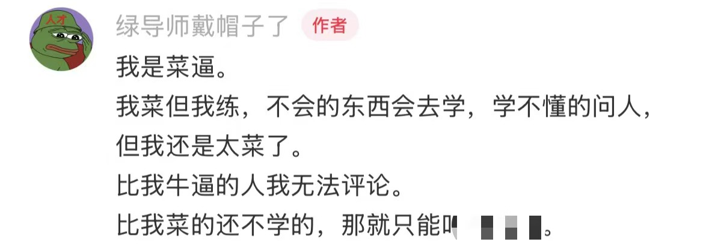
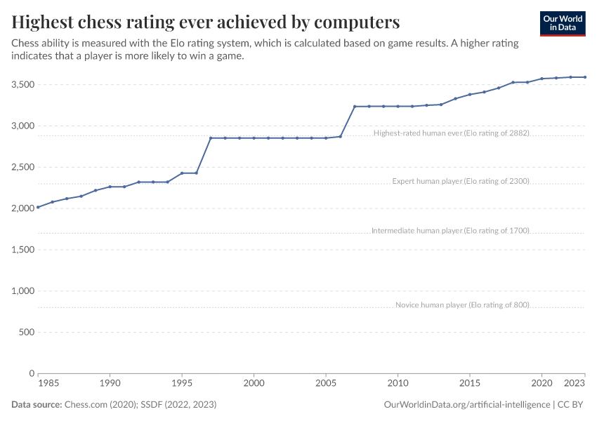
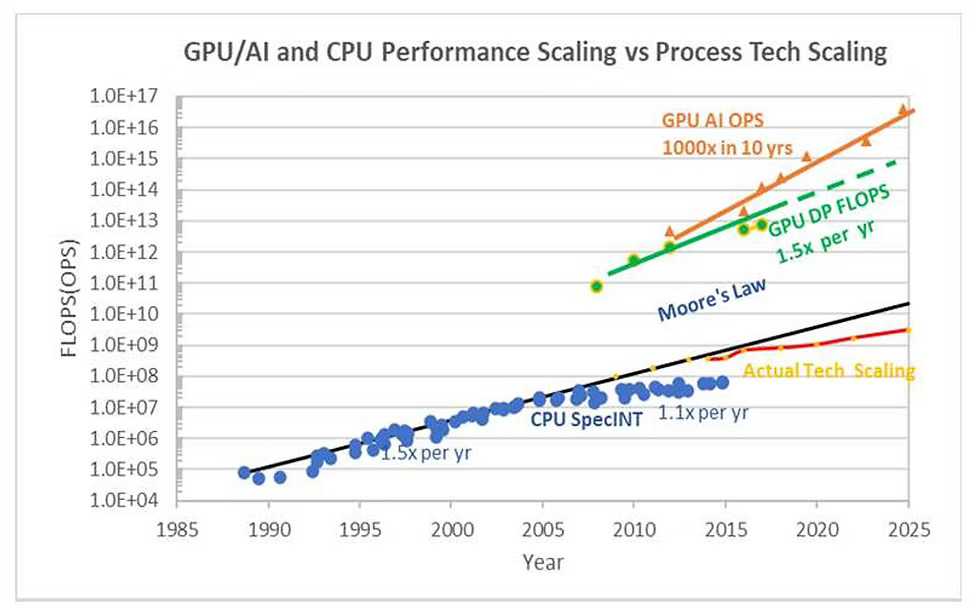
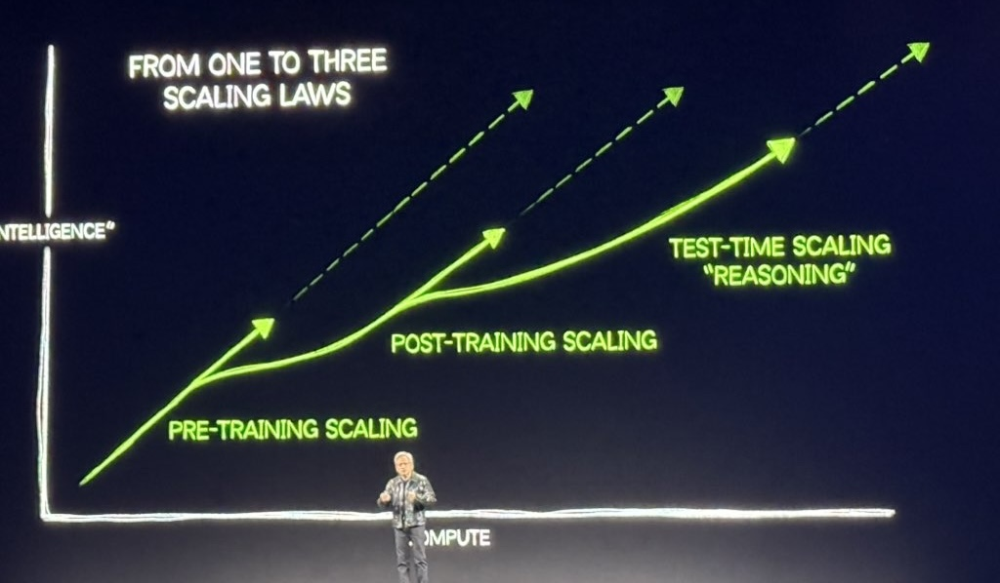

# 第 30 讲：课程总结

> 原始讲义：[sources/notes/lect30.md](../../sources/notes/lect30.md)  
> 前一讲：[虚拟机和容器](29-vm-containers.md) · [返回逐讲总目录](README.md)

## 0. 本讲定位：不是再背一遍名词，而是把三十讲压成一套方法

前一讲把进程隔离继续推到虚拟机、namespace、cgroup 与容器。
到这里，课程已经从“一条指令怎样执行”走到“数据中心里怎样同时运行成千上万个受限的完整软件世界”。

最后一讲有两个任务：

1. 把散布在 01–29 讲的状态机、API、虚拟化、并发、持久化与安全重新接成一张图；
2. 回看这套知识在技术浪潮中的位置，并练习区分事实、课程观点和未来判断。

这不是把每章缩成一句话。
PPT 列出的每个 demo 都是课程论证链上的证据：它应当回答“观察到什么”“支持什么结论”“边界在哪里”。

本章不会给出任何 MiniLab 的直接答案。
综合实践只复用公开的独立示例，重点是建立观察、假设、验证和反证的工作流。

---

## 1. 学习目标与阅读方式

完成本讲后，你应当能够：

1. 从应用和硬件两个视角解释操作系统，并在两者之间往返；
2. 画出三十讲的知识依赖图，而不是按周次孤立背诵；
3. 为 PPT 的每个演示指出核心机制、观察工具与对应章节；
4. 用 `readelf/objdump`、GDB、`strace`、`perf` 组成从静态程序到运行系统的证据链；
5. 把进程、并发、文件更新与崩溃恢复组织成一个综合观察路线；
6. 遇到新系统时从 specification、state、transition、invariant、failure model 推导；
7. 把已验证事实与关于 AI、教育、职业的价值判断和预测分开；
8. 制定一条可执行的复习路线，并知道怎样让 AI 帮忙而不外包理解。

阅读后半部分时使用三种标签：

- **[可验证事实]**：可由规范、代码、论文、实验或有日期的史料核查；
- **[课程观点]**：讲者据事实给出的解释、价值排序或教学主张；
- **[面向未来的判断]**：截至 **2026-07-22** 的预测，不伪装成已经发生的事实。

---

## 2. 课程总结

### 2.1 应用视角的操作系统

应用看到的操作系统，是一组对象和 API：

```text
process/thread/address space
file/fd/pipe/socket/device
time/signal/event
directory/mount/permission
```

操作系统管理硬件资源，为应用建立一个稳定生态。
进程让每个程序像拥有自己的处理器，地址空间让每个进程像拥有自己的内存，文件系统让易失块设备表现成有名字的持久对象。

这个视角的关键问题始终是：

> 应用想要什么抽象？API 承诺了什么语义？失败、并发和权限边界是什么？

详见[第 1 讲](01-os-overview.md)、[第 2 讲](02-application-view.md)与[第 7 讲](07-os-objects.md)。

### 2.2 硬件视角的操作系统

CPU 看不到“操作系统”这个概念，只按 ISA 与平台规范执行指令、响应 exception/interrupt、访问 memory/MMIO。
CPU reset 后先执行 firmware；boot loader 与内核建立页表、中断、调度和设备管理，最终才兑现应用视角的 API。

这个视角的关键问题是：

> 当前全部状态是什么？下一步允许发生哪种状态迁移？谁拥有更高特权，如何切换？

多处理器、GPU、non-volatile memory 与虚拟化扩展都不是旁枝；它们改变了状态、迁移成本与可见性，OS 与硬件也因此共同演化。
详见[第 3 讲](03-hardware-view.md)、[第 13 讲](13-multiprocessor.md)、[第 20 讲](20-cpu-gpu-simt.md)和[第 23 讲](23-storage.md)。

### 2.3 三十讲知识依赖总图

```text
数字电路/ISA/程序都是状态机                         01–03
             │
             ├── specification、trace、Agent harness       04
             │
             ▼
进程生命周期 ── 地址空间 ── OS 对象/fd/terminal           05–08
             │
             ▼
libc/allocator ── ELF/链接/加载 ── 应用生态                09–12
             │
             ▼
共享内存并发 ── 互斥 ── 条件变量/信号量 ── Bug            13–17
             │
             ├── 并行算法/数据结构                         18
             ├── async/event loop                          19
             └── CPU ILP/SIMD 与 GPU SIMT                  20–21
                         │
                         ▼
I/O 设备 ── 块设备 ── FS API/快照 ── FS 实现/恢复          22–26
                         │
                         ▼
                  数据库事务与查询                          27
                         │
                         ▼
CIA/访问控制/漏洞 ── VM/namespace/cgroup/container          28–29
```

横贯所有节点的是同一条证据方法：

```text
提出可证伪假设
  → 找到 specification 和抽象边界
  → 构造最小实验
  → 记录 trace/state
  → 解释结果与反例
  → 写清适用条件
```

---

## 3. 本学期知识点复习

### 3.1 这门课的精神内核

PPT 的总结是：“我们总是可以（在 AI 的帮助下）做得更好。”
这里的“更好”必须可检验：解释更清楚、实验更可复现、边界更准确、失败时更容易定位，而不只是生成更多代码。

课程源文件能用命令组合提取 demo：

```bash
find sources/notes -name 'lect*.md' -print0 |
  sort -zV |
  xargs -0 rg -h '^# \[.*\](/OS/demos/' |
  awk '!seen[$0]++'
```

这条 pipeline 的每一步都有单一 contract：枚举、版本排序、匹配、去重。
macOS 的 `pbcopy` 只负责把最终文本放进剪贴板；它不是 pipeline 的本质，在 Linux/远程环境可输出到文件或使用别的 clipboard 工具。

让 AI 复习时，也应给它具体约束：指定章节、你的背景、希望的解释层级、要求出反例和自测题，并让它引用源码或实验输出。
“注入 personality”能改善表达，不能替代事实核查。

下面严格沿 PPT 次序重访演示。

---

## 4. 阶段一：Introduction——状态机、编译与启动

这一阶段对应[第 1 讲](01-os-overview.md)、[第 2 讲](02-application-view.md)、[第 3 讲](03-hardware-view.md)与[第 4 讲](04-scaling-agentic-ai.md)。

### [数字电路模拟器](/OS/demos/intro/logisim)

**观察。** 时钟到来时，组合逻辑根据当前寄存器和输入算出 next state，寄存器在边沿统一更新；另一程序把文本状态渲染成可视界面。

**证明。** NAND、wire、register 足以构成逐拍迁移的数字系统；UNIX 工具可以通过文本协议组合。`nvboard` 等项目把相同思想扩展到更完整的数字电路可视化。

**边界。** 教学模拟器通常省略传播延迟、亚稳态、clock-domain crossing 与电气约束，不能据此认为真实 RTL 只是一组普通 C assignment。

### [RISC-V 处理器模拟器](/OS/demos/intro/mini-rv32ima)

**观察。** 一个 fetch-decode-execute loop 更新 PC、register、memory 与 device state；加入 M-mode、exception 和设备后，single-header simulator 甚至能启动无 MMU Linux。

**证明。** “处理器执行程序”仍是状态机；复杂系统不是魔法，而是规范允许的迁移数量增长。

**边界。** functional ISA simulator 不等于 cycle-accurate microarchitecture；cache、pipeline、speculation 和真实时间可能被大幅简化。

### [汉诺塔](/OS/demos/intro/hanoi-nr)

**观察。** 调换两个递归调用，会改变 `printf` 的顺序；把递归展开成显式 stack 后，保存的其实是 continuation/PC 和局部状态。

**证明。** C 函数是带副作用的程序状态迁移，不是数学函数。`f(n-1) + f(n-2)` 的 operands 在 C 中没有左到右求值保证，不能把习惯当语言语义。

**边界。** 若两个调用无可观察副作用且都终止，顺序可能不影响最终数学值；有 I/O、共享状态、异常或不终止时则必须回到语言规范。

### [C 解释执行器](/OS/demos/intro/cinterp)

**观察。** 把 C 程序改写成 SimpleC，用 GDB 单步读取变量、PC 与栈，就像显式执行 `S -> S'`。

**证明。** interpreter 的核心是保存状态并重复选择语义规则；调试器可以成为临时的可观察解释器。

**边界。** GDB 单步的是已编译机器程序，不是完整 C abstract machine；optimization、undefined behavior 和 debug-info 缺失会打破源码逐行直觉。

### [什么是编译器](/OS/demos/intro/ccompile)

**观察。** 调整 optimization level，比较源码、assembly 和输出，能看到 dead-code elimination、constant propagation 等等价变换。

**证明。** 编译正确的核心是保留语言定义的 observable behavior，而不是逐句机械翻译。这给 optimizer 很大但有边界的自由。

**边界。** “把冒泡排序自动变成快排”牵涉算法识别、等价性、稳定性、异常与资源行为；AI 能生成替代实现，不等于一般编译器已经证明任意这种替换正确。

### [最小可执行文件](/OS/demos/intro/minimal)

**观察。** 一个没有 `main` 和 libc 的 ELF 仍可从 `_start` 执行，用 syscall ABI 输出并退出。

**证明。** 内核加载的是 ELF segment 和初始 machine state；`main`、stdio、constructor 是 runtime/libc 生态提供的更高层约定。

**边界。** “文件很小”不代表 ELF contract 消失；architecture、ABI、program header、permission 和 syscall number 都必须正确。

可与[`examples/state_machine.c`](../../examples/state_machine.c)和[第 2 讲](02-application-view.md)的最小程序实验对照。

### [探索 CPU Reset](/OS/demos/intro/cpu-reset)

**观察。** 在模拟器中记录 x86、ARM 或 RISC-V reset 后的 PC/register 与前几条指令，机器严格从 architecture/platform 指定的初始状态前进。

**证明。** reset 不是“内存和寄存器全部归零”的通用操作；第一条代码地址、特权级与启动介质属于 specification。

**边界。** 不同 SoC、boot mode 与 firmware 配置不同，不能把 PC 的一个平台地址背成所有机器的真理。

### [CIH 病毒](/OS/demos/intro/cih)

**观察。** 课堂把历史恶意代码翻成可读 C，是为了识别感染、潜伏、破坏与早期 Windows 9x 权限模型，而不是提供可部署攻击工具。

**证明。** 可更新 firmware 与缺乏进程/设备访问控制结合，会把软件漏洞扩展到启动链和硬件可用性。

**边界。** 现代 UEFI Secure Boot、签名更新、IOMMU 和权限隔离改变了攻击面，但没有让 firmware/supply-chain 风险消失。详见[第 28 讲](28-security.md)。

### [调试 SeaBIOS 固件](/OS/demos/intro/debug-firmware)

**观察。** 修改 boot signature、设置 GDB watchpoint，追踪到底是哪条 firmware 指令把磁盘扇区搬到内存。

**证明。** “BIOS 加载 512 字节”不是只能背诵的传说；可以从规范假设落到具体 memory write trace。`init.gdb` 和 hooks 把调试器定制成专用观测台。

**边界。** SeaBIOS/QEMU 是一个可重复平台，不代表所有 legacy BIOS/UEFI 实现采用同一内部路径。

### [OpenSBI](/OS/demos/intro/opensbi)

**观察。** 从 RISC-V reset/M-mode 入口跟踪 OpenSBI 初始化，再观察 S-mode kernel 通过 SBI `ecall` 请求 machine-level 服务。

**证明。** firmware 可以在硬件与 OS 之间形成标准 supervisor interface；privilege transition 也是受规范约束的状态迁移。

**边界。** OpenSBI 不是 boot loader 的同义词，也不替 Linux 实现进程、文件系统和通用设备模型。项目源码见[官方仓库](https://github.com/riscv-software-src/opensbi)。

### [最小 “操作系统”](/OS/demos/intro/os-minimal)

**观察。** 用项目说明、任务分解、可验证构建步骤和 Agent 协作，从 freestanding code 推到一个最小可启动 image。

**证明。** 当 implementation 变便宜，清晰 specification、interface、ownership 与 test harness 反而成为瓶颈；一个人可以承担更多产品与工程角色。

**边界。** “能编译”不等于“能启动”，“能启动”也不等于具备 isolation、recovery 和 security。这里不展开或泄露 MiniLab 解答。

---

## 5. 阶段二：Virtualization——进程、地址空间、对象与应用生态

这一阶段依次连接[第 5 讲](05-programs-processes.md)、[第 6 讲](06-address-space.md)、[第 7 讲](07-os-objects.md)、[第 8 讲](08-terminal-shell.md)、[第 9 讲](09-libc-1.md)、[第 10 讲](10-libc-2.md)、[第 11 讲](11-executable-linking.md)和[第 12 讲](12-application-ecosystem.md)。

### [Crazy OS](/OS/demos/virtualization/crazy-os)

**观察。** host 程序加载多个 RISC-V binary，轮流模拟若干指令，在 guest 触发 syscall 时由 host 处理。

**证明。** OS 的最小骨架可以看成“多个状态机 + scheduler + syscall handler”；virtualization 先是语义，再是硬件加速。

**边界。** 教学模拟器没有完整 MMU、interrupt、device、security 与 SMP，不能据此估算真实 OS 复杂度或性能。

### [展示进程信息](/OS/demos/virtualization/proc-info)

**观察。** 一个 C 工具结合 syscall 与 `/proc/self/*` 展示 PID、parent、credential、mapping、fd、scheduler 等进程自身不能靠普通 load 直接得知的 OS 状态。

**证明。** process 不只是 binary + registers + memory；kernel 还维护资源引用、身份、signal、namespace 与调度状态。procfs 是内核状态的文本投影。

**边界。** `/proc` 是 Linux interface，读取过程中状态可变化，并非 atomic snapshot；其他 POSIX 系统未必有相同文件。

### [创建一棵进程子树](/OS/demos/virtualization/pstree)

**观察。** 连续 `fork` 形成五层 parent-child tree，随机退出后用 `/proc` 或 `ps` 观察 orphan adoption 与 zombie。

**证明。** 创建关系形成树，但 process lifecycle 还包含 exit status、reaping 和 subreaper/init 重新收养。

**边界。** PPID 不是资源所有权；process tree 也不是调度树、cgroup 树或 namespace 层次。

### [fork-based DFS](/OS/demos/virtualization/fork-dfs)

**观察。** 每个 DFS branch 调用 `fork`，子进程从当前 search state 的 snapshot 继续，分支天然隔离并可并行。

**证明。** `fork` 的语义是复制状态机；copy-on-write 让实现无需立即复制所有物理 page。

**边界。** process creation、page table、IPC 和 result collection 都有成本；exponential search tree 还会耗尽 process limit，不能无界展开。

### [理解 fork()](/OS/demos/virtualization/fork-demo)

**观察。** parent/child 从同一 `fork` 返回不同值；直接输出与 pipe 到 `wc` 时，stdio buffer 被复制可能造成不同打印次数。用 `strace -f` 能对齐 `clone/fork`、`write`、`exit_group`。

**证明。** 状态机快照包含用户态 runtime buffer；syscall trace 只显示 buffer flush 后的 write，不能把源码 `printf` 次数直接等同 syscall 次数。

**边界。** 调度先后无保证，多线程进程 fork 后只有 calling thread 存活，调用非 async-signal-safe library function 还可能继承锁死状态。

可直接复用[`examples/fork_exec.c`](../../examples/fork_exec.c)。

### [理解 execve](/OS/demos/virtualization/execve-demo)

**观察。** `execve(path, argv, envp)` 成功后不返回，而是替换当前 process image；PID 和部分 kernel state 保留，address space、代码和 initial stack 被重建。

**证明。** `fork` 复制状态，`execve` 重置用户程序状态，两者组合成 UNIX process spawn idiom。

**边界。** `execl/execvp` 等多为 libc/POSIX wrappers；PATH 搜索发生在用户态。未设 `FD_CLOEXEC` 的 fd 可以跨 exec 保留。

### [理解 exit](/OS/demos/virtualization/exit-demo)

**观察。** 比较 libc `exit()`、`_exit()` 与 Linux `exit/exit_group` trace，能看到 stdio flush、`atexit` handler 和整个 thread group termination 的差别。

**证明。** 语言/runtime API、libc 与 syscall 是不同层；parent 仍需 `waitpid` 回收 status。

**边界。** signal termination、core dump 和 abrupt process death不会执行普通 `atexit` cleanup；cleanup 不能替代持久化 protocol。

### [重新理解指针](/OS/demos/virtualization/pointers)

**观察。** 打印 code/global/heap/stack 地址，读取 `main` 附近 bytes 并与 disassembly 对齐。

**证明。** pointer 在机器层是 virtual address；“指向函数/整数/对象”的类型信息主要属于语言和 compiler，page mapping 决定实际 R/W/X。

**边界。** 把 function pointer 强转成 object pointer、越过 object boundary 读取可能碰到 C 标准可移植性与 UB；实验结论要限定具体 ABI/平台。

### [探索进程地址空间](/OS/demos/virtualization/addr-space)

**观察。** 解析 `/proc/<pid>/maps`，把 VMA 的地址、权限、offset 与 backing file 对齐，并对 executable region 做有限反汇编。

**证明。** 地址空间是 sparse mapping rules，不是简单的“code/data/heap/stack 四段”；ELF、loader、mmap、stack 和 shared library 共同构造它。

**边界。** 读取其他进程受 ptrace credential/LSM 限制；mapping 在采样时会变化；反汇编 bytes 也不自动得到控制流真实可达性。

### [mmap 系统调用](/OS/demos/virtualization/mmap)

**观察。** 大 anonymous mapping 可以快速返回，第一次触碰 page 才产生 minor fault/物理分配；`MAP_PRIVATE` 与 `MAP_SHARED` 对修改可见性不同。

**证明。** `mmap` 是编辑 address-space mapping 的接口，demand paging 延迟兑现资源；allocator 和 AddressSanitizer 都能在其上构建。

**边界。** virtual reservation 不等于物理内存免费；overcommit、RSS、swap、cgroup limit 与 OOM 仍决定能否持续使用。可对照[`examples/mmap_cow.c`](../../examples/mmap_cow.c)。

### [金山游侠](/OS/demos/virtualization/knight)

**观察。** 在自己创建并授权调试的 toy process 中，反复搜索变化的数值，定位并修改“金币/生命值”。

**证明。** debugger 借助 ptrace/process API 跨越普通地址空间隔离；从 bytes 反推程序语义需要差分实验。

**边界。** 只能在自有/明确授权目标上实验；现代游戏还有 server authority、anti-cheat、ASLR 与 integrity protection。该能力也是[第 28 讲](28-security.md)的访问控制问题。

### [文件描述符](/OS/demos/virtualization/filedesc)

**观察。** 打开 regular file、pipe、socket 或 device 后，process 都得到小整数；`read/write/fstat/ioctl` 根据引用对象表现不同。

**证明。** fd 是 process-local handle，指向 kernel open-file state；统一 handle 使重定向、继承和组合成为可能。

**边界。** “Everything is a File” 指接口可组合，不表示所有对象都是磁盘 byte array，也不表示每个对象都支持 seek 或相同 ioctl。

### [UNIX 管道](/OS/demos/virtualization/pipe)

**观察。** `pipe + fork + dup2 + exec` 把一个程序 stdout 接到另一个程序 stdin；parent 必须关闭多余 write end，consumer 才能收到 EOF。

**证明。** shell pipeline 不是字符串拼接，而是进程和 fd graph；backpressure 由有限 kernel buffer 自然产生。

**边界。** pipe 是 byte stream，没有 message boundary；writer/reader 的 partial I/O、`SIGPIPE` 与 deadlock 都要处理。可运行[`examples/pipeline.c`](../../examples/pipeline.c)。

### [TestKit 测试框架](/OS/demos/virtualization/testkit)

**观察。** 利用 constructor/section 或显式注册自动收集测试，process exit 前运行并汇总结果，既能做 unit test 也能启动 system test。

**证明。** 一个好 harness 把重复 setup、assertion、reporting 和 cleanup 变成基础设施；可执行观察比肉眼相信更可靠。

**边界。** 测试通过只覆盖已枚举 input/schedule/failure；并发和 crash correctness 还需 sanitizer、model checker、fault injection 等不同 oracle。

### [理解终端](/OS/demos/virtualization/tty)

**观察。** 用 PTY、termios、escape sequence 和 process group 实现“终端里的终端”，观察 canonical/raw mode、echo、foreground job 与 Ctrl-C。

**证明。** terminal 是有 line discipline 和 session/job-control 状态的 OS 对象；shell 与 emulator 是其上的应用。

**边界。** 键盘事件、PTY byte stream、terminal escape protocol 和 GUI rendering 属于不同层，不能把 `read(0,...)` 当作直接读取物理按键。

### [信号处理](/OS/demos/virtualization/signal)

**观察。** `sigaction` 注册 handler；terminal driver 向 foreground process group 发送 `SIGINT`，程序可以记录通知、恢复执行或按约定退出。

**证明。** signal 是异步控制转移，kernel 会修改用户态恢复现场，使下一段执行先进入 handler。

**边界。** handler 中只能安全调用 async-signal-safe function；普通 signal 可能合并而不计数，不能把它当可靠 message queue。

### [Shebang](/OS/demos/virtualization/shebang)

**观察。** 对 `#!interpreter optional-arg` 开头且有执行权限的脚本调用 `execve`，kernel 转而执行 interpreter，并把脚本路径加入 arguments。

**证明。** “可执行文件”是 loader protocol，不只是一种 ELF magic；机制很小，却让脚本融入同一 process/exec 生态。

**边界。** shebang parsing 的 path、单个 optional argument、长度和平台行为有限制；`/usr/bin/env -S` 属于用户态 portability 技巧。PPT 中第二张同名页合并在此。

### [调试 “小程序”](/OS/demos/virtualization/musl-demos)

**观察。** 静态链接 musl 后，从 `_start`、runtime initialization、`main`、stdio 到 syscall 逐指令调试一个看似最简单的 C 程序。

**证明。** 熟悉的函数背后仍有 ABI、TLS、allocator、buffer 与 termination protocol；“小程序”是穿透抽象层的最佳样本。

**边界。** musl 与 glibc 的 internal symbol/path 不同；应区分 C/POSIX 保证、libc 实现与 Linux syscall。

### [Funny Little Executable](/OS/demos/virtualization/fle)

**观察。** 自定义一个极简 binary format，用 compiler/linker 生成 position-independent bytes，再由 loader `mmap`、relocate/设置权限并跳转。

**证明。** executable format 是“初始 address space + entry + relocation contract”；ELF 很复杂，但不是不可推导的魔法。

**边界。** 把 memory 同时设为 W+X 方便教学却违反 W^X 安全原则；完整 loader 还要验证长度、overflow、symbol 和 permission。

### [动态链接库是进程间共享的吗？](/OS/demos/virtualization/bloat)

**观察。** 把大量 NOP 放入 `libbloat.so`，启动许多 process，再比较 virtual size、RSS/PSS 与 shared clean pages。

**证明。** 多个 process 可把同一 file-backed read-only code page 映射到不同 virtual address，却共享 physical page；动态链接和 page cache 共同节省内存。

**边界。** `VIRT` 不能相加当物理内存；relocation、dirty data 与 COW page 不一定共享，PSS 比单看 RSS 更适合分摊。

### [变速齿轮](/OS/demos/virtualization/wheel)

**观察。** 用 `LD_PRELOAD` interpose `gettimeofday/usleep/alarm` 等 symbol，把应用所见时间映射为更快的 virtual clock。可与[`examples/preload_clock.c`](../../examples/preload_clock.c)对照。

**证明。** dynamic linker 是可编程的 binding layer；只要应用经该 symbol 取时间，就能改变它的世界模型。

**边界。** static binary、direct syscall、vDSO、其他 clock 与外部 server 不会自动被同一 wrapper 覆盖；安全程序也会清理危险环境变量。

### [Minix](/OS/demos/virtualization/minix)

**观察。** 构建和启动 Minix 1/2，沿小而完整的源码阅读 boot、process、filesystem 与 user-space services。

**证明。** 教学 OS 的价值是把完整因果链缩到人可掌握尺度；经典机制能在真实运行系统中彼此连接。

**边界。** 历史 Minix 的硬件、security 与 performance contract 不是现代 Linux 的替代品。PPT 所用版本来自 [Minix 1 and 2 archive](https://github.com/davidgiven/minix2)。

### [最小 Linux](/OS/demos/virtualization/linux-minimal)

**观察。** kernel 解包 initramfs，执行 `init=` 指定的第一个 user process；一个静态 binary 就能形成最小用户世界。

**证明。** Linux kernel 与 distribution 不是同义词；root filesystem 和 PID 1 是从 kernel 过渡到应用生态的契约。

**边界。** “只有一个文件”忽略 kernel/image/firmware；PID 1 还承担 signal/reaping 等特殊责任。参数以 Linux 官方[kernel command line](https://www.kernel.org/doc/html/latest/admin-guide/kernel-parameters.html)为准。

### [Linux](/OS/demos/virtualization/linux)

**观察。** 在 initramfs 加入程序、module、script 与数据，挂载真实 root 后通过 `switch_root/pivot_root` 进入 systemd 等完整用户空间。

**证明。** 现代 OS 是 kernel、init、libc、service manager、filesystem hierarchy 和应用的生态；启动是逐层交接控制权。

**边界。** initramfs、initrd、`pivot_root` 与 `switch_root` 不是任意互换词；实际 distribution、secure boot 与 storage layout 各异。

---

## 6. 阶段三：Concurrency——互斥、同步、并行、异步与 GPU

这一阶段依次对应[第 13 讲](13-multiprocessor.md)到[第 21 讲](21-token-journey.md)。
统一问题是：多个 action 可以重叠时，哪些结果合法、怎样建立 happens-before、怎样把 work 映射到资源？

### [迷你线程库](/OS/demos/concurrency/thread-lib)

**观察。** `spawn(fn)` 封装 `pthread_create`，`join()` 等待线程结束；同一 process 中多个执行流可被不同 CPU 同时调度。

**证明。** thread 的最小抽象是独立 PC/register/stack 加共享 address space；API 小不代表 schedule 简单。

**边界。** wrapper 隐藏了错误码、attribute、cancellation 和 lifetime；真实 pthread 代码必须处理 resource exhaustion 与 join protocol。

### [通过线程库理解线程行为](/OS/demos/concurrency/thread-examples)

**观察。** 多线程打印 global/heap 地址相同，local stack 地址分离；触碰 stack pages 可估计每线程 stack range。

**证明。** thread 共享 process mapping，却有独立 call stack 与 execution context；共享/私有是按对象和映射区分。

**边界。** 地址相同不自动提供同步；stack size/reservation 不等于 RSS，compiler 还可能把 local 放寄存器。

### [山寨支付宝](/OS/demos/concurrency/alipay)

**观察。** 多线程并发转账或修改余额，在未同步时出现 lost update、负数或总额不守恒；调度扰动使 bug 概率变化。

**证明。** `x++`/read-check-write 由多步组成；人脑按源码顺序模拟一个线程，无法覆盖所有 interleaving。

**边界。** C/C++ data race 可能是 undefined behavior，不只是“任意交错”；不能用一次恰好正确的输出证明程序正确。对照[`examples/mutex_transfer.c`](../../examples/mutex_transfer.c)。

### [使用 mutex API 实现互斥](/OS/demos/concurrency/sum-mutexapi)

**观察。** 把共享 `sum++` 包在同一 mutex 的 lock/unlock 间，最终计数稳定正确。

**证明。** mutex 同时提供 mutual exclusion 和相应 memory synchronization；保护的是程序员定义的 invariant，不是某个变量名字。

**边界。** 不同线程使用不同锁、漏锁、锁外检查仍会 race；粗粒度锁正确但可能扩展性差。PPT 的重复页合并在此。

### [宽松内存模型](/OS/demos/concurrency/mem-model)

**观察。** classic litmus test 在 compiler/CPU 优化下可能出现简单 interleaving model 没预期的结果；assembly 与 hardware counters/重复采样提供证据。

**证明。** source order、compiler order、coherence order 与跨核可见顺序不是同一概念；需要 language atomics 和 memory order 建立 portable relation。

**边界。** 某次机器未观测到弱结果不代表禁止；x86 TSO 经验也不能直接移植到 ARM/RISC-V 或 C abstract machine。

### [尝试关闭中断](/OS/demos/concurrency/cli)

**观察。** user process 执行 x86 `cli` 这类 privileged instruction 会 fault，由 Linux 转成 signal，而不是让整机停止调度。

**证明。** privilege boundary 阻止应用通过关中断破坏系统；单 CPU kernel 临界区与用户态 mutex 的实现环境不同。

**边界。** 关本地 CPU interrupt 也不能停止其他 CPU；NMI、DMA 与 memory ordering 仍需单独考虑。

### [操作系统模型和检查器](/OS/demos/mosaic)

**观察。** 用 Python function 声明状态与 transition，遍历 schedule/failure 后的 state space，自动寻找 invariant violation 或反例 trace。

**证明。** Concurrency、Virtualization、Persistence 都能还原为状态机；小模型 exhaustive exploration 比“我觉得没问题”可靠。

**边界。** checker 只证明 model；遗漏 transition、弱内存或环境 failure 会产生 model gap，state explosion 也限制规模。

### [Peterson 算法](/OS/demos/concurrency/peterson)

**观察。** 在理想 sequentially consistent memory 上，两线程用 `flag` 和 `turn` 可互斥；普通 C load/store 版本在 compiler/weak memory 下不可靠。

**证明。** 纯软件协议正确性依赖明确 memory model；算法 proof 的 assumption 与 implementation primitive 必须一致。

**边界。** 即使用正确 atomics，busy wait、两线程限制和 cache traffic 也使 Peterson 不适合作为通用 production mutex。

### [使用硬件原子指令实现互斥](/OS/demos/concurrency/sum-spinlock)

**观察。** compare-exchange 让“检查旧值并写新值”成为不可分割 read-modify-write；失败者 spin，winner 进入 critical section。

**证明。** hardware atomic instruction 是构造 lock/lock-free algorithm 的基元；compiler builtin 能选择适合 architecture 的指令和 fence。

**边界。** atomic 不代表 wait-free、公平或便宜；错误 memory order、ABA、false sharing 和 oversubscription 仍可能失败或变慢。

### [使用不同方式求和](/OS/demos/concurrency/sum-experiment)

**观察。** 固定总 increment 次数，改变 thread count，对 spinlock、mutex、atomic 重复测量并保存 CSV/error bar。

**证明。** 性能是 workload、contention、scheduler 与 hardware 的函数；正确对照、原始数据和 variance 比单次“跑得快”重要。

**边界。** microbenchmark 不能直接预测真实 critical section；CPU frequency、NUMA、pinning、warmup 与 measurement overhead 都要记录。

### [实现乐团同步](/OS/demos/concurrency/orchestra)

**观察。** 乐手等待“当前拍开始”的 predicate，指挥改变 state 并 notify；比较 spin polling 与 condition variable sleeping。

**证明。** synchronization 是建立 happens-before；condition variable 把“检查条件—睡眠—唤醒后重查”与 mutex 配合。

**边界。** notify 不是储存 token，spurious wakeup 和多个 waiter 要求 `while (!predicate) wait`。

### [生产者-消费者问题](/OS/demos/concurrency/producer-consumer)

**观察。** bounded buffer 维护 `0 <= count <= capacity`；producer 等待 not-full，consumer 等待 not-empty，所有 state 检查在 mutex 下。

**证明。** 先写全局 invariant/predicate，再选 condvar，能把同步从“记 API”变成 protocol 推导。

**边界。** shutdown/close、multiple producers、error propagation 与 cancellation 会增加新 state；基础无限循环版不是完整 service。可运行[`examples/bounded_buffer.c`](../../examples/bounded_buffer.c)。

### [奇怪的同步问题](/OS/demos/concurrency/fish)

**观察。** 三类线程只能打印 `<><_` 或 `><>_` 的组合；把合法 prefix 编成 state/predicate 后，condvar 即可实现。

**证明。** 同步问题看似千奇百怪，核心仍是“当前 state 下谁可 transition”；模式约束比凭直觉发 signal 清楚。

**边界。** 输出序列正确不必然保证 starvation-free；还需检查 liveness 与公平性。

### [使用互斥锁实现计算图](/OS/demos/concurrency/cgraph-mutex)

**观察。** 为 edge 预先锁 mutex，由 source node unlock、target node lock，表面上实现 DAG happens-before。

**证明。** 依赖边可视作 synchronization token；同时，这个故意反例揭示“看起来能跑”不等于符合 API contract。

**边界。** POSIX mutex 有 ownership，由非 owner unlock 是 undefined behavior。PPT 重复页合并于此，正确方案应使用 semaphore/condvar/future。

### [使用信号量实现线程 join](/OS/demos/concurrency/join-sem)

**观察。** 每个 worker 完成后 `sem_post`，等待者执行相同次数 `sem_wait`，把完成事件计数保存下来。

**证明。** semaphore 是可累积 token；post 先于 wait 也不会丢失，适合一次性完成计数。

**边界。** token 不携带哪个 worker 的 result/error；thread resource 仍可能需要真实 `pthread_join` 回收。

### [使用信号量实现计算图](/OS/demos/concurrency/cgraph-sem)

**观察。** 每条完成的 incoming edge 给 target semaphore 一个 token；node 收齐 indegree 个 token 后执行，再向 outgoing edges 发布。

**证明。** DAG dependency 可以直接编译成计数 protocol。仓库的[`examples/semaphore_dag.c`](../../examples/semaphore_dag.c)给出独立实现。

**边界。** cycle、node failure、duplicate post 和 dynamic graph 需要额外 protocol；semaphore count 本身不知道 graph meaning。

### [使用信号量实现生产者-消费者问题](/OS/demos/concurrency/pc-sem)

**观察。** `empty` 与 `filled` 两袋 token 加一个 buffer mutex，满足 `empty + filled + in-flight = capacity`。

**证明。** resource-count problem 与 semaphore 自然对齐；获取/释放顺序表达了 slot 和 item 的所有权转移。

**边界。** 不一致的 acquire order 会 deadlock；close/EOF 不能只靠 count 表达，需要 sentinel 或额外 state。

### [哲学家吃饭问题](/OS/demos/concurrency/philosophers)

**观察。** 所有人先拿左叉会 circular wait；限制最多四人入座，至少一人可拿到两把叉并释放。

**证明。** 打破 Coffman condition 能避免 deadlock；global admission control 是一种简单策略。

**边界。** deadlock-free 不等于 starvation-free；公平 semaphore、调度与 pickup policy 影响个体进展。

### [死锁演示](/OS/demos/concurrency/deadlock)

**观察。** AA 是同一 non-recursive mutex 重复加锁；ABBA 是两个 lock 的相反获取顺序形成 wait-for cycle。

**证明。** deadlock 是 state graph 中没有进展的闭合区域；lock ordering 可从结构上排除 cycle。

**边界。** timeout 只打破无限等待，不自动恢复 partially updated invariant；recursive mutex 也可能掩盖设计错误。

### [lockdep](/OS/demos/concurrency/lockdep)

**观察。** `LD_PRELOAD` intercept pthread lock/unlock，记录“已持有锁 → 新锁”edge，加边时检查 cycle，提前报告潜在 ABBA。

**证明。** harness 可把隐含 lock order 变成 runtime graph；一次未真正 deadlock 的执行也能暴露危险 order inversion。

**边界。** 只看经过 wrapper 的 lock 和已执行 path；custom atomics、process-shared lock、condition protocol 与漏测 path 仍可能逃过。

### [ThreadSanitizer](/OS/demos/concurrency/tsan)

**观察。** 编译插桩记录 memory access 与 synchronization，报告没有 happens-before 的同地址冲突访问。

**证明。** data race 可由动态工具近似检测；报告中的两个 stack 和 creation trace 是修复证据链。

**边界。** TSan 只观察本次 schedule，增加 overhead，并非所有 custom synchronization 都被认识；race-free 也不保证 high-level atomicity。

### [Therac-25 模拟器](/OS/demos/concurrency/therac-25)

**观察。** 可执行 simulator 重放快速输入与 device/operator state race，显示 rare interleaving 怎样绕过 safety check。

**证明。** 安全关键系统不能把唯一物理 interlock 删除后，只信复杂软件“不会碰巧错”；事故分析可转成 state machine 与 fault-injection test。

**边界。** 教学模拟不是历史设备的完整认证模型；重要的是 defense in depth、independent fail-safe 与可审计 requirement，详见[第 17 讲](17-concurrency-bugs.md)。

### [绘制 Mandelbrot Set](/OS/demos/concurrency/mandelbrot)

**观察。** 每个 pixel 的迭代独立，把 image 分块给多个 worker，monitor 周期显示进度，最终合并图像。

**证明。** 从 dependency graph 先识别 embarrassingly parallel work，几乎无需共享写；分片通常比在共享 counter 上优化更有效。

**边界。** pixel cost 不均可能 load imbalance；display/merge 与 memory bandwidth 仍是串行或共享瓶颈。

### [Thread-local Storage](/OS/demos/concurrency/tls)

**观察。** 同一 TLS symbol 在不同 thread 有不同地址/值；compiler 生成经 thread pointer（如 x86-64 `%fs` base）定位的访问。

**证明。** 把共享 state 变成 per-thread state 可减少同步；语言、loader 与 thread runtime 共同构建 TLS block。

**边界。** TLS 增加每线程内存和 aggregation 成本；它不适合必须立即全局一致的数据。

### [线程的代价](/OS/demos/concurrency/thread-cost)

**观察。** 创建不同数量 thread，测量时间、VMA、virtual stack、RSS 和 scheduler activity。

**证明。** kernel thread 是有 stack、task metadata 与调度成本的 execution resource；大量“主要等待”的任务会推动 coroutine/event loop。

**边界。** virtual stack reservation 不等于已提交物理内存；不同 libc、stack size 和 kernel 结果不同。

### [轻量级线程的实现](/OS/demos/concurrency/coroutine)

**观察。** 保存 continuation 或显式切换 stack/register，就能在单 OS thread 上恢复多个 execution flows；等待点交还 scheduler。

**证明。** user space 也能虚拟化 execution context；stackful/stackless coroutine 选择不同 state representation。

**边界。** blocking syscall 会阻塞承载它的 kernel thread，除非 runtime 使用 async I/O/worker pool；stack lifetime 和 cancellation 很棘手。

### [Mandelbrot-Go](/OS/demos/concurrency/mandelbrot-go)

**观察。** goroutine 按行工作，经 channel 汇报完成；monitor 用 `select` 同时处理 timer 和 done，finish channel 收束生命周期。

**证明。** runtime 可把大量 lightweight tasks multiplex 到少量 OS threads，channel 把 synchronization edge 与 value transfer 合并。

**边界。** goroutine 不是“没有成本的 thread”；channel protocol 仍会 deadlock/leak，CPU-bound work 仍受 core 数和调度影响。

### [Web 和事件编程](/OS/demos/concurrency/web)

**观察。** browser event loop 把 timer、network completion 和 DOM event 排成 ready callbacks；重构页面不必为每个事件创建 thread。

**证明。** event-driven program 显式保存 continuation；Promise/async-await 把 callback graph 重新包装成可组合控制流。

**边界。** 单 event loop 中长 CPU task 会阻塞响应；microtask/macrotask ordering、reentrancy 和 cancellation 仍需理解。

### [指令级并行 (ILP)](/OS/demos/concurrency/cpu-ilp)

**观察。** 用 `perf stat` 比较 dependency chain 与独立 instruction streams 的 cycles、instructions 和 IPC。

**证明。** superscalar CPU 在保持 architectural semantics 的同时并行执行内部 work；dependency 和 execution-port mix 限制吞吐。

**边界。** IPC 不是跨程序/CPU 的单一性能分数；frequency、cache miss、branch 与 counter multiplexing 都影响解释。

### [OpenGL Shader](/OS/demos/concurrency/gl-shader)

**观察。** host program 编译/链接 GLSL shader，提交 vertex/texture/buffer，由 GPU pipeline 对大量对象执行。

**证明。** 专用图形管线逐步可编程化；“代码中的代码”仍有自己的 compiler、ABI、resource binding 和 execution model。

**边界。** shader invocation ordering/visibility 受 graphics API 规定，不等同 CPU thread；driver 还可能异步编译和排队。

### [CUDA 实现的 Mandelbrot Set](/OS/demos/concurrency/mandelbrot-cu)

**观察。** kernel 依据 `blockIdx/blockDim/threadIdx` 映射 pixel，启动海量 lightweight lanes；核心 `mandelbrot` 数学不变，work mapping 改变。

**证明。** SIMT 用共享 instruction stream 摊薄 control cost，适合规则、数据并行 workload。

**边界。** warp divergence、coalescing、host-device transfer、occupancy 与 synchronization 决定收益；加 `__global__` 不会自动加速任意程序。

### [一个 LLM Request](/OS/demos/concurrency/llm-request)

**观察。** 一个 HTTP request 经 DNS/network、event-driven server、distributed scheduler 到 GPU kernels，再流式返回 token。

**证明。** 前述 process、network、async、GPU 与数据中心 abstraction 在一次用户动作中同时出现；[第 21 讲](21-token-journey.md)把这条路径逐层打开。

**边界。** endpoint、model、价格与部署拓扑会变化；不要把某个 provider 的当前 API 当通用 OS 机制，credential 也不能写入实验或日志。

---

## 7. 阶段四：Persistence——设备、块、文件系统与数据库

这一阶段从[第 22 讲](22-io-devices.md)的设备对象，经[第 23 讲](23-storage.md)的 block array，走到[第 24–26 讲](24-filesystem-api-1.md)的目录树、快照、布局与 crash consistency，最终进入[第 27 讲](27-databases.md)的 transaction/query。

### [GPIO LED](/OS/demos/persistence/gpio-led)

**观察。** CPU 对 MMIO register 的 load/store 改变 GPIO pin，现实中的 LED 随之亮灭；interrupt 或 polling 读取外部输入。

**证明。** I/O device 是计算状态机与物理世界的桥；device register 是 protocol endpoint，不是“神奇变量”。

**边界。** register address、bit meaning、ordering 与 electrical limit 全由 board/device specification 给出；`volatile` 不能替代 MMIO barrier、driver ownership 和安全电路。

### [PostScript](/OS/demos/persistence/postscript)

**观察。** 打印机接收描述文字、path、transform 与绘制操作的程序，而非 host 逐像素控制硬件。

**证明。** 好的设备接口可以传“做什么”的高级 description，把 rendering policy/compute 下沉到 device；这与 GPU command stream、SQL query 有相似之处。

**边界。** PostScript 是功能强大的语言，也扩大 parser/resource-exhaustion 攻击面；输入必须被隔离和限制。

### [一个设备驱动程序](/OS/demos/persistence/launcher)

**观察。** 实现 Linux `struct file_operations` 的 open/read/write/ioctl，把 syscall 翻译成 device state transition。

**证明。** driver 的核心职责是兑现 OS object API，同时处理中断、并发、buffer 和 lifetime；`/dev` 节点只是名字和 major/minor 入口。

**边界。** teaching module 省略 hot unplug、DMA/IOMMU、power management 和 adversarial input；内核 bug 影响整个系统。用户态安全样例见[`examples/device_file.c`](../../examples/device_file.c)。

### [KVM Device](/OS/demos/persistence/kvm)

**观察。** 打开 `/dev/kvm`，用 ioctl 创建 VM/vCPU、映射 guest memory，运行直到 VM exit，再由 user-space VMM 处理。

**证明。** hardware virtualization 能作为 fd/ioctl/mmap 暴露给应用；“一个 process 里的一台 machine”仍由普通 OS 对象组合。

**边界。** 访问需要权限与 CPU support；KVM 是 acceleration/kernel interface，QEMU 等 VMM 仍需模拟 device、firmware 和 machine model。

### [WebCam](/OS/demos/persistence/webcam)

**观察。** V4L2 ioctl 枚举 format、申请 buffer，再用 mmap/read 获取 frame；USB UVC 让许多摄像头共享 class protocol。

**证明。** fd 统一 lifetime，ioctl 处理 control plane，mmap/DMA buffer 处理 data plane；标准 class 减少专用 driver。

**边界。** camera 涉及真实隐私；复习实验只查询 capability，不保存或传播画面，并尊重设备授权。

### [打开 Linux Block I/O](/OS/demos/persistence/bio)

**观察。** 从 syscall/filesystem 往下追 block tracepoint 或 `struct bio`，对齐 logical sector、operation、submit 与 completion。

**证明。** 应用的一次 write 会穿过 page cache、filesystem、block layer、scheduler 与 driver；tracepoint 能把隐藏路径变成 evidence。

**边界。** `bio` 是 Linux kernel internal abstraction，不是 POSIX API；kernel version、device mapper 与 filesystem 会改变路径。默认只读观测，勿在真实盘做破坏实验。

### [globbing](/OS/demos/persistence/globbing)

**观察。** shell/libc 遍历 directory entries，把 `**/*.result` 展开成 path list；dotfile、symlink、ordering 与 unmatched pattern 受实现/option 影响。

**证明。** path query 多发生在用户态，建立在 `openat/getdents/stat` 等基本 API 上；Read/Write/Grep/Glob/Bash 也是 Agent 常用最小工具集。

**边界。** glob 结果不是 atomic snapshot，文件可在展开后改变；路径含空白时不能用未经 quote 的 word splitting。详见[第 24 讲](24-filesystem-api-1.md)。

### [Symlink Game](/OS/demos/persistence/ggmaker)

**观察。** 用 relative symlink、环和路径分量构造图/状态机，比较 `lstat/readlink` 与 `stat/open`，最终遇到 `ELOOP`。

**证明。** 目录“树”因 hard/symbolic link 成为 graph；path resolution 是逐分量执行的 query。

**边界。** symlink race 会把 check 与 use 分开，security-sensitive code 应用 dirfd、`openat2` 等约束，而不是字符串预检查。

### [watchdog](/OS/demos/persistence/watchdog)

**观察。** 监听 directory create/modify/move/delete event，无需不断轮询；也可切到 polling observer 对比语义和代价。

**证明。** filesystem 除状态 API 还有 change-notification stream，应用可增量维护 cache/index。

**边界。** event queue 会 overflow，rename 是关联事件，recursive watch 需维护；通知不是 transaction log、audit log 或完整历史。详见[第 25 讲](25-filesystem-api-2.md)。

### [OverlayFS](/OS/demos/persistence/overlay)

**观察。** lower 只读层与 upper 可写层形成 merged view；第一次修改触发 copy-up，删除 lower 对象用 whiteout 表示。

**证明。** directory view 可以由多棵树合成；copy-on-write 让 container image layer、试升级和 rollback 共享不变数据。

**边界。** mount 需要权限，rename/xattr/hardlink 有边角语义；OverlayFS 只是容器 storage，不提供 PID/network/credential isolation。

### [Logic Volume Manager](/OS/demos/persistence/lvm)

**观察。** physical volume 的 extents 经 volume group 分配给 logical volume，`dm-*` 再表现为普通 block device。

**证明。** block device 下方也可以叠映射数据结构；resize/snapshot/striping 是 logical-to-physical mapping 的策略。

**边界。** PPT 标题写作 “Logic Volume Manager”，项目正式名称是 **Logical Volume Manager**；LVM snapshot 不是应用一致 backup，操作真实 PV/LV 还可能毁坏数据。

### [readfat](/OS/demos/persistence/readfat)

**观察。** 依据 FAT 手册读取 BPB，计算 FAT、root/data region offset，解析 12/16/32-bit entry 和 directory record。

**证明。** filesystem 是块数组上的数据结构；有 specification、checked arithmetic 与 hex evidence，就能从零实现只读 parser。

**边界。** 不可信 image 的 length/overflow/cycle 必须验证；`mmap` 便利不等于访问自动安全，更不能把 host C struct 无校验覆盖 disk format。

### [Debug File Systems](/OS/demos/persistence/ext4)

**观察。** 在临时 image 上用 `debugfs` 查看 superblock、inode、extent、directory raw data 和 symlink representation，再渲染关系图。

**证明。** path/inode/link abstraction 都能落回确定 bytes；用户态 forensic tool 能检查“看不见”的内部状态。

**边界。** 只对复制/临时 image 操作；live mounted filesystem 正在变化，`debugfs` 的 raw write 能绕开内核 invariant。

### [Crash Consistency Checker](/OS/demos/persistence/ccheck)

**观察。** trace 一次应用的 write/rename/fsync，枚举可能的 crash cut，重放后用 invariant/oracle 检查状态。

**证明。** crash correctness 是“任意允许持久化前缀后都可恢复”的状态空间问题；fault injection 与 model checking 可自动发现人难枚举的窗口。

**边界。** strace 只见 syscall，不完整看见 device/cache ordering；LLM 可以辅助分类，不能代替可执行 oracle 和 filesystem model。

### [Memory-mapped 数据结构](/OS/demos/persistence/mmds)

**观察。** 把 file 映射到固定地址，由专用 allocator 分配 object，使 pointer-like relation 跨重启存在，并加入 WAL 记录操作。

**证明。** 文件、heap 与数据库都可视作 persistent data structure；WAL 的 log-before-data/commit/recovery 顺序把多个写组合成 transaction。

**边界。** absolute pointer 受 ASLR/layout/version 影响，`msync` 不使多页更新原子；production format 常用 offset、version、checksum 与严格 flush protocol。对照[第 27 讲](27-databases.md)和[`examples/wal_kv.c`](../../examples/wal_kv.c)。

### 7.1 从 filesystem 演示继续到数据库

PPT 的 demo 清单停在 memory-mapped data structure，但知识链还继续：

```text
file byte array
  → page/cache/index
  → relation/query plan
  → locking or MVCC
  → WAL/checkpoint/recovery
  → transaction contract
```

数据库不是“替代文件系统”，而是在它之上提供受约束的数据结构、查询和并发事务。
`fsync` 解决某个文件的持久顺序，ACID transaction 才表达余额、选课等跨 record invariant。

---

## 8. 阶段五：Security、虚拟机与容器——所有抽象都要问“谁有权”

PPT 的总结 demo 未单列第 28、29 讲，但完整复习不能在持久化处停止。

### 8.1 安全：从机制正确到攻击者模型

[第 28 讲](28-security.md)把目标拆成 confidentiality、integrity、availability：

- process/page-table isolation 保护地址空间；
- UID/GID/capability/ACL/LSM 决定主体能访问哪些 OS object；
- memory-safety bug、TOCTTOU、side channel 和 supply chain 可穿透错误边界；
- Agent 获得 shell/network/credential 后，prompt/data 也进入 threat model。

[`examples/constant_time_compare.c`](../../examples/constant_time_compare.c)展示早停比较如何通过工作量泄漏 prefix；它只固定 algorithmic operation count，不自动消除 cache、compiler 和整个 protocol 的所有 timing leakage。

### 8.2 虚拟机与容器：再次递归使用 OS 抽象

[第 29 讲](29-vm-containers.md)比较两条路线：

```text
VM:        模拟/直接执行一台 machine，guest 自带 kernel
container: 共享 host kernel，隔离 process-visible resources
```

hardware virtualization 让 guest privileged instruction trap/exit；namespace 改变 PID、mount、network、UTS、IPC、user 等视图；cgroup 做资源计量与限制；OverlayFS 提供分层 root view。

[`examples/namespace_info.c`](../../examples/namespace_info.c)可只读显示当前 namespace identity 与 cgroup。
边界是：container 不是轻量 VM 的同义词，共享 kernel；namespace 也不等于 security policy，仍需 capability、seccomp、LSM、image/supply-chain 与正确配置。

至此，课程主线闭环：OS 既构造隔离世界，也必须防止这些世界越权影响彼此和真实机器。

---

## 9. 上操作系统课的意义

Feynman 的课堂观点可概括为：重访基本问题不只是重复知识；学生提出的朴素问题，可能迫使教师从新角度重新建模。

> Teaching is a powerful tool to learn.



### 9.1 [课程观点] 为什么已经有 AI 还要学基本机制？

因为 Agent 更擅长在明确 contract 下搜索和实现；如果人不知道怎样提出边界问题，就难以发现“代码运行了但 specification 错了”。

OS 课训练的不是记忆当前 Linux 命令，而是：

1. 把复杂系统压缩成 state machine/object graph；
2. 找到 abstraction boundary 与 invariant；
3. 用 trace/debugger/model checker 建 evidence；
4. 为 concurrency、failure 和 adversary 写反例；
5. 把一次发现固化成 test、document 或 reusable harness。

教学也迫使解释者暴露跳步。
当你无法向同伴解释“为什么 fork 后 buffer 会重复”“为什么 rename 不等于 durable”时，缺口通常不在表达，而在模型。

### 9.2 期待下一份工作：用课程影子识别新问题

未来无论做 compiler、AI infrastructure、database、browser、robotics 还是 product engineering，都能看见这些影子：

- scheduler 是资源与 queue；
- distributed retry 是状态机与 idempotency；
- GPU kernel 是 work mapping 与 memory hierarchy；
- Agent sandbox 是 process/capability/namespace；
- model artifact 是版本化 persistent object；
- production incident 是 failure model 中未覆盖的 transition。

“会认影子”比背一个当前 framework 的 API 更耐久。

---

## 10. 我们身处的时代

这一组幻灯片用历史曲线表达同一课程观点：长时间的算力、存储、网络、数据与工程积累，会让原本昂贵或不可能的应用跨过阈值。

### 10.1 DeepBlue (1997) 不是偶然的



**[可验证事实]** IBM Deep Blue 在 1997 年六局重赛中击败当时世界冠军 Garry Kasparov；IBM 的[历史页面](https://www.ibm.com/history/deep-blue)和[研究回顾](https://research.ibm.com/publications/deep-blue)可核查时间与系统背景。

**[课程观点]** 突破来自 search algorithm、evaluation knowledge、custom chess chips、parallel hardware 和工程共同积累，“1997”只是跨过公开可见阈值的一刻。

读图时要核对横纵轴、rating 来源与不同比赛条件；趋势图支持规模变化，不自动证明单一因果。

---

## 11. 我们身处的时代 (cont’d)

PPT 用同一标题连续给出 Google、Intel/NVIDIA、OpenAI 三页；本节保持其原序逐页解释。

### 11.1 Google (1998) 不是偶然的


**[可验证事实]** Google 公司在 1998 年正式诞生，早期工作把 web link structure、crawler/index 与 commodity machines 结合；Google 的[官方历史](https://about.google/company-info/our-story/)给出时间线。

**[课程观点]** 当存储成本足够低、可索引网页足够多、网络用户足够广时，“保存并搜索世界信息”从稀缺服务变成基础设施。

存储密度曲线不能单独解释 Google 的成功；ranking、distributed systems、产品与商业模式同样关键。

### 11.2 Intel (1968) 和 Nvidia (1993) 更不是偶然的



**[可验证事实]** Intel 创建于 1968 年，NVIDIA 创建于 1993 年；CPU 通过工艺、microarchitecture、cache 与 ISA 生态发展，GPU 从图形 pipeline 逐步走向 programmable parallel processor。

**[课程观点]** 公司成立年份不是技术突然出现的年份；semiconductor scaling、游戏/图形需求、compiler/API 和 workload 共同给出 CPU/GPU 的演化路径。

CPU 与 GPU 也不是“串行 vs 并行”的简单二分：CPU 有 ILP/SIMD/multicore，GPU 有 scheduler/cache/control flow，只是资源配比和优化目标不同。

### 11.3 OpenAI (2015) 当然也不是偶然的


**[可验证事实]** OpenAI 于 2015 年发布[成立说明](https://openai.com/index/introducing-openai/)；后续 neural language model 实验观察到 loss 对 model/data/compute 的经验幂律，见 2020 年 [Scaling Laws for Neural Language Models](https://openai.com/index/scaling-laws-for-neural-language-models/)。

**[课程观点]** Transformer、accelerator、数据中心、互联网文本、优化算法和资本投入共同使大规模训练跨过产品阈值。

**边界。** loss scaling 是特定分布和训练设定下的经验规律，不是“任意能力必然按同一曲线出现”的数学定理；benchmark、可靠性、能耗和数据边界都必须单独测量。

---

## 12. 接纳时代和浪潮

### 12.1 [课程观点] Facts 与 first principles 都要保留

课程试图教授可长期复用的 facts：process、page table、system call、mutex、WAL、namespace。
更重要的做法是从需求反推机制：

```text
应用要什么？
→ 最小 object/state 是什么？
→ API 应承诺什么？
→ 谁并发访问？
→ 哪些 failure/adversary 被允许？
→ 怎样观测和验证？
```

这不是让语言模型输出一段不可见的“chain of thought”，而是把可审查的推导、假设和证据写在工作产物中。

### 12.2 “什么是 Git”：从需求推导而不是背命令

一个有用的最小模型是：

```text
blob:    file bytes
tree:    name → blob/tree，表示 snapshot
commit:  root tree + parent(s) + metadata，形成 DAG
ref:     可移动的 commit name
```

由此可推导：

- branch 是可移动 ref，不是复制整个目录；
- merge 创建同时连接多个 parent 的 history；
- rebase 复制 commit 到新 parent，identity 改变；
- stash 用 commit-like object 保存工作状态；
- worktree 让一个 repository 同时有多个 checkout state。

详见[第 25 讲](25-filesystem-api-2.md)。
理解不取消记忆：你仍要记 object/ref/index/working-tree 的精确区别，只是不必肌肉记忆每种情形的命令排列。

---

## 13. AGI 的迫近

PPT 给出判断：“只要 training-time scaling 足够好，test-time scaling 的上限近乎无限。”



### 13.1 [可验证事实] 我们已经知道什么

- 一些模型族和训练区间中，loss 随 data/model/compute 呈平滑经验 scaling；
- 更多 inference-time compute、sampling、search、verification 或 tool use 能在一些可验证任务上提高成功率；
- Agent 能执行命令、读取 repository、运行 test，并把一次生成变成多步 feedback loop；
- 增加 compute 同时增加 latency、cost、energy 和 attack surface。

关于 test-time compute 的一种实验研究见 [*Scaling LLM Test-Time Compute Optimally*](https://arxiv.org/abs/2408.03314)。论文结论有实验条件，不能外推为所有任务的无限上界。

### 13.2 [面向未来的判断，截至 2026-07-22]

“AGI 迫近”“上限近乎无限”是课程预测，不是已证明定理。
至少还存在这些开放边界：

- training/test distribution 外的 generalization；
- long-horizon error accumulation 与 verification cost；
- 现实世界 feedback 的速度、安全和可逆性；
- data、compute、energy、chip 与 network constraints；
- goal specification、misuse 与 governance；
- benchmark score 与可靠承担责任之间的差距。

合理姿态不是盲目否定，也不是把 curve 延长线当命运；而是把预测拆成可观测指标，定期更新。

---

## 14. 时代的终结、未来的开始

PPT 用故意挑衅的语言描述“信息差和服从式教学将被 Agent/Scaling Law 冲击”。

### 14.1 [课程观点] 代码生产便宜后，稀缺性会迁移

当搜索、代码草稿和解释更便宜，稀缺资源更可能变成：

- 提出值得解决的问题；
- 写出完整 specification；
- 获取合法、高质量 feedback；
- 设计安全 experiment 与评价；
- 对失败和影响承担责任；
- 形成跨领域判断与品味。

这会改变教学和工作分工，但“某类大学/社会马上完结”是价值化、不可精确验证的修辞，不应当写进事实栏。

### 14.2 世界变化的两个 PPT 案例

PPT 把 [VibeOS 演示](https://www.bilibili.com/video/BV1kgEM6VEvL/)称为“100% hallucinated operating system”，它表达自然语言实时生成交互软件的愿景；这是演示/营销表述，不能据此推断生成系统已经满足传统 OS 的兼容性、隔离和安全 contract。

Google DeepMind 的 [Genie 3 官方页面](https://deepmind.google/models/genie/)把它描述为可从文本生成实时交互世界的 world model。
**截至 2026-07-22**，这是研究系统能力的公开描述；可用性、开放范围、长期一致性和安全边界应以官方更新与独立评测为准。


---

## 15. 在时代里找到自己的位置

### 15.1 [课程观点] 拥抱教师自己的变化

“绝版真人《操作系统》课”是课堂幽默；“让课程永生”指把讲义、demo、source 与可交互解释做成持续更新的 vibe-learning project。

PPT 预告 2026–2027 秋季《生成式软件工程》。这是课程安排意向，未来开课信息应以学校正式通知为准。

教育者的变化不该只是用模型替换讲授，而应把更多时间用于：

- 设计高质量问题和 feedback；
- 维护可复现实验；
- 暴露真实 research/engineering process；
- 教学生审查 Agent 产物；
- 建立允许失败但不伤害真实系统的 sandbox。

### 15.2 [课程观点] 拥抱学习者自己的变化

学历、保研、大厂或公务员机会是起点，不是永久保险。
“诚朴雄伟”在这里可以落成具体工作习惯：

1. 不把能运行的 patch 冒充已证明正确；
2. 不隐藏 measurement 的失败样本；
3. 不在无授权系统上展示技术；
4. 给重要判断附 specification、source 与日期；
5. 为自己修改的系统维护 regression test 与 rollback；
6. 用 Agent 扩大探索面，但保留人的目标、审查和责任。

找到位置不要求预测唯一职业。
更稳健的策略是积累“能定义问题、能打开黑箱、能建立证据、能安全交付”的复合能力。

---

## 16. 综合实践一：用一条工具链贯穿源码、ELF、进程与性能

这条路线不要求 root，不访问网络，只在唯一 `/tmp` 目录生成 binary 和 trace。
工具缺失或 ptrace/perf 被容器策略禁止时会明确降级。

### 16.1 准备与静态证据

```bash
tool_demo=$(mktemp -d /tmp/lect30-tools.XXXXXX) || exit 1
case "$tool_demo" in /tmp/lect30-tools.*) [ -d "$tool_demo" ] || exit 1 ;; *) exit 1 ;; esac

cc -std=c11 -O1 -g -Wall -Wextra -Wpedantic -D_GNU_SOURCE \
  -fno-omit-frame-pointer examples/fork_exec.c \
  -o "$tool_demo/fork_exec"

file "$tool_demo/fork_exec"
readelf -hW "$tool_demo/fork_exec"
readelf -lW "$tool_demo/fork_exec"
objdump -d "$tool_demo/fork_exec" | sed -n '1,100p'
```

观察：

- `file/readelf -h` 给出 architecture、ELF type 与 entry address；
- program headers 描述 loader 要映射的 `LOAD` segments，而 section table 主要服务链接/调试等工具；
- 动态 binary 通常有 `INTERP`，指定 dynamic loader；
- disassembly 是 instruction bytes 的一种解释，debug info 再把地址映回 source。

边界：PIE 的 entry 是 image-relative virtual address，ASLR 后 runtime address 会变化；symbol name 也可能经 PLT 间接调用。

### 16.2 GDB：观察用户状态机的下一步

```bash
if command -v gdb >/dev/null; then
  gdb -q -batch \
    -ex 'set pagination off' \
    -ex 'starti' \
    -ex 'info registers' \
    -ex 'x/8i $pc' \
    --args "$tool_demo/fork_exec" \
  || echo 'GDB/ptrace unavailable in this environment'
else
  echo 'GDB unavailable; keep the readelf/objdump evidence'
fi
```

`starti` 停在第一条用户态 instruction，而不是假定 `main` 是起点。
register dump 给出当前 state，`x/i` 给出按 ISA 解码的 next instructions。

GDB 观察的是被调试 process 的用户态状态；system call 进入 kernel 后，除非使用 kernel debugger，它不会让你逐条单步整个内核。

### 16.3 `strace`：观察对象 API 边界

```bash
if command -v strace >/dev/null; then
  if strace -ff -yy \
    -e trace=process,desc,file \
    -o "$tool_demo/trace" \
    "$tool_demo/fork_exec"; then
    rg 'execve|clone|fork|wait|exit' "$tool_demo"/trace* || true
  else
    echo 'strace/ptrace unavailable; running without syscall trace'
    "$tool_demo/fork_exec"
  fi
else
  echo 'strace unavailable; running without syscall trace'
  "$tool_demo/fork_exec"
fi
```

应对齐出：parent 的 `fork/clone`、child 的 `execve`、parent 的 wait 与双方退出。
`-ff` 把不同 PID 写入不同 trace file，`-yy` 尝试显示 fd 对应对象。

注意：

- `printf` 是 libc call，只有 flush 后的 `write` 才在 trace 中出现；
- `fork` wrapper 可能由 libc 用 `clone`/`clone3` 实现，语义层与 syscall 名不要混同；
- vDSO 中完成的某些调用不一定产生 syscall trace；
- trace 会改变 timing，不能直接用于证明 race 不存在。

### 16.4 `perf`：统计而不是逐事件列举

```bash
if command -v perf >/dev/null; then
  perf stat \
    -e task-clock,cycles,instructions,branches,branch-misses \
    -- "$tool_demo/fork_exec" \
  || echo 'perf counters unavailable; check perf_event policy'
else
  echo 'perf unavailable; skip counter sampling'
fi
```

`instructions/cycles` 是聚合统计，与 `strace` 的 syscall event list 和 GDB 的单步 state 不同。
短程序噪声很大；若要比较 optimization，应增加 workload、重复运行、固定输入并报告 variance。

### 16.5 清理

```bash
case "$tool_demo" in
  /tmp/lect30-tools.*) rm -r -- "$tool_demo" ;;
  *) echo 'refusing unexpected cleanup path' >&2 ;;
esac
```

这条工具链形成四个互补观察面：

```text
readelf/objdump: 静态描述与机器指令
GDB:             某一时刻的用户态 state/step
strace:          user ↔ kernel API events
perf:            一段运行的聚合硬件/软件计数
```

任何一个工具都不是“真相的全部”。

---

## 17. 综合实践二：进程 → 文件 → 崩溃前缀 → 并发

这一 capstone 把仓库里的独立例子串成同一条观察路线。
它只破坏临时文件的复制品，不制造真实掉电，不修改 MiniLab。

### 17.1 构建四个最小程序

```bash
cap_demo=$(mktemp -d /tmp/lect30-capstone.XXXXXX) || exit 1
case "$cap_demo" in /tmp/lect30-capstone.*) [ -d "$cap_demo" ] || exit 1 ;; *) exit 1 ;; esac

cc -std=c11 -O2 -g -Wall -Wextra -Wpedantic -D_GNU_SOURCE \
  examples/fork_exec.c -o "$cap_demo/fork_exec"
cc -std=c11 -O2 -g -Wall -Wextra -Wpedantic -D_GNU_SOURCE \
  examples/atomic_replace.c -o "$cap_demo/atomic_replace"
cc -std=c11 -O2 -g -Wall -Wextra -Wpedantic -D_GNU_SOURCE \
  examples/wal_kv.c -o "$cap_demo/wal_kv"
cc -std=c11 -O2 -g -Wall -Wextra -Wpedantic -pthread \
  examples/race_counter.c -o "$cap_demo/race_counter"
```

### 17.2 Process lifecycle

```bash
"$cap_demo/fork_exec"
```

预期看到 parent、exec 后 child、parent reap 的三条消息；child 的 exit status 是 7。
它连接[进程](05-programs-processes.md)、[ELF/加载](11-executable-linking.md)与 libc buffer discipline。

### 17.3 两个 process 竞争替换同一名字

```bash
"$cap_demo/atomic_replace" "$cap_demo/state" alpha &
writer_a=$!
"$cap_demo/atomic_replace" "$cap_demo/state" beta &
writer_b=$!
wait "$writer_a"
wait "$writer_b"

printf 'final state: '
cat "$cap_demo/state"
stat -c 'inode=%i size=%s links=%h' "$cap_demo/state"
```

两个 process 各写同目录临时文件、`fsync`、`rename`、再同步 parent directory。
最终内容可以是 `alpha` 或 `beta`，因为谁最后 rename 没有保证；但 reader 不应得到拼接或半行。

这证明的是 same-filesystem rename 的名字替换原子性与示例的 durability protocol。
它不实现“禁止 lost update”：两个 writer 都成功，最后写者覆盖前者；要保留冲突需 version/CAS/lock/transaction。

### 17.4 用 torn copy 模拟 crash tail

```bash
"$cap_demo/wal_kv" set "$cap_demo/state.wal" phase process
"$cap_demo/wal_kv" set "$cap_demo/state.wal" phase persistent
cp "$cap_demo/state.wal" "$cap_demo/torn.wal"

wal_size=$(stat -c %s "$cap_demo/torn.wal")
test "$wal_size" -gt 3
truncate -s "$((wal_size - 3))" "$cap_demo/torn.wal"

"$cap_demo/wal_kv" dump "$cap_demo/state.wal"
"$cap_demo/wal_kv" dump "$cap_demo/torn.wal"
```

完整 log 应有两条 record；torn copy 只 replay 第一条完整 record，并报告尾部不完整。
checksum/length 让 recovery 找到可信 prefix。

这不是 power-failure emulator：`truncate` 精确构造一个故障样本，未探索 filesystem/device 允许的所有重排。
更完整 checker 要枚举 write/flush cut 并验证应用 invariant。

### 17.5 Thread interleaving 与同步

```bash
for i in 1 2 3; do
  "$cap_demo/race_counter" race
done
"$cap_demo/race_counter" atomic
"$cap_demo/race_counter" mutex
```

`race` 版本常小于期望值，但由于 data race 在 C 中是 undefined behavior，不能把任何一个具体数当保证；它偶尔等于期望也不证明正确。
`atomic` 与 `mutex` 应打印期望计数 800000，但语义与性能机制不同。

把四阶段合起来：

```text
fork/exec/wait       → OS 管理多个状态机
atomic replace       → 多进程争用一个持久名字
torn WAL copy        → crash 后只信完整前缀
atomic/mutex counter → 并发 state transition 需要同步
```

### 17.6 清理

```bash
case "$cap_demo" in
  /tmp/lect30-capstone.*) rm -r -- "$cap_demo" ;;
  *) echo 'refusing unexpected cleanup path' >&2 ;;
esac
```

---

## 18. 一条可执行的复习路线

### 18.1 第一遍：每讲只回答五问

对 01–29 每章写一张卡：

1. 本讲要服务什么需求？
2. 最小 state/object 是什么？
3. API/transition 是什么？
4. invariant 与 failure/adversary 是什么？
5. 哪个 demo/trace 能反证错误理解？

不先抄定义；先尝试从上一讲的缺口推出下一讲。

### 18.2 第二遍：按依赖链而不是周次复习

| 路线 | 章节 | 一句话检查点 |
|---|---|---|
| 状态机与启动 | [01](01-os-overview.md)–[04](04-scaling-agentic-ai.md) | 从 reset/程序语义走到可验证 Agent workflow |
| 进程与生态 | [05](05-programs-processes.md)–[12](12-application-ecosystem.md) | `fork/exec/fd/mmap/ELF/libc` 怎样拼出应用 |
| 并发与计算 | [13](13-multiprocessor.md)–[21](21-token-journey.md) | happens-before、work/depth 与异构资源 |
| 持久化 | [22](22-io-devices.md)–[27](27-databases.md) | device → block → tree → recovery → transaction |
| 系统边界 | [28](28-security.md)–[29](29-vm-containers.md) | 谁有权访问，隔离/计量/虚拟化怎样组合 |

### 18.3 第三遍：构造“相邻层错位”题

最有价值的题常把两层混在一起：

- `printf` 次数与 `write` syscall 次数；
- pointer 与 physical address；
- fd 与 file/inode；
- C atomics 与 CPU instruction；
- `rename` atomic 与 crash durable；
- namespace isolation 与 authorization；
- SQL transaction 与 distributed linearizability。

先指出各概念属于哪层，再写 bridge 和 counterexample。

### 18.4 第四遍：让 AI 出题，但把答案变成实验

一个更可靠的 prompt 结构是：

```text
基于指定讲义，给我一个可证伪的系统主张；
列出它依赖的规范层；
给出最小、无特权、只写 /tmp 的实验；
先不要给结论，让我预测输出；
最后检查我的解释是否混淆语言/libc/syscall/kernel/hardware。
```

AI 的答案先当 hypothesis。
要求 command、version、raw output、失败环境和 source link，才能成为 evidence。

---

## 19. 概念辨析：最后一次清理层次

### 19.1 十三个高频误区

1. **“OS 就是 kernel。”** 完整应用生态还包括 firmware、libc、loader、service 与工具；讨论对象要限定。
2. **“program 就是 process。”** program 描述初始状态/语义，process 是正在执行且带 kernel state 的实例。
3. **“libc function 就是 syscall。”** wrapper 可缓冲、搜索、组合多个 syscall，甚至不进入内核。
4. **“pointer 就是物理地址。”** 应用 pointer 通常是 virtual address，类型属于语言，translation/permission 属于 mapping。
5. **“fd 就是文件。”** fd 是 process-local handle，可引用 pipe/socket/device；多个 fd 还可能共享 open-file description。
6. **“`volatile` 能解决并发。”** 它不提供 C atomicity/happens-before，也不完整替代 MMIO ordering protocol。
7. **“有 mutex 就正确。”** 所有访问必须遵循同一 invariant/lock order；正确性、deadlock、fairness、scalability 是不同问题。
8. **“async 等于 parallel。”** async 管理等待/continuation，parallel 同时使用多个 compute resources；可以各自独立存在。
9. **“GPU thread 就是更便宜的 pthread。”** SIMT lane、warp、memory hierarchy 和 synchronization contract 不同。
10. **“`write` 成功就掉电不丢。”** cache、flush、filesystem 与 device contract 决定 durability。
11. **“filesystem journal 自动给应用 transaction。”** journal 主要维护 filesystem invariant，业务 multi-write 仍需 protocol/database。
12. **“container 是安全的轻量 VM。”** container 共享 host kernel；namespace/cgroup/OverlayFS 分别解决视图、资源与 storage layer，不自动组成完整 policy。
13. **“Agent 输出很多细节就是可靠。”** 细节密度不等于证据；需要 specification、可重复命令、test 与 boundary。

### 19.2 一张分层检查表

| 层 | 典型问题 | 主要证据 |
|---|---|---|
| 语言 | 哪些行为 defined/unspecified/undefined？ | language standard、compiler test |
| 编译/链接 | source 如何变成 bytes/relocation？ | `objdump/readelf`、link map |
| runtime/libc | buffer、allocator、TLS 做了什么？ | source、GDB、symbol trace |
| syscall/API | kernel 接收哪些参数，返回何种 error？ | man page、`strace` |
| kernel | object、scheduler、VFS/driver 怎样转移 state？ | source、tracepoint、eBPF（授权环境） |
| hardware | ISA、memory model、counter/device contract？ | architecture spec、`perf`、logic trace |
| distributed | retry、replica、partition 与 time？ | protocol spec、fault injection、history checker |
| security | 主体、对象、权限、攻击者能力？ | threat model、audit、exploit regression |

---

## 20. 本讲 Takeaways

### 20.1 一套能带走的方法

```text
世界很复杂
  → 找到需求与 abstraction
  → 写出 state、transition、invariant
  → 区分语言/runtime/kernel/hardware
  → 加入 concurrency、failure、adversary
  → 用最小实验和工具建立证据
  → 把结论固化为 specification/test/harness
```

### 20.2 三十讲最终串联

- **虚拟化**让多个程序各自拥有可理解的世界；
- **并发**让这些世界共享资源并同时前进；
- **持久化**让 state 跨越进程、重启和故障；
- **安全**限制谁能观察和改变哪些 state；
- **虚拟机/容器**递归组合这些机制，构造更多受控世界；
- **AI/Agent**降低实现和检索成本，却提高 specification、verification、permission 与责任的重要性。

课程结束的标志不是“不再需要查资料”，而是你知道下一次应该查哪一层、构造什么实验、怀疑哪个隐含假设。

---

## 21. 思考题与开放练习

1. 用 state machine 同时描述 CPU simulator、process scheduler 和 database transaction manager；三者的 state/transition/invariant 有何异同？
2. 为什么 `fork` 的“复制状态机”类比既强大又不完整？列出 fd、thread、shared mapping 三个 caveat。
3. 为 shell pipeline 画 process—fd graph；parent 若漏关一个 write end，为什么 consumer 不结束？
4. 给一个 race-free 却违反业务 atomicity 的程序，再给一个 data-race 但本次运行输出正确的 trace。
5. condition variable 和 semaphore 各怎样保存“事件已经发生”的信息？何时会 lost wakeup？
6. 用 work/depth 模型解释 Mandelbrot 为何易并行，再列出 GPU 上的三个额外 bottleneck。
7. 从一次 `write` 画到 SSD NAND：在哪些 layer 可能 buffer/reorder？`fsync` 依赖什么 contract？
8. 为什么 OverlayFS snapshot、Git snapshot、database snapshot 和 backup 不能互换？分别定义一致性点。
9. 把一个 SQLite transaction 与 filesystem atomic replace 比较：commit point、concurrency 与 recovery 分别在哪里？
10. namespace、cgroup、capability、seccomp 与 OverlayFS 各解决容器的什么维度？缺一个会怎样？
11. 为“AGI 迫近”设计三项未来一年可更新的 observable indicators，同时写出哪些结果会削弱该判断。
12. 选择一个未学过的 subsystem，用“需求—状态—接口—不变量—故障—证据”模板完成一页设计审查。
13. 让 Agent 修改一个独立小程序时，怎样限制 workspace、network、credential 和 destructive action，并验证 patch？
14. 教别人解释一个你最不确定的机制；记录对方的问题怎样暴露了你模型里的跳步。

---

## 22. 扩展资料（区别于 PPT 主线）

- RISC-V International，[ISA Specifications](https://riscv.org/technical/specifications/)；
- Linux kernel documentation，[The Linux kernel user’s and administrator’s guide](https://www.kernel.org/doc/html/latest/)；
- The Open Group，[POSIX.1-2024](https://pubs.opengroup.org/onlinepubs/9799919799/)；
- GNU，[GDB Documentation](https://sourceware.org/gdb/documentation/)；
- Linux man-pages，[`ptrace(2)`](https://man7.org/linux/man-pages/man2/ptrace.2.html) 与 [`perf_event_open(2)`](https://man7.org/linux/man-pages/man2/perf_event_open.2.html)；
- NVIDIA，[CUDA C++ Programming Guide](https://docs.nvidia.com/cuda/cuda-c-programming-guide/)；
- SQLite，[Atomic Commit](https://sqlite.org/atomiccommit.html) 与 [WAL](https://sqlite.org/wal.html)；
- IBM，[Deep Blue history](https://www.ibm.com/history/deep-blue)；
- Google，[company history](https://about.google/company-info/our-story/) 与 [Genie 3](https://deepmind.google/models/genie/)；
- OpenAI，[Scaling Laws for Neural Language Models](https://openai.com/index/scaling-laws-for-neural-language-models/)；
- 本仓库[`examples/README.md`](../../examples/README.md)：贯穿课程的最小 Linux 示例索引。

时效性资料均应记录访问日期；本章未来判断的基准日期为 **2026-07-22**。

---

## 23. PPT 内容覆盖表

第一列逐字保留 `sources/notes/lect30.md` 的全部 91 个非重复一级标题，并按首次出现顺序列出。

| PPT 一级标题（逐字） | 本章位置 | 核心观察 |
|---|---|---|
| `课程总结` | §0、§2 | 应用/硬件双视角与总图 |
| `本学期知识点复习` | §3 | AI 辅助、命令组合、可验证复习 |
| `[数字电路模拟器](/OS/demos/intro/logisim)` | §4 | 时钟驱动的离散状态迁移 |
| `[RISC-V 处理器模拟器](/OS/demos/intro/mini-rv32ima)` | §4 | fetch-decode-execute 与 M-mode |
| `[汉诺塔](/OS/demos/intro/hanoi-nr)` | §4 | 副作用与求值顺序 |
| `[C 解释执行器](/OS/demos/intro/cinterp)` | §4 | GDB 单步观察 SimpleC 状态机 |
| `[什么是编译器](/OS/demos/intro/ccompile)` | §4 | observable behavior 与等价优化 |
| `[最小可执行文件](/OS/demos/intro/minimal)` | §4 | ELF、`_start`、syscall ABI |
| `[探索 CPU Reset](/OS/demos/intro/cpu-reset)` | §4 | reset state 由规范给出 |
| `[CIH 病毒](/OS/demos/intro/cih)` | §4 | firmware 权限与历史安全边界 |
| `[调试 SeaBIOS 固件](/OS/demos/intro/debug-firmware)` | §4 | watchpoint 追踪 boot sector 搬运 |
| `[OpenSBI](/OS/demos/intro/opensbi)` | §4 | M/S mode 与 SBI |
| `[最小 “操作系统”](/OS/demos/intro/os-minimal)` | §4 | specification、Agent 与可启动验证 |
| `[Crazy OS](/OS/demos/virtualization/crazy-os)` | §5 | 状态机调度与 syscall handler |
| `[展示进程信息](/OS/demos/virtualization/proc-info)` | §5 | kernel-side process state、procfs |
| `[创建一棵进程子树](/OS/demos/virtualization/pstree)` | §5 | parent、orphan、zombie、reap |
| `[fork-based DFS](/OS/demos/virtualization/fork-dfs)` | §5 | snapshot/COW 表达搜索分支 |
| `[理解 fork()](/OS/demos/virtualization/fork-demo)` | §5 | 返回值、调度、stdio buffer |
| `[理解 execve](/OS/demos/virtualization/execve-demo)` | §5 | 替换 process image |
| `[理解 exit](/OS/demos/virtualization/exit-demo)` | §5 | libc、`exit_group`、wait |
| `[重新理解指针](/OS/demos/virtualization/pointers)` | §5 | virtual address、bytes、权限 |
| `[探索进程地址空间](/OS/demos/virtualization/addr-space)` | §5 | VMA、mapping、反汇编 |
| `[mmap 系统调用](/OS/demos/virtualization/mmap)` | §5 | demand paging、private/shared |
| `[金山游侠](/OS/demos/virtualization/knight)` | §5 | debugger 能力与授权边界 |
| `[文件描述符](/OS/demos/virtualization/filedesc)` | §5 | process-local kernel object handle |
| `[UNIX 管道](/OS/demos/virtualization/pipe)` | §5 | `pipe/dup2/exec` 组成 fd graph |
| `[TestKit 测试框架](/OS/demos/virtualization/testkit)` | §5 | harness、oracle 与覆盖边界 |
| `[理解终端](/OS/demos/virtualization/tty)` | §5 | PTY、termios、job control |
| `[信号处理](/OS/demos/virtualization/signal)` | §5 | 异步控制转移与 safe handler |
| `[Shebang](/OS/demos/virtualization/shebang)` | §5 | script loader protocol |
| `[调试 “小程序”](/OS/demos/virtualization/musl-demos)` | §5 | ABI/libc/syscall 全链调试 |
| `[Funny Little Executable](/OS/demos/virtualization/fle)` | §5 | 自定义 format、link、load |
| `[动态链接库是进程间共享的吗？](/OS/demos/virtualization/bloat)` | §5 | shared clean page 与 PSS |
| `[变速齿轮](/OS/demos/virtualization/wheel)` | §5 | `LD_PRELOAD` symbol interposition |
| `[Minix](/OS/demos/virtualization/minix)` | §5 | 小而完整的教学 OS |
| `[最小 Linux](/OS/demos/virtualization/linux-minimal)` | §5 | initramfs 与 PID 1 |
| `[Linux](/OS/demos/virtualization/linux)` | §5 | root 交接与应用生态启动 |
| `[迷你线程库](/OS/demos/concurrency/thread-lib)` | §6 | thread execution context |
| `[通过线程库理解线程行为](/OS/demos/concurrency/thread-examples)` | §6 | shared address space、private stack |
| `[山寨支付宝](/OS/demos/concurrency/alipay)` | §6 | lost update 与业务不变量 |
| `[使用 mutex API 实现互斥](/OS/demos/concurrency/sum-mutexapi)` | §6 | mutex 与 happens-before |
| `[宽松内存模型](/OS/demos/concurrency/mem-model)` | §6 | language/compiler/CPU ordering |
| `[尝试关闭中断](/OS/demos/concurrency/cli)` | §6 | privileged instruction 边界 |
| `[操作系统模型和检查器](/OS/demos/mosaic)` | §6 | 状态空间与反例 trace |
| `[Peterson 算法](/OS/demos/concurrency/peterson)` | §6 | SC 假设与 atomics |
| `[使用硬件原子指令实现互斥](/OS/demos/concurrency/sum-spinlock)` | §6 | RMW、spin 与 memory order |
| `[使用不同方式求和](/OS/demos/concurrency/sum-experiment)` | §6 | 控制变量、重复与 error bar |
| `[实现乐团同步](/OS/demos/concurrency/orchestra)` | §6 | predicate、condvar、notify |
| `[生产者-消费者问题](/OS/demos/concurrency/producer-consumer)` | §6 | bounded-buffer invariant |
| `[奇怪的同步问题](/OS/demos/concurrency/fish)` | §6 | 合法 prefix 与 liveness |
| `[使用互斥锁实现计算图](/OS/demos/concurrency/cgraph-mutex)` | §6 | 跨线程 unlock 反例 |
| `[使用信号量实现线程 join](/OS/demos/concurrency/join-sem)` | §6 | completion token 计数 |
| `[使用信号量实现计算图](/OS/demos/concurrency/cgraph-sem)` | §6 | indegree token 与 DAG |
| `[使用信号量实现生产者-消费者问题](/OS/demos/concurrency/pc-sem)` | §6 | empty/filled token 不变量 |
| `[哲学家吃饭问题](/OS/demos/concurrency/philosophers)` | §6 | circular wait 与 admission control |
| `[死锁演示](/OS/demos/concurrency/deadlock)` | §6 | AA/ABBA wait-for cycle |
| `[lockdep](/OS/demos/concurrency/lockdep)` | §6 | 动态 lock-order graph |
| `[ThreadSanitizer](/OS/demos/concurrency/tsan)` | §6 | happens-before race detection |
| `[Therac-25 模拟器](/OS/demos/concurrency/therac-25)` | §6 | safety-critical race 与纵深防御 |
| `[绘制 Mandelbrot Set](/OS/demos/concurrency/mandelbrot)` | §6 | 独立 pixel 与分片 |
| `[Thread-local Storage](/OS/demos/concurrency/tls)` | §6 | per-thread state 与 TLS address |
| `[线程的代价](/OS/demos/concurrency/thread-cost)` | §6 | stack、task、scheduler cost |
| `[轻量级线程的实现](/OS/demos/concurrency/coroutine)` | §6 | continuation/context switch |
| `[Mandelbrot-Go](/OS/demos/concurrency/mandelbrot-go)` | §6 | goroutine、channel、select |
| `[Web 和事件编程](/OS/demos/concurrency/web)` | §6 | event loop 与 callback graph |
| `[指令级并行 (ILP)](/OS/demos/concurrency/cpu-ilp)` | §6 | dependency、IPC、perf |
| `[OpenGL Shader](/OS/demos/concurrency/gl-shader)` | §6 | programmable graphics pipeline |
| `[CUDA 实现的 Mandelbrot Set](/OS/demos/concurrency/mandelbrot-cu)` | §6 | SIMT work mapping |
| `[一个 LLM Request](/OS/demos/concurrency/llm-request)` | §6 | network/async/GPU 全链 |
| `[GPIO LED](/OS/demos/persistence/gpio-led)` | §7 | MMIO 到物理世界 |
| `[PostScript](/OS/demos/persistence/postscript)` | §7 | 设备接收高级描述语言 |
| `[一个设备驱动程序](/OS/demos/persistence/launcher)` | §7 | `file_operations` 翻译协议 |
| `[KVM Device](/OS/demos/persistence/kvm)` | §7 | fd/ioctl/mmap 与 VM exit |
| `[WebCam](/OS/demos/persistence/webcam)` | §7 | V4L2 control/data plane |
| `[打开 Linux Block I/O](/OS/demos/persistence/bio)` | §7 | bio submit/completion trace |
| `[globbing](/OS/demos/persistence/globbing)` | §7 | 用户态 path query |
| `[Symlink Game](/OS/demos/persistence/ggmaker)` | §7 | path graph 与 symlink race |
| `[watchdog](/OS/demos/persistence/watchdog)` | §7 | filesystem event stream |
| `[OverlayFS](/OS/demos/persistence/overlay)` | §7 | merged view、copy-up、whiteout |
| `[Logic Volume Manager](/OS/demos/persistence/lvm)` | §7 | block extent mapping |
| `[readfat](/OS/demos/persistence/readfat)` | §7 | 依据规范解析 disk structure |
| `[Debug File Systems](/OS/demos/persistence/ext4)` | §7 | inode/dirent/extent 的 raw evidence |
| `[Crash Consistency Checker](/OS/demos/persistence/ccheck)` | §7 | crash cut、replay 与 invariant |
| `[Memory-mapped 数据结构](/OS/demos/persistence/mmds)` | §7 | persistent pointer 与 WAL |
| `上操作系统课的意义` | §9 | 教学促进重新建模与提问 |
| `我们身处的时代` | §10 | Deep Blue 与规模阈值 |
| `我们身处的时代 (cont’d)` | §11 | Google、Intel/NVIDIA、OpenAI 三页 |
| `接纳时代和浪潮` | §12 | facts、first principles、Git 推导 |
| `AGI 的迫近` | §13 | scaling evidence 与预测边界 |
| `时代的终结、未来的开始` | §14 | 教学/工作变化、VibeOS、Genie 3 |
| `在时代里找到自己的位置` | §15 | 教师与学习者的变化 |

### 23.1 重复页合并审计

| 重复一级标题 | PPT 出现次数 | 合并说明 |
|---|---:|---|
| `课程总结` | 2 | 文档标题与应用/硬件双视角合并在 §0、§2 |
| `[汉诺塔](/OS/demos/intro/hanoi-nr)` | 2 | 两页相同案例合并在 §4，保留副作用/求值顺序 |
| `[Shebang](/OS/demos/virtualization/shebang)` | 2 | 两页相同说明合并在 §5 |
| `[使用 mutex API 实现互斥](/OS/demos/concurrency/sum-mutexapi)` | 2 | 两页合并在 §6，保留 API 与协议边界 |
| `[使用互斥锁实现计算图](/OS/demos/concurrency/cgraph-mutex)` | 2 | 两页合并在 §6，明确 POSIX UB |
| `我们身处的时代 (cont’d)` | 3 | §11 分别覆盖 Google、Intel/NVIDIA、OpenAI |

### 23.2 非 H1 内容审计

| PPT 二级主题/案例 | 本章位置 |
|---|---|
| 应用视角、硬件视角 | §2.1–§2.2 |
| AI 辅助抽取 demo/个性化复习 | §3 |
| Introduction / Virtualization / Concurrency / Persistence 四段 | §4–§7 |
| Security / VM / container 全课程闭环 | §8 |
| Feynman 与 Teaching is a powerful tool to learn | §9 |
| DeepBlue、Google、Intel/NVIDIA、OpenAI 四张趋势图 | §10–§11 |
| Git = snapshot tree + commit DAG | §12 |
| training-time/test-time scaling 判断 | §13 |
| VibeOS、Genie 3、未来教育 | §14 |
| vibe-learning、生成式软件工程预告、个人选择 | §15 |
| 两条综合实践、总复习路线与依赖图 | §16–§18、§2.3 |
